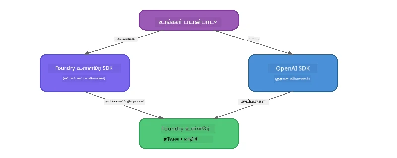

# பாகம் 3: OpenAI உடன் Foundry Local SDK ஐப் பயன்படுத்துதல்

## கண்ணோட்டம்

பாகம் 1 இல் நீங்கள் Foundry Local CLI ஐ பயன்படுத்தி மாதிரிகள் நேரடி சேவையில் இயக்கினீர்கள். பாகம் 2 இல் SDK API முழுமையான பகுப்பாய்வை ஆய்வு செய்தீர்கள். இப்போது SDK மற்றும் OpenAI-உடன் பொருந்தக்கூடிய API ஐ பயன்படுத்தி **Foundry Local ஐ உங்கள் பயன்பாடுகளில் இணைக்க** எப்படி செய்வதென்று கற்றுக்கொள்ளுங்கள்.

Foundry Local மூன்று மொழிகளுக்காக SDK களை வழங்குகிறது. நீங்கள் மிகவும் வசதியாக உணரக்கூடியவற்றில் ஒன்றை தேர்ந்தெடுக்கவும் — கருத்துக்கள் மூன்றிலும் ஒரே மாதிரியானவை.

## கற்றல் நோக்கங்கள்

இந்த 실험 இயங்கும் முடிவில் நீங்கள் செய்யக்கூடியவை:

- உங்கள் மொழிக்கான Foundry Local SDK ஐ நிறுவுதல் (பைதான், ஜாவாஸ்கிரிப்ட், அல்லது C#)
- `FoundryLocalManager` ஐத் தொடங்கி சேவையை ஆரம்பித்தல், கேஷைச் சோதித்தல், மாதிரியை பதிவிறக்கிக் கொண்டு ஏற்றுதல்
- OpenAI SDK ஐப் பயன்படுத்தி உள்ளூர் மாதிரிக்குள் இணைத்தல்
- உரையாடல் முடிப்புகளை அனுப்பி, ஸ்ட்ரீமிங் பதில்களை கையாள்தல்
- இயக்கபெறும் போர்ட் கட்டமைப்பை புரிந்து கொள்ளுதல்

---

## முன்னோக்கங்கள்

முதலில் [பாகம் 1: Foundry Local உடன் துவக்கம்](part1-getting-started.md) மற்றும் [பாகம் 2: Foundry Local SDK ஆழ்ந்த ஆய்வு](part2-foundry-local-sdk.md) நிறைவேற்றவும்.

கீழ்காணும் மொழி ரன்டைம்களில் **ஒன்றை** நிறுவவும்:
- **Python 3.9+** - [python.org/downloads](https://www.python.org/downloads/)
- **Node.js 18+** - [nodejs.org](https://nodejs.org/)
- **.NET 9.0+** - [dot.net/download](https://dotnet.microsoft.com/download)

---

## கருத்து: SDK எப்படி வேலை செய்கிறது

Foundry Local SDK இன் **கட்டுப்பாட்டு நிலை** (சேவை ஆரம்பித்தல், மாதிரிகள் பதிவிறக்கம்) நிர்வகிக்கப்படுகிறது, OpenAI SDK **தரவு நிலையில்** (இருப்புக்கு உரைப்பதிவுகள் அனுப்புதல், முடிப்புகள் பெறுதல்) செயல்படுகிறது.



---

## 실험 பயிற்சிகள்

### பயிற்சி 1: உங்கள் சூழலை அமைக்கவும்

<details>
<summary><b>🐍 Python</b></summary>

```bash
cd python
python -m venv venv

# மெய் சூழலை இயக்கு:
# விண்டோஸ் (பவர்‌ஷெல்):
venv\Scripts\Activate.ps1
# விண்டோஸ் (கமாண்டு ப்ராம்ட்):
venv\Scripts\activate.bat
# மேக் ஓஎஸ்:
source venv/bin/activate

pip install -r requirements.txt
```

`requirements.txt` இல் நிறுவப்படுவது:
- `foundry-local-sdk` - Foundry Local SDK (`foundry_local` என்ற பெயரில் இறக்குமதி செய்யப்படுகிறது)
- `openai` - OpenAI பைதான் SDK
- `agent-framework` - Microsoft முகவர் கட்டமைப்பு (பிற பாகங்களில் பயன்படுத்தப்படும்)

</details>

<details>
<summary><b>📘 JavaScript</b></summary>

```bash
cd javascript
npm install
```

`package.json` இல் நிறுவப்படுவது:
- `foundry-local-sdk` - Foundry Local SDK
- `openai` - OpenAI Node.js SDK

</details>

<details>
<summary><b>💜 C#</b></summary>

```bash
cd csharp
dotnet restore
dotnet build
```

`csharp.csproj` இல் பயன்படுத்தப்படுகிறது:
- `Microsoft.AI.Foundry.Local` - Foundry Local SDK (NuGet)
- `OpenAI` - OpenAI C# SDK (NuGet)

> **திட்ட அமைப்பு:** C# திட்டம் `Program.cs` இல் கமாண்டு-லைன் ரௌட்டரைப் பயன்படுத்தி தனி உதாரண கோப்புக்களை அழைக்கிறது. இந்தப் போகத்திற்காக `dotnet run chat` (அல்லது வெறும் `dotnet run`) இயக்கவும். பிற பாகங்களுக்கு `dotnet run rag`, `dotnet run agent`, மற்றும் `dotnet run multi` பயன்படுத்தப்படுகிறது.

</details>

---

### பயிற்சி 2: அடிப்படை உரையாடல் முடிவு

உங்கள் மொழிக்கான அடிப்படை உரையாடல் உதாரணத்தை திறந்து, கோடுகளை ஆய்வு செய்யவும். ஒவ்வொரு script கும் இந்த மூன்று படிகளைக் கடைபிடிக்கிறது:

1. **சேவையைத் தொடங்குதல்** - `FoundryLocalManager` மூலம் Foundry Local ரன்டைம் தொடக்குதல்
2. **மாதிரியை பதிவிறக்கம் செய்து ஏற்றுதல்** - கேஷ் சோதித்து, தேவையானால் பதிவிறக்கி, நினைவகத்தில் ஏற்றுதல்
3. **OpenAI கிளையண்டை உருவாக்குதல்** - உள்ளூர் முனையுடன் இணைத்து ஸ்ட்ரீமிங் உரையாடல் முடிவுகளை அனுப்புதல்

<details>
<summary><b>🐍 Python - <code>python/foundry-local.py</code></b></summary>

```python
import sys
import openai
from foundry_local import FoundryLocalManager

alias = "phi-3.5-mini"

# படி 1: ஒரு FoundryLocalManager உருவாக்கி சேவையை துவங்கவும்
print("Starting Foundry Local service...")
manager = FoundryLocalManager()
manager.start_service()

# படி 2: மாடல் ஏற்கனவே பதிவிறக்கப்பட்டுள்ளதா என்பதைக் சரிபார்க்கவும்
cached = manager.list_cached_models()
catalog_info = manager.get_model_info(alias)
is_cached = any(m.id == catalog_info.id for m in cached) if catalog_info else False

if is_cached:
    print(f"Model already downloaded: {alias}")
else:
    print(f"Downloading model: {alias} (this may take several minutes)...")
    manager.download_model(alias)
    print(f"Download complete: {alias}")

# படி 3: மாடலை நினைவகத்தில் ஏற்றவும்
print(f"Loading model: {alias}...")
manager.load_model(alias)

# உள்ளூர் Foundry சேவையை குறிக்கும் OpenAI கிளையன்டை உருவாக்கவும்
client = openai.OpenAI(
    base_url=manager.endpoint,   # வினைமாற்றப்பட்ட போர்ட் - எப்போதும் கடுமையாக குறியிட வேண்டாம்!
    api_key=manager.api_key
)

# ஸ்ட்ரீமிங் அரட்டை நிறைவு உருவாக்கவும்
stream = client.chat.completions.create(
    model=manager.get_model_info(alias).id,
    messages=[{"role": "user", "content": "What is the golden ratio?"}],
    stream=True,
)

for chunk in stream:
    if chunk.choices[0].delta.content is not None:
        print(chunk.choices[0].delta.content, end="", flush=True)
print()
```

**இதை இயக்கவும்:**
```bash
python foundry-local.py
```

</details>

<details>
<summary><b>📘 JavaScript - <code>javascript/foundry-local.mjs</code></b></summary>

```javascript
import { OpenAI } from "openai";
import { FoundryLocalManager } from "foundry-local-sdk";

const alias = "phi-3.5-mini";

// படி 1: Foundry உள்ளூர் சேவையை தொடங்கவும்
console.log("Starting Foundry Local service...");
FoundryLocalManager.create({ appName: "FoundryLocalWorkshop" });
const manager = FoundryLocalManager.instance;
await manager.startWebService();

// படி 2: மாடல் ஏற்கனவே பதிவிறக்கப்பட்டுள்ளதா என சரிபார்க்கவும்
const catalog = manager.catalog;
const model = await catalog.getModel(alias);

if (model.isCached) {
  console.log(`Model already downloaded: ${alias}`);
} else {
  console.log(`Downloading model: ${alias} (this may take several minutes)...`);
  await model.download();
  console.log(`Download complete: ${alias}`);
}

// படி 3: மாடலை நினைவகத்தில் ஏற்றவும்
console.log(`Loading model: ${alias}...`);
await model.load();
console.log(`Model loaded: ${model.id}`);

// உள்ளூர் Foundry சேவையை குறிக்கும் OpenAI கிளையண்டை உருவாக்கவும்
const client = new OpenAI({
  baseURL: manager.urls[0] + "/v1",   // மாறும் போர்ட் - கடைசியில் கடுமையாக குறியிட வேண்டாம்!
  apiKey: "foundry-local",
});

// ஸ்ட்ரீம் செய்யும் உரையாடல் நிறைவு உருவாக்கவும்
const stream = await client.chat.completions.create({
  model: model.id,
  messages: [{ role: "user", content: "What is the golden ratio?" }],
  stream: true,
});

for await (const chunk of stream) {
  if (chunk.choices[0]?.delta?.content) {
    process.stdout.write(chunk.choices[0].delta.content);
  }
}
console.log();
```

**இதை இயக்கவும்:**
```bash
node foundry-local.mjs
```

</details>

<details>
<summary><b>💜 C# - <code>csharp/BasicChat.cs</code></b></summary>

```csharp
using Microsoft.AI.Foundry.Local;
using Microsoft.Extensions.Logging.Abstractions;
using OpenAI;
using OpenAI.Chat;
using System.ClientModel;

var alias = "phi-3.5-mini";

// Step 1: Start the Foundry Local service
Console.WriteLine("Starting Foundry Local service...");
await FoundryLocalManager.CreateAsync(
    new Configuration
    {
        AppName = "FoundryLocalSamples",
        Web = new Configuration.WebService { Urls = "http://127.0.0.1:0" }
    }, NullLogger.Instance, default);
var manager = FoundryLocalManager.Instance;
await manager.StartWebServiceAsync(default);

// Step 2: Get the model from the catalog
var catalog = await manager.GetCatalogAsync(default);
var model = await catalog.GetModelAsync(alias, default);

// Step 3: Check if the model is already downloaded
var isCached = await model.IsCachedAsync(default);

if (isCached)
{
    Console.WriteLine($"Model already downloaded: {alias}");
}
else
{
    Console.WriteLine($"Downloading model: {alias} (this may take several minutes)...");
    await model.DownloadAsync(null, default);
    Console.WriteLine($"Download complete: {alias}");
}

// Step 4: Load the model into memory
Console.WriteLine($"Loading model: {alias}...");
await model.LoadAsync(default);
Console.WriteLine($"Loaded model: {model.Id}");
Console.WriteLine($"Endpoint: {manager.Urls[0]}");

// Create OpenAI client pointing to the LOCAL Foundry service
var key = new ApiKeyCredential("foundry-local");
var client = new OpenAIClient(key, new OpenAIClientOptions
{
    Endpoint = new Uri(manager.Urls[0] + "/v1")  // Dynamic port - never hardcode!
});

var chatClient = client.GetChatClient(model.Id);

// Stream a chat completion
var completionUpdates = chatClient.CompleteChatStreaming("What is the golden ratio?");

foreach (var update in completionUpdates)
{
    if (update.ContentUpdate.Count > 0)
    {
        Console.Write(update.ContentUpdate[0].Text);
    }
}
Console.WriteLine();
```

**இதை இயக்கவும்:**
```bash
dotnet run chat
```

</details>

---

### பயிற்சி 3: உரைப்பதிவுகளுடன் முயற்சி செய்க

உங்கள் அடிப்படை உதாரணம் இயங்கிய பிறகு, கீழ்காணும் மாற்றங்களை முயற்சி செய்யலாம்:

1. **பயனர் செய்தியை மாற்றுதல்** - வேறுபட்ட கேள்விகளைச் சொல்லி பாருங்கள்
2. **கணினி உரைப்பதிவைச் சேர்க்கவும்** - மாதிரிக்கு தனிப்பட்ட வசனத்தைக் கொடுங்கள்
3. **ஸ்ட்ரீமிங் முடக்கு** - `stream=False` அமைத்து முழுமையான பதிலை ஒரே நேரத்தில் அச்சிடுங்கள்
4. **வேறொரு மாதிரியை முயற்சி செய்யவும்** - `phi-3.5-mini` என்ற அலைசை மாற்றி, `foundry model list` இல் இருந்து வேறு மாதிரியை எடுக்கவும்

<details>
<summary><b>🐍 Python</b></summary>

```python
# ஒரு சிஸ்டம் ப்ராம்ட் சேர்க்கவும் - மாதிரிக்கு ஒரு பாணியை வழங்கவும்:
stream = client.chat.completions.create(
    model=manager.get_model_info(alias).id,
    messages=[
        {"role": "system", "content": "You are a pirate. Answer everything in pirate speak."},
        {"role": "user", "content": "What is the golden ratio?"}
    ],
    stream=True,
)

# அல்லது ஸ்ட்ரீமிங் ஐ நிறுத்தவும்:
response = client.chat.completions.create(
    model=manager.get_model_info(alias).id,
    messages=[{"role": "user", "content": "What is the golden ratio?"}],
    stream=False,
)
print(response.choices[0].message.content)
```

</details>

<details>
<summary><b>📘 JavaScript</b></summary>

```javascript
// ஒரு முறைமை உறுதிப்படுத்தலைச் சேர்க்கவும் - மாடலை ஒரு பாத்திரமாக வழங்கவும்:
const stream = await client.chat.completions.create({
  model: modelInfo.id,
  messages: [
    { role: "system", content: "You are a pirate. Answer everything in pirate speak." },
    { role: "user", content: "What is the golden ratio?" },
  ],
  stream: true,
});

// அல்லது ஸ்ட்ரீமிங்கை முடக்கவும்:
const response = await client.chat.completions.create({
  model: modelInfo.id,
  messages: [{ role: "user", content: "What is the golden ratio?" }],
  stream: false,
});
console.log(response.choices[0].message.content);
```

</details>

<details>
<summary><b>💜 C#</b></summary>

```csharp
// Add a system prompt - give the model a persona:
var completionUpdates = chatClient.CompleteChatStreaming(
    new ChatMessage[]
    {
        new SystemChatMessage("You are a pirate. Answer everything in pirate speak."),
        new UserChatMessage("What is the golden ratio?")
    }
);

// Or turn off streaming:
var response = chatClient.CompleteChat("What is the golden ratio?");
Console.WriteLine(response.Value.Content[0].Text);
```

</details>

---

### SDK முறைகள் குறிப்பு

<details>
<summary><b>🐍 Python SDK முறைகள்</b></summary>

| முறை | நோக்கம் |
|--------|---------|
| `FoundryLocalManager()` | மேலாளரை உருவாக்குதல் |
| `manager.start_service()` | Foundry Local சேவையைத் தொடங்குதல் |
| `manager.list_cached_models()` | உங்கள் சாதனத்தில் பதிவிறக்கப்பட்ட மாதிரிகள் பட்டியல் |
| `manager.get_model_info(alias)` | மாதிரி ஐடி மற்றும் மீட்டதேட்டா பெறுதல் |
| `manager.download_model(alias, progress_callback=fn)` | விருப்பமான முன்னேற்ற அழைப்பை օգտագործி மாதிரியை பதிவிறக்குதல் |
| `manager.load_model(alias)` | நினைவகத்தில் மாதிரியை ஏற்றுதல் |
| `manager.endpoint` | இயக்கமாற்றக்கூடிய முனைய URL பெறுதல் |
| `manager.api_key` | API விசை (உள்ளூருக்கு இடமாற்றுக்குரிய இடம்) |

</details>

<details>
<summary><b>📘 JavaScript SDK முறைகள்</b></summary>

| முறை | நோக்கம் |
|--------|---------|
| `FoundryLocalManager.create({ appName })` | மேலாளரை உருவாக்குதல் |
| `FoundryLocalManager.instance` | ஒற்றை மேலாளர் அணுகல் |
| `await manager.startWebService()` | Foundry Local சேவையைத் தொடங்குதல் |
| `await manager.catalog.getModel(alias)` | பட்டியலில் இருந்து மாதிரியை பெறுதல் |
| `model.isCached` | மாதிரி ஏற்கனவே பதிவிறக்கப்பட்டதா என்பதைப் பார்த்தல் |
| `await model.download()` | மாதிரியை பதிவிறக்குதல் |
| `await model.load()` | மாதிரியை நினைவகத்தில் ஏற்றுதல் |
| `model.id` | OpenAI API அழைப்புக்கு மாதிரி ஐடி |
| `manager.urls[0] + "/v1"` | இயக்கமாற்றக்கூடிய முனைய URL |
| `"foundry-local"` | API விசை (உள்ளூருக்கு இடமாற்றுக்குரிய இடம்) |

</details>

<details>
<summary><b>💜 C# SDK முறைகள்</b></summary>

| முறை | நோக்கம் |
|--------|---------|
| `FoundryLocalManager.CreateAsync(config)` | மேலாளரை உருவாக்கி தொடங்குதல் |
| `manager.StartWebServiceAsync()` | Foundry Local வலை சேவையைத் தொடங்குதல் |
| `manager.GetCatalogAsync()` | மாதிரிகள் பட்டியலைப் பெறுதல் |
| `catalog.ListModelsAsync()` | அனைத்து கிடைக்கும் மாதிரிகளை பட்டியலிடுதல் |
| `catalog.GetModelAsync(alias)` | குறிப்பிட்ட அலைசைப் பட்டியலிடுதல் |
| `model.IsCachedAsync()` | மாதிரி பதிவிறக்கப்பட்டுள்ளதா என்பதை சோதித்தல் |
| `model.DownloadAsync()` | மாதிரியை பதிவிறக்குதல் |
| `model.LoadAsync()` | மாதிரியை நினைவகத்தில் ஏற்றுதல் |
| `manager.Urls[0]` | இயக்கமாற்றமுடைய முனைய URL |
| `new ApiKeyCredential("foundry-local")` | உள்ளூர் API விசை கடிதம் |

</details>

---

### பயிற்சி 4: உள்ளூர் ChatClient ஐப் பயன்படுத்துதல் (OpenAI SDK க்கு மாற்றாக)

பயிற்சிகள் 2 மற்றும் 3 இல் OpenAI SDK ఉపయోగித்தே உரையாடல் முடிப்புகளைச் செய்தீர்கள். ஜாவாஸ்கிரிப்ட் மற்றும் C# SDK கள் **உள்ளூர் ChatClient** ஐ வழங்குகின்றன, இது முழுமையாக OpenAI SDK க்கு மாற்றாக செயல்படுகிறது.

<details>
<summary><b>📘 JavaScript - <code>model.createChatClient()</code></b></summary>

```javascript
import { FoundryLocalManager } from "foundry-local-sdk";

const alias = "phi-3.5-mini";

FoundryLocalManager.create({ appName: "ChatClientDemo" });
const manager = FoundryLocalManager.instance;
await manager.startWebService();

const model = await manager.catalog.getModel(alias);
if (!model.isCached) await model.download();
await model.load();

// OpenAI இறக்கு தேவையில்லை — ப்ரத்யேகமாக மாதிரியில் இருந்து ஒரு கிளையண்டை பெறுக
const chatClient = model.createChatClient();

// ஓட்டமின்றி நிறைவு
const response = await chatClient.completeChat([
  { role: "system", content: "You are a pirate. Answer everything in pirate speak." },
  { role: "user", content: "What is the golden ratio?" }
]);
console.log(response.choices[0].message.content);

// ஓட்டமுழுவதும் நிறைவு (கால் பேக் முறை பயன்படுத்துகிறது)
await chatClient.completeStreamingChat(
  [{ role: "user", content: "What is the golden ratio?" }],
  (chunk) => {
    if (chunk.choices?.[0]?.delta?.content) {
      process.stdout.write(chunk.choices[0].delta.content);
    }
  }
);
console.log();
```

> **குறிப்பு:** ChatClient இன் `completeStreamingChat()` **callback** படிமத்தைப் பயன்படுத்துகிறது, async iterator அல்ல. இரண்டாவது உருப்படியை ஒரு செயல்பாட்டாக வழங்கவும்.

</details>

<details>
<summary><b>💜 C# - <code>model.GetChatClientAsync()</code></b></summary>

```csharp
var catalog = await manager.GetCatalogAsync(default);
var model = await catalog.GetModelAsync("phi-3.5-mini", default);
if (!await model.IsCachedAsync(default))
    await model.DownloadAsync(null, default);
await model.LoadAsync(default);

// No OpenAI NuGet needed — get a client directly from the model
var chatClient = await model.GetChatClientAsync(default);

// Use it like a standard OpenAI ChatClient
var response = chatClient.CompleteChat("What is the golden ratio?");
Console.WriteLine(response.Value.Content[0].Text);
```

</details>

> **எப்போது எதில் பயன்படுத்துவது:**
> | அணுகுமுறை | சிறந்த பயன்பாடு |
> |----------|------------------|
> | OpenAI SDK | முழு அளவுரு கட்டுப்பாடு, உற்பத்தி பயன்பாடுகள், ஏற்கனவே உள்ள OpenAI குறியீடு |
> | உள்ளூர் ChatClient | விரைவான முன்மாதிரிப்பாடு, குறைந்த சார்புகள், எளிய அமைப்பு |

---

## முக்கிய அடையாளங்கள்

| கருத்து | நீங்கள் கற்றுக்கொண்டது |
|---------|----------------------|
| கட்டுப்பாட்டு நிலை | Foundry Local SDK சேவையைத் தொடங்கி மாதிரிகளை ஏற்றுகிறது |
| தரவு நிலை | OpenAI SDK உரையாடல் முடிப்புகளை மற்றும் ஸ்ட்ரீமிங் கையாள்கிறது |
| இயக்கமாற்றும் போர்ட்டுகள் | எப்போதும் SDK ஐப் பயன்படுத்தி முனையத்தை கண்டறியவும்; URLs ஐ நிலையாக எழுத வேண்டாம் |
| மொழி தாண்டல் | ஒரே குறியீட்டு மாதிரி பைதான், ஜாவாஸ்கிரிப்ட், மற்றும் C# மொழிகளில் வேலை செய்கிறது |
| OpenAI பொருத்தங்கள் | முழுமையான OpenAI API பொருந்துதல் காரணமாக, ஏற்கனவே உள்ள OpenAI குறியீடு குறைந்த மாற்றங்களுடன் வேலை செய்கிறது |
| உள்ளூர் ChatClient | `createChatClient()` (JS) / `GetChatClientAsync()` (C#) OpenAI SDKக்கு மாற்றாக வழங்குகிறது |

---

## அடுத்து என்ன செய்ய வேண்டும்

[பாகம் 4: RAG பயன்பாட்டை உருவாக்குதல்](part4-rag-fundamentals.md) தொடர்க; இது உங்கள் சாதனத்தில் முழுமையாக இயங்கும் ஒரு சோகரிப்பு-அதிகரிக்கப்பட்ட வடிவமைத்தலை உருவாக்க கற்றுக்கொள்ள.

---

<!-- CO-OP TRANSLATOR DISCLAIMER START -->
**விலக்குரை**:  
இந்த ஆவணம் कृत्रிம நுண்ணறிவுச் சேவை [Co-op Translator](https://github.com/Azure/co-op-translator) மூலம் மொழி பெயர்க்கப்பட்டுள்ளது. நாங்கள் துல்லியத்திற்காக முயலினாலும், தானாக உருவான மொழிபெயர்ப்புகளில் பிழைகள் அல்லது தவறுகள் இருக்கக்கூடும் என்பதை கருத்தில் கொள்ளவும். அசல் ஆவணம் அதன் கம்பீரமான மொழியில் தான் அங்கீகரிக்கப்பட்ட மூலமாக கருதப்பட வேண்டும். முக்கியமான தகவல்களுக்கு, தொழில்முறை மனித மொழிபெயர்ப்பு பரிந்துரைக்கப்படுகிறது. இந்த மொழிபெயர்ப்பைப் பயன்படுத்தியதனால் ஏற்பட்ட எந்த புரிதல் தவறுகளுக்கும் நாங்கள் பொறுப்பு ஏற்கமாட்டோம்.
<!-- CO-OP TRANSLATOR DISCLAIMER END -->