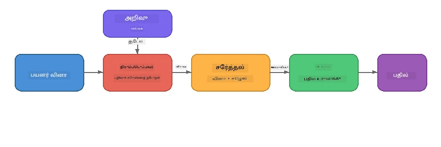

# பகுதி 4: Foundry Local உடன் RAG பயன்பாட்டை உருவாக்குதல்

## மேலோட்டம்

பெரிய மொழி மாதிரிகள் சக்திவாய்ந்தவை, ஆனால் அவை தங்கள் பயிற்சி தரவுகளில் இருந்ததை மட்டுமே அறிவது. **மறு பெறும் ஊக்கப்படுத்தப்பட்ட உருவாக்கம் (RAG)** இதனை தீர்க்கிறது - வினா நேரத்தில் தொடர்புடைய சூழலைக் கொடுக்கிறது - உங்கள் சொந்த ஆவணங்கள், தரவுத்தளங்கள் அல்லது அறிவுத்தளங்கள் மூலம் அழிக்கப்பட்டது.

இந்த ஆய்வகத்தில் நீங்கள் Foundry Local பயன்படுத்தி **முழுவதும் உங்கள் சாதனத்தில் இயங்கும்** முழு RAG குழாய்கலை உருவாக்குவீர்கள். எந்த மேக சேவைகளும் இல்லை, வெக்டர் தரவுத்தளங்களும் இல்லை, ஊக்கிவிட்டல் APIயும் இல்லை - வெறுமன் உள்ளூரான தேடலும் உள்ளூர் மாதிரியும் மட்டுமே.

## கற்றல் நோக்கங்கள்

இந்த ஆய்வகத்தின் முடிவில் நீங்கள் செய்யக்கூடியவை:

- RAG என்பது என்ன மற்றும் AI பயன்பாடுகளுக்கு ஏன் முக்கியம் என்பதை விளக்குதல்
- உரை ஆவணங்களிலிருந்து உள்ளூர் அறிவுத்தளத்தை உருவாக்குதல்
- தொடர்புடைய சூழலை கண்டுபிடிக்க எளிய தேடும் செயல்பாட்டை செயல்படுத்துதல்
- மீட்டெடுக்கப்பட்ட உண்மைகளில் மாதிரியை நிலைநிறுத்தும் ஒரு அமைப்பு ஊக்கத்தை உருவாக்குதல்
- முழு Retrieve → Augment → Generate குழாய்கலை சாதனத்தில் இயக்குதல்
- எளிய குறிச்சொல் தேடும் மற்றும் வெக்டர் தேடும் இடையேயான மாற்றிகள் புரிதல்

---

## முன்னெச்சரிக்கை

- [பகுதி 3: Foundry Local SDK ஐ OpenAI உடன் பயன்படுத்துதல்](part3-sdk-and-apis.md) முடிக்கவும்
- Foundry Local CLI நிறுவப்பட்டு `phi-3.5-mini` மாதிரி பதிவிறக்கம் செய்யப்பட்டுள்ளது

---

## கருத்து: RAG என்பது என்ன?

RAG இல்லாமல், ஒரு LLM அதன் பயிற்சி தரவிலேயே பதில் அளிக்க முடியும் - அது பழையதாகவும், பூரணமாக இல்லாததும், உங்கள் தனிப்பட்ட தகவல் இல்லாமலிருக்கக்கூடும்:

```
User: "What is Zava's return policy?"
LLM:  "I do not have information about Zava's return policy."  ← No context!
```

RAG உடன், நீங்கள் முதலில் தொடர்புடைய ஆவணங்களை **மீட்டெடுப்பீர்கள்**, பின்னர் அந்த சூழலை ஊக்கத்துடன் சேர்த்து **பதிலை உருவாக்குவீர்கள்**:



முக்கியத் திறப்பு: **மாதிரி "பதில் அறிந்திருக்க" தேவையில்லை; அதை சரியான ஆவணங்களை வாசிக்க வேண்டும் மட்டுமே.**

---

## லேப் பயிற்சிகள்

### பயிற்சி 1: அறிவுத்தளத்தை புரிந்துகொள்ளுதல்

உங்கள் மொழிக்கான RAG உதாரணத்தை திறந்து அறிவுத்தளத்தை பரிசீலிக்கவும்:

<details>
<summary><b>🐍 Python: <code>python/foundry-local-rag.py</code></b></summary>

அறிவுத்தளம் `title` மற்றும் `content` புலங்களுடன் எளிய அகராதி பட்டியலாக உள்ளது:

```python
KNOWLEDGE_BASE = [
    {
        "title": "Foundry Local Overview",
        "content": (
            "Foundry Local brings the power of Azure AI Foundry to your local "
            "device without requiring an Azure subscription..."
        ),
    },
    {
        "title": "Supported Hardware",
        "content": (
            "Foundry Local automatically selects the best model variant for "
            "your hardware. If you have an Nvidia CUDA GPU it downloads the "
            "CUDA-optimized model..."
        ),
    },
    # ... மேலும் பதிவுகள்
]
```

ஒவ்வொரு நுழைவும் ஒரு "துண்டு" அறிவை பிரதிநிதித்துவம் செய்கிறது - ஒரு பொருள் தொடர்பான கவனம் செலுத்தப்பட்ட piece.

</details>

<details>
<summary><b>📘 JavaScript: <code>javascript/foundry-local-rag.mjs</code></b></summary>

அறிவுத்தளம் பொருட்களின் வரிசையே போல அமைந்துள்ளது:

```javascript
const KNOWLEDGE_BASE = [
  {
    title: "Foundry Local Overview",
    content:
      "Foundry Local brings the power of Azure AI Foundry to your local " +
      "device without requiring an Azure subscription...",
  },
  {
    title: "Supported Hardware",
    content:
      "Foundry Local automatically selects the best model variant for " +
      "your hardware...",
  },
  // ... மேலும் உள்ளீடுகள்
];
```

</details>

<details>
<summary><b>💜 C#: <code>csharp/RagPipeline.cs</code></b></summary>

அறிவுத்தளம் பெயரிடப்பட்ட டியூபிள்ஸ் பட்டியலை பயன்படுத்துகிறது:

```csharp
private static readonly List<(string Title, string Content)> KnowledgeBase =
[
    ("Foundry Local Overview",
     "Foundry Local brings the power of Azure AI Foundry to your local " +
     "device without requiring an Azure subscription..."),

    ("Supported Hardware",
     "Foundry Local automatically selects the best model variant for " +
     "your hardware..."),

    // ... more entries
];
```

</details>

> **உண்மை பயன்பாட்டில்**, அறிவுத்தளம் கோப்புகள், தரவுத்தளம், தேடிய குறியீடு அல்லது API மூலம் வரும். இந்த ஆய்வகத்தில் எளிமைக்கும் நினைவக பட்டியலை மட்டுமே பயன்படுத்துகிறோம்.

---

### பயிற்சி 2: பெறும் செயல்பாட்டை புரிந்துகொள்ளுதல்

பெறும் விண்ணப்பம் பயனர் கேள்விக்கான தொடர்புடைய துண்டுகளை காண்கிறது. இந்த உதாரணம் **குறிச்சொல் ஒட்டுமொத்தம்** பயன்படுத்துகிறது - வினாவிலுள்ள சொற்கள் எத்தனை துண்டுகளிலும் தோன்றுகின்றன என்று எண்ணுகிறது:

<details>
<summary><b>🐍 Python</b></summary>

```python
def retrieve(query: str, top_k: int = 2) -> list[dict]:
    """Return the top-k knowledge chunks most relevant to the query."""
    query_words = set(query.lower().split())
    scored = []
    for chunk in KNOWLEDGE_BASE:
        chunk_words = set(chunk["content"].lower().split())
        overlap = len(query_words & chunk_words)
        scored.append((overlap, chunk))
    scored.sort(key=lambda x: x[0], reverse=True)
    return [item[1] for item in scored[:top_k]]
```

</details>

<details>
<summary><b>📘 JavaScript</b></summary>

```javascript
function retrieve(query, topK = 2) {
  const queryWords = new Set(query.toLowerCase().split(/\s+/));
  const scored = KNOWLEDGE_BASE.map((chunk) => {
    const chunkWords = new Set(chunk.content.toLowerCase().split(/\s+/));
    let overlap = 0;
    for (const w of queryWords) {
      if (chunkWords.has(w)) overlap++;
    }
    return { overlap, chunk };
  });
  scored.sort((a, b) => b.overlap - a.overlap);
  return scored.slice(0, topK).map((s) => s.chunk);
}
```

</details>

<details>
<summary><b>💜 C#</b></summary>

```csharp
private static List<(string Title, string Content)> Retrieve(string query, int topK = 2)
{
    var queryWords = new HashSet<string>(
        query.ToLowerInvariant().Split(' ', StringSplitOptions.RemoveEmptyEntries));

    return KnowledgeBase
        .Select(chunk =>
        {
            var chunkWords = new HashSet<string>(
                chunk.Content.ToLowerInvariant().Split(' ', StringSplitOptions.RemoveEmptyEntries));
            var overlap = queryWords.Intersect(chunkWords).Count();
            return (Overlap: overlap, Chunk: chunk);
        })
        .OrderByDescending(x => x.Overlap)
        .Take(topK)
        .Select(x => x.Chunk)
        .ToList();
}
```

</details>

**எப்படி வேலை செய்கிறது:**
1. வினாவை தனித்த வார்த்தைகளாக பிரி
2. ஒவ்வொரு அறிவுத்தள துண்டுக்கும், வினா வார்த்தைகள் எத்தனை துண்டில் தோன்றுகின்றன என்பதை எண்ணுக
3. ஒட்டுமொத்த மதிப்பெண் (மேலேயமாக முதலில்) மூலம் வரிசைப்படுத்துக
4. மிக முக்கியமான `top-k` துண்டுகளை திருப்பி வழங்குக

> **மாற்று:** குறிச்சொல் ஒட்டுமொத்தம் எளிமையானது ஆனால் வரம்பானது; இது உயிரென அர்த்தம் மற்றும் பொருள் புரியாது. உற்பத்தித் RAG அமைப்புகள், பொதுவாக **embedding வெக்டார்களும்** மற்றும் **வெக்டர் தரவுத்தளமும்** பயன்படுத்துகின்றன. இருப்பினும், குறிச்சொல் ஒட்டுமொத்தம் ஒரு சிறந்த துவக்கப்புள்ளியாகும், கூடுதல் சார்புப் பொருத்தங்கள் தேவையில்லை.

---

### பயிற்சி 3: ஊக்கப்பட்ட ஊக்கத்தை புரிந்துகொள்ளுதல்

மீட்டெடுக்கப்பட்ட சூழல் **கணினி ஊக்கத்தில்** பிணைக்கப்படுகிறது பின்னர் மாதிரிக்கு அனுப்பப்படுகிறது:

```python
system_prompt = (
    "You are a helpful assistant. Answer the user's question using ONLY "
    "the information provided in the context below. If the context does "
    "not contain enough information, say so.\n\n"
    f"Context:\n{context_text}"
)
```

முக்கிய வடிவமைத்தல் முடிவுகள்:
- **"முகாமளவில் வழங்கப்பட்டதல்லாமல் தகவல் மட்டும்"** - காரணமற்று மாதிரி உண்மைகளுக்கு புறக்கணிப்பதை தடுக்கும்
- **"சூழலில் போதுமான தகவல் இல்லையெனில் அதைக் கூறு"** - நேர்மையான "எனக்கு தெரியாது" பதிலை ஊக்குவிக்கும்
- சூழல் அனைத்து பதில்களையும் வடிவமைக்க கணினி செய்தியில் வைக்கப்படுகிறது

---

### பயிற்சி 4: RAG குழாய்கலை இயக்குதல்

முழு உதாரணத்தை இயக்கவும்:

**Python:**
```bash
cd python
python foundry-local-rag.py
```

**JavaScript:**
```bash
cd javascript
node foundry-local-rag.mjs
```

**C#:**
```bash
cd csharp
dotnet run rag
```

நீங்கள் மூன்று விஷயங்களை அச்சிடப் பார்க்க வேண்டும்:
1. கேள்வி
2. மீட்டெடுக்கப்பட்ட சூழல் - அறிவுத்தளத்திலிருந்து தேர்ந்தெடுக்கப்பட்ட துண்டுகள்
3. பதில் - அந்த சூழலை மட்டுமே பயன்படுத்தி மாதிரி உருவாக்கியது

உதாரண வெளியீடு:
```
Question: How do I install Foundry Local and what hardware does it support?

--- Retrieved Context ---
### Installation
On Windows install Foundry Local with: winget install Microsoft.FoundryLocal...

### Supported Hardware
Foundry Local automatically selects the best model variant for your hardware...
-------------------------

Answer: To install Foundry Local, you can use the following methods depending
on your operating system: On Windows, run `winget install Microsoft.FoundryLocal`.
On macOS, use `brew install microsoft/foundrylocal/foundrylocal`...
```

மாதிரி பதில் மீட்டெடுக்கப்பட்ட சூழலில் நல்லபடி **அடிப்படையேற்றப்பட்டுள்ளது** - அது அறிவுத்தள ஆவணங்களில் உள்ள விவரங்களை மட்டுமே குறிப்பிடுகிறது.

---

### பயிற்சி 5: பரிசோதனை மற்றும் விரிவாக்கம்

உங்கள் புரிதலை ஆழமாக்க இந்த மாற்றங்களை முயற்சிக்கவும்:

1. **கேள்வியை மாற்றுக** - அறிவுத்தளத்தில் உள்ள ஒரு கேள்வி மற்றும் இல்லாத ஒரு கேள்வியை கேளுங்கள்:
   ```python
   question = "What programming languages does Foundry Local support?"  # ← குறுந்தொடர்பில்
   question = "How much does Foundry Local cost?"                       # ← குறுந்தொடர்பில் இல்லை
   ```
   பதில் சூழலில் இல்லையெனில் மாதிரி சரியாக "எனக்கு தெரியாது" என தெரிவிக்குமா?

2. **புதிய அறிவுத் துண்டை சேர்க்கவும்** - `KNOWLEDGE_BASE`க்கு ஒரு புதிய நுழைவு சேர்க்கவும்:
   ```python
   {
       "title": "Pricing",
       "content": "Foundry Local is completely free and open source under the MIT license.",
   }
   ```
   பின்னர் விலையில் கேள்வி கேளுங்கள்.

3. **`top_k` மாற்றுக** - மேலும் அல்லது குறைவாக துண்டுகளை மீட்டெடுக்கவும்:
   ```python
   context_chunks = retrieve(question, top_k=3)  # கூடுதல் பகுதிகள்
   context_chunks = retrieve(question, top_k=1)  # குறைந்த பகுதிகள்
   ```
   எவ்வளவு சூழல் பதிலை எப்படி பாதிக்கின்றது?

4. **நிலைநிறுத்தும் அறிவுறுத்தலை அகற்று** - அமைப்பு ஊக்கத்தை "நீ ஒரு உதவி உதவியாளர்" என்று மாற்றி மாதிரி உண்மைகள் உருவாக்குவதை பார்க்கவும்.

---

## ஆழ்ந்த பகிர்வு: சாதனத்தில் RAG விருத்தி செய்யுதல்

சாதனத்தில் RAG இயக்குவது மேகத்தில் சமாளிக்க வேண்டிய கட்டுப்பாடுகளை கொண்டிருக்கிறது: கட்டுப்படுத்தப்பட்ட RAM, தனித்த GPU இல்லாமல் (CPU/NPU இயக்கு), மற்றும் சிறிய மாதிரி சூழல் ஜன்னல். கீழுள்ள வடிவமைப்பு முடிவுகள் நேரடியாக இக்கட்டுப்பாடுகளை சமாளிக்கின்றன மற்றும் Foundry Local கொண்டு உருவாக்கப்பட்ட உற்பத்தித் நிலை உள்ளூர் RAG பயன்பாடுகளின் மாதிரிகளின் அடிப்படையில் உள்ளது.

### துண்டாக்கும் தொழில்முறை: நிரந்தர அளவு ஸ்லைடிங் ஜன்னல்

துண்டாக்குதல் - ஆவணங்களை துண்டுகளாக எப்படி பிரிக்குவது என்பது எந்த RAG அமைப்பிலும் மிக முக்கிய முடிவாகும். சாதன நிலைச் சூழலுக்காக, **நிரந்தர அளவு, ஒன்றோடு ஒன்று திறக்கும் ஸ்லைடிங் ஜன்னல்** பரிந்துரைக்கப்படுகிறது:

| அளவுகோல் | பரிந்துரைக்கபட்ட மதிப்பு | காரணம் |
|-----------|-------------------------|----------|
| **துண்டின் அளவு** | ~200 குறியீட்டுகள் | மீட்டெடுக்கப்பட்ட சூழலைச் சிறியதாக வைத்திருக்கின்றது, Phi-3.5 Mini இன் சூழல் ஜன்னலில் கணினி ஊக்கு, உரையாடல் வரலாறு மற்றும் உருவாக்கிய வெளியீட்டிற்கான இடம் விடுகிறது |
| **ஒளிர்வு** | ~25 குறியீட்டுகள் (12.5%) | துண்டு எல்லைகளில் தகவல் இழப்பைத் தடுக்கும் - முறைகள் மற்றும் படி-படி வழிமுறைகளுக்கானது முக்கியம் |
| **குறியீட்டாக்கல்** | வெற்று இடம் பிரிப்பு | பூஜ்ய சார்புகள், எந்த குறியீட்டாக்கி நூலகமும் தேவையில்லை. எல்லா கணக்கிடும் பட்ஜெட்டும் LLMக்கு செல்லும் |

ஒளிர்வு ஸ்லைடிங் ஜன்னல் போல செயல்படுகிறது: ஒவ்வொரு புதிய துண்டும் முன்னைய துண்டு முடிந்த இடத்திற்கு 25 குறியீடு முன்பே துவங்குகிறது, ஆகவே பின்னடைவு சேரும் எதிரொலிகள் இரு துண்டுகளிலும் தோன்றும்.

> **ஏனென்று மற்ற தொழில்முறைகள் இல்லை?**
> - **வாக்கிய அடிப்படையிலான பிரிப்பு** செலவு செய்யப்படாத துண்டளவு அளவுகளை உருவாக்குகிறது; சில பாதுகாப்பு முறைகள் நீண்ட தன்வாக்கிகளாகும் மற்றும் பிரிக்க முடியாது
> - **பிரிவுகள் அறிந்த பிரிப்பு** (`##` தலைப்புகள்) மிக வேறுபட்ட துண்டளவுகளை உருவாக்குகிறது - சில சிறியவை, பல குழாய்க்கான சூழல் ஜன்னல் அளவுக்கு மிகப் பெரியவை
> - **அர்த்த நிறைந்த துண்டாக்குதல்** (embedding அடிப்படையிலான தலைப்பு கண்டறிதல்) சிறந்த மீட்டெடுக்கல் தரத்தை வழங்குகிறது, ஆனால் Phi-3.5 Mini உடன் நினைவகத்தில் இரண்டாவது மாதிரியை தேவைப்படுத்துகிறது - குறைந்தபட்ச 8-16 GB பகிர்ந்த நினைவகத்துடன் கூடிய கட்டமைப்பில் ஆபத்தானது

### மேம்பட்ட மீட்டெடுப்பு: TF-IDF வெக்டார்கள்

இந்த ஆய்வகத்தில் குறிச்சொல் ஒட்டுமொத்தம் வேலை செய்கிறது, ஆனால் embedding மாதிரியை சேர்த்துக்கொள்ளாமலேயே சிறந்த மீட்டெடுப்புக்கு, **TF-IDF (சொல் அதிர்ச்சித் தன்மை - முன்விவரம் வரிசை)** ஒரு சிறந்த நடுத்தரம் ஆகும்:

```
Keyword Overlap  →  TF-IDF Vectors  →  Embedding Models
    (this lab)     (lightweight upgrade)   (production)
  Simple & fast    Better ranking,         Best quality,
  No dependencies  still no ML model       requires embedding model
  ~Basic matching  ~1ms retrieval          ~100-500ms per query
```

TF-IDF ஒவ்வொரு துண்டையும், அந்த துண்டில் உள்ள ஒவ்வொரு வார்த்தையின் முக்கியத்துவத்தை *அனைத்து துண்டுகளுக்கும்தானே* அடிப்படையில் எண்களைப் பிரதிபலிக்கும். வினா நேரத்தில் கேள்வியும் அதே மாதிரியில் வெக்டராக மாற்றப்படுகிறது மற்றும் பிரகீட்டான இணக்கத்தை கொண்டு ஒப்பிடப்படுகிறது. இதை SQLite மற்றும் பரிசுத்தமான JavaScript/Python மூலம் செயல்படுத்தலாம் - எந்தவொரு வெக்டர் தரவுத்தளத்தையோ, embedding APIயையோ பயன்படுத்த வேண்டாம்.

> **செயல்திறன்:** TF-IDF கோசைன் ஒப்பீடு நிரந்தர அளவு துண்டுகளுக்கு சுமார் **1ms மீட்டெடுப்பு**, embedding மாதிரி ஒவ்வொரு வினாவையும் குறியாக்கிய போது 100-500ms ஆகும். 20+ ஆவணங்களையும் துண்டாக்கி குறியீடு செய்ய ஒரு விநாடிக்குள் முடியும்.

### கட்டுப்பட்ட சாதனங்களுக்கு எட்ஜ்/கிண்டான போது முறை

மிகக் குறைந்த வளங்கள் கொண்ட சாதனங்களில் (பழைய நோட்புக்குகள், டேப்லெட்டுகள், வயல் சாதனங்கள்) மூன்று அம்சங்களை குறைத்து வள பயன்பாட்டை குறைக்கலாம்:

| அமைப்பு | சாதாரண முறை | எட்ஜ்/கிண்டான முறை |
|---------|--------------|--------------------|
| **சிஸ்டம் ஊக்கு** | ~300 குறியீடு | ~80 குறியீடு |
| **அதிகபட்ச வெளியீடு குறியீடு** | 1024 | 512 |
| **மீட்டெடுக்கப்பட்ட துண்டுகள் (top-k)** | 5 | 3 |

குறைந்த துண்டுகள் மீட்டெடுப்பதால் மாதிரிக்கு பரிசீலிக்க குறைவான சூழல் இருப்பதால், சிலித்தலும் நினைவின் அழுத்தமும் குறையும். ஒரு சுருக்கமான கணினி ஊக்கு பதில் பெறுவதற்கான சூழல் ஜன்னலை அதிகமாக விடுகிறது. சாதனத்தில் எங்கு ஒவ்வொரு குறியீடும் கணக்கிடும் சாளரத்துக்குள் சேரும் அவசியமே முக்கியம்.

### ஒரு மாதிரி நினைவகத்தில்

சாதனத்தில் RAG-க்கு ஒரு மிக முக்கிய கொள்கை: **ஒரே மாதிரியை மட்டும் ஏற்றிக் கொள்**. மீட்டெடுப்புக்கு embedding மாதிரியைப் பயன்படுத்தினால் மற்றும் உருவாக்கத்துக்கு மொழி மாதிரியைப் பயன்படுத்தினால், கட்டுப்பட்ட NPU/RAM வளங்களை இரண்டு மாதிரிகளுக்கு பிரிக்கும். எளிய மீட்டெடுப்புகள் (குறிச்சொல் ஒட்டுமொத்தம், TF-IDF) இதனை முற்றிலும் தவிர்க்கிறது:

- LLM நினைவகத்துடன் embedding மாதிரி போட்டியிடவில்லை
- வேகமான தண்மை துவக்கம் - ஒரே மாதிரி ஏற்றப்படுகிறது
- கணிக்கத்தக்க நினைவக பயன்பாடு - LLMக்கு அனைத்து வளமும்
- குறைந்தது 8 GB RAM உடன் இயங்கும்

### உள்ளூர் வெக்டர் சேமிப்பிடமாக SQLite

சின்னத்-நடுத்தர ஆவண தொகுப்புகளுக்கு (நூறு முதல் ஆயிரங்களில் துண்டுகள்), **SQLite போதும்** கோசைன் ஒற்றுமை தேடுதலை நேரடியாய்அழுத்த முடியும்ஏற்கும், எந்தவொரு கட்டமைப்பும் வேண்டாம்:

- ஒரே `.db` கோப்பு - சர்வர் செயலி இல்லை, எந்தவொரு அமைப்பும் வேண்டாம்
- Python `sqlite3`, Node.js `better-sqlite3`, .NET `Microsoft.Data.Sqlite` போன்ற அனைத்து முக்கிய மொழி இயக்க நிகழ்படுத்துதல்களுடன் வருகிறது
- ஆவண துண்டுகளோடு TF-IDF வெக்டார்களையும் ஒரே அட்டவணையில் சேமிக்கிறது
- Pinecone, Qdrant, Chroma, FAISS போன்றவை இதுவரை தேவையில்லை

### செயல்திறன் சுருக்கம்

இந்த வடிவமைப்பு தேர்வுகள் பயனர்களின் சாதனத்தில் பதிலளிக்கும் RAG வழங்குகின்றன:

| கருவி | சாதனத்தில் செயல்திறன் |
|--------|----------------------|
| **மீட்டெடுக்கல் தாமதம்** | ~1ms (TF-IDF) முதல் ~5ms (குறிச்சொல் ஒட்டுமொத்தம்) |
| **உள்ளீடு வேகம்** | 20 ஆவணங்கள் துண்டாக்கப்பட்டு குறியீடாக்கி 1 விநாடிக்கு குறைவாக |
| **நினைவகத்தில் மாதிரிகள்** | 1 (LLM மட்டும் - embedding மாதிரி இல்லை) |
| **சேமிப்பு மேலதிகம்** | SQLite இல் துண்டுகள் + வெக்டார்களுக்கு < 1 MB |
| **தண்மை துவக்கம்** | ஒரே மாதிரி ஏற்றம், embedding ஓட்டுநர் தொடக்கம் இல்லை |
| **இயக்க நிலை** | 8 GB RAM, CPU மட்டுமே (GPU தேவையில்லை) |

> **எப்போது மேம்படுத்தவேண்டும்:** நூறுநூறு நீண்ட ஆவணங்கள், கலவையான உள்ளடக்கம் (அட்டவணைகள், குறியீடு, உரை), அல்லது வினாக்களுக்கு அர்த்த புரிதல் தேவைப்படும்போது embedding மாதிரியைச் சேர்த்து வெக்டர் ஒற்றுமை தேடுதலைப் பயன்படுத்த பரிந்துரைக்கப்படுகிறது. பெரும்பாலான உள்ளூரான பயன்பாடுகளுக்கு குறுகிய தொகுப்புகளுடன் TF-IDF + SQLite சிறந்த முடிவளிக்கும், மிகக் குறைந்த வள பயன்பாட்டுடன்.

---

## முக்கியக் கருத்துகள்

| கருத்து | விளக்கம் |
|---------|----------|
| **மீட்டெடுப்பு** | பயனர் வினாவுக்கு அடிப்படையாக அறிவுத்தளத்திலிருந்து தொடர்புடைய ஆவணங்களை காணுதல் |
| **ஊக்குவிப்பு** | மீட்டெடுக்கப்பட்ட ஆவணங்களை உரை ஊக்கத்தில் சொட்டு இடுதல் |
| **உருவாக்கம்** | வழங்கப்பட்ட சூழலின் அடிப்படையில் LLM பதிலை உருவாக்குகிறது |
| **துண்டாக்குதல்** | பெரிய ஆவணங்களை சிறிய, கவனம்சென்ற துண்டுகளாக பிரித்தல் |
| **நிலைநிறுத்தல்** | மாதிரியை வழங்கப்பட்ட சூழலை மட்டுமே பயன்படுத்த கட்டுப்படுத்தல் (அறிவூட்டலை குறைக்கிறது) |
| **Top-k** | மிகவும் தொடர்புடைய துண்டுகளின் எண்ணிக்கை |

---

## நீண்டத்தொடரில் RAG மற்றும் இந்த ஆய்வக உருப்படிகள்

| அம்சம் | இந்த ஆய்வகம் | சாதனத்திற்கு ஒழுங்குபடுத்தப்பட்ட | மேக உற்பத்தி |
|--------|-------------|----------------------------|--------------|
| **அறிவுத்தளம்** | நினைவகம் பட்டியல் | கோப்புகள், SQLite | தரவுத்தளம், தேடல் குறியீடு |
| **மீட்டெடுப்பு** | குறிச்சொல் ஒட்டுமொத்தம் | TF-IDF + கோசைன் ஒற்றுமை | வெக்டர் embedding + ஒற்றுமை தேடல் |
| **Embedding** | தேவையில்லை | தேவையில்லை - TF-IDF வெக்டார்கள் | embedding மாதிரி (உள்ளூர் அல்லது மேக) |
| **வெக்டர் சேமிப்பு** | தேவையில்லை | SQLite (ஒரே `.db` கோப்பு) | FAISS, Chroma, Azure AI Search, மற்றும் பிற |
| **துண்டாக்குதல்** | கைமுறையாக | நிரந்தர அளவு ஸ்லைடிங் ஜன்னல் (~200 குறியீட்டுகள், 25 குறியீடு ஒளிர்வு) | அர்த்த வழி அல்லது மறுபடியும் துண்டாக்குதல் |
| **நினைவகத்தில் மாதிரிகள்** | 1 (LLM) | 1 (LLM) | 2+ (embedding + LLM) |
| **ஈட்டும் தாமதம்** | ~5மி.வினாடி | ~1மி.வினாடி | ~100-500மி.வினாடி |
| **தரவு அளவு** | 5 ஆவணங்கள் | நூற்றுக்கணக்கான ஆவணங்கள் | மில்லியணக்கான ஆவணங்கள் |

இங்கே நீங்கள் கற்றுக்கொள்ளும் மாதிரிகளான (ஈடு, மேம்பாடு, உருவாகல்) எந்த அளவிலும் ஒன்றே. ஈடு முறையை மேம்படுத்துகிறார்கள், ஆனால் மொத்த கட்டமைப்பு ஒரே மாதிரிதான் இருக்கும். நடுத்தர स्तंभம் எளிதான தொழில்நுட்பங்களுடன் சாதனத்தில் எதைக் கைப்பற்ற முடியும் என்பதை காட்டுகிறது, இது பொதுவாக உள்ளூர் பயன்பாடுகளுக்கு சிறந்தது, நீங்கள் மேக அளவை தனியுரிமை, ஆஃப்லைன் திறன் மற்றும் வெளி சேவைகளுக்கு பூஜ்ஜிய தாமதத்துடன் மாற்றுகிறீர்கள்.

---

## முக்கியக் கட்டுரைகள்

| கருத்து | நீங்கள் கற்றுக்கொண்டது |
|---------|------------------|
| RAG மாதிரி | ஈடு + மேம்பாடு + உருவாக்கு: மாதிரிக்கு சரியான சூழலை கொடுத்து உங்கள் தரவுகள் குறித்த கேள்விகளுக்கு பதிலளிக்க முடியும் |
| சாதனத்தில் | எதுவும் மேக APIகளோ அல்லது வெக்டார் தரவுத்தள சந்தாக்களோ இல்லாமல் உள்ளூரில் இயங்கும் |
| அடித்தளக் கொள்கைகள் | மயக்கத்தை தடுக்க அமைப்புக் கூற்று கட்டுப்பாடுகள் அவசியம் |
| திறன்கோல் ஒத்திசைவு | எளிமையான ஆனால் விளைவான தொடக்க புள்ளி ஈட்டுப்பதிவுக்கு |
| TF-IDF + SQLite | எந்த நுழைவு மாதிரியும் இல்லாமல் 1மி.வினாடிக்கு கீழ் ஈடு வைத்துக்கொள்ளும் எளிதான மேம்பாட்டு வழி |
| ஒரே மாதிரி நினைவகம் | கட்டுப்பட்ட உபகரணங்களில் LLM உடன் கொடுக்கல் மாதிரியை ஏற்றுவது தவிர்க்கவும் |
| துண்டு அளவு | சுமார் 200 குறியீடுகள் ஒத்திசைவுடன் ஈடு துல்லியமும் உள்ளடக்க நுட்பத்தையும் சமநிலைப்படுத்துகிறது |
| எட்ஜ்/நெருக்கமான முறை | மிகவும் கட்டுப்பட்ட சாதனங்களுக்கு குறைந்த துண்டுகள் மற்றும் குறுகிய கேள்விகள் பயன்படுத்தவும் |
| உலகளாவிய மாதிரி | அதே RAG கட்டமைப்பு எந்த தரவுகளுக்கும் பொருந்தும்: ஆவணங்கள், தரவுத்தளங்கள், APIகள் அல்லது விக்கிகள் |

> **முழுமையான சாதனத்தில் இயங்கும் RAG பயன்பாட்டை பார்க்க விரும்புகிறீர்களா?** [Gas Field Local RAG](https://github.com/leestott/local-rag) ஐ பார்க்கவும், Foundry Local மற்றும் Phi-3.5 Mini உடன் உருவாக்கப்பட்ட தயாரிப்பு-தரமான ஆஃப்லைன் RAG முகவர் இது, உண்மையான ஆவண தொகுப்புடன் இந்த உத்தேச ஆட்சி மாதிரிகளை காட்டுகிறது.

---

## அடுத்த படிகள்

[பகுதி 5: செயற்கை நுண்ணறிவு முகவர்களை உருவாக்குதல்](part5-single-agents.md) ஆக தொடரவும், Microsoft Agent Framework பயன்படுத்தி நுண்ணறிவு முகவர்களை உருவாக்குவது, பண்பு, அறிவுறுத்தல்கள் மற்றும் பல-தேர்வு உரையாடல்களை கற்றுக்கொள்ள.

---

<!-- CO-OP TRANSLATOR DISCLAIMER START -->
**எச்சரிக்கை**:
இந்த ஆவணம் [Co-op Translator](https://github.com/Azure/co-op-translator) என்ற செயற்கை நுண்ணறிவு மொழி மொழிபெயர்ப்பு சேவையை பயன்படுத்தி மொழிபெயர்க்கப்பட்டுள்ளது. ந்ரூப்தலுக்கு முயற்சித்தாலும், தானியங்கி மொழிபெயர்ப்பில் தவறுகள் அல்லது தவறான தகவல்கள் இருக்கக்கூடும் என்பதை தயவுசெய்து கவனிக்கவும். அதன் தாய்மொழியில் உள்ள அசல் ஆவணம் அதிகாரப்பூர்வ மூலமாக கருதப்பட வேண்டும். முக்கியமான தகவல்களுக்கு, தொழில்முறை மனித மொழிபெயர்ப்பு பரிந்துரைக்கப்படுகிறது. இந்த மொழிபெயர்ப்பைப் பயன்படுத்தியதால் ஏற்படும் எந்தவொரு தவறான புரிதல்களுக்கோ அல்லது தவறான கருத்துகளுக்கோ எங்களுக்கு பொறுப்பு இல்லை.
<!-- CO-OP TRANSLATOR DISCLAIMER END -->