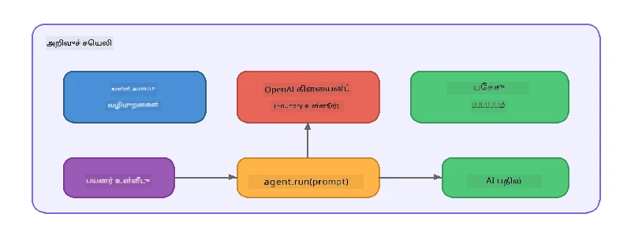

# பகுதி 5: ஏஜென்ட் ஃபிரேம்வொர்க்குடன் AI ஏஜென்ட்களை கட்டியமைத்தல்

> **நோக்கம்:** உள்ளூர்மாதிரி மூலம் இயக்கி, Foundry Local வழியாக நீடித்த வழிமுறைகளும் குறிப்பிட்ட தனிப்பட்ட தன்மையும் கொண்ட உங்கள் முதல் AI ஏஜெண்ட்டை கட்டியமைக்கவும்.

## AI ஏஜெண்ட் என்றால் என்ன?

AI ஏஜெண்ட் ஒரு மொழி மாதிரியை அதன் நடத்தை, தனிமை மற்றும் கட்டுப்பாடுகளை வரையறுக்கும் **கணினி வழிமுறைகள்** உடன் திறம்பட கட்டும். ஒரே உரையாடல் நிறைவு அழைப்பை விட, ஒரு ஏஜெண்ட்:

- **தனிமை** - தெளிவான அடையாளம் ("நீங்கள் உதவியாளர் கோட் பரிசீலகராக இருக்கிறீர்கள்")
- **இரக்கை** - உரையாடல் வரலாறு பல முறைச்சுழற்சிகளில்
- **திறமைமிக்க தன்மை** - நன்கு வடிவமைக்கப்பட்ட கணினி வழிமுறைகள் மூலம் இயக்கப்படும் குறுக்குவிழுப்பான நடத்தை



---

## Microsoft ஏஜெண்ட் ஃபிரேம்வொர்க்கு

**Microsoft Agent Framework** (AGF) பல்வேறு மாதிரி பின்னணிகளுக்கு பொருந்தும் ஒரு தரமான ஏஜெண்ட் உறுப்போலியை வழங்குகிறது. இந்த பணிமனையில், Foundry Local உடன் இணைத்து அனைத்தும் உங்கள் இயந்திரத்தில் இயங்கும் - மேக சேவை தேவையில்லை.

| கருத்து | விவரம் |
|---------|-------------|
| `FoundryLocalClient` | Python: சேவை துவக்கம், மாதிரி பதிவிறக்கம்/ஏற்றுதல் மற்றும் ஏஜெண்ட்களை உருவாக்குகிறது |
| `client.as_agent()` | Python: Foundry Local கிளையண்டில் இருந்து ஏஜெண்ட் உருவாக்குகிறது |
| `AsAIAgent()` | C#: `ChatClient` க்கு விரிவுரு முறையாக உள்ளது - `AIAgent` உருவாக்குகிறது |
| `instructions` | ஏஜெண்ட் நடத்தை வடிவமைக்கும் கணினி குறிப்பு |
| `name` | மனுஷர்களுக்கு வாசிக்க கூடிய பெயர், பல ஏஜெண்ட் சூழ்நிலைகளில் பயனுள்ளது |
| `agent.run(prompt)` / `RunAsync()` | பயனர் செய்தியை அனுப்பி, ஏஜெண்ட்டின் பதிலை திரும்பத் தருகிறது |

> **குறிப்பு:** ஏஜெண்ட் ஃபிரேம்வொர்க்கு Python மற்றும் .NET SDKகளுடன் உள்ளது. JavaScriptக்கானது OpenAI SDKயைப் பயன்படுத்தி அதே முறையை பிரதிபலிக்கும் ஒரு எளிய `ChatAgent` வகுப்பை நம்மால் அமல்படுத்தியுள்ளோம்.

---

## பயிற்சிகள்

### பயிற்சி 1 - ஏஜெண்ட் மாதிரியை புரிந்துகொள்ளுதல்

கோடுகள் எழுதுவதற்கு முன்னர், ஏஜெண்டின் முக்கிய கூறுகளை ஆராயவும்:

1. **மாதிரி கிளையண்ட்** - Foundry Local இன் OpenAI-போன்ற APIயுடன் இணைக்கிறது
2. **கணினி வழிமுறைகள்** - "தனிமை" குறிப்பு
3. **நடவடிக்கை சுழற்சி** - பயனர் உள்ளீட்டை அனுப்பு, வெளியீடு பெறுக

> **ஆலோசிக்கவும்:** கணினி வழிமுறைகளும் சாதாரண பயனர் செய்தியும் எப்படி வேறுபடுகின்றன? அவை மாற்றப்பட்டால் என்ன நடக்கும்?

---

### பயிற்சி 2 - ஒரு ஏஜெண்ட் உதாரணம் இயக்குதல்

<details>
<summary><strong>🐍 Python</strong></summary>

**முன்னுரிமைகள்:**
```bash
cd python
python -m venv venv

# விண்டோசுகள் (PowerShell):
venv\Scripts\Activate.ps1
# மேக் ஓஎஸ்:
source venv/bin/activate

pip install -r requirements.txt
```

**இயக்கு:**
```bash
python foundry-local-with-agf.py
```

**கோடு விளக்கம்** (`python/foundry-local-with-agf.py`):

```python
import asyncio
from agent_framework_foundry_local import FoundryLocalClient

async def main():
    alias = "phi-4-mini"

    # FoundryLocalClient சேவை தொடக்கம், மாதிரி பதிவிறக்கம் மற்றும் ஏற்றலை கையாள்கிறது
    client = FoundryLocalClient(model_id=alias)
    print(f"Client Model ID: {client.model_id}")

    # அமைப்பு அறிவுரைகளுடன் ஒரு முகவரியை உருவாக்கு
    agent = client.as_agent(
        name="Joker",
        instructions="You are good at telling jokes.",
    )

    # ஓடவில்லை-ஒட்டுமொழிதல்: முடிந்த பதிலை ஒரே நேரத்தில் பெறுக
    result = await agent.run("Tell me a joke about a pirate.")
    print(f"Agent: {result}")

    # ஒட்டுமொழிதல்: உருவாக்கப்பட்டவுடன் விளைவுகளைப் பெறுக
    async for chunk in agent.run("Tell me another joke.", stream=True):
        if chunk.text:
            print(chunk.text, end="", flush=True)

asyncio.run(main())
```

**முக்கிய அம்சங்கள்:**
- `FoundryLocalClient(model_id=alias)` சேவை துவக்கம், பதிவிறக்கம் மற்றும் மாதிரி ஏற்றுதலை ஒரே கட்டத்தில் கையாள்கிறது
- `client.as_agent()` கணினி வழிமுறைகள் மற்றும் பெயர் உடன் ஏஜெண்ட் உருவாக்குகிறது
- `agent.run()` இரு ஆதரவையும் பின்பற்றுகிறது: ஸ்ட்ரீமிங் மற்றும் அல்லாத ஸ்ட்ரீமிங்
- `pip install agent-framework-foundry-local --pre` மூலம் நிறுவவும்

</details>

<details>
<summary><strong>📦 JavaScript</strong></summary>

**முன்னுரிமைகள்:**
```bash
cd javascript
npm install
```

**இயக்கு:**
```bash
node foundry-local-with-agent.mjs
```

**கோடு விளக்கம்** (`javascript/foundry-local-with-agent.mjs`):

```javascript
import { OpenAI } from "openai";
import { FoundryLocalManager } from "foundry-local-sdk";

class ChatAgent {
  constructor({ client, modelId, instructions, name }) {
    this.client = client;
    this.modelId = modelId;
    this.instructions = instructions;
    this.name = name;
    this.history = [];
  }

  async run(userMessage) {
    const messages = [
      { role: "system", content: this.instructions },
      ...this.history,
      { role: "user", content: userMessage },
    ];
    const response = await this.client.chat.completions.create({
      model: this.modelId,
      messages,
    });
    const assistantMessage = response.choices[0].message.content;

    // பல முறைகள் உரையாடல்களுக்கு உரையாடல் வரலாற்றைப் பாதுகாக்கவும்
    this.history.push({ role: "user", content: userMessage });
    this.history.push({ role: "assistant", content: assistantMessage });
    return { text: assistantMessage };
  }
}

async function main() {
  FoundryLocalManager.create({ appName: "FoundryLocalWorkshop" });
  const manager = FoundryLocalManager.instance;
  await manager.startWebService();

  const catalog = manager.catalog;
  const model = await catalog.getModel("phi-3.5-mini");
  if (!model.isCached) {
    console.log("Downloading model: phi-3.5-mini...");
    await model.download();
  }
  await model.load();

  const client = new OpenAI({
    baseURL: manager.urls[0] + "/v1",
    apiKey: "foundry-local",
  });

  const agent = new ChatAgent({
    client,
    modelId: model.id,
    instructions: "You are good at telling jokes.",
    name: "Joker",
  });

  const result = await agent.run("Tell me a joke about a pirate.");
  console.log(result.text);
}

main();
```

**முக்கிய அம்சங்கள்:**
- JavaScript தனக்கென Python AGF மாதிரியை பிரதிபலிக்கும் `ChatAgent` வகுப்பை உருவாக்குகிறது
- `this.history` பல முறை சுற்று ஆதரவுக்கு உரையாடல் தடங்களை சேமிக்கிறது
- தெளிவான `startWebService()` → கேஷ் சோதனை → `model.download()` → `model.load()` முழு வெளிப்பாடுகளுடன் உள்ளது

</details>

<details>
<summary><strong>💜 C#</strong></summary>

**முன்னுரிமைகள்:**
```bash
cd csharp
dotnet restore
```

**இயக்கு:**
```bash
dotnet run agent
```

**கோடு விளக்கம்** (`csharp/SingleAgent.cs`):

```csharp
using Microsoft.AI.Foundry.Local;
using Microsoft.Extensions.Logging.Abstractions;
using Microsoft.Agents.AI;
using OpenAI;
using System.ClientModel;

// 1. Start Foundry Local and load a model
var alias = "phi-3.5-mini";
await FoundryLocalManager.CreateAsync(
    new Configuration
    {
        AppName = "FoundryLocalSamples",
        Web = new Configuration.WebService { Urls = "http://127.0.0.1:0" }
    }, NullLogger.Instance, default);
var manager = FoundryLocalManager.Instance;
await manager.StartWebServiceAsync(default);

var catalog = await manager.GetCatalogAsync(default);
var model = await catalog.GetModelAsync(alias, default);

var isCached = await model.IsCachedAsync(default);
if (!isCached)
{
    Console.WriteLine($"Downloading model: {alias}...");
    await model.DownloadAsync(null, default);
}
await model.LoadAsync(default);

var key = new ApiKeyCredential("foundry-local");
var client = new OpenAIClient(key, new OpenAIClientOptions
{
    Endpoint = new Uri(manager.Urls[0] + "/v1")
});

// 2. Create an AIAgent using the Agent Framework extension method
AIAgent joker = client
    .GetChatClient(model.Id)
    .AsAIAgent(
        instructions: "You are good at telling jokes. Keep your jokes short and family-friendly.",
        name: "Joker"
    );

// 3. Run the agent (non-streaming)
var response = await joker.RunAsync("Tell me a joke about a pirate.");
Console.WriteLine($"Joker: {response}");

// 4. Run with streaming
await foreach (var update in joker.RunStreamingAsync("Tell me another joke."))
{
    Console.Write(update);
}
```

**முக்கிய அம்சங்கள்:**
- `AsAIAgent()` `Microsoft.Agents.AI.OpenAI` இன் விரிவுரு முறை - தனிப்பட்ட `ChatAgent` வகுப்பு தேவையில்லை
- `RunAsync()` முழு பதிலை திருப்புகிறது; `RunStreamingAsync()` ஒவ்வொரு குறியீட்டையும் ஒளிபரப்பும்
- `dotnet add package Microsoft.Agents.AI.OpenAI --version 1.0.0-rc3` மூலம் நிறுவவும்

</details>

---

### பயிற்சி 3 - தனிமையை மாற்றவும்

ஏஜெண்டின் `instructions` ஐ மாற்றி வேறுபட்ட தனிமையுடன் உருவாக்கவும். ஒவ்வொன்றையும் முயற்சி செய்து வெளியீடு எப்படி மாறுகிறது என்று கவனிக்கவும்:

| தனிமை | வழிமுறைகள் |
|---------|-------------|
| கோட் பரிசீலகர் | `"நீங்கள் அனுபவசாலி கோட் பரிசீலகர். வாசிப்புக்கு எளிதானது, செயல்திறன், மற்றும் துல்லியத்துக்கு மையமாக கூர்மையான கருத்துக்களை கொடுங்கள்."` |
| பயண வழிகாட்டி | `"நீங்கள் நட்பு மயமான பயண வழிகாட்டி. இடங்கள், நடவடிக்கைகள் மற்றும் உள்ளூர் உணவுக்கான தனிப்பட்ட பரிந்துரைகளை வழங்குங்கள்."` |
| சோக்ரட்டிக் ஆசிரியர் | `"நீங்கள் சோக்ரட்டிக் ஆசிரியர். நேரடியான பதில்களை ஒருபோதும் கொடுக்கவேண்டாம் - பதிலாக, மாணவரை ஆழமான கேள்விகளால் வழிநடத்துங்கள்."` |
| தொழில்நுட்ப எழுத்தாளர் | `"நீங்கள் தொழில்நுட்ப எழுத்தாளர். கருத்துக்களை தெளிவாகவும் சுருக்கமாகவும் விளக்குங்கள். எடுத்துக்காட்டுகளைப் பயன்படுத்துங்கள். தொழில்நுட்ப வார்த்தைகளை தவிர்க்கவும்."` |

**செய்ய:**
1. மேல் அட்டவணையில் இருந்து ஒரு தனிமையை தேர்ந்தெடுக்கவும்
2. கோடில் `instructions` குறியை மாற்றவும்
3. பயனர் கேள்வியை அதற்கு ஏற்ப சரிசெய்யவும் (எ.கா. கோட் பரிசீலகரை ஒரு செயல்பாட்டை பரிசீலிக்க கேளுங்கள்)
4. உதாரணத்தை மீண்டும் இயக்கி வெளியீட்டை ஒப்பிடவும்

> **குறிப்பு:** ஏஜெண்டின் தரம் வழிமுறைகளின் மேல் பெரிதும் சார்ந்தது. குறிப்பாக நன்கு வடிவமைக்கப்பட்ட வழிமுறைகள் தெளிவான விளைவுகளை வழங்கும்.

---

### பயிற்சி 4 - பல முறை உரையாடல் சேர்க்கவும்

ஏஜெண்டுடன் பின்வரும் உரையாடலை அனுமதிக்கும் பன்முறை உரையாடல் சுழற்சியை விரிவாக்கவும்.

<details>
<summary><strong>🐍 Python - பன்முறை சுழற்சி</strong></summary>

```python
import asyncio
from agent_framework_foundry_local import FoundryLocalClient

async def main():
    client = FoundryLocalClient(model_id="phi-4-mini")

    agent = client.as_agent(
        name="Assistant",
        instructions="You are a helpful assistant.",
    )

    print("Chat with the agent (type 'quit' to exit):\n")
    while True:
        user_input = input("You: ")
        if user_input.strip().lower() in ("quit", "exit"):
            break
        result = await agent.run(user_input)
        print(f"Agent: {result}\n")

asyncio.run(main())
```

</details>

<details>
<summary><strong>📦 JavaScript - பன்முறை சுழற்சி</strong></summary>

```javascript
import { OpenAI } from "openai";
import { FoundryLocalManager } from "foundry-local-sdk";
import * as readline from "node:readline/promises";

// (பயிற்சி 2 இலிருந்து ChatAgent வகுப்பை மீண்டும் பயன்படுத்தவும்)

async function main() {
  FoundryLocalManager.create({ appName: "FoundryLocalWorkshop" });
  const manager = FoundryLocalManager.instance;
  await manager.startWebService();

  const catalog = manager.catalog;
  const model = await catalog.getModel("phi-3.5-mini");
  if (!model.isCached) {
    console.log("Downloading model: phi-3.5-mini...");
    await model.download();
  }
  await model.load();

  const client = new OpenAI({
    baseURL: manager.urls[0] + "/v1",
    apiKey: "foundry-local",
  });

  const agent = new ChatAgent({
    client,
    modelId: model.id,
    instructions: "You are a helpful assistant.",
    name: "Assistant",
  });

  const rl = readline.createInterface({
    input: process.stdin,
    output: process.stdout,
  });

  console.log("Chat with the agent (type 'quit' to exit):\n");
  while (true) {
    const userInput = await rl.question("You: ");
    if (["quit", "exit"].includes(userInput.trim().toLowerCase())) break;
    const result = await agent.run(userInput);
    console.log(`Agent: ${result.text}\n`);
  }
  rl.close();
}

main();
```

</details>

<details>
<summary><strong>💜 C# - பன்முறை சுழற்சி</strong></summary>

```csharp
using Microsoft.AI.Foundry.Local;
using Microsoft.Extensions.Logging.Abstractions;
using Microsoft.Agents.AI;
using OpenAI;
using System.ClientModel;

var alias = "phi-3.5-mini";
var config = new Configuration
{
    AppName = "FoundryLocalSamples",
    Web = new Configuration.WebService { Urls = "http://127.0.0.1:0" }
};
await FoundryLocalManager.CreateAsync(config, NullLogger.Instance, default);
var manager = FoundryLocalManager.Instance;
await manager.StartWebServiceAsync(default);

var catalog = await manager.GetCatalogAsync(default);
var model = await catalog.GetModelAsync(alias, default);

var isCached = await model.IsCachedAsync(default);
if (!isCached)
{
    Console.WriteLine($"Downloading model: {alias}...");
    await model.DownloadAsync(null, default);
}
await model.LoadAsync(default);

var key = new ApiKeyCredential("foundry-local");
var client = new OpenAIClient(key, new OpenAIClientOptions
{
    Endpoint = new Uri(manager.Urls[0] + "/v1")
});

AIAgent agent = client
    .GetChatClient(model.Id)
    .AsAIAgent(
        instructions: "You are a helpful assistant.",
        name: "Assistant"
    );

Console.WriteLine("Chat with the agent (type 'quit' to exit):\n");
while (true)
{
    Console.Write("You: ");
    var userInput = Console.ReadLine();
    if (string.IsNullOrWhiteSpace(userInput) ||
        userInput.Equals("quit", StringComparison.OrdinalIgnoreCase) ||
        userInput.Equals("exit", StringComparison.OrdinalIgnoreCase))
        break;

    var result = await agent.RunAsync(userInput);
    Console.WriteLine($"Agent: {result}\n");
}
```

</details>

ஏஜெண்ட் முந்தைய தடங்களை நினைவில் வைத்திருக்கிறான் என்பதை கவனியுங்கள் - தொடர்ச்சியான கேள்விகளை கேட்கவும் மற்றும் உரையாடல் தொடர்பு தொடர்கிறது.

---

### பயிற்சி 5 - கட்டமைக்கப்பட்ட வெளியீடு

ஏஜெண்டை எப்போதும் ஒரு குறிப்பிட்ட வடிவத்தில் (எ.கா. JSON) பதில் அளிக்க வழிமொழியுங்கள் மற்றும் முடிவை பகுப்பாய்வு செய்யுங்கள்:

<details>
<summary><strong>🐍 Python - JSON வெளியீடு</strong></summary>

```python
import asyncio
import json
from agent_framework_foundry_local import FoundryLocalClient

async def main():
    client = FoundryLocalClient(model_id="phi-4-mini")

    agent = client.as_agent(
        name="SentimentAnalyzer",
        instructions=(
            "You are a sentiment analysis agent. "
            "For every user message, respond ONLY with valid JSON in this format: "
            '{"sentiment": "positive|negative|neutral", "confidence": 0.0-1.0, "summary": "brief reason"}'
        ),
    )

    result = await agent.run("I absolutely loved the new restaurant downtown!")
    print("Raw:", result)

    try:
        parsed = json.loads(str(result))
        print(f"Sentiment: {parsed['sentiment']} (confidence: {parsed['confidence']})")
    except json.JSONDecodeError:
        print("Agent did not return valid JSON - try refining the instructions.")

asyncio.run(main())
```

</details>

<details>
<summary><strong>💜 C# - JSON வெளியீடு</strong></summary>

```csharp
using System.Text.Json;

AIAgent analyzer = chatClient.AsAIAgent(
    name: "SentimentAnalyzer",
    instructions:
        "You are a sentiment analysis agent. " +
        "For every user message, respond ONLY with valid JSON in this format: " +
        "{\"sentiment\": \"positive|negative|neutral\", \"confidence\": 0.0-1.0, \"summary\": \"brief reason\"}"
);

var response = await analyzer.RunAsync("I absolutely loved the new restaurant downtown!");
Console.WriteLine($"Raw: {response}");

try
{
    var parsed = JsonSerializer.Deserialize<JsonElement>(response.ToString());
    Console.WriteLine($"Sentiment: {parsed.GetProperty("sentiment")} " +
                      $"(confidence: {parsed.GetProperty("confidence")})");
}
catch (JsonException)
{
    Console.WriteLine("Agent did not return valid JSON - try refining the instructions.");
}
```

</details>

> **குறிப்பு:** சிறிய உள்ளூர்மாதிரிகள் எப்பொழுதும் சரியான JSON உருவாக்க மாட்டார்கள். வழிமுறைகளில் ஒரு எடுத்துக்காட்டு சேர்த்து எதிர்பார்க்கும் வடிவத்தை மிகவும் தெளிவாக குறிப்பிடுவதன் மூலம் நம்பகத்தன்மையை மேம்படுத்தலாம்.

---

## முக்கியப் பாடங்கள்

| கருத்து | நீங்கள் கற்றுக்கொண்டது |
|---------|-----------------|
| ஏஜெண்ட் மற்றும் நேரடி LLM அழைப்பு | ஏஜெண்ட் வழிமுறைகள் மற்றும் இரக்கையுடன் மாதிரியை படைக்கிறது |
| கணினி வழிமுறைகள் | ஏஜெண்ட் நடத்தை கட்டுப்படுத்த மிக முக்கியமான рычаг |
| பன்முறை உரையாடல் | ஏஜெண்ட்கள் பல பயனர் தொடர்புக்களில் சூழலை முறைப்படுத்த முடியும் |
| கட்டமைக்கப்பட்ட வெளியீடு | வழிமுறைகள் வெளியீட்டு வடிவம் (JSON, மார்க்டவுன், முதலியன) கட்டாயம்செய்யலாம் |
| உள்ளூரில் இயக்கம் | அனைத்தும் Foundry Local வழியாக சாதனத்தில் இயக்கப்படும் - மேக சேவை தேவையில்லை |

---

## அடுத்த படிகள்

**[பகுதி 6: பல ஏஜெண்ட் பணி திட்டங்கள்](part6-multi-agent-workflows.md)** இல், பல ஏஜெண்ட்களை ஒருங்கிணைந்த குழாய்க்குள் சேர்த்து ஒவ்வொரு ஏஜெண்டுக்கும் தனித்துண்டு வழிக்காட்டல் வழங்கப்படும்.

---

<!-- CO-OP TRANSLATOR DISCLAIMER START -->
**செய்தியியல்**:  
இந்த ஆவணம் AI மொழிபெயர்ப்பு சேவை [Co-op Translator](https://github.com/Azure/co-op-translator) பயன்படுத்தி மொழிபெயர்க்கப்பட்டது. நாங்கள் துல்லியத்துக்காக முயற்சி செய்கிறோம் என்றாலும், தானாக மொழிபெயர்ப்பதில் பிழைகள் அல்லது தவறுகள் இருக்கலாம் என்பதை தயவுசெய்து கவனிக்கவும். அதன் சொந்த மொழியில் உள்ள அசல் ஆவணம் அதிகாரப்பூர்வ மூலமாக கருதப்பட வேண்டும். முக்கியமான தகவலுக்காக, தொழில்முறை மனித மொழிபெயர்ப்பு பரிந்துரைக்கப்படுகிறது. இந்த மொழிபெயர்ப்பைப் பயன்படுத்தியதனால் ஏற்படும் எந்தப் புரிதல் தவறுகளுக்கும் நாங்கள் பொறுப்பில்லை.
<!-- CO-OP TRANSLATOR DISCLAIMER END -->