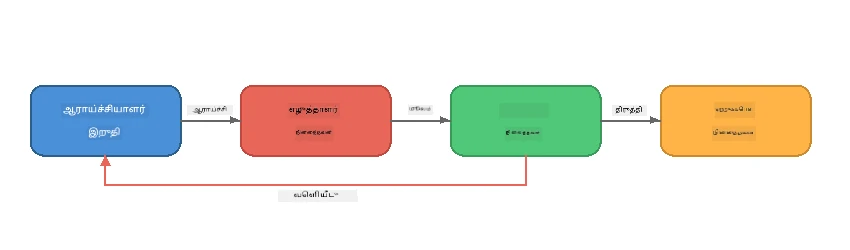
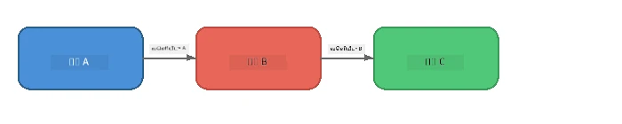
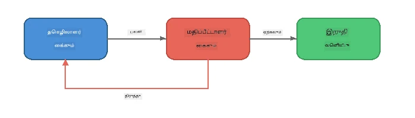
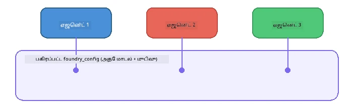

# பகுதி 6: பல-ஏஜென்ட் பணிக் தொழில்முறை

> **நோக்கம்:** பல வல்லுணர்வு கொண்ட ஏஜென்ட் களை ஒருங்கிணைந்த குழுக்களாக இணைத்து, கூட்டு ஏஜென்ட் களிடையே சிக்கலான பணிகளை வகுப்பியல்படுத்துதல் - எல்லாம் Foundry Local மூலம் உள்ளூராக இயங்கும்.

## ஏன் பல-ஏஜென்ட்?

ஒரே ஏஜென்ட் பல பணிகளை கையாள முடியும், ஆனால் சிக்கலான பணித்தொடர்வுகளுக்கு **திறவுனைமை** பயனுள்ளதாக இருக்கிறது. ஒரே ஏஜென்ட் உடனடியாக ஆராய்ச்சி, எழுதுதல், மற்றும் தொகுத்தலை முயற்சிப்பதற்குப் பதிலாக, பணியை கவனமாக தொகுத்த பங்களிப்பாளர்களாக பிரிக்கிறீர்கள்:



| மாதிரி | விளக்கம் |
|---------|-------------|
| **ஒற்றை தவறான** | ஏஜென்ட் A வெளியீடு ஏஜென்ட் B → ஏஜென்ட் C க்கு போடும் |
| **கருத்து பின்னூட்டச் சங்கிலி** | ஒரு மதிப்பாய்வாளர் ஏஜென்ட் திருத்தங்களுக்கு பணியை திருப்பி அனுப்பலாம் |
| **பகிர்ந்த உரைநிலை** | அனைத்து ஏஜென்ட்களும் ஒரே மாதிரி/எண்ட்பாயின்ட் பயன்படுத்துகின்றன, ஆனால் வேறுபட்ட அறிவுறுத்தல்கள் |
| **வகை வகுத்த வெளியீடு** | ஏஜென்ட் கள் கட்டமைக்கப்பட்ட முடிவுகளைக் (JSON) உருவாக்குகின்றன, நம்பகமுடைய இடமாற்றங்களுக்காக |

---

## பயிற்சிகள்

### பயிற்சி 1 - பல-ஏஜென்ட் குழுக்களை இயக்குக

பணிமண்டபத்தில் முழுமையான ஆராய்ச்சியாளர் → எழுத்தாளர் → தொகுப்பாளர் பணித்தொடர் உள்ளது.

<details>
<summary><strong>🐍 பைதான்</strong></summary>

**தயார் செய்தல்:**
```bash
cd python
python -m venv venv

# விண்டோஸ் (பவர்‌ஷெல்):
venv\Scripts\Activate.ps1
# மேக் ஓஎஸ்:
source venv/bin/activate

pip install -r requirements.txt
```

**இயக்கு:**
```bash
python foundry-local-multi-agent.py
```

**என்ன நடக்கிறது:**
1. **ஆராய்ச்சியாளர்** ஒரு தலைப்பை பெறும் மற்றும் புள்ளிவிவர தகவல்களை திருப்பியளிக்கும்
2. **எழுத்தாளர்** ஆராய்ச்சியை எடுத்துக்கொண்டு ஒரு வலைப்பதிவு (3-4 பத்திகள்) வடிவமைக்கிறது
3. **தொகுப்பாளர்** கட்டுரையின் தரத்தை மதிப்பாய்ந்து ACCEPT அல்லது REVISE க்கு பதிலளிக்கிறான்

</details>

<details>
<summary><strong>📦 ஜாவாஸ்கிரிப்ட்</strong></summary>

**தயார் செய்தல்:**
```bash
cd javascript
npm install
```

**இயக்கு:**
```bash
node foundry-local-multi-agent.mjs
```

**அதே மூன்று நிலை குழு** - ஆராய்ச்சியாளர் → எழுத்தாளர் → தொகுப்பாளர்.

</details>

<details>
<summary><strong>💜 C#</strong></summary>

**தயார் செய்தல்:**
```bash
cd csharp
dotnet restore
```

**இயக்கு:**
```bash
dotnet run multi
```

**அதே மூன்று நிலை குழு** - ஆராய்ச்சியாளர் → எழுத்தாளர் → தொகுப்பாளர்.

</details>

---

### பயிற்சி 2 - குழுவின் அமைப்பு

ஏஜென்ட் கள் எப்படி வரையறுக்கப்பட்டு இணைக்கப்பட்டுள்ளன என்பதைக் கற்றுக்கொள்ளுங்கள்:

**1. பகிர்ந்த மாதிரி கிளையன்ட்**

அனைத்து ஏஜென்ட் களும் ஒரே Foundry Local மாதிரியைப் பகிர்ந்துகொள்கின்றன:

```python
# Python - FoundryLocalClient அனைத்து செயல்களையும் செய்கிறது
from agent_framework_foundry_local import FoundryLocalClient

client = FoundryLocalClient(model_id="phi-3.5-mini")
```

```javascript
// JavaScript - Foundry உள்ளூர் நோக்கி திறந்த OpenAI SDK
const client = new OpenAI({
  baseURL: manager.urls[0] + "/v1",
  apiKey: "foundry-local",
});
```

```csharp
// C# - OpenAIClient pointed at Foundry Local
var key = new ApiKeyCredential("foundry-local");
var client = new OpenAIClient(key, new OpenAIClientOptions
{
    Endpoint = new Uri(manager.Urls[0] + "/v1")
});
var chatClient = client.GetChatClient(model.Id);
```

**2. சிறப்பு அறிவுறுத்தல்கள்**

ஒவ்வொரு ஏஜென்ட் களுக்கும் தனித்துவமான பாத்திரம் உள்ளது:

| ஏஜென்ட் | அறிவுறுத்தல்கள் (சுருக்கம்) |
|-------|----------------------|
| ஆராய்ச்சியாளர் | "முக்கிய தகவல்கள், புள்ளிவிவரங்கள் மற்றும் பின்னணி வழங்கவும். புள்ளிமுறைகளாக ஒழுங்குசெய்யவும்." |
| எழுத்தாளர் | "ஆராய்ச்சி குறிப்புகளிலிருந்து 3-4 பத்திகள் கொண்ட ஈர்க்கக்கூடிய வலைப்பதிவை எழுதவும். தவறான தகவலை கண்டறிய வேண்டாம்." |
| தொகுப்பாளர் | "தெளிவு, இலக்கணம் மற்றும் உண்மை துல்லியத்திற்காக மதிப்பாய்வு செய்யவும். தீர்வு: ACCEPT அல்லது REVISE." |

**3. ஏஜென்ட் களுக்கு இடையேயான தரவு ஓடைகள்**

```python
# படி 1 - ஆராய்ச்சியாளரின் வெளியீடு எழுத்தாளர் உள்ளீடாக மாறுகிறது
research_result = await researcher.run(f"Research: {topic}")

# படி 2 - எழுத்தாளரின் வெளியீடு திருத்துநரின் உள்ளீடாக மாறுகிறது
writer_result = await writer.run(f"Write using:\n{research_result}")

# படி 3 - திருத்துநர் ஆராய்ச்சியும் கட்டுரையும் இரண்டும் பார்வையிடுகிறார்
editor_result = await editor.run(
    f"Research:\n{research_result}\n\nArticle:\n{writer_result}"
)
```

```csharp
// C# - same pattern, async calls with AIAgent
var researchNotes = await researcher.RunAsync(
    $"Research the following topic and provide key facts:\n{topic}");

var draft = await writer.RunAsync(
    $"Write a blog post based on these research notes:\n\n{researchNotes}");

var verdict = await editor.RunAsync(
    $"Review this article for quality and accuracy.\n\n" +
    $"Research notes:\n{researchNotes}\n\n" +
    $"Article:\n{draft}");
```

> **முக்கிய অন্তர்காட்சி:** ஒவ்வொரு ஏஜென்டும் முந்தைய ஏஜென்ட்களிடம் இருந்து பெறப்பட்ட இணைந்த உரையைக் பெறும். தொகுப்பாளர் உண்மை ஒப்புமையைச் சரிபார்க்க, ஆராய்ச்சி மற்றும் வரைவு இரண்டையும் பார்க்கிறது.

---

### பயிற்சி 3 - நான்காவது ஏஜென்டை சேர்க்கவும்

ஒரு புதிய ஏஜென்டை இணைத்து குழுவை நீட்டிக்கவும். ஒன்றை தேர்வு செய்யவும்:

| ஏஜென்ட் | நோக்கம் | அறிவுறுத்தல்கள் |
|-------|---------|-------------|
| **வாஸ்தவச் சரிபார்த்தாளர்** | கட்டுரையில் உள்ள கூற்றுகளை சரிபார்க்க | `"நீங்கள் வాస్తவ கூற்றுகளை உறுதிப்படுத்துகிறீர்கள். ஒவ்வொரு கூற்றிற்கும் ஆராய்ச்சி குறிப்புகளைப் பொறுத்தவரை ஆதரவு உள்ளது என்பதை கூறுங்கள். சரிபார்க்கப்பட்ட/சரிபார்க்கப்படாத பொருட்களை JSON ஆக திருப்பி வழங்குங்கள்."` |
| **தலைப்பு எழுத்தாளர்** | பளபளக்கும் தலைப்புகளை உருவாக்குக | `"கட்டுரைக்கு 5 தலைப்பு விருப்பங்களை உருவாக்கவும். விதிமுறைகளை மாற்றவும்: தகவல், கிளிக் பேட்டு, கேள்வி, பட்டியல், உணர்ச்சி நிறைந்தது."` |
| **சோசியல் மீடியா** | பிரச்சாரம் செய்யும் பதிவுகளை உருவாக்குக | `"இந்த கட்டுரையை விளம்பரப்படுத்த 3 சமூக ஊடக பதிவுகளை உருவாக்கவும்: ஒரு ட்விட்டர் (280 எழுத்துகள்), ஒரு லிங்க்டின் (தொழில்முறை மொத்தம்), ஒரு இன்ஸ்டாகிராம் (எமோஜியுடன் சீரியல்லாத)." ` |

<details>
<summary><strong>🐍 பைதான் - தலைப்பு எழுத்தாளர் சேர்க்கும்</strong></summary>

```python
headline_agent = client.as_agent(
    name="HeadlineWriter",
    instructions=(
        "You are a headline specialist. Given an article, generate exactly "
        "5 headline options. Vary the style: informative, question-based, "
        "listicle, emotional, and provocative. Return them as a numbered list."
    ),
)

# ஆசிரியர் ஒப்புக் கொண்ட பிறகு, தலைப்புகளை உருவாக்கவும்
headline_result = await headline_agent.run(
    f"Generate headlines for this article:\n\n{writer_result}"
)
print(f"\n--- Headlines ---\n{headline_result}")
```

</details>

<details>
<summary><strong>📦 ஜாவாஸ்கிரிப்ட் - தலைப்பு எழுத்தாளர் சேர்க்கும்</strong></summary>

```javascript
const headlineAgent = new ChatAgent({
  client,
  modelId: modelInfo.id,
  instructions:
    "You are a headline specialist. Given an article, generate exactly " +
    "5 headline options. Vary the style: informative, question-based, " +
    "listicle, emotional, and provocative. Return them as a numbered list.",
  name: "HeadlineWriter",
});

const headlineResult = await headlineAgent.run(
  `Generate headlines for this article:\n\n${writerResult.text}`
);
console.log(`\n--- Headlines ---\n${headlineResult.text}`);
```

</details>

<details>
<summary><strong>💜 C# - தலைப்பு எழுத்தாளர் சேர்க்கும்</strong></summary>

```csharp
AIAgent headlineAgent = chatClient.AsAIAgent(
    name: "HeadlineWriter",
    instructions:
        "You are a headline specialist. Given an article, generate exactly " +
        "5 headline options. Vary the style: informative, question-based, " +
        "listicle, emotional, and provocative. Return them as a numbered list."
);

// After the editor accepts, generate headlines
var headlines = await headlineAgent.RunAsync(
    $"Generate headlines for this article:\n\n{draft}");
Console.WriteLine($"\n--- Headlines ---\n{headlines}");
```

</details>

---

### பயிற்சி 4 - உங்கள் சொந்த பணித்தொடரை வடிவமைக்கவும்

வேறு துறைக்கு பல-ஏஜென்ட் குழுவை வடிவமைக்கவும். சில எண்ணங்கள் கீழே:

| துறை | ஏஜென்ட் கள் | ஓடை |
|--------|--------|------|
| **கோடு மதிப்பாய்வு** | பகுப்பாய்வாளர் → மதிப்பாய்வாளர் → சுருக்கவியல் | கோடு அமைப்பைக் பகுப்பாய்வு செய்து → பிரச்சனைகளை மதிப்பாய்வு செய்து → சுருக்க அறிக்கையை தயாரி |
| **வாடிக்கையாளர் ஆதரவு** | வகைப்பாளர் → பதிலளிப்பவர் → தர வகுப்பாளர் | டிக்கெட்டை வகைப்படுத்து → பதிலை வரைவு செய் → தரத்தை பரிசீலனை செய் |
| **கல்வி** | வினா உருவாக்கி → மாணவர் சீர்திருத்தி → மதிப்பளிப்பவர் | வினாக்களை உருவாக்கு → பதில்களை பூட்டி → மதிப்பிட்டு விளக்குகின்றன |
| **தரவு பகுப்பு** | பொருள் விளக்கி → பகுப்பாய்வாளர் → அறிக்கையாளர் | தரவு கோரிக்கையை பகுப்பாய்வு செய் → மாதிரிகள் அலசு → அறிக்கை எழுது |

**நடைமுறைகள்:**
1. தனித்துவமான `அறிவுறுத்தல்கள்` கொண்ட 3+ ஏஜென்ட் களை வரையறு
2. தரவு ஓடையை தீர்மானி - ஒவ்வொரு ஏஜென்டும் என்ன பெறும் மற்றும் உருவாக்கும்?
3. பயிற்சி 1-3 இலிருந்து மாதிரிகளை பயன்படுத்தி குழுவை செயல்படுத்து
4. ஒரு ஏஜெண்ட் மற்றொன்றின் பணியை மதிப்பாய்வு செய்யுமானால், கருத்துப்பின்னூட்டச் சங்கிலியைச் சேர்க்கவும்

---

## ஒருங்கிணைப்பு மாதிரிகள்

உலகத் தனியாக எந்த பல ஏஜென்ட் அமைப்புக்கும் பொருந்தும் ஒருங்கிணைப்பு மாதிரிகள் இங்கே (முழுமையாக [பகுதி 7](part7-zava-creative-writer.md) இல் ஆராயப்படுகிறது):

### ஒற்றை தவறான குழு



ஒவ்வொரு ஏஜென்டும் முந்தைய ஒருவரின் வெளியீட்டை செயலாக்குகின்றது. எளிதானதும் கணிப்பானதும்.

### கருத்துப்பின்னூட்ட சங்கிலி



ஒரு மதிப்பாய்வாளர் ஏஜென்ட் முன்னாள் நிலைகளை மீண்டும் இயக்க முடியும். Zava எழுத்தாளர் இதைப் பயன்படுத்துகிறது: தொகுப்பாளர் ஆராய்ச்சியாளருக்கும் எழுத்தாளருக்கும் கருத்துக்களை அனுப்ப முடியும்.

### பகிர்ந்த உரைநிலை



எல்லா ஏஜென்ட் களும் ஒரே `foundry_config` ஐ பகிர்ந்து ஒரே மாதிரி மற்றும் எண்ட்பாயின்ட்டைப் பயன்படுத்துகின்றன.

---

## முக்கியக் குறிப்புகள்

| கருத்து | நீங்கள் கற்றுக்கொண்டது |
|---------|-----------------|
| ஏஜென்ட் திறவுநிலை | ஒவ்வொரு ஏஜென்ட் கூடுதல் கவனிப்புடன் ஒரு பணியைச் செய்கின்றது |
| தரவு இடமாற்றங்கள் | ஒருவரின் வெளியீடு அடுத்து வரும் ஒருவரின் உள்ளீடாக மாறும் |
| கருத்துப்பின்னூட்ட சங்கிலிகள் | ஒரு மதிப்பாய்வாளர் உயர் தரத்துக்கு மீண்டும் முயற்சிகளைத் தொடங்கக்கூடும் |
| கட்டமைக்கப்பட்ட வெளியீடு | JSON வடிவமைக்கப்பட்ட பதில்கள் நம்பகமான ஏஜென்ட்-ஏஜென்ட் தொடர்பை எளிதாக்கும் |
| ஒருங்கிணைப்பு | ஒருங்கிணைப்பான் குழு வரிசை மற்றும் பிழை கையாளலை நிர்வகிக்கின்றான் |
| செயல்படுத்தும் மாதிரிகள் | [பகுதி 7: Zava Creative Writer](part7-zava-creative-writer.md) இல் பயன்பாட்டுக்குரியவை |

---

## அடுத்த படிகள்

[பகுதி 7: Zava Creative Writer - Capstone Application](part7-zava-creative-writer.md) தொடரவும், அங்குள்ள உற்பத்தி-நிலையான பல-ஏஜென்ட் செயலியை ஆராயவும் - 4 சிறப்புப் ஏஜென்ட் கள், ஸ்டிரீமிங் வெளியீடு, பொருள் தேடல் மற்றும் கருத்துப்பின்னூட்ட சங்கிலிகள் உடன், Python, JavaScript, மற்றும் C# இல் கிடைக்கிறது.

---

<!-- CO-OP TRANSLATOR DISCLAIMER START -->
**பாதுகாப்பு அறிக்கை**:  
இந்த ஆவணம் AI மொழிபெயர்ப்பு சேவை [Co-op Translator](https://github.com/Azure/co-op-translator) பயன்படுத்தி மொழிபெயர்க்கப்பட்டுள்ளது. நாங்கள் துல்லியத்திற்காக முயற்சித்தாலும், தானியங்கி மொழிபெயர்ப்புகளில் பிழைகள் அல்லது தவறுகள் இருக்கக்கூடும் என்பதை நினைவில் கொள்ளவும். மூல ஆவணம் அதன் மூல மொழியில் அதிகாரப்பூர்வமான ஆதாரமாக கருதப்பட வேண்டும். முக்கிய தகவல்களுக்கு, தொழில்முறை மனித மொழிபெயர்ப்பு பரிந்துரைக்கப்படுகிறது. இந்த மொழிபெயர்ப்பின் பயன்பாட்டில் ஏற்படும் எந்தவொரு தவறறிவிப்பும் அல்லது தவறான பொருளுறுத்துதலுக்கு நாங்கள் பொறுப்பேற்போம் என்பதில்லை.
<!-- CO-OP TRANSLATOR DISCLAIMER END -->