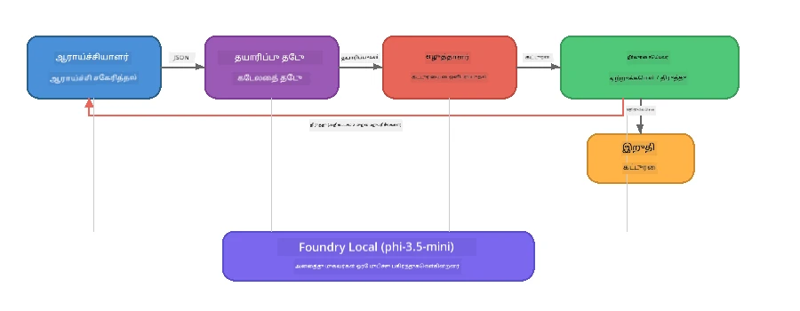

# பகுதி 7: Zava Creative Writer - இறுதிப் பயன்பாடு

> **நோக்கம்:** நான்கு சிறப்பிக்கப்பட்ட முகவர்கள் magazine-தரமான கட்டுரைகளை உருவாக்க ஒருங்கிணைந்து செயல்படும் உற்பத்தி மாதிரி பன்முகவர் பயன்பாட்டை ஆராய்வது - இது Foundry Local மூலம் உங்கள் சாதனத்தில் முழுமையாக இயங்குகிறது.

இது கருத்தரங்கின் **இறுதிப் பயிற்சி தளம்** ஆகும். இது நீங்கள் கற்றுக்கொண்ட அனைத்தையும் ஒருங்கிணைக்கிறது - SDK ஒருங்கிணைவு (பகுதி 3), உள்ளூர் தரவிலிருந்து மீட்பு (பகுதி 4), முகவர் தனித்துவங்கள் (பகுதி 5), மற்றும் பன்முகவர் ஒருங்கிணைவு (பகுதி 6) - முழுமையான பயன்பாட்டில் **Python**, **JavaScript**, மற்றும் **C#** மொழிகளில் கிடைக்கிறது.

---

## நீங்கள் ஆராய்வது

| கருத்து | Zava Writer இல் எங்கு |
|---------|----------------------------|
| 4 படி மாதிரி ஏற்றுதல் | பகிரப்பட்ட வடிவமைப்பு தொகுப்பு Foundry Local-ஐ ஆரம்பிக்கிறது |
| RAG முறை மீட்பு | தயாரிப்பு முகவர் உள்ளூர் பட்டியலை தேடுகிறது |
| முகவர் சிறப்பு | 4 வித்தியாசமான சிஸ்டம் தூண்டுதல்களுடன் முகவர்கள் |
| தொடர்ச்சியான வெளியீடு | எழுத்தாளர் நேரடி நேரத்தில் டோக்கன்களை வழங்குகிறான் |
| அமைப்புச் சிறந்த மாற்றங்கள் | ஆய்வாளர் → JSON, ஆசிரியர் → JSON முடிவு |
| கருத்து ஊர்திகள் | ஆசிரியர் மீண்டும் இயக்கத்தை தூண்ட முடியும் (அதிகபட்சம் 2 முறைகள்) |

---

## கட்டமைப்பு

Zava Creative Writer **தொகுத்து-வோலை ஒருங்கிணைப்பு மற்றும் மதிப்பாய்வாளர் ஊக்குவிப்புடன்** பயன்படுத்துகிறது. மூன்று மொழி நடைமுறைகளும் ஒரே கட்டமைப்பை பின்பற்றுகின்றன:



### நான்கு முகவர்கள்

| முகவர் | உள்ளீடு | வெளியீடு | நோக்கம் |
|---------|-------|---------|----------|
| **ஆய்வாளர்** | தலைப்பு + விருப்பமான கருத்து | `{"web": [{url, name, description}, ...]}` | LLM மூலம் பின்னணித் திரட்டல் செயல் |
| **தயாரிப்பு தேடல்** | தயாரிப்பு சூழல் உரை | பொருத்தமான தயாரிப்புகளின் பட்டியல் | LLM உருவாக்கிய கேள்விகள் + உள்ளூர் பட்டியலில் முக்கிய வார்த்தை தேடல் |
| **எழுத்தாளர்** | ஆய்வு + தயாரிப்புகள் + பணியிடம் + கருத்து | தொடர்ச்சியான கட்டுரை உரை (--- இல் பிரிக்கப்படுகிறது) | நேரடி முறையில் magazine-தரமான கட்டுரையை வடிவமைத்தல் |
| **ஆசிரியர்** | கட்டுரை + எழுத்தாளரின் தன்னின்மதிப்பாய்வு | `{"decision": "accept/revise", "editorFeedback": "...", "researchFeedback": "..."}` | தரத்தை விமர்சனம் செய்து தேவையானால் மறுபரிசீலனை செய்ய தூண்டும் |

### ஓட்டம்

1. **ஆய்வாளர்** தலைப்பை பெறும் மற்றும் தரமான ஆய்வுக் குறிப்புகளை (JSON) உருவாக்கும்  
2. **தயாரிப்பு தேடல்** LLM-உருவாக்கிய தேடல் வார்த்தைகள் கொண்டு உள்ளூர் தயாரிப்பு பட்டியலை கேட்கும்  
3. **எழுத்தாளர்** ஆய்வு + தயாரிப்புகள் + பணியிடம் ஒன்றாக்கி தொடர்ச்சியான கட்டுரையை உருவாக்கி, தன்னின்மை கருத்தை `---` பிரிப்பில் கூட்டும்  
4. **ஆசிரியர்** கட்டுரையை மதிப்பாய்வு செய்து JSON முடிவை திரும்ப வழங்கும்:  
   - `"accept"` → ஓட்டம் நிறைவு  
   - `"revise"` → கருத்து ஆய்வாளருக்கும் எழுத்தாளருக்கும் (அதிகபட்சம் 2 முறைகள்) திருப்பி அனுப்பப்படுகிறது  

---

## முன்னேற்பாடுகள்

- [பகுதி 6: பன்முகவர் பணித் திறன்கள்](part6-multi-agent-workflows.md) முடித்திருக்க வேண்டும்  
- Foundry Local CLI நிறுவப்பட்டு `phi-3.5-mini` மாதிரி பதிவிறக்கம் செய்யப்பட்டது  

---

## பயிற்சிகள்

### பயிற்சி 1 - Zava Creative Writer ஐ இயக்குக

உங்கள் மொழியை தேர்ந்தெடுத்து பயன்பாட்டை இயக்கவும்:

<details>
<summary><strong>🐍 Python - FastAPI வலை சேவையகம்</strong></summary>

Python பதிப்பு REST API உடன் **வலை சேவையகமாக** இயங்குகிறது, உற்பத்தி பின்னணியை உருவாக்குவது எப்படி என்பதைக் காட்டுகிறது.

**அமைப்பு:**
```bash
cd zava-creative-writer-local/src/api
python -m venv venv

# விண்டோஸ் (பவர்‌ஷெல்):
venv\Scripts\Activate.ps1
# மெக் ஓஎஸ்:
source venv/bin/activate

pip install -r requirements.txt
```
  
**இயக்கு:**
```bash
uvicorn main:app --reload
```
  
**பரிசோதனை செய்:**
```bash
curl -X POST http://localhost:8000/api/article \
  -H "Content-Type: application/json" \
  -d '{
    "research": "DIY home improvement trends",
    "products": "power tools and paints",
    "assignment": "Write an article about weekend renovation projects for DIY enthusiasts"
  }'
```
  
பதில் ஒவ்வொரு முகவரின் முன்னேற்றத்தை காட்டும் குறுகிய வரிசை கொண்ட JSON செய்திகளாக திருப்பி தரப்படுகிறது.

</details>

<details>
<summary><strong>📦 JavaScript - Node.js CLI</strong></summary>

JavaScript பதிப்பு **CLI பயன்பாடாக** இயங்குகிறது, முகவர் முன்னேற்றம் மற்றும் கட்டுரையை நேரடியாக காட்சிப்படுத்துகிறது.

**அமைப்பு:**
```bash
cd zava-creative-writer-local/src/javascript
npm install
```
  
**இயக்கு:**
```bash
node main.mjs
```
  
நீங்கள் காண்பீர்கள்:  
1. Foundry Local மாதிரி ஏற்றுதல் (பதிவிறக்கும்போது முன்னேற்ற பட்டியலுடன்)  
2. ஒவ்வொரு முகவரும் தொடர் முறையில் செயல்படும் நிலைச் செய்திகள்  
3. நேரடி முறையில் கட்டுரை 콘솔ுக்கு ஒளிபரப்பப்படுகிறது  
4. ஆசிரியரின் ஏற்றுதல்/திருத்தம் முடிவு

</details>

<details>
<summary><strong>💜 C# - .NET கான்சோல் பயன்பாடு</strong></summary>

C# பதிப்பு **.NET கான்சோல் பயன்பாடாக** அதே ஓட்டம் மற்றும் தொடர்ச்சியான வெளியீட்டுடன் இயங்குகிறது.

**அமைப்பு:**
```bash
cd zava-creative-writer-local/src/csharp
dotnet restore
```
  
**இயக்கு:**
```bash
dotnet run
```
  
JavaScript பதிப்புக்கு இணையான வெளியீடு முறைகள் - முகவர் நிலைச் செய்திகள், தொடர்ச்சியான கட்டுரை, மற்றும் ஆசிரியரின் முடிவு.

</details>

---

### பயிற்சி 2 - குறியீட்டின் கட்டமைப்பை ஆய்வு செய்

ஒவ்வொரு மொழிக்கான நடைமுறைக்கும் ஒரே தர்க்கமான கூறுகள் உள்ளன. கட்டமைப்புகளை ஒப்பிடவும்:

**Python** (`src/api/`):  
| கோப்பு | நோக்கம் |
|------|---------|
| `foundry_config.py` | பகிரப்பட்ட Foundry Local மேலாளர், மாதிரி மற்றும் கிளையண்ட் (4 படி ஆரம்பிப்பு) |
| `orchestrator.py` | ஓட்டம் ஒருங்கிணைப்பு மற்றும் கருத்து ஊறல் |
| `main.py` | FastAPI முனைச்செயலிகள் (`POST /api/article`) |
| `agents/researcher/researcher.py` | LLM சார்ந்த ஆய்வு JSON வெளியீடு |
| `agents/product/product.py` | LLM உருவாக்கிய கேள்விகள் + முக்கிய வார்த்தை தேடல் |
| `agents/writer/writer.py` | தொடர்ச்சியான கட்டுரை உருவாக்கம் |
| `agents/editor/editor.py` | JSON அங்கீகாரம்/திருத்தம் முடிவு |

**JavaScript** (`src/javascript/`):  
| கோப்பு | நோக்கம் |
|------|---------|
| `foundryConfig.mjs` | பகிரப்பட்ட Foundry Local கட்டமைப்பு (படிநிலை முன்னேற்ற பட்டியலுடனான 4 படி ஆரம்பிப்பு) |
| `main.mjs` | ஒருங்கிணைப்பு + CLI நுழைவு புள்ளி |
| `researcher.mjs` | LLM சார்ந்த ஆய்வு முகவர் |
| `product.mjs` | LLM கேள்வி உருவாக்கம் + முக்கிய வார்த்தை தேடல் |
| `writer.mjs` | தொடர்ச்சியான கட்டுரை உருவாக்கம் (அசிங்க் ஜெனரேட்டர்) |
| `editor.mjs` | JSON அங்கீகாரம்/திருத்த முடிவு |
| `products.mjs` | தயாரிப்பு பட்டியல் தரவு |

**C#** (`src/csharp/`):  
| கோப்பு | நோக்கம் |
|------|---------|
| `Program.cs` | முழு ஓட்டம்: மாதிரி ஏற்றுதல், முகவர்கள், ஒருங்கிணைப்பாளர், கருத்து ஊறல் |
| `ZavaCreativeWriter.csproj` | .NET 9 திட்டம் Foundry Local + OpenAI தொகுப்புகளுடன் |

> **வடிவமைப்பு குறிப்பு:** Python ஒவ்வொரு முகவரையும் தனி கோப்பில் வைக்கிறது (பெரிய அணிக்கானது). JavaScript ஒவ்வொரு முகவருக்கு தனி தொகுதி (நடுத்தர திட்டங்களுக்கானது). C# அனைத்தையும் ஒரே கோப்பில் உள்ளூர் செயல்பாடுகளுடன் வைக்கிறது (தனியூர் எடுத்துக்காட்டுகளுக்கானது). உற்பத்தியில் உங்கள் அணி வழிகளுக்கு ஏற்ப மாதிரியைத் தேர்ந்தெடுக்கவும்.

---

### பயிற்சி 3 - பகிர்ந்த கட்டமைப்பை பின்தொடர்தல்

ஒவ்வொரு முகவருக்கும் ஒரே Foundry Local மாதிரி கிளையண்ட் பகிரப்பட்டு பயன்படுத்தப்படுகிறது. இது ஒவ்வொரு மொழியிலும் எப்படி அமைக்கப்பட்டுள்ளது என்பதை ஆராய்க:

<details>
<summary><strong>🐍 Python - foundry_config.py</strong></summary>

```python
from foundry_local import FoundryLocalManager

MODEL_ALIAS = "phi-3.5-mini"

# படி 1: மேலாளரை உருவாக்கி Foundry உள்ளூர் சேவையை துவங்கவும்
manager = FoundryLocalManager()
manager.start_service()

# படி 2: மாடல் ஏற்கனவே பதிவிறக்கம் செய்யப்பட்டு இருக்கிறதா என்று சரிபார்க்கவும்
cached = manager.list_cached_models()
catalog_info = manager.get_model_info(MODEL_ALIAS)
is_cached = any(m.id == catalog_info.id for m in cached) if catalog_info else False

if not is_cached:
    manager.download_model(MODEL_ALIAS)

# படி 3: மாடலை நினைவகத்தில் ஏற்றவும்
manager.load_model(MODEL_ALIAS)
model_id = manager.get_model_info(MODEL_ALIAS).id

# பகிர்ந்த OpenAI கிளையண்ட்
client = openai.OpenAI(base_url=manager.endpoint, api_key=manager.api_key)
```
  
அனைத்து முகவர்கள் `foundry_config` இலிருந்து `client, model_id` ஐ இறக்குமதி செய்கின்றனர்.

</details>

<details>
<summary><strong>📦 JavaScript - foundryConfig.mjs</strong></summary>

```javascript
import { FoundryLocalManager } from "foundry-local-sdk";
import { OpenAI } from "openai";

FoundryLocalManager.create({ appName: "ZavaCreativeWriter" });
const manager = FoundryLocalManager.instance;
await manager.startWebService();

// கேஷை சரிபார் → பதிவிறக்கு → ஏற்று (புதிய SDK வடிவம்)
const catalog = manager.catalog;
const model = await catalog.getModel(MODEL_ALIAS);
if (!model.isCached) {
  console.log(`Downloading model: ${MODEL_ALIAS}...`);
  await model.download();
}
await model.load();

const client = new OpenAI({ baseURL: manager.urls[0] + "/v1", apiKey: "foundry-local" });
const modelId = model.id;
export { client, modelId };
```
  
அனைத்து முகவர்கள் `"{ client, modelId } from "./foundryConfig.mjs"` ஐ இறக்குமதி செய்கின்றனர்.

</details>

<details>
<summary><strong>💜 C# - Program.cs ஆரம்பத்தில்</strong></summary>

```csharp
await FoundryLocalManager.CreateAsync(
    new Configuration
    {
        AppName = "ZavaCreativeWriter",
        Web = new Configuration.WebService { Urls = "http://127.0.0.1:0" }
    }, NullLogger.Instance, default);
var manager = FoundryLocalManager.Instance;
await manager.StartWebServiceAsync(default);

var catalog = await manager.GetCatalogAsync(default);
var catalogModel = await catalog.GetModelAsync(alias, default);
var isCached = await catalogModel.IsCachedAsync(default);
if (!isCached)
    await catalogModel.DownloadAsync(null, default);

await catalogModel.LoadAsync(default);
var key = new ApiKeyCredential("foundry-local");
var chatClient = new OpenAIClient(key, new OpenAIClientOptions
{
    Endpoint = new Uri(manager.Urls[0] + "/v1")
}).GetChatClient(catalogModel.Id);
```
  
`chatClient` அப்போதே ஒரே கோப்பின் அனைத்து முகவர் செயல்பாடுகளுக்கும் அனுப்பப்படுகிறது.

</details>

> **முக்கிய மாதிரி:** மாதிரி ஏற்றும் முறைகள் (சேவை துவங்கி → கேஷ் சரிபார்க்க → பதிவிறக்க → ஏற்றி) பயனருக்கு தெளிவான முன்னேற்றம் காட்டுகிறது மற்றும் மாதிரி ஒருமுறை மட்டும் பதிவிறக்கம் செய்யப்படுகிறது. இது Foundry Local பயன்பாட்டுக்கு சிறந்த நடைமுறை.

---

### பயிற்சி 4 - கருத்து ஊர்தலை புரிந்து கொள்

கருத்து ஊர்தே இந்த ஓட்டத்தை "அறிவூட்டியது" ஆக்குகிறது - ஆசிரியர் பணியை மறுபரிசீலனைக்குத் திருப்ப அனுப்பலாம். தர்க்கத்தை பின்தொடர்க:

```
Orchestrator:
  1. researcher.research(topic, "No Feedback")    ← first pass
  2. product.findProducts(productContext)
  3. writer.write(research, products, assignment)  ← streams article
  4. Split article at "---" → article + writerFeedback
  5. editor.edit(article, writerFeedback)

  WHILE editor says "revise" AND retryCount < 2:
    6. researcher.research(topic, editor.researchFeedback)  ← refined
    7. writer.write(research, products, editor.editorFeedback)
    8. editor.edit(newArticle, newWriterFeedback)
    9. retryCount++
```
  
**பரிசீலிக்க கேள்விகள்:**  
- அதிகபட்ச retry-ஐ 2 ஆக ஏன் நிர்ணயிக்கிறார்கள்? அதிகப்படுத்தினால் என்ன நடக்கும்?  
- ஆய்வாளருக்கு `researchFeedback`, எழுத்தாளருக்கு `editorFeedback` ஏன்?  
- ஆசிரியர் எப்போதும் "revise" என்றால் என்ன ஆகும்?

---

### பயிற்சி 5 - ஒரு முகவரின் நடத்தை மாற்றுக

ஒரு முகவரின் நடத்தை மாற்றி ஓட்டத்தில் அதன் தாக்கத்தை கவனியுங்கள்:

| மாற்றம் | என்ன மாற்றுவது |
|---------|---------------|
| **கடுமையான ஆசிரியர்** | ஆசிரியரின் சிஸ்டம் தூண்டுதலை எப்பொழுதும் குறைந்தது ஒரு திருத்தத்தை கோர வாக்குறுத்தவும் மாற்றவும் |
| **நீண்ட கட்டுரைகள்** | எழுத்தாளரின் தூண்டுதலை "800-1000 வார்த்தைகள்" இருந்து "1500-2000 வார்த்தைகள்" ஆக மாற்றவும் |
| **வழக்கமான தயாரிப்புகள்** | தயாரிப்பு பட்டியலில் தயாரிப்புகளை சேர் அல்லது திருத்தவும் |
| **புதிய ஆய்வு தலைப்பு** | இயல்புநிலை `researchContext`-ஐ வேறொரு தலைப்புக்கு மாற்றவும் |
| **JSON மட்டும் ஆய்வாளர்** | ஆய்வாளர் 3-5 ஐய்ந்த பதிலுக்கு பதிலாக 10 பொருட்கள் திரும்ப அனுப்பவும் |

> **குறிப்பு:** மூன்று மொழிகளும் ஒரே கட்டமைப்பைக் கொண்டதால், நீங்கள் விரும்பிய மொழியில் இத்தகைய மாற்றத்தைக் செய்யலாம்.

---

### பயிற்சி 6 - ஐந்தாவது முகவரைக் கூட்டு

ஒரு புதிய முகவரைக் கூட்டி ஓட்டத்தை விரிவாக்கவும். சில யோசனைகள்:

| முகவர் | ஓட்டத்தில் எங்கு | நோக்கம் |
|---------|-------------------|---------|
| **உண்மை 確ப்பி** | எழுத்தாளருக்குப் பிறகு, ஆசிரியருக்குக் க்கு முன்பு | ஆய்வு தரவுடன் கூடிய கூற்றுகளை சரிபார் |
| **SEO சிறப்பிப்பவர்** | ஆசிரியர் ஏற்க பிறகு | மெட்டா விளக்கம், முக்கிய சொல்லுகள், slug சேர்க்கவும் |
| **ஊக்குவிப்பவர்** | ஆசிரியர் ஏற்க பிறகு | கட்டுரைக்கான பட ஊக்கவெற்று உருவாக்குக |
| ** மொழிபெயர்ப்பாளர்** | ஆசிரியர் ஏற்க பிறகு | கட்டுரையை வேறு மொழிக்கு மொழிபெயர் செய் |

**படி:**  
1. முகவரின் சிஸ்டம் தூண்டுதலை எழுதுக  
2. முகவரின் செயல்பாட்டை உருவாக்குக (உங்கள் மொழியில் உள்ள மாதிரியைப் பொருந்துங்கள்)  
3. சரியான இடத்தில் ஒருங்கிணைப்பாளியில் சேர்க்கவும்  
4. வெளியீடு/பதிவை புதுப்பித்து புதிய முகவரின் பங்கைக் காட்டவும்  

---

## Foundry Local மற்றும் முகவர் கட்டமைப்பு ஒன்றிணக்குவதை எப்படி செய்கிறது

இந்த பயன்பாடு Foundry Local உடன் பன்முகவர் அமைப்பை கட்டியமைக்கும் பரிந்துரைக்கப்பட்ட மாதிரியை காட்டுகிறது:

| நிலை | கூறு | பங்கு |
|-------|-----------|------|
| **இயக்க நேரம்** | Foundry Local | மாதிரியை உள்ளே பதிவிறக்கி, நிர்வகித்து வழங்குகிறது |
| **கிளையண்ட்** | OpenAI SDK | உள்ளூர் கடைசிக் கட்டை நோக்கி அரட்டை நிறைவு அனுப்புகிறது |
| **முகவர்** | சிஸ்டம் தூண்டுதல் + அரட்டை அழைப்பு | கவனம் மையமான வழிகாட்டல்களுடன் சிறப்பு நடத்தை |
| **ஒருங்கிணைப்பாளர்** | ஓட்ட ஒருங்கிணைப்பாளர் | தரவு ஓட்டம், வரிசை, கருத்து ஊர்தலை நிர்வகிக்கும் |
| **அமைப்பு** | Microsoft முகவர் கட்டமைப்பு | `ChatAgent` தத்துவமும் மாதிரிகளும் வழங்குகிறது |

முக்கிய உபாயம்: **Foundry Local மேகம் பின்னணியை மாற்றுகிறது, பயன்பாட்டு கட்டமைப்பை அல்ல**. மேகம் இடத்தில் உள்ள மாதிரிகளுடன் தோற்ற விதிகள், ஒருங்கிணைப்புக் கொள்கைகள், அமைப்பு சிறந்த மாற்றங்கள் அதே மாதிரிப் பராமரிப்பு மற்றும் நடத்தும் முறையில் இயங்குகின்றன — நீங்கள் மட்டுமே கிளையண்டை உள்ளூர் கடைசிக் கட்டை நோக்கி இயக்குகிறீர்கள், Azure கடைசிக் கட்டை நோக்கி அல்ல.

---

## முக்கியக் கற்றல்கள்

| கருத்து | நீங்கள் கற்றது |
|---------|-----------------|
| உற்பத்தி கட்டமைப்பு | பகிரப்பட்ட கட்டமைப்பு மற்றும் தனித்தனியான முகவர்களுடன் பன்முகவர் பயன்பாட்டை அமைப்பது எப்படி |
| 4 படி மாதிரி ஏற்றுதல் | பயனர் காட்சிச் சிறப்பு முன்னேற்றத்துடன் Foundry Local ஐ தொடங்க சிறந்த நடைமுறை |
| முகவர் சிறப்பு | நான்கு முகவர்களும் கவனம் மையமான முனைவோடு தனித்துவமான வெளியீடுகளை கொண்டுள்ளன |
| தொடர்ச்சியான உருவாக்கம் | எழுத்தாளர் நேரடி முறையில் டோக்கன்களை வழங்குகிறது, பதிலளிக்கும் UI-களுக்கு உதவும் |
| கருத்து ஊர்துகள் | ஆசிரியர் வழிநடத்திய retry வெளிப்பாட்டுத் தரத்தை மனித முறைகேடின்றி மேம்படுத்துகிறது |
| பன்மொழி மாதிரிகள் | ஒரே கட்டமைப்பு Python, JavaScript, மற்றும் C# இல் செயல் படுகிறது |
| உள்ளூர் = உற்பத்தி தயாராக உள்ளது | Foundry Local மேகத்தில் இருக்கும் OpenAI-க்கு உடன்படுகிற API-ஐ சேவை செய்கிறது |

---

## அடுத்த படி

[பகுதி 8: மதிப்பீடு வழிநடத்தும் மேம்பாடு](part8-evaluation-led-development.md) க்கு தொடரவும், உங்கள் முகவர்களுக்கு தும்பச்சு தரவுத்தொகுப்புகள், விதி அடிப்படையிலான சோதனைகள் மற்றும் LLM-என்று மதிப்பீட்டு மதிப்பீடுகளை உருவாக்கும் அமைப்பை உருவாக்க.

---

<!-- CO-OP TRANSLATOR DISCLAIMER START -->
**தயவுசெய்து கவனிக்கவும்**:  
இந்த ஆவணம் AI மொழி மாற்ற சேவை [Co-op Translator](https://github.com/Azure/co-op-translator) மூலம் மொழியாக்கப்பட்டுள்ளது. நாங்கள் துல்லியத்தினைப் பெற முயல்கிறோம் என்றாலும், தானியங்கி மொழிபெயர்ப்புகளில் பிழைகள் அல்லது தவறுகள் இருக்கக்கூடும் என்பதை நினைவில் கொள்க. அசல் ஆவணம் அதன் சொந்த மொழியில் அதிகாரபூர்வமான மூலமாக கருதப்பட வேண்டும். முக்கியமான தகவல்களுக்கு, தகுந்த மனித மொழிபெயர்ப்பாளர் மூலம் மொழி மாற்றம் செய்வது பரிந்துரைக்கப்படுகிறது. இந்த மொழிபெயர்ப்பைப் பயன்படுத்தும் போது ஏற்படும் எந்தவொரு தவறான புரிதலுக்கும் அல்லது தவறான விளக்கங்களுக்கும் நாங்கள் பொறுப்பல்ல.
<!-- CO-OP TRANSLATOR DISCLAIMER END -->