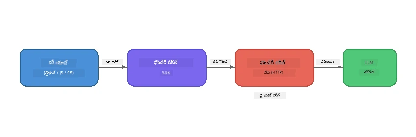

# భాగం 1: Foundry Local తో ప్రారంభించడం


## Foundry Local అంటే ఏమిటి?

[Foundry Local](https://foundrylocal.ai) మీ కంప్యూటర్లో **ప్రముఖమైన ఓపన్ సోర్స్ AI భాషా నమూనాలను నేరుగా** నడిపించుకునేలా చేస్తుంది - ఇంటర్నెట్ అవసరం లేదు, క్లౌడ్ ఖర్చులు లేవు, మరియు పూర్తిగా డేటా గోప్యత. ఇది:

- **నమూనాలను స్థానికంగా డౌన్లోడ్ చేసి నడుపుతుంది** ఆటోమేటిక్ హార్డ్‌వేర్ ఆప్టిమైజేషన్‌తో (GPU, CPU, లేదా NPU)
- **OpenAI అనుకూల APIని అందిస్తుంది** అందువలన మీరు సుపరిచిత SDKలు మరియు టూల్స్ ఉపయోగించుకోవచ్చు
- **Azure సబ్‌స్క్రిప్షన్ అవసరం లేదు** లేదా సైన్-అప్ - కేవలం ఇన్‌స్టాల్ చేసి నిర్మించడం మొదలు పెట్టండి

ముఖ్యంగా, ఇది మీ స్వంత ప్రైవేట్ AI అని భావించండి, ఇది పూర్తిగా మీ యంత్రంలో నడుస్తుంది.

## నేర్చుకునే లక్ష్యాలు

ఈ ప్రయోగం ముగిసినప్పుడు మీరు చేయగలుగుతారు:

- మీ ఆపరేటింగ్ సిస్టంలో Foundry Local CLIని ఇన్‌స్టాల్ చేయండి
- నమూనా అలియాసులు ఏంటి మరియు అవి ఎలా పనిచేస్తాయో అర్థం చేసుకోండి
- మీ మొదటి స్థానిక AI నమూనాను డౌన్లోడ్ చేసి నడపండి
- కమాండ్ లైన్ నుండి స్థానిక నమూనాకు చాట్ సందేశం పంపండి
- స్థానిక మరియు క్లౌడ్-హోస్టెడ్ AI నమూనాల మధ్య తేడాను అర్థం చేసుకోండి

---

## ముందస్తు అవసరాలు

### సిస్టమ్ అవసరాలు

| అవసరం | కనిష్ఠం | సిఫార్సు చేయబడింది |
|-------------|---------|-------------|
| **RAM** | 8 GB | 16 GB |
| **డిస్క్ స్థలం** | 5 GB (నమూనాలకోసం) | 10 GB |
| **CPU** | 4 కోర్లు | 8+ కోర్లు |
| **GPU** | ఐచ్ఛికం | NVIDIA CUDA 11.8+ తో |
| **OS** | Windows 10/11 (x64/ARM), Windows Server 2025, macOS 13+ | - |

> **గమనిక:** Foundry Local మీ హార్డ్‌వేరు కోసం ఉత్తమ నమూనా వేరియంట్‌ను ఆటోమేటిగ్గా ఎంచుకుంటుంది. మీ వద్ద NVIDIA GPU ఉంటే, అది CUDA ఆకసలరేషన్‌ను ఉపయోగిస్తుంది. మీరు Qualcomm NPU కలిగి ఉంటే, అది ఉపయోగిస్తుంది. లేకపోతే ఆప్టిమైజ్డ్ CPU వేరియంట్‌ను వాడుతుంది.

### Foundry Local CLI ఇన్స్టాల్ చేయండి

**Windows** (PowerShell):  
```powershell
winget install Microsoft.FoundryLocal
```
  
**macOS** (Homebrew):  
```bash
brew tap microsoft/foundrylocal
brew install foundrylocal
```
  
> **గమనిక:** Foundry Local ప్రస్తుతానికి Windows మరియు macOS మాత్రమే మద్దతు ఇస్తుంది. Linux ప్రస్తుతం మద్దతు లేదు.

ఇన్‌స్టలేషన్‌ను నిర్ధారించుకోండి:  
```bash
foundry --version
```
  
---

## ప్రయోగాలు

### ప్రగా 1: అందుబాటులో ఉన్న నమూనాలను పరీక్షించండి

Foundry Local ముందుగా ఆప్టిమైజ్ చేసిన ఓపెన్ సోర్స్ నమూనాల క్యాటలాగ్ కలిగి ఉంది. వాటిని జాబితా చేయండి:  

```bash
foundry model list
```
  
మీరు ఇలా నమూనాలను చూస్తారు:  
- `phi-3.5-mini` - Microsoft's 3.8B పరిమాణం నమూనా (తీవ్ర వేగం, మంచి నాణ్యత)  
- `phi-4-mini` - కొత్త, మరింత సామర్థ్యవంతమైన Phi నమూనా  
- `phi-4-mini-reasoning` - చైన్-ఆఫ్-తాత్ రీజనింగ్‌తో Phi నమూనా (`<think>` ట్యాగ్లు)  
- `phi-4` - Microsoft's అతిపెద్ద Phi నమూనా (10.4 GB)  
- `qwen2.5-0.5b` - చాలా చిన్నది మరియు వేగవంతమైనది (తగ్గిన వనరుల పరికరాలకోసం మంచిది)  
- `qwen2.5-7b` - సాధారణ పర్పస్ మెరుగైన నమూనా, టూల్-కలింగ్ మద్దతుతో  
- `qwen2.5-coder-7b` - కోడ్ రూపొందింపులో ఆప్టిమైజ్ చేయబడింది  
- `deepseek-r1-7b` - బలమైన రీజనింగ్ నమూనా  
- `gpt-oss-20b` - పెద్ద ఓపెన్ సోర్స్ నమూనా (MIT లైసెన్స్, 12.5 GB)  
- `whisper-base` - స్పీచ్-టు-టెక్స్ట్ ట్రాన్స్క్రిప్షన్ (383 MB)  
- `whisper-large-v3-turbo` - అధిక ఖచ్చితత్వం ట్రాన్స్క్రిప్షన్ (9 GB)  

> **నమూనా అలియాస్ అంటే ఏమిటి?** `phi-3.5-mini` వంటి అలియాసులు షార్ట్‌కట్స్. మీరు అలియాస్ ఉపయోగించినప్పుడు, Foundry Local మీ ప్రత్యేక హార్డ్‌వేరు కోసం అత్యుత్తమ వేరియంట్ (NVIDIA GPUలకు CUDA, లేకపోతే CPU ఆప్టిమైజ్డ్) ఆటోమేటిగ్గా డౌన్లోడ్ చేస్తుంది. మీరు ఎప్పుడూ సరైన వేరియంట్ ఎంచుకోవడంలో దిద్దుకోనవసరం లేదు.

### ప్రగా 2: మీ మొదటి నమూనాను నడపండి

డౌన్లోడ్ చేసి ఇంటరాక్టివ్‌గా ఒక నమూనాతో చాట్ చేయడం ప్రారంభించండి:

```bash
foundry model run phi-3.5-mini
```
  
ముందట మీరు దీన్ని నడపగానే, Foundry Local:  
1. మీ హార్డ్‌వేరును గుర్తిస్తుంది  
2. ఉత్తమ నమూనా వేరియంట్‌ను డౌన్లోడ్ చేస్తుంది (ఇది కొన్ని నిమిషాలు పట్టవచ్చు)  
3. నమూనాను మెమరీలో లోడ్ చేస్తుంది  
4. ఇంటరాక్టివ్ చాట్ సెషన్ ప్రారంభిస్తుంది  

దానికి కొన్ని ప్రశ్నలు అడగండి:  
```
You: What is the golden ratio?
You: Can you explain it as if I were 10 years old?
You: Write a haiku about mathematics
```
  
`exit` టైప్ చేయండి లేదా `Ctrl+C` నొక్కి నిష్క్రమించండి.

### ప్రగా 3: ఒక నమూనాను ముందుగానే డౌన్లోడ్ చేయండి

మీరే చాట్ ప్రారంభించకుండా ఒక నమూనాను డౌన్లోడ్ చేయాలనుకుంటే:  

```bash
foundry model download phi-3.5-mini
```
  
మీ యంత్రంలో ఇప్పటికే డౌన్లోడ్ చేయబడిన నమూనాలు ఏవి అని పరిశీలించండి:  

```bash
foundry cache list
```
  
### ప్రగా 4: నిర్మాణాన్ని అర్థం చేసుకోండి

Foundry Local **స్థానిక HTTP సర్వీస్**గా పనిచేస్తుంది, ఇది OpenAI అనుకూల REST APIని ప్రదర్శిస్తుంది. దీని అర్థం:  

1. సర్వీస్ ఒక **డైనమిక్ పోర్ట్** (ప్రతి సారి వేరుపోటు) పై ప్రారంభమవుతుంది  
2. మీరు SDK ఉపయోగించి నిజమైన ఎండ్పాయింట్ URLని వెతకాలి  
3. మీరు **ఏదైనా** OpenAI అనుకూల క్లయింట్ లైబ్రరీ ఉపయోగించి దానితో మాట్లాడవచ్చు  



> **ముఖ్యమైనది:** Foundry Local ప్రతి సారి మొదలవ్వగానే ఒక **డైనమిక్ పోర్ట్** కేటాయిస్తుంది. ఎప్పుడూ `localhost:5272` లాంటి పోర్ట్ నంబర్‌ను హార్డ్కోడ్ చేయవద్దు. ఎప్పుడూ SDK ఉపయోగించి ప్రస్తుత URLను కనుగొనండి (ఉదా., Pythonలో `manager.endpoint` లేదా JavaScriptలో `manager.urls[0]`).

---

## ముఖ్యమైన అంశాలు

| సూత్రం | మీరు నేర్చుకున్నది |
|---------|------------------|
| ఆన్-డివైస్ AI | Foundry Local నమూనాలను పూర్తిస్థాయిలో మీ పరికరంలో నడుపుతుంది, క్లౌడ్, API కీలు లేకుండా, మరియు ఖర్చులేదు |
| నమూనా అలియాసులు | `phi-3.5-mini` వంటి అలియాసులు మీ హార్డ్‌వేరు కోసం ఉత్తమ వేరియంట్‌ను ఆటోమేటిగ్గా ఎంచుకుంటాయి |
| డైనమిక్ పోర్టులు | సర్వీస్ డైనమిక్ పోర్టుపై నడుస్తుంది; ఎప్పుడూ SDK ఉపయోగించి ఎండ్పాయింట్ కనుగొనండి |
| CLI మరియు SDK | మీరు CLI (`foundry model run`) ద్వారా లేదా SDK తో ప్రోగ్రామాటిక్గా నమూనాలతో సంభాషించవచ్చు |

---

## తదువọdọఫ്ങ్రములు

నమూనాలను, సేవలను మరియు క్యాచింగ్‌ను ప్రోగ్రామాటిక్గా నిర్వహించడానికి SDK APIని శాస్త్రీయంగా నేర్చుకోవడానికి [భాగం 2: Foundry Local SDK లోతైన అధ్యయనం](part2-foundry-local-sdk.md)కి కొనసాగండి.