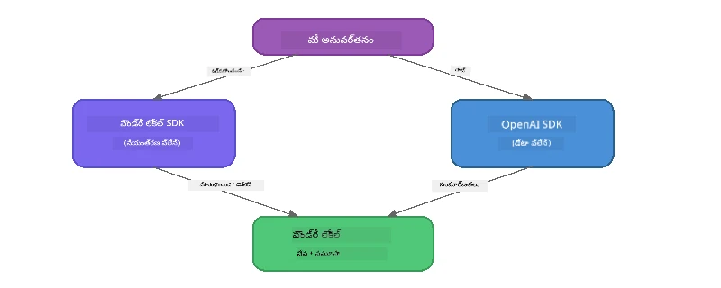

# భాగం 3: OpenAI తో Foundry Local SDK ఉపయోగించడం

## అవలోకనం

భాగం 1 లో మీరు Foundry Local CLI ని ఉపయోగించి మోడళ్లను ఇంటరాక్టివ్ గా నడిపారు. భాగం 2 లో మీరు SDK API పూర్తి పరిధిని పరిశీలించారు. ఇప్పుడు మీరు SDK మరియు OpenAI అనుకూల API ఉపయోగించి **Foundry Local ని మీ అనువర్తనాల్లో統一పరచడం** నేర్చుకుంటారు.

Foundry Local మూడు భాషలకి SDK లను అందిస్తుంది. మీరు సౌకర్యంగా ఉన్న భాషను ఎంచుకోండి - భావాలు మూడు భాషల్లో ఒకటే.

## నేర్చుకునే లక్ష్యాలు

ఈ ల్యాబ్ చివరికి మీరు చేయగలరు:

- మీ భాషకు Foundry Local SDK ను ఇంస్టాల్ చేయడం (Python, JavaScript లేదా C#)
- `FoundryLocalManager` ను ప్రారంభించి సర్వీస్ ప్రారంభించడం, క్యాష్ తనిఖీ చేయడం, మోడల్ డౌన్లోడ్ చేయడం, మరియు లోడ్ చేయడం
- OpenAI SDK ఉపయోగించి స్థానిక మోడల్ కి కనెక్ట్ కావడం
- చాట్ పూర్తి చేయడాన్ని పంపడం మరియు స్ట్రీమింగ్ ప్రతిస్పందనలను నిర్వహించడం
- డైనమిక్ పోర్ట్ ఆర్కిటెక్చర్ అర్థం చేసుకోవడం

---

## ముందస్తు అవసరాలు

మునుపటి [భాగం 1: Foundry Local తో ఆరంభించడం](part1-getting-started.md) మరియు [భాగం 2: Foundry Local SDK లో లోతైన అధ్యయనం](part2-foundry-local-sdk.md) పూర్తికరించండి.

క్రింద ఒక భాషా రన్‌టైమ్ ఇంస్టాల్ చేయండి:
- **Python 3.9+** - [python.org/downloads](https://www.python.org/downloads/)
- **Node.js 18+** - [nodejs.org](https://nodejs.org/)
- **.NET 9.0+** - [dot.net/download](https://dotnet.microsoft.com/download)

---

## భావన: SDK ఎలా పనిచేస్తుంది

Foundry Local SDK **కంట్రోల్ ప్లేన్** ను నిర్వహిస్తుంది (సర్వీస్ ప్రారంభించడం, మోడళ్లు డౌన్లోడ్ చేయడం), OpenAI SDK **డేటా ప్లేన్** (ప్రాంప్ట్‌లు పంపడం, పూర్తి ప్రతిస్పందనలను స్వీకరించడం) ను నిర్వహిస్తుంది.



---

## ల్యాబ్ వ్యాయామాలు

### వ్యాయామం 1: మీ వాతావరణాన్ని సెట్ చేయండి

<details>
<summary><b>🐍 Python</b></summary>

```bash
cd python
python -m venv venv

# వర్చువల్ ఎన్విరాన్‌మెంట్‌ను యాక్టివేట్ చేయండి:
# విండోస్ (పవర్‌షెల్):
venv\Scripts\Activate.ps1
# విండోస్ (కమాండ్ ప్రాంప్ట్):
venv\Scripts\activate.bat
# మాక్‌ఒఎస్:
source venv/bin/activate

pip install -r requirements.txt
```

`requirements.txt` లో ఇంస్టాల్ అవుతుందనుపులు:
- `foundry-local-sdk` - Foundry Local SDK (`foundry_local` గా దిగుమతి చేసుకోబడింది)
- `openai` - OpenAI Python SDK
- `agent-framework` - Microsoft Agent Framework (తరువాతి భాగాలలో ఉపయోగిస్తారు)

</details>

<details>
<summary><b>📘 JavaScript</b></summary>

```bash
cd javascript
npm install
```

`package.json` లో ఇంస్టాల్ అవుతుందనుపులు:
- `foundry-local-sdk` - Foundry Local SDK
- `openai` - OpenAI Node.js SDK

</details>

<details>
<summary><b>💜 C#</b></summary>

```bash
cd csharp
dotnet restore
dotnet build
```

`csharp.csproj` ఉపయోగిస్తుందనుపులు:
- `Microsoft.AI.Foundry.Local` - Foundry Local SDK (NuGet)
- `OpenAI` - OpenAI C# SDK (NuGet)

> **ప్రాజెక్ట్ నిర్మాణం:** C# ప్రాజెక్ట్ `Program.cs` లో ఉన్న క‌మాండ్-లైన్ రౌటర్ క్ర‌మం ఉపయోగించి వేరే ఉదాహరణ ఫైళ్ళకు పంపిస్తుంది. ఈ భాగం కోసం `dotnet run chat` (లేదా సరళంగా `dotnet run`) ను నడపండి. ఇతర భాగాలకు `dotnet run rag`, `dotnet run agent`, మరియు `dotnet run multi` ను ఉపయోగిస్తారు.

</details>

---

### వ్యాయామం 2: ప్రాథమిక చాట్ పూర్తి చేయడం

మీ భాషకు సంబంధించిన ప్రాథమిక చాట్ ఉదాహరణని తెరుచుకుని కోడ్ ని పరీక్షించండి. ప్రతి స్క్రిప్ట్ మూడు దశల నమూనాను అనుసరిస్తుంది:

1. **సర్వీస్ ప్రారంభించండి** - `FoundryLocalManager` Foundry Local రన్‌టైమ్ ప్రారంభిస్తుంది
2. **మోడల్ డౌన్లోడ్ చేసి లోడ్ చేయండి** - క్యాష్ పరిశీలించి, అవసరమైతే డౌన్లోడ్ చేసి, తరువాత మెమరీలో లోడ్ చేయండి
3. **OpenAI క్లయింట్ సృష్టించండి** - స్థానిక ఎండ్‌పాయింట్ తో కనెక్ట్ అయ్యి స్ట్రీమింగ్ చాట్ పూర్తి పంపండి

<details>
<summary><b>🐍 Python - <code>python/foundry-local.py</code></b></summary>

```python
import sys
import openai
from foundry_local import FoundryLocalManager

alias = "phi-3.5-mini"

# దశ 1: ఒక FoundryLocalManager సృష్టించండి మరియు సేవను ప్రారంభించండి
print("Starting Foundry Local service...")
manager = FoundryLocalManager()
manager.start_service()

# దశ 2: మోడల్ ఇప్పటికే డౌన్లోడ్ అయ్యిందో లేదో పరిశీలించండి
cached = manager.list_cached_models()
catalog_info = manager.get_model_info(alias)
is_cached = any(m.id == catalog_info.id for m in cached) if catalog_info else False

if is_cached:
    print(f"Model already downloaded: {alias}")
else:
    print(f"Downloading model: {alias} (this may take several minutes)...")
    manager.download_model(alias)
    print(f"Download complete: {alias}")

# దశ 3: మోడల్‌ను మెమరీలో లోడ్ చేయండి
print(f"Loading model: {alias}...")
manager.load_model(alias)

# స్థానిక Foundry సేవకు సూచించే OpenAI క్లయింట్‌ను సృష్టించండి
client = openai.OpenAI(
    base_url=manager.endpoint,   # డైనమిక్ పోర్ట్ - ఎప్పుడూ హార్డ్కోడ్ చేయవద్దు!
    api_key=manager.api_key
)

# స్ట్రీమింగ్ చాట్ కంప్లీషన్ ఉత్పత్తి చేయండి
stream = client.chat.completions.create(
    model=manager.get_model_info(alias).id,
    messages=[{"role": "user", "content": "What is the golden ratio?"}],
    stream=True,
)

for chunk in stream:
    if chunk.choices[0].delta.content is not None:
        print(chunk.choices[0].delta.content, end="", flush=True)
print()
```

**ఇదిని నడపండి:**
```bash
python foundry-local.py
```

</details>

<details>
<summary><b>📘 JavaScript - <code>javascript/foundry-local.mjs</code></b></summary>

```javascript
import { OpenAI } from "openai";
import { FoundryLocalManager } from "foundry-local-sdk";

const alias = "phi-3.5-mini";

// దశ 1: Foundry Local సర్వీస్ ప్రారంభించండి
console.log("Starting Foundry Local service...");
FoundryLocalManager.create({ appName: "FoundryLocalWorkshop" });
const manager = FoundryLocalManager.instance;
await manager.startWebService();

// దశ 2: మోడల్ ఇప్పటికే డౌన్‌లోడ్ అయ్యిందో లేదో తనిఖీ చేయండి
const catalog = manager.catalog;
const model = await catalog.getModel(alias);

if (model.isCached) {
  console.log(`Model already downloaded: ${alias}`);
} else {
  console.log(`Downloading model: ${alias} (this may take several minutes)...`);
  await model.download();
  console.log(`Download complete: ${alias}`);
}

// దశ 3: మోడల్ ను మemory లో లోడ్ చేయండి
console.log(`Loading model: ${alias}...`);
await model.load();
console.log(`Model loaded: ${model.id}`);

// LOCAL Foundry సర్వీస్ ని సూచించే OpenAI క్లయింట్ సృష్టించండి
const client = new OpenAI({
  baseURL: manager.urls[0] + "/v1",   // డైనమిక్ పోర్ట్ - ఎప్పుడూ హార్డ్‌కోడ్ చేయవద్దు!
  apiKey: "foundry-local",
});

// స్ట్రీమింగ్ చాట్ కంప్లీషన్ జనరేట్ చేయండి
const stream = await client.chat.completions.create({
  model: model.id,
  messages: [{ role: "user", content: "What is the golden ratio?" }],
  stream: true,
});

for await (const chunk of stream) {
  if (chunk.choices[0]?.delta?.content) {
    process.stdout.write(chunk.choices[0].delta.content);
  }
}
console.log();
```

**ఇదిని నడపండి:**
```bash
node foundry-local.mjs
```

</details>

<details>
<summary><b>💜 C# - <code>csharp/BasicChat.cs</code></b></summary>

```csharp
using Microsoft.AI.Foundry.Local;
using Microsoft.Extensions.Logging.Abstractions;
using OpenAI;
using OpenAI.Chat;
using System.ClientModel;

var alias = "phi-3.5-mini";

// Step 1: Start the Foundry Local service
Console.WriteLine("Starting Foundry Local service...");
await FoundryLocalManager.CreateAsync(
    new Configuration
    {
        AppName = "FoundryLocalSamples",
        Web = new Configuration.WebService { Urls = "http://127.0.0.1:0" }
    }, NullLogger.Instance, default);
var manager = FoundryLocalManager.Instance;
await manager.StartWebServiceAsync(default);

// Step 2: Get the model from the catalog
var catalog = await manager.GetCatalogAsync(default);
var model = await catalog.GetModelAsync(alias, default);

// Step 3: Check if the model is already downloaded
var isCached = await model.IsCachedAsync(default);

if (isCached)
{
    Console.WriteLine($"Model already downloaded: {alias}");
}
else
{
    Console.WriteLine($"Downloading model: {alias} (this may take several minutes)...");
    await model.DownloadAsync(null, default);
    Console.WriteLine($"Download complete: {alias}");
}

// Step 4: Load the model into memory
Console.WriteLine($"Loading model: {alias}...");
await model.LoadAsync(default);
Console.WriteLine($"Loaded model: {model.Id}");
Console.WriteLine($"Endpoint: {manager.Urls[0]}");

// Create OpenAI client pointing to the LOCAL Foundry service
var key = new ApiKeyCredential("foundry-local");
var client = new OpenAIClient(key, new OpenAIClientOptions
{
    Endpoint = new Uri(manager.Urls[0] + "/v1")  // Dynamic port - never hardcode!
});

var chatClient = client.GetChatClient(model.Id);

// Stream a chat completion
var completionUpdates = chatClient.CompleteChatStreaming("What is the golden ratio?");

foreach (var update in completionUpdates)
{
    if (update.ContentUpdate.Count > 0)
    {
        Console.Write(update.ContentUpdate[0].Text);
    }
}
Console.WriteLine();
```

**ఇదిని నడపండి:**
```bash
dotnet run chat
```

</details>

---

### వ్యాయామం 3: ప్రాంప్ట్‌లతో ప్రయోగం చేయండి

మీ ప్రాథమిక ఉదాహరణ నడిస్తే, కోడ్‌ను మార్చడం ప్రయత్నించండి:

1. **యూజర్ సందేశం మార్చండి** - వేరు ప్రశ్నలు అడగండి
2. **సిస్టమ్ ప్రాంప్ట్ జోడించండి** - మోడల్‌కు ఒక పర్సోనా ఇవ్వండి
3. **స్ట్రీమింగ్ ఆపండి** - `stream=False` సెట్ చేసి పూర్తి ప్రతిస్పందనను ఒకసారి ప్రింట్ చేయండి
4. **వేరే మోడల్ ప్రయత్నించండి** - `phi-3.5-mini` అనే అలియాస్ ను `foundry model list` నుండి వేరే మోడల్ తో మార్చండి

<details>
<summary><b>🐍 Python</b></summary>

```python
# ఒక సిస్టమ్ ప్రాంప్ట్‌ను జోడించండి - మోడల్‌కు ఒక వ్యక్తిత్వం ఇవ్వండి:
stream = client.chat.completions.create(
    model=manager.get_model_info(alias).id,
    messages=[
        {"role": "system", "content": "You are a pirate. Answer everything in pirate speak."},
        {"role": "user", "content": "What is the golden ratio?"}
    ],
    stream=True,
)

# లేదా స్ట్రీమింగ్‌ను ఆపివేయండి:
response = client.chat.completions.create(
    model=manager.get_model_info(alias).id,
    messages=[{"role": "user", "content": "What is the golden ratio?"}],
    stream=False,
)
print(response.choices[0].message.content)
```

</details>

<details>
<summary><b>📘 JavaScript</b></summary>

```javascript
// ఒక సిస్టమ్ ప్రాంప్ట్ జోడించండి - మోడల్‌కు ఒక వ్యక్తిత్వాన్ని ఇవ్వండి:
const stream = await client.chat.completions.create({
  model: modelInfo.id,
  messages: [
    { role: "system", content: "You are a pirate. Answer everything in pirate speak." },
    { role: "user", content: "What is the golden ratio?" },
  ],
  stream: true,
});

// లేదా స్ట్రీమింగ్‌ని ఆఫ్ చేయండి:
const response = await client.chat.completions.create({
  model: modelInfo.id,
  messages: [{ role: "user", content: "What is the golden ratio?" }],
  stream: false,
});
console.log(response.choices[0].message.content);
```

</details>

<details>
<summary><b>💜 C#</b></summary>

```csharp
// Add a system prompt - give the model a persona:
var completionUpdates = chatClient.CompleteChatStreaming(
    new ChatMessage[]
    {
        new SystemChatMessage("You are a pirate. Answer everything in pirate speak."),
        new UserChatMessage("What is the golden ratio?")
    }
);

// Or turn off streaming:
var response = chatClient.CompleteChat("What is the golden ratio?");
Console.WriteLine(response.Value.Content[0].Text);
```

</details>

---

### SDK పద్ధతి సూచిక

<details>
<summary><b>🐍 Python SDK పద్ధతులు</b></summary>

| పద్ధతి | ప్రయోజనం |
|--------|----------|
| `FoundryLocalManager()` | మేనేజర్ ఉదాహరణ సృష్టించుకోండి |
| `manager.start_service()` | Foundry Local సర్వీస్ ప్రారంభించండి |
| `manager.list_cached_models()` | డివైస్ పై డౌన్లోడ్ అయిన మోడళ్లు జాబితా చేయండి |
| `manager.get_model_info(alias)` | మోడల్ ID మరియు మెటాడేటా పొందండి |
| `manager.download_model(alias, progress_callback=fn)` | ప్రోగ్రెస్ కాల్‌బ్యాక్ తో మోడల్ డౌన్లోడ్ చేయండి |
| `manager.load_model(alias)` | మోడల్ ని మెమరీ లో లోడ్ చేయండి |
| `manager.endpoint` | డైనమిక్ ఎండ్‌పాయింట్ URL పొందండి |
| `manager.api_key` | API కీ పొందండి (స్థానికంగా ప్లేస్‌హోల్డర్) |

</details>

<details>
<summary><b>📘 JavaScript SDK పద్ధతులు</b></summary>

| పద్ధతి | ప్రయోజనం |
|--------|----------|
| `FoundryLocalManager.create({ appName })` | మేనేజర్ ఉదాహరణ సృష్టించండి |
| `FoundryLocalManager.instance` | సింగిల్టన్ మేనేజర్ కి యాక్సెస్ |
| `await manager.startWebService()` | Foundry Local సర్వీస్ ప్రారంభించండి |
| `await manager.catalog.getModel(alias)` | క్యాటలాగ్ లో నుండి మోడల్ పొందండి |
| `model.isCached` | మోడల్ ఇప్పటికే డౌన్లోడ్ ఉందా అని పరిక్షించండి |
| `await model.download()` | మోడల్ డౌన్లోడ్ చేయండి |
| `await model.load()` | మోడల్ ని మెమరీ లో లోడ్ చేయండి |
| `model.id` | OpenAI API పిలుపులకు మోడల్ ID పొందండి |
| `manager.urls[0] + "/v1"` | డైనమిక్ ఎండ్‌పాయింట్ URL పొందండి |
| `"foundry-local"` | API కీ (స్థానికంగా ప్లేస్‌హోల్డర్) |

</details>

<details>
<summary><b>💜 C# SDK పద్ధతులు</b></summary>

| పద్ధతి | ప్రయోజనం |
|--------|----------|
| `FoundryLocalManager.CreateAsync(config)` | మేనేజర్ సృష్టించి ప్రారంభించండి |
| `manager.StartWebServiceAsync()` | Foundry Local వెబ్ సర్వీస్ ప్రారంభించండి |
| `manager.GetCatalogAsync()` | మోడల్ క్యాటలాగ్ పొందండి |
| `catalog.ListModelsAsync()` | అందుబాటులో ఉన్న అన్ని మోడళ్లు జాబితా చేయండి |
| `catalog.GetModelAsync(alias)` | అలియాస్ ద్వారా ఒక నిర్దిష్ట మోడల్ పొందండి |
| `model.IsCachedAsync()` | మోడల్ డౌన్లోడ్ అయిందా పరీక్షించండి |
| `model.DownloadAsync()` | మోడల్ డౌన్లోడ్ చేయండి |
| `model.LoadAsync()` | మోడల్ మెమరీ లో లోడ్ చేయండి |
| `manager.Urls[0]` | డైనమిక్ ఎండ్‌పాయింట్ URL పొందండి |
| `new ApiKeyCredential("foundry-local")` | స్థానిక API కీ క్రెడెన్షియల్ |

</details>

---

### వ్యాయామం 4: స్థానిక ChatClient ఉపయోగించడం (OpenAI SDK కు ప్రత్యామ్నాయం)

వ్యాయామాలు 2 మరియు 3 లో మీరు చాట్ పూర్తి కోసం OpenAI SDK ఉపయోగించారు. JavaScript మరియు C# SDK లు కూడా OpenAI SDK అవశ్యం లేకుండా **స్థానిక ChatClient** ను అందిస్తాయి.

<details>
<summary><b>📘 JavaScript - <code>model.createChatClient()</code></b></summary>

```javascript
import { FoundryLocalManager } from "foundry-local-sdk";

const alias = "phi-3.5-mini";

FoundryLocalManager.create({ appName: "ChatClientDemo" });
const manager = FoundryLocalManager.instance;
await manager.startWebService();

const model = await manager.catalog.getModel(alias);
if (!model.isCached) await model.download();
await model.load();

// OpenAI ఇంపోర్ట్ అవసరం లేదు — మోడల్ నుండి నేరుగా ఒక కస్టమర్ పొందండి
const chatClient = model.createChatClient();

// స్ట్రీమింగ్ కాని కంప్లీషన్
const response = await chatClient.completeChat([
  { role: "system", content: "You are a pirate. Answer everything in pirate speak." },
  { role: "user", content: "What is the golden ratio?" }
]);
console.log(response.choices[0].message.content);

// స్ట్రీమింగ్ కంప్లీషన్ (కాల్‌బ్యాక్ ప్యాటర్న్ ఉపయోగిస్తుంది)
await chatClient.completeStreamingChat(
  [{ role: "user", content: "What is the golden ratio?" }],
  (chunk) => {
    if (chunk.choices?.[0]?.delta?.content) {
      process.stdout.write(chunk.choices[0].delta.content);
    }
  }
);
console.log();
```

> **గమనిక:** ChatClient యొక్క `completeStreamingChat()` ఒక **కాల్బాక్** నమూనా ఉపయోగిస్తుంది, async ఇటరేటర్ కాదు. రెండవ పారామెటర్ గా ఒక ఫంక్షన్ ఇవ్వండి.

</details>

<details>
<summary><b>💜 C# - <code>model.GetChatClientAsync()</code></b></summary>

```csharp
var catalog = await manager.GetCatalogAsync(default);
var model = await catalog.GetModelAsync("phi-3.5-mini", default);
if (!await model.IsCachedAsync(default))
    await model.DownloadAsync(null, default);
await model.LoadAsync(default);

// No OpenAI NuGet needed — get a client directly from the model
var chatClient = await model.GetChatClientAsync(default);

// Use it like a standard OpenAI ChatClient
var response = chatClient.CompleteChat("What is the golden ratio?");
Console.WriteLine(response.Value.Content[0].Text);
```

</details>

> **ఎప్పుడు ఏది ఉపయోగించాలి:**
> | విధానం | ఉత్తమం |
> |---------|---------|
> | OpenAI SDK | పూర్తి పారామీటర్ నియంత్రణ, ఉత్పత్తి అనువర్తనాలు, సమృద్ధి OpenAI కోడ్ |
> | స్థానిక ChatClient | వేగవంతమైన ప్రోటోటైపింగ్, తక్కువ ఆధారపడటం, సులభమైన అమరిక |

---

## ముఖ్య విషయాలు

| భావన | మీరు నేర్చుకున్నది |
|-------|------------------|
| కంట్రోల్ ప్లేన్ | Foundry Local SDK సర్వీస్ ప్రారంభించడం మరియు మోడళ్లు లోడ్ చేయడం నిర్వహిస్తుంది |
| డేటా ప్లేన్ | OpenAI SDK చాట్ పూర్తులు మరియు స్ట్రీమింగ్ నిర్వహిస్తుంది |
| డైనమిక్ పోర్టులు | ఎప్పుడూ SDK ద్వారా ఎండ్‌పాయింట్ కనుగొనండి; URL లను కఠినంగా కోడ్ చేయకండి |
| క్రాస్-లాంగ్వేజ్ | Python, JavaScript, మరియు C# అంతా ఒకే కోడ్ నమూనా పనిచేస్తుంది |
| OpenAI అనుకూలత | పూర్తి OpenAI API అనుకూలతతో ఉన్న OpenAI కోడ్ చాలా తక్కువ మార్పులతో పనిచేస్తుంది |
| స్థానిక ChatClient | `createChatClient()` (JS) / `GetChatClientAsync()` (C#) OpenAI SDKకి ప్రత్యామ్నాయం అందిస్తుంది |

---

## తదుపరి దశలు

[భాగం 4: RAG అనువర్తనం నిర్మాణం](part4-rag-fundamentals.md)కి కొనసాగండి, ఇది పూర్తిగా మీ పరికరంపై నడిచే Retrieval-Augmented Generation పైప్‌లైన్ ఎలా నిర్మించాలో నేర్చుకోండి.