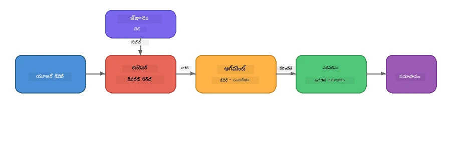

# భాగం 4: Foundry Localతో RAG అనువర్తనాన్ని నిర్మించడం

## అవలోకనం

పెద్ద భాషా మోడళ్లు శక్తివంతమైనవి, కానీ అవి తమ శిక్షణ డేటాలో ఉన్నదేనికే పరిచితులు. **రిట్రీవల్-ఆగ్మెంటెడ్ జనరేషన్ (RAG)** దీనిని పరిష్కరిస్తుంది, మోడల్‌కు క్వెరీ సమయంలో సంబంధిత సందర్భాన్ని అందిస్తుంది - ఇది మీ స్వంత పత్రాలు, డేటాబేసులు లేదా జ్ఞానాధారాల నుండి తీసుకోబడుతుంది.

ఈ ప్రయోగ శాలలో మీరు Foundry Local ఉపయోగించి **మిగిలినదంతా మీ పరికరంపైనే** నడిచే పూర్తి RAG పైప్‌లైన్‌ను నిర్మించబోతున్నారు. ఎటువంటి క్లౌడ్ సేవలు, వెక్టర్ డేటాబేసులు, ఎంబెడ్డింగ్స్ API అవసరం లేదు - కేవలం స్థానిక రిట్రీవల్ మరియు స్థానిక మోడల్.

## అభ్యాస లక్ష్యాలు

ఈ ప్రయోగం ముగింపులో మీరు చేయగలుగుతారు:

- RAG అంటే ఏమిటో, మరియు AI అనువర్తనాల కోసం ఇది ఎందుకు ముఖ్యం అనేది వివరించగలగడం
- టెక్స్ట్ డాక్యుమెంట్ల నుండి స్థానిక జ్ఞానాధారం నిర్మించడం
- సంబంధిత సందర్భాన్ని కనుగొనే సరళమైన రిట్రీవల్ ఫంక్షన్‌ను అమలు చేయడం
- మోడల్‌ను రిట్రీవ్ చేసిన తత్సంశ్రమ్ములపై ఆధారపడి ఉండే విధంగా ఒక సిస్టమ్ ప్రాంప్ట్ రూపొందించడం
- Retrieve → Augment → Generate పూర్తిస్థాయి పైప్‌లైన్‌ను పరికరంపై నడపడం
- సరళమైన కీవర్డ్ రిట్రీవల్ మరియు వెక్టర్ శోధన మధ్య వ్యత్యాసాలను అర్థం చేసుకోవడం

---

## ముందస్తు అవసరాలు

- [భాగం 3: Foundry Local SDKని OpenAIతో ఉపయోగించడం](part3-sdk-and-apis.md) పూర్తి చేయండి
- Foundry Local CLI ఇన్‌స్టాల్ చేసి `phi-3.5-mini` మోడల్ డౌన్లోడ్ చేసుకోండి

---

## కాన్సెప్ట్: RAG అంటే ఏమిటి?

RAG లేకుంటే, LLM కేవలం తమ శిక్షణ డేటా ఆధారంగా మాత్రమే సమాధానాలు ఇస్తుంది - అవి పాతదై ఉండవచ్చు, తక్కువగా ఉండవచ్చు, లేదా మీ ప్రైవేట్ సమాచారాన్ని మిస్ చేయవచ్చు:

```
User: "What is Zava's return policy?"
LLM:  "I do not have information about Zava's return policy."  ← No context!
```

RAG తో, మీరు **సంబంధిత పత్రాలను ముందుగా రిట్రీవ్ చేస్తారు**, ఆ తర్వాత ఆ సందర్భంతో ప్రాంప్ట్‌ను **ఆగ్మెంట్ చేసి** తరువాత **సమాధానం జనరేట్ చేస్తారు**:



ముఖ్యమైన విషయము: **మోడల్ సమాధానం "తెలుసుకోవడం" అవసరం లేదు; అది కేవలం సరైన పత్రాలను చదవాలి.**

---

## ప్రయోగాలు

### వ్యాయామం 1: జ్ఞానాధారాన్ని అర్థం చేసుకోండి

మీ భాషకు సంబంధించిన RAG ఉదాహరణను తెరవండి మరియు జ్ఞానాధారాన్ని పరిశీలించండి:

<details>
<summary><b>🐍 Python: <code>python/foundry-local-rag.py</code></b></summary>

జ్ఞానాధారం `title` మరియు `content` ఫీల్డ్స్ కలిగిన డిక్షనరీల యొక్క సరళమైన జాబితా:

```python
KNOWLEDGE_BASE = [
    {
        "title": "Foundry Local Overview",
        "content": (
            "Foundry Local brings the power of Azure AI Foundry to your local "
            "device without requiring an Azure subscription..."
        ),
    },
    {
        "title": "Supported Hardware",
        "content": (
            "Foundry Local automatically selects the best model variant for "
            "your hardware. If you have an Nvidia CUDA GPU it downloads the "
            "CUDA-optimized model..."
        ),
    },
    # ... మరిన్ని ఎంట్రీలు
]
```

ప్రతి ఎంట్రీ ఒక "చంక్" ఇన్ఫర్మేషన్‌ను సూచిస్తుంది - ఒక విషయం పై ఒక కేంద్రీకృత భాగం.

</details>

<details>
<summary><b>📘 JavaScript: <code>javascript/foundry-local-rag.mjs</code></b></summary>

జ్ఞానాధారం ఒక ఆబ్జెక్టుల అర్రే తరహాలో అదే నిర్మాణంతో ఉంటుంది:

```javascript
const KNOWLEDGE_BASE = [
  {
    title: "Foundry Local Overview",
    content:
      "Foundry Local brings the power of Azure AI Foundry to your local " +
      "device without requiring an Azure subscription...",
  },
  {
    title: "Supported Hardware",
    content:
      "Foundry Local automatically selects the best model variant for " +
      "your hardware...",
  },
  // ... మరిన్ని ఎంట్రీలు
];
```

</details>

<details>
<summary><b>💜 C#: <code>csharp/RagPipeline.cs</code></b></summary>

జ్ఞానాధారం పేరల టుపుల్స్ జాబితా రూపంలో ఉంటుంది:

```csharp
private static readonly List<(string Title, string Content)> KnowledgeBase =
[
    ("Foundry Local Overview",
     "Foundry Local brings the power of Azure AI Foundry to your local " +
     "device without requiring an Azure subscription..."),

    ("Supported Hardware",
     "Foundry Local automatically selects the best model variant for " +
     "your hardware..."),

    // ... more entries
];
```

</details>

> **నిజ అనువర్తనంలో**, జ్ఞానాధారం ఫైళ్ల నుండి, డేటాబేస్ నుండి, సెర్చ్ ఇండెక్స్ నుండి లేదా API నుండి వస్తుంది. ఈ ప్రయోగం కోసం మేము సాదాసీదా మెమొరీలో జాబితాను ఉపయోగిస్తున్నాము.

---

### వ్యాయామం 2: రిట్రీవల్ ఫంక్షన్ అర్థం చేసుకోండి

రిక్వెస్ట్ చేసిన ప్రశ్నకు సంబంధించి అత్యంత సంబంధిత చంక్స్‌ను కనుగొనడం రిట్రీవల్ దశ. ఈ ఉదాహరణ **కీవర్డ్ ఓవర్లాప్** ఉపయోగిస్తుంది - ప్రశ్నలోని పదాలు ఎంతవరకు చంక్‌లోనూ ఉన్నాయో లెక్కించడం:

<details>
<summary><b>🐍 Python</b></summary>

```python
def retrieve(query: str, top_k: int = 2) -> list[dict]:
    """Return the top-k knowledge chunks most relevant to the query."""
    query_words = set(query.lower().split())
    scored = []
    for chunk in KNOWLEDGE_BASE:
        chunk_words = set(chunk["content"].lower().split())
        overlap = len(query_words & chunk_words)
        scored.append((overlap, chunk))
    scored.sort(key=lambda x: x[0], reverse=True)
    return [item[1] for item in scored[:top_k]]
```

</details>

<details>
<summary><b>📘 JavaScript</b></summary>

```javascript
function retrieve(query, topK = 2) {
  const queryWords = new Set(query.toLowerCase().split(/\s+/));
  const scored = KNOWLEDGE_BASE.map((chunk) => {
    const chunkWords = new Set(chunk.content.toLowerCase().split(/\s+/));
    let overlap = 0;
    for (const w of queryWords) {
      if (chunkWords.has(w)) overlap++;
    }
    return { overlap, chunk };
  });
  scored.sort((a, b) => b.overlap - a.overlap);
  return scored.slice(0, topK).map((s) => s.chunk);
}
```

</details>

<details>
<summary><b>💜 C#</b></summary>

```csharp
private static List<(string Title, string Content)> Retrieve(string query, int topK = 2)
{
    var queryWords = new HashSet<string>(
        query.ToLowerInvariant().Split(' ', StringSplitOptions.RemoveEmptyEntries));

    return KnowledgeBase
        .Select(chunk =>
        {
            var chunkWords = new HashSet<string>(
                chunk.Content.ToLowerInvariant().Split(' ', StringSplitOptions.RemoveEmptyEntries));
            var overlap = queryWords.Intersect(chunkWords).Count();
            return (Overlap: overlap, Chunk: chunk);
        })
        .OrderByDescending(x => x.Overlap)
        .Take(topK)
        .Select(x => x.Chunk)
        .ToList();
}
```

</details>

**పని విధానం:**
1. ప్రశ్నను వ్యక్తిగత పదాలుగా విడగొట్టండి
2. ప్రతి జ్ఞాన చంక్ కోసం, ఆ ప్రశ్న పదాలు ఆ చంక్‌లో ఎన్ని ఉన్నాయో లెక్కించండి
3. ఓవర్లాప్ స్కోర్ (ఎక్కువ నుండి తక్కువ) ఆధారంగా సార్టు చేయండి
4. టాప్-k అత్యంత సంబంధిత చంక్స్‌ని తిరిగి ఇవ్వండి

> **వ్యత్యాసం:** కీవర్డ్ ఓవర్లాప్ సులభం కాని పరిమితి ఉంది; ఇది సైనొనిమ్స్ లేదా అర్థాన్ని అర్థం చేసుకోదు. ప్రొడక్షన్ RAG సిస్టమ్లు సాధారణంగా **ఎంబెడ్డింగ్ వెక్టర్లు** మరియు **వెక్టర్ డేటాబేస్** హేతుబద్ధ శోధనకు ఉపయోగిస్తాయి. అయితే, కీవర్డ్ ఓవర్లాప్ ప్రారంభానికి చాలా బాగుంది మరియు అదనపు డిపెండెన్సీలను అవసరం లేదు.

---

### వ్యాయామం 3: ఆగ్మెంట్ చేసిన ప్రాంప్ట్ అర్థం చేసుకోండి

రిట్రీవ్ చేసుకున్న సందర్భాన్ని మోడల్‌కు పంపే ముందు **సిస్టమ్ ప్రాంప్ట్** లో చేర్చుతారు:

```python
system_prompt = (
    "You are a helpful assistant. Answer the user's question using ONLY "
    "the information provided in the context below. If the context does "
    "not contain enough information, say so.\n\n"
    f"Context:\n{context_text}"
)
```

ప్రధాన డిజైన్ నిర్ణయాలు:
- **"పేర్కొన్న సమాచారం మాత్రమే"** - సందర్భం లేని వాస్తవాలు మోడల్ హల్యూసినేట్ చేయకుండా నివారిస్తుంది
- **"సందర్భంలో తగిన సమాచారం లేనప్పుడు తెలియజేయండి"** - నిజాయితీగా "నాకు తెలియదు" అని చెప్పడానికి ప్రోత్సహిస్తుంది
- సందర్భం మొత్తం సమాధానాలను ఆకారంలో పెట్టేందుకు సిస్టమ్ మెసేజ్‌లో ఉంచబడుతుంది

---

### వ్యాయామం 4: RAG పైప్‌లైన్ నడపండి

పూర్తి ఉదాహరణను నడపండి:

**Python:**  
```bash
cd python
python foundry-local-rag.py
```
  
**JavaScript:**  
```bash
cd javascript
node foundry-local-rag.mjs
```
  
**C#:**  
```bash
cd csharp
dotnet run rag
```
  
మీకు మూడు విషయాలు ప్రింట్ అవుతాయి:  
1. అడిగిన **ప్రశ్న**  
2. **రిట్రీవ్ చేసిన సందర్భం** - జ్ఞానాధారంలోని ఎంచుకున్న చంక్స్  
3. ఆ సందర్భంతో మాత్రమేగా మోడల్ రూపొందించిన **సమాధానం**

ఉదాహరణ ఔట్‌పుట్:  
```
Question: How do I install Foundry Local and what hardware does it support?

--- Retrieved Context ---
### Installation
On Windows install Foundry Local with: winget install Microsoft.FoundryLocal...

### Supported Hardware
Foundry Local automatically selects the best model variant for your hardware...
-------------------------

Answer: To install Foundry Local, you can use the following methods depending
on your operating system: On Windows, run `winget install Microsoft.FoundryLocal`.
On macOS, use `brew install microsoft/foundrylocal/foundrylocal`...
```
  
మోడల్ సమాధానం రిట్రీవ్ చేసిన సందర్భంపై **ఆధారపడి** ఉందని గమనించండి - ఇది జ్ఞానాధార పత్రాల్లోని వాస్తవాలను మాత్రమే సూచిస్తుంది.

---

### వ్యాయామం 5: ప్రయోగాలు చేసి విస్తరించండి

ఈ మార్పులను ప్రయత్నించి మీ అర్థాన్ని లోతుగా చేసుకోండి:

1. **ప్రశ్న మార్చండి** - జ్ఞానాధారంలో ఉన్న ప్రశ్న అడగండి లేదా లేని ప్రశ్న అడగండి:  
   ```python
   question = "What programming languages does Foundry Local support?"  # ← సందర్భంలో
   question = "How much does Foundry Local cost?"                       # ← సందర్భంలో లేదు
   ```
  
సందర్భంలో సమాధానం లేకుంటే మోడల్ "నాకు తెలియదు" అని చెప్పగలదా?

2. **కొత్త జ్ఞాన చంక్ జోడించండి** - `KNOWLEDGE_BASE`కి కొత్త ఎంట్రీ చేర్చండి:  
   ```python
   {
       "title": "Pricing",
       "content": "Foundry Local is completely free and open source under the MIT license.",
   }
   ```
  
పునఃప్రైసింగ్ ప్రశ్న అడగండి.

3. **top_k మార్చండి** - ఎక్కువ లేదా తక్కువ చంక్స్ తెచ్చుకోండి:  
   ```python
   context_chunks = retrieve(question, top_k=3)  # ఎక్కువ సందర్భం
   context_chunks = retrieve(question, top_k=1)  # తక్కువ సందర్భం
   ```
  
సందర్భం పరిమాణం సమాధాన నాణ్యతను ఎలా ప్రభావితం చేస్తుంది?

4. **గ్రౌండింగ్ సూచనను తీసివేయండి** - సిస్టమ్ ప్రాంప్ట్‌ను "You are a helpful assistant." గా మార్చి మోడల్ హల్యూసినేట్ అవుతుందా చూడండి.

---

## లోతైన అవగాహన: పరికరంపై RAG పనితీరును మెరుగుపరచడం

పరికరంపై RAG నడపడం క్లోడ్‌లో ఉన్న పునాది సమస్యలను ఎదుర్కొంటుంది: పరిమిత RAM, GPU లేదంటే CPU/NPU ఎక్సిక్యూషన్, మరియు చిన్న మోడల్ కాంటెక్స్ విండో. Foundry Localతో నిర్మించిన ప్రొడక్షన్-స్టైల్ లోకల్ RAG అనువర్తనాల నమూనాల ప్రకారం ఇక్కడ ఉన్న డిజైన్ నిర్ణయాలు ఈ పరిమితులను నేరుగా టార్గెట్ చేస్తాయి.

### చంకింగ్ వ్యూహం: నిర్ణీత పరిమాణపు స్లైడింగ్ విండో

చంకింగ్ - మీరు డాక్యుమెంట్లను భాగాలుగా విభజించడం - ఏ RAG సిస్టమ్‌లోనూ అత్యంత ప్రభావవంతమైన నిర్ణయాలలో ఒకటి. పరికర అనువర్తనాలకు, **ఓవర్‌లాప్‌తో నిర్ణీత పరిమాణపు స్లైడింగ్ విండో** సిఫార్సు అయిన ప్రారంభ బిందువు:

| పారామీటర్ | సిఫార్సుప్రదమైన విలువ | కారణం |
|------------|-----------------------|--------|
| **చంక్ పరిమాణం** | సుమారు 200 టోకెన్లు | రిట్రీవ్ చేసిన సందర్భం సంక్షిప్తంగా ఉంచుతుంది, Phi-3.5 Mini కాంటెక్స్ విండోలో సిస్టమ్ ప్రాంప్ట్, సంభాషణ చరిత్ర, మరియు ఉత్పన్నం కోసం స్థలం ఉంటుంది |
| **ఓవర్‌లాప్** | సుమారు 25 టోకెన్లు (12.5%) | చంక్ సరిహద్దుల్లో సమాచారం నష్టాన్ని నివారిస్తుంది - ప్రాసీజర్లు మరియు దశల వారీ సూచనలకు ముఖ్యం |
| **టోకెనైజేషన్** | స్పేస్ ఆధారిత విభజన | ఎటువంటి డిపెండెన్సీలు అవసరం లేకుండా, టోకెనైజర్ లైబ్రరీ అవసరం లేదు. మొత్తం కంప్యూట్ బడ్జెట్ LLMకి మాత్రమే |

ఓవర్‌లాప్ ఒక స్లైడింగ్ విండోలా పనిచేస్తుంది: ప్రతి కొత్త చంక్ ముందటి చివరి నుండి 25 టోకెన్ల ముందుగా ప్రారంభమవుతుంది, దీంతో వాక్యాలు రెండు చంక్లలో కనిపిస్తాయి.

> **ఇతర వ్యూహాలు ఎందుకు కాదు?**  
> - **వాక్య ఆధారిత విభజన** అనియమిత చంక్ పరిమాణాలను ఇస్తుంది; కొన్ని ప్రాసీజర్స్ పొడవైన వాక్యాలు కావచ్చు, అవి సులభంగా విభజించలేవు  
> - **విభాగం తెలుసుకొని విభజన** (`##` హెడ్డింగ్స్) చంక్ పరిమాణాలు చాలా వేరుగా చేస్తుంది - కొన్నిసార్లు 너무 చిన్నవి, మరికొన్నిసార్లు మోడల్ కాంటెక్స్ విండోకి పెద్దవి  
> - **సెమాంటిక్ చంకింగ్** (ఎంబెడ్డింగ్-ఆధారిత టాపిక్ గుర్తింపు) ఉత్తమ రిట్రీవల్ నాణ్యత ఇస్తుంది, కాని Phi-3.5 Miniతో పాటు రెండో మోడల్‌ను మెమొరిలో ఉంచాలి - 8-16 GB షేర్డ్ మెమొరీ ఉన్న హార్డ్వేర్‌కు ప్రమాదం

### రిట్రీవల్ పెంచుకోవడం: TF-IDF వెక్టర్లు

ఈ ప్రయోగంలో ఉన్న కీవర్డ్ ఓవర్లాప్ చాలుతుందీ, కానీ ఒక ఎంబెడ్డింగ్ మోడ్డల్ జోడించకుండా మెరుగైన రిట్రీవల్ కావాలంటే, **TF-IDF (Term Frequency-Inverse Document Frequency)** ఒక అద్భుత మాధ్యమమయిన మార్గం:

```
Keyword Overlap  →  TF-IDF Vectors  →  Embedding Models
    (this lab)     (lightweight upgrade)   (production)
  Simple & fast    Better ranking,         Best quality,
  No dependencies  still no ML model       requires embedding model
  ~Basic matching  ~1ms retrieval          ~100-500ms per query
```
  
TF-IDF ప్రతి చంక్‌ను ఒక సంఖ్యాత్మక వెక్టర్‌గా మార్చుతుంది, అది ఆ చంక్‌లోని ప్రతి పదం ముఖ్యం ఎంతతో పోల్చి *అన్ని చంక్‌లలో సాపేక్షంగా* ఉంటుంది. క్వెరీ సమయంలో ప్రశ్నను కూడా అలానే వెక్టర్ రూపంలో మార్చి కోసైన్ సమానత్వంతో పోల్చుతారు. దీన్ని SQLite మరియు ప్యూర్ JavaScript/Python తో అమలు చేయవచ్చు - ఎటువంటి వెక్టర్ డేటాబేస్, ఎంబెడ్డింగ్ API అవసరం లేదు.

> **పనితీరు:** స్థిర పరిమాణపు చంక్‌లపై TF-IDF కోసైన్ సమానత్వం సాధారణంగా **సుమారు 1 ms రిట్రీవల్** ఇస్తుంది, ఎంబెడ్డింగ్ మోడల్ ప్రతి క్వెరీని ఎన్‌కోడ్ చేయడానికి 100-500 ms పడుతుంది. 20+ డాక్యుమెంట్లను ఒక సెకనులో చంక్ చేసి ఇండెక్స్ చేయవచ్చు.

### పరిమిత పరికరాల కోసం ఎడ్జ్/కంపాక్ట్ మోడ్

చాలా పరిమిత హార్డ్వేర్ (పాత ల్యాప్‌టాప్‌లు, టాబ్లెట్లు, ఫీల్డ్ పరికరాలు)కు మీరు వనరులను ఈ మూడు knob లను తగ్గించి ఉర్రూతలూగుతారు:

| సెట్టింగ్ | స్టాండర్డ్ మోడ్ | ఎడ్జ్/కంపాక్ట్ మోడ్ |
|-----------|----------------|----------------------|
| **సిస్టమ్ ప్రాంప్ట్** | సుమారు 300 టోకెన్లు | సుమారు 80 టోకెన్లు |
| **గరిష్ట అవుట్‌పుట్ టోకెన్లు** | 1024 | 512 |
| **రిట్రీవ్ చేసిన చంక్స్ (top-k)** | 5 | 3 |

తక్కువ రిట్రీవ్ చేసిన చంక్స్ ఉండడం అంటే మోడల్ ప్రాసెస్ చేయవలసిన సందర్భం తక్కువ అయి దీర్ఘత మరియు మెమొరీ ఒత్తిడి తగ్గుతుంది. చిన్న సిస్టమ్ ప్రాంప్ట్ అసలు సమాధానం కోసం మరింత కాంటెక్స్ విండో విడుతుంది. ప్రతి టోకెన్ ముఖ్యం అయిన పరికరాల్లో ఈ వ్యత్యాసం సరైనదే.

### మెమొరీలో ఒకే మోడల్

పరికరంపై RAGకి అత్యంత ముఖ్యమైన సూత్రం: **ఒక్క మోడల్‌ను మాత్రమే లోడ్ చేయండి**. మీరు రిట్రీవల్ కోసం ఒక ఎంబెడ్డింగ్ మోడల్ మరియు జనరేషన్ కోసం మరో భాషా మోడల్ ఉపయోగిస్తే, మీ పరిమిత NPU/RAM వనరులను రెండు మోడల్స్ మధ్య పంచుకుంటారు. లైట్‌వెయిట్ రిట్రీవల్ (కీవర్డ్ ఓవర్లాప్, TF-IDF) ఇది పూర్తిగా నివారించగలదు:

- ఎంబెడ్డింగ్ మోడల్ LLMతో మెమొరీ పోట్లాడదు
- వేగంగా కూల్ స్టార్ట్ - ఒక్క మోడల్ మాత్రమే లోడ్ అవుతుంది
- అనుకున్న మెమొరీ వినియోగం - LLMకు అందుబాటులో ఉన్న వనరులు అందుబాటులో ఉంటాయి
- 8 GB RAMతో కూడిన ల్యాప్‌టాప్‌లపై కూడా పని చేస్తుంది

### స్థానిక వెక్టర్ నిల్వగా SQLite

చిన్న నుంచి మధ్య స్థాయి డాక్యుమెంట్లు (వందల నుండి కొద్దిసారి వెయ్యి చంక్లు) కోసం, **SQLite సరిపోతుంది** కోసైన్ సమానత్వం శోధనకు పటిష్టమైన వేగంతో వెనుక సర్వర్ లేకుండా:

- ఒక్క `.db` ఫైల్ మాత్రమే - సర్వర్ ప్రాసెస్ అవసరం లేదు, కాన్ఫిగరేషన్ అవసరం లేదు  
- ప్రతి ప్రముఖ భాషా రన్‌టైంలో సపోర్ట్ (Python `sqlite3`, Node.js `better-sqlite3`, .NET `Microsoft.Data.Sqlite`)  
- డాక్యుమెంట్ చంక్లు మరియు వాటి TF-IDF వెక్టర్లను ఒకే పట్టికలో భద్రపరుస్తుంది  
- ఈ స్కేల్పై Pinecone, Qdrant, Chroma లేదా FAISS అవసరం లేదు

### పనితీరు సారాంశం

ఈ డిజైన్ ఎంపికలు సాధారణ హార్డ్‌వేర్‌పై స్పందనాత్మక RAG అందిస్తాయి:

| మెట్రిక్ | పరికరంపై పనితీరు |
|---------|-------------------|
| **రిట్రీవల్ స‌మ‌యం** | సుమారు 1 ms (TF-IDF) నుండి 5 ms (కీవర్డ్ ఓవర్లాప్) |
| **ఇన్‌జెక్షన్ వేగం** | 20 డాక్యుమెంట్లు ఒక సెకనులో చంక్ చేసి ఇండెక్స్ చేయబడతాయి |
| **మెమొరీలో మోడల్స్** | 1 (LLM మాత్రమే - ఎంబెడ్డింగ్ మోడల్ లేదు) |
| **స్టోరేజ్ ఓవర్‌హెడ్** | SQLiteలో చంక్స్ + వెక్టర్లు కోసం < 1 MB |
| **కూల్ స్టార్ట్** | ఒక్క మోడల్ లోడ్, ఎంబెడ్డింగ్ రన్‌టైమ్ లేదు |
| **హార్డ్వేర్ కనిష్టం** | 8 GB RAM, CPU-ఒన్‌లీ (GPU అవసరం లేదు) |

> **ఎప్పుడు నవీకరించాలి:** మీరు పెద్ద సంఖ్యా డాక్యుమెంట్లు, మిశ్రమ కాంటెంట్ రకాలు (పట్టు, కోడ్, ప్రాసు), లేదా క్వెరీలకు సెమాంటిక్ అర్థం అవసరం ఉంటే, ఎంబెడ్డింగ్ మోడల్ జోడించి వెక్టర్ సమానత్వ మొత్తం శోధనకు మార్చుకోవాలి. సాధారణంగా సున్నితమైన డాక్యుమెంట్ సెట్‌లతో పరికరంలోని ఉపయోగాల కోసం TF-IDF + SQLite అద్భుత ఫలితాలు అందిస్తాయి క్షుణ్ణ వనరుల వినియోగంతో.

---

## ముఖ్య విషయాలు

| కాన్సెప్ట్ | వివరణ |
|-----------|---------|
| **రిట్రీవల్** | యూజర్ ప్రశ్న ఆధారంగా జ్ఞానాధారంలోని సంబంధిత పత్రాలు కనుగొనడం |
| **ఆగ్మెంటేషన్** | రిట్రీవ్ చేసిన పత్రాలను ప్రాంప్ట్‌లో సందర్భంగా ఇన్‌సర్చ్ చేయడం |
| **జనరేషన్** | LLM అందించిన సందర్భాన్ని ఆధారంగా సమాధానం తీయడం |
| **చంకింగ్** | పెద్ద డాక్యుమెంట్లను చిన్న, కేంద్రీకృత భాగాలుగా విడగొట్టడం |
| **గ్రౌండింగ్** | మోడల్ మాత్రమే అందించిన సందర్భాన్ని ఉపయోగించాల్సిన విధంగా నియంత్రించడం (హల్యూసినేషన్ తగ్గుతుంది) |
| **టాప్-k** | అత్యంత సంబంధిత చంక్స్ సంఖ్య |

---

## ప్రొడక్షన్ RAG vs. ఈ ప్రయోగం

| అంశం | ఈ ప్రయోగం | పరికరంపై ఆప్టిమైజ్డ్ | క్లౌడ్ ప్రొడక్షన్ |
|-------|-------------|----------------------|------------------|
| **జ్ఞానాధారం** | మెమొరీ జాబితా | డిస్క్ పై ఫైళ్లు, SQLite | డేటాబేసు, సెర్చ్ ఇండెక్స్ |
| **రిట్రీవల్** | కీవర్డ് ఓవర్లాప్ | TF-IDF + కోసైన్ సమానత్వం | వెక్టర్ ఎంబెడ్డింగ్స్ + సమానత్వ శోధన |
| **ఎంబెడ్డింగ్స్** | అవసరం లేదు | అవసరం లేదు - TF-IDF వెక్టర్లు | ఎంబెడ్డింగ్ మోడల్ (లోకల్ లేదా క్లౌడ్) |
| **వెక్టర్ నిల్వ** | అవసరం లేదు | SQLite (ఒక్క `.db` ఫైల్) | FAISS, Chroma, Azure AI Search, మొదలైనవి |
| **చంకింగ్** | మాన్యువల్ | నిర్ణీత పరిమాణపు స్లైడింగ్ విండో (~200 టోకెన్లు, 25 టోకెన్ ఓవర్‌లాప్) | సెమాంటిక్ లేదా పునరావృత చంకింగ్ |
| **మెమొరీలో మోడల్స్** | 1 (LLM) | 1 (LLM) | 2+ (ఎంబెడ్డింగ్ + LLM) |
| **రికవరీ ఆలస్యం** | ~5ms | ~1ms | ~100-500ms |
| **ప్రమాణం** | 5 డాక్యుమెంట్లు | వందల డాక్యుమెంట్లు | మిలియన్ల డాక్యుమెంట్లు |

ఇక్కడ మీరు నేర్చుకునే నమూనాలు (రికవర్, విస్తరించు, ఉత్పత్తి చేయు) ఏ ప్రమాణంలోనైనా అంతే. రికవరీ పద్ధతి మెరుగుపడుతుంది, కానీ మొత్తం ఆర్కిటెక్చర్ ఒకే విధంగా ఉంటది. మధ్య వనరు తేలికపాటి సాంకేతికతలతో డివైస్ పై సాధించదగినది చూపిస్తుంది, ప్రాదేశిక అనువర్తనాలకు మధురమయిన స్థలం, మీరు క్లౌడ్-ప్రమాణాన్ని గోప్యత, ఆఫ్‌లైన్ సామర్థ్యం మరియు బాహ్య సేవలకు సున్నా ఆలస్యం కోసం మారుస్తారు.

---

## ముఖ్యమైన సంగ్రహాలు

| భావన | మీరు నేర్చుకున్నది |
|---------|------------------|
| RAG నమూనా | రికవర్ + విస్తరించు + ఉత్పత్తి చేయు: నమూనాకు సరైన సందర్భం ఇస్తే అది మీ డేటా గురించి ప్రశ్నలకు సమాధానాలు ఇవ్వగలదు |
| ఆన్-డివైస్ | ఏ క్లౌడ్ APIలు లేదా వెక్టర్ డేటాబేస్ సబ్‌స్క్రిప్షన్స్ లేకుండా అన్ని లోకల్‌గా పనిచేస్తుంది |
| గ్రౌండింగ్ సూచనలు | ప్రామాణికత తప్పదు, హల్యూసినేషన్ నివారించాలి |
| కీలుగల పదం సహకారం | రికవరీకి సాధనమైన, సులభమైన శరవేగమైన ఆరంభ దిక్కు |
| TF-IDF + SQLite | ఎంబెడ్డింగ్ నమూనా లేకుండా 1ms లోపు రికవరీ కొనసాగించే తేలికపాటి అభివృద్ధి మార్గం |
| మెమొరీలో ఒకే నమూనా | పరిమిత హార్డ్వేర్ పై LLMతోపాటు ఎంబెడ్డింగ్ నమూనా లోడింగ్ నివారించండి |
| ఛంక్ పరిమాణం | సుమారు 200 టోకెన్లతో ఓవర్‌ల్యాప్ రికవరీ ఖచ్చితత్వం మరియు సందర్భ విండో సామర్థ్యాన్ని సమతుల్యం చేస్తుంది |
| ఎడ్జ్/సంపీరిత మోడ్ | చాలా పరిమిత పరికరాల కోసం తక్కువ ఛంక్లు మరియు సంక్షిప్త ప్రాంప్ట్‌లు వాడండి |
| యూనివర్సల్ నమూనా | అదే RAG ఆర్కిటెక్చర్ ఏ డేటా మూలం కోసం పనిచేస్తుంది: డాక్యుమెంట్లు, డేటాబేస్లు, APIలు లేదా వికీలు |

> **మొత్తం ఆన్-డివైస్ RAG అనువర్తనం చూడాలనుకుంటున్నారా?** [Gas Field Local RAG](https://github.com/leestott/local-rag) ని చూడండి, ఇది Foundry Local మరియు Phi-3.5 Mini తో నిర్మించిన ప్రొడక్షన్ తరహా ఆఫ్‌లైన్ RAG ఏజెంట్, ఈ ఉపయోగకరిగా నమూనా మార్గాలను ఒక నిజమైన డాక్యుమెంట్ సెట్ తో ప్రదర్శిస్తుంది.

---

## తదుపరి దశలు

సూచి  [భాగం 5: AI ఏజెంట్లు నిర్మించడం](part5-single-agents.md) దగ్గరికి వెళ్లి Microsoft Agent Framework ఉపయోగించి వ్యక్తిత్వాలు, సూచనలు, మరియు బహుళ సమ్వాదాలతో తెలివైన ఏజెంట్లను ఎలా సృష్టించాలో నేర్చుకోండి.