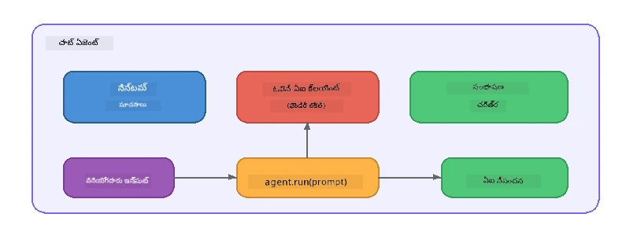

# భాగం 5: ఏజెంట్ ఫ్రేమ్‌వర్క్‌తో AI ఏజెంట్ల నిర్మాణం

> **లక్ష్యం:** Foundry Local ద్వారా స్థానిక మోడల్ ద్వారా శక్తిపంపబడిన శాశ్వత సూచనలు మరియు నిర్వచిత వ్యక్తిత్వంతో మీ మొదటి AI ఏజెంట్‌ను నిర్మించడం.

## AI ఏజెంట్ అంటే ఏమిటి?

AI ఏజెంట్ ఒక భాషా నమూనాను **వ్యవస్థా సూచనలు**తో ముడిపెడుతుంది, ఇవి దాని ప్రవర్తన, వ్యక్తిత్వం మరియు పరిమితులను నిర్వచిస్తాయి. ఒకే చాట్ పూర్తి కాల్ కంటే భిన్నంగా, ఏజెంట్ అందిస్తుంది:

- **వ్యక్తిత్వం** - ఒక సగటు గుర్తింపు ("మీరు సహాయక కోడ్ సమీక్షకులు")
- **స్మృతి** - ప.turnలు అంతటా సంభాషణ చరిత్ర
- **ప్రత్యేకత** - బాగా తయారు చేసిన సూచనల ద్వారా నడిచే ఫోకస్డ్ ప్రవర్తన



---

## మైక్రోసాఫ్ట్ ఏజెంట్ ఫ్రేమ్‌వర్క్

**మైక్రోసాఫ్ట్ ఏజెంట్ ఫ్రేమ్‌వర్క్** (AGF) వివిధ మోడల్ బ్యాకెండ్లలో పనిచేసే ప్రామాణిక ఏజెంట్ అపరాధాన్ని అందిస్తుంది. ఈ వర్క్‌షాప్‌లో మేము దాన్ని Foundry Local తో జత పరుస్తాము కాబట్టి ప్రతి విషయం మీ యంత్రంపై నడుస్తుంది - క్లౌడ్ అవసరం లేదు.

| భావన | వివరణ |
|---------|-------------|
| `FoundryLocalClient` | Python: సర్వీస్ ప్రారంభం, మోడల్ డౌన్లోడ్/లొడింగ్ నిర్వహిస్తుంది, మరియు ఏజెంట్లను సృష్టిస్తుంది |
| `client.as_agent()` | Python: Foundry Local క్లయింట్ నుండి ఏజెంట్ సృష్టిస్తుంది |
| `AsAIAgent()` | C#: `ChatClient` పై విస్తరణ పద్ధతి - ఒక `AIAgent` సృష్టిస్తుంది |
| `instructions` | ఏజెంట్ల ప్రవర్తనను ఆకారంలో మార్చే సిస్టమ్ ప్రాంప్ట్ |
| `name` | మల్టీ-ఏజెంట్ సందర్భాలలో ఉపయోగపడే మానవ పఠనీయ లేబుల్ |
| `agent.run(prompt)` / `RunAsync()` | ఒక వినియోగదారు సందేశాన్ని పంపించి ఏజెంట్ స్పందనను తీసుకొనుట |

> **గమనిక:** ఏజెంట్ ఫ్రేమ్‌వర్క్‌కు Python మరియు .NET SDKలు ఉన్నాయి. జావాస్క్రిప్ట్ కోసం, మేము OpenAI SDKని నేరుగా ఉపయోగించి అదే నమూనాను ఆవృతిచేస్తూ ఒక తేలికపాటి `ChatAgent` క్లాస్‌ను అమలు చేస్తాము.

---

## వ్యాయామాలు

### వ్యాయామం 1 - ఏజెంట్ నమూనాను అర్థం చేసుకోవడం

కోడ్ రాయకముందు, ఏజెంట్ యొక్క కీలక భాగాలను అధ్యయనం చేయండి:

1. **మోడల్ క్లయింట్** - Foundry Local యొక్క OpenAI అనుకూల APIకు కనెక్ట్ అవుతుంది
2. **సిస్టమ్ సూచనలు** - "వ్యక్తిత్వం" ప్రాంప్ట్
3. **రన్ లూప్** - వినియోగదారుని ఇన్‌పుట్ పంపించి, అవుట్‌పుట్ పొందడం

> **ఆలోచించండి:** సిస్టమ్ సూచనలు సాధారణ వినియోగదారు సందేశం నుండి ఎలా భిన్నంగా ఉంటాయి? వాటిని మార్చితే ఏమవుతుంది?

---

### వ్యాయామం 2 - సింగిల్-ఏజెంట్ ఉదాహరణ నడపడం

<details>
<summary><strong>🐍 Python</strong></summary>

**ముందికి అవసరమైనవి:**
```bash
cd python
python -m venv venv

# విండోస్ (పవర్‌షెల్):
venv\Scripts\Activate.ps1
# మ్యాక్‌ఓఎస్:
source venv/bin/activate

pip install -r requirements.txt
```

**నడపండి:**
```bash
python foundry-local-with-agf.py
```

**కోడ్ వివరణ** (`python/foundry-local-with-agf.py`):

```python
import asyncio
from agent_framework_foundry_local import FoundryLocalClient

async def main():
    alias = "phi-4-mini"

    # ఫౌండ్రీలొకల్‌క్లయెంట్ సేవ ప్రారంభం, మోడల్ డౌన్లోడ్ మరియు లోడ్ చేయడం నిర్వహిస్తుంది
    client = FoundryLocalClient(model_id=alias)
    print(f"Client Model ID: {client.model_id}")

    # సిస్టమ్ సూచనలతో ఏజెంట్‌ని సృష్టించండి
    agent = client.as_agent(
        name="Joker",
        instructions="You are good at telling jokes.",
    )

    # నాన్-స్ట్రీమింగ్: మొత్తం ప్రతిస్పందనను ఒకేసారి పొందండి
    result = await agent.run("Tell me a joke about a pirate.")
    print(f"Agent: {result}")

    # స్ట్రీమింగ్: ఫలితాలను_GENERATED_అందుబాటులోకి_రాలేదు_గా పొందండి
    async for chunk in agent.run("Tell me another joke.", stream=True):
        if chunk.text:
            print(chunk.text, end="", flush=True)

asyncio.run(main())
```

**ప్రధాన అంశాలు:**
- `FoundryLocalClient(model_id=alias)` సర్వీస్ ప్రారంభం, డౌన్లోడ్, మరియు మోడల్ లోడింగ్ ఒక స్టెప్‌లో నిర్వహిస్తుంది
- `client.as_agent()` సిస్టమ్ సూచనలు మరియు పేరు కలిగి ఏజెంట్ సృష్టిస్తుంది
- `agent.run()` రెండు నాన్-స్ట్రీమింగ్ మరియు స్ట్రీమింగ్ మోడ్‌లను మద్దతు ఇస్తుంది
- `pip install agent-framework-foundry-local --pre` ద్వారా ఇన్స్టాల్ చేయండి

</details>

<details>
<summary><strong>📦 JavaScript</strong></summary>

**ముందుకు అవసరమైనవి:**
```bash
cd javascript
npm install
```

**నడపండి:**
```bash
node foundry-local-with-agent.mjs
```

**కోడ్ వివరణ** (`javascript/foundry-local-with-agent.mjs`):

```javascript
import { OpenAI } from "openai";
import { FoundryLocalManager } from "foundry-local-sdk";

class ChatAgent {
  constructor({ client, modelId, instructions, name }) {
    this.client = client;
    this.modelId = modelId;
    this.instructions = instructions;
    this.name = name;
    this.history = [];
  }

  async run(userMessage) {
    const messages = [
      { role: "system", content: this.instructions },
      ...this.history,
      { role: "user", content: userMessage },
    ];
    const response = await this.client.chat.completions.create({
      model: this.modelId,
      messages,
    });
    const assistantMessage = response.choices[0].message.content;

    // బహుళ-తిరుగుబాటు పరస్పర చర్యల కోసం సంభాషణ చరిత్రని ఉంచండి
    this.history.push({ role: "user", content: userMessage });
    this.history.push({ role: "assistant", content: assistantMessage });
    return { text: assistantMessage };
  }
}

async function main() {
  FoundryLocalManager.create({ appName: "FoundryLocalWorkshop" });
  const manager = FoundryLocalManager.instance;
  await manager.startWebService();

  const catalog = manager.catalog;
  const model = await catalog.getModel("phi-3.5-mini");
  if (!model.isCached) {
    console.log("Downloading model: phi-3.5-mini...");
    await model.download();
  }
  await model.load();

  const client = new OpenAI({
    baseURL: manager.urls[0] + "/v1",
    apiKey: "foundry-local",
  });

  const agent = new ChatAgent({
    client,
    modelId: model.id,
    instructions: "You are good at telling jokes.",
    name: "Joker",
  });

  const result = await agent.run("Tell me a joke about a pirate.");
  console.log(result.text);
}

main();
```

**ప్రధాన అంశాలు:**
- జావాస్క్రిప్ట్ తన స్వంత `ChatAgent` క్లాస్‌ను Python AGF నమూనాను అనుసరించి నిర్మిస్తుంది
- `this.history` అనేది మల్టీ-టర్న్ మద్దతు కోసం సంభాషణ టర్న్లను నిల్వ చేస్తుంది
- స్పష్టమైన `startWebService()` → క్యాష్ తనిఖీ → `model.download()` → `model.load()` పూర్తి విజిబిలిటీ ఇస్తుంది

</details>

<details>
<summary><strong>💜 C#</strong></summary>

**ముందుకు అవసరమైనవి:**
```bash
cd csharp
dotnet restore
```

**నడపండి:**
```bash
dotnet run agent
```

**కోడ్ వివరణ** (`csharp/SingleAgent.cs`):

```csharp
using Microsoft.AI.Foundry.Local;
using Microsoft.Extensions.Logging.Abstractions;
using Microsoft.Agents.AI;
using OpenAI;
using System.ClientModel;

// 1. Start Foundry Local and load a model
var alias = "phi-3.5-mini";
await FoundryLocalManager.CreateAsync(
    new Configuration
    {
        AppName = "FoundryLocalSamples",
        Web = new Configuration.WebService { Urls = "http://127.0.0.1:0" }
    }, NullLogger.Instance, default);
var manager = FoundryLocalManager.Instance;
await manager.StartWebServiceAsync(default);

var catalog = await manager.GetCatalogAsync(default);
var model = await catalog.GetModelAsync(alias, default);

var isCached = await model.IsCachedAsync(default);
if (!isCached)
{
    Console.WriteLine($"Downloading model: {alias}...");
    await model.DownloadAsync(null, default);
}
await model.LoadAsync(default);

var key = new ApiKeyCredential("foundry-local");
var client = new OpenAIClient(key, new OpenAIClientOptions
{
    Endpoint = new Uri(manager.Urls[0] + "/v1")
});

// 2. Create an AIAgent using the Agent Framework extension method
AIAgent joker = client
    .GetChatClient(model.Id)
    .AsAIAgent(
        instructions: "You are good at telling jokes. Keep your jokes short and family-friendly.",
        name: "Joker"
    );

// 3. Run the agent (non-streaming)
var response = await joker.RunAsync("Tell me a joke about a pirate.");
Console.WriteLine($"Joker: {response}");

// 4. Run with streaming
await foreach (var update in joker.RunStreamingAsync("Tell me another joke."))
{
    Console.Write(update);
}
```

**ప్రధాన అంశాలు:**
- `AsAIAgent()` అనేది `Microsoft.Agents.AI.OpenAI` నుండి విస్తరణ పద్ధతి - కస్టమ్ `ChatAgent` క్లాసు అవసరం లేదు
- `RunAsync()` పూర్తి స్పందనను ఇస్తుంటుంది; `RunStreamingAsync()` టోకెన్ వారీగా స్ట్రీమ్ చేస్తుంది
- `dotnet add package Microsoft.Agents.AI.OpenAI --version 1.0.0-rc3` ద్వారా ఇన్స్టాల్ చేయండి

</details>

---

### వ్యాయామం 3 - వ్యక్తిత్వాన్ని మార్చడం

ఏజెంట్ యొక్క `instructions` ను మార్చి ఒక వేరొక వ్యక్తిత్వాన్ని సృష్టించండి. ఒక్కొక్కటీ ప్రయత్నించి అవుట్‌పుట్ ఎలా మారుతుందో గమనించండి:

| వ్యక్తిత్వం | సూచనలు |
|---------|-------------|
| కోడ్ సమీక్షకుడు | `"మీరు ఒక నిపుణ కోడ్ సమీక్షకరు. పఠనీయత, పనితీరు, మరియు సరైనతపై కేంద్రీకరించి నిర్మాణాత్మక అభిప్రాయాలు ఇవ్వండి."` |
| యాత్ర గైడ్ | `"మీరు మిత్రమైన యాత్ర గైడ్. గమ్యస్థలాలు, కార్యకలాపాలు, మరియు స్థానిక వంటకాలకు వ్యక్తిగత సిఫారసులు ఇవ్వండి."` |
| సొక్రాటిక్ గురువు | `"మీరు సొక్రాటిక్ గురువు. ప్రత్యక్ష సమాధానాలు ఇవ్వకండి - బదులు విద్యార్థిని తగిన ప్రశ్నలతో మార్గనిర్దేశం చేయండి."` |
| సాంకేతిక రచయిత | `"మీరు సాంకేతిక రచయిత. ఆలోచనలు స్పష్టంగా మరియు సంక్షిప్తంగా వివరించండి. ఉదాహరణలు ఉపయోగించండి. జార్గాన్ నివారించండి."` |

**ప్రయత్నించండి:**
1. పైన పట్టిక నుండి ఒక వ్యక్తిత్వాన్ని ఎంచుకోండి
2. కోడ్‌లో ఉన్న `instructions` స్ట్రింగ్‌ను మార్చండి
3. వినియోగదారు ప్రాంప్ట్‌ను సరిపోయే విధంగా సర్దుబాటు చేయండి (ఉదా: కోడ్ సమీక్షకుడిని ఒక ఫంక్షన్ సమీక్షించాలని అడగండి)
4. ఉదాహరణను మళ్లీ నడిపించి అవుట్‌పుట్‌ను పోల్చండి

> **సూచి:** ఏజెంట్ నాణ్యత ప్రధానంగా సూచనలపై ఆధారపడింది. స్పష్టమైన, బాగా నిర్మించిన సూచనలు అమోఘ ఫలితాలు ఇస్తాయి.

---

### వ్యాయామం 4 - బహు-టర్న్ సంభాషణ జోడించడం

ఏజెంట్‌తో వెనక్కు-కొనakka సంభాషణ జరగడానికి బహు-టర్న్ చాట్ లూప్ మద్దతు కలిగి ఉదాహరణను విస్తరించండి.

<details>
<summary><strong>🐍 Python - బహు-టర్న్ లూప్</strong></summary>

```python
import asyncio
from agent_framework_foundry_local import FoundryLocalClient

async def main():
    client = FoundryLocalClient(model_id="phi-4-mini")

    agent = client.as_agent(
        name="Assistant",
        instructions="You are a helpful assistant.",
    )

    print("Chat with the agent (type 'quit' to exit):\n")
    while True:
        user_input = input("You: ")
        if user_input.strip().lower() in ("quit", "exit"):
            break
        result = await agent.run(user_input)
        print(f"Agent: {result}\n")

asyncio.run(main())
```

</details>

<details>
<summary><strong>📦 JavaScript - బహు-టర్న్ లూప్</strong></summary>

```javascript
import { OpenAI } from "openai";
import { FoundryLocalManager } from "foundry-local-sdk";
import * as readline from "node:readline/promises";

// (వ్యాయామం 2 నుండి ChatAgent తరగతిని పునర్వినియోగించండి)

async function main() {
  FoundryLocalManager.create({ appName: "FoundryLocalWorkshop" });
  const manager = FoundryLocalManager.instance;
  await manager.startWebService();

  const catalog = manager.catalog;
  const model = await catalog.getModel("phi-3.5-mini");
  if (!model.isCached) {
    console.log("Downloading model: phi-3.5-mini...");
    await model.download();
  }
  await model.load();

  const client = new OpenAI({
    baseURL: manager.urls[0] + "/v1",
    apiKey: "foundry-local",
  });

  const agent = new ChatAgent({
    client,
    modelId: model.id,
    instructions: "You are a helpful assistant.",
    name: "Assistant",
  });

  const rl = readline.createInterface({
    input: process.stdin,
    output: process.stdout,
  });

  console.log("Chat with the agent (type 'quit' to exit):\n");
  while (true) {
    const userInput = await rl.question("You: ");
    if (["quit", "exit"].includes(userInput.trim().toLowerCase())) break;
    const result = await agent.run(userInput);
    console.log(`Agent: ${result.text}\n`);
  }
  rl.close();
}

main();
```

</details>

<details>
<summary><strong>💜 C# - బహు-టర్న్ లూప్</strong></summary>

```csharp
using Microsoft.AI.Foundry.Local;
using Microsoft.Extensions.Logging.Abstractions;
using Microsoft.Agents.AI;
using OpenAI;
using System.ClientModel;

var alias = "phi-3.5-mini";
var config = new Configuration
{
    AppName = "FoundryLocalSamples",
    Web = new Configuration.WebService { Urls = "http://127.0.0.1:0" }
};
await FoundryLocalManager.CreateAsync(config, NullLogger.Instance, default);
var manager = FoundryLocalManager.Instance;
await manager.StartWebServiceAsync(default);

var catalog = await manager.GetCatalogAsync(default);
var model = await catalog.GetModelAsync(alias, default);

var isCached = await model.IsCachedAsync(default);
if (!isCached)
{
    Console.WriteLine($"Downloading model: {alias}...");
    await model.DownloadAsync(null, default);
}
await model.LoadAsync(default);

var key = new ApiKeyCredential("foundry-local");
var client = new OpenAIClient(key, new OpenAIClientOptions
{
    Endpoint = new Uri(manager.Urls[0] + "/v1")
});

AIAgent agent = client
    .GetChatClient(model.Id)
    .AsAIAgent(
        instructions: "You are a helpful assistant.",
        name: "Assistant"
    );

Console.WriteLine("Chat with the agent (type 'quit' to exit):\n");
while (true)
{
    Console.Write("You: ");
    var userInput = Console.ReadLine();
    if (string.IsNullOrWhiteSpace(userInput) ||
        userInput.Equals("quit", StringComparison.OrdinalIgnoreCase) ||
        userInput.Equals("exit", StringComparison.OrdinalIgnoreCase))
        break;

    var result = await agent.RunAsync(userInput);
    Console.WriteLine($"Agent: {result}\n");
}
```

</details>

ఏజెంట్ మునుపటి టర్న్లను ఎలా గుర్తుంచుకుంటుందో గమనించండి - ఫాలో-అప్ ప్రశ్న అడిగి కాన్టెక్స్ట్ ఎలా కొనసాగుతుందో చూడండి.

---

### వ్యాయామం 5 - నిర్మాణాత్మక అవుట్పుట్

ఏజెంట్‌ను ఎప్పుడూ ఒక నిర్దిష్ట ఫార్మాట్ (ఉదా: JSON) లో స్పందించాలని సూచించి ఫలితాన్ని పార్స్ చేయండి:

<details>
<summary><strong>🐍 Python - JSON అవుట్పుట్</strong></summary>

```python
import asyncio
import json
from agent_framework_foundry_local import FoundryLocalClient

async def main():
    client = FoundryLocalClient(model_id="phi-4-mini")

    agent = client.as_agent(
        name="SentimentAnalyzer",
        instructions=(
            "You are a sentiment analysis agent. "
            "For every user message, respond ONLY with valid JSON in this format: "
            '{"sentiment": "positive|negative|neutral", "confidence": 0.0-1.0, "summary": "brief reason"}'
        ),
    )

    result = await agent.run("I absolutely loved the new restaurant downtown!")
    print("Raw:", result)

    try:
        parsed = json.loads(str(result))
        print(f"Sentiment: {parsed['sentiment']} (confidence: {parsed['confidence']})")
    except json.JSONDecodeError:
        print("Agent did not return valid JSON - try refining the instructions.")

asyncio.run(main())
```

</details>

<details>
<summary><strong>💜 C# - JSON అవుట్పుట్</strong></summary>

```csharp
using System.Text.Json;

AIAgent analyzer = chatClient.AsAIAgent(
    name: "SentimentAnalyzer",
    instructions:
        "You are a sentiment analysis agent. " +
        "For every user message, respond ONLY with valid JSON in this format: " +
        "{\"sentiment\": \"positive|negative|neutral\", \"confidence\": 0.0-1.0, \"summary\": \"brief reason\"}"
);

var response = await analyzer.RunAsync("I absolutely loved the new restaurant downtown!");
Console.WriteLine($"Raw: {response}");

try
{
    var parsed = JsonSerializer.Deserialize<JsonElement>(response.ToString());
    Console.WriteLine($"Sentiment: {parsed.GetProperty("sentiment")} " +
                      $"(confidence: {parsed.GetProperty("confidence")})");
}
catch (JsonException)
{
    Console.WriteLine("Agent did not return valid JSON - try refining the instructions.");
}
```

</details>

> **గమనిక:** చిన్న స్థానిక మోడళ్ళు ఎప్పుడూ పరిపూర్ణంగా సరైన JSON తయారు చేయకపోవచ్చు. సూచనల్లో ఉదాహరణలను చేర్చి మరియు అంచనా ఫార్మాట్ గురించి చాలా స్పష్టంగా చెప్పడం ద్వారా నమ్మకదాయకతను పెంచవచ్చు.

---

## ప్రధాన పాఠాలు

| భావన | మీరు నేర్చుకున్నది |
|---------|-----------------|
| ఏజెంట్ vs. ముడి LLM కాల్ | ఏజెంట్ ఒక మోడల్‌ను సూచనలు మరియు స్మృతితో ముడిపెడుతుంది |
| సిస్టమ్ సూచనలు | ఏజెంట్ ప్రవర్తనను నియంత్రించే అత్యంత ముఖ్యమైన లివర్ |
| బహు-టర్న్ సంభాషణ | ఏజెంట్లు అనేక వినియోగదారు పరస్పర సంబంధాలలో కాన్టెక్స్ట్‌ను తీసుకెళ్తాయి |
| నిర్మాణాత్మక అవుట్పుట్ | సూచనలు అవుట్పుట్ ఫార్మాట్ను (JSON, మార్క్డౌన్, మొదలైనవి) అమలు చేయగలవు |
| స్థానిక అమలు | ప్రతిదీ Foundry Local ద్వారా డివైస్‌పై నడుస్తుంది - క్లౌడ్ అవసరం లేదు |

---

## తదుపరి దశలు

**[భాగం 6: బహుఏజెంట్ వర్క్ఫ్లో](part6-multi-agent-workflows.md)**లో, మీరు ఒకదానికొకటి ప్రత్యేక పాత్రలు కలిగిన అనేక ఏజెంట్లను సమన్వయపూర్వకమైన పైప్లైన్‌గా కలుపుతారు.