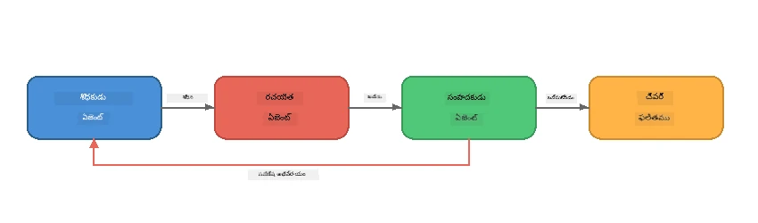
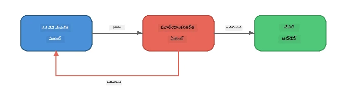
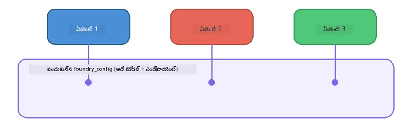

# భాగము 6: బహు-ఏజెంట్ పనితీరులు

> **లక్ష్యం:** విభిన్న నిపుణుల ఏజెంట్లను సమన్వయమయిన పైప్‌లైన్లలో కలిపి, ఒకరితో మరొకరి సహకారంతో క్లిష్టమైన పనులను విభజించడం - ఇవన్నీ Foundry Local లో లోకల్ గా జారుస్తూ.

## ఎందుకు బహుఏజెంట్?

ఒకే ఏజెంట్ అనేక పనులను నిర్వహించగలదు, కానీ క్లిష్టమైన పనితీరులు **నిపుణత్వం** వల్ల మెరుగ్గా జరుగుతాయి. ఒక ఏజెంట్ ఒకేసారి పరిశోధన, రచన, సవరణ చేయడం కంటె, పని విభాగాలుగా విభజించడం మంచిది:



| నమూనా | వివరణ |
|---------|-------------|
| **క్రమం వారీగా** | ఏజెంట్ A ఔట్‌పుట్ ఏజెంట్ B → ఏజెంట్ C కి కలుపుతుంది |
| **సమీక్ష చక్రం** | ఒక మూల్యాంకన ఏజెంట్ పని తిరిగి సవరణకు పంపవచ్చు |
| **షేర్ చేయబడిన సందర్భం** | అన్ని ఏజెంట్లు అదే మోడల్/ఎండ్‌పాయింట్ను ఉపయోగిస్తాయి, కానీ వేర్వేరు సూచనలు పాటిస్తాయి |
| **టైపెడ్ అవుట్‌పుట్** | ఏజెంట్లు నిర్మిత ఫలితాలు (JSON) ఉత్పత్తి చేస్తాయి, హ్యాండ్-ఆఫ్స్ నమ్మకంగా జరుగుతాయి |

---

## వ్యాయామాలు

### వ్యాయామం 1 - బహుఏజెంట్ పైప్‌లైన్ నడపండి

వర్క్‌షాప్ లో పూర్తిగా Researcher → Writer → Editor పని తీరే ఉంది.

<details>
<summary><strong>🐍 పైథాన్</strong></summary>

**సెట్టప్:**
```bash
cd python
python -m venv venv

# విండోస్ (పవర్‌షెల్):
venv\Scripts\Activate.ps1
# మాక్‌ఓఎస్:
source venv/bin/activate

pip install -r requirements.txt
```

**నడపండి:**
```bash
python foundry-local-multi-agent.py
```

**ఏం జరుగుతుంది:**
1. **రిసర్చర్** ఒక విషయం అంద 받고 బుల్లెట్ పాయింట్ ప్రకారం నిజాలు అందిస్తుంది
2. **రైటర్** పరిశోధన తీసుకుని ఒక బ్లాగ్ పోస్ట్ ను (3-4 పేరాగ్రాఫ్‌లు) తయారు చేస్తాడు
3. **ఎడిటర్** ఆర్టికల్ నాణ్యత కోసం సమీక్షించి ACCEPT లేదా REVISE సరిపడినట్లు రిటర్న్ చేస్తాడు

</details>

<details>
<summary><strong>📦 జావాస్క్రిప్ట్</strong></summary>

**సెట్టప్:**
```bash
cd javascript
npm install
```

**నడపండి:**
```bash
node foundry-local-multi-agent.mjs
```

**అదే మూడు దశల పైప్‌లైన్** - Researcher → Writer → Editor.

</details>

<details>
<summary><strong>💜 C#</strong></summary>

**సెట్టప్:**
```bash
cd csharp
dotnet restore
```

**నడపండి:**
```bash
dotnet run multi
```

**అదే మూడు దశల పైప్‌లైన్** - Researcher → Writer → Editor.

</details>

---

### వ్యాయామం 2 - పైప్‌లైన్ నిర్మాణం

ఏజెంట్లు ఎలా నిర్వచించబడ్డాయో మరియు కనెక్ట్ అయ్యాయో అధ్యయనం చేయండి:

**1. షేర్డ్ మోడల్ క్లయింట్**

అన్ని ఏజెంట్లు ఒకే Foundry Local మోడల్ ను ఉపయోగిస్తాయి:

```python
# Python - FoundryLocalClient అన్నింటినీ నిర్వహిస్తుంది
from agent_framework_foundry_local import FoundryLocalClient

client = FoundryLocalClient(model_id="phi-3.5-mini")
```

```javascript
// జావాస్క్రిప్ట్ - ఫౌండ్రీ లోకల్‌ను సూచించే OpenAI SDK
const client = new OpenAI({
  baseURL: manager.urls[0] + "/v1",
  apiKey: "foundry-local",
});
```

```csharp
// C# - OpenAIClient pointed at Foundry Local
var key = new ApiKeyCredential("foundry-local");
var client = new OpenAIClient(key, new OpenAIClientOptions
{
    Endpoint = new Uri(manager.Urls[0] + "/v1")
});
var chatClient = client.GetChatClient(model.Id);
```

**2. నిపుణుల సూచనలు**

ప్రతి ఏజెంట్ కు ప్రత్యేక వ్యక్తిత్వం ఉంది:

| ఏజెంట్ | సూచనలు (సారాంశం) |
|-------|----------------------|
| రిసర్చర్ | "ప్రధాన నిజాలు, గణాంకాలు, నేపథ్యం ఇవ్వండి. బుల్లెట్ పాయింట్లుగా ఏర్పాటు చేయండి." |
| రైటర్ | "పరిశోధన నోట్స్ నుంచి ఆరంభించి 3-4 పేరాగ్రాఫ్‌లతో ఆకట్టుకునే బ్లాగ్ పోస్ట్ రాయండి. నిజాలు మనిపించకండి." |
| ఎడిటర్ | "స్పష్టత, వ్యాకరణం, వాస్తవ సరిపోలిక కోసం సమీక్షించండి. తీర్పు: ACCEPT లేదా REVISE." |

**3. ఏజెంట్ల మధ్య డేటా ప్రవాహం**

```python
# దశ 1 - పరిశోధకుడి అవుట్పుట్ రచయితకు ఇన్‌పుట్ అవుతుంది
research_result = await researcher.run(f"Research: {topic}")

# దశ 2 - రచయిత అవుట్పుట్ ఎడిటర్ కు ఇన్‌పుట్ అవుతుంది
writer_result = await writer.run(f"Write using:\n{research_result}")

# దశ 3 - ఎడిటర్ పరిశోధన మరియు ఆర్టికల్ రెండింటినీ సమీక్షించాలి
editor_result = await editor.run(
    f"Research:\n{research_result}\n\nArticle:\n{writer_result}"
)
```

```csharp
// C# - same pattern, async calls with AIAgent
var researchNotes = await researcher.RunAsync(
    $"Research the following topic and provide key facts:\n{topic}");

var draft = await writer.RunAsync(
    $"Write a blog post based on these research notes:\n\n{researchNotes}");

var verdict = await editor.RunAsync(
    $"Review this article for quality and accuracy.\n\n" +
    $"Research notes:\n{researchNotes}\n\n" +
    $"Article:\n{draft}");
```

> **ప్రధాన అవగాహన:** ప్రతి ఏజెంట్ ముందు ఏజెంట్ల నుండి పొందిన సారాంశాన్ని పొందుతుంది. ఎడిటర్ అసలు పరిశోధన మరియు డ్రాఫ్ట్ రెండింటిని చూసి వాస్తవ సరిపోలిక చూసుకోగలదు.

---

### వ్యాయామం 3 - నాలుగో ఏజెంట్ చేర్చండి

పైప్‌లైన్‌కు కొత్త ఏజెంట్ చేర్చండి. ఒకటి ఎంచుకోండి:

| ఏజెంట్ | ఉద్దేశం | సూచనలు |
|-------|---------|-------------|
| **ఫ్యాక్ట్-చెక్కర్** | వ్యాసంలోని క్లెయిమ్స్ ధృవీకరించండి | `"మీరు వాస్తవ క్లెయిమ్స్ ధృవీకరిస్తారు. ప్రతి క్లైమ్ కోసం అది పరిశోధన నోట్స్ తో మద్దతు పొందిందా అని పేర్కొనండి. ధృవీకరించిన/అనధృవీకరించిన అంశాల JSON రిటర్న్ చేయండి."` |
| **హెడ్‌లైన్ రైటర్** | ఆకర్షణీయమైన శీర్షికలు సృష్టించండి | `"ఆర్టికల్ కోసం 5 శీర్షికల ఎంపికలు రూపొందించండి. శైలిని మార్చండి: సమాచారాత్మక, క్లిక్‌బెయిట్, ప్రశ్న, లిస్టికల్, భావోద్వేగాత్మక."` |
| **సోషల్ మీడియా** | ప్రమోషనల్ పోస్టులు సృష్టించండి | `"ఈ ఆర్టికల్ ని ప్రోత్సహించే 3 సోషల్ మీడియా పోస్టులు తయారు చేయండి: ఒకటి ట్విట్టర్ (280 క్యారెక్టర్లు), ఒకటి లింక్డ్ఇన్ (ప్రొఫెషనల్ టోన్), ఒకటి ఇన్‌స్టాగ్రామ్ (కేజ్‌వల్, ఎమోజీ సూచనలతో)."` |

<details>
<summary><strong>🐍 పైథాన్ - హెడ్‌లైన్ రైటర్ చేర్చడం</strong></summary>

```python
headline_agent = client.as_agent(
    name="HeadlineWriter",
    instructions=(
        "You are a headline specialist. Given an article, generate exactly "
        "5 headline options. Vary the style: informative, question-based, "
        "listicle, emotional, and provocative. Return them as a numbered list."
    ),
)

# ఎడిటర్ ఆమోదించిన తర్వాత, శీర్షికలను ఉత్పత్తి చేయండి
headline_result = await headline_agent.run(
    f"Generate headlines for this article:\n\n{writer_result}"
)
print(f"\n--- Headlines ---\n{headline_result}")
```

</details>

<details>
<summary><strong>📦 జావాస్క్రిప్ట్ - హెడ్‌లైన్ రైటర్ చేర్చడం</strong></summary>

```javascript
const headlineAgent = new ChatAgent({
  client,
  modelId: modelInfo.id,
  instructions:
    "You are a headline specialist. Given an article, generate exactly " +
    "5 headline options. Vary the style: informative, question-based, " +
    "listicle, emotional, and provocative. Return them as a numbered list.",
  name: "HeadlineWriter",
});

const headlineResult = await headlineAgent.run(
  `Generate headlines for this article:\n\n${writerResult.text}`
);
console.log(`\n--- Headlines ---\n${headlineResult.text}`);
```

</details>

<details>
<summary><strong>💜 C# - హెడ్‌లైన్ రైటర్ చేర్చడం</strong></summary>

```csharp
AIAgent headlineAgent = chatClient.AsAIAgent(
    name: "HeadlineWriter",
    instructions:
        "You are a headline specialist. Given an article, generate exactly " +
        "5 headline options. Vary the style: informative, question-based, " +
        "listicle, emotional, and provocative. Return them as a numbered list."
);

// After the editor accepts, generate headlines
var headlines = await headlineAgent.RunAsync(
    $"Generate headlines for this article:\n\n{draft}");
Console.WriteLine($"\n--- Headlines ---\n{headlines}");
```

</details>

---

### వ్యాయామం 4 - మీ స్వంత పని తీరును డిజైన్ చేయండి

వేరే డొమైన్ కోసం బహుఏజెంట్ పైప్లైన్ డిజైన్ చేయండి. కొన్ని ఆలోచనలు:

| డొమైన్ | ఏజెంట్లు | పని ప్రవాహం |
|--------|--------|------|
| **కోడ్ సమీక్ష** | అనాలైజర్ → రివ్యువర్ → సమ్మరీ సృష్టికర్త | కోడ్ నిర్మాణం విశ్లేషణ → సమస్యల కోసం సమీక్ష → సమ్మరీ రిపోర్ట్ |
| **కస్టమర్ సపోర్ట్** | క్లాసిఫయర్ → రిస్పాండర్ → QA | టికెట్ వర్గీకరణ → జవాబు రచన → నాణ్యత తనిఖీ |
| **విద్య** | క్విజ్ సృష్టికర్త → విద్యార్థి అనుకరణ → గ్రేడ్ ఇవ్వటం | క్విజ్ రూపొందింపు → సమాధానాలు అంచనా → గ్రేడ్ మరియు వివరణ ఇవ్వటం |
| **డేటా విశ్లేషణ** | ఇంటర్ప్రిటర్ → అనలిస్టు → రిపోర్టర్ | డేటా అభ్యర్థన అర్థం చేసుకోవడం → పట్టికలు విశ్లేషణ → రిపోర్టు రచన |

**దశలు:**
1. 3 లేదా అంతకంటే ఎక్కువ ఏజెంట్లు నిర్దేశించండి, ప్రత్యేక `సూచనలు`తో
2. డేటా ప్రవాహాన్ని నిర్ణయించండి - ఏ ఏజెంట్ ఎం అందుకుంటాడు, ఎం ఉత్పత్తి చేస్తాడు?
3. వ్యాయామాలు 1-3 లోని నమూనాలు ఉపయోగించి పైప్లైన్ అమలు చేయండి
4. అవసరమైతే ఒక ఏజెంట్ మరొక ఏజెంట్ పనిని మూల్యాంకించేందుకు సమీక్ష చక్రాన్ని జోడించండి

---

## సమన్వయ నమూనాలు

ఏ బహుఏజెంట్ వ్యవస్థకి వర్తించే సమన్వయ నమూనాలు (వివరంగా [భాగం 7](part7-zava-creative-writer.md) లో అందు):

### క్రమబద్ధమైన పైప్‌లైన్


ప్రతి ఏజెంట్ ముందు ఏజెంట్ ఔట్‌పుట్ పై పని చేస్తుంది. సరళంగా, ఊహించదగినది.

### సమీక్ష చక్రం



మూల్యాంకన ఏజెంట్ ముందటి దశలను పునః ప్రయోగానికి ట్రిగ్గర్ చేయవచ్చు. Zava Writer లో ఇది వాడతారు: ఎడిటర్ రిసర్చర్ మరియు రైటర్ కోసo ఫీడ్బ్యాక్ పంపగలడు.

### షేర్ చేయబడిన సందర్భం



అన్ని ఏజెంట్లు ఒకే `foundry_config` ని పంచుకొని ఒకటే మోడల్ మరియు ఎండ్‌పాయింట్ను ఉపయోగిస్తాయి.

---

## ముఖ్యమైన పాఠాలు

| భావన | మీరు నేర్చుకున్నది |
|---------|-----------------|
| ఏజెంట్ నిపుణత్వం | ప్రతి ఏజెంట్ ఒకదానిలో నైపుణ్యం కలిగి, స్పష్టమైన సూచనలతో పని చేస్తుంది |
| డేటా హ్యాండ్-ఆఫ్స్ | ఒక ఏజెంట్ ఔట్‌పుట్ తర్వాతి ఏజెంట్కి ఇన్‌పుట్ అవుతుంది |
| సమీక్ష చక్రాలు | మూల్యాంకన ఏజెంట్ పునఃప్రయత్నాలు ప్రారంభించి నాణ్యత పెంచగలడు |
| నిర్మిత అవుట్‌పుట్ | JSON ఆకృతిలో స్పందనలు ఏజెంట్ మధ్య నమ్మకమైన కమ్యూనికేషన్ ఇస్తాయి |
| సమన్వయం | కోఆర్డినేటర్ పైప్‌లైన్ క్రమం మరియు లోపాల నిర్వహణ నిర్వర్తిస్తుంది |
| ఉత్పత్తి నమూనాలు | [భాగం 7: Zava Creative Writer](part7-zava-creative-writer.md)లో వర్తింపబడినవి |

---

## తదుపరి దశలు

[భాగం 7: Zava Creative Writer - Capstone Application](part7-zava-creative-writer.md) కు కొనసాగండి, 4 నిపుణుల ఏజెంట్లతో ప్రొడక్షన్-శైలి బహుఏజెంట్ యాప్ ను, స్ట్రీమింగ్ ఔట్‌పుట్, ఉత్పత్తి శోధన మరియు సమీక్ష చక్రాలతో అన్వేషించండి - ఇది Python, JavaScript, మరియు C#లో అందుబాటులో ఉంది.