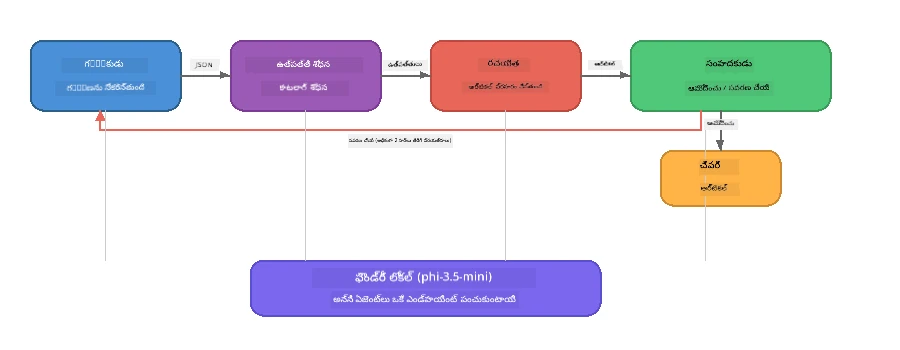

# భాగం 7: జావా క్రియేటివ్ రైటర్ - క్యాప్‌స్టోన్ అప్లికేషన్

> **లక్ష్యం:** నాలుగు ప్రత్యేక ఏజెంట్లు కలిసి పనిచేసే ప్రొడక్షన్-శैली బహుళ-ఏజెంట్ అప్లికేషన్‌ను అన్వేషించండి, ఇది Foundry Localతో మీ డివైస్‌లో పూర్తిగా నడుస్తూ Zava రీటైల్ DIY కోసం మ్యాగజైన్-నాణ్యత ఆర్టికల్స్ తయారుచేస్తుంది.

ఇది వర్క్‌షాప్ యొక్క **క్యాప్‌స్టోన్ ల్యాబ్**. ఇది మీరు నేర్చుకున్న అన్నింటినీ కలుపుతుంది - SDK ఇంటిగ్రేషన్ (భాగం 3), స్థానిక డేటా నుండి రిట్రీవల్ (భాగం 4), ఏజెంట్ పర్సోనాస్ (భాగం 5), మరియు బహుళ ఏజెంట్ సంస్థాపన (భాగం 6) - మరియు **Python**, **JavaScript** మరియు **C#** లో అందుబాటులో ఉండే పూర్తి అప్లికేషన్.

---

## మీరు ఏమి అన్వేషిస్తారు

| అంశం | Zava రైటర్‌లో ఏ ప్రాంతంలో |
|---------|----------------------------|
| 4-దశల మోడల్ లోడింగ్ | షేర్డ్ కాన్ఫిగ్ మాడ్యూల్ Foundry Localను బూట్‌స్ట్రాప్ చేస్తుంది |
| RAG-శైలి రిట్రీవల్ | ప్రోడక్ట్ ఏజెంట్ స్థానిక క్యాటలాగ్‌ను శోధిస్తుంది |
| ఏజెంట్ ప్రత్యేకత | వేర్వేరు సిస్టమ్ ప్రమ్‌ప్ట్‌లతో 4 ఏజెంట్లు |
| స్ట్రీమింగ్ అవుట్‌పుట్ | రైటర్ రియల్-టైమ్‌లో టోకెన్స్‌ను ఇస్తుంది |
| నిర్మాణమైన హ్యాండ్-ఆఫ్లు | రీసెర్చర్ → JSON, ఎడిటర్ → JSON నిర్ణయం |
| ఫీడ్‌బ్యాక్ లూప్స్ | ఎడిటర్ పునఃనిర్వహణ (గరిష్టం 2 రీట్రైలు) ప్రేరేపించవచ్చు |

---

## నిర్మాణం

Zava Creative Writer ఒక **క్రమబద్ధమైన పైప్‌లైన్‌ని నిర్వాహక-నియంత్రిత ఫీడ్‌బ్యాక్‌తో** ఉపయోగిస్తుంది. మూడు భాషల అమలులూ అదే నిర్మాణం అనుసరిస్తాయి:



### నాలుగు ఏజెంట్లు

| ఏజెంట్ | ఇన్‌పుట్ | అవుట్‌పుట్ | ప్రయోజనం |
|-------|-------|--------|---------|
| **రీసెర్చర్** | విషయం + ఐచ్ఛిక ఫీడ్‌బ్యాక్ | `{"web": [{url, name, description}, ...]}` | LLM ద్వారా నేపథ్య పరిశోధన సేకరిస్తుంది |
| **ప్రోడక్ట్ శోధన** | ప్రోడక్ట్ సందర్భ స్ట్రింగ్ | సరిపోలిన ఉత్పత్తుల జాబితా | LLM-జనిత ప్రశ్నలు + స్థానిక క్యాటలాగ్‌పై కీవర్డ్ శోధన |
| **రైటర్** | పరిశోధన + ఉత్పత్తులు + అసైన్‌మెంట్ + ఫీడ్‌బ్యాక్ | స్ట్రీమ్ చేయబడే ఆర్టికల్ టెక్స్ట్ (`---` వద్ద విభజించబడుతుంది) | రియల్-టైమ్‌లో మ్యాగజైన్-నాణ్యత ఆర్టికల్ను డ్రాఫ్ట్ చేస్తుంది |
| **ఎడిటర్** | ఆర్టికల్ + రైటర్ స్వీయ-ఫీడ్‌బ్యాక్ | `{"decision": "accept/revise", "editorFeedback": "...", "researchFeedback": "..."}` | నాణ్యతను సమీక్షిస్తుంది, అవసరమైతే రీట్రై ప్రేరేపిస్తుంది |

### పైప్‌లైన్ ప్రవాహం

1. **రీసెర్చర్** విషయాన్ని అందుకుని నిర్మాణాత్మక పరిశోధనా నోట్స్ (JSON) తయారు చేస్తుంది
2. **ప్రోడక్ట్ శోధన** LLM-సృష్టించిన శోధన పదాలతో స్థానిక ప్రోడక్ట్ క్యాటలాగ్‌ను ప్రశ్నిస్తుంది
3. **రైటర్** పరిశోధన + ఉత్పత్తులు + అసైన్‌మెంట్ కలిపి స్ట్రీమింగ్ ఆర్టికల్ రూపొందించి, అనంతరం `---` విభాజకంతో స్వీయ-ఫీడ్‌బ్యాక్ జోడిస్తుంది
4. **ఎడిటర్** ఆర్టికల్‌ను సమీక్షించి JSON రివ్యూ ఇవ్వాలి:
   - `"accept"` → పైప్‌లైన్ పూర్తవుతుంది
   - `"revise"` → ఫీడ్‌బ్యాక్ రీసెర్చర్ మరియు రైటర్‌కు పంపబడుతుంది (గరిష్టం 2 రీట్రైలు)

---

## ముందస్తు అవసరాలు

- [భాగం 6: బహుళ ఏజెంట్ వర్క్‌ఫ్లోస్](part6-multi-agent-workflows.md) పూర్తి చేయండి
- Foundry Local CLI ఇన్‌స్టాల్ చేసి `phi-3.5-mini` మోడల్ డౌన్లోడ్ చేసుకోండి

---

## విన్యాసాలు

### విన్యాసం 1 - Zava Creative Writer నడపండి

మీ భాషను ఎంచుకుని అప్లికేషన్ నడపండి:

<details>
<summary><strong>🐍 Python - FastAPI వెబ్ సర్వీస్</strong></summary>

Python వెర్షన్ **web service**గా REST APIతో నడుస్తుంది, ప్రొడక్షన్ బ్యాకెండ్ రూపొందించే విధానం చూపిస్తుంది.

**సెటప్:**
```bash
cd zava-creative-writer-local/src/api
python -m venv venv

# విండోస్ (పవర్‌షెల్):
venv\Scripts\Activate.ps1
# మాక్‌ఓఎస్:
source venv/bin/activate

pip install -r requirements.txt
```

**నడపండి:**
```bash
uvicorn main:app --reload
```

**పరీక్షించండి:**
```bash
curl -X POST http://localhost:8000/api/article \
  -H "Content-Type: application/json" \
  -d '{
    "research": "DIY home improvement trends",
    "products": "power tools and paints",
    "assignment": "Write an article about weekend renovation projects for DIY enthusiasts"
  }'
```

ప్రతిస్పందన ఏజెంట్ ప్రగతిని చూపించే newline-విడిపోయే JSON సందేశాలుగా స్ట్రీమ్ అవుతుంది.

</details>

<details>
<summary><strong>📦 JavaScript - Node.js CLI</strong></summary>

JavaScript వెర్షన్ **CLI అప్లికేషన్**గా నడుస్తుంది, ఏజెంట్ ప్రగతి మరియు ఆర్టికల్‌ను కట్టమూలపై నేరుగా ప్రింట్ చేస్తుంది.

**సెటప్:**
```bash
cd zava-creative-writer-local/src/javascript
npm install
```

**నడపండి:**
```bash
node main.mjs
```

మీకు కనిపిస్తోంది:
1. Foundry Local మోడల్ లోడింగ్ (డౌన్లోడ్ అవుతుంటే ప్రగతి బార్ సహా)
2. ప్రతి ఏజెంట్ వరుసగా నడుస్తూ స్థితి సందేశాలు
3. ఆర్టికల్ రియల్ టైమ్‌లో కంసోల్‌కు స్ట్రీమ్ అవుతుంది
4. ఎడిటర్ ఆమోద/పరిష్కరణ నిర్ణయం

</details>

<details>
<summary><strong>💜 C# - .NET కన్సోల్ అప్లికేషన్</strong></summary>

C# వెర్షన్ కూడా అదే పైప్‌లైన్ మరియు స్ట్రీమింగ్ అవుట్‌పుట్‌తో **.NET కన్సోల్ అప్లికేషన్**గా నడుస్తుంది.

**సెటప్:**
```bash
cd zava-creative-writer-local/src/csharp
dotnet restore
```

**నడపండి:**
```bash
dotnet run
```

JavaScript వెర్షన్ విధానమే - ఏజెంట్ స్థితి సందేశాలు, స్ట్రీమ్ ఆర్టికల్, ఎడిటర్ తీర్పు.

</details>

---

### విన్యాసం 2 - కోడ్ నిర్మాణాన్ని అధ్యయనం చేయండి

ప్రతి భాష అమలు ఒకే తర్కబద్ధ భాగాలు కలిగి ఉంటుంది. నిర్మాణాలను పోల్చుకోండి:

**Python** (`src/api/`):
| ఫైల్ | ప్రయోజనం |
|------|---------|
| `foundry_config.py` | షేర్డ్ Foundry Local మేనేజర్, మోడల్, మరియు క్లయింట్ (4-దశల ఇనిట్) |
| `orchestrator.py` | పైప్‌లైన్ సమన్వయం + ఫీడ్‌బ్యాక్ లూప్ |
| `main.py` | FastAPI ఎండ్‌పాయింట్లు (`POST /api/article`) |
| `agents/researcher/researcher.py` | JSON అవుట్‌పుట్‌తో LLM ఆధారిత పరిశోధన |
| `agents/product/product.py` | LLM-సృష్టించిన ప్రశ్నలు + కీవర్డ్ శోధన |
| `agents/writer/writer.py` | స్ట్రీమింగ్ ఆర్టికల్ తయారీ |
| `agents/editor/editor.py` | JSON ఆధారిత ఆమోద/పునర్మూల్య నిర్ణయం |

**JavaScript** (`src/javascript/`):
| ఫైల్ | ప్రయోజనం |
|------|---------|
| `foundryConfig.mjs` | షేర్డ్ Foundry Local కాన్ఫిగ్ (4-దశల ఇనిట్‌తో ప్రగతి బార్) |
| `main.mjs` | సంస్థాపకుడు + CLI ఎంట్రీ పాయింట్ |
| `researcher.mjs` | LLM ఆధారిత పరిశోధనా ఏజెంట్ |
| `product.mjs` | LLM ప్రశ్న జనరేషన్ + కీవర్డ్ శోధన |
| `writer.mjs` | స్ట్రీమింగ్ ఆర్టికల్ తయారీ (అసింక్ జనరేటర్) |
| `editor.mjs` | JSON ఆమోద/రివిజ్ తీర్పు |
| `products.mjs` | ప్రోడక్ట్ క్యాటలాగ్ డేటా |

**C#** (`src/csharp/`):
| ఫైల్ | ప్రయోజనం |
|------|---------|
| `Program.cs` | పూర్తి పైప్‌లైన్: మోడల్ లోడింగ్, ఏజెంట్లు, సంస్థాపకుడు, ఫీడ్‌బ్యాక్ లూప్ |
| `ZavaCreativeWriter.csproj` | Foundry Local + OpenAI ప్యాకేజ్లతో .NET 9 ప్రాజెక్ట్ |

> **డిజైన్ గమనిక:** Python ప్రతి ఏజెంట్‌ని తన కార్యక్రమం/ఫోల్డర్‌గా వేరుగా ఉంచుతుంది (పెద్ద జట్లు కొరకు మంచిది). JavaScript ఒక్క మాడ్యూల్ ని ప్రతి ఏజెంట్ కొరకు ఉపయోగిస్తుంది (మధ్యస్థమైన ప్రాజెక్ట్‌లకు మంచిది). C# ఒకే ఫైల్‌లో స్థానిక ఫంక్షన్లతో అందిస్తుంది (స్వయంకల్పిత ఉదాహరణల కోసం ఉత్తమం). ప్రొడక్షన్‌లో, మీ జట్టు జాగృతి ప్రకారం నమూనాను ఎంచుకోండి.

---

### విన్యాసం 3 - షేర్డ్ కాన్ఫిగరేషన్ను ట్రేస్ చేయండి

పైప్‌లైన్‌లో ప్రతి ఏజెంట్ ఒకే Foundry Local మోడల్ క్లయింట్ పంచుకుంటుంది. ప్రతి భాషలో ఎలా సెటప్ చేయబడిందో అధ్యయనం చేయండి:

<details>
<summary><strong>🐍 Python - foundry_config.py</strong></summary>

```python
from foundry_local import FoundryLocalManager

MODEL_ALIAS = "phi-3.5-mini"

# దశ 1: మేనేజర్ సృష్టించండి మరియు Foundry Local సర్వీస్ ప్రారంభించండి
manager = FoundryLocalManager()
manager.start_service()

# దశ 2: మోడల్ ఇప్పటికే డౌన్లోడ్ అయిందో లేదో తనిఖీ చేయండి
cached = manager.list_cached_models()
catalog_info = manager.get_model_info(MODEL_ALIAS)
is_cached = any(m.id == catalog_info.id for m in cached) if catalog_info else False

if not is_cached:
    manager.download_model(MODEL_ALIAS)

# దశ 3: మోడల్‌ను మెమరీలో లోడ్ చేయండి
manager.load_model(MODEL_ALIAS)
model_id = manager.get_model_info(MODEL_ALIAS).id

# భాగస్వామ్య OpenAI క్లయింట్
client = openai.OpenAI(base_url=manager.endpoint, api_key=manager.api_key)
```

అన్ని ఏజెంట్లు `from foundry_config import client, model_id` లోుగా ఇంపోర్ట్ చేస్తాయి.

</details>

<details>
<summary><strong>📦 JavaScript - foundryConfig.mjs</strong></summary>

```javascript
import { FoundryLocalManager } from "foundry-local-sdk";
import { OpenAI } from "openai";

FoundryLocalManager.create({ appName: "ZavaCreativeWriter" });
const manager = FoundryLocalManager.instance;
await manager.startWebService();

// క్యాషేను తనిఖీ చేయండి → డౌన్లోడ్ చేయండి → లోడ్ చేయండి (కొత్త SDK నమూనా)
const catalog = manager.catalog;
const model = await catalog.getModel(MODEL_ALIAS);
if (!model.isCached) {
  console.log(`Downloading model: ${MODEL_ALIAS}...`);
  await model.download();
}
await model.load();

const client = new OpenAI({ baseURL: manager.urls[0] + "/v1", apiKey: "foundry-local" });
const modelId = model.id;
export { client, modelId };
```

అన్ని ఏజెంట్లు `{ client, modelId } from "./foundryConfig.mjs"` అని ఇంపోర్ట్ చేస్తాయి.

</details>

<details>
<summary><strong>💜 C# - Program.cs ప్రారంభంలో</strong></summary>

```csharp
await FoundryLocalManager.CreateAsync(
    new Configuration
    {
        AppName = "ZavaCreativeWriter",
        Web = new Configuration.WebService { Urls = "http://127.0.0.1:0" }
    }, NullLogger.Instance, default);
var manager = FoundryLocalManager.Instance;
await manager.StartWebServiceAsync(default);

var catalog = await manager.GetCatalogAsync(default);
var catalogModel = await catalog.GetModelAsync(alias, default);
var isCached = await catalogModel.IsCachedAsync(default);
if (!isCached)
    await catalogModel.DownloadAsync(null, default);

await catalogModel.LoadAsync(default);
var key = new ApiKeyCredential("foundry-local");
var chatClient = new OpenAIClient(key, new OpenAIClientOptions
{
    Endpoint = new Uri(manager.Urls[0] + "/v1")
}).GetChatClient(catalogModel.Id);
```

`chatClient` అన్నీ ఏజెంట్ ఫంక్షన్స్‌కు అదే ఫైల్‌లో పంపబడుతుంది.

</details>

> **ముఖ్య నమూనా:** మోడల్ లోడింగ్ నమూనా (సర్వీస్ ప్రారంభం → క్యాచ్ చెక్ → డౌన్లోడ్ → లోడ్) వాడుకరికి స్పష్టమైన ప్రగతి చూపిస్తుంది మరియు మోడల్ తాము ఒక్కసారి మాత్రమే డౌన్లోడ్ అవుతుంది. ఇది ఏ Foundry Local అప్లికేషన్ కోసం ఉత్తమ అభ్యాసం.

---

### విన్యాసం 4 - ఫీడ్‌బ్యాక్ లూప్‌ను అర్థం చేసుకోండి

ఫీడ్‌బ్యాక్ లూప్ ఈ పైప్‌లైన్‌ను "స్మార్ట్"గా మార్చేట్టుగా ఉంటుంది - ఎడిటర్ పని తిరిగి పంపి సవరణ చేయించవచ్చు. లాజిక్‌ను ట్రేస్ చేయండి:

```
Orchestrator:
  1. researcher.research(topic, "No Feedback")    ← first pass
  2. product.findProducts(productContext)
  3. writer.write(research, products, assignment)  ← streams article
  4. Split article at "---" → article + writerFeedback
  5. editor.edit(article, writerFeedback)

  WHILE editor says "revise" AND retryCount < 2:
    6. researcher.research(topic, editor.researchFeedback)  ← refined
    7. writer.write(research, products, editor.editorFeedback)
    8. editor.edit(newArticle, newWriterFeedback)
    9. retryCount++
```

**చింతించవలసిన ప్రశ్నలు:**
- రీట్రై పరిమితి ఎందుకు 2గా ఉంచారు? పెంచినట్లయితే ఏమవుతుంది?
- రీసెర్చర్‌కు `researchFeedback` ఎందుకు వస్తుంది కానీ రైటర్‌కు `editorFeedback` వస్తుంది?
- ఎడిటర్ ఎల్లప్పుడూ "రివైజ్" చెప్పితే ఏమవుతుంది?

---

### విన్యాసం 5 - ఏజెంట్ మార్చండి

ఒక ఏజెంట్స్ కమయాన్ని మార్చి పైప్‌లైన్‌లో ఎలా ప్రభావం ఉన్నదో గమనించండి:

| మార్పు | ఏంత మార్చాలి |
|-------------|----------------|
| **కఠినమైన ఎడిటర్** | ఎడిటర్ సిస్టమ్ ప్రమ్‌ప్ట్‌ని ఎప్పుడూ కనీసం ఒక సవరణ కోరేలా మార్చండి |
| **దీర్ఘ ఆర్టికల్స్** | రైటర్ ప్రశ్నని "800-1000 పదాలు" నుండి "1500-2000 పదాలు" కి మార్చండి |
| **విభిన్న ఉత్పత్తులు** | ప్రోడక్ట్ క్యాటలాగ్‌లో ఉత్పత్తులను చేర్చండి లేదా మార్చండి |
| **కొత్త పరిశోధన విషయం** | డిఫాల్ట్ `researchContext`ని వేరొక విషయం గా మార్చండి |
| **కేవలం JSON రీసెర్చర్** | రీసెర్చర్ 3-5 బదులు 10 అంశాలు ఇవ్వాలంటూ మార్చండి |

> **సలహా:** మూడు భాషలలోనూ అదే నిర్మాణం అమలు కాబట్టి, మీకు సౌకర్యం ఉన్న భాషలో ఇదే మార్పు చేయండి.

---

### విన్యాసం 6 - ఐదవ ఏజెంట్ను జోడించండి

పైప్‌లైన్‌ను కొత్త ఏజెంట్తో పొడిగించండి. కొన్ని ఆలోచనలు:

| ఏజెంట్ | పైప్‌లైన్‌లో ఎక్కడ | ప్రయోజనం |
|-------|-------------------|---------|
| **ఫ్యాక్ట్-చెకర్** | రైటర్ తరువాత, ఎడిటర్ ముందు | పరిశోధన డేటాకి వ్యతిరేకంగా క్లైమ్స్‌ను ధృవీకరించండి |
| **SEO ఆప్టిమైజర్** | ఎడిటర్ ఆమోదించిన తరువాత | మెటా వివరణ, కీవర్డ్స్, స్లగ్ జోడించండి |
| **ఇలస్ట్రేటర్** | ఎడిటర్ ఆమోదించిన తర్వాత | ఆర్టికల్ కోసం ఇమేజ్ ప్రాంప్ట్‌లు సృష్టించండి |
| **అనువాదకుడు** | ఎడిటర్ ఆమోదించిన తర్వాత | ఆర్టికల్‌ను మరొక భాషకు అనువదించండి |

**దశలు:**
1. ఏజెంట్ సిస్టమ్ ప్రమ్‌ప్ట్ రాయండి
2. ఏజెంట్ ఫంక్షన్ సృష్టించండి (మీ భాషలో ఉన్న నమూనా అనుసరించి)
3. ఖచ్చితమైన చోట సంస్థాపకుడిలో చేర్చండి
4. అవుట్‌పుట్/లాగింగ్‌ను నవీకరించి కొత్త ఏజెంట్ కృషిని చూపించండి

---

## Foundry Local మరియు ఏజెంట్ ఫ్రేమ్‌వర్క్ కలసి ఎలా పనిచేస్తాయి

ఈ అప్లికేషన్ Foundry Localతో బహుళ ఏజెంట్ సిస్టమ్‌లను నిర్మించడానికి సిఫార్సు చేసిన నమూనాను చూపిస్తుంది:

| పొర | భాగం | పాత్ర |
|-------|-----------|------|
| **రన్‌టైమ్** | Foundry Local | మోడల్‌ను డౌన్లోడ్ చేసి, నిర్వహించి, స్థానికంగా సేవ చేస్తుంది |
| **క్లయింట్** | OpenAI SDK | చాట్ పూర్తి కావడానికి స్థానిక ఎండ్‌పాయింట్‌కి పంపుతుంది |
| **ఏజెంట్** | సిస్టమ్ ప్రమ్‌ప్ట్ + చాట్ కాల్ | లక్ష్య సూచనల ద్వారా ప్రత్యేక ప్రవర్తన |
| **సంస్థాపకుడు** | పైప్‌లైన్ సమన్వయకర్త | డేటా ప్రవాహం, సీక్వెన్సింగ్, ఫీడ్‌బ్యాక్ లూప్‌లను నిర్వహిస్తుంది |
| **ఫ్రేమ్‌వర్క్** | Microsoft Agent Framework | `ChatAgent` అభిరూపణ మరియు నమూనాలు అందిస్తుంది |

ముఖ్య బిందువు: **Foundry Local క్లౌడ్ బ్యాకెండ్‌ను బదులుగా చేస్తుంది, అప్లికేషన్ నిర్మాణాన్ని కాదు.** క్లౌడ్-హోస్టెడ్ మోడల్స్‌తో పనిచేసే అదే ఏజెంట్ నమూనాలు, సంస్థాపన వ్యూహాలు, నిర్మాణమైన హ్యాండ్ ఆఫ్లు స్థానిక మోడల్స్‌తో కూడా అదే విధంగా పనిచేస్తాయి — మీరు కేవలం క్లయింట్‌ను Azure ఎండ్‌పాయింట్ బదులుగా స్థానిక ఎండ్‌పాయింట్‌కి పాయించాలి.

---

## ముఖ్యమైన తీసుకునే పాఠాలు

| అంశం | మీరు నేర్చుకున్నది |
|---------|-----------------|
| ప్రొడక్షన్ ఆర్కిటెక్చర్ | పంచుకున్న కాన్ఫిగ్ మరియు వేర్వేరు ఏజెంట్‌లతో బహుళ-ఏజెంట్ అప్లికేషన్ నిర్మాణం |
| 4-దశల మోడల్ లోడింగ్ | యూజర్-దృష్టికి స్పష్టమైన ప్రగతితో Foundry Localని ప్రారంబించే ఉత్తమ అభ్యాసం |
| ఏజెంట్ ప్రత్యేకత | ప్రతి 4 ఏజెంట్ లకు లక్ష్య సూచనలు మరియు ప్రత్యేక అవుట్‌పుట్ ఫార్మాట్ ఉంటుంది |
| స్ట్రీమింగ్ ఉత్పత్తి | రైటర్ రియల్ టైమ్‌లో టోకెన్స్ ఇస్తూ స్పందనాత్మక UIలకు వీలు కల్పిస్తుంది |
| ఫీడ్‌బ్యాక్ లూప్స్ | ఎడిటర్ ఆధారిత రీట్రై అవుట్పుట్ నాణ్యతను మానవ ఈంటర్వెన్షన్ లేకుండా మెరుగుపరుస్తుంది |
| క్రాస్-భాష నమూనాలు | అదే నిర్మాణం Python, JavaScript, మరియు C# లో పనిచేస్తుంది |
| స్థానిక = ప్రొడక్షన్-సిద్దం | Foundry Local, క్లౌడ్ డిప్లాయ్‌మెంట్‌లలో ఉపయోగించే OpenAI-సమ్మత APIని అదేలా అందిస్తుంది |

---

## తదుపరి దశ

మీ ఏజెంట్ల కోసం 골든 datasets, నియమాల ఆధారిత తనిఖీలు, LLM-as-judge స్కోరింగ్ ఉపయోగించి పరిపాటిక ముల్యాంకన ఫ్రేమwvర్క్‌ను నిర్మించడానికి [భాగం 8: ముల్యాంకన ఆధారిత అభివృద్ధి](part8-evaluation-led-development.md) కి కొనసాగండి.