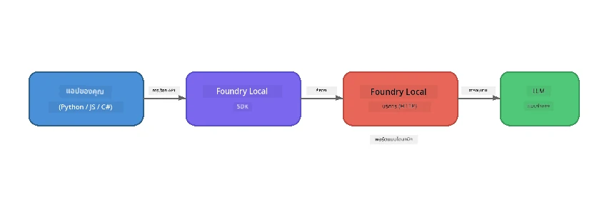

# Part 1: เริ่มต้นใช้งาน Foundry Local


## Foundry Local คืออะไร?

[Foundry Local](https://foundrylocal.ai) ช่วยให้คุณสามารถรันโมเดลภาษาปัญญาประดิษฐ์แบบโอเพ่นซอร์ส **โดยตรงบนคอมพิวเตอร์ของคุณ** - ไม่ต้องใช้อินเทอร์เน็ต, ไม่มีค่าใช้จ่ายบนคลาวด์, และความเป็นส่วนตัวของข้อมูลสมบูรณ์แบบ มัน:

- **ดาวน์โหลดและรันโมเดลในเครื่อง** พร้อมการปรับแต่งฮาร์ดแวร์อัตโนมัติ (GPU, CPU, หรือ NPU)
- **ให้บริการ API ที่เข้ากันได้กับ OpenAI** เพื่อให้คุณใช้ SDK และเครื่องมือที่คุ้นเคยได้
- **ไม่ต้องใช้การสมัครสมาชิก Azure** หรือการลงทะเบียน - เพียงติดตั้งและเริ่มสร้างได้เลย

คิดว่ามันเหมือนกับการมี AI ส่วนตัวที่รันทั้งหมดบนเครื่องของคุณเอง

## วัตถุประสงค์การเรียนรู้

เมื่อคุณทำแลบนี้เสร็จแล้ว คุณจะสามารถ:

- ติดตั้ง Foundry Local CLI บนระบบปฏิบัติการของคุณ
- เข้าใจว่า model aliases คืออะไรและทำงานอย่างไร
- ดาวน์โหลดและรันโมเดล AI ในเครื่องตัวแรกของคุณ
- ส่งข้อความแชทไปยังโมเดลในเครื่องผ่านบรรทัดคำสั่ง
- เข้าใจความแตกต่างระหว่างโมเดล AI ในเครื่องกับที่โฮสต์บนคลาวด์

---

## สิ่งที่ต้องเตรียม

### ข้อกำหนดของระบบ

| ข้อกำหนด | ขั้นต่ำ | แนะนำ |
|-------------|---------|-------------|
| **RAM** | 8 GB | 16 GB |
| **พื้นที่ดิสก์** | 5 GB (สำหรับโมเดล) | 10 GB |
| **CPU** | 4 คอร์ | 8+ คอร์ |
| **GPU** | ทางเลือก | NVIDIA พร้อม CUDA 11.8+ |
| **ระบบปฏิบัติการ** | Windows 10/11 (x64/ARM), Windows Server 2025, macOS 13+ | - |

> **หมายเหตุ:** Foundry Local จะเลือกโมเดลเวอร์ชันที่เหมาะสมที่สุดกับฮาร์ดแวร์ของคุณโดยอัตโนมัติ หากคุณมี NVIDIA GPU จะใช้ CUDA acceleration หากมี Qualcomm NPU ก็จะใช้ตัวนั้น มิฉะนั้นจะเลือกใช้เวอร์ชันที่เหมาะกับ CPU

### ติดตั้ง Foundry Local CLI

**Windows** (PowerShell):  
```powershell
winget install Microsoft.FoundryLocal
```
  
**macOS** (Homebrew):  
```bash
brew tap microsoft/foundrylocal
brew install foundrylocal
```
  
> **หมายเหตุ:** Foundry Local รองรับเฉพาะ Windows และ macOS เท่านั้นในขณะนี้ Linux ยังไม่รองรับ

ตรวจสอบการติดตั้ง:  
```bash
foundry --version
```
  
---

## แบบฝึกหัดแลบ

### แบบฝึกหัด 1: สำรวจโมเดลที่มีอยู่

Foundry Local มีแคตาล็อกของโมเดลโอเพ่นซอร์สที่ปรับแต่งมาแล้ว ค้นหารายการโมเดล:

```bash
foundry model list
```
  
คุณจะเห็นโมเดลเช่น:  
- `phi-3.5-mini` - โมเดล 3.8B พารามิเตอร์ของ Microsoft (รวดเร็ว คุณภาพดี)  
- `phi-4-mini` - โมเดล Phi รุ่นใหม่และมีประสิทธิภาพมากขึ้น  
- `phi-4-mini-reasoning` - โมเดล Phi ที่มี reasoning แบบ chain-of-thought (`<think>` แท็ก)  
- `phi-4` - โมเดล Phi ขนาดใหญ่ที่สุดของ Microsoft (10.4 GB)  
- `qwen2.5-0.5b` - ขนาดเล็กและรวดเร็ว (เหมาะสำหรับอุปกรณ์ที่มีทรัพยากรต่ำ)  
- `qwen2.5-7b` - โมเดลทั่วไปที่มีความสามารถสูงพร้อมรองรับการเรียกใช้งานเครื่องมือ  
- `qwen2.5-coder-7b` - ปรับแต่งสำหรับการสร้างโค้ด  
- `deepseek-r1-7b` - โมเดล reasoning ที่แข็งแกร่ง  
- `gpt-oss-20b` - โมเดลโอเพ่นซอร์สขนาดใหญ่ (ลิขสิทธิ์ MIT, 12.5 GB)  
- `whisper-base` - การถอดเสียงพูดเป็นข้อความ (383 MB)  
- `whisper-large-v3-turbo` - การถอดเสียงที่มีความแม่นยำสูง (9 GB)  

> **alias โมเดลคืออะไร?** alias เช่น `phi-3.5-mini` เป็นทางลัด เมื่อคุณใช้ alias Foundry Local จะดาวน์โหลดเวอร์ชันที่ดีที่สุดสำหรับฮาร์ดแวร์ของคุณโดยอัตโนมัติ (CUDA สำหรับ NVIDIA GPU, หรือเวอร์ชันที่เหมาะกับ CPU) คุณไม่ต้องกังวลเกี่ยวกับการเลือกเวอร์ชันเอง

### แบบฝึกหัด 2: รันโมเดลตัวแรกของคุณ

ดาวน์โหลดและเริ่มพูดคุยกับโมเดลแบบ interactive:

```bash
foundry model run phi-3.5-mini
```
  
ครั้งแรกที่คุณรัน Foundry Local จะ:  
1. ตรวจจับฮาร์ดแวร์ของคุณ  
2. ดาวน์โหลดเวอร์ชันโมเดลที่เหมาะสม (อาจใช้เวลาสักครู่)  
3. โหลดโมเดลเข้าสู่หน่วยความจำ  
4. เริ่มเซสชันแชทแบบโต้ตอบ  

ลองถามคำถามดู:  
```
You: What is the golden ratio?
You: Can you explain it as if I were 10 years old?
You: Write a haiku about mathematics
```
  
พิมพ์ `exit` หรือกด `Ctrl+C` เพื่อออก

### แบบฝึกหัด 3: ดาวน์โหลดโมเดลล่วงหน้า

ถ้าคุณต้องการดาวน์โหลดโมเดลโดยไม่ต้องเริ่มแชท:

```bash
foundry model download phi-3.5-mini
```
  
ตรวจสอบว่าโมเดลใดถูกดาวน์โหลดไว้แล้วบนเครื่องของคุณ:

```bash
foundry cache list
```
  
### แบบฝึกหัด 4: ทำความเข้าใจกับสถาปัตยกรรม

Foundry Local ทำงานเป็น **บริการ HTTP ในเครื่อง** ที่เปิด API แบบ REST ซึ่งเข้ากันได้กับ OpenAI ซึ่งหมายความว่า:

1. บริการเริ่มต้นบน **พอร์ตแบบไดนามิก** (พอร์ตแตกต่างกันทุกครั้งที่เริ่ม)  
2. คุณใช้ SDK เพื่อค้นหาที่อยู่ URL ปลายทางจริง  
3. คุณสามารถใช้ไลบรารีไคลเอนต์ที่เข้ากันได้กับ OpenAI ใดก็ได้ในการสื่อสารกับมัน  



> **สำคัญ:** Foundry Local กำหนด **พอร์ตแบบไดนามิก** ทุกครั้งที่เริ่ม ห้ามใช้พอร์ตคงที่เช่น `localhost:5272` ให้ใช้ SDK เพื่อค้นหา URL ปัจจุบันเสมอ (เช่น `manager.endpoint` ใน Python หรือ `manager.urls[0]` ใน JavaScript)

---

## ประเด็นสำคัญ

| แนวคิด | สิ่งที่คุณได้เรียนรู้ |
|---------|------------------|
| AI บนเครื่อง | Foundry Local รันโมเดลทั้งหมดบนอุปกรณ์ของคุณโดยไม่มีคลาวด์ ไม่มีคีย์ API และไม่มีค่าใช้จ่าย |
| alias โมเดล | alias อย่าง `phi-3.5-mini` จะเลือกเวอร์ชันที่เหมาะสมที่สุดกับฮาร์ดแวร์ของคุณโดยอัตโนมัติ |
| พอร์ตแบบไดนามิก | บริการรันบนพอร์ตแบบไดนามิก ให้ใช้ SDK ในการค้นหา endpoint เสมอ |
| CLI และ SDK | คุณสามารถโต้ตอบกับโมเดลผ่าน CLI (`foundry model run`) หรือผ่าน SDK ด้วยโปรแกรม |

---

## ขั้นตอนถัดไป

ดำเนินการต่อที่ [Part 2: Foundry Local SDK Deep Dive](part2-foundry-local-sdk.md) เพื่อเรียนรู้การใช้งาน API ของ SDK ในการจัดการโมเดล บริการ และการแคชด้วยโปรแกรม

---

<!-- CO-OP TRANSLATOR DISCLAIMER START -->
**ข้อจำกัดความรับผิดชอบ**:
เอกสารนี้ได้รับการแปลโดยใช้บริการแปลภาษาอัตโนมัติ [Co-op Translator](https://github.com/Azure/co-op-translator) แม้ว่าเราจะพยายามให้มีความถูกต้อง โปรดทราบว่าการแปลโดยอัตโนมัติอาจมีข้อผิดพลาดหรือความไม่ถูกต้อง เอกสารต้นฉบับในภาษาดั้งเดิมถือเป็นแหล่งข้อมูลที่เชื่อถือได้ สำหรับข้อมูลที่สำคัญควรใช้บริการแปลโดยมนุษย์มืออาชีพ เราไม่รับผิดชอบต่อความเข้าใจผิดหรือการตีความผิดที่เกิดจากการใช้การแปลนี้
<!-- CO-OP TRANSLATOR DISCLAIMER END -->