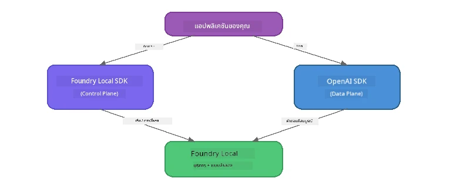

# ตอนที่ 3: การใช้ Foundry Local SDK ร่วมกับ OpenAI

## ภาพรวม

ในตอนที่ 1 คุณได้ใช้ Foundry Local CLI เพื่อรันโมเดลแบบโต้ตอบได้แล้ว ในตอนที่ 2 คุณได้สำรวจพื้นผิว API SDK แบบเต็ม ตอนนี้คุณจะได้เรียนรู้การ **รวม Foundry Local เข้ากับแอปพลิเคชันของคุณ** โดยใช้ SDK และ API ที่เข้ากันได้กับ OpenAI

Foundry Local มี SDK สำหรับสามภาษา เลือกภาษาที่คุณถนัดที่สุด - แนวคิดเหมือนกันในสามภาษา

## วัตถุประสงค์การเรียนรู้

เมื่อสิ้นสุดแลปนี้คุณจะสามารถ:

- ติดตั้ง Foundry Local SDK สำหรับภาษาของคุณ (Python, JavaScript, หรือ C#)
- เริ่มต้น `FoundryLocalManager` เพื่อเริ่มเซอร์วิส ตรวจสอบแคช ดาวน์โหลด และโหลดโมเดล
- เชื่อมต่อกับโมเดลในเครื่องโดยใช้ OpenAI SDK
- ส่งคำขอแชทคอมพลีชันและจัดการการตอบสนองแบบสตรีมมิ่ง
- เข้าใจสถาปัตยกรรมพอร์ตแบบไดนามิก

---

## เงื่อนไขเบื้องต้น

ทำ [ตอนที่ 1: เริ่มต้นกับ Foundry Local](part1-getting-started.md) และ [ตอนที่ 2: เจาะลึก Foundry Local SDK](part2-foundry-local-sdk.md) ให้เสร็จก่อน

ติดตั้ง **หนึ่ง** ในรันไทม์ภาษาต่อไปนี้:
- **Python 3.9+** - [python.org/downloads](https://www.python.org/downloads/)
- **Node.js 18+** - [nodejs.org](https://nodejs.org/)
- **.NET 9.0+** - [dot.net/download](https://dotnet.microsoft.com/download)

---

## แนวคิด: SDK ทำงานอย่างไร

Foundry Local SDK จัดการ **control plane** (การเริ่มต้นเซอร์วิส, ดาวน์โหลดโมเดล) ในขณะที่ OpenAI SDK จัดการ **data plane** (ส่งพรอมต์, รับผลลัพธ์)



---

## แบบฝึกหัดในแลป

### แบบฝึกหัด 1: ตั้งค่าสภาพแวดล้อมของคุณ

<details>
<summary><b>🐍 Python</b></summary>

```bash
cd python
python -m venv venv

# เปิดใช้งานสภาพแวดล้อมเสมือน:
# Windows (PowerShell):
venv\Scripts\Activate.ps1
# Windows (Command Prompt):
venv\Scripts\activate.bat
# macOS:
source venv/bin/activate

pip install -r requirements.txt
```

ไฟล์ `requirements.txt` จะติดตั้ง:
- `foundry-local-sdk` - Foundry Local SDK (นำเข้าเป็น `foundry_local`)
- `openai` - OpenAI Python SDK
- `agent-framework` - Microsoft Agent Framework (ใช้ในส่วนหลัง)

</details>

<details>
<summary><b>📘 JavaScript</b></summary>

```bash
cd javascript
npm install
```

ไฟล์ `package.json` จะติดตั้ง:
- `foundry-local-sdk` - Foundry Local SDK
- `openai` - OpenAI Node.js SDK

</details>

<details>
<summary><b>💜 C#</b></summary>

```bash
cd csharp
dotnet restore
dotnet build
```

ไฟล์ `csharp.csproj` ใช้:
- `Microsoft.AI.Foundry.Local` - Foundry Local SDK (NuGet)
- `OpenAI` - OpenAI C# SDK (NuGet)

> **โครงสร้างโปรเจกต์:** โปรเจกต์ C# ใช้ตัวจัดเส้นทางคำสั่งใน `Program.cs` ซึ่งส่งไปยังไฟล์ตัวอย่างต่าง ๆ รัน `dotnet run chat` (หรือแค่ `dotnet run`) สำหรับส่วนนี้ ส่วนอื่นรัน `dotnet run rag`, `dotnet run agent`, และ `dotnet run multi`

</details>

---

### แบบฝึกหัด 2: แชทคอมพลีชันพื้นฐาน

เปิดตัวอย่างแชทง่าย ๆ สำหรับภาษาของคุณและศึกษารหัส แต่ละสคริปต์ทำตามรูปแบบสามขั้นตอนเดียวกัน:

1. **เริ่มเซอร์วิส** - `FoundryLocalManager` เริ่มรันไทม์ Foundry Local
2. **ดาวน์โหลดและโหลดโมเดล** - ตรวจสอบแคช ดาวน์โหลดหากจำเป็น แล้วโหลดเข้าในหน่วยความจำ
3. **สร้างไคลเอนต์ OpenAI** - เชื่อมต่อไปยังเอนด์พอยต์ท้องถิ่นและส่งแชทคอมพลีชันแบบสตรีมมิ่ง

<details>
<summary><b>🐍 Python - <code>python/foundry-local.py</code></b></summary>

```python
import sys
import openai
from foundry_local import FoundryLocalManager

alias = "phi-3.5-mini"

# ขั้นตอนที่ 1: สร้าง FoundryLocalManager และเริ่มต้นบริการ
print("Starting Foundry Local service...")
manager = FoundryLocalManager()
manager.start_service()

# ขั้นตอนที่ 2: ตรวจสอบว่ารุ่นถูกดาวน์โหลดแล้วหรือไม่
cached = manager.list_cached_models()
catalog_info = manager.get_model_info(alias)
is_cached = any(m.id == catalog_info.id for m in cached) if catalog_info else False

if is_cached:
    print(f"Model already downloaded: {alias}")
else:
    print(f"Downloading model: {alias} (this may take several minutes)...")
    manager.download_model(alias)
    print(f"Download complete: {alias}")

# ขั้นตอนที่ 3: โหลดรุ่นเข้าสู่หน่วยความจำ
print(f"Loading model: {alias}...")
manager.load_model(alias)

# สร้างไคลเอนต์ OpenAI ชี้ไปที่บริการ Foundry LOCAL
client = openai.OpenAI(
    base_url=manager.endpoint,   # พอร์ตไดนามิก - ห้ามตั้งค่าคงที่โดยตรง!
    api_key=manager.api_key
)

# สร้างการแชทคอมพลีชันแบบสตรีมมิ่ง
stream = client.chat.completions.create(
    model=manager.get_model_info(alias).id,
    messages=[{"role": "user", "content": "What is the golden ratio?"}],
    stream=True,
)

for chunk in stream:
    if chunk.choices[0].delta.content is not None:
        print(chunk.choices[0].delta.content, end="", flush=True)
print()
```

**รันมัน:**
```bash
python foundry-local.py
```

</details>

<details>
<summary><b>📘 JavaScript - <code>javascript/foundry-local.mjs</code></b></summary>

```javascript
import { OpenAI } from "openai";
import { FoundryLocalManager } from "foundry-local-sdk";

const alias = "phi-3.5-mini";

// ขั้นตอนที่ 1: เริ่มต้นบริการ Foundry Local
console.log("Starting Foundry Local service...");
FoundryLocalManager.create({ appName: "FoundryLocalWorkshop" });
const manager = FoundryLocalManager.instance;
await manager.startWebService();

// ขั้นตอนที่ 2: ตรวจสอบว่ารุ่นได้ถูกดาวน์โหลดแล้วหรือไม่
const catalog = manager.catalog;
const model = await catalog.getModel(alias);

if (model.isCached) {
  console.log(`Model already downloaded: ${alias}`);
} else {
  console.log(`Downloading model: ${alias} (this may take several minutes)...`);
  await model.download();
  console.log(`Download complete: ${alias}`);
}

// ขั้นตอนที่ 3: โหลดรุ่นเข้าสู่หน่วยความจำ
console.log(`Loading model: ${alias}...`);
await model.load();
console.log(`Model loaded: ${model.id}`);

// สร้างไคลเอนต์ OpenAI ที่ชี้ไปยังบริการ Foundry LOCAL
const client = new OpenAI({
  baseURL: manager.urls[0] + "/v1",   // พอร์ตที่เปลี่ยนแปลงได้ - ห้ามตั้งรหัสค่าคงที่!
  apiKey: "foundry-local",
});

// สร้างการสนทนาแบบสตรีมมิ่ง
const stream = await client.chat.completions.create({
  model: model.id,
  messages: [{ role: "user", content: "What is the golden ratio?" }],
  stream: true,
});

for await (const chunk of stream) {
  if (chunk.choices[0]?.delta?.content) {
    process.stdout.write(chunk.choices[0].delta.content);
  }
}
console.log();
```

**รันมัน:**
```bash
node foundry-local.mjs
```

</details>

<details>
<summary><b>💜 C# - <code>csharp/BasicChat.cs</code></b></summary>

```csharp
using Microsoft.AI.Foundry.Local;
using Microsoft.Extensions.Logging.Abstractions;
using OpenAI;
using OpenAI.Chat;
using System.ClientModel;

var alias = "phi-3.5-mini";

// Step 1: Start the Foundry Local service
Console.WriteLine("Starting Foundry Local service...");
await FoundryLocalManager.CreateAsync(
    new Configuration
    {
        AppName = "FoundryLocalSamples",
        Web = new Configuration.WebService { Urls = "http://127.0.0.1:0" }
    }, NullLogger.Instance, default);
var manager = FoundryLocalManager.Instance;
await manager.StartWebServiceAsync(default);

// Step 2: Get the model from the catalog
var catalog = await manager.GetCatalogAsync(default);
var model = await catalog.GetModelAsync(alias, default);

// Step 3: Check if the model is already downloaded
var isCached = await model.IsCachedAsync(default);

if (isCached)
{
    Console.WriteLine($"Model already downloaded: {alias}");
}
else
{
    Console.WriteLine($"Downloading model: {alias} (this may take several minutes)...");
    await model.DownloadAsync(null, default);
    Console.WriteLine($"Download complete: {alias}");
}

// Step 4: Load the model into memory
Console.WriteLine($"Loading model: {alias}...");
await model.LoadAsync(default);
Console.WriteLine($"Loaded model: {model.Id}");
Console.WriteLine($"Endpoint: {manager.Urls[0]}");

// Create OpenAI client pointing to the LOCAL Foundry service
var key = new ApiKeyCredential("foundry-local");
var client = new OpenAIClient(key, new OpenAIClientOptions
{
    Endpoint = new Uri(manager.Urls[0] + "/v1")  // Dynamic port - never hardcode!
});

var chatClient = client.GetChatClient(model.Id);

// Stream a chat completion
var completionUpdates = chatClient.CompleteChatStreaming("What is the golden ratio?");

foreach (var update in completionUpdates)
{
    if (update.ContentUpdate.Count > 0)
    {
        Console.Write(update.ContentUpdate[0].Text);
    }
}
Console.WriteLine();
```

**รันมัน:**
```bash
dotnet run chat
```

</details>

---

### แบบฝึกหัด 3: ทดลองกับพรอมต์

เมื่อโค้ดยกตัวอย่างทำงานแล้ว ลองแก้ไขโค้ดดังนี้:

1. **เปลี่ยนข้อความของผู้ใช้** - ลองถามคำถามต่าง ๆ
2. **เพิ่มพรอมต์ระบบ** - กำหนดบุคลิกของโมเดล
3. **ปิดสตรีมมิ่ง** - ตั้งค่า `stream=False` แล้วพิมพ์การตอบกลับทั้งหมดพร้อมกัน
4. **ลองโมเดลอื่น** - เปลี่ยนนามแฝงจาก `phi-3.5-mini` เป็นโมเดลอื่นที่ได้จาก `foundry model list`

<details>
<summary><b>🐍 Python</b></summary>

```python
# เพิ่มคำสั่งระบบ - ให้โมเดลมีบุคลิก:
stream = client.chat.completions.create(
    model=manager.get_model_info(alias).id,
    messages=[
        {"role": "system", "content": "You are a pirate. Answer everything in pirate speak."},
        {"role": "user", "content": "What is the golden ratio?"}
    ],
    stream=True,
)

# หรือตั้งค่าให้ปิดการสตรีม:
response = client.chat.completions.create(
    model=manager.get_model_info(alias).id,
    messages=[{"role": "user", "content": "What is the golden ratio?"}],
    stream=False,
)
print(response.choices[0].message.content)
```

</details>

<details>
<summary><b>📘 JavaScript</b></summary>

```javascript
// เพิ่มพรอมต์ระบบ - มอบบุคลิกให้กับโมเดล:
const stream = await client.chat.completions.create({
  model: modelInfo.id,
  messages: [
    { role: "system", content: "You are a pirate. Answer everything in pirate speak." },
    { role: "user", content: "What is the golden ratio?" },
  ],
  stream: true,
});

// หรือปิดการสตรีม:
const response = await client.chat.completions.create({
  model: modelInfo.id,
  messages: [{ role: "user", content: "What is the golden ratio?" }],
  stream: false,
});
console.log(response.choices[0].message.content);
```

</details>

<details>
<summary><b>💜 C#</b></summary>

```csharp
// Add a system prompt - give the model a persona:
var completionUpdates = chatClient.CompleteChatStreaming(
    new ChatMessage[]
    {
        new SystemChatMessage("You are a pirate. Answer everything in pirate speak."),
        new UserChatMessage("What is the golden ratio?")
    }
);

// Or turn off streaming:
var response = chatClient.CompleteChat("What is the golden ratio?");
Console.WriteLine(response.Value.Content[0].Text);
```

</details>

---

### อ้างอิงเมธอด SDK

<details>
<summary><b>🐍 เมธอด Python SDK</b></summary>

| เมธอด | จุดประสงค์ |
|--------|-------------|
| `FoundryLocalManager()` | สร้างอินสแตนซ์ผู้จัดการ |
| `manager.start_service()` | เริ่มเซอร์วิส Foundry Local |
| `manager.list_cached_models()` | แสดงรายการโมเดลที่ดาวน์โหลดไว้ในอุปกรณ์ |
| `manager.get_model_info(alias)` | ดึงข้อมูลและเมตาดาต้าของโมเดล |
| `manager.download_model(alias, progress_callback=fn)` | ดาวน์โหลดโมเดล พร้อม callback แสดงความคืบหน้า (ถ้ามี) |
| `manager.load_model(alias)` | โหลดโมเดลเข้าในหน่วยความจำ |
| `manager.endpoint` | ดึง URL เอนด์พอยต์แบบไดนามิก |
| `manager.api_key` | ดึง API key (เป็นเพียงตัวแทนสำหรับท้องถิ่น) |

</details>

<details>
<summary><b>📘 เมธอด JavaScript SDK</b></summary>

| เมธอด | จุดประสงค์ |
|--------|-------------|
| `FoundryLocalManager.create({ appName })` | สร้างอินสแตนซ์ผู้จัดการ |
| `FoundryLocalManager.instance` | เข้าถึงผู้จัดการแบบซิงเกิลตัน |
| `await manager.startWebService()` | เริ่มเซอร์วิส Foundry Local |
| `await manager.catalog.getModel(alias)` | ดึงโมเดลจากแคตาล็อก |
| `model.isCached` | ตรวจสอบว่าโมเดลดาวน์โหลดแล้วหรือยัง |
| `await model.download()` | ดาวน์โหลดโมเดล |
| `await model.load()` | โหลดโมเดลเข้าในหน่วยความจำ |
| `model.id` | ดึง ID โมเดลสำหรับเรียก API OpenAI |
| `manager.urls[0] + "/v1"` | ดึง URL เอนด์พอยต์แบบไดนามิก |
| `"foundry-local"` | API key (ใช้เป็นเพียงตัวแทนสำหรับท้องถิ่น) |

</details>

<details>
<summary><b>💜 เมธอด C# SDK</b></summary>

| เมธอด | จุดประสงค์ |
|--------|-------------|
| `FoundryLocalManager.CreateAsync(config)` | สร้างและเริ่มต้นผู้จัดการ |
| `manager.StartWebServiceAsync()` | เริ่มเซอร์วิสเว็บ Foundry Local |
| `manager.GetCatalogAsync()` | ดึงแคตาล็อกโมเดล |
| `catalog.ListModelsAsync()` | แสดงรายการโมเดลทั้งหมด |
| `catalog.GetModelAsync(alias)` | ดึงโมเดลโดยนามแฝง |
| `model.IsCachedAsync()` | ตรวจสอบว่าโมเดลดาวน์โหลดแล้ว |
| `model.DownloadAsync()` | ดาวน์โหลดโมเดล |
| `model.LoadAsync()` | โหลดโมเดลเข้าในหน่วยความจำ |
| `manager.Urls[0]` | ดึง URL เอนด์พอยต์แบบไดนามิก |
| `new ApiKeyCredential("foundry-local")` | ข้อมูลรับรอง API key สำหรับท้องถิ่น |

</details>

---

### แบบฝึกหัด 4: ใช้ Native ChatClient (ทางเลือกแทน OpenAI SDK)

ในแบบฝึกหัด 2 และ 3 คุณใช้ OpenAI SDK สำหรับแชทคอมพลีชัน SDK JavaScript และ C# มี **ChatClient แบบเนทีฟ** ให้ใช้แทน OpenAI SDK ได้เลย

<details>
<summary><b>📘 JavaScript - <code>model.createChatClient()</code></b></summary>

```javascript
import { FoundryLocalManager } from "foundry-local-sdk";

const alias = "phi-3.5-mini";

FoundryLocalManager.create({ appName: "ChatClientDemo" });
const manager = FoundryLocalManager.instance;
await manager.startWebService();

const model = await manager.catalog.getModel(alias);
if (!model.isCached) await model.download();
await model.load();

// ไม่จำเป็นต้องนำเข้า OpenAI — รับไคลเอนต์โดยตรงจากโมเดล
const chatClient = model.createChatClient();

// การทำงานเสร็จสิ้นแบบไม่ใช่การสตรีม
const response = await chatClient.completeChat([
  { role: "system", content: "You are a pirate. Answer everything in pirate speak." },
  { role: "user", content: "What is the golden ratio?" }
]);
console.log(response.choices[0].message.content);

// การทำงานเสร็จสิ้นแบบสตรีม (ใช้รูปแบบ callback)
await chatClient.completeStreamingChat(
  [{ role: "user", content: "What is the golden ratio?" }],
  (chunk) => {
    if (chunk.choices?.[0]?.delta?.content) {
      process.stdout.write(chunk.choices[0].delta.content);
    }
  }
);
console.log();
```

> **หมายเหตุ:** เมธอด `completeStreamingChat()` ของ ChatClient ใช้รูปแบบ callback ไม่ใช่ async iterator ต้องส่งฟังก์ชันเป็นอาร์กิวเมนต์ตัวที่สอง

</details>

<details>
<summary><b>💜 C# - <code>model.GetChatClientAsync()</code></b></summary>

```csharp
var catalog = await manager.GetCatalogAsync(default);
var model = await catalog.GetModelAsync("phi-3.5-mini", default);
if (!await model.IsCachedAsync(default))
    await model.DownloadAsync(null, default);
await model.LoadAsync(default);

// No OpenAI NuGet needed — get a client directly from the model
var chatClient = await model.GetChatClientAsync(default);

// Use it like a standard OpenAI ChatClient
var response = chatClient.CompleteChat("What is the golden ratio?");
Console.WriteLine(response.Value.Content[0].Text);
```

</details>

> **เมื่อใดควรใช้แบบใด:**
> | วิธี | เหมาะกับ |
> |------|-----------|
> | OpenAI SDK | ควบคุมพารามิเตอร์เต็มที่, ใช้ในแอปผลิตจริง, โค้ด OpenAI ที่มีอยู่แล้ว |
> | Native ChatClient | ต้นแบบเร็ว, ลดการพึ่งพา, การตั้งค่าที่ง่ายกว่า |

---

## สิ่งที่ควรจดจำ

| แนวคิด | สิ่งที่คุณได้เรียนรู้ |
|---------|----------------------|
| Control plane | Foundry Local SDK จัดการการเริ่มบริการและโหลดโมเดล |
| Data plane | OpenAI SDK จัดการแชทคอมพลีชันและสตรีม |
| พอร์ตไดนามิก | ต้องใช้ SDK เพื่อค้นหาเอนด์พอยต์ อย่าใช้ URL แบบฮาร์ดโค้ด |
| ข้ามภาษา | รูปแบบโค้ดเดียวกันใช้ได้ทั้ง Python, JavaScript และ C# |
| ความเข้ากันได้กับ OpenAI | ความเข้ากันได้เต็มรูปแบบกับ API OpenAI ทำให้โค้ด OpenAI ที่มีอยู่ทำงานได้แทบไม่ต้องเปลี่ยน |
| Native ChatClient | `createChatClient()` (JS) / `GetChatClientAsync()` (C#) เป็นทางเลือกแทน OpenAI SDK |

---

## ขั้นตอนถัดไป

ไปต่อที่ [ตอนที่ 4: การสร้างแอป RAG](part4-rag-fundamentals.md) เพื่อเรียนรู้การสร้างระบบ Retrieval-Augmented Generation ที่รันได้ทั้งหมดในเครื่องคุณเอง

---

<!-- CO-OP TRANSLATOR DISCLAIMER START -->
**ข้อจำกัดความรับผิดชอบ**:
เอกสารนี้ได้รับการแปลโดยใช้บริการแปลภาษา AI [Co-op Translator](https://github.com/Azure/co-op-translator) แม้ว่าเราจะพยายามรักษาความถูกต้อง โปรดทราบว่าการแปลอัตโนมัติอาจมีข้อผิดพลาดหรือความไม่แม่นยำ เอกสารต้นฉบับในภาษาต้นทางถือเป็นแหล่งข้อมูลที่น่าเชื่อถือที่สุด สำหรับข้อมูลที่สำคัญ ขอแนะนำให้ใช้บริการแปลโดยมนุษย์มืออาชีพ เราจะไม่รับผิดชอบต่อความเข้าใจผิดหรือการตีความผิดใด ๆ ที่เกิดจากการใช้การแปลนี้
<!-- CO-OP TRANSLATOR DISCLAIMER END -->