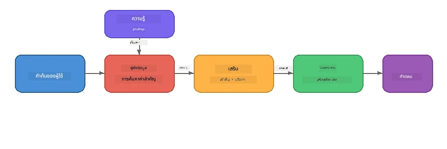

# ส่วนที่ 4: การสร้างแอปพลิเคชัน RAG ด้วย Foundry Local

## ภาพรวม

โมเดลภาษาขนาดใหญ่ (Large Language Models) นั้นทรงพลัง แต่พวกมันรู้แค่ในข้อมูลการฝึกฝนเท่านั้น **Retrieval-Augmented Generation (RAG)** แก้ปัญหานี้โดยการให้บริบทที่เกี่ยวข้องกับโมเดลในขณะสอบถาม – ดึงจากเอกสาร ฐานข้อมูล หรือฐานความรู้ของคุณเอง

ในห้องปฏิบัติการนี้คุณจะสร้างท่อข้อมูล RAG เต็มรูปแบบที่รัน **ทั้งหมดบนอุปกรณ์ของคุณ** โดยใช้ Foundry Local ไม่มีบริการคลาวด์ ไม่มีฐานข้อมูลเวกเตอร์ ไม่มี API สำหรับการฝังตัว – มีแค่การค้นหาแบบในเครื่องและโมเดลในเครื่อง

## วัตถุประสงค์การเรียนรู้

เมื่อจบห้องปฏิบัติการนี้ คุณจะสามารถ:

- อธิบายว่า RAG คืออะไรและทำไมจึงสำคัญสำหรับแอปพลิเคชัน AI
- สร้างฐานความรู้ในเครื่องจากเอกสารข้อความ
- ใช้งานฟังก์ชันการค้นหาอย่างง่ายเพื่อค้นหาบริบทที่เกี่ยวข้อง
- เขียนคำสั่งระบบที่ยึดโมเดลบนข้อเท็จจริงที่ดึงมาได้
- รันท่อข้อมูล Retrieve → Augment → Generate แบบเต็มรูปแบบบนอุปกรณ์
- เข้าใจข้อแลกเปลี่ยนระหว่างการค้นหาคำสำคัญแบบง่ายและการค้นหาแบบเวกเตอร์

---

## ความรู้พื้นฐานที่ต้องมี

- ทำ [ส่วนที่ 3: การใช้ Foundry Local SDK กับ OpenAI](part3-sdk-and-apis.md) เสร็จแล้ว
- ติดตั้ง Foundry Local CLI และดาวน์โหลดโมเดล `phi-3.5-mini`

---

## แนวคิด: RAG คืออะไร?

ถ้าไม่มี RAG, LLM สามารถตอบคำถามได้แค่จากข้อมูลการฝึกฝน – ซึ่งอาจล้าสมัย ไม่ครบถ้วน หรือขาดข้อมูลส่วนตัวของคุณ:

```
User: "What is Zava's return policy?"
LLM:  "I do not have information about Zava's return policy."  ← No context!
```

ด้วย RAG, คุณจะ **ค้นหา** เอกสารที่เกี่ยวข้องก่อน จากนั้น **เพิ่ม** บริบทลงในคำสั่งก่อนที่จะ **สร้าง** คำตอบ:



ความเข้าใจสำคัญ: **โมเดลไม่จำเป็นต้อง "รู้" คำตอบ; มันแค่ต้องอ่านเอกสารที่ถูกต้อง**

---

## แบบฝึกหัดห้องปฏิบัติการ

### แบบฝึกหัด 1: ทำความเข้าใจฐานความรู้

เปิดตัวอย่าง RAG สำหรับภาษาของคุณและตรวจสอบฐานความรู้:

<details>
<summary><b>🐍 Python: <code>python/foundry-local-rag.py</code></b></summary>

ฐานความรู้เป็นแค่รายการของพจนานุกรมที่มีฟิลด์ `title` และ `content`:

```python
KNOWLEDGE_BASE = [
    {
        "title": "Foundry Local Overview",
        "content": (
            "Foundry Local brings the power of Azure AI Foundry to your local "
            "device without requiring an Azure subscription..."
        ),
    },
    {
        "title": "Supported Hardware",
        "content": (
            "Foundry Local automatically selects the best model variant for "
            "your hardware. If you have an Nvidia CUDA GPU it downloads the "
            "CUDA-optimized model..."
        ),
    },
    # ... รายการเพิ่มเติม
]
```

แต่ละรายการแทน "ชิ้น" ของความรู้ – ข้อมูลเฉพาะเจาะจงในหัวข้อใดหัวข้อหนึ่ง

</details>

<details>
<summary><b>📘 JavaScript: <code>javascript/foundry-local-rag.mjs</code></b></summary>

ฐานความรู้ใช้โครงสร้างเดียวกันในรูปแบบอาร์เรย์ของอ็อบเจกต์:

```javascript
const KNOWLEDGE_BASE = [
  {
    title: "Foundry Local Overview",
    content:
      "Foundry Local brings the power of Azure AI Foundry to your local " +
      "device without requiring an Azure subscription...",
  },
  {
    title: "Supported Hardware",
    content:
      "Foundry Local automatically selects the best model variant for " +
      "your hardware...",
  },
  // ... รายการเพิ่มเติม
];
```

</details>

<details>
<summary><b>💜 C#: <code>csharp/RagPipeline.cs</code></b></summary>

ฐานความรู้ใช้รายการทูเพิลที่ตั้งชื่อ:

```csharp
private static readonly List<(string Title, string Content)> KnowledgeBase =
[
    ("Foundry Local Overview",
     "Foundry Local brings the power of Azure AI Foundry to your local " +
     "device without requiring an Azure subscription..."),

    ("Supported Hardware",
     "Foundry Local automatically selects the best model variant for " +
     "your hardware..."),

    // ... more entries
];
```

</details>

> **ในแอปพลิเคชันจริง**, ฐานความรู้จะมาจากไฟล์บนดิสก์, ฐานข้อมูล, ดัชนีการค้นหา หรือ API สำหรับห้องปฏิบัติการนี้ เราใช้รายการในหน่วยความจำเพื่อให้ง่ายขึ้น

---

### แบบฝึกหัด 2: ทำความเข้าใจฟังก์ชันการค้นหา

ขั้นตอนการค้นหาหาชิ้นส่วนที่เกี่ยวข้องที่สุดกับคำถามของผู้ใช้ ตัวอย่างนี้ใช้ **การซ้อนทับคำสำคัญ** – นับจำนวนคำในคำถามที่ปรากฏในแต่ละชิ้นความรู้:

<details>
<summary><b>🐍 Python</b></summary>

```python
def retrieve(query: str, top_k: int = 2) -> list[dict]:
    """Return the top-k knowledge chunks most relevant to the query."""
    query_words = set(query.lower().split())
    scored = []
    for chunk in KNOWLEDGE_BASE:
        chunk_words = set(chunk["content"].lower().split())
        overlap = len(query_words & chunk_words)
        scored.append((overlap, chunk))
    scored.sort(key=lambda x: x[0], reverse=True)
    return [item[1] for item in scored[:top_k]]
```

</details>

<details>
<summary><b>📘 JavaScript</b></summary>

```javascript
function retrieve(query, topK = 2) {
  const queryWords = new Set(query.toLowerCase().split(/\s+/));
  const scored = KNOWLEDGE_BASE.map((chunk) => {
    const chunkWords = new Set(chunk.content.toLowerCase().split(/\s+/));
    let overlap = 0;
    for (const w of queryWords) {
      if (chunkWords.has(w)) overlap++;
    }
    return { overlap, chunk };
  });
  scored.sort((a, b) => b.overlap - a.overlap);
  return scored.slice(0, topK).map((s) => s.chunk);
}
```

</details>

<details>
<summary><b>💜 C#</b></summary>

```csharp
private static List<(string Title, string Content)> Retrieve(string query, int topK = 2)
{
    var queryWords = new HashSet<string>(
        query.ToLowerInvariant().Split(' ', StringSplitOptions.RemoveEmptyEntries));

    return KnowledgeBase
        .Select(chunk =>
        {
            var chunkWords = new HashSet<string>(
                chunk.Content.ToLowerInvariant().Split(' ', StringSplitOptions.RemoveEmptyEntries));
            var overlap = queryWords.Intersect(chunkWords).Count();
            return (Overlap: overlap, Chunk: chunk);
        })
        .OrderByDescending(x => x.Overlap)
        .Take(topK)
        .Select(x => x.Chunk)
        .ToList();
}
```

</details>

**วิธีการทำงาน:**
1. แบ่งคำถามออกเป็นคำแต่ละคำ
2. สำหรับแต่ละชิ้นความรู้ นับจำนวนคำที่ปรากฏในชิ้นนั้น
3. เรียงลำดับตามคะแนนการซ้อนทับ (มากที่สุดก่อน)
4. คืนค่าชิ้นความรู้จำนวน top-k ที่เกี่ยวข้องที่สุด

> **ข้อแลกเปลี่ยน:** การซ้อนทับคำสำคัญง่ายแต่จำกัด มันไม่เข้าใจคำเหมือนหรืความหมาย ระบบ RAG ในการผลิตส่วนใหญ่มักใช้ **เวกเตอร์ฝังตัว** และ **ฐานข้อมูลเวกเตอร์** สำหรับการค้นหาเชิงความหมาย อย่างไรก็ตาม การซ้อนทับคำสำคัญเป็นจุดเริ่มต้นที่ดีและไม่ต้องพึ่งพาอะไรเพิ่ม

---

### แบบฝึกหัด 3: ทำความเข้าใจคำสั่งที่เพิ่มบริบท

บริบทที่ดึงมาได้จะถูกแทรกใน **คำสั่งระบบ** ก่อนส่งให้โมเดล:

```python
system_prompt = (
    "You are a helpful assistant. Answer the user's question using ONLY "
    "the information provided in the context below. If the context does "
    "not contain enough information, say so.\n\n"
    f"Context:\n{context_text}"
)
```

การตัดสินใจออกแบบที่สำคัญ:
- **"เฉพาะข้อมูลที่ให้มาเท่านั้น"** – ป้องกันโมเดลจากการสร้างความจริงที่ไม่มีอยู่ในบริบท
- **"ถ้าบริบทไม่มีข้อมูลเพียงพอ ให้บอกว่าไม่ทราบ"** – ส่งเสริมคำตอบที่จริงใจอย่าง "ฉันไม่ทราบ"
- บริบทถูกวางไว้ในข้อความระบบเพื่อให้ไปกำหนดรูปแบบการตอบทั้งหมด

---

### แบบฝึกหัด 4: รันท่อข้อมูล RAG

รันตัวอย่างเต็ม:

**Python:**
```bash
cd python
python foundry-local-rag.py
```

**JavaScript:**
```bash
cd javascript
node foundry-local-rag.mjs
```

**C#:**
```bash
cd csharp
dotnet run rag
```

คุณจะเห็นสามอย่างพิมพ์ออกมา:
1. **คำถาม** ที่ถูกถาม
2. **บริบทที่ดึงมาได้** – ชิ้นส่วนที่เลือกจากฐานความรู้
3. **คำตอบ** – สร้างโดยโมเดลโดยใช้แค่บริบทนั้น

ผลลัพธ์ตัวอย่าง:
```
Question: How do I install Foundry Local and what hardware does it support?

--- Retrieved Context ---
### Installation
On Windows install Foundry Local with: winget install Microsoft.FoundryLocal...

### Supported Hardware
Foundry Local automatically selects the best model variant for your hardware...
-------------------------

Answer: To install Foundry Local, you can use the following methods depending
on your operating system: On Windows, run `winget install Microsoft.FoundryLocal`.
On macOS, use `brew install microsoft/foundrylocal/foundrylocal`...
```

สังเกตว่าคำตอบของโมเดล **ยึดโยง** กับบริบทที่ดึงมา – มันกล่าวถึงข้อเท็จจริงในเอกสารฐานความรู้เท่านั้น

---

### แบบฝึกหัด 5: ทดลองและขยายเพิ่มเติม

ลองปรับเปลี่ยนเหล่านี้เพื่อเพิ่มความเข้าใจของคุณ:

1. **เปลี่ยนคำถาม** – ถามเรื่องที่อยู่ในฐานความรู้ หรือเรื่องที่ไม่อยู่:
   ```python
   question = "What programming languages does Foundry Local support?"  # ← ในบริบท
   question = "How much does Foundry Local cost?"                       # ← ไม่อยู่ในบริบท
   ```
   โมเดลบอกว่า "ฉันไม่ทราบ" อย่างถูกต้องหรือไม่เมื่อคำตอบไม่อยู่ในบริบท?

2. **เพิ่มชิ้นความรู้ใหม่** – เพิ่มรายการใหม่ใน `KNOWLEDGE_BASE`:
   ```python
   {
       "title": "Pricing",
       "content": "Foundry Local is completely free and open source under the MIT license.",
   }
   ```
   แล้วถามเรื่องราคาอีกครั้ง

3. **เปลี่ยนค่า `top_k`** – ดึงชิ้นความรู้มากขึ้นหรือน้อยลง:
   ```python
   context_chunks = retrieve(question, top_k=3)  # บริบทเพิ่มเติม
   context_chunks = retrieve(question, top_k=1)  # บริบทน้อยลง
   ```
   ปริมาณบริบทมีผลต่อคุณภาพคำตอบอย่างไร?

4. **ลบคำสั่งบังคับ** – เปลี่ยนคำสั่งระบบเป็นแค่ "คุณคือผู้ช่วยที่เป็นประโยชน์" และดูว่าโมเดลเริ่มสร้างข้อเท็จจริงที่ไม่จริงหรือไม่

---

## การเจาะลึก: การปรับแต่ง RAG สำหรับประสิทธิภาพบนอุปกรณ์

การรัน RAG บนอุปกรณ์มีข้อจำกัดที่ต่างจากคลาวด์: RAM จำกัด, ไม่มี GPU เฉพาะ (รันบน CPU/NPU), และหน้าต่างบริบทของโมเดลขนาดเล็ก การตัดสินใจออกแบบที่ระบุด้านล่างตอบโจทย์ข้อจำกัดเหล่านี้โดยตรงและอ้างอิงจากรูปแบบของแอป RAG ที่ใช้ Foundry Local

### กลยุทธ์แบ่งชิ้น: หน้าต่างเลื่อนขนาดคงที่

การแบ่งชิ้น – วิธีการแบ่งเอกสารเป็นชิ้น ๆ – เป็นหนึ่งในการตัดสินใจที่มีผลมากที่สุดในระบบ RAG ในนิยามอุปกรณ์ขนาดเล็ก วิธีที่แนะนำคือ **หน้าต่างเลื่อนขนาดคงที่พร้อมการซ้อนทับ**:

| พารามิเตอร์ | ค่าที่แนะนำ | เหตุผล |
|-------------|--------------|---------|
| **ขนาดชิ้น** | ~200 โทเคน | ทำให้บริบทที่ดึงมาเล็กและกระชับ เหลือที่ในหน้าต่างบริบท Phi-3.5 Mini สำหรับคำสั่งระบบ, ประวัติการสนทนา, และผลลัพธ์ที่สร้างขึ้น |
| **การซ้อนทับ** | ~25 โทเคน (12.5%) | ป้องกันการสูญเสียข้อมูลที่ขอบของชิ้นงาน สำคัญสำหรับขั้นตอนหรือคำแนะนำทีละขั้น |
| **การตัดคำเป็นโทเคน** | แบ่งด้วยช่องว่าง | ไม่มีการพึ่งพาไลบรารี tokenizer งบประมาณคำนวณทั้งหมดอยู่กับ LLM |

การซ้อนทับทำเหมือนหน้าต่างเลื่อน: ชิ้นใหม่เริ่มต้นที่ 25 โทเคนก่อนสิ้นสุดชิ้นก่อนหน้า ดังนั้นประโยคที่ขยายข้ามขอบชิ้นจะปรากฏในสองชิ้น

> **ทำไมไม่ใช้วิธีอื่น?**
> - **การแบ่งตามประโยค** ทำให้ขนาดชิ้นไม่แน่นอน; ขั้นตอนความปลอดภัยบางอย่างเป็นประโยคยาวที่แบ่งไม่ดี
> - **การแบ่งตามหัวข้อ (##)** ทำให้ขนาดชิ้นแตกต่างกันมาก บางชิ้นเล็กเกินไป บางชิ้นใหญ่เกินกว่าหน้าต่างบริบทโมเดล
> - **การแบ่ง sematic (ใช้ embedding ตรวจจับหัวข้อ)** ให้คุณภาพการค้นหาที่ดีที่สุด แต่ต้องใช้โมเดลที่สองในหน่วยความจำพร้อม Phi-3.5 Mini – เสี่ยงในฮาร์ดแวร์ที่มี RAM 8-16 GB

### การยกระดับการค้นหา: เวกเตอร์ TF-IDF

วิธีซ้อนทับคำสำคัญในห้องปฏิบัติการนี้ใช้ได้ผล แต่ถ้าต้องการการค้นหาที่ดีขึ้นโดยไม่ใช้โมเดล embedding, **TF-IDF (Term Frequency-Inverse Document Frequency)** เป็นทางเลือกกลางที่ยอดเยี่ยม:

```
Keyword Overlap  →  TF-IDF Vectors  →  Embedding Models
    (this lab)     (lightweight upgrade)   (production)
  Simple & fast    Better ranking,         Best quality,
  No dependencies  still no ML model       requires embedding model
  ~Basic matching  ~1ms retrieval          ~100-500ms per query
```

TF-IDF แปลงแต่ละชิ้นเป็นเวกเตอร์ตัวเลขโดยพิจารณาความสำคัญของแต่ละคำในชิ้นงาน *เมื่อเทียบกับชิ้นอื่นๆ ทั้งหมด* ในตอนสอบถาม, คำถามถูกแปลงเป็นเวกเตอร์แบบเดียวกันและเปรียบเทียบด้วยความคล้ายคลึงแบบ cosine similarity คุณสามารถทำได้ด้วย SQLite และ JavaScript/Python ล้วน ๆ – ไม่มีฐานข้อมูลเวกเตอร์ ไม่มี API embedding

> **ประสิทธิภาพ:** การค้นหาความคล้ายค่าสะท้อนแบบ cosine ด้วย TF-IDF บนชิ้นขนาดคงที่โดยทั่วไปทำได้เร็วประมาณ **~1ms** เมื่อเทียบกับ 100-500ms เมื่อใช้โมเดล embedding รหัสทุก 20+ เอกสารสามารถถูกแบ่งชิ้นและทำดัชนีได้ในเวลาน้อยกว่า 1 วินาที

### โหมด Edge/Compact สำหรับอุปกรณ์ข้อจำกัด

เมื่อรันบนฮาร์ดแวร์ที่ค่อนข้างจำกัด (แล็ปท็อปเก่า, แท็บเล็ต, อุปกรณ์ในภาคสนาม) คุณสามารถลดการใช้ทรัพยากรโดยลดค่าปรับควบคุมสามอย่าง:

| การตั้งค่า | โหมดมาตรฐาน | โหมด Edge/Compact |
|------------|--------------|-------------------|
| **คำสั่งระบบ** | ~300 โทเคน | ~80 โทเคน |
| **โทเคนผลลัพธ์สูงสุด** | 1024 | 512 |
| **จำนวนชิ้นที่ดึง (top-k)** | 5 | 3 |

การดึงชิ้นงานน้อยลงหมายถึงบริบทน้อยลงให้โมเดลประมวลผล ซึ่งลดเวลาหน่วงและแรงกดดันหน่วยความจำ คำสั่งระบบที่สั้นลงจะเปิดพื้นที่ในหน้าต่างบริบทให้คำตอบมากขึ้น การแลกเปลี่ยนนี้คุ้มค่าในอุปกรณ์ที่ทุกโทเคนในบริบทมีความหมาย

### โมเดลเดียวในหน่วยความจำ

หนึ่งในหลักการสำคัญสำหรับ RAG บนอุปกรณ์: **โหลดโมเดลเพียงตัวเดียว** ถ้าคุณใช้โมเดล embedding สำหรับค้นหา *และ* โมเดลภาษาในการสร้างคำตอบ คุณจะแบ่งแยกทรัพยากร NPU/RAM ที่จำกัดระหว่างสองโมเดล การค้นหาแบบเบาๆ (การซ้อนทับคำ, TF-IDF) เลี่ยงประเด็นนี้ได้ทั้งหมด:

- ไม่มีโมเดล embedding แข่งขันแย่งหน่วยความจำกับ LLM
- เริ่มต้นใช้งานเร็วขึ้น – โหลดแค่โมเดลเดียว
- การใช้หน่วยความจำคาดเดาได้ – LLM ได้รับทรัพยากรทั้งหมด
- ใช้งานร่วมกับเครื่องที่มี RAM เพียง 8 GB

### SQLite เป็นที่เก็บเวกเตอร์ในเครื่อง

สำหรับเอกสารขนาดเล็กถึงกลาง (หลายร้อยถึงพันชิ้น) **SQLite เร็วพอ** สำหรับการค้นหาเหมือน cosine แบบ brute-force และไม่ต้องการโครงสร้างพื้นฐานเพิ่มเติม:

- ไฟล์ `.db` เดียวบนดิสก์ – ไม่มีเซิร์ฟเวอร์ ไม่มีการตั้งค่า
- มาพร้อมกับ runtime หลักทุกภาษายอดนิยม (Python `sqlite3`, Node.js `better-sqlite3`, .NET `Microsoft.Data.Sqlite`)
- เก็บชิ้นเอกสารและเวกเตอร์ TF-IDF ในตารางเดียว
- ไม่ต้องใช้ Pinecone, Qdrant, Chroma หรือ FAISS ในระดับนี้

### สรุปประสิทธิภาพ

ตัวเลือกการออกแบบเหล่านี้รวมกันเพื่อให้บริการ RAG ที่ตอบสนองบนฮาร์ดแวร์ผู้ใช้ทั่วไป:

| ตัวชี้วัด | ประสิทธิภาพบนอุปกรณ์ |
|----------|-----------------------|
| **เวลาแฝงการค้นหา** | ~1ms (TF-IDF) ถึง ~5ms (ซ้อนคำสำคัญ) |
| **ความเร็วการนำเข้า** | 20 เอกสารถูกแบ่งชิ้นและทำดัชนีใน < 1 วินาที |
| **จำนวนโมเดลในหน่วยความจำ** | 1 (LLM เท่านั้น – ไม่มีโมเดล embedding) |
| **พื้นที่เก็บข้อมูลเพิ่มเติม** | น้อยกว่า 1 MB สำหรับชิ้นและเวกเตอร์ใน SQLite |
| **เวลาเริ่มต้นเย็น** | โหลดโมเดลเดียว ไม่มี runtime ของ embedding |
| **ขั้นต่ำฮาร์ดแวร์** | RAM 8 GB, CPU เท่านั้น (ไม่ต้องการ GPU) |

> **เมื่อไรควรอัปเกรด:** หากคุณขยายเป็นเอกสารยาวนับร้อย ชนิดเนื้อหาหลากหลาย (ตาราง, โค้ด, บทความ), หรือต้องการเข้าใจความหมายของคำถามบ่อยๆ ให้พิจารณาเพิ่มโมเดล embedding และเปลี่ยนไปใช้การค้นหาความคล้ายเวกเตอร์ สำหรับกรณีใช้งานจัดกลุ่มเอกสารที่จำเพาะในเครื่อง TF-IDF + SQLite ให้น้ำหนักตรงกลางดีมาก โดยใช้งบประมาณทรัพยากรน้อย

---

## แนวคิดสำคัญ

| แนวคิด | คำอธิบาย |
|---------|------------|
| **การค้นหา (Retrieval)** | การค้นหาเอกสารที่เกี่ยวข้องจากฐานความรู้ตามคำถามของผู้ใช้ |
| **การเพิ่มบริบท (Augmentation)** | การแทรกเอกสารที่ค้นพบลงในคำสั่งเพื่อเพิ่มบริบท |
| **การสร้างคำตอบ (Generation)** | LLM สร้างคำตอบโดยอิงจากบริบทที่ให้มา |
| **การแบ่งชิ้น (Chunking)** | การแบ่งเอกสารใหญ่เป็นชิ้นเล็กที่เน้นเรื่องเดียว |
| **การเชื่อมโยงข้อมูล (Grounding)** | จำกัดโมเดลให้ใช้แค่บริบทที่ให้มา (ลดการประดิษฐ์ข้อเท็จจริง) |
| **top-k** | จำนวนชิ้นงานที่เกี่ยวข้องมากที่สุดที่ดึงมา |

---

## RAG ในการผลิตเทียบกับห้องปฏิบัติการนี้

| ด้าน | ห้องปฏิบัติการนี้ | เพิ่มประสิทธิภาพบนอุปกรณ์ | การผลิตบนคลาวด์ |
|-------|-------------------|----------------------------|------------------|
| **ฐานความรู้** | รายการในหน่วยความจำ | ไฟล์บนดิสก์, SQLite | ฐานข้อมูล, ดัชนีค้นหา |
| **การค้นหา** | ซ้อนทับคำสำคัญ | TF-IDF + ความคล้าย cosine | embedding เวกเตอร์ + การค้นหาเชิงความหมาย |
| **เวกเตอร์ฝังตัว** | ไม่จำเป็น | ไม่ต้องใช้ – TF-IDF เป็นเวกเตอร์ | โมเดล embedding (ในเครื่องหรือคลาวด์) |
| **ที่เก็บเวกเตอร์** | ไม่จำเป็น | SQLite (ไฟล์ `.db` เดียว) | FAISS, Chroma, Azure AI Search ฯลฯ |
| **การแบ่งชิ้น** | แบบแมนนวล | หน้าต่างเลื่อนขนาดคงที่ (~200 โทเคน, ซ้อนทับ 25 โทเคน) | การแบ่ง semantic หรือ recursive |
| **จำนวนโมเดลในหน่วยความจำ** | 1 (LLM) | 1 (LLM) | 2+ (embedding + LLM) |
| **เวลาหน่วงในการดึงข้อมูล** | ~5ms | ~1ms | ~100-500ms |
| **ขนาด** | 5 เอกสาร | หลายร้อยเอกสาร | หลายล้านเอกสาร |

รูปแบบที่คุณเรียนรู้ที่นี่ (ดึงข้อมูล, เสริมข้อมูล, สร้างข้อความ) เหมือนกันในทุกขนาด วิธีการดึงข้อมูลพัฒนาไป แต่สถาปัตยกรรมโดยรวมยังเหมือนเดิม คอลัมน์ตรงกลางแสดงสิ่งที่ทำได้บนอุปกรณ์ด้วยเทคนิคที่เบา มักเป็นจุดที่เหมาะสมสำหรับแอปในเครื่องที่คุณแลกเปลี่ยนขนาดบนคลาวด์กับความเป็นส่วนตัว ความสามารถทำงานแบบออฟไลน์ และเวลาแฝงเป็นศูนย์กับบริการภายนอก

---

## ประเด็นสำคัญที่ได้รับ

| แนวคิด | สิ่งที่คุณเรียนรู้ |
|---------|--------------------|
| รูปแบบ RAG | ดึง + เสริม + สร้าง: ให้โมเดลมีบริบทที่เหมาะสมและมันสามารถตอบคำถามเกี่ยวกับข้อมูลของคุณได้ |
| บนอุปกรณ์ | ทุกอย่างทำงานในเครื่องโดยไม่มี API คลาวด์หรือการสมัครใช้ฐานข้อมูลเวกเตอร์ |
| คำแนะนำสำหรับการยึดโยง | ข้อจำกัดของพรอมต์ระบบมีความสำคัญอย่างมากเพื่อป้องกันความเพ้อเจ้อ |
| การทับซ้อนของคำสำคัญ | จุดเริ่มต้นที่ง่ายแต่มีประสิทธิภาพสำหรับการดึงข้อมูล |
| TF-IDF + SQLite | เส้นทางอัพเกรดที่เบาน้ำหนักที่รักษาการดึงข้อมูลไว้ต่ำกว่า 1ms โดยไม่ใช้โมเดลสร้าง embedding |
| โมเดลเดียวในหน่วยความจำ | หลีกเลี่ยงการโหลดโมเดล embedding พร้อมกับ LLM บนอุปกรณ์ที่มีทรัพยากรจำกัด |
| ขนาดชิ้นส่วน | ประมาณ 200 โทเค็นพร้อมการทับซ้อน ช่วยสมดุลความแม่นยำในการดึงข้อมูลและประสิทธิภาพบริบทหน้าต่าง |
| โหมด Edge/กะทัดรัด | ใช้ชิ้นส่วนน้อยลงและพรอมต์สั้นลงสำหรับอุปกรณ์ที่จำกัดมาก |
| รูปแบบสากล | สถาปัตยกรรม RAG เดียวกันทำงานได้กับแหล่งข้อมูลใดก็ได้: เอกสาร, ฐานข้อมูล, API หรือวิกิ |

> **ต้องการดูแอป RAG แบบครบวงจรบนอุปกรณ์ไหม?** ดูได้ที่ [Gas Field Local RAG](https://github.com/leestott/local-rag) ตัวแทน RAG แบบออฟไลน์สไตล์ผลิตภัณฑ์ที่สร้างด้วย Foundry Local และ Phi-3.5 Mini ซึ่งแสดงรูปแบบการเพิ่มประสิทธิภาพเหล่านี้กับชุดเอกสารในโลกจริง

---

## ขั้นตอนต่อไป

ดำเนินการต่อไปที่ [ส่วนที่ 5: การสร้างเอเจนต์ AI](part5-single-agents.md) เพื่อเรียนรู้วิธีสร้างเอเจนต์อัจฉริยะพร้อมบุคลิกภาพ คำแนะนำ และการสนทนาแบบหลายรอบโดยใช้ Microsoft Agent Framework

---

<!-- CO-OP TRANSLATOR DISCLAIMER START -->
**ข้อจำกัดความรับผิดชอบ**:  
เอกสารนี้ได้รับการแปลโดยใช้บริการแปลภาษาด้วย AI [Co-op Translator](https://github.com/Azure/co-op-translator) แม้ว่าเราจะพยายามให้ความถูกต้องอย่างที่สุด โปรดทราบว่าการแปลโดยอัตโนมัติอาจมีข้อผิดพลาดหรือความไม่ถูกต้อง เอกสารต้นฉบับในภาษาดั้งเดิมควรถูกพิจารณาเป็นแหล่งข้อมูลที่เชื่อถือได้ สำหรับข้อมูลที่สำคัญ ขอแนะนำให้ใช้การแปลโดยมนุษย์มืออาชีพ เราจะไม่รับผิดชอบต่อความเข้าใจผิดหรือการตีความผิดที่เกิดจากการใช้การแปลนี้
<!-- CO-OP TRANSLATOR DISCLAIMER END -->