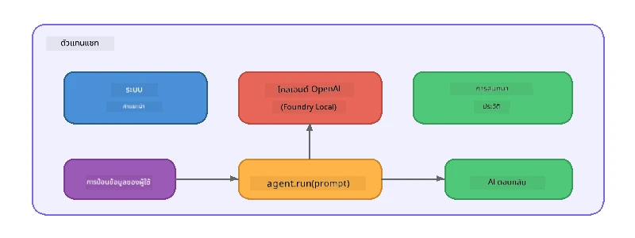

# ส่วนที่ 5: การสร้างเอเจนต์ AI ด้วย Agent Framework

> **เป้าหมาย:** สร้างเอเจนต์ AI ตัวแรกของคุณที่มีคำสั่งถาวรและบุคลิกที่กำหนดไว้ โดยใช้โมเดลภายในเครื่องผ่าน Foundry Local

## เอเจนต์ AI คืออะไร?

เอเจนต์ AI จะหุ้มโมเดลภาษาไว้ด้วย **คำสั่งระบบ** ที่กำหนดพฤติกรรม บุคลิกภาพ และข้อจำกัดของมัน ต่างจากการเรียกใช้งานการสนทนาแบบเดียว เอเจนต์จะมี:

- **บุคลิกภาพ** - ตัวตนที่สม่ำเสมอ ("คุณเป็นผู้ตรวจสอบโค้ดที่ช่วยเหลือดี")
- **หน่วยความจำ** - ประวัติการสนทนาในแต่ละรอบ
- **ความเชี่ยวชาญเฉพาะทาง** - พฤติกรรมที่เน้นตามคำสั่งที่ออกแบบมาอย่างดี



---

## Microsoft Agent Framework

**Microsoft Agent Framework** (AGF) ให้การนามธรรมมาตรฐานของเอเจนต์ที่ทำงานกับแบ็กเอนด์โมเดลต่าง ๆ ในเวิร์กช็อปนี้ เราจับคู่กับ Foundry Local เพื่อให้ทุกอย่างทำงานบนเครื่องของคุณเอง - ไม่ต้องใช้คลาวด์

| แนวคิด | คำอธิบาย |
|---------|-------------|
| `FoundryLocalClient` | Python: จัดการการเริ่มบริการ ดาวน์โหลด/โหลดโมเดล และสร้างเอเจนต์ |
| `client.as_agent()` | Python: สร้างเอเจนต์จากไคลเอนต์ Foundry Local |
| `AsAIAgent()` | C#: เมธอดขยายบน `ChatClient` - สร้าง `AIAgent` |
| `instructions` | พร้อมท์ระบบที่กำหนดพฤติกรรมของเอเจนต์ |
| `name` | ป้ายชื่อที่อ่านได้โดยมนุษย์ มีประโยชน์ในสถานการณ์หลายเอเจนต์ |
| `agent.run(prompt)` / `RunAsync()` | ส่งข้อความผู้ใช้และรับคำตอบจากเอเจนต์ |

> **หมายเหตุ:** Agent Framework มี SDK สำหรับ Python และ .NET สำหรับ JavaScript เราจะใช้คลาส `ChatAgent` ที่น้ำหนักเบา ซึ่งเลียนแบบรูปแบบเดียวกันผ่าน OpenAI SDK โดยตรง

---

## แบบฝึกหัด

### แบบฝึกหัด 1 - ทำความเข้าใจกับแพทเทิร์นเอเจนต์

ก่อนเขียนโค้ด ศึกษาส่วนประกอบสำคัญของเอเจนต์:

1. **ไคลเอนต์โมเดล** - เชื่อมต่อกับ API ที่เข้ากันได้กับ OpenAI ของ Foundry Local
2. **คำสั่งระบบ** - พร้อมท์ "บุคลิกภาพ"
3. **ลูปรัน** - ส่งอินพุตผู้ใช้ รับเอาท์พุต

> **คิดดู:** คำสั่งระบบแตกต่างจากข้อความของผู้ใช้ปกติอย่างไร? จะเกิดอะไรขึ้นถ้าคุณเปลี่ยนมัน?

---

### แบบฝึกหัด 2 - รันตัวอย่างเอเจนต์เดี่ยว

<details>
<summary><strong>🐍 Python</strong></summary>

**สิ่งที่ต้องเตรียม:**
```bash
cd python
python -m venv venv

# Windows (PowerShell):
venv\Scripts\Activate.ps1
# macOS:
source venv/bin/activate

pip install -r requirements.txt
```

**รัน:**
```bash
python foundry-local-with-agf.py
```

**คำอธิบายโค้ด** (`python/foundry-local-with-agf.py`):

```python
import asyncio
from agent_framework_foundry_local import FoundryLocalClient

async def main():
    alias = "phi-4-mini"

    # FoundryLocalClient จัดการการเริ่มต้นบริการ, ดาวน์โหลดโมเดล, และการโหลด
    client = FoundryLocalClient(model_id=alias)
    print(f"Client Model ID: {client.model_id}")

    # สร้างเอเย่นต์พร้อมคำสั่งระบบ
    agent = client.as_agent(
        name="Joker",
        instructions="You are good at telling jokes.",
    )

    # แบบไม่สตรีม: รับการตอบกลับทั้งหมดในครั้งเดียว
    result = await agent.run("Tell me a joke about a pirate.")
    print(f"Agent: {result}")

    # แบบสตรีม: รับผลลัพธ์ทันทีเมื่อถูกสร้างขึ้น
    async for chunk in agent.run("Tell me another joke.", stream=True):
        if chunk.text:
            print(chunk.text, end="", flush=True)

asyncio.run(main())
```

**ประเด็นสำคัญ:**
- `FoundryLocalClient(model_id=alias)` จัดการเริ่มบริการ ดาวน์โหลด และโหลดโมเดลในขั้นตอนเดียว
- `client.as_agent()` สร้างเอเจนต์พร้อมคำสั่งระบบและชื่อ
- `agent.run()` รองรับทั้งโหมดไม่สตรีมและสตรีม
- ติดตั้งด้วย `pip install agent-framework-foundry-local --pre`

</details>

<details>
<summary><strong>📦 JavaScript</strong></summary>

**สิ่งที่ต้องเตรียม:**
```bash
cd javascript
npm install
```

**รัน:**
```bash
node foundry-local-with-agent.mjs
```

**คำอธิบายโค้ด** (`javascript/foundry-local-with-agent.mjs`):

```javascript
import { OpenAI } from "openai";
import { FoundryLocalManager } from "foundry-local-sdk";

class ChatAgent {
  constructor({ client, modelId, instructions, name }) {
    this.client = client;
    this.modelId = modelId;
    this.instructions = instructions;
    this.name = name;
    this.history = [];
  }

  async run(userMessage) {
    const messages = [
      { role: "system", content: this.instructions },
      ...this.history,
      { role: "user", content: userMessage },
    ];
    const response = await this.client.chat.completions.create({
      model: this.modelId,
      messages,
    });
    const assistantMessage = response.choices[0].message.content;

    // เก็บประวัติการสนทนาเพื่อการโต้ตอบหลายรอบ
    this.history.push({ role: "user", content: userMessage });
    this.history.push({ role: "assistant", content: assistantMessage });
    return { text: assistantMessage };
  }
}

async function main() {
  FoundryLocalManager.create({ appName: "FoundryLocalWorkshop" });
  const manager = FoundryLocalManager.instance;
  await manager.startWebService();

  const catalog = manager.catalog;
  const model = await catalog.getModel("phi-3.5-mini");
  if (!model.isCached) {
    console.log("Downloading model: phi-3.5-mini...");
    await model.download();
  }
  await model.load();

  const client = new OpenAI({
    baseURL: manager.urls[0] + "/v1",
    apiKey: "foundry-local",
  });

  const agent = new ChatAgent({
    client,
    modelId: model.id,
    instructions: "You are good at telling jokes.",
    name: "Joker",
  });

  const result = await agent.run("Tell me a joke about a pirate.");
  console.log(result.text);
}

main();
```

**ประเด็นสำคัญ:**
- JavaScript สร้างคลาส `ChatAgent` แยกต่างหากที่เลียนแบบรูปแบบของ Python AGF
- `this.history` เก็บรอบสนทนาเพื่อสนับสนุนหลายรอบ
- แจ้งให้ทราบกระบวนการอย่างชัดเจน `startWebService()` → เช็คแคช → `model.download()` → `model.load()`

</details>

<details>
<summary><strong>💜 C#</strong></summary>

**สิ่งที่ต้องเตรียม:**
```bash
cd csharp
dotnet restore
```

**รัน:**
```bash
dotnet run agent
```

**คำอธิบายโค้ด** (`csharp/SingleAgent.cs`):

```csharp
using Microsoft.AI.Foundry.Local;
using Microsoft.Extensions.Logging.Abstractions;
using Microsoft.Agents.AI;
using OpenAI;
using System.ClientModel;

// 1. Start Foundry Local and load a model
var alias = "phi-3.5-mini";
await FoundryLocalManager.CreateAsync(
    new Configuration
    {
        AppName = "FoundryLocalSamples",
        Web = new Configuration.WebService { Urls = "http://127.0.0.1:0" }
    }, NullLogger.Instance, default);
var manager = FoundryLocalManager.Instance;
await manager.StartWebServiceAsync(default);

var catalog = await manager.GetCatalogAsync(default);
var model = await catalog.GetModelAsync(alias, default);

var isCached = await model.IsCachedAsync(default);
if (!isCached)
{
    Console.WriteLine($"Downloading model: {alias}...");
    await model.DownloadAsync(null, default);
}
await model.LoadAsync(default);

var key = new ApiKeyCredential("foundry-local");
var client = new OpenAIClient(key, new OpenAIClientOptions
{
    Endpoint = new Uri(manager.Urls[0] + "/v1")
});

// 2. Create an AIAgent using the Agent Framework extension method
AIAgent joker = client
    .GetChatClient(model.Id)
    .AsAIAgent(
        instructions: "You are good at telling jokes. Keep your jokes short and family-friendly.",
        name: "Joker"
    );

// 3. Run the agent (non-streaming)
var response = await joker.RunAsync("Tell me a joke about a pirate.");
Console.WriteLine($"Joker: {response}");

// 4. Run with streaming
await foreach (var update in joker.RunStreamingAsync("Tell me another joke."))
{
    Console.Write(update);
}
```

**ประเด็นสำคัญ:**
- `AsAIAgent()` เป็นเมธอดขยายจาก `Microsoft.Agents.AI.OpenAI` - ไม่ต้องมีคลาส `ChatAgent` แบบกำหนดเอง
- `RunAsync()` คืนคำตอบเต็ม; `RunStreamingAsync()` สตรีมทีละโทเค็น
- ติดตั้งด้วย `dotnet add package Microsoft.Agents.AI.OpenAI --version 1.0.0-rc3`

</details>

---

### แบบฝึกหัด 3 - เปลี่ยนบุคลิก

แก้ไข `instructions` ของเอเจนต์เพื่อสร้างบุคลิกแตกต่างกัน ลองแต่ละแบบและสังเกตการเปลี่ยนแปลงของเอาท์พุต:

| บุคลิก | คำสั่ง |
|---------|-------------|
| ผู้ตรวจสอบโค้ด | `"คุณเป็นผู้ตรวจสอบโค้ดผู้เชี่ยวชาญ ให้คำติชมที่สร้างสรรค์เน้นความอ่านง่าย ประสิทธิภาพ และความถูกต้อง"` |
| ไกด์ท่องเที่ยว | `"คุณเป็นไกด์ท่องเที่ยวที่เป็นมิตร ให้คำแนะนำส่วนบุคคลสำหรับสถานที่ กิจกรรม และอาหารท้องถิ่น"` |
| ติวเตอร์สไตล์โสกราตีส | `"คุณเป็นติวเตอร์สไตล์โสกราตีส อย่าตอบตรง ๆ แต่ชี้แนะแนวทางให้คนเรียนด้วยคำถามที่คิดมาแล้ว"` |
| นักเขียนเทคนิค | `"คุณเป็นนักเขียนเทคนิค อธิบายแนวคิดอย่างชัดเจนและกระชับ ใช้ตัวอย่าง หลีกเลี่ยงศัพท์เฉพาะ"` |

**ลองทำ:**
1. เลือกบุคลิกหนึ่งจากตารางด้านบน
2. แทนที่สตริง `instructions` ในโค้ด
3. ปรับพร้อมท์ผู้ใช้ให้ตรงกัน (เช่น ขอให้ผู้ตรวจสอบโค้ดตรวจสอบฟังก์ชัน)
4. รันตัวอย่างใหม่และเปรียบเทียบผลลัพธ์

> **เคล็ดลับ:** คุณภาพของเอเจนต์ขึ้นอยู่กับคำสั่งเป็นอย่างมาก คำสั่งเฉพาะเจาะจงและมีโครงสร้างดีให้ผลลัพธ์ดีกว่าคำสั่งที่กำกวม

---

### แบบฝึกหัด 4 - เพิ่มการสนทนาแบบหลายรอบ

ขยายตัวอย่างเพื่อรองรับลูปแชทหลายรอบ ให้คุณคุยโต้ตอบแบบไปกลับกับเอเจนต์ได้

<details>
<summary><strong>🐍 Python - ลูปหลายรอบ</strong></summary>

```python
import asyncio
from agent_framework_foundry_local import FoundryLocalClient

async def main():
    client = FoundryLocalClient(model_id="phi-4-mini")

    agent = client.as_agent(
        name="Assistant",
        instructions="You are a helpful assistant.",
    )

    print("Chat with the agent (type 'quit' to exit):\n")
    while True:
        user_input = input("You: ")
        if user_input.strip().lower() in ("quit", "exit"):
            break
        result = await agent.run(user_input)
        print(f"Agent: {result}\n")

asyncio.run(main())
```

</details>

<details>
<summary><strong>📦 JavaScript - ลูปหลายรอบ</strong></summary>

```javascript
import { OpenAI } from "openai";
import { FoundryLocalManager } from "foundry-local-sdk";
import * as readline from "node:readline/promises";

// (ใช้คลาส ChatAgent ซ้ำจากแบบฝึกหัดข้อ 2)

async function main() {
  FoundryLocalManager.create({ appName: "FoundryLocalWorkshop" });
  const manager = FoundryLocalManager.instance;
  await manager.startWebService();

  const catalog = manager.catalog;
  const model = await catalog.getModel("phi-3.5-mini");
  if (!model.isCached) {
    console.log("Downloading model: phi-3.5-mini...");
    await model.download();
  }
  await model.load();

  const client = new OpenAI({
    baseURL: manager.urls[0] + "/v1",
    apiKey: "foundry-local",
  });

  const agent = new ChatAgent({
    client,
    modelId: model.id,
    instructions: "You are a helpful assistant.",
    name: "Assistant",
  });

  const rl = readline.createInterface({
    input: process.stdin,
    output: process.stdout,
  });

  console.log("Chat with the agent (type 'quit' to exit):\n");
  while (true) {
    const userInput = await rl.question("You: ");
    if (["quit", "exit"].includes(userInput.trim().toLowerCase())) break;
    const result = await agent.run(userInput);
    console.log(`Agent: ${result.text}\n`);
  }
  rl.close();
}

main();
```

</details>

<details>
<summary><strong>💜 C# - ลูปหลายรอบ</strong></summary>

```csharp
using Microsoft.AI.Foundry.Local;
using Microsoft.Extensions.Logging.Abstractions;
using Microsoft.Agents.AI;
using OpenAI;
using System.ClientModel;

var alias = "phi-3.5-mini";
var config = new Configuration
{
    AppName = "FoundryLocalSamples",
    Web = new Configuration.WebService { Urls = "http://127.0.0.1:0" }
};
await FoundryLocalManager.CreateAsync(config, NullLogger.Instance, default);
var manager = FoundryLocalManager.Instance;
await manager.StartWebServiceAsync(default);

var catalog = await manager.GetCatalogAsync(default);
var model = await catalog.GetModelAsync(alias, default);

var isCached = await model.IsCachedAsync(default);
if (!isCached)
{
    Console.WriteLine($"Downloading model: {alias}...");
    await model.DownloadAsync(null, default);
}
await model.LoadAsync(default);

var key = new ApiKeyCredential("foundry-local");
var client = new OpenAIClient(key, new OpenAIClientOptions
{
    Endpoint = new Uri(manager.Urls[0] + "/v1")
});

AIAgent agent = client
    .GetChatClient(model.Id)
    .AsAIAgent(
        instructions: "You are a helpful assistant.",
        name: "Assistant"
    );

Console.WriteLine("Chat with the agent (type 'quit' to exit):\n");
while (true)
{
    Console.Write("You: ");
    var userInput = Console.ReadLine();
    if (string.IsNullOrWhiteSpace(userInput) ||
        userInput.Equals("quit", StringComparison.OrdinalIgnoreCase) ||
        userInput.Equals("exit", StringComparison.OrdinalIgnoreCase))
        break;

    var result = await agent.RunAsync(userInput);
    Console.WriteLine($"Agent: {result}\n");
}
```

</details>

สังเกตว่าเอเจนต์จำรอบก่อนหน้าได้ - ลองถามคำถามติดตามและดูบริบทที่ต่อเนื่องกัน

---

### แบบฝึกหัด 5 - เอาท์พุตแบบมีโครงสร้าง

สั่งให้เอเจนต์ตอบเสมอในรูปแบบเฉพาะ (เช่น JSON) และแปลงผลลัพธ์:

<details>
<summary><strong>🐍 Python - เอาท์พุต JSON</strong></summary>

```python
import asyncio
import json
from agent_framework_foundry_local import FoundryLocalClient

async def main():
    client = FoundryLocalClient(model_id="phi-4-mini")

    agent = client.as_agent(
        name="SentimentAnalyzer",
        instructions=(
            "You are a sentiment analysis agent. "
            "For every user message, respond ONLY with valid JSON in this format: "
            '{"sentiment": "positive|negative|neutral", "confidence": 0.0-1.0, "summary": "brief reason"}'
        ),
    )

    result = await agent.run("I absolutely loved the new restaurant downtown!")
    print("Raw:", result)

    try:
        parsed = json.loads(str(result))
        print(f"Sentiment: {parsed['sentiment']} (confidence: {parsed['confidence']})")
    except json.JSONDecodeError:
        print("Agent did not return valid JSON - try refining the instructions.")

asyncio.run(main())
```

</details>

<details>
<summary><strong>💜 C# - เอาท์พุต JSON</strong></summary>

```csharp
using System.Text.Json;

AIAgent analyzer = chatClient.AsAIAgent(
    name: "SentimentAnalyzer",
    instructions:
        "You are a sentiment analysis agent. " +
        "For every user message, respond ONLY with valid JSON in this format: " +
        "{\"sentiment\": \"positive|negative|neutral\", \"confidence\": 0.0-1.0, \"summary\": \"brief reason\"}"
);

var response = await analyzer.RunAsync("I absolutely loved the new restaurant downtown!");
Console.WriteLine($"Raw: {response}");

try
{
    var parsed = JsonSerializer.Deserialize<JsonElement>(response.ToString());
    Console.WriteLine($"Sentiment: {parsed.GetProperty("sentiment")} " +
                      $"(confidence: {parsed.GetProperty("confidence")})");
}
catch (JsonException)
{
    Console.WriteLine("Agent did not return valid JSON - try refining the instructions.");
}
```

</details>

> **หมายเหตุ:** โมเดลเล็กในเครื่องอาจไม่สามารถสร้าง JSON ที่ถูกต้องเสมอไป คุณสามารถเพิ่มความน่าเชื่อถือได้โดยใส่ตัวอย่างในคำสั่งและระบุรูปแบบที่ต้องการอย่างชัดเจน

---

## ประเด็นสำคัญ

| แนวคิด | สิ่งที่คุณได้เรียนรู้ |
|---------|-----------------|
| เอเจนต์ vs. การเรียก LLM ดิบ | เอเจนต์หุ้มโมเดลด้วยคำสั่งและหน่วยความจำ |
| คำสั่งระบบ | เลเวอร์สำคัญที่สุดในการควบคุมพฤติกรรมเอเจนต์ |
| การสนทนาหลายรอบ | เอเจนต์สามารถถ่ายทอดบริบทระหว่างอินเทอร์แอกชัน |
| เอาท์พุตแบบมีโครงสร้าง | คำสั่งสามารถบังคับรูปแบบเอาท์พุต (JSON, markdown, ฯลฯ) |
| การรันในเครื่อง | ทุกอย่างทำงานบนเครื่องผ่าน Foundry Local - ไม่ต้องใช้คลาวด์ |

---

## ขั้นตอนต่อไป

ใน **[ส่วนที่ 6: Multi-Agent Workflows](part6-multi-agent-workflows.md)** คุณจะรวมหลายเอเจนต์ไว้ในไพป์ไลน์ที่ประสานงานกัน ซึ่งแต่ละเอเจนต์มีบทบาทเฉพาะทาง

---

<!-- CO-OP TRANSLATOR DISCLAIMER START -->
**ข้อจำกัดความรับผิดชอบ**:  
เอกสารนี้ได้รับการแปลโดยใช้บริการแปลด้วย AI [Co-op Translator](https://github.com/Azure/co-op-translator) แม้ว่าเราจะพยายามให้ความถูกต้อง แต่โปรดทราบว่าการแปลอัตโนมัติอาจมีข้อผิดพลาดหรือความคลาดเคลื่อน เอกสารต้นฉบับในภาษาต้นทางควรถูกพิจารณาเป็นแหล่งข้อมูลที่เชื่อถือได้ สำหรับข้อมูลสำคัญ ขอแนะนำให้ใช้การแปลโดยมนุษย์มืออาชีพ เราไม่รับผิดชอบต่อความเข้าใจผิดหรือการตีความที่ผิดพลาดใด ๆ ที่เกิดจากการใช้การแปลนี้
<!-- CO-OP TRANSLATOR DISCLAIMER END -->