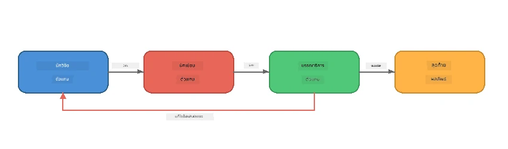
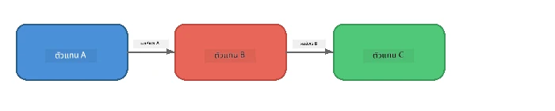
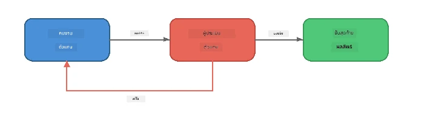
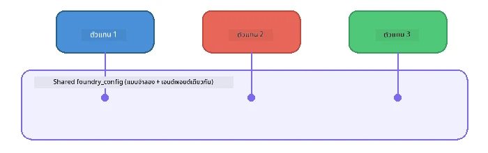

# ส่วนที่ 6: เวิร์กโฟลว์แบบหลายเอเจนต์

> **เป้าหมาย:** รวมเอเจนต์เฉพาะทางหลายตัวเข้าเป็นสายการทำงานที่ประสานงานกัน แบ่งงานที่ซับซ้อนระหว่างเอเจนต์ที่ร่วมมือกัน - ทั้งหมดทำงานในเครื่องด้วย Foundry Local

## ทำไมต้องแบบหลายเอเจนต์?

เอเจนต์เดียวสามารถจัดการงานหลายอย่างได้ แต่เวิร์กโฟลว์ที่ซับซ้อนจะได้ประโยชน์จาก **ความเชี่ยวชาญเฉพาะด้าน** แทนที่จะให้เอเจนต์ตัวเดียวพยายามค้นคว้า เขียน และแก้ไขพร้อมกัน คุณแยกงานออกเป็นบทบาทที่มุ่งเน้น:



| รูปแบบ | คำอธิบาย |
|---------|-------------|
| **เรียงลำดับ** | เอาท์พุตของเอเจนต์ A เป็นอินพุตให้เอเจนต์ B → C |
| **วงจรฟีดแบ็ค** | เอเจนต์ผู้ประเมินสามารถส่งงานกลับไปให้แก้ไข |
| **บริบทที่ใช้ร่วมกัน** | เอเจนต์ทั้งหมดใช้โมเดล/เอนด์พอยท์เดียวกัน แต่คำสั่งแตกต่างกัน |
| **เอาท์พุตที่มีประเภท** | เอเจนต์สร้างผลลัพธ์ที่มีโครงสร้าง (JSON) เพื่อส่งต่องานได้อย่างเชื่อถือได้ |

---

## แบบฝึกหัด

### แบบฝึกหัดที่ 1 - รันสายงานแบบหลายเอเจนต์

เวิร์กช็อปประกอบด้วยเวิร์กโฟลว์ Researcher → Writer → Editor ที่สมบูรณ์

<details>
<summary><strong>🐍 Python</strong></summary>

**ตั้งค่า:**
```bash
cd python
python -m venv venv

# วินโดวส์ (PowerShell):
venv\Scripts\Activate.ps1
# macOS:
source venv/bin/activate

pip install -r requirements.txt
```

**รัน:**
```bash
python foundry-local-multi-agent.py
```

**สิ่งที่จะเกิดขึ้น:**
1. **Researcher** รับหัวข้อและส่งกลับข้อเท็จจริงแบบหัวข้อย่อย
2. **Writer** นำงานวิจัยมาเขียนร่างบทความบล็อก (3-4 ย่อหน้า)
3. **Editor** ตรวจสอบบทความด้านคุณภาพและส่งคำตอบว่า ACCEPT หรือ REVISE

</details>

<details>
<summary><strong>📦 JavaScript</strong></summary>

**ตั้งค่า:**
```bash
cd javascript
npm install
```

**รัน:**
```bash
node foundry-local-multi-agent.mjs
```

**สายงานสามขั้นตอนเดียวกัน** - Researcher → Writer → Editor

</details>

<details>
<summary><strong>💜 C#</strong></summary>

**ตั้งค่า:**
```bash
cd csharp
dotnet restore
```

**รัน:**
```bash
dotnet run multi
```

**สายงานสามขั้นตอนเดียวกัน** - Researcher → Writer → Editor

</details>

---

### แบบฝึกหัดที่ 2 - โครงสร้างของสายงาน

ศึกษาวิธีการกำหนดและเชื่อมต่อเอเจนต์:

**1. ลูกค้าโมเดลร่วม**

เอเจนต์ทั้งหมดใช้โมเดล Foundry Local เดียวกัน:

```python
# Python - FoundryLocalClient จัดการทุกอย่าง
from agent_framework_foundry_local import FoundryLocalClient

client = FoundryLocalClient(model_id="phi-3.5-mini")
```

```javascript
// JavaScript - OpenAI SDK ชี้ไปที่ Foundry Local
const client = new OpenAI({
  baseURL: manager.urls[0] + "/v1",
  apiKey: "foundry-local",
});
```

```csharp
// C# - OpenAIClient pointed at Foundry Local
var key = new ApiKeyCredential("foundry-local");
var client = new OpenAIClient(key, new OpenAIClientOptions
{
    Endpoint = new Uri(manager.Urls[0] + "/v1")
});
var chatClient = client.GetChatClient(model.Id);
```

**2. คำสั่งเฉพาะ**

แต่ละเอเจนต์มีบุคลิกแตกต่างกัน:

| เอเจนต์ | คำสั่ง (สรุป) |
|---------|----------------|
| Researcher | "ให้ข้อมูลสำคัญ ข้อสถิติ และพื้นหลัง จัดเรียงเป็นหัวข้อย่อย" |
| Writer | "เขียนบทความบล็อกที่น่าสนใจ (3-4 ย่อหน้า) จากบันทึกวิจัย หลีกเลี่ยงการสร้างข้อมูลเท็จ" |
| Editor | "ตรวจสอบความชัดเจน ไวยากรณ์ และความถูกต้องของข้อเท็จจริง ผลลัพธ์: ACCEPT หรือ REVISE" |

**3. การไหลของข้อมูลระหว่างเอเจนต์**

```python
# ขั้นตอนที่ 1 - ผลลัพธ์จากนักวิจัยกลายเป็นข้อมูลเข้าสู่ผู้เขียน
research_result = await researcher.run(f"Research: {topic}")

# ขั้นตอนที่ 2 - ผลลัพธ์จากผู้เขียนกลายเป็นข้อมูลเข้าสู่บรรณาธิการ
writer_result = await writer.run(f"Write using:\n{research_result}")

# ขั้นตอนที่ 3 - บรรณาธิการทบทวนทั้งงานวิจัยและบทความ
editor_result = await editor.run(
    f"Research:\n{research_result}\n\nArticle:\n{writer_result}"
)
```

```csharp
// C# - same pattern, async calls with AIAgent
var researchNotes = await researcher.RunAsync(
    $"Research the following topic and provide key facts:\n{topic}");

var draft = await writer.RunAsync(
    $"Write a blog post based on these research notes:\n\n{researchNotes}");

var verdict = await editor.RunAsync(
    $"Review this article for quality and accuracy.\n\n" +
    $"Research notes:\n{researchNotes}\n\n" +
    $"Article:\n{draft}");
```

> **ข้อมูลสำคัญ:** เอเจนต์แต่ละตัวได้รับบริบทสะสมจากเอเจนต์ก่อนหน้า บรรณาธิการจะเห็นทั้งงานวิจัยต้นฉบับและร่าง ซึ่งช่วยให้ตรวจสอบความสอดคล้องของข้อเท็จจริงได้

---

### แบบฝึกหัดที่ 3 - เพิ่มเอเจนต์ที่สี่

ขยายสายงานโดยเพิ่มเอเจนต์ใหม่ เลือกหนึ่งจากต่อไปนี้:

| เอเจนต์ | วัตถุประสงค์ | คำสั่ง |
|---------|--------------|-------------|
| **Fact-Checker** | ตรวจสอบข้อกล่าวหาในบทความ | `"คุณตรวจสอบข้อเท็จจริง แต่ละข้อให้ระบุว่าข้อสนับสนุนโดยบันทึกงานวิจัยหรือไม่ ส่งกลับ JSON พร้อมรายการที่ตรวจสอบแล้ว/ยังไม่ได้ตรวจสอบ"` |
| **Headline Writer** | สร้างหัวข้อที่น่าสนใจ | `"สร้างตัวเลือกหัวข้อ 5 แบบสำหรับบทความ สไตล์หลากหลาย: ให้ข้อมูล, ดึงดูดคลิก, ตั้งคำถาม, เป็นลิสต์, มีอารมณ์"` |
| **Social Media** | สร้างโพสต์โปรโมทบนโซเชียล | `"สร้างโพสต์โซเชียลมีเดีย 3 โพสต์โปรโมทบทความนี้: หนึ่งสำหรับ Twitter (280 ตัวอักษร), หนึ่งสำหรับ LinkedIn (โทนมืออาชีพ), หนึ่งสำหรับ Instagram (ไม่เป็นทางการพร้อมแนะนำอิโมจิ)"` |

<details>
<summary><strong>🐍 Python - เพิ่ม Headline Writer</strong></summary>

```python
headline_agent = client.as_agent(
    name="HeadlineWriter",
    instructions=(
        "You are a headline specialist. Given an article, generate exactly "
        "5 headline options. Vary the style: informative, question-based, "
        "listicle, emotional, and provocative. Return them as a numbered list."
    ),
)

# หลังจากบรรณาธิการอนุมัติ ให้สร้างหัวเรื่อง
headline_result = await headline_agent.run(
    f"Generate headlines for this article:\n\n{writer_result}"
)
print(f"\n--- Headlines ---\n{headline_result}")
```

</details>

<details>
<summary><strong>📦 JavaScript - เพิ่ม Headline Writer</strong></summary>

```javascript
const headlineAgent = new ChatAgent({
  client,
  modelId: modelInfo.id,
  instructions:
    "You are a headline specialist. Given an article, generate exactly " +
    "5 headline options. Vary the style: informative, question-based, " +
    "listicle, emotional, and provocative. Return them as a numbered list.",
  name: "HeadlineWriter",
});

const headlineResult = await headlineAgent.run(
  `Generate headlines for this article:\n\n${writerResult.text}`
);
console.log(`\n--- Headlines ---\n${headlineResult.text}`);
```

</details>

<details>
<summary><strong>💜 C# - เพิ่ม Headline Writer</strong></summary>

```csharp
AIAgent headlineAgent = chatClient.AsAIAgent(
    name: "HeadlineWriter",
    instructions:
        "You are a headline specialist. Given an article, generate exactly " +
        "5 headline options. Vary the style: informative, question-based, " +
        "listicle, emotional, and provocative. Return them as a numbered list."
);

// After the editor accepts, generate headlines
var headlines = await headlineAgent.RunAsync(
    $"Generate headlines for this article:\n\n{draft}");
Console.WriteLine($"\n--- Headlines ---\n{headlines}");
```

</details>

---

### แบบฝึกหัดที่ 4 - ออกแบบเวิร์กโฟลว์ของคุณเอง

ออกแบบสายงานหลายเอเจนต์สำหรับโดเมนอื่น ๆ ตัวอย่างไอเดีย:

| โดเมน | เอเจนต์ | การไหล |
|--------|---------|--------|
| **ตรวจสอบโค้ด** | Analyser → Reviewer → Summariser | วิเคราะห์โครงสร้างโค้ด → ตรวจสอบปัญหา → สร้างรายงานสรุป |
| **บริการลูกค้า** | Classifier → Responder → QA | จำแนกตั๋ว → ร่างคำตอบ → ตรวจสอบคุณภาพ |
| **การศึกษา** | Quiz Maker → Student Simulator → Grader | สร้างแบบทดสอบ → จำลองคำตอบ → ให้คะแนนและอธิบาย |
| **วิเคราะห์ข้อมูล** | Interpreter → Analyst → Reporter | แปลคำขอข้อมูล → วิเคราะห์รูปแบบ → เขียนรายงาน |

**ขั้นตอน:**
1. กำหนดเอเจนต์ 3 ตัวขึ้นไปที่มี `instructions` แตกต่างกัน
2. ตัดสินใจการไหลของข้อมูล - เอเจนต์แต่ละตัวรับและสร้างอะไร
3. ใช้รูปแบบจากแบบฝึกหัด 1-3 เพื่อสร้างสายงาน
4. เพิ่มวงจรฟีดแบ็คหากเอเจนต์ตัวใดจะประเมินงานของอีกตัว

---

## รูปแบบการประสานงาน

นี่คือรูปแบบการประสานงานที่ใช้ได้กับระบบหลายเอเจนต์ใด ๆ (อธิบายอย่างละเอียดใน [ส่วนที่ 7](part7-zava-creative-writer.md)):

### สายงานเรียงลำดับ



เอเจนต์แต่ละตัวประมวลผลเอาท์พุตของตัวก่อนหน้า ง่ายและคาดเดาได้

### วงจรฟีดแบ็ค



เอเจนต์ผู้ประเมินสามารถกระตุ้นให้รันซ้ำขั้นตอนก่อนหน้า Zava Writer ใช้วิธีนี้: บรรณาธิการสามารถส่งฟีดแบ็คกลับไป Researcher และ Writer

### บริบทที่ใช้ร่วมกัน



เอเจนต์ทั้งหมดใช้ `foundry_config` เดียวกัน จึงใช้โมเดลและเอนด์พอยท์เดียวกัน

---

## ข้อสรุปที่สำคัญ

| แนวคิด | สิ่งที่คุณเรียนรู้ |
|---------|-------------------|
| ความเชี่ยวชาญเฉพาะของเอเจนต์ | เอเจนต์แต่ละตัวทำงานได้ดีในสิ่งใดสิ่งหนึ่งด้วยคำสั่งชัดเจน |
| การส่งต่อข้อมูล | เอาท์พุตของเอเจนต์หนึ่งเป็นอินพุตของอีกตัวหนึ่ง |
| วงจรฟีดแบ็ค | เอเจนต์ผู้ประเมินสามารถกระตุ้นให้ลองใหม่เพื่อคุณภาพสูงขึ้น |
| เอาท์พุตที่มีโครงสร้าง | การตอบกลับในรูปแบบ JSON ช่วยให้การสื่อสารระหว่างเอเจนต์เชื่อถือได้ |
| การประสานงาน | ผู้ประสานงานจัดการลำดับและจัดการข้อผิดพลาดของสายงาน |
| รูปแบบเพื่อการผลิต | ใช้ใน [ส่วนที่ 7: Zava Creative Writer](part7-zava-creative-writer.md) |

---

## ขั้นตอนถัดไป

ไปที่ [ส่วนที่ 7: Zava Creative Writer - แอปพลิเคชัน Capstone](part7-zava-creative-writer.md) เพื่อสำรวจแอประบบหลายเอเจนต์สไตล์การผลิตที่มีเอเจนต์เฉพาะทาง 4 ตัว, การสตรีมเอาท์พุต, การค้นหาสินค้า และวงจรฟีดแบ็ค - มีตัวอย่างใน Python, JavaScript และ C#

---

<!-- CO-OP TRANSLATOR DISCLAIMER START -->
**ข้อจำกัดความรับผิดชอบ**:  
เอกสารฉบับนี้ได้รับการแปลโดยใช้บริการแปลภาษา AI [Co-op Translator](https://github.com/Azure/co-op-translator) แม้ว่าเราจะพยายามให้มีความถูกต้อง โปรดทราบว่าการแปลอัตโนมัติอาจมีข้อผิดพลาดหรือความคลาดเคลื่อนได้ เอกสารฉบับต้นฉบับในภาษาดั้งเดิมควรถูกพิจารณาเป็นแหล่งข้อมูลที่ถูกต้อง สำหรับข้อมูลที่สำคัญ แนะนำให้ใช้การแปลโดยมนุษย์มืออาชีพ เราไม่มีความรับผิดชอบต่อความเข้าใจผิดหรือการตีความผิดใดๆ ที่เกิดจากการใช้การแปลนี้
<!-- CO-OP TRANSLATOR DISCLAIMER END -->