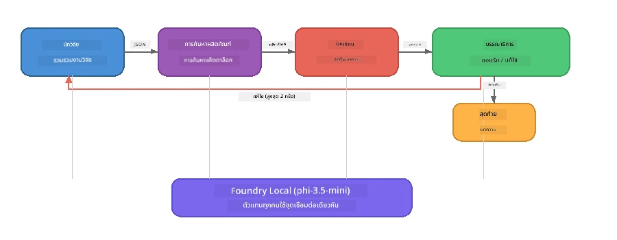

# ส่วนที่ 7: นักเขียนเชิงสร้างสรรค์ Zava - แอปพลิเคชัน Capstone

> **เป้าหมาย:** สำรวจแอปพลิเคชันหลายตัวแทนในรูปแบบการผลิตที่ตัวแทนเฉพาะทางสี่คนร่วมมือกันเพื่อผลิตบทความคุณภาพนิตยสารสำหรับ Zava Retail DIY - ทำงานทั้งหมดบนอุปกรณ์ของคุณด้วย Foundry Local

นี่คือ **แล็บท็อป Capstone** ของเวิร์กช็อป ซึ่งรวมทุกสิ่งที่คุณได้เรียนรู้ไว้ด้วยกัน - การอินทิเกรต SDK (ส่วนที่ 3), การดึงข้อมูลจากข้อมูลในเครื่อง (ส่วนที่ 4), บุคลิกตัวแทน (ส่วนที่ 5), และการประสานงานตัวแทนหลายตัว (ส่วนที่ 6) - ในแอปพลิเคชันสมบูรณ์ที่มีใน **Python**, **JavaScript** และ **C#**.

---

## สิ่งที่คุณจะได้สำรวจ

| แนวคิด | อยู่ที่ส่วนใดใน Zava Writer |
|---------|----------------------------|
| การโหลดโมเดล 4 ขั้นตอน | โมดูลกำหนดค่าร่วมบูต Foundry Local |
| การดึงข้อมูลสไตล์ RAG | ตัวแทนผลิตภัณฑ์ค้นหาผลิตภัณฑ์ในแคตตาล็อกท้องถิ่น |
| ความเชี่ยวชาญของตัวแทน | ตัวแทน 4 คนมีคำสั่งระบบเฉพาะของตนเอง |
| การสตรีมผลลัพธ์ | นักเขียนปล่อยโทเค็นแบบเรียลไทม์ |
| การส่งต่อข้อมูลแบบมีโครงสร้าง | นักวิจัย → JSON, บรรณาธิการ → การตัดสินใจ JSON |
| วงจรตอบกลับ | บรรณาธิการสามารถสั่งให้ทำซ้ำ (สูงสุด 2 ครั้ง) |

---

## สถาปัตยกรรม

Zava Creative Writer ใช้ **สายงานต่อเนื่องพร้อมกับฟีดแบ็กจากผู้ประเมินผล** ภาษาโปรแกรมทั้งสามใช้สถาปัตยกรรมเดียวกัน:



### ตัวแทนสี่คน

| ตัวแทน | อินพุต | เอาต์พุต | วัตถุประสงค์ |
|-------|-------|--------|---------|
| **นักวิจัย** | หัวข้อ + ข้อเสนอแนะเสริม | `{"web": [{url, name, description}, ...]}` | รวบรวมงานวิจัยพื้นฐานผ่าน LLM |
| **ค้นหาผลิตภัณฑ์** | สตริงบริบทผลิตภัณฑ์ | รายการผลิตภัณฑ์ที่ตรงกัน | คำค้นหาที่สร้างโดย LLM + การค้นหาคำหลักในแคตตาล็อกท้องถิ่น |
| **นักเขียน** | งานวิจัย + ผลิตภัณฑ์ + งานมอบหมาย + ข้อเสนอแนะ | ข้อความบทความสตรีมมิ่ง (แยกด้วย `---`) | ร่างบทความคุณภาพนิตยสารแบบเรียลไทม์ |
| **บรรณาธิการ** | บทความ + ข้อเสนอแนะจากนักเขียน | `{"decision": "accept/revise", "editorFeedback": "...", "researchFeedback": "..."}` | ตรวจสอบคุณภาพ, สั่งให้ทำซ้ำถ้าจำเป็น |

### การไหลของสายงาน

1. **นักวิจัย** รับหัวข้อและสร้างบันทึกงานวิจัยแบบมีโครงสร้าง (JSON)
2. **ค้นหาผลิตภัณฑ์** ค้นหาผลิตภัณฑ์ในแคตตาล็อกท้องถิ่นโดยใช้คำค้นหาที่สร้างจาก LLM
3. **นักเขียน** รวมงานวิจัย + ผลิตภัณฑ์ + งานมอบหมาย เป็นบทความสตรีมมิ่ง, ต่อท้ายด้วยข้อเสนอแนะตนเองหลัง `---`
4. **บรรณาธิการ** ตรวจสอบบทความและส่งคืนคำตัดสินในรูปแบบ JSON:
   - `"accept"` → กระบวนการเสร็จสิ้น
   - `"revise"` → ส่งข้อเสนอแนะกลับไปยังนักวิจัยและนักเขียน (สูงสุด 2 ครั้ง)

---

## ข้อกำหนดเบื้องต้น

- ทำ [ส่วนที่ 6: เวิร์กโฟลว์ตัวแทนหลายตัว](part6-multi-agent-workflows.md) ให้เสร็จ
- ติดตั้ง Foundry Local CLI และดาวน์โหลดโมเดล `phi-3.5-mini`

---

## แบบฝึกหัด

### แบบฝึกหัด 1 - รัน Zava Creative Writer

เลือกภาษาของคุณและรันแอปพลิเคชัน:

<details>
<summary><strong>🐍 Python - FastAPI Web Service</strong></summary>

เวอร์ชัน Python ทำงานเป็น **เว็บเซอร์วิส** พร้อม REST API แสดงตัวอย่างการสร้างแบ็กเอนด์การผลิต

**การตั้งค่า:**
```bash
cd zava-creative-writer-local/src/api
python -m venv venv

# Windows (PowerShell):
venv\Scripts\Activate.ps1
# macOS:
source venv/bin/activate

pip install -r requirements.txt
```

**รัน:**
```bash
uvicorn main:app --reload
```

**ทดสอบ:**
```bash
curl -X POST http://localhost:8000/api/article \
  -H "Content-Type: application/json" \
  -d '{
    "research": "DIY home improvement trends",
    "products": "power tools and paints",
    "assignment": "Write an article about weekend renovation projects for DIY enthusiasts"
  }'
```

การตอบกลับจะสตรีมข้อความ JSON ที่เว้นบรรทัดซึ่งแสดงความคืบหน้าของแต่ละตัวแทน

</details>

<details>
<summary><strong>📦 JavaScript - Node.js CLI</strong></summary>

เวอร์ชัน JavaScript ทำงานเป็น **แอปพลิเคชัน CLI** พิมพ์ความคืบหน้าของตัวแทนและบทความทันทีที่คอนโซล

**การตั้งค่า:**
```bash
cd zava-creative-writer-local/src/javascript
npm install
```

**รัน:**
```bash
node main.mjs
```

คุณจะเห็น:
1. การโหลดโมเดล Foundry Local (พร้อมแถบความคืบหน้าถ้ากำลังดาวน์โหลด)
2. ตัวแทนแต่ละตัวทำงานตามลำดับพร้อมข้อความสถานะ
3. บทความสตรีมมิ่งไปยังคอนโซลแบบเรียลไทม์
4. การตัดสินใจรับ/แก้ไขของบรรณาธิการ

</details>

<details>
<summary><strong>💜 C# - .NET Console App</strong></summary>

เวอร์ชัน C# ทำงานเป็น **แอปพลิเคชันคอนโซล .NET** พร้อมสายงานและผลลัพธ์แบบสตรีมมิ่งเหมือนกัน

**การตั้งค่า:**
```bash
cd zava-creative-writer-local/src/csharp
dotnet restore
```

**รัน:**
```bash
dotnet run
```

รูปแบบผลลัพธ์เหมือนเวอร์ชัน JavaScript - ข้อความสถานะตัวแทน, บทความสตรีมมิ่ง, และคำตัดสินบรรณาธิการ

</details>

---

### แบบฝึกหัด 2 - ศึกษาโครงสร้างโค้ด

แต่ละภาษามีส่วนประกอบตรรกะเหมือนกัน เปรียบเทียบโครงสร้าง:

**Python** (`src/api/`):
| ไฟล์ | วัตถุประสงค์ |
|------|---------|
| `foundry_config.py` | ตัวจัดการ Foundry Local, โมเดล, และคลไคลเอนต์ร่วม (โหลด 4 ขั้นตอน) |
| `orchestrator.py` | ประสานการทำงานสายงานพร้อมฟีดแบ็ก |
| `main.py` | จุดเข้าใช้งาน FastAPI (`POST /api/article`) |
| `agents/researcher/researcher.py` | งานวิจัยด้วย LLM พร้อมผลลัพธ์ JSON |
| `agents/product/product.py` | สร้างคำค้นหา LLM + การค้นหาคีย์เวิร์ด |
| `agents/writer/writer.py` | การสร้างบทความแบบสตรีมมิ่ง |
| `agents/editor/editor.py` | การตัดสินใจรับ/แก้ไขด้วย JSON |

**JavaScript** (`src/javascript/`):
| ไฟล์ | วัตถุประสงค์ |
|------|---------|
| `foundryConfig.mjs` | กำหนดค่า Foundry Local ร่วม (โหลด 4 ขั้นตอนพร้อมแถบความคืบหน้า) |
| `main.mjs` | Orchestrator + จุดเข้า CLI |
| `researcher.mjs` | ตัวแทนงานวิจัยด้วย LLM |
| `product.mjs` | สร้างคำค้น LLM + การค้นหาคีย์เวิร์ด |
| `writer.mjs` | การสร้างบทความแบบสตรีมมิ่ง (async generator) |
| `editor.mjs` | ตัดสินใจรับ/แก้ไข JSON |
| `products.mjs` | ข้อมูลแคตตาล็อกผลิตภัณฑ์ |

**C#** (`src/csharp/`):
| ไฟล์ | วัตถุประสงค์ |
|------|---------|
| `Program.cs` | สายงานสมบูรณ์: การโหลดโมเดล, ตัวแทน, orchestrator, วงจรฟีดแบ็ก |
| `ZavaCreativeWriter.csproj` | โปรเจกต์ .NET 9 พร้อมแพ็กเกจ Foundry Local + OpenAI |

> **หมายเหตุการออกแบบ:** Python แยกตัวแทนแต่ละตัวเป็นไฟล์/ไดเรกทอรีของตัวเอง (เหมาะกับทีมใหญ่) JavaScript ใช้โมดูลละตัวแทน (เหมาะกับโปรเจกต์ขนาดกลาง) C# เก็บทุกอย่างในไฟล์เดียวพร้อมฟังก์ชันท้องถิ่น (เหมาะกับตัวอย่างอิสระ) ในการผลิตให้เลือกแบบที่เหมาะกับมาตรฐานทีมคุณ

---

### แบบฝึกหัด 3 - ติดตามการกำหนดค่าร่วม

ตัวแทนทุกตัวในสายงานใช้คลไคลเอนต์ Foundry Local โมเดลเดียวกัน ศึกษาวิธีตั้งค่าในแต่ละภาษา:

<details>
<summary><strong>🐍 Python - foundry_config.py</strong></summary>

```python
from foundry_local import FoundryLocalManager

MODEL_ALIAS = "phi-3.5-mini"

# ขั้นตอนที่ 1: สร้างผู้จัดการและเริ่มต้นบริการ Foundry Local
manager = FoundryLocalManager()
manager.start_service()

# ขั้นตอนที่ 2: ตรวจสอบว่ารูปแบบถูกดาวน์โหลดแล้วหรือไม่
cached = manager.list_cached_models()
catalog_info = manager.get_model_info(MODEL_ALIAS)
is_cached = any(m.id == catalog_info.id for m in cached) if catalog_info else False

if not is_cached:
    manager.download_model(MODEL_ALIAS)

# ขั้นตอนที่ 3: โหลดรูปแบบเข้าสู่หน่วยความจำ
manager.load_model(MODEL_ALIAS)
model_id = manager.get_model_info(MODEL_ALIAS).id

# ลูกค้า OpenAI ร่วมกัน
client = openai.OpenAI(base_url=manager.endpoint, api_key=manager.api_key)
```

ตัวแทนนำเข้า `from foundry_config import client, model_id`

</details>

<details>
<summary><strong>📦 JavaScript - foundryConfig.mjs</strong></summary>

```javascript
import { FoundryLocalManager } from "foundry-local-sdk";
import { OpenAI } from "openai";

FoundryLocalManager.create({ appName: "ZavaCreativeWriter" });
const manager = FoundryLocalManager.instance;
await manager.startWebService();

// ตรวจสอบแคช → ดาวน์โหลด → โหลด (รูปแบบ SDK ใหม่)
const catalog = manager.catalog;
const model = await catalog.getModel(MODEL_ALIAS);
if (!model.isCached) {
  console.log(`Downloading model: ${MODEL_ALIAS}...`);
  await model.download();
}
await model.load();

const client = new OpenAI({ baseURL: manager.urls[0] + "/v1", apiKey: "foundry-local" });
const modelId = model.id;
export { client, modelId };
```

ตัวแทนนำเข้า `{ client, modelId } from "./foundryConfig.mjs"`

</details>

<details>
<summary><strong>💜 C# - ส่วนบนของ Program.cs</strong></summary>

```csharp
await FoundryLocalManager.CreateAsync(
    new Configuration
    {
        AppName = "ZavaCreativeWriter",
        Web = new Configuration.WebService { Urls = "http://127.0.0.1:0" }
    }, NullLogger.Instance, default);
var manager = FoundryLocalManager.Instance;
await manager.StartWebServiceAsync(default);

var catalog = await manager.GetCatalogAsync(default);
var catalogModel = await catalog.GetModelAsync(alias, default);
var isCached = await catalogModel.IsCachedAsync(default);
if (!isCached)
    await catalogModel.DownloadAsync(null, default);

await catalogModel.LoadAsync(default);
var key = new ApiKeyCredential("foundry-local");
var chatClient = new OpenAIClient(key, new OpenAIClientOptions
{
    Endpoint = new Uri(manager.Urls[0] + "/v1")
}).GetChatClient(catalogModel.Id);
```

`chatClient` จะถูกส่งต่อให้ฟังก์ชันตัวแทนทั้งหมดในไฟล์เดียวกัน

</details>

> **รูปแบบหลัก:** รูปแบบการโหลดโมเดล (เริ่มบริการ → ตรวจสอบแคช → ดาวน์โหลด → โหลด) ช่วยให้ผู้ใช้เห็นความก้าวหน้าอย่างชัดเจนและโมเดลถูกดาวน์โหลดเพียงครั้งเดียว นี่คือแนวปฏิบัติที่ดีที่สุดสำหรับแอป Foundry Local ทุกตัว

---

### แบบฝึกหัด 4 - เข้าใจวงจรตอบกลับ

วงจรตอบกลับคือสิ่งที่ทำให้สายงานนี้ “ฉลาด” — บรรณาธิการสามารถส่งงานกลับเพื่อแก้ไข ติดตามตรรกะ:

```
Orchestrator:
  1. researcher.research(topic, "No Feedback")    ← first pass
  2. product.findProducts(productContext)
  3. writer.write(research, products, assignment)  ← streams article
  4. Split article at "---" → article + writerFeedback
  5. editor.edit(article, writerFeedback)

  WHILE editor says "revise" AND retryCount < 2:
    6. researcher.research(topic, editor.researchFeedback)  ← refined
    7. writer.write(research, products, editor.editorFeedback)
    8. editor.edit(newArticle, newWriterFeedback)
    9. retryCount++
```

**คำถามให้พิจารณา:**
- ทำไมจำกัดการลองใหม่ที่ 2 ครั้ง? จะเกิดอะไรขึ้นถ้าเพิ่มขึ้น?
- ทำไมนักวิจัยได้รับ `researchFeedback` แต่เขียนได้รับ `editorFeedback`?
- จะเกิดอะไรขึ้นถ้าบรรณาธิการบอกให้ "แก้ไข" เสมอ?

---

### แบบฝึกหัด 5 - ปรับแต่งตัวแทนหนึ่งตัว

ลองเปลี่ยนพฤติกรรมตัวแทนสักตัวและสังเกตว่ามันส่งผลอย่างไรต่อสายงาน:

| การแก้ไข | สิ่งที่ต้องเปลี่ยน |
|-------------|----------------|
| **บรรณาธิการเข้มงวดขึ้น** | เปลี่ยนคำสั่งระบบบรรณาธิการให้ขอการแก้ไขอย่างน้อยหนึ่งครั้งเสมอ |
| **บทความยาวขึ้น** | เปลี่ยนคำสั่งนักเขียนจาก "800-1000 คำ" เป็น "1500-2000 คำ" |
| **ผลิตภัณฑ์ต่างออกไป** | เพิ่มหรือแก้ไขผลิตภัณฑ์ในแคตตาล็อกผลิตภัณฑ์ |
| **หัวข้องานวิจัยใหม่** | เปลี่ยนค่า `researchContext` เริ่มต้นเป็นหัวข้ออื่น |
| **นักวิจัยคืนค่าเฉพาะ JSON** | ทำให้นักวิจัยคืน 10 รายการแทน 3-5 รายการ |

> **คำแนะนำ:** เพราะภาษาโปรแกรมทั้งสามใช้สถาปัตยกรรมเดียวกัน คุณสามารถแก้ไขเหมือนกันในภาษาที่คุณถนัด

---

### แบบฝึกหัด 6 - เพิ่มตัวแทนตัวที่ห้า

ขยายสายงานด้วยตัวแทนใหม่ บางแนวคิด:

| ตัวแทน | ในสายงานตำแหน่งไหน | วัตถุประสงค์ |
|-------|-------------------|---------|
| **ผู้ตรวจสอบข้อเท็จจริง** | หลังนักเขียน ก่อนบรรณาธิการ | ตรวจสอบข้อเรียกร้องกับข้อมูลงานวิจัย |
| **ผู้ปรับแต่ง SEO** | หลังบรรณาธิการอนุมัติ | เพิ่มคำอธิบายเมตา, คีย์เวิร์ด, slug |
| **นักวาดภาพประกอบ** | หลังบรรณาธิการอนุมัติ | สร้างคำสั่งภาพประกอบสำหรับบทความ |
| **นักแปล** | หลังบรรณาธิการอนุมัติ | แปลบทความเป็นภาษาอื่น |

**ขั้นตอน:**
1. เขียนคำสั่งระบบของตัวแทน
2. สร้างฟังก์ชันตัวแทน (ให้สัมพันธ์กับแบบแผนเดิมในภาษาของคุณ)
3. ใส่ตัวแทนใหม่ใน orchestrator ณ จุดที่เหมาะสม
4. ปรับปรุงผลลัพธ์/ล็อกเพื่อแสดงการมีส่วนร่วมของตัวแทนใหม่

---

## วิธีที่ Foundry Local และ Agent Framework ทำงานร่วมกัน

แอปนี้แสดงรูปแบบที่แนะนำสำหรับการสร้างระบบตัวแทนหลายตัวด้วย Foundry Local:

| ชั้น | ส่วนประกอบ | บทบาท |
|-------|-----------|------|
| **Runtime** | Foundry Local | ดาวน์โหลด, จัดการ, และให้บริการโมเดลในเครื่อง |
| **Client** | OpenAI SDK | ส่งคำขอแชทไปยังจุดเชื่อมต่อในเครื่อง |
| **Agent** | คำสั่งระบบ + เรียกแชท | พฤติกรรมเฉพาะผ่านคำแนะนำที่เน้นเนื้อหา |
| **Orchestrator** | ผู้ประสานงานสายงาน | จัดการการไหลของข้อมูล, การเรียงลำดับ, และวงจรตอบกลับ |
| **Framework** | Microsoft Agent Framework | ให้ `ChatAgent` abstraction และรูปแบบต่างๆ |

ข้อสรุปที่สำคัญ: **Foundry Local แทนที่แบ็กเอนด์บนคลาวด์ ไม่ใช่สถาปัตยกรรมแอปพลิเคชัน** แบบแผนตัวแทน การประสานงาน และการส่งต่อข้อมูลแบบมีโครงสร้างเดียวกันที่ใช้กับโมเดลบนคลาวด์ก็ใช้ได้กับโมเดลในเครื่อง — คุณเพียงแค่ชี้ไคลเอนต์ไปยังจุดเชื่อมต่อในเครื่องแทนที่จะเป็นจุดเชื่อมต่อ Azure

---

## ข้อสรุปสำคัญ

| แนวคิด | สิ่งที่คุณเรียนรู้ |
|---------|-----------------|
| สถาปัตยกรรมการผลิต | วิธีโครงสร้างแอปหลายตัวแทนด้วย config ร่วมและตัวแทนแยกต่างหาก |
| การโหลดโมเดล 4 ขั้นตอน | แนวทางปฏิบัติที่ดีที่สุดสำหรับการเริ่มต้น Foundry Local พร้อมความคืบหน้าให้ผู้ใช้เห็น |
| ความเชี่ยวชาญของตัวแทน | ตัวแทน 4 ตัวแต่ละตัวมีคำสั่งที่เน้นและรูปแบบผลลัพธ์เฉพาะ |
| การสร้างแบบสตรีมมิ่ง | นักเขียนปล่อยโทเค็นแบบเรียลไทม์ เพิ่มความตอบสนอง UI |
| วงจรตอบกลับ | การลองใหม่ตามคำสั่งบรรณาธิการช่วยปรับคุณภาพงานโดยไม่ต้องมีมนุษย์แทรกแซง |
| รูปแบบข้ามภาษา | สถาปัตยกรรมเดียวกันใช้ได้ใน Python, JavaScript และ C# |
| ในเครื่อง = พร้อมผลิต | Foundry Local ให้บริการ API แบบเดียวกับ OpenAI ที่ใช้ในคลาวด์ |

---

## ขั้นตอนถัดไป

ดำเนินการต่อไปที่ [ส่วนที่ 8: การพัฒนาด้วยการประเมินผล](part8-evaluation-led-development.md) เพื่อสร้างกรอบการประเมินผลอย่างเป็นระบบสำหรับตัวแทนของคุณ โดยใช้ชุดข้อมูลทองคำ, การตรวจสอบด้วยกฎ, และการให้คะแนนโดย LLM ในฐานะผู้ตัดสิน

---

<!-- CO-OP TRANSLATOR DISCLAIMER START -->
**ข้อจำกัดความรับผิดชอบ**:  
เอกสารฉบับนี้ได้รับการแปลโดยใช้บริการแปลภาษา AI [Co-op Translator](https://github.com/Azure/co-op-translator) แม้เราจะพยายามให้มีความแม่นยำ โปรดทราบว่าการแปลอัตโนมัติอาจมีข้อผิดพลาดหรือความไม่ถูกต้อง เอกสารต้นฉบับในภาษาต้นฉบับควรถูกถือเป็นแหล่งข้อมูลที่น่าเชื่อถือ สำหรับข้อมูลที่สำคัญ ขอแนะนำให้ใช้การแปลโดยมนุษย์ผู้เชี่ยวชาญ เราจะไม่รับผิดชอบต่อความเข้าใจผิดหรือการตีความผิดที่เกิดขึ้นจากการใช้การแปลนี้
<!-- CO-OP TRANSLATOR DISCLAIMER END -->