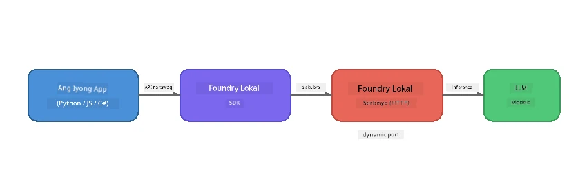

# Part 1: Pagsisimula sa Foundry Local


## Ano ang Foundry Local?

Pinapayagan ka ng [Foundry Local](https://foundrylocal.ai) na patakbuhin ang open-source AI language models **direkta sa iyong computer** - hindi kailangan ng internet, walang gastos sa cloud, at buong proteksyon sa iyong data. Ito ay:

- **Nagda-download at nagpapatakbo ng mga modelo nang lokal** na may awtomatikong pag-optimize ng hardware (GPU, CPU, o NPU)
- **Nagbibigay ng OpenAI-compatible na API** para magamit mo ang mga pamilyar na SDK at mga kasangkapan
- **Hindi nangangailangan ng Azure subscription** o pagpaparehistro - i-install lang at simulan nang gumawa

Isipin mo ito bilang pagkakaroon ng sarili mong pribadong AI na tumatakbo lamang sa iyong makina.

## Mga Layunin sa Pagkatuto

Sa pagtatapos ng lab na ito, magagawa mong:

- I-install ang Foundry Local CLI sa iyong operating system
- Maunawaan kung ano ang model aliases at paano ito gumagana
- Mag-download at magpatakbo ng iyong unang lokal na AI na modelo
- Magpadala ng chat message sa lokal na modelo mula sa command line
- Maunawaan ang pagkakaiba ng mga lokal at cloud-hosted na AI models

---

## Mga Kinakailangan

### Mga Pangangailangan ng Sistema

| Kinakailangan | Minimum | Rekomendado |
|-------------|---------|-------------|
| **RAM** | 8 GB | 16 GB |
| **Disk Space** | 5 GB (para sa mga modelo) | 10 GB |
| **CPU** | 4 na cores | 8+ cores |
| **GPU** | Opsyonal | NVIDIA na may CUDA 11.8+ |
| **OS** | Windows 10/11 (x64/ARM), Windows Server 2025, macOS 13+ | - |

> **Tandaan:** Awtomatikong pinipili ng Foundry Local ang pinakamahusay na variant ng modelo para sa iyong hardware. Kung mayroon kang NVIDIA GPU, ginagamit nito ang CUDA acceleration. Kung mayroon kang Qualcomm NPU, ginagamit iyon. Kung wala, babalik ito sa optimisadong variant ng CPU.

### I-install ang Foundry Local CLI

**Windows** (PowerShell):  
```powershell
winget install Microsoft.FoundryLocal
```
  
**macOS** (Homebrew):  
```bash
brew tap microsoft/foundrylocal
brew install foundrylocal
```
  
> **Tandaan:** Sa kasalukuyan, sinusuportahan lang ng Foundry Local ang Windows at macOS. Hindi pa sinusuportahan ang Linux sa ngayon.

Suriin ang pag-install:  
```bash
foundry --version
```
  
---

## Mga Ehersisyo sa Lab

### Ehersisyo 1: Tuklasin ang mga Available na Modelo

Kasama sa Foundry Local ang katalogo ng mga pre-optimised open-source na mga modelo. Ilista ang mga ito:  

```bash
foundry model list
```
  
Makikita mo ang mga modelong tulad ng:  
- `phi-3.5-mini` - 3.8B parameter na modelo ng Microsoft (mabilis, magandang kalidad)  
- `phi-4-mini` - Mas bago, mas maaasahang Phi na modelo  
- `phi-4-mini-reasoning` - Phi na modelo na may chain-of-thought reasoning (`<think>` tags)  
- `phi-4` - Pinakamalaking Phi model ng Microsoft (10.4 GB)  
- `qwen2.5-0.5b` - Napakaliit at mabilis (maganda para sa low-resource na mga device)  
- `qwen2.5-7b` - Malakas na general-purpose na modelo na may suporta sa tool-calling  
- `qwen2.5-coder-7b` - Ini-optimize para sa code generation  
- `deepseek-r1-7b` - Malakas na reasoning na modelo  
- `gpt-oss-20b` - Malaking open-source na modelo (MIT lisensya, 12.5 GB)  
- `whisper-base` - Speech-to-text transcription (383 MB)  
- `whisper-large-v3-turbo` - Mataas na accuracy ng transcription (9 GB)  

> **Ano ang model alias?** Ang mga alias tulad ng `phi-3.5-mini` ay mga shortcut. Kapag ginamit mo ang alias, awtomatikong ida-download ng Foundry Local ang pinakamahusay na variant para sa iyong partikular na hardware (CUDA para sa NVIDIA GPUs, CPU-optimized kung hindi). Hindi mo na kailangang mag-alala sa pagpili ng tamang variant.

### Ehersisyo 2: Patakbuhin ang Iyong Unang Modelo

I-download at simulan ang pag-chat sa isang modelo nang interactive:  

```bash
foundry model run phi-3.5-mini
```
  
Sa unang takbo nito, gagawin ng Foundry Local ang mga sumusunod:  
1. Tuklasin ang iyong hardware  
2. I-download ang optimal na variant ng modelo (maaari itong tumagal ng ilang minuto)  
3. I-load ang modelo sa memorya  
4. Simulan ang interactive na chat session  

Subukang magtanong ng ilang katanungan:  
```
You: What is the golden ratio?
You: Can you explain it as if I were 10 years old?
You: Write a haiku about mathematics
```
  
I-type ang `exit` o pindutin ang `Ctrl+C` para lumabas.

### Ehersisyo 3: Mag-pre-download ng Modelo

Kung gusto mong mag-download ng modelo nang hindi nagsisimula ng chat:

```bash
foundry model download phi-3.5-mini
```
  
Suriin kung alin sa mga modelo ang na-download na sa iyong makina:  

```bash
foundry cache list
```
  
### Ehersisyo 4: Unawain ang Arkitektura

Ang Foundry Local ay tumatakbo bilang isang **local HTTP service** na nagpapakita ng OpenAI-compatible REST API. Nangangahulugan ito na:

1. Nagsisimula ang serbisyo sa isang **dynamic port** (ibang port sa bawat takbo)
2. Ginagamit mo ang SDK para matuklasan ang aktwal na URL ng endpoint
3. Maaari mong gamitin ang **anumang** OpenAI-compatible na client library para makipag-usap dito



> **Mahalaga:** Nag-aassign ang Foundry Local ng isang **dynamic port** sa bawat pagsisimula. Huwag kailanman i-hardcode ang port number gaya ng `localhost:5272`. Palaging gamitin ang SDK para mahanap ang kasalukuyang URL (hal. `manager.endpoint` sa Python o `manager.urls[0]` sa JavaScript).

---

## Mga Pangunahing Natutuhan

| Konsepto | Ano ang Iyong Natutuhan |
|---------|-------------------------|
| On-device AI | Ang Foundry Local ay nagpapatakbo ng mga modelo nang ganap sa iyong device nang walang cloud, API keys, o gastos |
| Model aliases | Pinipili ng mga alias tulad ng `phi-3.5-mini` nang awtomatiko ang pinakamahusay na variant para sa iyong hardware |
| Dynamic ports | Tumatakbo ang serbisyo sa dynamic na port; palaging gamitin ang SDK para malaman ang endpoint |
| CLI at SDK | Maaari kang makipag-interact sa mga modelo gamit ang CLI (`foundry model run`) o programmatically gamit ang SDK |

---

## Mga Susunod na Hakbang

Magpatuloy sa [Part 2: Foundry Local SDK Deep Dive](part2-foundry-local-sdk.md) upang maging dalubhasa sa SDK API para sa pamamahala ng mga modelo, serbisyo, at caching nang programmatically.

---

<!-- CO-OP TRANSLATOR DISCLAIMER START -->
**Paunawa**:  
Ang dokumentong ito ay isinalin gamit ang serbisyo ng AI na pagsasalin [Co-op Translator](https://github.com/Azure/co-op-translator). Bagamat nagsusumikap kami para sa katumpakan, pakatandaan na ang awtomatikong pagsasalin ay maaaring maglaman ng mga pagkakamali o hindi pagkakatugma. Ang orihinal na dokumento sa kanyang likas na wika ang dapat ituring na opisyal na sanggunian. Para sa mahahalagang impormasyon, inirerekomenda ang propesyonal na pagsasaling-tao. Hindi kami mananagot sa anumang hindi pagkakaunawaan o maling interpretasyon na nagmumula sa paggamit ng pagsasaling ito.
<!-- CO-OP TRANSLATOR DISCLAIMER END -->