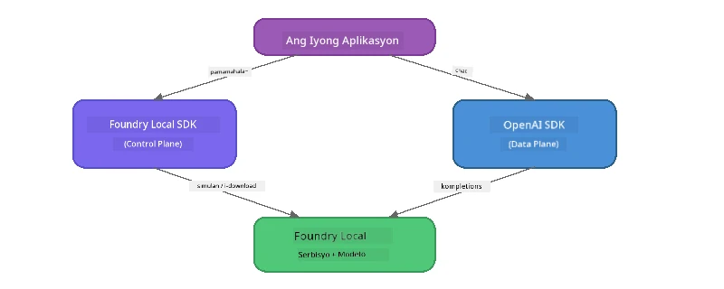

# Bahagi 3: Paggamit ng Foundry Local SDK kasama ang OpenAI

## Pangkalahatang-ideya

Sa Bahagi 1 ginamit mo ang Foundry Local CLI para patakbuhin ang mga modelo nang interaktibo. Sa Bahagi 2 sinaliksik mo ang buong SDK API surface. Ngayon, matututuhan mo kung paano **i-integrate ang Foundry Local sa iyong mga aplikasyon** gamit ang SDK at ang OpenAI-compatible na API.

Nagbibigay ang Foundry Local ng mga SDK para sa tatlong wika. Piliin ang pinaka-komportable ka gamit - pareho ang mga konsepto sa lahat ng tatlo.

## Mga Layunin sa Pagkatuto

Sa pagtatapos ng lab na ito ay magagawa mong:

- I-install ang Foundry Local SDK para sa iyong wika (Python, JavaScript, o C#)
- I-initialise ang `FoundryLocalManager` para simulan ang serbisyo, suriin ang cache, i-download, at i-load ang isang modelo
- Kumonekta sa lokal na modelo gamit ang OpenAI SDK
- Magpadala ng chat completions at hawakan ang streaming responses
- Maunawaan ang dynamic port architecture

---

## Mga Kinakailangan

Kumpletuhin muna ang [Bahagi 1: Pagsisimula sa Foundry Local](part1-getting-started.md) at [Bahagi 2: Malalim na Pagsisid sa Foundry Local SDK](part2-foundry-local-sdk.md).

Mag-install ng **isa** sa mga sumusunod na language runtimes:
- **Python 3.9+** - [python.org/downloads](https://www.python.org/downloads/)
- **Node.js 18+** - [nodejs.org](https://nodejs.org/)
- **.NET 9.0+** - [dot.net/download](https://dotnet.microsoft.com/download)

---

## Konsepto: Paano Gumagana ang SDK

Pinangangasiwaan ng Foundry Local SDK ang **control plane** (pagsisimula ng serbisyo, pag-download ng mga modelo), habang ang OpenAI SDK ang humahawak sa **data plane** (pagpapadala ng prompts, pagtanggap ng completions).



---

## Mga Ehersisyo sa Lab

### Ehersisyo 1: I-setup ang Iyong Kapaligiran

<details>
<summary><b>🐍 Python</b></summary>

```bash
cd python
python -m venv venv

# Isaaktibo ang virtual na kapaligiran:
# Windows (PowerShell):
venv\Scripts\Activate.ps1
# Windows (Command Prompt):
venv\Scripts\activate.bat
# macOS:
source venv/bin/activate

pip install -r requirements.txt
```

Ang `requirements.txt` ay nag-iinstall ng:
- `foundry-local-sdk` - Ang Foundry Local SDK (ini-import bilang `foundry_local`)
- `openai` - Ang OpenAI Python SDK
- `agent-framework` - Microsoft Agent Framework (ginagamit sa mga susunod na bahagi)

</details>

<details>
<summary><b>📘 JavaScript</b></summary>

```bash
cd javascript
npm install
```

Ang `package.json` ay nag-iinstall ng:
- `foundry-local-sdk` - Ang Foundry Local SDK
- `openai` - Ang OpenAI Node.js SDK

</details>

<details>
<summary><b>💜 C#</b></summary>

```bash
cd csharp
dotnet restore
dotnet build
```

Ang `csharp.csproj` ay gumagamit ng:
- `Microsoft.AI.Foundry.Local` - Ang Foundry Local SDK (NuGet)
- `OpenAI` - Ang OpenAI C# SDK (NuGet)

> **Istraktura ng proyekto:** Ginagamit ng C# project ang command-line router sa `Program.cs` na nagdidispatch sa mga hiwalay na example file. Patakbuhin ang `dotnet run chat` (o simpleng `dotnet run`) para sa bahagi na ito. Ang ibang bahagi ay gumagamit ng `dotnet run rag`, `dotnet run agent`, at `dotnet run multi`.

</details>

---

### Ehersisyo 2: Pangunahing Chat Completion

Buksan ang pangunahing chat example para sa iyong wika at suriin ang code. Bawat script ay sumusunod sa parehong tatlong-hakbang na pattern:

1. **Simulan ang serbisyo** - `FoundryLocalManager` ang nagsisimula ng Foundry Local runtime
2. **I-download at i-load ang modelo** - suriin ang cache, i-download kung kailangan, pagkatapos i-load sa memorya
3. **Gumawa ng OpenAI client** - kumonekta sa lokal na endpoint at magpadala ng streaming chat completion

<details>
<summary><b>🐍 Python - <code>python/foundry-local.py</code></b></summary>

```python
import sys
import openai
from foundry_local import FoundryLocalManager

alias = "phi-3.5-mini"

# Hakbang 1: Gumawa ng FoundryLocalManager at simulan ang serbisyo
print("Starting Foundry Local service...")
manager = FoundryLocalManager()
manager.start_service()

# Hakbang 2: Suriin kung ang modelo ay na-download na
cached = manager.list_cached_models()
catalog_info = manager.get_model_info(alias)
is_cached = any(m.id == catalog_info.id for m in cached) if catalog_info else False

if is_cached:
    print(f"Model already downloaded: {alias}")
else:
    print(f"Downloading model: {alias} (this may take several minutes)...")
    manager.download_model(alias)
    print(f"Download complete: {alias}")

# Hakbang 3: I-load ang modelo sa memorya
print(f"Loading model: {alias}...")
manager.load_model(alias)

# Gumawa ng OpenAI client na naka-turo sa LOCAL Foundry service
client = openai.OpenAI(
    base_url=manager.endpoint,   # Dinamikong port - huwag kailanman i-hardcode!
    api_key=manager.api_key
)

# Gumawa ng streaming chat completion
stream = client.chat.completions.create(
    model=manager.get_model_info(alias).id,
    messages=[{"role": "user", "content": "What is the golden ratio?"}],
    stream=True,
)

for chunk in stream:
    if chunk.choices[0].delta.content is not None:
        print(chunk.choices[0].delta.content, end="", flush=True)
print()
```

**Patakbuhin ito:**
```bash
python foundry-local.py
```

</details>

<details>
<summary><b>📘 JavaScript - <code>javascript/foundry-local.mjs</code></b></summary>

```javascript
import { OpenAI } from "openai";
import { FoundryLocalManager } from "foundry-local-sdk";

const alias = "phi-3.5-mini";

// Hakbang 1: Simulan ang Serbisyo ng Foundry Local
console.log("Starting Foundry Local service...");
FoundryLocalManager.create({ appName: "FoundryLocalWorkshop" });
const manager = FoundryLocalManager.instance;
await manager.startWebService();

// Hakbang 2: Suriin kung ang modelo ay na-download na
const catalog = manager.catalog;
const model = await catalog.getModel(alias);

if (model.isCached) {
  console.log(`Model already downloaded: ${alias}`);
} else {
  console.log(`Downloading model: ${alias} (this may take several minutes)...`);
  await model.download();
  console.log(`Download complete: ${alias}`);
}

// Hakbang 3: I-load ang modelo sa memorya
console.log(`Loading model: ${alias}...`);
await model.load();
console.log(`Model loaded: ${model.id}`);

// Gumawa ng OpenAI client na nakatuon sa LOCAL Foundry service
const client = new OpenAI({
  baseURL: manager.urls[0] + "/v1",   // Dinamikong port - huwag kailanman mag-hardcode!
  apiKey: "foundry-local",
});

// Bumuo ng streaming chat completion
const stream = await client.chat.completions.create({
  model: model.id,
  messages: [{ role: "user", content: "What is the golden ratio?" }],
  stream: true,
});

for await (const chunk of stream) {
  if (chunk.choices[0]?.delta?.content) {
    process.stdout.write(chunk.choices[0].delta.content);
  }
}
console.log();
```

**Patakbuhin ito:**
```bash
node foundry-local.mjs
```

</details>

<details>
<summary><b>💜 C# - <code>csharp/BasicChat.cs</code></b></summary>

```csharp
using Microsoft.AI.Foundry.Local;
using Microsoft.Extensions.Logging.Abstractions;
using OpenAI;
using OpenAI.Chat;
using System.ClientModel;

var alias = "phi-3.5-mini";

// Step 1: Start the Foundry Local service
Console.WriteLine("Starting Foundry Local service...");
await FoundryLocalManager.CreateAsync(
    new Configuration
    {
        AppName = "FoundryLocalSamples",
        Web = new Configuration.WebService { Urls = "http://127.0.0.1:0" }
    }, NullLogger.Instance, default);
var manager = FoundryLocalManager.Instance;
await manager.StartWebServiceAsync(default);

// Step 2: Get the model from the catalog
var catalog = await manager.GetCatalogAsync(default);
var model = await catalog.GetModelAsync(alias, default);

// Step 3: Check if the model is already downloaded
var isCached = await model.IsCachedAsync(default);

if (isCached)
{
    Console.WriteLine($"Model already downloaded: {alias}");
}
else
{
    Console.WriteLine($"Downloading model: {alias} (this may take several minutes)...");
    await model.DownloadAsync(null, default);
    Console.WriteLine($"Download complete: {alias}");
}

// Step 4: Load the model into memory
Console.WriteLine($"Loading model: {alias}...");
await model.LoadAsync(default);
Console.WriteLine($"Loaded model: {model.Id}");
Console.WriteLine($"Endpoint: {manager.Urls[0]}");

// Create OpenAI client pointing to the LOCAL Foundry service
var key = new ApiKeyCredential("foundry-local");
var client = new OpenAIClient(key, new OpenAIClientOptions
{
    Endpoint = new Uri(manager.Urls[0] + "/v1")  // Dynamic port - never hardcode!
});

var chatClient = client.GetChatClient(model.Id);

// Stream a chat completion
var completionUpdates = chatClient.CompleteChatStreaming("What is the golden ratio?");

foreach (var update in completionUpdates)
{
    if (update.ContentUpdate.Count > 0)
    {
        Console.Write(update.ContentUpdate[0].Text);
    }
}
Console.WriteLine();
```

**Patakbuhin ito:**
```bash
dotnet run chat
```

</details>

---

### Ehersisyo 3: Mag-eksperimento sa mga Prompt

Kapag tumakbo na ang iyong pangunahing halimbawa, subukan na baguhin ang code:

1. **Palitan ang mensahe ng user** - subukan ang iba't ibang mga tanong
2. **Magdagdag ng system prompt** - bigyan ang modelo ng isang persona
3. **Patayin ang streaming** - itakda ang `stream=False` at i-print ang buong sagot nang sabay-sabay
4. **Subukan ang ibang modelo** - palitan ang alias mula sa `phi-3.5-mini` papunta sa ibang modelo mula sa `foundry model list`

<details>
<summary><b>🐍 Python</b></summary>

```python
# Magdagdag ng system prompt - bigyan ang modelo ng persona:
stream = client.chat.completions.create(
    model=manager.get_model_info(alias).id,
    messages=[
        {"role": "system", "content": "You are a pirate. Answer everything in pirate speak."},
        {"role": "user", "content": "What is the golden ratio?"}
    ],
    stream=True,
)

# O i-off ang streaming:
response = client.chat.completions.create(
    model=manager.get_model_info(alias).id,
    messages=[{"role": "user", "content": "What is the golden ratio?"}],
    stream=False,
)
print(response.choices[0].message.content)
```

</details>

<details>
<summary><b>📘 JavaScript</b></summary>

```javascript
// Magdagdag ng system prompt - bigyan ang modelo ng isang persona:
const stream = await client.chat.completions.create({
  model: modelInfo.id,
  messages: [
    { role: "system", content: "You are a pirate. Answer everything in pirate speak." },
    { role: "user", content: "What is the golden ratio?" },
  ],
  stream: true,
});

// O i-off ang streaming:
const response = await client.chat.completions.create({
  model: modelInfo.id,
  messages: [{ role: "user", content: "What is the golden ratio?" }],
  stream: false,
});
console.log(response.choices[0].message.content);
```

</details>

<details>
<summary><b>💜 C#</b></summary>

```csharp
// Add a system prompt - give the model a persona:
var completionUpdates = chatClient.CompleteChatStreaming(
    new ChatMessage[]
    {
        new SystemChatMessage("You are a pirate. Answer everything in pirate speak."),
        new UserChatMessage("What is the golden ratio?")
    }
);

// Or turn off streaming:
var response = chatClient.CompleteChat("What is the golden ratio?");
Console.WriteLine(response.Value.Content[0].Text);
```

</details>

---

### Sanggunian ng SDK Methods

<details>
<summary><b>🐍 Mga Paraan ng Python SDK</b></summary>

| Method | Layunin |
|--------|---------|
| `FoundryLocalManager()` | Gumawa ng manager instance |
| `manager.start_service()` | Simulan ang Foundry Local service |
| `manager.list_cached_models()` | Ilista ang mga modelo na na-download sa iyong device |
| `manager.get_model_info(alias)` | Kunin ang model ID at metadata |
| `manager.download_model(alias, progress_callback=fn)` | Mag-download ng modelo na may opsyonal na progress callback |
| `manager.load_model(alias)` | Mag-load ng modelo sa memorya |
| `manager.endpoint` | Kunin ang dynamic endpoint URL |
| `manager.api_key` | Kunin ang API key (placeholder para sa lokal) |

</details>

<details>
<summary><b>📘 Mga Paraan ng JavaScript SDK</b></summary>

| Method | Layunin |
|--------|---------|
| `FoundryLocalManager.create({ appName })` | Gumawa ng manager instance |
| `FoundryLocalManager.instance` | I-access ang singleton manager |
| `await manager.startWebService()` | Simulan ang Foundry Local service |
| `await manager.catalog.getModel(alias)` | Kunin ang modelo mula sa katalogo |
| `model.isCached` | Suriin kung ang modelo ay na-download na |
| `await model.download()` | Mag-download ng modelo |
| `await model.load()` | Mag-load ng modelo sa memorya |
| `model.id` | Kunin ang model ID para sa OpenAI API calls |
| `manager.urls[0] + "/v1"` | Kunin ang dynamic endpoint URL |
| `"foundry-local"` | API key (placeholder para sa lokal) |

</details>

<details>
<summary><b>💜 Mga Paraan ng C# SDK</b></summary>

| Method | Layunin |
|--------|---------|
| `FoundryLocalManager.CreateAsync(config)` | Gumawa at i-initialise ang manager |
| `manager.StartWebServiceAsync()` | Simulan ang Foundry Local web service |
| `manager.GetCatalogAsync()` | Kunin ang katalogo ng mga modelo |
| `catalog.ListModelsAsync()` | Ilista ang lahat ng available na modelo |
| `catalog.GetModelAsync(alias)` | Kunin ang isang partikular na modelo ayon sa alias |
| `model.IsCachedAsync()` | Suriin kung na-download na ang modelo |
| `model.DownloadAsync()` | Mag-download ng modelo |
| `model.LoadAsync()` | Mag-load ng modelo sa memorya |
| `manager.Urls[0]` | Kunin ang dynamic endpoint URL |
| `new ApiKeyCredential("foundry-local")` | API key credential para sa lokal |

</details>

---

### Ehersisyo 4: Paggamit ng Native ChatClient (Alternatibo sa OpenAI SDK)

Sa mga Ehersisyo 2 at 3 ginamit mo ang OpenAI SDK para sa chat completions. Nagbibigay din ang JavaScript at C# SDKs ng **native ChatClient** na nag-aalis ng pangangailangan sa OpenAI SDK nang buo.

<details>
<summary><b>📘 JavaScript - <code>model.createChatClient()</code></b></summary>

```javascript
import { FoundryLocalManager } from "foundry-local-sdk";

const alias = "phi-3.5-mini";

FoundryLocalManager.create({ appName: "ChatClientDemo" });
const manager = FoundryLocalManager.instance;
await manager.startWebService();

const model = await manager.catalog.getModel(alias);
if (!model.isCached) await model.download();
await model.load();

// Hindi kailangan ng OpenAI import — kumuha ng kliyente direkta mula sa modelo
const chatClient = model.createChatClient();

// Hindi streaming na pagkumpleto
const response = await chatClient.completeChat([
  { role: "system", content: "You are a pirate. Answer everything in pirate speak." },
  { role: "user", content: "What is the golden ratio?" }
]);
console.log(response.choices[0].message.content);

// Streaming na pagkumpleto (gumagamit ng callback pattern)
await chatClient.completeStreamingChat(
  [{ role: "user", content: "What is the golden ratio?" }],
  (chunk) => {
    if (chunk.choices?.[0]?.delta?.content) {
      process.stdout.write(chunk.choices[0].delta.content);
    }
  }
);
console.log();
```

> **Tandaan:** Ang ChatClient na `completeStreamingChat()` ay gumagamit ng **callback** pattern, hindi async iterator. Magpasa ng function bilang pangalawang argumento.

</details>

<details>
<summary><b>💜 C# - <code>model.GetChatClientAsync()</code></b></summary>

```csharp
var catalog = await manager.GetCatalogAsync(default);
var model = await catalog.GetModelAsync("phi-3.5-mini", default);
if (!await model.IsCachedAsync(default))
    await model.DownloadAsync(null, default);
await model.LoadAsync(default);

// No OpenAI NuGet needed — get a client directly from the model
var chatClient = await model.GetChatClientAsync(default);

// Use it like a standard OpenAI ChatClient
var response = chatClient.CompleteChat("What is the golden ratio?");
Console.WriteLine(response.Value.Content[0].Text);
```

</details>

> **Kailan gagamitin ang alin:**
> | Paraan | Pinakamainam para sa |
> |----------|----------|
> | OpenAI SDK | Buong kontrol sa mga parameter, mga production app, umiiral ng OpenAI code |
> | Native ChatClient | Mabilisang prototyping, kaunting dependency, mas simple ang setup |

---

## Pangunahing Mga Natutunan

| Konsepto | Ano ang Natutunan Mo |
|---------|------------------|
| Control plane | Pinangangasiwaan ng Foundry Local SDK ang pagsisimula ng serbisyo at pag-load ng mga modelo |
| Data plane | Pinangangasiwaan ng OpenAI SDK ang chat completions at streaming |
| Dynamic ports | Laging gamitin ang SDK upang matuklasan ang endpoint; huwag mag-hardcode ng URLs |
| Cross-language | Parehong pattern ng code ang gumagana sa Python, JavaScript, at C# |
| OpenAI compatibility | Buong OpenAI API compatibility nangangahulugang gumagana ang umiiral na OpenAI code na may minimum na pagbabago |
| Native ChatClient | `createChatClient()` (JS) / `GetChatClientAsync()` (C#) ay nagbibigay ng alternatibo sa OpenAI SDK |

---

## Mga Susunod na Hakbang

Magpatuloy sa [Bahagi 4: Pagbuo ng RAG Application](part4-rag-fundamentals.md) upang matutunan kung paano bumuo ng Retrieval-Augmented Generation pipeline na tumatakbo nang buo sa iyong device.

---

<!-- CO-OP TRANSLATOR DISCLAIMER START -->
**Paalala**:  
Ang dokumentong ito ay isinalin gamit ang AI translation service na [Co-op Translator](https://github.com/Azure/co-op-translator). Bagamat nagsusumikap kaming maging tumpak, mangyaring tandaan na ang awtomatikong pagsasalin ay maaaring maglaman ng mga pagkakamali o hindi pagkakatugma. Ang orihinal na dokumento sa kanyang sariling wika ang dapat ituring na pinagmulan ng katotohanan. Para sa mahahalagang impormasyon, inirerekomenda ang propesyonal na pagsasalin ng tao. Hindi kami mananagot sa anumang hindi pagkakaunawaan o maling interpretasyon na nagmumula sa paggamit ng pagsasaling ito.
<!-- CO-OP TRANSLATOR DISCLAIMER END -->