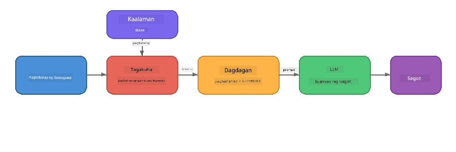

# Bahagi 4: Paggawa ng RAG na Aplikasyon gamit ang Foundry Local

## Pangkalahatang-ideya

Malalaking Modelong Pangwika ay makapangyarihan, ngunit nalalaman lamang nila ang nasa kanilang datos ng pagsasanay. Nilulutas ito ng **Retrieval-Augmented Generation (RAG)** sa pamamagitan ng pagbibigay sa modelo ng kaugnay na konteksto sa oras ng query - hango mula sa iyong sariling mga dokumento, database, o mga base ng kaalaman.

Sa lab na ito, gagawa ka ng kompletong RAG pipeline na tumatakbo **nang buo sa iyong aparato** gamit ang Foundry Local. Walang serbisyong cloud, walang vector database, walang embeddings API - lokal lamang na retrieval at lokal na modelo.

## Mga Layunin sa Pagkatuto

Pagkatapos ng lab na ito, magagawa mo nang:

- Ipaliwanag kung ano ang RAG at bakit ito mahalaga para sa mga aplikasyon ng AI
- Bumuo ng lokal na base ng kaalaman mula sa mga tekstong dokumento
- Ipatupad ang simpleng retrieval function upang makahanap ng kaugnay na konteksto
- Bumuo ng system prompt na naglalagay ng batayan ang modelo sa mga nakuha na datos
- Patakbuhin ang buong Retrieve → Augment → Generate pipeline sa aparato
- Maunawaan ang mga kalakasan at kahinaan ng simpleng keyword retrieval kumpara sa vector search

---

## Mga Kinakailangan

- Makumpleto ang [Bahagi 3: Paggamit ng Foundry Local SDK kasama ang OpenAI](part3-sdk-and-apis.md)
- Naka-install ang Foundry Local CLI at na-download ang `phi-3.5-mini` na modelo

---

## Konsepto: Ano ang RAG?

Kung walang RAG, makakasagot lang ang LLM mula sa datos ng pagsasanay nito - na maaaring lipas, hindi kumpleto, o kulang ang iyong pribadong impormasyon:

```
User: "What is Zava's return policy?"
LLM:  "I do not have information about Zava's return policy."  ← No context!
```

Sa RAG, **kinukuha** muna ang kaugnay na mga dokumento, saka **pinapalawak** ang prompt gamit ang kontekstong iyon bago **gumawa** ng tugon:



Ang mahalagang pananaw: **hindi kailangang "malaman" ng modelo ang sagot; kailangang mabasa lang nito ang tamang mga dokumento.**

---

## Mga Ehersisyo sa Lab

### Ehersisyo 1: Unawain ang Knowledge Base

Buksan ang RAG na halimbawa para sa iyong wika at suriin ang knowledge base:

<details>
<summary><b>🐍 Python: <code>python/foundry-local-rag.py</code></b></summary>

Ang knowledge base ay simpleng listahan ng mga diksyunaryo na may `title` at `content` na mga patlang:

```python
KNOWLEDGE_BASE = [
    {
        "title": "Foundry Local Overview",
        "content": (
            "Foundry Local brings the power of Azure AI Foundry to your local "
            "device without requiring an Azure subscription..."
        ),
    },
    {
        "title": "Supported Hardware",
        "content": (
            "Foundry Local automatically selects the best model variant for "
            "your hardware. If you have an Nvidia CUDA GPU it downloads the "
            "CUDA-optimized model..."
        ),
    },
    # ... higit pang mga entry
]
```

Ang bawat entry ay kumakatawan sa isang "chunk" ng kaalaman - isang nakasentro na piraso ng impormasyon tungkol sa isang paksa.

</details>

<details>
<summary><b>📘 JavaScript: <code>javascript/foundry-local-rag.mjs</code></b></summary>

Gumagamit ang knowledge base ng parehong istruktura bilang array ng mga object:

```javascript
const KNOWLEDGE_BASE = [
  {
    title: "Foundry Local Overview",
    content:
      "Foundry Local brings the power of Azure AI Foundry to your local " +
      "device without requiring an Azure subscription...",
  },
  {
    title: "Supported Hardware",
    content:
      "Foundry Local automatically selects the best model variant for " +
      "your hardware...",
  },
  // ... higit pang mga tala
];
```

</details>

<details>
<summary><b>💜 C#: <code>csharp/RagPipeline.cs</code></b></summary>

Gumagamit ang knowledge base ng listahan ng mga named tuples:

```csharp
private static readonly List<(string Title, string Content)> KnowledgeBase =
[
    ("Foundry Local Overview",
     "Foundry Local brings the power of Azure AI Foundry to your local " +
     "device without requiring an Azure subscription..."),

    ("Supported Hardware",
     "Foundry Local automatically selects the best model variant for " +
     "your hardware..."),

    // ... more entries
];
```

</details>

> **Sa totoong aplikasyon**, ang knowledge base ay nagmumula sa mga file sa disk, database, index sa paghahanap, o API. Sa lab na ito, gumagamit tayo ng in-memory list para maging simple.

---

### Ehersisyo 2: Unawain ang Retrieval Function

Hinahanap ng hakbang ng retrieval ang pinaka-kaugnay na mga chunk para sa tanong ng user. Ginagamit ng halimbawang ito ang **keyword overlap** - bibilangin kung ilang salita sa query ang lumalabas din sa bawat chunk:

<details>
<summary><b>🐍 Python</b></summary>

```python
def retrieve(query: str, top_k: int = 2) -> list[dict]:
    """Return the top-k knowledge chunks most relevant to the query."""
    query_words = set(query.lower().split())
    scored = []
    for chunk in KNOWLEDGE_BASE:
        chunk_words = set(chunk["content"].lower().split())
        overlap = len(query_words & chunk_words)
        scored.append((overlap, chunk))
    scored.sort(key=lambda x: x[0], reverse=True)
    return [item[1] for item in scored[:top_k]]
```

</details>

<details>
<summary><b>📘 JavaScript</b></summary>

```javascript
function retrieve(query, topK = 2) {
  const queryWords = new Set(query.toLowerCase().split(/\s+/));
  const scored = KNOWLEDGE_BASE.map((chunk) => {
    const chunkWords = new Set(chunk.content.toLowerCase().split(/\s+/));
    let overlap = 0;
    for (const w of queryWords) {
      if (chunkWords.has(w)) overlap++;
    }
    return { overlap, chunk };
  });
  scored.sort((a, b) => b.overlap - a.overlap);
  return scored.slice(0, topK).map((s) => s.chunk);
}
```

</details>

<details>
<summary><b>💜 C#</b></summary>

```csharp
private static List<(string Title, string Content)> Retrieve(string query, int topK = 2)
{
    var queryWords = new HashSet<string>(
        query.ToLowerInvariant().Split(' ', StringSplitOptions.RemoveEmptyEntries));

    return KnowledgeBase
        .Select(chunk =>
        {
            var chunkWords = new HashSet<string>(
                chunk.Content.ToLowerInvariant().Split(' ', StringSplitOptions.RemoveEmptyEntries));
            var overlap = queryWords.Intersect(chunkWords).Count();
            return (Overlap: overlap, Chunk: chunk);
        })
        .OrderByDescending(x => x.Overlap)
        .Take(topK)
        .Select(x => x.Chunk)
        .ToList();
}
```

</details>

**Paano ito gumagana:**
1. Hatiin ang query sa mga indibidwal na salita
2. Para sa bawat knowledge chunk, bilangin kung ilang salita sa query ang lumalabas dito
3. I-sort ayon sa score ng overlap (pinakamataas muna)
4. Ibalik ang top-k na pinaka-kaugnay na mga chunk

> **Palitan ng timbang:** Simple lang ang keyword overlap pero limitado; hindi nito naiintindihan ang mga kasingkahulugan o kahulugan. Karaniwang gumagamit ang mga produksyong RAG system ng **embedding vectors** at **vector database** para sa semantic search. Gayunpaman, mahusay na panimulang punto ang keyword overlap at hindi nangangailangan ng dagdag na dependencies.

---

### Ehersisyo 3: Unawain ang Augmented Prompt

Ini-inject ang nakuha na konteksto sa **system prompt** bago ito ipadala sa modelo:

```python
system_prompt = (
    "You are a helpful assistant. Answer the user's question using ONLY "
    "the information provided in the context below. If the context does "
    "not contain enough information, say so.\n\n"
    f"Context:\n{context_text}"
)
```

Mga susi sa disenyo:
- **"ONLY the information provided"** - pinipigilan ang modelo na mag-hallucinate ng mga katotohanang wala sa konteksto
- **"If the context does not contain enough information, say so"** - hinihikayat ang tapat na sagot na "Hindi ko alam"
- Nilalagay ang konteksto sa system message kaya hinuhubog nito ang lahat ng tugon

---

### Ehersisyo 4: Patakbuhin ang RAG Pipeline

Patakbuhin ang kompletong halimbawa:

**Python:**
```bash
cd python
python foundry-local-rag.py
```

**JavaScript:**
```bash
cd javascript
node foundry-local-rag.mjs
```

**C#:**
```bash
cd csharp
dotnet run rag
```

Makikita mo ang tatlong bagay na naka-print:
1. **Ang tanong** na itinatanong
2. **Ang nakuha na konteksto** - ang mga chunks na pinili mula sa knowledge base
3. **Ang sagot** - ginawang ng modelo gamit lamang ang kontekstong iyon

Halimbawang output:
```
Question: How do I install Foundry Local and what hardware does it support?

--- Retrieved Context ---
### Installation
On Windows install Foundry Local with: winget install Microsoft.FoundryLocal...

### Supported Hardware
Foundry Local automatically selects the best model variant for your hardware...
-------------------------

Answer: To install Foundry Local, you can use the following methods depending
on your operating system: On Windows, run `winget install Microsoft.FoundryLocal`.
On macOS, use `brew install microsoft/foundrylocal/foundrylocal`...
```

Pansinin kung paano ang sagot ng modelo ay **nakabatay** sa nakuha na konteksto - nabanggit nito ang mga katotohanan lamang mula sa mga dokumento ng knowledge base.

---

### Ehersisyo 5: Subukan at Palawakin

Subukan ang mga pagbabago na ito upang lalong maunawaan:

1. **Baguhin ang tanong** - itanong ang isang bagay na NASA knowledge base kumpara sa isang bagay na HINDI NASA knowledge base:
   ```python
   question = "What programming languages does Foundry Local support?"  # ← Sa konteksto
   question = "How much does Foundry Local cost?"                       # ← Hindi sa konteksto
   ```
   Nagsasabi ba ang modelo ng tama na "Hindi ko alam" kapag wala ang sagot sa konteksto?

2. **Magdagdag ng bagong knowledge chunk** - magdagdag ng bagong entry sa `KNOWLEDGE_BASE`:
   ```python
   {
       "title": "Pricing",
       "content": "Foundry Local is completely free and open source under the MIT license.",
   }
   ```
   Ulitin ang pagtatanong sa presyo.

3. **Baguhin ang `top_k`** - kumuha ng higit o kakaunti pang mga chunk:
   ```python
   context_chunks = retrieve(question, top_k=3)  # Mas maraming konteksto
   context_chunks = retrieve(question, top_k=1)  # Mas kaunting konteksto
   ```
   Paano naaapektuhan ng dami ng konteksto ang kalidad ng sagot?

4. **Alisin ang grounding instruction** - baguhin ang system prompt sa "You are a helpful assistant." at tingnan kung magsisimulang mag-hallucinate ng mga katotohanan ang modelo.

---

## Malalim na Pag-aaral: Pag-optimize ng RAG para sa On-Device Performance

Ang pagpapatakbo ng RAG sa aparato ay may mga limitasyon na wala sa cloud: limitadong RAM, walang dedikadong GPU (CPU/NPU execution), at maliit na context window ng modelo. Direktang tinutugunan ng mga desisyong disenyo sa ibaba ang mga limitasyong ito at batay sa mga pattern mula sa mga produksyong lokal na RAG na aplikasyon gamit ang Foundry Local.

### Estratehiya sa Chunking: Fixed-Size Sliding Window

Ang chunking - kung paano mo hahatiin ang mga dokumento sa mga bahagi - ay isa sa pinaka-mahalagang desisyon sa anumang RAG system. Para sa mga on-device na scenario, ang **fixed-size sliding window na may overlap** ang inirerekomendang panimulang punto:

| Parameter | Inirerekomendang Halaga | Bakit |
|-----------|-------------------------|-------|
| **Chunk size** | ~200 tokens | Pinapanatiling compact ang nakuha na konteksto, nag-iiwan ng puwang sa Phi-3.5 Mini na context window para sa system prompt, kasaysayan ng pag-uusap, at output na ginawa |
| **Overlap** | ~25 tokens (12.5%) | Pinipigilan ang pagkawala ng impormasyon sa boundary ng chunks - mahalaga para sa mga pamamaraan at hakbang-hakbang na tagubilin |
| **Tokenization** | Paghati sa whitespace | Walang dependencies, hindi kailangan ng tokenizer library. Lahat ng budget sa compute ay para sa LLM |

Gumagana ang overlap tulad ng sliding window: bawat bagong chunk ay nagsisimula 25 tokens bago matapos ang naunang chunk, kaya ang mga pangungusap na sumasaklaw sa chunk boundaries ay lumalabas sa parehong chunks.

> **Bakit hindi ibang mga estratehiya?**
> - **Sentence-based splitting** ay nagreresulta sa hindi pantay-pantay na laki ng chunks; may mga safety procedure na isang mahabang pangungusap kaya hindi ito maghihiwalay nang maganda
> - **Section-aware splitting** (sa mga pamagat na `##`) ay naglilikha ng malalaking pagkakaiba sa laki ng chunks - may mga masyadong maliit, may mga masyadong malaki para sa window ng modelo
> - **Semantic chunking** (embedding-based na pagtuklas ng paksa) ang pinakamaganda para sa kalidad ng retrieval, pero nangangailangan ng pangalawang modelo sa memorya kasabay ng Phi-3.5 Mini - delikado sa hardware na may 8-16 GB na shared memory

### Pagsulong ng Retrieval: TF-IDF Vector

Gumagana ang keyword overlap approach sa lab na ito, pero kung gusto mo ng mas mahusay na retrieval nang hindi nagdadagdag ng embedding model, **TF-IDF (Term Frequency-Inverse Document Frequency)** ay mahusay na gitnang opsyon:

```
Keyword Overlap  →  TF-IDF Vectors  →  Embedding Models
    (this lab)     (lightweight upgrade)   (production)
  Simple & fast    Better ranking,         Best quality,
  No dependencies  still no ML model       requires embedding model
  ~Basic matching  ~1ms retrieval          ~100-500ms per query
```

Kinokonvert ng TF-IDF ang bawat chunk sa numerikong vector batay sa kahalagahan ng bawat salita sa loob ng chunk *na kaugnay sa lahat ng chunks*. Sa query time, vine-vectorize din ang tanong ng ganitong paraan at inihahambing gamit ang cosine similarity. Maaari mong ipatupad ito gamit ang SQLite at purong JavaScript/Python - walang vector database, walang embedding API.

> **Performance:** Karaniwang nakakamit ng TF-IDF cosine similarity sa fixed-size chunks ang **~1ms retrieval**, kumpara sa ~100-500ms kapag embedding model ang nag-encode ng bawat query. Ang lahat ng 20+ na dokumento ay maaaring i-chunk at i-index sa loob ng isang segundo.

### Edge/Compact Mode para sa Limitadong Device

Kapag tumatakbo sa hardware na may mahigpit na limitasyon (matatandang laptop, tablet, mga field device), maaari mong bawasan ang paggamit ng resources sa pamamagitan ng pagtweake ng tatlong setting:

| Setting | Standard Mode | Edge/Compact Mode |
|---------|---------------|-------------------|
| **System prompt** | ~300 tokens | ~80 tokens |
| **Max output tokens** | 1024 | 512 |
| **Retrieved chunks (top-k)** | 5 | 3 |

Ang mas kakaunti retrieved chunks ay nangangahulugan ng mas kaunting konteksto para iproseso ng modelo, na nagpapababa ng latency at memory pressure. Ang mas maikling system prompt ay naglalaan ng mas maraming bahagi ng context window para sa aktwal na sagot. Sulit ang palitan na ito sa mga aparato kung saan mahalaga ang bawat token ng context window.

### Isang Modelo Lang sa Memorya

Isa sa pinakamahalagang prinsipyo para sa on-device RAG: **panatilihin lang ang isang modelo na naka-load**. Kung gumagamit ka ng embedding model para sa retrieval *at* language model para sa pagbuo, hinahati mo ang limitadong NPU/RAM resources sa dalawang modelo. Iniiwasan ito ng magaan na retrieval (keyword overlap, TF-IDF):

- Walang embedding model na nakikipagkumpetensiya sa LLM para sa memorya
- Mas mabilis ang cold start - isang modelo lang ang iloload
- Predictable ang paggamit ng memorya - lahat ng magagamit na resources ay para sa LLM
- Gumagana sa mga makina na may 8 GB RAM lang

### SQLite bilang Lokal na Vector Store

Para sa maliit hanggang katamtamang koleksyon ng dokumento (daang hanggang ilang libong chunks), **mabilis ang SQLite** para sa brute-force cosine similarity search at walang dagdag na infrastructure:

- Isang `.db` file lang sa disk - walang server process, walang configuration
- Kasama na sa bawat pangunahing wika na runtime (Python `sqlite3`, Node.js `better-sqlite3`, .NET `Microsoft.Data.Sqlite`)
- Nag-iimbak ng mga document chunk kasama ang kanilang TF-IDF vectors sa isang table
- Hindi kailangan ng Pinecone, Qdrant, Chroma, o FAISS sa ganitong scale

### Buod ng Performance

Pinagsasama ang mga desisyong disenyo para maghatid ng tumutugon na RAG sa hardware ng consumer:

| Sukatan | Performance On-Device |
|---------|----------------------|
| **Retrieval latency** | ~1ms (TF-IDF) hanggang ~5ms (keyword overlap) |
| **Bilis ng ingestion** | 20 dokumento na na-chunk at na-index sa <1 segundo |
| **Bilang ng modelo sa memorya** | 1 (LLM lang - walang embedding model) |
| **Storage overhead** | <1 MB para sa chunks + vectors sa SQLite |
| **Cold start** | Isang modelo lang ang iloload, walang embedding runtime startup |
| **Minimum hardware** | 8 GB RAM, CPU lang (walang GPU na kailangan) |

> **Kailan mag-upgrade:** Kapag lumaki ang koleksyon sa daan-daang mahahabang dokumento, halo-halong uri ng nilalaman (tables, code, prosa), o kailangan ng mas semantic na pag-unawa ng mga query, isaalang-alang ang pagdagdag ng embedding model at paglipat sa vector similarity search. Para sa karamihan ng mga on-device na gamit na may nakatuon na set ng dokumento, naghahatid ang TF-IDF + SQLite ng mahusay na resulta na may minimal na paggamit ng resources.

---

## Mga Pangunahing Konsepto

| Konsepto | Paglalarawan |
|----------|--------------|
| **Retrieval** | Paghahanap ng kaugnay na dokumento mula sa knowledge base batay sa query ng user |
| **Augmentation** | Pagsingit ng mga nakuha na dokumento sa prompt bilang konteksto |
| **Generation** | Gumagawa ang LLM ng sagot na nakabatay sa ibinigay na konteksto |
| **Chunking** | Paghahati ng malalaking dokumento sa mas maliit at nakatuon na bahagi |
| **Grounding** | Paghihigpit sa modelo na gamitin lamang ang ibinigay na konteksto (binabawasan ang hallucination) |
| **Top-k** | Ang bilang ng pinaka-kaugnay na chunks na kukunin |

---

## RAG sa Produksyon kumpara sa Lab na Ito

| Aspekto | Lab na Ito | On-Device na na-optimize | Produksyon sa Cloud |
|---------|------------|--------------------------|---------------------|
| **Knowledge base** | In-memory list | Mga file sa disk, SQLite | Database, search index |
| **Retrieval** | Keyword overlap | TF-IDF + cosine similarity | Vector embeddings + similarity search |
| **Embeddings** | Wala | Wala - TF-IDF vectors | Embedding model (lokal o cloud) |
| **Vector store** | Wala | SQLite (isang `.db` file) | FAISS, Chroma, Azure AI Search, atbp. |
| **Chunking** | Manual | Fixed-size sliding window (~200 tokens, 25-token overlap) | Semantic o recursive chunking |
| **Models sa memorya** | 1 (LLM) | 1 (LLM) | 2+ (embedding + LLM) |
| **Retrieval latency** | ~5ms | ~1ms | ~100-500ms |
| **Scale** | 5 documents | Hundreds of documents | Millions of documents |

Ang mga pattern na natutunan mo dito (retrieve, augment, generate) ay pareho sa anumang sukat. Ang paraan ng retrieval ay bumubuti, ngunit ang pangkalahatang arkitektura ay nananatiling pareho. Ipinapakita ng gitnang kolum kung ano ang nakakamit on-device gamit ang magagaan na mga teknika, na madalas na tamang-tama para sa lokal na mga aplikasyon kung saan pinapalitan mo ang cloud-scale para sa privacy, kakayahang offline, at zero latency sa mga external na serbisyo.

---

## Key Takeaways

| Concept | What You Learned |
|---------|------------------|
| RAG pattern | Retrieve + Augment + Generate: bigyan ang modelo ng tamang konteksto at makasasagot ito sa mga tanong tungkol sa iyong data |
| On-device | Lahat ay tumatakbo lokal na walang cloud APIs o mga subscription sa vector database |
| Grounding instructions | Kritikal ang mga system prompt constraints para maiwasan ang hallucination |
| Keyword overlap | Isang simpleng pero epektibong panimulang punto para sa retrieval |
| TF-IDF + SQLite | Isang magaan na upgrade path na nagpapanatili ng retrieval sa ilalim ng 1ms nang walang embedding model |
| One model in memory | Iwasang mag-load ng embedding model kasama ang LLM sa limitadong hardware |
| Chunk size | Mga humigit-kumulang 200 token na may overlap ang nagbabalanse ng retrieval precision at context window efficiency |
| Edge/compact mode | Gumamit ng mas kaunting chunks at mas maiikling prompts para sa mga sobrang limitadong device |
| Universal pattern | Ang parehong RAG na arkitektura ay gumagana para sa anumang pinanggagalingan ng data: mga dokumento, databases, APIs, o wikis |

> **Nais mo bang makita ang isang buong on-device RAG application?** Tingnan ang [Gas Field Local RAG](https://github.com/leestott/local-rag), isang production-style offline RAG agent na ginawa gamit ang Foundry Local at Phi-3.5 Mini na nagpapakita ng mga pattern ng optimisasyon gamit ang totoong set ng dokumento.

---

## Next Steps

Magpatuloy sa [Part 5: Building AI Agents](part5-single-agents.md) upang matutunan kung paano bumuo ng mga intelligent agents na may personas, mga tagubilin, at mga multi-turn na pag-uusap gamit ang Microsoft Agent Framework.

---

<!-- CO-OP TRANSLATOR DISCLAIMER START -->
**Pagtatanggol**:  
Ang dokumentong ito ay isinalin gamit ang AI translation service na [Co-op Translator](https://github.com/Azure/co-op-translator). Bagamat nagsusumikap kaming maging tumpak, pakatandaan na ang mga awtomatikong salin ay maaaring maglaman ng mga error o di-katumpakan. Ang orihinal na dokumento sa kanyang sariling wika ang dapat ituring na pinagmumulan ng katotohanan. Para sa mahahalagang impormasyon, inirerekomenda ang propesyonal na pagsasalin ng tao. Hindi kami mananagot sa anumang hindi pagkakaunawaan o maling interpretasyon na nagmumula sa paggamit ng salin na ito.
<!-- CO-OP TRANSLATOR DISCLAIMER END -->