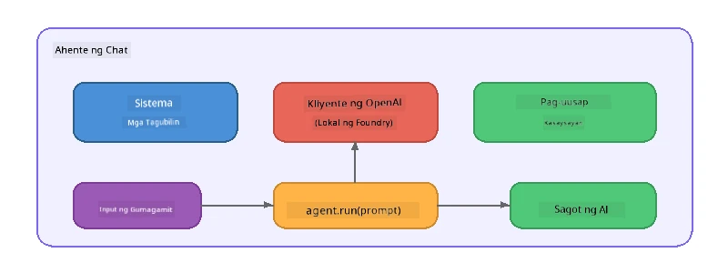

# Bahagi 5: Paggawa ng AI Agents gamit ang Agent Framework

> **Layunin:** Gumawa ng iyong unang AI agent na may permanenteng mga tagubilin at isang tinukoy na persona, pinapagana ng lokal na modelo sa pamamagitan ng Foundry Local.

## Ano ang AI Agent?

Isang AI agent ang nagpapabalot ng isang language model gamit ang **mga tagubilin ng sistema** na nagtatakda ng kanyang pag-uugali, personalidad, at mga limitasyon. Hindi tulad ng isang tawag sa chat completion, ang isang agent ay nagbibigay ng:

- **Persona** - isang pare-parehong pagkakakilanlan ("Ikaw ay isang kapaki-pakinabang na tagasuri ng code")
- **Memorya** - kasaysayan ng pag-uusap sa iba't ibang paglipas ng usapan
- **Specialisation** - nakatutok na pag-uugali na pinapatakbo ng maayos na ginawa na mga tagubilin



---

## Ang Microsoft Agent Framework

Ang **Microsoft Agent Framework** (AGF) ay nagbibigay ng isang standard na abstraction ng agent na gumagana sa iba't ibang model backends. Sa workshop na ito, pinapares natin ito sa Foundry Local upang ang lahat ay tumakbo sa iyong makina - walang cloud na kailangan.

| Konsepto | Paglalarawan |
|---------|-------------|
| `FoundryLocalClient` | Python: humahawak ng pagsisimula ng serbisyo, pag-download/pag-load ng modelo, at lumilikha ng mga agent |
| `client.as_agent()` | Python: lumilikha ng isang agent mula sa Foundry Local client |
| `AsAIAgent()` | C#: extension method sa `ChatClient` - lumilikha ng isang `AIAgent` |
| `instructions` | System prompt na humuhubog sa pag-uugali ng agent |
| `name` | Label na nababasa ng tao, kapaki-pakinabang sa multi-agent na mga sitwasyon |
| `agent.run(prompt)` / `RunAsync()` | Nagpapadala ng mensahe ng user at nagbabalik ng tugon ng agent |

> **Tandaan:** Ang Agent Framework ay may Python at .NET SDK. Para sa JavaScript, nag-implement kami ng magaan na `ChatAgent` class na sumusunod sa parehong pattern gamit ang OpenAI SDK nang direkta.

---

## Mga Ehersisyo

### Ehersisyo 1 - Unawain ang Agent Pattern

Bago magsulat ng code, pag-aralan ang mga pangunahing bahagi ng isang agent:

1. **Model client** - kumokonekta sa OpenAI-compatible API ng Foundry Local
2. **System instructions** - ang "personalidad" na prompt
3. **Run loop** - magpadala ng input mula sa user, tumanggap ng output

> **Pag-isipan:** Paano naiiba ang mga system instructions sa karaniwang mensahe ng user? Ano ang mangyayari kung babaguhin mo ito?

---

### Ehersisyo 2 - Patakbuhin ang Single-Agent Example

<details>
<summary><strong>🐍 Python</strong></summary>

**Mga Kinakailangan:**
```bash
cd python
python -m venv venv

# Windows (PowerShell):
venv\Scripts\Activate.ps1
# macOS:
source venv/bin/activate

pip install -r requirements.txt
```

**Patakbuhin:**
```bash
python foundry-local-with-agf.py
```

**Paliwanag ng Code** (`python/foundry-local-with-agf.py`):

```python
import asyncio
from agent_framework_foundry_local import FoundryLocalClient

async def main():
    alias = "phi-4-mini"

    # Pinamamahalaan ng FoundryLocalClient ang pagsisimula ng serbisyo, pag-download ng modelo, at paglo-load
    client = FoundryLocalClient(model_id=alias)
    print(f"Client Model ID: {client.model_id}")

    # Gumawa ng ahente gamit ang mga tagubilin ng sistema
    agent = client.as_agent(
        name="Joker",
        instructions="You are good at telling jokes.",
    )

    # Hindi streaming: kunin ang buong sagot nang sabay-sabay
    result = await agent.run("Tell me a joke about a pirate.")
    print(f"Agent: {result}")

    # Streaming: kunin ang mga resulta habang ginagawa
    async for chunk in agent.run("Tell me another joke.", stream=True):
        if chunk.text:
            print(chunk.text, end="", flush=True)

asyncio.run(main())
```

**Mga Pangunahing Punto:**
- `FoundryLocalClient(model_id=alias)` humahawak ng pagsisimula ng serbisyo, pag-download, at pag-load ng modelo sa isang hakbang
- `client.as_agent()` lumilikha ng isang agent na may system instructions at pangalan
- `agent.run()` sumusuporta sa parehong non-streaming at streaming na mga mode
- I-install gamit ang `pip install agent-framework-foundry-local --pre`

</details>

<details>
<summary><strong>📦 JavaScript</strong></summary>

**Mga Kinakailangan:**
```bash
cd javascript
npm install
```

**Patakbuhin:**
```bash
node foundry-local-with-agent.mjs
```

**Paliwanag ng Code** (`javascript/foundry-local-with-agent.mjs`):

```javascript
import { OpenAI } from "openai";
import { FoundryLocalManager } from "foundry-local-sdk";

class ChatAgent {
  constructor({ client, modelId, instructions, name }) {
    this.client = client;
    this.modelId = modelId;
    this.instructions = instructions;
    this.name = name;
    this.history = [];
  }

  async run(userMessage) {
    const messages = [
      { role: "system", content: this.instructions },
      ...this.history,
      { role: "user", content: userMessage },
    ];
    const response = await this.client.chat.completions.create({
      model: this.modelId,
      messages,
    });
    const assistantMessage = response.choices[0].message.content;

    // Panatilihin ang kasaysayan ng pag-uusap para sa mga multi-turn na interaksyon
    this.history.push({ role: "user", content: userMessage });
    this.history.push({ role: "assistant", content: assistantMessage });
    return { text: assistantMessage };
  }
}

async function main() {
  FoundryLocalManager.create({ appName: "FoundryLocalWorkshop" });
  const manager = FoundryLocalManager.instance;
  await manager.startWebService();

  const catalog = manager.catalog;
  const model = await catalog.getModel("phi-3.5-mini");
  if (!model.isCached) {
    console.log("Downloading model: phi-3.5-mini...");
    await model.download();
  }
  await model.load();

  const client = new OpenAI({
    baseURL: manager.urls[0] + "/v1",
    apiKey: "foundry-local",
  });

  const agent = new ChatAgent({
    client,
    modelId: model.id,
    instructions: "You are good at telling jokes.",
    name: "Joker",
  });

  const result = await agent.run("Tell me a joke about a pirate.");
  console.log(result.text);
}

main();
```

**Mga Pangunahing Punto:**
- Gumagawa ang JavaScript ng sarili nitong `ChatAgent` class na sumusunod sa Python AGF na pattern
- `this.history` nag-iimbak ng mga pag-ikot ng pag-uusap para sa suporta ng multi-turn
- Malinaw na `startWebService()` → tseke ng cache → `model.download()` → `model.load()` ay nagbibigay ng buong visibility

</details>

<details>
<summary><strong>💜 C#</strong></summary>

**Mga Kinakailangan:**
```bash
cd csharp
dotnet restore
```

**Patakbuhin:**
```bash
dotnet run agent
```

**Paliwanag ng Code** (`csharp/SingleAgent.cs`):

```csharp
using Microsoft.AI.Foundry.Local;
using Microsoft.Extensions.Logging.Abstractions;
using Microsoft.Agents.AI;
using OpenAI;
using System.ClientModel;

// 1. Start Foundry Local and load a model
var alias = "phi-3.5-mini";
await FoundryLocalManager.CreateAsync(
    new Configuration
    {
        AppName = "FoundryLocalSamples",
        Web = new Configuration.WebService { Urls = "http://127.0.0.1:0" }
    }, NullLogger.Instance, default);
var manager = FoundryLocalManager.Instance;
await manager.StartWebServiceAsync(default);

var catalog = await manager.GetCatalogAsync(default);
var model = await catalog.GetModelAsync(alias, default);

var isCached = await model.IsCachedAsync(default);
if (!isCached)
{
    Console.WriteLine($"Downloading model: {alias}...");
    await model.DownloadAsync(null, default);
}
await model.LoadAsync(default);

var key = new ApiKeyCredential("foundry-local");
var client = new OpenAIClient(key, new OpenAIClientOptions
{
    Endpoint = new Uri(manager.Urls[0] + "/v1")
});

// 2. Create an AIAgent using the Agent Framework extension method
AIAgent joker = client
    .GetChatClient(model.Id)
    .AsAIAgent(
        instructions: "You are good at telling jokes. Keep your jokes short and family-friendly.",
        name: "Joker"
    );

// 3. Run the agent (non-streaming)
var response = await joker.RunAsync("Tell me a joke about a pirate.");
Console.WriteLine($"Joker: {response}");

// 4. Run with streaming
await foreach (var update in joker.RunStreamingAsync("Tell me another joke."))
{
    Console.Write(update);
}
```

**Mga Pangunahing Punto:**
- `AsAIAgent()` ay extension method mula sa `Microsoft.Agents.AI.OpenAI` - walang kailangang custom na `ChatAgent` class
- `RunAsync()` ay nagbabalik ng buong tugon; `RunStreamingAsync()` ay nag-stream ng token kada token
- I-install gamit ang `dotnet add package Microsoft.Agents.AI.OpenAI --version 1.0.0-rc3`

</details>

---

### Ehersisyo 3 - Palitan ang Persona

Baguhin ang `instructions` ng agent upang gumawa ng ibang persona. Subukan ang bawat isa at obserbahan kung paano nagbabago ang output:

| Persona | Mga Tagubilin |
|---------|---------------|
| Code Reviewer | `"Ikaw ay isang eksperto sa pagsusuri ng code. Magbigay ng konstruktibong puna na nakatuon sa nabasang Madaling Basahin, pagganap, at katumpakan."` |
| Travel Guide | `"Ikaw ay isang palakaibigang gabay sa paglalakbay. Magbigay ng personalisadong rekomendasyon para sa mga destinasyon, aktibidad, at lokal na pagkain."` |
| Socratic Tutor | `"Ikaw ay isang Socratic tutor. Huwag magbigay ng direktang sagot - sa halip, gabayan ang estudyante gamit ang mga maingat na tanong."` |
| Technical Writer | `"Ikaw ay isang technical writer. Ipaliwanag ang mga konsepto nang malinaw at maikli. Gumamit ng mga halimbawa. Iwasan ang jargon."` |

**Subukan ito:**
1. Pumili ng persona mula sa talahanayan sa itaas
2. Palitan ang string ng `instructions` sa code
3. I-adjust ang prompt ng user upang umangkop (halimbawa ay suriin ng code reviewer ang isang function)
4. Patakbuhin muli ang halimbawa at ikumpara ang output

> **Tip:** Malaki ang epekto ng kalidad ng tagubilin sa kakayahan ng agent. Ang mga tiyak at maayos na istruktura na tagubilin ay nagbubunga ng mas mahusay na resulta kaysa sa malabo.

---

### Ehersisyo 4 - Magdagdag ng Multi-Turn na Pag-uusap

Palawakin ang halimbawa upang suportahan ang multi-turn chat loop upang magkaroon ka ng palitang pag-uusap sa agent.

<details>
<summary><strong>🐍 Python - multi-turn loop</strong></summary>

```python
import asyncio
from agent_framework_foundry_local import FoundryLocalClient

async def main():
    client = FoundryLocalClient(model_id="phi-4-mini")

    agent = client.as_agent(
        name="Assistant",
        instructions="You are a helpful assistant.",
    )

    print("Chat with the agent (type 'quit' to exit):\n")
    while True:
        user_input = input("You: ")
        if user_input.strip().lower() in ("quit", "exit"):
            break
        result = await agent.run(user_input)
        print(f"Agent: {result}\n")

asyncio.run(main())
```

</details>

<details>
<summary><strong>📦 JavaScript - multi-turn loop</strong></summary>

```javascript
import { OpenAI } from "openai";
import { FoundryLocalManager } from "foundry-local-sdk";
import * as readline from "node:readline/promises";

// (gamitin muli ang klase ng ChatAgent mula sa Ehersisyo 2)

async function main() {
  FoundryLocalManager.create({ appName: "FoundryLocalWorkshop" });
  const manager = FoundryLocalManager.instance;
  await manager.startWebService();

  const catalog = manager.catalog;
  const model = await catalog.getModel("phi-3.5-mini");
  if (!model.isCached) {
    console.log("Downloading model: phi-3.5-mini...");
    await model.download();
  }
  await model.load();

  const client = new OpenAI({
    baseURL: manager.urls[0] + "/v1",
    apiKey: "foundry-local",
  });

  const agent = new ChatAgent({
    client,
    modelId: model.id,
    instructions: "You are a helpful assistant.",
    name: "Assistant",
  });

  const rl = readline.createInterface({
    input: process.stdin,
    output: process.stdout,
  });

  console.log("Chat with the agent (type 'quit' to exit):\n");
  while (true) {
    const userInput = await rl.question("You: ");
    if (["quit", "exit"].includes(userInput.trim().toLowerCase())) break;
    const result = await agent.run(userInput);
    console.log(`Agent: ${result.text}\n`);
  }
  rl.close();
}

main();
```

</details>

<details>
<summary><strong>💜 C# - multi-turn loop</strong></summary>

```csharp
using Microsoft.AI.Foundry.Local;
using Microsoft.Extensions.Logging.Abstractions;
using Microsoft.Agents.AI;
using OpenAI;
using System.ClientModel;

var alias = "phi-3.5-mini";
var config = new Configuration
{
    AppName = "FoundryLocalSamples",
    Web = new Configuration.WebService { Urls = "http://127.0.0.1:0" }
};
await FoundryLocalManager.CreateAsync(config, NullLogger.Instance, default);
var manager = FoundryLocalManager.Instance;
await manager.StartWebServiceAsync(default);

var catalog = await manager.GetCatalogAsync(default);
var model = await catalog.GetModelAsync(alias, default);

var isCached = await model.IsCachedAsync(default);
if (!isCached)
{
    Console.WriteLine($"Downloading model: {alias}...");
    await model.DownloadAsync(null, default);
}
await model.LoadAsync(default);

var key = new ApiKeyCredential("foundry-local");
var client = new OpenAIClient(key, new OpenAIClientOptions
{
    Endpoint = new Uri(manager.Urls[0] + "/v1")
});

AIAgent agent = client
    .GetChatClient(model.Id)
    .AsAIAgent(
        instructions: "You are a helpful assistant.",
        name: "Assistant"
    );

Console.WriteLine("Chat with the agent (type 'quit' to exit):\n");
while (true)
{
    Console.Write("You: ");
    var userInput = Console.ReadLine();
    if (string.IsNullOrWhiteSpace(userInput) ||
        userInput.Equals("quit", StringComparison.OrdinalIgnoreCase) ||
        userInput.Equals("exit", StringComparison.OrdinalIgnoreCase))
        break;

    var result = await agent.RunAsync(userInput);
    Console.WriteLine($"Agent: {result}\n");
}
```

</details>

Pansinin kung paano naaalala ng agent ang mga naunang pag-ikot - magtanong ng follow-up na katanungan at makita ang konteksto na ipinagpapatuloy.

---

### Ehersisyo 5 - Istrakturang Output

Tagubilinan ang agent na laging tumugon sa isang partikular na format (halimbawa JSON) at i-parse ang resulta:

<details>
<summary><strong>🐍 Python - JSON output</strong></summary>

```python
import asyncio
import json
from agent_framework_foundry_local import FoundryLocalClient

async def main():
    client = FoundryLocalClient(model_id="phi-4-mini")

    agent = client.as_agent(
        name="SentimentAnalyzer",
        instructions=(
            "You are a sentiment analysis agent. "
            "For every user message, respond ONLY with valid JSON in this format: "
            '{"sentiment": "positive|negative|neutral", "confidence": 0.0-1.0, "summary": "brief reason"}'
        ),
    )

    result = await agent.run("I absolutely loved the new restaurant downtown!")
    print("Raw:", result)

    try:
        parsed = json.loads(str(result))
        print(f"Sentiment: {parsed['sentiment']} (confidence: {parsed['confidence']})")
    except json.JSONDecodeError:
        print("Agent did not return valid JSON - try refining the instructions.")

asyncio.run(main())
```

</details>

<details>
<summary><strong>💜 C# - JSON output</strong></summary>

```csharp
using System.Text.Json;

AIAgent analyzer = chatClient.AsAIAgent(
    name: "SentimentAnalyzer",
    instructions:
        "You are a sentiment analysis agent. " +
        "For every user message, respond ONLY with valid JSON in this format: " +
        "{\"sentiment\": \"positive|negative|neutral\", \"confidence\": 0.0-1.0, \"summary\": \"brief reason\"}"
);

var response = await analyzer.RunAsync("I absolutely loved the new restaurant downtown!");
Console.WriteLine($"Raw: {response}");

try
{
    var parsed = JsonSerializer.Deserialize<JsonElement>(response.ToString());
    Console.WriteLine($"Sentiment: {parsed.GetProperty("sentiment")} " +
                      $"(confidence: {parsed.GetProperty("confidence")})");
}
catch (JsonException)
{
    Console.WriteLine("Agent did not return valid JSON - try refining the instructions.");
}
```

</details>

> **Tandaan:** Ang maliliit na lokal na modelo ay maaaring hindi laging makagawa ng ganap na valid na JSON. Maaari mong pagbutihin ang pagiging mapagkakatiwalaan sa pamamagitan ng pagsama ng isang halimbawa sa mga tagubilin at maging napakalinaw tungkol sa inaasahang format.

---

## Mga Pangunahing Aral

| Konsepto | Ano ang Iyong Natutunan |
|---------|------------------------|
| Agent vs. raw LLM call | Ang agent ay nagpapabalot ng modelo gamit ang mga tagubilin at memorya |
| System instructions | Ang pinakamahalagang paraan sa pagkontrol ng pag-uugali ng agent |
| Multi-turn conversation | Ang mga agent ay maaaring magdala ng konteksto sa maraming pakikipag-ugnayan ng user |
| Structured output | Maaaring ipatupad ng mga tagubilin ang format ng output (JSON, markdown, atbp.) |
| Local execution | Lahat ay tumatakbo sa device gamit ang Foundry Local - walang cloud na kailangan |

---

## Mga Susunod na Hakbang

Sa **[Bahagi 6: Multi-Agent Workflows](part6-multi-agent-workflows.md)**, pagsasamahin mo ang maraming agent sa isang koordinadong pipeline kung saan bawat agent ay may espesyalisadong papel.

---

<!-- CO-OP TRANSLATOR DISCLAIMER START -->
**Paunawa**:  
Ang dokumentong ito ay isinalin gamit ang AI translation service na [Co-op Translator](https://github.com/Azure/co-op-translator). Bagamat nagsusumikap kami para sa katumpakan, pakitandaan na ang mga awtomatikong salin ay maaaring maglaman ng mga pagkakamali o hindi pagkakatumpak. Ang orihinal na dokumento sa kanyang sariling wika ang dapat ituring na opisyal na sanggunian. Para sa mahahalagang impormasyon, inirerekomenda ang propesyonal na pagsasaling-tao. Hindi kami mananagot sa anumang hindi pagkakaunawaan o maling pagkakaintindi na maaaring magmula sa paggamit ng salin na ito.
<!-- CO-OP TRANSLATOR DISCLAIMER END -->