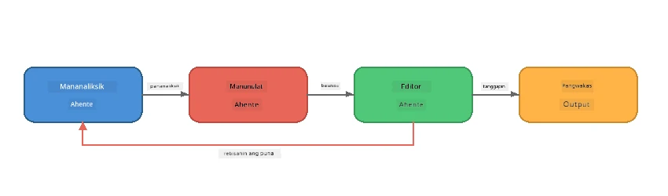
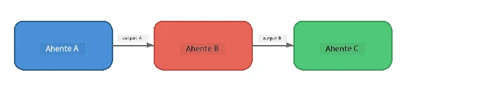
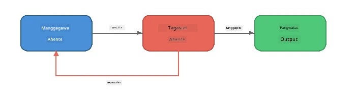
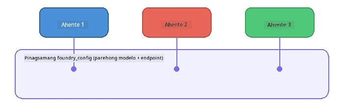

# Bahagi 6: Multi-Agent Workflows

> **Layunin:** Pagsamahin ang maraming espesyalistang ahente sa magkakaugnay na mga pipeline na naghahati ng kumplikadong mga gawain sa mga nagkakatuwang ahente - lahat ay tumatakbo nang lokal gamit ang Foundry Local.

## Bakit Multi-Agent?

Isang ahente lang ang kayang humawak ng maraming gawain, ngunit ang mga kumplikadong workflow ay nakikinabang sa **Espesyalisasyon**. Sa halip na isang ahente ang sumusubok mag-research, magsulat, at mag-edit nang sabay-sabay, hinahati mo ang trabaho sa mga nakatuong papel:



| Pattern | Paglalarawan |
|---------|--------------|
| **Sunod-sunod** | Ang output ng Agent A ay ginagamit ng Agent B → Agent C |
| **Feedback loop** | Isang evaluator agent ang maaaring magbalik ng trabaho para baguhin |
| **Pinagsamang konteksto** | Lahat ng ahente ay gumagamit ng iisang modelo/endpoint, pero may iba't ibang mga tagubilin |
| **Typed output** | Ang mga ahente ay gumagawa ng istrukturadong resulta (JSON) para sa maaasahang pagpapasa |

---

## Mga Pagsasanay

### Pagsasanay 1 - Patakbuhin ang Multi-Agent Pipeline

Kasama sa workshop ang kumpletong Researcher → Writer → Editor workflow.

<details>
<summary><strong>🐍 Python</strong></summary>

**Setup:**
```bash
cd python
python -m venv venv

# Windows (PowerShell):
venv\Scripts\Activate.ps1
# macOS:
source venv/bin/activate

pip install -r requirements.txt
```

**Patakbuhin:**
```bash
python foundry-local-multi-agent.py
```

**Ano ang nangyayari:**
1. **Researcher** ay tumatanggap ng paksa at nagbabalik ng mga bullet-point na impormasyon
2. **Writer** ay kumukuha ng research at gumagawa ng draft ng blog post (3-4 na talata)
3. **Editor** ay nire-review ang artikulo para sa kalidad at nagbabalik ng TANGGAP o BAGUHIN

</details>

<details>
<summary><strong>📦 JavaScript</strong></summary>

**Setup:**
```bash
cd javascript
npm install
```

**Patakbuhin:**
```bash
node foundry-local-multi-agent.mjs
```

**Parehong tatlong-yugto na pipeline** - Researcher → Writer → Editor.

</details>

<details>
<summary><strong>💜 C#</strong></summary>

**Setup:**
```bash
cd csharp
dotnet restore
```

**Patakbuhin:**
```bash
dotnet run multi
```

**Parehong tatlong-yugto na pipeline** - Researcher → Writer → Editor.

</details>

---

### Pagsasanay 2 - Anatomiya ng Pipeline

Pag-aralan kung paano dinepina at kinokonekta ang mga ahente:

**1. Pinagsamang model client**

Lahat ng ahente ay gumagamit ng iisang Foundry Local na modelo:

```python
# Python - Pinangangasiwaan ng FoundryLocalClient ang lahat
from agent_framework_foundry_local import FoundryLocalClient

client = FoundryLocalClient(model_id="phi-3.5-mini")
```

```javascript
// JavaScript - OpenAI SDK na naka-turo sa Foundry Local
const client = new OpenAI({
  baseURL: manager.urls[0] + "/v1",
  apiKey: "foundry-local",
});
```

```csharp
// C# - OpenAIClient pointed at Foundry Local
var key = new ApiKeyCredential("foundry-local");
var client = new OpenAIClient(key, new OpenAIClientOptions
{
    Endpoint = new Uri(manager.Urls[0] + "/v1")
});
var chatClient = client.GetChatClient(model.Id);
```

**2. Espesyalisadong mga tagubilin**

Bawat ahente ay may natatanging persona:

| Ahente | Mga Tagubilin (buod) |
|--------|-----------------------|
| Researcher | "Magbigay ng mahahalagang katotohanan, estadistika, at background. I-organisa bilang mga bullet points." |
| Writer | "Sumulat ng kapana-panabik na blog post (3-4 na talata) mula sa mga tala sa pananaliksik. Huwag mag-imbento ng mga katotohanan." |
| Editor | "Suriin para sa kalinawan, gramatika, at pisikal na katumpakan. Pasya: TANGGAP o BAGUHIN." |

**3. Daloy ng datos sa pagitan ng mga ahente**

```python
# Hakbang 1 - ang output mula sa mananaliksik ay nagiging input sa manunulat
research_result = await researcher.run(f"Research: {topic}")

# Hakbang 2 - ang output mula sa manunulat ay nagiging input sa editor
writer_result = await writer.run(f"Write using:\n{research_result}")

# Hakbang 3 - nire-review ng editor ang parehong pananaliksik at artikulo
editor_result = await editor.run(
    f"Research:\n{research_result}\n\nArticle:\n{writer_result}"
)
```

```csharp
// C# - same pattern, async calls with AIAgent
var researchNotes = await researcher.RunAsync(
    $"Research the following topic and provide key facts:\n{topic}");

var draft = await writer.RunAsync(
    $"Write a blog post based on these research notes:\n\n{researchNotes}");

var verdict = await editor.RunAsync(
    $"Review this article for quality and accuracy.\n\n" +
    $"Research notes:\n{researchNotes}\n\n" +
    $"Article:\n{draft}");
```

> **Pangunahing pananaw:** Bawat ahente ay tumatanggap ng pinagsamang konteksto mula sa mga naunang ahente. Nakikita ng editor ang parehong orihinal na pananaliksik at draft - ito ay nagpapahintulot upang suriin ang pagiging totoo.

---

### Pagsasanay 3 - Magdagdag ng Ika-Apat na Ahente

Palawakin ang pipeline sa pamamagitan ng pagdagdag ng bagong ahente. Pumili ng isa:

| Ahente | Layunin | Mga Tagubilin |
|--------|---------|---------------|
| **Fact-Checker** | Suriin ang mga pahayag sa artikulo | `"Sinusuri mo ang mga katotohanang pahayag. Para sa bawat pahayag, ipahayag kung ito ay suportado ng mga tala sa pananaliksik. Magbalik ng JSON na may napatunayan/hindi napatunayang mga item."` |
| **Headline Writer** | Gumawa ng mga catchy na pamagat | `"Gumawa ng 5 opsyon sa headline para sa artikulo. Baguhin ang estilo: impormatibo, clickbait, tanong, listicle, emosyonal."` |
| **Social Media** | Gumawa ng mga promotional posts | `"Gumawa ng 3 social media posts para i-promote ang artikulong ito: isa para sa Twitter (280 na karakter), isa para sa LinkedIn (propesyonal na tono), isa para sa Instagram (kaswal na may mga mungkahi ng emoji)."` |

<details>
<summary><strong>🐍 Python - pagdagdag ng Headline Writer</strong></summary>

```python
headline_agent = client.as_agent(
    name="HeadlineWriter",
    instructions=(
        "You are a headline specialist. Given an article, generate exactly "
        "5 headline options. Vary the style: informative, question-based, "
        "listicle, emotional, and provocative. Return them as a numbered list."
    ),
)

# Pagkatapos tanggapin ng editor, gumawa ng mga ulo ng balita
headline_result = await headline_agent.run(
    f"Generate headlines for this article:\n\n{writer_result}"
)
print(f"\n--- Headlines ---\n{headline_result}")
```

</details>

<details>
<summary><strong>📦 JavaScript - pagdagdag ng Headline Writer</strong></summary>

```javascript
const headlineAgent = new ChatAgent({
  client,
  modelId: modelInfo.id,
  instructions:
    "You are a headline specialist. Given an article, generate exactly " +
    "5 headline options. Vary the style: informative, question-based, " +
    "listicle, emotional, and provocative. Return them as a numbered list.",
  name: "HeadlineWriter",
});

const headlineResult = await headlineAgent.run(
  `Generate headlines for this article:\n\n${writerResult.text}`
);
console.log(`\n--- Headlines ---\n${headlineResult.text}`);
```

</details>

<details>
<summary><strong>💜 C# - pagdagdag ng Headline Writer</strong></summary>

```csharp
AIAgent headlineAgent = chatClient.AsAIAgent(
    name: "HeadlineWriter",
    instructions:
        "You are a headline specialist. Given an article, generate exactly " +
        "5 headline options. Vary the style: informative, question-based, " +
        "listicle, emotional, and provocative. Return them as a numbered list."
);

// After the editor accepts, generate headlines
var headlines = await headlineAgent.RunAsync(
    $"Generate headlines for this article:\n\n{draft}");
Console.WriteLine($"\n--- Headlines ---\n{headlines}");
```

</details>

---

### Pagsasanay 4 - Disenyo ng Sariling Workflow

Disenyuhin ang multi-agent pipeline para sa ibang larangan. Narito ang ilang ideya:

| Larangan | Mga Ahente | Daloy |
|----------|------------|-------|
| **Code Review** | Analyser → Reviewer → Summariser | Suriin ang istruktura ng code → suriin para sa mga isyu → gumawa ng ulat buod |
| **Customer Support** | Classifier → Responder → QA | Uriin ang ticket → gumawa ng draft ng sagot → suriin ang kalidad |
| **Edukasyon** | Quiz Maker → Student Simulator → Grader | Gumawa ng quiz → simulahin ang mga sagot → bigyan ng grado at ipaliwanag |
| **Data Analysis** | Interpreter → Analyst → Reporter | I-interpret ang kahilingan ng datos → suriin ang mga pattern → sumulat ng ulat |

**Mga Hakbang:**
1. Tukuyin ang 3+ ahente na may natatanging `instructions`
2. Pumili ng daloy ng datos - ano ang tinatanggap at gawa ng bawat ahente?
3. Ipatupad ang pipeline gamit ang mga pattern mula sa Mga Pagsasanay 1-3
4. Magdagdag ng feedback loop kung may isang ahenteng susuri sa trabaho ng iba

---

## Mga Orchestration Patterns

Narito ang mga pattern ng orchestration na naaangkop sa anumang multi-agent system (pinag-aaralan nang malalim sa [Bahagi 7](part7-zava-creative-writer.md)):

### Sunod-sunod na Pipeline



Bawat ahente ay pinoproseso ang output ng naunang ahente. Simple at predictable.

### Feedback Loop



Isang evaluator agent ay maaaring mag-trigger ng muling pagpapatakbo ng mas maagang yugto. Ginagamit ito ng Zava Writer: maaring magpadala ng feedback ang editor pabalik sa researcher at writer.

### Pinagsamang Konteksto



Lahat ng ahente ay gumagamit ng iisang `foundry_config` kaya pareho ang modelo at endpoint.

---

## Mga Pangunahing Punto

| Konsepto | Iyong Natutunan |
|----------|-----------------|
| Espesyalisasyon ng Ahente | Bawat ahente ay mahusay sa isang gawain gamit ang mga nakatuong tagubilin |
| Pagpapasa ng Datos | Ang output mula sa isang ahente ay nagiging input sa susunod |
| Feedback loops | Isang evaluator ay maaaring mag-trigger ng mga ulitin para sa mas mataas na kalidad |
| Istrakturadong output | Ang mga response na naka-JSON format ay nagbibigay ng maaasahang komunikasyon ng ahente sa ahente |
| Orkestrasyon | Isang coordinator ang namamahala sa pagkakasunod-sunod ng pipeline at paghawak ng error |
| Mga pattern sa produksyon | Ginamit sa [Bahagi 7: Zava Creative Writer](part7-zava-creative-writer.md) |

---

## Susunod na Hakbang

Magpatuloy sa [Bahagi 7: Zava Creative Writer - Capstone Application](part7-zava-creative-writer.md) upang tuklasin ang isang production-style na multi-agent app na may 4 na espesyalistang ahente, streaming output, paghahanap ng produkto, at feedback loops - magagamit sa Python, JavaScript, at C#.

---

<!-- CO-OP TRANSLATOR DISCLAIMER START -->
**Paunawa**:
Ang dokumentong ito ay isinalin gamit ang serbisyong AI na pagsasalin na [Co-op Translator](https://github.com/Azure/co-op-translator). Bagamat nagsusumikap kami para sa kawastuhan, mangyaring tandaan na ang mga awtomatikong pagsasalin ay maaaring maglaman ng mga pagkakamali o kamalian. Ang orihinal na dokumento sa kanyang likas na wika ang dapat ituring na pangunahing sanggunian. Para sa mahahalagang impormasyon, inirerekomenda ang propesyonal na pagsasaling pang-tao. Hindi kami mananagot sa anumang hindi pagkakaunawaan o maling interpretasyon na nagmumula sa paggamit ng pagsasaling ito.
<!-- CO-OP TRANSLATOR DISCLAIMER END -->