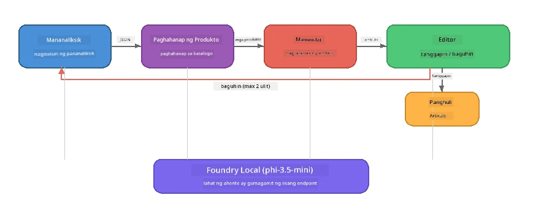

# Bahagi 7: Zava Creative Writer - Capstone Application

> **Layunin:** Tuklasin ang isang production-style na multi-agent na aplikasyon kung saan apat na espesyal na ahente ang nagtutulungan upang makagawa ng mga artikulo na may kalidad ng magasin para sa Zava Retail DIY - na tumatakbo nang buo sa iyong aparato gamit ang Foundry Local.

Ito ang **capstone lab** ng workshop. Pinagsasama nito ang lahat ng iyong natutunan - SDK integration (Bahagi 3), retrieval mula sa lokal na datos (Bahagi 4), agent personas (Bahagi 5), at multi-agent orchestration (Bahagi 6) - sa isang kumpletong aplikasyon na available sa **Python**, **JavaScript**, at **C#**.

---

## Ano ang Iyong Malalaman

| Konsepto | Saan sa Zava Writer |
|---------|----------------------------|
| 4-step model loading | Shared config module nagbo-boostrap ng Foundry Local |
| RAG-style retrieval | Product agent naghahanap sa lokal na katalogo |
| Agent Specialisation | 4 agents na may magkakaibang system prompts |
| Streaming output | Writer naglalabas ng tokens nang real-time |
| Structured hand-offs | Researcher → JSON, Editor → JSON decision |
| Feedback loops | Editor maaaring mag-trigger ng muling pagsubok (max 2 retries) |

---

## Arkitektura

Gumagamit ang Zava Creative Writer ng **sequential pipeline na may evaluator-driven feedback**. Parehong arkitektura ang sinusunod ng tatlong implementasyon ng wika:



### Ang Apat na Ahente

| Ahente | Input | Output | Layunin |
|-------|-------|--------|---------|
| **Researcher** | Paksa + opsyonal na feedback | `{"web": [{url, name, description}, ...]}` | Nangongolekta ng panimulang pananaliksik gamit ang LLM |
| **Product Search** | Product context string | Listahan ng tumutugmang mga produkto | Mga query na ginawa ng LLM + keyword search laban sa lokal na katalogo |
| **Writer** | Pananaliksik + mga produkto + assignment + feedback | Streaming na teksto ng artikulo (hatiin sa `---`) | Gumagawa ng draft ng magasin-kalidad na artikulo nang real time |
| **Editor** | Artikulo + sariling feedback ng writer | `{"decision": "accept/revise", "editorFeedback": "...", "researchFeedback": "..."}` | Sinusuri ang kalidad, nagti-trigger ng retry kung kailangan |

### Daloy ng Pipeline

1. Tinatanggap ng **Researcher** ang paksa at lumilikha ng istrukturadong tala ng pananaliksik (JSON)
2. Kinukuha ng **Product Search** ang lokal na katalogo ng produkto gamit ang mga query na ginawa ng LLM
3. Pinagsasama ng **Writer** ang pananaliksik + mga produkto + assignment sa isang streaming na artikulo, nagsisingit ng sariling feedback pagkatapos ng `---` separator
4. Sinusuri ng **Editor** ang artikulo at nagbabalik ng JSON na desisyon:
   - `"accept"` → natatapos ang pipeline
   - `"revise"` → ipinapadala ang feedback pabalik sa Researcher at Writer (max 2 retries)

---

## Mga Kinakailangan

- Kumpletuhin ang [Part 6: Multi-Agent Workflows](part6-multi-agent-workflows.md)
- Naka-install ang Foundry Local CLI at na-download ang `phi-3.5-mini` model

---

## Mga Ehersisyo

### Ehersisyo 1 - Patakbuhin ang Zava Creative Writer

Pumili ng iyong wika at patakbuhin ang aplikasyon:

<details>
<summary><strong>🐍 Python - FastAPI Web Service</strong></summary>

Ang bersyon sa Python ay tumatakbo bilang isang **web service** na may REST API, nagpapakita kung paano bumuo ng production backend.

**Setup:**
```bash
cd zava-creative-writer-local/src/api
python -m venv venv

# Windows (PowerShell):
venv\Scripts\Activate.ps1
# macOS:
source venv/bin/activate

pip install -r requirements.txt
```

**Patakbuhin:**
```bash
uvicorn main:app --reload
```

**Subukan ito:**
```bash
curl -X POST http://localhost:8000/api/article \
  -H "Content-Type: application/json" \
  -d '{
    "research": "DIY home improvement trends",
    "products": "power tools and paints",
    "assignment": "Write an article about weekend renovation projects for DIY enthusiasts"
  }'
```

Ang tugon ay nag-stream pabalik bilang mga newline-delimited na JSON na mensahe na nagpapakita ng progreso ng bawat ahente.

</details>

<details>
<summary><strong>📦 JavaScript - Node.js CLI</strong></summary>

Ang bersyon sa JavaScript ay tumatakbo bilang isang **CLI application**, nagpaprinta ng progreso ng ahente at ang artikulo nang diretso sa console.

**Setup:**
```bash
cd zava-creative-writer-local/src/javascript
npm install
```

**Patakbuhin:**
```bash
node main.mjs
```

Makikita mo:
1. Pag-load ng Foundry Local model (may progress bar kung nagda-download)
2. Bawat agent na nagpapatupad nang sunod-sunod na may status messages
3. Ang artikulo na na-stream sa console nang real time
4. Ang desisyon ng editor na accept/revise

</details>

<details>
<summary><strong>💜 C# - .NET Console App</strong></summary>

Ang bersyon sa C# ay tumatakbo bilang isang **.NET console application** na may parehong pipeline at streaming output.

**Setup:**
```bash
cd zava-creative-writer-local/src/csharp
dotnet restore
```

**Patakbuhin:**
```bash
dotnet run
```

Parehong pattern ng output tulad ng sa JavaScript – mga status messages ng agent, streaming ng artikulo, at desisyon ng editor.

</details>

---

### Ehersisyo 2 - Pag-aralan ang Estruktura ng Code

Parehong lohikal na bahagi ang bawat implementasyon sa bawat wika. Ihambing ang mga estruktura:

**Python** (`src/api/`):
| File | Layunin |
|------|---------|
| `foundry_config.py` | Shared Foundry Local manager, model, at client (4-step init) |
| `orchestrator.py` | Pag-coordinate ng pipeline na may feedback loop |
| `main.py` | FastAPI endpoints (`POST /api/article`) |
| `agents/researcher/researcher.py` | Pananaliksik gamit ang LLM na may JSON output |
| `agents/product/product.py` | Mga query na ginawa ng LLM + keyword search |
| `agents/writer/writer.py` | Streaming na pagbuo ng artikulo |
| `agents/editor/editor.py` | JSON-based na accept/revise decision |

**JavaScript** (`src/javascript/`):
| File | Layunin |
|------|---------|
| `foundryConfig.mjs` | Shared Foundry Local config (4-step init na may progress bar) |
| `main.mjs` | Orchestrator + CLI entry point |
| `researcher.mjs` | Research agent gamit ang LLM |
| `product.mjs` | Pagbuo ng LLM query + keyword search |
| `writer.mjs` | Streaming na pagbuo ng artikulo (async generator) |
| `editor.mjs` | Desisyon na JSON accept/revise |
| `products.mjs` | Datos ng katalogo ng produkto |

**C#** (`src/csharp/`):
| File | Layunin |
|------|---------|
| `Program.cs` | Kumpletong pipeline: pag-load ng modelo, mga ahente, orchestrator, feedback loop |
| `ZavaCreativeWriter.csproj` | .NET 9 project na may Foundry Local + OpenAI packages |

> **Nota sa disenyo:** Pinaghihiwalay ng Python ang bawat ahente sa sariling file/directory (maganda para sa mas malalaking koponan). Ginagamit ng JavaScript ang isang module bawat ahente (maganda para sa medium na proyekto). Itinatago ng C# ang lahat sa isang file na may mga local functions (maganda para sa self-contained na mga halimbawa). Sa produksyon, piliin ang pattern na naaayon sa konbensiyon ng iyong koponan.

---

### Ehersisyo 3 - Sundan ang Shared Configuration

Ang bawat ahente sa pipeline ay gumagamit ng isang iisang Foundry Local model client. Aralin kung paano ito naayos sa bawat wika:

<details>
<summary><strong>🐍 Python - foundry_config.py</strong></summary>

```python
from foundry_local import FoundryLocalManager

MODEL_ALIAS = "phi-3.5-mini"

# Hakbang 1: Gumawa ng manager at simulan ang Foundry Local na serbisyo
manager = FoundryLocalManager()
manager.start_service()

# Hakbang 2: Tingnan kung ang modelo ay na-download na
cached = manager.list_cached_models()
catalog_info = manager.get_model_info(MODEL_ALIAS)
is_cached = any(m.id == catalog_info.id for m in cached) if catalog_info else False

if not is_cached:
    manager.download_model(MODEL_ALIAS)

# Hakbang 3: I-load ang modelo sa memorya
manager.load_model(MODEL_ALIAS)
model_id = manager.get_model_info(MODEL_ALIAS).id

# Shared OpenAI client
client = openai.OpenAI(base_url=manager.endpoint, api_key=manager.api_key)
```

Lahat ng ahente ay nag-iimport ng `from foundry_config import client, model_id`.

</details>

<details>
<summary><strong>📦 JavaScript - foundryConfig.mjs</strong></summary>

```javascript
import { FoundryLocalManager } from "foundry-local-sdk";
import { OpenAI } from "openai";

FoundryLocalManager.create({ appName: "ZavaCreativeWriter" });
const manager = FoundryLocalManager.instance;
await manager.startWebService();

// Suriin ang cache → i-download → i-load (bagong pattern ng SDK)
const catalog = manager.catalog;
const model = await catalog.getModel(MODEL_ALIAS);
if (!model.isCached) {
  console.log(`Downloading model: ${MODEL_ALIAS}...`);
  await model.download();
}
await model.load();

const client = new OpenAI({ baseURL: manager.urls[0] + "/v1", apiKey: "foundry-local" });
const modelId = model.id;
export { client, modelId };
```

Lahat ng ahente ay nag-iimport ng `{ client, modelId } from "./foundryConfig.mjs"`.

</details>

<details>
<summary><strong>💜 C# - sa itaas ng Program.cs</strong></summary>

```csharp
await FoundryLocalManager.CreateAsync(
    new Configuration
    {
        AppName = "ZavaCreativeWriter",
        Web = new Configuration.WebService { Urls = "http://127.0.0.1:0" }
    }, NullLogger.Instance, default);
var manager = FoundryLocalManager.Instance;
await manager.StartWebServiceAsync(default);

var catalog = await manager.GetCatalogAsync(default);
var catalogModel = await catalog.GetModelAsync(alias, default);
var isCached = await catalogModel.IsCachedAsync(default);
if (!isCached)
    await catalogModel.DownloadAsync(null, default);

await catalogModel.LoadAsync(default);
var key = new ApiKeyCredential("foundry-local");
var chatClient = new OpenAIClient(key, new OpenAIClientOptions
{
    Endpoint = new Uri(manager.Urls[0] + "/v1")
}).GetChatClient(catalogModel.Id);
```

Ang `chatClient` ay ipinapasa sa lahat ng functions ng ahente sa parehong file.

</details>

> **Tampok na pattern:** Ang modelo ng pag-load (start service → check cache → download → load) ay nagbibigay-daan para makita ng user nang malinaw ang progreso at tanging isang beses lamang mada-download ang modelo. Ito ay best practice para sa anumang Foundry Local na aplikasyon.

---

### Ehersisyo 4 - Unawain ang Feedback Loop

Ang feedback loop ang nagpapatalino sa pipeline na ito - maaaring ibalik ng Editor ang trabaho para baguhin. Sundan ang lohika:

```
Orchestrator:
  1. researcher.research(topic, "No Feedback")    ← first pass
  2. product.findProducts(productContext)
  3. writer.write(research, products, assignment)  ← streams article
  4. Split article at "---" → article + writerFeedback
  5. editor.edit(article, writerFeedback)

  WHILE editor says "revise" AND retryCount < 2:
    6. researcher.research(topic, editor.researchFeedback)  ← refined
    7. writer.write(research, products, editor.editorFeedback)
    8. editor.edit(newArticle, newWriterFeedback)
    9. retryCount++
```

**Mga tanong na pag-isipan:**
- Bakit naka-set ang retry limit sa 2? Ano ang mangyayari kung tataasan mo ito?
- Bakit nakukuha ng researcher ang `researchFeedback` habang ang writer ay ang `editorFeedback`?
- Ano ang mangyayari kung lagi lang "revise" ang sabihin ng editor?

---

### Ehersisyo 5 - Baguhin ang Isang Ahente

Subukang baguhin ang gawi ng isang ahente at obserbahan kung paano nito naaapektuhan ang pipeline:

| Pagbabago | Ano ang babaguhin |
|-----------|-------------------|
| **Mas mahigpit na editor** | Palitan ang system prompt ng editor upang palaging humiling ng kahit isang rebisyon |
| **Mas mahahabang artikulo** | Palitan ang prompt ng writer mula "800-1000 words" sa "1500-2000 words" |
| **Ibang mga produkto** | Magdagdag o magbago ng mga produkto sa katalogo ng produkto |
| **Bagong paksa ng pananaliksik** | Palitan ang default na `researchContext` sa ibang paksa |
| **Researcher na JSON lamang** | Gawing bumalik ng researcher ang 10 item sa halip na 3-5 |

> **Tip:** Dahil pareho ang arkitektura sa lahat ng tatlong wika, maaari mong gawin ang parehong pagbabago sa wikang pinaka-komportable ka.

---

### Ehersisyo 6 - Magdagdag ng Ika-limang Ahente

Palawakin ang pipeline gamit ang bagong ahente. Ilan sa mga ideya:

| Ahente | Saan sa pipeline | Layunin |
|--------|------------------|---------|
| **Fact-Checker** | Pagkatapos ng Writer, bago ang Editor | Suriin ang mga pahayag laban sa datos ng pananaliksik |
| **SEO Optimiser** | Pagkatapos tanggapin ng Editor | Magdagdag ng meta description, keywords, slug |
| **Illustrator** | Pagkatapos tanggapin ng Editor | Gumawa ng mga image prompts para sa artikulo |
| **Translator** | Pagkatapos tanggapin ng Editor | Isalin ang artikulo sa ibang wika |

**Mga Hakbang:**
1. Isulat ang system prompt ng ahente
2. Gumawa ng function ng ahente (ayon sa umiiral na pattern sa iyong wika)
3. Ipasok ito sa orchestrator sa tamang bahagi
4. I-update ang output/logging upang ipakita ang kontribusyon ng bagong ahente

---

## Paano Magkakasama ang Foundry Local at Agent Framework

Ipinapakita ng aplikasyon na ito ang inirerekomendang pattern para sa paggawa ng multi-agent na sistema gamit ang Foundry Local:

| Layer | Komponente | Papel |
|-------|------------|-------|
| **Runtime** | Foundry Local | Nagda-download, namamahala, at nagbibigay ng modelo nang lokal |
| **Client** | OpenAI SDK | Nagpapadala ng chat completions sa lokal na endpoint |
| **Agent** | System prompt + chat call | espesyalisadong pag-uugali sa pamamagitan ng tutok na instruksyon |
| **Orchestrator** | Pipeline coordinator | Namamahala sa daloy ng datos, sequencing, at feedback loops |
| **Framework** | Microsoft Agent Framework | Nagbibigay ng `ChatAgent` abstraction at mga pattern |

Ang mahalagang insight: **Pinalitan ng Foundry Local ang cloud backend, hindi ang arkitektura ng aplikasyon.** Pareho ang mga pattern ng ahente, mga estratehiya ng orkestra, at mga istrukturadong paghahawak na gumagana sa cloud-hosted na mga modelo ay ganoon din sa mga lokal na modelo — itinuturo mo lang ang client sa lokal na endpoint sa halip na sa isang Azure endpoint.

---

## Mga Pangunahing Natutunan

| Konsepto | Ano ang Iyong Natutunan |
|---------|------------------------|
| Production architecture | Paano istrukturahin ang isang multi-agent app na may shared config at magkahiwalay na mga ahente |
| 4-step model loading | Best practice para sa pag-initialize ng Foundry Local na may progress na nakikita ng user |
| Agent Specialisation | Bawat isa sa 4 na ahente ay may nakatutok na instruksyon at partikular na format ng output |
| Streaming generation | Naglalabas ang writer ng tokens nang real time, na nagpapahintulot ng responsive na UIs |
| Feedback loops | Editor-driven retry na nagpapabuti ng kalidad ng output nang walang human intervention |
| Cross-language patterns | Parehong arkitektura ang gumagana sa Python, JavaScript, at C# |
| Local = production-ready | Naglilingkod ang Foundry Local ng parehas na OpenAI-compatible API na ginagamit sa cloud deployments |

---

## Susunod na Hakbang

Ipagpatuloy sa [Part 8: Evaluation-Led Development](part8-evaluation-led-development.md) upang bumuo ng sistematikong evaluation framework para sa iyong mga ahente, gamit ang golden datasets, rule-based checks, at LLM-as-judge scoring.

---

<!-- CO-OP TRANSLATOR DISCLAIMER START -->
**Paunawa**:  
Ang dokumentong ito ay isinalin gamit ang AI translation service na [Co-op Translator](https://github.com/Azure/co-op-translator). Habang nagsusumikap kami para sa kawastuhan, mangyaring tandaan na ang mga awtomatikong pagsasalin ay maaaring maglaman ng mga pagkakamali o di-tumpak na pagsasalin. Ang orihinal na dokumento sa kanyang sariling wika ang dapat ituring na pangunahing sanggunian. Para sa mahahalagang impormasyon, inirerekomenda ang propesyonal na pagsasalin ng tao. Hindi kami mananagot sa anumang maling pagkaunawa o maling interpretasyon na maaaring magmula sa paggamit ng pagsasaling ito.
<!-- CO-OP TRANSLATOR DISCLAIMER END -->