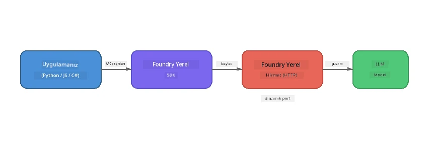

# Bölüm 1: Foundry Local ile Başlarken


## Foundry Local Nedir?

[Foundry Local](https://foundrylocal.ai), açık kaynaklı AI dil modellerini **doğrudan bilgisayarınızda** çalıştırmanızı sağlar - internet gerekmez, bulut maliyeti yoktur ve tam veri gizliliği sunar. Şunları yapar:

- **Modelleri yerel olarak indirir ve çalıştırır** otomatik donanım optimizasyonu ile (GPU, CPU veya NPU)
- **AçıkAI uyumlu bir API sağlar** böylece tanıdık SDK'ları ve araçları kullanabilirsiniz
- **Azure aboneliği veya kayıt gerektirmez** - sadece kurun ve geliştirmeye başlayın

Bunu, tamamen makinenizde çalışan kendi özel AI'nız olarak düşünün.

## Öğrenme Hedefleri

Bu laboratuvarın sonunda şunları yapabileceksiniz:

- İşletim sisteminize Foundry Local CLI’yı kurmak
- Model takma adlarının ne olduğunu ve nasıl çalıştığını anlamak
- İlk yerel AI modelinizi indirip çalıştırmak
- Komut satırından yerel modele sohbet mesajı göndermek
- Yerel ve bulut barındırılan AI modelleri arasındaki farkı anlamak

---

## Önkoşullar

### Sistem Gereksinimleri

| Gereksinim | Minimum | Önerilen |
|-------------|---------|-------------|
| **RAM** | 8 GB | 16 GB |
| **Disk Alanı** | 5 GB (modeller için) | 10 GB |
| **CPU** | 4 çekirdek | 8+ çekirdek |
| **GPU** | İsteğe bağlı | CUDA 11.8+ destekli NVIDIA |
| **İşletim Sistemi** | Windows 10/11 (x64/ARM), Windows Server 2025, macOS 13+ | - |

> **Not:** Foundry Local, donanımınıza en uygun model varyantını otomatik olarak seçer. NVIDIA GPU’nuz varsa CUDA hızlandırması kullanır. Qualcomm NPU varsa onu kullanır. Aksi halde optimize edilmiş CPU varyantına geçer.

### Foundry Local CLI Kurulumu

**Windows** (PowerShell):  
```powershell
winget install Microsoft.FoundryLocal
```
  
**macOS** (Homebrew):  
```bash
brew tap microsoft/foundrylocal
brew install foundrylocal
```
  
> **Not:** Foundry Local şu anda sadece Windows ve macOS’u desteklemektedir. Linux şu an için desteklenmemektedir.

Kurulumu doğrulayın:  
```bash
foundry --version
```
  
---

## Laboratuvar Egzersizleri

### Egzersiz 1: Mevcut Modelleri Keşfetme

Foundry Local, önceden optimize edilmiş açık kaynak modellerin bir kataloğunu içerir. Listeleyin:

```bash
foundry model list
```
  
Aşağıdaki modeller gibi modeller göreceksiniz:  
- `phi-3.5-mini` - Microsoft’un 3,8 milyar parametreli modeli (hızlı, iyi kalite)  
- `phi-4-mini` - Daha yeni ve yetkin Phi modeli  
- `phi-4-mini-reasoning` - Zincirleme düşünme (chain-of-thought) içeren Phi modeli (`<think>` etiketleriyle)  
- `phi-4` - Microsoft’un en büyük Phi modeli (10,4 GB)  
- `qwen2.5-0.5b` - Çok küçük ve hızlı (düşük kaynaklı cihazlar için iyi)  
- `qwen2.5-7b` - Araç çağırma destekli güçlü genel amaçlı model  
- `qwen2.5-coder-7b` - Kod üretimi için optimize edilmiş  
- `deepseek-r1-7b` - Güçlü akıl yürütme modeli  
- `gpt-oss-20b` - Büyük açık kaynak modeli (MIT lisansı, 12,5 GB)  
- `whisper-base` - Konuşma-metne döküm (383 MB)  
- `whisper-large-v3-turbo` - Yüksek doğruluklu döküm (9 GB)  

> **Model takma adı nedir?** `phi-3.5-mini` gibi takma adlar kısayollardır. Bir takma ad kullandığınızda, Foundry Local donanımınıza en uygun varyantı otomatik indirir (NVIDIA GPU’lar için CUDA, aksi halde CPU optimizasyonu). Doğru varyantı seçmekle asla uğraşmazsınız.

### Egzersiz 2: İlk Modelinizi Çalıştırın

Bir modeli indirip interaktif sohbeti başlatın:

```bash
foundry model run phi-3.5-mini
```
  
İlk çalıştırmanızda Foundry Local:  
1. Donanımınızı algılar  
2. En uygun model varyantını indirir (birkaç dakika sürebilir)  
3. Modeli belleğe yükler  
4. İnteraktif sohbet oturumu başlatır  

Bazı sorular sorarak deneyin:  
```
You: What is the golden ratio?
You: Can you explain it as if I were 10 years old?
You: Write a haiku about mathematics
```
  
Çıkmak için `exit` yazın veya `Ctrl+C` tuşlarına basın.

### Egzersiz 3: Modeli Önceden İndirme

Bir sohbet başlatmadan bir modeli indirmeniz gerekiyorsa:

```bash
foundry model download phi-3.5-mini
```
  
Bilgisayarınızda zaten indirilmiş modelleri kontrol edin:  

```bash
foundry cache list
```
  
### Egzersiz 4: Mimarinin Anlaşılması

Foundry Local, OpenAI uyumlu bir REST API sunan **yerel bir HTTP servisi** olarak çalışır. Bu şunları ifade eder:

1. Servis **dinamik bir port** üzerinde başlar (her seferinde farklı bir port)  
2. SDK’yı kullanarak gerçek uç nokta URL'sini keşfedersiniz  
3. **Herhangi bir** OpenAI uyumlu istemci kütüphanesi ile iletişim kurabilirsiniz  



> **Önemli:** Foundry Local her başlatıldığında **dinamik bir port** atar. `localhost:5272` gibi port numaralarını asla sert kodlamayın. Her zaman SDK’yı kullanarak güncel URL’yi keşfedin (örneğin Python’da `manager.endpoint` veya JavaScript’te `manager.urls[0]`).

---

## Önemli Noktalar

| Kavram | Öğrendikleriniz |
|---------|------------------|
| Cihaz üzeri AI | Foundry Local modelleri tamamen cihazınızda çalıştırır; bulut, API anahtarı veya maliyet yoktur |
| Model takma adları | `phi-3.5-mini` gibi takma adlar donanımınıza en uygun varyantı otomatik seçer |
| Dinamik portlar | Servis dinamik bir portta çalışır; uç noktayı keşfetmek için her zaman SDK’yı kullanın |
| CLI ve SDK | Modellerle CLI üzerinden (`foundry model run`) veya programatik olarak SDK ile etkileşim kurabilirsiniz |

---

## Sonraki Adımlar

Modelleri, servisleri ve önbelleği programatik olarak yönetmek için SDK API’sini öğrenmek üzere [Bölüm 2: Foundry Local SDK Derinlemesine İnceleme](part2-foundry-local-sdk.md) kısmına devam edin.