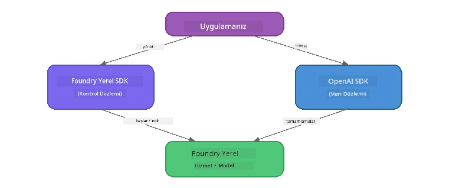

# Bölüm 3: Foundry Local SDK'yı OpenAI ile Kullanmak

## Genel Bakış

Bölüm 1'de Foundry Local CLI'yı modelleri etkileşimli olarak çalıştırmak için kullandınız. Bölüm 2'de tam SDK API yüzeyini incelediniz. Şimdi SDK ve OpenAI uyumlu API kullanarak **Foundry Local'u uygulamalarınıza entegre etmeyi** öğreneceksiniz.

Foundry Local üç dil için SDK sağlar. En rahat ettiğiniz dili seçin - kavramlar her üçü arasında aynıdır.

## Öğrenme Hedefleri

Bu laboratuvarın sonunda şunları yapabileceksiniz:

- Diliniz için Foundry Local SDK'yı kurmak (Python, JavaScript veya C#)
- Hizmeti başlatmak, önbelleği kontrol etmek, model indirmek ve yüklemek için `FoundryLocalManager`'ı başlatmak
- OpenAI SDK kullanarak yerel modele bağlanmak
- Sohbet tamamlama göndermek ve akış yanıtlarını işlemek
- Dinamik port mimarisini anlamak

---

## Önkoşullar

Öncelikle [Bölüm 1: Foundry Local ile Başlarken](part1-getting-started.md) ve [Bölüm 2: Foundry Local SDK Derinlemesine İnceleme](part2-foundry-local-sdk.md) tamamlayın.

Aşağıdaki dil çalışma zamanlarından **birini** kurun:
- **Python 3.9+** - [python.org/downloads](https://www.python.org/downloads/)
- **Node.js 18+** - [nodejs.org](https://nodejs.org/)
- **.NET 9.0+** - [dot.net/download](https://dotnet.microsoft.com/download)

---

## Kavram: SDK Nasıl Çalışır

Foundry Local SDK, **kontrol düzlemini** (hizmeti başlatma, modelleri indirme) yönetirken; OpenAI SDK **veri düzlemini** (istem gönderme, tamamlama alma) ele alır.



---

## Laboratuvar Egzersizleri

### Egzersiz 1: Ortamınızı Kurun

<details>
<summary><b>🐍 Python</b></summary>

```bash
cd python
python -m venv venv

# Sanal ortamı etkinleştir:
# Windows (PowerShell):
venv\Scripts\Activate.ps1
# Windows (Komut İstemi):
venv\Scripts\activate.bat
# macOS:
source venv/bin/activate

pip install -r requirements.txt
```

`requirements.txt` şunları kurar:
- `foundry-local-sdk` - Foundry Local SDK ( `foundry_local` olarak içe aktarılır)
- `openai` - OpenAI Python SDK
- `agent-framework` - Microsoft Agent Framework (gelecek bölümlerde kullanılır)

</details>

<details>
<summary><b>📘 JavaScript</b></summary>

```bash
cd javascript
npm install
```

`package.json` şunları kurar:
- `foundry-local-sdk` - Foundry Local SDK
- `openai` - OpenAI Node.js SDK

</details>

<details>
<summary><b>💜 C#</b></summary>

```bash
cd csharp
dotnet restore
dotnet build
```

`csharp.csproj` şunları kullanır:
- `Microsoft.AI.Foundry.Local` - Foundry Local SDK (NuGet)
- `OpenAI` - OpenAI C# SDK (NuGet)

> **Proje yapısı:** C# projesi, `Program.cs` içinde komut satırı yönlendiricisi kullanır ve örnek dosyalara yönlendirir. Bu bölüm için `dotnet run chat` (veya sadece `dotnet run`) komutunu çalıştırın. Diğer bölümler `dotnet run rag`, `dotnet run agent` ve `dotnet run multi` komutlarını kullanır.

</details>

---

### Egzersiz 2: Temel Sohbet Tamamlama

Diliniz için temel sohbet örneğini açın ve kodu inceleyin. Her betik aynı üç adımlı deseni izler:

1. **Hizmeti başlatın** - `FoundryLocalManager` Foundry Local çalışma zamanını başlatır
2. **Modeli indirip yükleyin** - önbelleği kontrol edin, gerekirse indirin, sonra belleğe yükleyin
3. **OpenAI istemcisi oluşturun** - yerel uç noktaya bağlanın ve akışlı sohbet tamamlama gönderin

<details>
<summary><b>🐍 Python - <code>python/foundry-local.py</code></b></summary>

```python
import sys
import openai
from foundry_local import FoundryLocalManager

alias = "phi-3.5-mini"

# Adım 1: Bir FoundryLocalManager oluşturun ve servisi başlatın
print("Starting Foundry Local service...")
manager = FoundryLocalManager()
manager.start_service()

# Adım 2: Modelin zaten indirilip indirilmediğini kontrol edin
cached = manager.list_cached_models()
catalog_info = manager.get_model_info(alias)
is_cached = any(m.id == catalog_info.id for m in cached) if catalog_info else False

if is_cached:
    print(f"Model already downloaded: {alias}")
else:
    print(f"Downloading model: {alias} (this may take several minutes)...")
    manager.download_model(alias)
    print(f"Download complete: {alias}")

# Adım 3: Modeli belleğe yükleyin
print(f"Loading model: {alias}...")
manager.load_model(alias)

# LOCAL Foundry servisine işaret eden bir OpenAI istemcisi oluşturun
client = openai.OpenAI(
    base_url=manager.endpoint,   # Dinamik port - asla sabit kodlama yapmayın!
    api_key=manager.api_key
)

# Akışlı sohbet tamamlaması oluşturun
stream = client.chat.completions.create(
    model=manager.get_model_info(alias).id,
    messages=[{"role": "user", "content": "What is the golden ratio?"}],
    stream=True,
)

for chunk in stream:
    if chunk.choices[0].delta.content is not None:
        print(chunk.choices[0].delta.content, end="", flush=True)
print()
```

**Çalıştırın:**
```bash
python foundry-local.py
```

</details>

<details>
<summary><b>📘 JavaScript - <code>javascript/foundry-local.mjs</code></b></summary>

```javascript
import { OpenAI } from "openai";
import { FoundryLocalManager } from "foundry-local-sdk";

const alias = "phi-3.5-mini";

// Adım 1: Foundry Lokal servisini başlatın
console.log("Starting Foundry Local service...");
FoundryLocalManager.create({ appName: "FoundryLocalWorkshop" });
const manager = FoundryLocalManager.instance;
await manager.startWebService();

// Adım 2: Modelin zaten indirip indirilmediğini kontrol edin
const catalog = manager.catalog;
const model = await catalog.getModel(alias);

if (model.isCached) {
  console.log(`Model already downloaded: ${alias}`);
} else {
  console.log(`Downloading model: ${alias} (this may take several minutes)...`);
  await model.download();
  console.log(`Download complete: ${alias}`);
}

// Adım 3: Modeli belleğe yükleyin
console.log(`Loading model: ${alias}...`);
await model.load();
console.log(`Model loaded: ${model.id}`);

// LOCAL Foundry servisine işaret eden bir OpenAI istemcisi oluşturun
const client = new OpenAI({
  baseURL: manager.urls[0] + "/v1",   // Dinamik port - asla sabit kodlama yapmayın!
  apiKey: "foundry-local",
});

// Akış halinde sohbet tamamlaması oluşturun
const stream = await client.chat.completions.create({
  model: model.id,
  messages: [{ role: "user", content: "What is the golden ratio?" }],
  stream: true,
});

for await (const chunk of stream) {
  if (chunk.choices[0]?.delta?.content) {
    process.stdout.write(chunk.choices[0].delta.content);
  }
}
console.log();
```

**Çalıştırın:**
```bash
node foundry-local.mjs
```

</details>

<details>
<summary><b>💜 C# - <code>csharp/BasicChat.cs</code></b></summary>

```csharp
using Microsoft.AI.Foundry.Local;
using Microsoft.Extensions.Logging.Abstractions;
using OpenAI;
using OpenAI.Chat;
using System.ClientModel;

var alias = "phi-3.5-mini";

// Step 1: Start the Foundry Local service
Console.WriteLine("Starting Foundry Local service...");
await FoundryLocalManager.CreateAsync(
    new Configuration
    {
        AppName = "FoundryLocalSamples",
        Web = new Configuration.WebService { Urls = "http://127.0.0.1:0" }
    }, NullLogger.Instance, default);
var manager = FoundryLocalManager.Instance;
await manager.StartWebServiceAsync(default);

// Step 2: Get the model from the catalog
var catalog = await manager.GetCatalogAsync(default);
var model = await catalog.GetModelAsync(alias, default);

// Step 3: Check if the model is already downloaded
var isCached = await model.IsCachedAsync(default);

if (isCached)
{
    Console.WriteLine($"Model already downloaded: {alias}");
}
else
{
    Console.WriteLine($"Downloading model: {alias} (this may take several minutes)...");
    await model.DownloadAsync(null, default);
    Console.WriteLine($"Download complete: {alias}");
}

// Step 4: Load the model into memory
Console.WriteLine($"Loading model: {alias}...");
await model.LoadAsync(default);
Console.WriteLine($"Loaded model: {model.Id}");
Console.WriteLine($"Endpoint: {manager.Urls[0]}");

// Create OpenAI client pointing to the LOCAL Foundry service
var key = new ApiKeyCredential("foundry-local");
var client = new OpenAIClient(key, new OpenAIClientOptions
{
    Endpoint = new Uri(manager.Urls[0] + "/v1")  // Dynamic port - never hardcode!
});

var chatClient = client.GetChatClient(model.Id);

// Stream a chat completion
var completionUpdates = chatClient.CompleteChatStreaming("What is the golden ratio?");

foreach (var update in completionUpdates)
{
    if (update.ContentUpdate.Count > 0)
    {
        Console.Write(update.ContentUpdate[0].Text);
    }
}
Console.WriteLine();
```

**Çalıştırın:**
```bash
dotnet run chat
```

</details>

---

### Egzersiz 3: İstemlerle Deney Yapın

Temel örneğiniz çalıştıktan sonra kodu değiştirmeyi deneyin:

1. **Kullanıcı mesajını değiştirin** - farklı sorular deneyin
2. **Bir sistem isteği ekleyin** - modele bir kişilik verin
3. **Akışı kapatın** - `stream=False` olarak ayarlayın ve yanıtı tamamen yazdırın
4. **Farklı bir modeli deneyin** - takma adı `phi-3.5-mini` olan modeli `foundry model list`'ten başka bir model ile değiştirin

<details>
<summary><b>🐍 Python</b></summary>

```python
# Bir sistem istemi ekleyin - modele bir kişilik verin:
stream = client.chat.completions.create(
    model=manager.get_model_info(alias).id,
    messages=[
        {"role": "system", "content": "You are a pirate. Answer everything in pirate speak."},
        {"role": "user", "content": "What is the golden ratio?"}
    ],
    stream=True,
)

# Veya akışı kapatın:
response = client.chat.completions.create(
    model=manager.get_model_info(alias).id,
    messages=[{"role": "user", "content": "What is the golden ratio?"}],
    stream=False,
)
print(response.choices[0].message.content)
```

</details>

<details>
<summary><b>📘 JavaScript</b></summary>

```javascript
// Bir sistem istemi ekleyin - modele bir kişilik verin:
const stream = await client.chat.completions.create({
  model: modelInfo.id,
  messages: [
    { role: "system", content: "You are a pirate. Answer everything in pirate speak." },
    { role: "user", content: "What is the golden ratio?" },
  ],
  stream: true,
});

// Ya da akışı kapatın:
const response = await client.chat.completions.create({
  model: modelInfo.id,
  messages: [{ role: "user", content: "What is the golden ratio?" }],
  stream: false,
});
console.log(response.choices[0].message.content);
```

</details>

<details>
<summary><b>💜 C#</b></summary>

```csharp
// Add a system prompt - give the model a persona:
var completionUpdates = chatClient.CompleteChatStreaming(
    new ChatMessage[]
    {
        new SystemChatMessage("You are a pirate. Answer everything in pirate speak."),
        new UserChatMessage("What is the golden ratio?")
    }
);

// Or turn off streaming:
var response = chatClient.CompleteChat("What is the golden ratio?");
Console.WriteLine(response.Value.Content[0].Text);
```

</details>

---

### SDK Metot Referansı

<details>
<summary><b>🐍 Python SDK Metotları</b></summary>

| Metot | Amaç |
|--------|---------|
| `FoundryLocalManager()` | Yönetici örneği oluşturur |
| `manager.start_service()` | Foundry Local servisini başlatır |
| `manager.list_cached_models()` | Cihazda önceden indirilen modelleri listeler |
| `manager.get_model_info(alias)` | Model kimliği ve meta verileri alır |
| `manager.download_model(alias, progress_callback=fn)` | İndirme sırasında ilerleme çağrısı ile model indirir |
| `manager.load_model(alias)` | Modeli belleğe yükler |
| `manager.endpoint` | Dinamik uç nokta URL'sini alır |
| `manager.api_key` | API anahtarını alır (yerel için yer tutucu) |

</details>

<details>
<summary><b>📘 JavaScript SDK Metotları</b></summary>

| Metot | Amaç |
|--------|---------|
| `FoundryLocalManager.create({ appName })` | Yönetici örneği oluşturur |
| `FoundryLocalManager.instance` | Tekil yöneticiye erişim sağlar |
| `await manager.startWebService()` | Foundry Local servisini başlatır |
| `await manager.catalog.getModel(alias)` | Katalogdan model alır |
| `model.isCached` | Modelin önceden indirilip indirilmediğini kontrol eder |
| `await model.download()` | Model indirir |
| `await model.load()` | Modeli belleğe yükler |
| `model.id` | OpenAI API çağrıları için model kimliği alır |
| `manager.urls[0] + "/v1"` | Dinamik uç nokta URL'sini alır |
| `"foundry-local"` | API anahtarı (yerel için yer tutucu) |

</details>

<details>
<summary><b>💜 C# SDK Metotları</b></summary>

| Metot | Amaç |
|--------|---------|
| `FoundryLocalManager.CreateAsync(config)` | Yönetici oluşturur ve başlatır |
| `manager.StartWebServiceAsync()` | Foundry Local web servisini başlatır |
| `manager.GetCatalogAsync()` | Model kataloğunu alır |
| `catalog.ListModelsAsync()` | Mevcut tüm modelleri listeler |
| `catalog.GetModelAsync(alias)` | Belirli bir modeli takma ada göre alır |
| `model.IsCachedAsync()` | Bir modelin indirildiğini kontrol eder |
| `model.DownloadAsync()` | Model indirir |
| `model.LoadAsync()` | Modeli belleğe yükler |
| `manager.Urls[0]` | Dinamik uç nokta URL'sini alır |
| `new ApiKeyCredential("foundry-local")` | Yerel için API anahtarı kimlik bilgisi |

</details>

---

### Egzersiz 4: Yerel ChatClient Kullanımı (OpenAI SDK Alternatifi)

Egzersiz 2 ve 3'te sohbet tamamlama için OpenAI SDK kullandınız. JavaScript ve C# SDK'lar ayrıca OpenAI SDK'nın tamamen ortadan kaldırıldığı **yerel ChatClient** sağlar.

<details>
<summary><b>📘 JavaScript - <code>model.createChatClient()</code></b></summary>

```javascript
import { FoundryLocalManager } from "foundry-local-sdk";

const alias = "phi-3.5-mini";

FoundryLocalManager.create({ appName: "ChatClientDemo" });
const manager = FoundryLocalManager.instance;
await manager.startWebService();

const model = await manager.catalog.getModel(alias);
if (!model.isCached) await model.download();
await model.load();

// OpenAI içe aktarımı gerekmez — istemciyi doğrudan modelden alın
const chatClient = model.createChatClient();

// Yayın yapmayan tamamlama
const response = await chatClient.completeChat([
  { role: "system", content: "You are a pirate. Answer everything in pirate speak." },
  { role: "user", content: "What is the golden ratio?" }
]);
console.log(response.choices[0].message.content);

// Yayınlı tamamlama (geri arama deseni kullanır)
await chatClient.completeStreamingChat(
  [{ role: "user", content: "What is the golden ratio?" }],
  (chunk) => {
    if (chunk.choices?.[0]?.delta?.content) {
      process.stdout.write(chunk.choices[0].delta.content);
    }
  }
);
console.log();
```

> **Not:** ChatClient'ın `completeStreamingChat()` metodu **callback** modelini kullanır, asenkron iterator değil. İkinci argüman olarak bir fonksiyon geçin.

</details>

<details>
<summary><b>💜 C# - <code>model.GetChatClientAsync()</code></b></summary>

```csharp
var catalog = await manager.GetCatalogAsync(default);
var model = await catalog.GetModelAsync("phi-3.5-mini", default);
if (!await model.IsCachedAsync(default))
    await model.DownloadAsync(null, default);
await model.LoadAsync(default);

// No OpenAI NuGet needed — get a client directly from the model
var chatClient = await model.GetChatClientAsync(default);

// Use it like a standard OpenAI ChatClient
var response = chatClient.CompleteChat("What is the golden ratio?");
Console.WriteLine(response.Value.Content[0].Text);
```

</details>

> **Ne zaman hangisi kullanılır:**
> | Yaklaşım | En uygunu |
> |----------|----------|
> | OpenAI SDK | Tam parametre kontrolü, üretim uygulamaları, mevcut OpenAI kodu |
> | Yerel ChatClient | Hızlı prototipleme, daha az bağımlılık, daha basit kurulum |

---

## Önemli Noktalar

| Kavram | Öğrendikleriniz |
|---------|------------------|
| Kontrol düzlemi | Foundry Local SDK hizmeti başlatmayı ve modelleri yüklemeyi yönetir |
| Veri düzlemi | OpenAI SDK sohbet tamamlama ve akış işlemlerini yönetir |
| Dinamik portlar | Uç nokta keşfi için her zaman SDK'yı kullanın; URL'leri asla sabitlemeyin |
| Çoklu dil desteği | Aynı kod örüntüsü Python, JavaScript ve C# dillerinde çalışır |
| OpenAI uyumu | Tam OpenAI API uyumluluğu mevcut OpenAI kodunun minimal değişiklikle çalışmasını sağlar |
| Yerel ChatClient | `createChatClient()` (JS) / `GetChatClientAsync()` (C#) OpenAI SDK'ya alternatif sunar |

---

## Sonraki Adımlar

Tamamen cihazınızda çalışan Retrieval-Augmented Generation (RAG) boru hattı nasıl oluşturulur öğrenmek için [Bölüm 4: RAG Uygulaması Geliştirme](part4-rag-fundamentals.md) bölümüne devam edin.