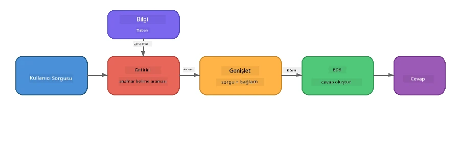

# Bölüm 4: Foundry Local ile RAG Uygulaması Oluşturma

## Genel Bakış

Büyük Dil Modelleri güçlüdür, ancak yalnızca eğitim verilerinde olanları bilirler. **Retrieval-Augmented Generation (RAG)**, modeli sorgu zamanında ilgili bağlamla besleyerek bunu çözer - kendi belgelerinizden, veritabanlarınızdan veya bilgi tabanlarınızdan çekilir.

Bu laboratuvarda, Foundry Local kullanarak **tamamen cihazınızda çalışan** eksiksiz bir RAG hattı oluşturacaksınız. Bulut hizmeti yok, vektör veritabanı yok, gömme API’si yok - sadece yerel getir ve yerel model.

## Öğrenme Hedefleri

Bu laboratuvarın sonunda şunları yapabileceksiniz:

- RAG'ın ne olduğunu ve AI uygulamaları için neden önemli olduğunu açıklamak
- Metin belgelerinden yerel bir bilgi tabanı oluşturmak
- İlgili bağlamı bulmak için basit bir getirme işlevi uygulamak
- Modeli getirilen gerçeklere dayandıran bir sistem istemi oluşturmak
- Tam Retrieve → Augment → Generate hattını cihaz üzerinde çalıştırmak
- Basit anahtar kelime tabanlı getirme ile vektör arama arasındaki takasları anlamak

---

## Ön Koşullar

- [Bölüm 3: Foundry Local SDK ve OpenAI Kullanımı](part3-sdk-and-apis.md) tamamlanmış olmalı
- Foundry Local CLI kurulu ve `phi-3.5-mini` modeli indirilmiş olmalı

---

## Kavram: RAG Nedir?

RAG olmadan, bir LLM yalnızca eğitim verilerinden cevap verebilir - bu eski, eksik veya özel bilgilerinizin olmadığı veriler olabilir:

```
User: "What is Zava's return policy?"
LLM:  "I do not have information about Zava's return policy."  ← No context!
```

RAG ile önce ilgili belgeleri **getirirsiniz**, sonra o bağlamla istemi **zenginleştirir** ve en sonunda yanıtı **üretirsiniz**:



Ana fikir: **modelin cevabı "bilmesi" gerekmez; sadece doğru belgeleri okuması yeterlidir.**

---

## Laboratuvar Egzersizleri

### Egzersiz 1: Bilgi Tabanını Anlamak

Dilinize ait RAG örneğini açın ve bilgi tabanını inceleyin:

<details>
<summary><b>🐍 Python: <code>python/foundry-local-rag.py</code></b></summary>

Bilgi tabanı, `title` ve `content` alanlarına sahip basit bir sözlük listesi:

```python
KNOWLEDGE_BASE = [
    {
        "title": "Foundry Local Overview",
        "content": (
            "Foundry Local brings the power of Azure AI Foundry to your local "
            "device without requiring an Azure subscription..."
        ),
    },
    {
        "title": "Supported Hardware",
        "content": (
            "Foundry Local automatically selects the best model variant for "
            "your hardware. If you have an Nvidia CUDA GPU it downloads the "
            "CUDA-optimized model..."
        ),
    },
    # ... daha fazla kayıt
]
```

Her giriş bir “parça” bilgi temsil eder - tek bir konuya odaklanan bilgi parçası.

</details>

<details>
<summary><b>📘 JavaScript: <code>javascript/foundry-local-rag.mjs</code></b></summary>

Bilgi tabanı, nesne dizisi yapısını kullanır:

```javascript
const KNOWLEDGE_BASE = [
  {
    title: "Foundry Local Overview",
    content:
      "Foundry Local brings the power of Azure AI Foundry to your local " +
      "device without requiring an Azure subscription...",
  },
  {
    title: "Supported Hardware",
    content:
      "Foundry Local automatically selects the best model variant for " +
      "your hardware...",
  },
  // ... daha fazla giriş
];
```

</details>

<details>
<summary><b>💜 C#: <code>csharp/RagPipeline.cs</code></b></summary>

Bilgi tabanı isimlendirilmiş tuple listesi olarak kullanılır:

```csharp
private static readonly List<(string Title, string Content)> KnowledgeBase =
[
    ("Foundry Local Overview",
     "Foundry Local brings the power of Azure AI Foundry to your local " +
     "device without requiring an Azure subscription..."),

    ("Supported Hardware",
     "Foundry Local automatically selects the best model variant for " +
     "your hardware..."),

    // ... more entries
];
```

</details>

> **Gerçek bir uygulamada**, bilgi tabanı dosyalardan, veritabanından, arama dizininden veya bir API’den gelir. Bu lab için işler basit tutmak amacıyla bellekte tutulur.

---

### Egzersiz 2: Getirme İşlevini Anlamak

Getirme aşaması, kullanıcının sorusu için en ilgili parçaları bulur. Bu örnek **anahtar kelime örtüşmesi** kullanır - sorgudaki kaç kelimenin her parçada geçtiğini sayar:

<details>
<summary><b>🐍 Python</b></summary>

```python
def retrieve(query: str, top_k: int = 2) -> list[dict]:
    """Return the top-k knowledge chunks most relevant to the query."""
    query_words = set(query.lower().split())
    scored = []
    for chunk in KNOWLEDGE_BASE:
        chunk_words = set(chunk["content"].lower().split())
        overlap = len(query_words & chunk_words)
        scored.append((overlap, chunk))
    scored.sort(key=lambda x: x[0], reverse=True)
    return [item[1] for item in scored[:top_k]]
```

</details>

<details>
<summary><b>📘 JavaScript</b></summary>

```javascript
function retrieve(query, topK = 2) {
  const queryWords = new Set(query.toLowerCase().split(/\s+/));
  const scored = KNOWLEDGE_BASE.map((chunk) => {
    const chunkWords = new Set(chunk.content.toLowerCase().split(/\s+/));
    let overlap = 0;
    for (const w of queryWords) {
      if (chunkWords.has(w)) overlap++;
    }
    return { overlap, chunk };
  });
  scored.sort((a, b) => b.overlap - a.overlap);
  return scored.slice(0, topK).map((s) => s.chunk);
}
```

</details>

<details>
<summary><b>💜 C#</b></summary>

```csharp
private static List<(string Title, string Content)> Retrieve(string query, int topK = 2)
{
    var queryWords = new HashSet<string>(
        query.ToLowerInvariant().Split(' ', StringSplitOptions.RemoveEmptyEntries));

    return KnowledgeBase
        .Select(chunk =>
        {
            var chunkWords = new HashSet<string>(
                chunk.Content.ToLowerInvariant().Split(' ', StringSplitOptions.RemoveEmptyEntries));
            var overlap = queryWords.Intersect(chunkWords).Count();
            return (Overlap: overlap, Chunk: chunk);
        })
        .OrderByDescending(x => x.Overlap)
        .Take(topK)
        .Select(x => x.Chunk)
        .ToList();
}
```

</details>

**Nasıl çalışır:**
1. Sorgu tek kelimelere bölünür
2. Her bilgi parçasında kaç sorgu kelimesinin geçtiği sayılır
3. Örtüşme skoruna göre sıralanır (en yüksek ilk)
4. En alakalı top-k parça döndürülür

> **Takas:** Anahtar kelime örtüşmesi basit ama sınırlıdır; eşanlamlıları veya anlamı anlama yetisi yoktur. Üretim RAG sistemleri genellikle **gömme vektörleri** ve **vektör veritabanı** kullanır semantik arama için. Ancak anahtar kelime örtüşmesi iyi bir başlangıçtır ve ekstra bağımlılık gerektirmez.

---

### Egzersiz 3: Zenginleştirilmiş İstemi Anlamak

Getirilen bağlam, modele gönderilmeden önce **sistem istemine** eklenir:

```python
system_prompt = (
    "You are a helpful assistant. Answer the user's question using ONLY "
    "the information provided in the context below. If the context does "
    "not contain enough information, say so.\n\n"
    f"Context:\n{context_text}"
)
```

Ana tasarım kararları:
- **“SADECE sağlanan bilgi”** - modelin bağlamda olmayan gerçek dışı bilgi üretmesini engeller
- **“Bağlam yeterli bilgi içermiyorsa bunu açıkla”** - dürüst “Bilmiyorum” cevabını teşvik eder
- Bağlam, tüm cevapları etkileyen sistem mesajına yerleştirilir

---

### Egzersiz 4: RAG Hattını Çalıştırmak

Tam örneği çalıştırın:

**Python:**
```bash
cd python
python foundry-local-rag.py
```

**JavaScript:**
```bash
cd javascript
node foundry-local-rag.mjs
```

**C#:**
```bash
cd csharp
dotnet run rag
```

Üç şey yazdırılmalı:
1. Sorulan **soru**
2. Bilgi tabanından seçilen **getirilen bağlam**
3. Sadece o bağlamı kullanarak model tarafından oluşturulan **cevap**

Örnek çıktı:
```
Question: How do I install Foundry Local and what hardware does it support?

--- Retrieved Context ---
### Installation
On Windows install Foundry Local with: winget install Microsoft.FoundryLocal...

### Supported Hardware
Foundry Local automatically selects the best model variant for your hardware...
-------------------------

Answer: To install Foundry Local, you can use the following methods depending
on your operating system: On Windows, run `winget install Microsoft.FoundryLocal`.
On macOS, use `brew install microsoft/foundrylocal/foundrylocal`...
```

Modelin cevabının, getirilen bağlama **dayandığını** fark edin - yalnızca bilgi tabanı belgelerinde geçen gerçekleri içeriyor.

---

### Egzersiz 5: Deney Yap ve Genişlet

Anlayışınızı derinleştirmek için bu değişiklikleri deneyin:

1. **Soruyu değiştirin** - bilgi tabanında olan ve olmayan bir soru sorun:
   ```python
   question = "What programming languages does Foundry Local support?"  # ← Bağlam içinde
   question = "How much does Foundry Local cost?"                       # ← Bağlam dışında
   ```
   Bağlamda cevap yoksa model doğru şekilde “Bilmiyorum” diyor mu?

2. **Yeni bir bilgi parçası ekleyin** - `KNOWLEDGE_BASE`’e yeni bir giriş ekleyin:
   ```python
   {
       "title": "Pricing",
       "content": "Foundry Local is completely free and open source under the MIT license.",
   }
   ```
   Fiyatlandırma sorusunu tekrar sorun.

3. **`top_k` değerini değiştirin** - daha fazla veya daha az parça getirin:
   ```python
   context_chunks = retrieve(question, top_k=3)  # Daha fazla bağlam
   context_chunks = retrieve(question, top_k=1)  # Daha az bağlam
   ```
   Bağlam miktarı cevap kalitesini nasıl etkiler?

4. **Dayandırma talimatını kaldırın** - sistem istemini sadece "Yardımcı bir asistansın." yapın ve modelin gerçek dışı bilgiler üretip üretmediğine bakın.

---

## Derinlemesine: Cihaz Üzerinde RAG Performansını Optimize Etme

Cihazda RAG çalıştırmak, bulutta karşılaşmadığınız kısıtlamalar getirir: sınırlı RAM, özel GPU yok (CPU/NPU çalıştırma) ve küçük model bağlam penceresi. Aşağıdaki tasarım kararları doğrudan bu kısıtlamalarla ilgilenir ve Foundry Local ile yapılan üretim stili yerel RAG uygulamalarının desenlerine dayanır.

### Parçalama Stratejisi: Sabit-Boyutlu Kaydırmalı Pencere

Parçalama - belgeleri parçalara bölme şekliniz - herhangi bir RAG sisteminde en etkili kararlardan biridir. Cihaz ortamları için **örtüşmeli sabit boyutlu kaydırmalı pencere** önerilen başlangıçtır:

| Parametre | Önerilen Değer | Neden |
|-----------|----------------|-------|
| **Parça boyutu** | ~200 token | Getirilen bağlamı kompakt tutar, Phi-3.5 Mini bağlam penceresinde sistem istemi, konuşma geçmişi ve çıktı için yer bırakır |
| **Örtüşme** | ~25 token (yüzde 12.5) | Parça sınırlarında bilgi kaybını önler - prosedürler ve adım adım talimatlar için önemli |
| **Tokenizasyon** | Boşlukla ayırma | Hiçbir bağımlılık gerekmez, tokenizer kütüphanesine ihtiyaç yok. Tüm hesaplama bütçesi LLM’ye gider |

Örtüşme, kaydırmalı pencere gibi çalışır: Her yeni parça, öncekinin bitişinden 25 token öncesinde başlar, böylece parça sınırlarını aşan cümleler iki parçada da görünür.

> **Neden diğer stratejiler değil?**
> - **Cümle tabanlı parçalama**, parça boyutlarında tahmin edilemezlik yaratır; bazı güvenlik prosedürleri tek uzun cümledir, iyi bölünemez
> - **Bölüm farkındalıklı parçalama** (örneğin `##` başlıklarında) parça boyutlarını çok çeşitlendirir - bazı parçalar çok küçük, bazıları model bağlam penceresi için çok büyük olur
> - **Semantik parçalama** (gömme tabanlı konu tespiti) en iyi getiriyi sağlar, ancak Phi-3.5 Mini ile birlikte bellekte ikinci bir modeli tutmayı gerektirir - 8-16 GB paylaşımlı hafızalı donanımda risklidir

### Getirmeyi Geliştirme: TF-IDF Vektörleri

Bu labdaki anahtar kelime örtüşmesi çalışır, ancak gömme modeli eklemeden daha iyi getiri isterseniz, **TF-IDF (Terim Frekansı-Ters Belge Frekansı)** mükemmel orta yoldur:

```
Keyword Overlap  →  TF-IDF Vectors  →  Embedding Models
    (this lab)     (lightweight upgrade)   (production)
  Simple & fast    Better ranking,         Best quality,
  No dependencies  still no ML model       requires embedding model
  ~Basic matching  ~1ms retrieval          ~100-500ms per query
```

TF-IDF, her parçayı, o parçadaki her kelimenin *tüm parçalara göre* önemine dayalı sayısal bir vektöre dönüştürür. Sorgu zamanı aynı şekilde vektörleştirilir ve kosinüs benzerliğiyle karşılaştırılır. SQLite ve saf JavaScript/Python ile uygulanabilir - vektör veritabanı veya gömme API’si gerekmez.

> **Performans:** Sabit boyutlu parçalar üzerinde TF-IDF kosinüs benzerliği genellikle **~1ms getirme süresi** sağlar, gömme modeli ile her sorgunun kodlamasına göre (100-500ms). 20+ belge, 1 saniyeden kısa sürede parçalanıp indekslenebilir.

### Kısıtlı Cihazlar için Edge/Compact Modu

Çok kısıtlı donanımda (eski dizüstü, tablet, saha cihazı) kaynak tüketimini azaltmak için üç ayarı küçültebilirsiniz:

| Ayar | Standart Mod | Edge/Compact Mod |
|-------|--------------|-------------------|
| **Sistem istemi** | ~300 token | ~80 token |
| **Maks çıktı token** | 1024 | 512 |
| **Getirilen parçalar (top-k)** | 5 | 3 |

Daha az parça getirilmesi, modelin işleyeceği bağlamı azaltır, gecikme ve bellek baskısını düşürür. Daha kısa sistem istemi, cevaba ayrılan bağlam penceresinde daha fazla alan açar. Bu, bağlam penceresindeki her token’ın önemli olduğu cihazlarda değerli bir takastır.

### Bellekte Tek Model

Cihazda RAG için en önemli ilkelerden biri: **sadece bir model yüklü tutmak**. Hem getirme için gömme modeli hem yanıt için dil modeli kullanırsanız, sınırlı NPU/RAM kaynakları iki model arasında bölünür. Hafif getirme (anahtar kelime örtüşmesi, TF-IDF) bunu tamamen önler:

- Gömme modeli LLM ile bellek için rekabet etmez
- Daha hızlı soğuk başlatma - sadece bir model yüklenir
- Öngörülebilir bellek kullanımı - LLM tüm kaynakları alır
- 8 GB RAM gibi az bellekli makinelerde çalışır

### SQLite Yerel Vektör Deposu

Küçük-orta belge koleksiyonları (yüzlerce ila bin altı parçalar) için **SQLite**, kaba kuvvet kosinüs benzerliği araması için yeterince hızlıdır ve sıfır altyapı gerektirir:

- Tek `.db` dosyası disk üzerinde - sunucu süreci, yapılandırma yok
- Her büyük dil çalışma zamanı ile gelir (Python `sqlite3`, Node.js `better-sqlite3`, .NET `Microsoft.Data.Sqlite`)
- Parçaları TF-IDF vektörleriyle birlikte tek tabloda saklar
- Pinecone, Qdrant, Chroma veya FAISS gerekmez bu ölçekte

### Performans Özeti

Bu tasarım tercihleri, tüketici donanımında duyarlı RAG sağlar:

| Ölçüt | Cihaz Üzerinde Performans |
|--------|---------------------------|
| **Getirme gecikmesi** | ~1ms (TF-IDF) ile ~5ms (anahtar kelime örtüşmesi) arası |
| **İçeri alma hızı** | 20 belge < 1 saniyede parçalanıp indekslenir |
| **Bellekte modeller** | 1 (yalnızca LLM, gömme yok) |
| **Depolama yükü** | SQLite’ta parçalar + vektörler < 1 MB |
| **Soğuk başlatma** | Tek model yüklenir, gömme çalışma zamanı başlamaz |
| **Donanım sınırı** | 8 GB RAM, yalnızca CPU (GPU gerekmez) |

> **Ne zaman yükseltilir:** Yüzlerce uzun belge, karışık içerik türleri (tablolar, kod, düz yazı) veya sorguların anlamsal anlaşılması gerekirse, gömme modeli ekleyip vektör benzerliği araması düşünün. Çoğu cihazda, odaklı belge setleri için TF-IDF + SQLite minimal kaynak ile mükemmel sonuç verir.

---

## Temel Kavramlar

| Kavram | Tanım |
|---------|--------|
| **Getirme** | Kullanıcının sorgusuna göre bilgi tabanından alakalı belgeleri bulma |
| **Zenginleştirme** | Getirilen belgeleri bağlam olarak isteme ekleme |
| **Üretim** | LLM’nin sağlanan bağlama dayalı cevap üretmesi |
| **Parçalama** | Büyük belgeleri daha küçük, odaklı parçalara bölme |
| **Dayandırma** | Modelin sadece sağlanan bağlamı kullanmaya zorlanması (uydurmayı azaltır) |
| **Top-k** | En alakalı k parça sayısı |

---

## Üretimde RAG vs. Bu Laboratuvar

| Özellik | Bu Laboratuvar | Cihazda Optimize | Bulut Üretim |
|---------|----------------|------------------|--------------|
| **Bilgi tabanı** | Bellekte liste | Disk dosyaları, SQLite | Veritabanı, arama dizini |
| **Getirme** | Anahtar kelime örtüşmesi | TF-IDF + kosinüs benzerliği | Vektör gömmeleri + benzerlik araması |
| **Gömme** | Gerekmez | Gerekmez - TF-IDF vektörleri | Gömme modeli (yerel veya bulut) |
| **Vektör deposu** | Gerekmez | SQLite (tek `.db` dosyası) | FAISS, Chroma, Azure AI Search vb. |
| **Parçalama** | Manuel | Sabit boyutlu kaydırmalı pencere (~200 token, 25 token örtüşme) | Semantik veya yinelemeli parçalama |
| **Bellekte model sayısı** | 1 (LLM) | 1 (LLM) | 2+ (gömme + LLM) |
| **Alma gecikmesi** | ~5ms | ~1ms | ~100-500ms |
| **Ölçek** | 5 belge | Yüzlerce belge | Milyonlarca belge |

Burada öğrendiğiniz kalıplar (alma, artırma, oluşturma) herhangi bir ölçekte aynıdır. Alma yöntemi gelişir, ancak genel mimari aynı kalır. Orta sütun, hafif tekniklerle cihaz üzerinde neler başarılabileceğini gösterir; genellikle bulut ölçeğini gizlilik, çevrimdışı çalışma ve dış hizmetlere sıfır gecikme ile değiştirdiğiniz yerel uygulamalar için ideal noktadır.

---

## Temel Çıkarımlar

| Kavram | Ne Öğrendiniz |
|---------|------------------|
| RAG kalıbı | Alma + Artırma + Oluşturma: modele doğru bağlamı verin, verilerinizle ilgili soruları cevaplayabilir |
| Cihaz üzerinde | Her şey yerel olarak çalışır, bulut API'leri veya vektör veritabanı abonelikleri yoktur |
| Dayanak talimatları | Halüsinasyonu önlemek için sistem istemi kısıtlamaları kritiktir |
| Anahtar kelime örtüşmesi | Basit ama etkili bir başlangıç noktasıdır |
| TF-IDF + SQLite | Embedding modeli olmadan alma işlemini 1ms altında tutan hafif bir yükseltme yolu |
| Bellekte tek model | Kısıtlı donanımda LLM ile birlikte embedding modeli yüklemekten kaçının |
| Parça boyutu | Yaklaşık 200 token ve örtüşme, alma hassasiyeti ile bağlam pencere verimliliği arasında denge sağlar |
| Kenar/kompakt mod | Çok kısıtlı cihazlar için daha az parça ve daha kısa istemler kullanın |
| Evrensel kalıp | Aynı RAG mimarisi herhangi bir veri kaynağı için çalışır: belgeler, veritabanları, API'ler veya vikiler |

> **Tam bir cihazda RAG uygulaması görmek ister misiniz?** Bu optimizasyon kalıplarını gerçek dünya belge seti ile gösteren Foundry Local ve Phi-3.5 Mini ile oluşturulmuş üretim tarzı çevrimdışı RAG ajanı [Gas Field Local RAG](https://github.com/leestott/local-rag)’a göz atın.

---

## Sonraki Adımlar

Kişilikler, talimatlar ve çok tur konuşmalar kullanarak Microsoft Agent Framework ile akıllı ajanlar oluşturmayı öğrenmek için [Bölüm 5: AI Ajanları Oluşturma](part5-single-agents.md)'ya devam edin.