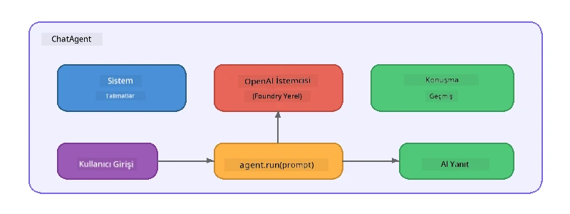

# Bölüm 5: Agent Çerçevesi ile Yapay Zeka Ajanları Oluşturma

> **Amaç:** Foundry Local üzerinden çalışan yerel bir modelle güçlendirilmiş, kalıcı talimatları ve tanımlı bir kişiliği olan ilk yapay zeka ajanınızı oluşturun.

## Yapay Zeka Ajanı Nedir?

Bir yapay zeka ajanı, bir dil modelini davranışını, kişiliğini ve kısıtlamalarını tanımlayan **sistem talimatlarıyla** sarar. Tek bir sohbet tamamlama çağrısından farklı olarak, bir ajan şunları sağlar:

- **Kişilik** - tutarlı bir kimlik ("Sen yardımcı bir kod inceleyicisin")
- **Bellek** - dönüşler arasındaki konuşma geçmişi
- **Uzmanlaşma** - iyi hazırlanmış talimatlarla yönlendirilen odaklanmış davranış



---

## Microsoft Agent Çerçevesi

**Microsoft Agent Framework** (AGF), farklı model arka uçlarıyla çalışan standart bir ajan soyutlaması sağlar. Bu atölyede, Foundry Local ile eşleştiriyoruz, böylece her şey bilgisayarınızda çalışır - bulut gerektirmez.

| Kavram | Açıklama |
|---------|-------------|
| `FoundryLocalClient` | Python: servis başlatma, model indirme/yükleme işlemlerini gerçekleştirir ve ajanlar oluşturur |
| `client.as_agent()` | Python: Foundry Local istemcisinden bir ajan oluşturur |
| `AsAIAgent()` | C#: `ChatClient` üzerine genişletme metodu - bir `AIAgent` oluşturur |
| `instructions` | Ajanın davranışını şekillendiren sistem istemi |
| `name` | İnsan tarafından okunabilir etiket, çok ajanlı senaryolarda faydalı |
| `agent.run(prompt)` / `RunAsync()` | Kullanıcı mesajı gönderir ve ajanın yanıtını döner |

> **Not:** Agent Framework'ün Python ve .NET SDK'ları vardır. JavaScript için, OpenAI SDK'yı doğrudan kullanarak aynı deseni yansıtan hafif bir `ChatAgent` sınıfı uyguladık.

---

## Egzersizler

### Egzersiz 1 - Ajan Desenini Anlamak

Kod yazmadan önce, bir ajanın temel bileşenlerini inceleyin:

1. **Model istemcisi** - Foundry Local'ın OpenAI uyumlu API'sine bağlanır
2. **Sistem talimatları** - "kişilik" istemi
3. **Çalıştırma döngüsü** - kullanıcı girdisi gönder, çıktı al

> **Düşünün:** Sistem talimatları normal bir kullanıcı mesajından nasıl farklıdır? Değiştirirseniz ne olur?

---

### Egzersiz 2 - Tek Ajan Örneğini Çalıştırma

<details>
<summary><strong>🐍 Python</strong></summary>

**Gereksinimler:**
```bash
cd python
python -m venv venv

# Windows (PowerShell):
venv\Scripts\Activate.ps1
# macOS:
source venv/bin/activate

pip install -r requirements.txt
```

**Çalıştır:**
```bash
python foundry-local-with-agf.py
```

**Kod incelemesi** (`python/foundry-local-with-agf.py`):

```python
import asyncio
from agent_framework_foundry_local import FoundryLocalClient

async def main():
    alias = "phi-4-mini"

    # FoundryLocalClient hizmet başlatma, model indirme ve yüklemeyi yönetir
    client = FoundryLocalClient(model_id=alias)
    print(f"Client Model ID: {client.model_id}")

    # Sistem talimatlarıyla bir ajan oluştur
    agent = client.as_agent(
        name="Joker",
        instructions="You are good at telling jokes.",
    )

    # Akışsız: tamamlanmış cevabı bir kerede al
    result = await agent.run("Tell me a joke about a pirate.")
    print(f"Agent: {result}")

    # Akış: sonuçları oluşturuldukça al
    async for chunk in agent.run("Tell me another joke.", stream=True):
        if chunk.text:
            print(chunk.text, end="", flush=True)

asyncio.run(main())
```

**Önemli noktalar:**
- `FoundryLocalClient(model_id=alias)` servis başlatma, indirme ve model yüklemeyi tek adımda yapar
- `client.as_agent()` sistem talimatları ve isim ile bir ajan oluşturur
- `agent.run()` hem akışsız hem de akışlı modları destekler
- `pip install agent-framework-foundry-local --pre` ile kurulum yapılır

</details>

<details>
<summary><strong>📦 JavaScript</strong></summary>

**Gereksinimler:**
```bash
cd javascript
npm install
```

**Çalıştır:**
```bash
node foundry-local-with-agent.mjs
```

**Kod incelemesi** (`javascript/foundry-local-with-agent.mjs`):

```javascript
import { OpenAI } from "openai";
import { FoundryLocalManager } from "foundry-local-sdk";

class ChatAgent {
  constructor({ client, modelId, instructions, name }) {
    this.client = client;
    this.modelId = modelId;
    this.instructions = instructions;
    this.name = name;
    this.history = [];
  }

  async run(userMessage) {
    const messages = [
      { role: "system", content: this.instructions },
      ...this.history,
      { role: "user", content: userMessage },
    ];
    const response = await this.client.chat.completions.create({
      model: this.modelId,
      messages,
    });
    const assistantMessage = response.choices[0].message.content;

    // Çok turlu etkileşimler için konuşma geçmişini saklayın
    this.history.push({ role: "user", content: userMessage });
    this.history.push({ role: "assistant", content: assistantMessage });
    return { text: assistantMessage };
  }
}

async function main() {
  FoundryLocalManager.create({ appName: "FoundryLocalWorkshop" });
  const manager = FoundryLocalManager.instance;
  await manager.startWebService();

  const catalog = manager.catalog;
  const model = await catalog.getModel("phi-3.5-mini");
  if (!model.isCached) {
    console.log("Downloading model: phi-3.5-mini...");
    await model.download();
  }
  await model.load();

  const client = new OpenAI({
    baseURL: manager.urls[0] + "/v1",
    apiKey: "foundry-local",
  });

  const agent = new ChatAgent({
    client,
    modelId: model.id,
    instructions: "You are good at telling jokes.",
    name: "Joker",
  });

  const result = await agent.run("Tell me a joke about a pirate.");
  console.log(result.text);
}

main();
```

**Önemli noktalar:**
- JavaScript kendi `ChatAgent` sınıfını Python AGF desenini yansıtacak şekilde oluşturur
- `this.history` çok dönüşlü destek için konuşma dönüşlerini saklar
- Açık `startWebService()` → önbellek kontrolü → `model.download()` → `model.load()` tam görünürlük sağlar

</details>

<details>
<summary><strong>💜 C#</strong></summary>

**Gereksinimler:**
```bash
cd csharp
dotnet restore
```

**Çalıştır:**
```bash
dotnet run agent
```

**Kod incelemesi** (`csharp/SingleAgent.cs`):

```csharp
using Microsoft.AI.Foundry.Local;
using Microsoft.Extensions.Logging.Abstractions;
using Microsoft.Agents.AI;
using OpenAI;
using System.ClientModel;

// 1. Start Foundry Local and load a model
var alias = "phi-3.5-mini";
await FoundryLocalManager.CreateAsync(
    new Configuration
    {
        AppName = "FoundryLocalSamples",
        Web = new Configuration.WebService { Urls = "http://127.0.0.1:0" }
    }, NullLogger.Instance, default);
var manager = FoundryLocalManager.Instance;
await manager.StartWebServiceAsync(default);

var catalog = await manager.GetCatalogAsync(default);
var model = await catalog.GetModelAsync(alias, default);

var isCached = await model.IsCachedAsync(default);
if (!isCached)
{
    Console.WriteLine($"Downloading model: {alias}...");
    await model.DownloadAsync(null, default);
}
await model.LoadAsync(default);

var key = new ApiKeyCredential("foundry-local");
var client = new OpenAIClient(key, new OpenAIClientOptions
{
    Endpoint = new Uri(manager.Urls[0] + "/v1")
});

// 2. Create an AIAgent using the Agent Framework extension method
AIAgent joker = client
    .GetChatClient(model.Id)
    .AsAIAgent(
        instructions: "You are good at telling jokes. Keep your jokes short and family-friendly.",
        name: "Joker"
    );

// 3. Run the agent (non-streaming)
var response = await joker.RunAsync("Tell me a joke about a pirate.");
Console.WriteLine($"Joker: {response}");

// 4. Run with streaming
await foreach (var update in joker.RunStreamingAsync("Tell me another joke."))
{
    Console.Write(update);
}
```

**Önemli noktalar:**
- `AsAIAgent()` `Microsoft.Agents.AI.OpenAI`'den gelen bir genişletme metodudur - özel `ChatAgent` sınıfı gerekmez
- `RunAsync()` tam yanıtı döner; `RunStreamingAsync()` token token akış sağlar
- `dotnet add package Microsoft.Agents.AI.OpenAI --version 1.0.0-rc3` ile kurulum yapılır

</details>

---

### Egzersiz 3 - Kişiliği Değiştirin

Ajanın `instructions` talimatlarını değiştirerek farklı bir kişilik oluşturun. Her birini deneyin ve çıktının nasıl değiştiğine bakın:

| Kişilik | Talimatlar |
|---------|-------------|
| Kod İnceleyici | `"Sen uzman bir kod inceleyicisin. Okunabilirlik, performans ve doğruluk odaklı yapıcı geri bildirim ver."` |
| Seyahat Rehberi | `"Sen dost canlısı bir seyahat rehberisin. Gidecek yerler, aktiviteler ve yerel mutfaklar için kişiselleştirilmiş önerilerde bulun."` |
| Sokratik Eğitmen | `"Sen bir Sokratik eğitmensin. Kesin cevaplar verme - bunun yerine öğrenciyi düşünceli sorularla yönlendir."` |
| Teknik Yazar | `"Sen teknik yazarsın. Kavramları açık ve öz bir şekilde açıkla. Örnekler kullan. Jargondan kaçın."` |

**Deneyin:**
1. Yukarıdaki tablodan bir kişilik seçin
2. Koddaki `instructions` dizisini değiştirin
3. Kullanıcı istemini buna göre ayarlayın (örneğin, kod inceleyiciye bir fonksiyonu incelemesini söyleyin)
4. Örneği tekrar çalıştırın ve çıktıyı karşılaştırın

> **İpucu:** Bir ajanın kalitesi talimatlara bağlıdır. Özel ve iyi yapılandırılmış talimatlar, belirsiz olanlardan daha iyi sonuç verir.

---

### Egzersiz 4 - Çok Dönüşlü Konuşma Ekleme

Örneği çok dönüşlü sohbet döngüsünü destekleyecek şekilde genişletin, böylece ajanla karşılıklı bir konuşma yapabilirsiniz.

<details>
<summary><strong>🐍 Python - çok dönüşlü döngü</strong></summary>

```python
import asyncio
from agent_framework_foundry_local import FoundryLocalClient

async def main():
    client = FoundryLocalClient(model_id="phi-4-mini")

    agent = client.as_agent(
        name="Assistant",
        instructions="You are a helpful assistant.",
    )

    print("Chat with the agent (type 'quit' to exit):\n")
    while True:
        user_input = input("You: ")
        if user_input.strip().lower() in ("quit", "exit"):
            break
        result = await agent.run(user_input)
        print(f"Agent: {result}\n")

asyncio.run(main())
```

</details>

<details>
<summary><strong>📦 JavaScript - çok dönüşlü döngü</strong></summary>

```javascript
import { OpenAI } from "openai";
import { FoundryLocalManager } from "foundry-local-sdk";
import * as readline from "node:readline/promises";

// (Egzersiz 2'den ChatAgent sınıfını yeniden kullan)

async function main() {
  FoundryLocalManager.create({ appName: "FoundryLocalWorkshop" });
  const manager = FoundryLocalManager.instance;
  await manager.startWebService();

  const catalog = manager.catalog;
  const model = await catalog.getModel("phi-3.5-mini");
  if (!model.isCached) {
    console.log("Downloading model: phi-3.5-mini...");
    await model.download();
  }
  await model.load();

  const client = new OpenAI({
    baseURL: manager.urls[0] + "/v1",
    apiKey: "foundry-local",
  });

  const agent = new ChatAgent({
    client,
    modelId: model.id,
    instructions: "You are a helpful assistant.",
    name: "Assistant",
  });

  const rl = readline.createInterface({
    input: process.stdin,
    output: process.stdout,
  });

  console.log("Chat with the agent (type 'quit' to exit):\n");
  while (true) {
    const userInput = await rl.question("You: ");
    if (["quit", "exit"].includes(userInput.trim().toLowerCase())) break;
    const result = await agent.run(userInput);
    console.log(`Agent: ${result.text}\n`);
  }
  rl.close();
}

main();
```

</details>

<details>
<summary><strong>💜 C# - çok dönüşlü döngü</strong></summary>

```csharp
using Microsoft.AI.Foundry.Local;
using Microsoft.Extensions.Logging.Abstractions;
using Microsoft.Agents.AI;
using OpenAI;
using System.ClientModel;

var alias = "phi-3.5-mini";
var config = new Configuration
{
    AppName = "FoundryLocalSamples",
    Web = new Configuration.WebService { Urls = "http://127.0.0.1:0" }
};
await FoundryLocalManager.CreateAsync(config, NullLogger.Instance, default);
var manager = FoundryLocalManager.Instance;
await manager.StartWebServiceAsync(default);

var catalog = await manager.GetCatalogAsync(default);
var model = await catalog.GetModelAsync(alias, default);

var isCached = await model.IsCachedAsync(default);
if (!isCached)
{
    Console.WriteLine($"Downloading model: {alias}...");
    await model.DownloadAsync(null, default);
}
await model.LoadAsync(default);

var key = new ApiKeyCredential("foundry-local");
var client = new OpenAIClient(key, new OpenAIClientOptions
{
    Endpoint = new Uri(manager.Urls[0] + "/v1")
});

AIAgent agent = client
    .GetChatClient(model.Id)
    .AsAIAgent(
        instructions: "You are a helpful assistant.",
        name: "Assistant"
    );

Console.WriteLine("Chat with the agent (type 'quit' to exit):\n");
while (true)
{
    Console.Write("You: ");
    var userInput = Console.ReadLine();
    if (string.IsNullOrWhiteSpace(userInput) ||
        userInput.Equals("quit", StringComparison.OrdinalIgnoreCase) ||
        userInput.Equals("exit", StringComparison.OrdinalIgnoreCase))
        break;

    var result = await agent.RunAsync(userInput);
    Console.WriteLine($"Agent: {result}\n");
}
```

</details>

Ajanın önceki dönüşleri nasıl hatırladığını fark edin - takip sorusu sorun ve bağlamın sürdüğünü görün.

---

### Egzersiz 5 - Yapılandırılmış Çıktı

Ajana her zaman belirli bir formatta (örneğin JSON) yanıt vermesini söyleyin ve sonucu ayrıştırın:

<details>
<summary><strong>🐍 Python - JSON çıktısı</strong></summary>

```python
import asyncio
import json
from agent_framework_foundry_local import FoundryLocalClient

async def main():
    client = FoundryLocalClient(model_id="phi-4-mini")

    agent = client.as_agent(
        name="SentimentAnalyzer",
        instructions=(
            "You are a sentiment analysis agent. "
            "For every user message, respond ONLY with valid JSON in this format: "
            '{"sentiment": "positive|negative|neutral", "confidence": 0.0-1.0, "summary": "brief reason"}'
        ),
    )

    result = await agent.run("I absolutely loved the new restaurant downtown!")
    print("Raw:", result)

    try:
        parsed = json.loads(str(result))
        print(f"Sentiment: {parsed['sentiment']} (confidence: {parsed['confidence']})")
    except json.JSONDecodeError:
        print("Agent did not return valid JSON - try refining the instructions.")

asyncio.run(main())
```

</details>

<details>
<summary><strong>💜 C# - JSON çıktısı</strong></summary>

```csharp
using System.Text.Json;

AIAgent analyzer = chatClient.AsAIAgent(
    name: "SentimentAnalyzer",
    instructions:
        "You are a sentiment analysis agent. " +
        "For every user message, respond ONLY with valid JSON in this format: " +
        "{\"sentiment\": \"positive|negative|neutral\", \"confidence\": 0.0-1.0, \"summary\": \"brief reason\"}"
);

var response = await analyzer.RunAsync("I absolutely loved the new restaurant downtown!");
Console.WriteLine($"Raw: {response}");

try
{
    var parsed = JsonSerializer.Deserialize<JsonElement>(response.ToString());
    Console.WriteLine($"Sentiment: {parsed.GetProperty("sentiment")} " +
                      $"(confidence: {parsed.GetProperty("confidence")})");
}
catch (JsonException)
{
    Console.WriteLine("Agent did not return valid JSON - try refining the instructions.");
}
```

</details>

> **Not:** Küçük yerel modeller her zaman mükemmel geçerli JSON üretemeyebilir. Güvenilirliği artırmak için talimatlarda bir örnek vermek ve beklenen format konusunda çok açık olmak yardımcı olur.

---

## Temel Çıkarımlar

| Kavram | Öğrendikleriniz |
|---------|-----------------|
| Ajan vs. ham LLM çağrısı | Bir ajan modeli talimatlar ve bellekle sarmalar |
| Sistem talimatları | Ajan davranışını kontrol etmek için en önemli araç |
| Çok dönüşlü konuşma | Ajanlar birden fazla kullanıcı etkileşiminde bağlam taşıyabilir |
| Yapılandırılmış çıktı | Talimatlar çıktı formatını (JSON, markdown vb.) zorlayabilir |
| Yerel yürütme | Her şey Foundry Local ile cihaz üzerinde çalışır - bulut gerektirmez |

---

## Sonraki Adımlar

**[Bölüm 6: Çoklu Ajan İş Akışları](part6-multi-agent-workflows.md)** içinde, her bir ajanının uzmanlaşmış bir rolü olan birden fazla ajanı koordine pipeline’da birleştireceksiniz.