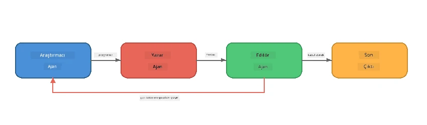
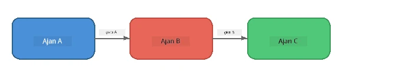
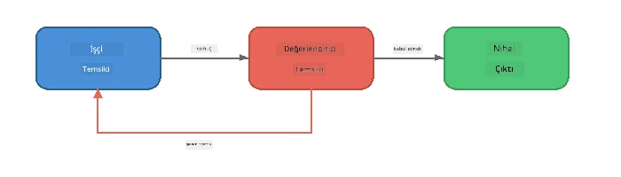
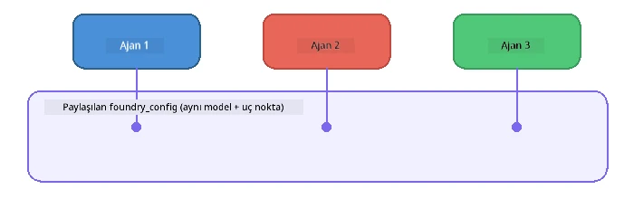

# Bölüm 6: Çoklu Ajan İş Akışları

> **Amaç:** Birden fazla uzmanlaşmış ajanı, işbirliği yapan ajanlar arasında karmaşık görevleri bölen koordine edilmiş boru hatlarında birleştirin - hepsi Foundry Local ile yerel olarak çalışıyor.

## Neden Çoklu Ajan?

Tek bir ajan birçok görevi yerine getirebilir, ancak karmaşık iş akışları **Uzmanlaşmadan** faydalanır. Bir ajanın aynı anda araştırma yapmaya, yazmaya ve düzenlemeye çalışması yerine işi odaklanmış rollere bölersiniz:



| Desen | Açıklama |
|---------|-------------|
| **Sıralı** | Ajan A'nın çıktısı Ajan B'ye → Ajan C'ye beslenir |
| **Geri bildirim döngüsü** | Bir değerlendirici ajan işi revizyon için geri gönderebilir |
| **Paylaşılan bağlam** | Tüm ajanlar aynı model/endpoint'i kullanır, ancak farklı talimatlar alır |
| **Tiplenmiş çıktı** | Ajanlar, güvenilir teslimatlar için yapılandırılmış sonuçlar (JSON) üretir |

---

## Alıştırmalar

### Alıştırma 1 - Çoklu Ajan Boru Hattını Çalıştır

Atölye tam bir Araştırmacı → Yazar → Editör iş akışını içerir.

<details>
<summary><strong>🐍 Python</strong></summary>

**Kurulum:**
```bash
cd python
python -m venv venv

# Windows (PowerShell):
venv\Scripts\Activate.ps1
# macOS:
source venv/bin/activate

pip install -r requirements.txt
```

**Çalıştırma:**
```bash
python foundry-local-multi-agent.py
```

**Ne olur:**
1. **Araştırmacı** bir konu alır ve madde maddeleri gerçekleri döner
2. **Yazar** araştırmayı alır ve bir blog yazısı taslağı hazırlar (3-4 paragraf)
3. **Editör** makaleyi kalite açısından inceler ve KABUL veya REVİZE döner

</details>

<details>
<summary><strong>📦 JavaScript</strong></summary>

**Kurulum:**
```bash
cd javascript
npm install
```

**Çalıştırma:**
```bash
node foundry-local-multi-agent.mjs
```

**Aynı üç aşamalı boru hattı** - Araştırmacı → Yazar → Editör.

</details>

<details>
<summary><strong>💜 C#</strong></summary>

**Kurulum:**
```bash
cd csharp
dotnet restore
```

**Çalıştırma:**
```bash
dotnet run multi
```

**Aynı üç aşamalı boru hattı** - Araştırmacı → Yazar → Editör.

</details>

---

### Alıştırma 2 - Boru Hattının Anatomisi

Ajanların nasıl tanımlandığını ve bağlandığını inceleyin:

**1. Paylaşılan model istemcisi**

Tüm ajanlar aynı Foundry Local modelini paylaşır:

```python
# Python - FoundryLocalClient her şeyi yönetir
from agent_framework_foundry_local import FoundryLocalClient

client = FoundryLocalClient(model_id="phi-3.5-mini")
```

```javascript
// JavaScript - Foundry Local'a işaret eden OpenAI SDK
const client = new OpenAI({
  baseURL: manager.urls[0] + "/v1",
  apiKey: "foundry-local",
});
```

```csharp
// C# - OpenAIClient pointed at Foundry Local
var key = new ApiKeyCredential("foundry-local");
var client = new OpenAIClient(key, new OpenAIClientOptions
{
    Endpoint = new Uri(manager.Urls[0] + "/v1")
});
var chatClient = client.GetChatClient(model.Id);
```

**2. uzmanlaşmış talimatlar**

Her ajanın farklı bir kişiliği vardır:

| Ajan | Talimatlar (özet) |
|-------|----------------------|
| Araştırmacı | "Önemli gerçekler, istatistikler ve arka plan bilgisi verin. Madde işaretleri halinde düzenleyin." |
| Yazar | "Araştırma notlarından etkileyici bir blog yazısı yazın (3-4 paragraf). Gerçekleri uydurmayın." |
| Editör | "Açıklık, dilbilgisi ve gerçek tutarlılığını gözden geçirin. Karar: KABUL veya REVİZE." |

**3. Ajanlar arasındaki veri akışı**

```python
# 1. Adım - araştırmacıdan çıkan sonuç yazarın girdisi olur
research_result = await researcher.run(f"Research: {topic}")

# 2. Adım - yazardan çıkan sonuç editörün girdisi olur
writer_result = await writer.run(f"Write using:\n{research_result}")

# 3. Adım - editör hem araştırmayı hem makaleyi inceler
editor_result = await editor.run(
    f"Research:\n{research_result}\n\nArticle:\n{writer_result}"
)
```

```csharp
// C# - same pattern, async calls with AIAgent
var researchNotes = await researcher.RunAsync(
    $"Research the following topic and provide key facts:\n{topic}");

var draft = await writer.RunAsync(
    $"Write a blog post based on these research notes:\n\n{researchNotes}");

var verdict = await editor.RunAsync(
    $"Review this article for quality and accuracy.\n\n" +
    $"Research notes:\n{researchNotes}\n\n" +
    $"Article:\n{draft}");
```

> **Ana fikir:** Her ajan, önceki ajanlardan gelen birikimli bağlamı alır. Editör hem orijinal araştırmayı hem de taslağı görür - bu, gerçek tutarlılığını kontrol etmesini sağlar.

---

### Alıştırma 3 - Dördüncü Bir Ajan Ekleyin

Boru hattına yeni bir ajan ekleyin. Birini seçin:

| Ajan | Amaç | Talimatlar |
|-------|---------|-------------|
| **Gerçek Kontrolcüsü** | Makaledeki iddiaları doğrula | `"Faktual iddiaları doğrularsınız. Her iddia için, araştırma notları tarafından desteklenip desteklenmediğini belirtin. Doğrulanmış/doğrulanmamış öğelerle JSON döndürün."` |
| **Başlık Yazarı** | Çekici başlıklar oluştur | `"Makale için 5 başlık seçeneği üretin. Stil çeşitlendirin: bilgilendirici, tıklama tuzağı, soru, liste, duygusal."` |
| **Sosyal Medya** | Promosyon gönderileri oluştur | `"Bu makaleyi tanıtan 3 sosyal medya gönderisi oluşturun: biri Twitter için (280 karakter), biri LinkedIn için (profesyonel ton), biri Instagram için (rahat, emoji önerileriyle)."` |

<details>
<summary><strong>🐍 Python - Başlık Yazarı ekleme</strong></summary>

```python
headline_agent = client.as_agent(
    name="HeadlineWriter",
    instructions=(
        "You are a headline specialist. Given an article, generate exactly "
        "5 headline options. Vary the style: informative, question-based, "
        "listicle, emotional, and provocative. Return them as a numbered list."
    ),
)

# Editör kabul ettikten sonra, başlıklar oluşturun
headline_result = await headline_agent.run(
    f"Generate headlines for this article:\n\n{writer_result}"
)
print(f"\n--- Headlines ---\n{headline_result}")
```

</details>

<details>
<summary><strong>📦 JavaScript - Başlık Yazarı ekleme</strong></summary>

```javascript
const headlineAgent = new ChatAgent({
  client,
  modelId: modelInfo.id,
  instructions:
    "You are a headline specialist. Given an article, generate exactly " +
    "5 headline options. Vary the style: informative, question-based, " +
    "listicle, emotional, and provocative. Return them as a numbered list.",
  name: "HeadlineWriter",
});

const headlineResult = await headlineAgent.run(
  `Generate headlines for this article:\n\n${writerResult.text}`
);
console.log(`\n--- Headlines ---\n${headlineResult.text}`);
```

</details>

<details>
<summary><strong>💜 C# - Başlık Yazarı ekleme</strong></summary>

```csharp
AIAgent headlineAgent = chatClient.AsAIAgent(
    name: "HeadlineWriter",
    instructions:
        "You are a headline specialist. Given an article, generate exactly " +
        "5 headline options. Vary the style: informative, question-based, " +
        "listicle, emotional, and provocative. Return them as a numbered list."
);

// After the editor accepts, generate headlines
var headlines = await headlineAgent.RunAsync(
    $"Generate headlines for this article:\n\n{draft}");
Console.WriteLine($"\n--- Headlines ---\n{headlines}");
```

</details>

---

### Alıştırma 4 - Kendi İş Akışınızı Tasarlayın

Farklı bir alan için çoklu ajan boru hattı tasarlayın. İşte bazı fikirler:

| Alan | Ajanlar | Akış |
|--------|--------|------|
| **Kod İncelemesi** | Analizci → İnceleyen → Özetleyici | Kod yapısını analiz et → sorunları incele → özet rapor oluştur |
| **Müşteri Desteği** | Sınıflandırıcı → Yanıtlayıcı → Kalite Kontrol | Talebi sınıflandır → yanıt taslağı oluştur → kaliteyi kontrol et |
| **Eğitim** | Sınav Hazırlayıcı → Öğrenci Simülatörü → Notlayıcı | Sınav oluştur → cevapları simüle et → notlandır ve açıkla |
| **Veri Analizi** | Yorumlayıcı → Analist → Muhabir | Veri isteğini yorumla → desenleri analiz et → rapor yaz |

**Adımlar:**
1. Farklı `talimatlar`a sahip 3+ ajan tanımlayın
2. Veri akışına karar verin - her ajan ne alır ve ne üretir?
3. Alıştırma 1-3’teki desenleri kullanarak boru hattını uygulayın
4. Eğer bir ajan diğerinin işini değerlendirecekse bir geri bildirim döngüsü ekleyin

---

## Orkestrasyon Desenleri

Her çoklu ajan sistemi için geçerli olan orkestrasyon desenleri (derinlemesine [Bölüm 7](part7-zava-creative-writer.md)da incelenmiştir):

### Sıralı Boru Hattı



Her ajan, öncekinin çıktısını işler. Basit ve öngörülebilir.

### Geri Bildirim Döngüsü



Bir değerlendirici ajan, önceki aşamaların yeniden çalıştırılmasını tetikleyebilir. Zava Yazar bunu kullanır: editör, araştırmacı ve yazara geri bildirim gönderebilir.

### Paylaşılan Bağlam



Tüm ajanlar tek bir `foundry_config` paylaşır, böylece aynı model ve endpoint kullanılır.

---

## Temel Çıkarımlar

| Kavram | Öğrendikleriniz |
|---------|-----------------|
| Ajan Uzmanlaşması | Her ajan odaklanmış talimatlarla bir işi iyi yapar |
| Veri teslimleri | Bir ajanın çıktısı diğerinin girdisi olur |
| Geri bildirim döngüleri | Bir değerlendirici daha yüksek kalite için yeniden denemeleri tetikleyebilir |
| Yapılandırılmış çıktı | JSON biçimindeki yanıtlar güvenilir ajanlar arası iletişim sağlar |
| Orkestrasyon | Bir koordinatör boru hattı sırasını ve hata yönetimini yönetir |
| Üretim desenleri | [Bölüm 7: Zava Creative Writer](part7-zava-creative-writer.md)da uygulandı |

---

## Sonraki Adımlar

[Part 7: Zava Creative Writer - Capstone Application](part7-zava-creative-writer.md) bölümüne devam ederek, 4 uzman ajan, akışlı çıktı, ürün araması ve geri bildirim döngüleri içeren üretim tarzı çoklu ajan uygulamasını Python, JavaScript ve C# dillerinde keşfedin.