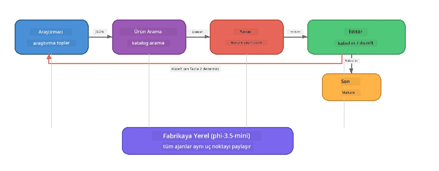

# Bölüm 7: Zava Yaratıcı Yazar - Kapanış Uygulaması

> **Hedef:** Foundry Local ile tamamen cihazınızda çalışan, dört uzmanlaşmış ajanın iş birliğiyle Zava Retail DIY için dergi kalitesinde makaleler üreten üretim tarzı çoklu ajan uygulamasını keşfedin.

Bu atölyenin **kapanış laboratuvarı**dır. Öğrendiğiniz her şeyi bir araya getirir - SDK entegrasyonu (Bölüm 3), yerel veriden getirme (Bölüm 4), ajan kişilikleri (Bölüm 5) ve çoklu ajan orkestrasyonu (Bölüm 6) - tamamen **Python**, **JavaScript** ve **C#** dillerinde kullanılabilen tam bir uygulamaya dönüştürür.

---

## Keşfedecekleriniz

| Kavram | Zava Yazar içinde Nerede |
|---------|----------------------------|
| 4 adımlı model yükleme | Ortak konfigürasyon modülü Foundry Local'ı başlatır |
| RAG tarzı getirme | Ürün ajanı yerel kataloğu arar |
| Ajan Uzmanlığı | 4 farklı sistem istemine sahip ajans |
| Akış halinde çıktı | Yazar gerçek zamanlı token üretir |
| Yapılandırılmış devralmalar | Araştırmacı → JSON, Editör → JSON kararı |
| Geri bildirim döngüleri | Editör yeniden yürütmeyi tetikleyebilir (max 2 deneme) |

---

## Mimari

Zava Yaratıcı Yazar, **değerlendirici tarafından yönlendirilen geribildirimli ardışık bir iş akışı** kullanır. Üç dildeki implementasyon aynı mimariye sahiptir:



### Dört Ajan

| Ajan | Girdi | Çıktı | Amaç |
|-------|-------|--------|---------|
| **Araştırmacı** | Konu + isteğe bağlı geribildirim | `{"web": [{url, name, description}, ...]}` | LLM ile arka plan araştırması toplar |
| **Ürün Arama** | Ürün bağlamı dizesi | Eşleşen ürün listesi | LLM tarafından oluşturulan sorgular + yerel katalogda anahtar kelime araması |
| **Yazar** | Araştırma + ürünler + görev + geribildirim | Akış halinde makale metni (`---` ile bölünür) | Gerçek zamanlı dergi kalitesinde makale taslağı hazırlar |
| **Editör** | Makale + yazarın kendi geribildirimi | `{"decision": "accept/revise", "editorFeedback": "...", "researchFeedback": "..."}` | Kaliteyi inceler, gerekirse yeniden denemeyi tetikler |

### İş Akışı

1. **Araştırmacı** konu alır ve yapılandırılmış araştırma notları üretir (JSON)
2. **Ürün Arama** LLM tarafından oluşturulan arama terimlerini kullanarak yerel ürün kataloğunu sorgular
3. **Yazar** araştırma + ürünler + görevi birleştirerek makaleyi akış halinde oluşturur, `---` ayırıcıdan sonra kendi geribildirimini ekler
4. **Editör** makaleyi inceler ve JSON kararı döner:
   - `"accept"` → iş akışı tamamlanır
   - `"revise"` → geribildirim Araştırmacı ve Yazara gönderilir (max 2 deneme)

---

## Gereksinimler

- [Bölüm 6: Çoklu Ajan İş Akışları](part6-multi-agent-workflows.md) tamamlanmış olmalı
- Foundry Local CLI kurulmuş ve `phi-3.5-mini` modeli indirilmiş olmalı

---

## Alıştırmalar

### Alıştırma 1 - Zava Yaratıcı Yazarı Çalıştırın

Dil seçin ve uygulamayı çalıştırın:

<details>
<summary><strong>🐍 Python - FastAPI Web Servisi</strong></summary>

Python versiyonu bir **web servisi** olarak REST API sunar, üretim tipi arka uç geliştirmenin nasıl yapıldığını gösterir.

**Kurulum:**
```bash
cd zava-creative-writer-local/src/api
python -m venv venv

# Windows (PowerShell):
venv\Scripts\Activate.ps1
# macOS:
source venv/bin/activate

pip install -r requirements.txt
```

**Çalıştırma:**
```bash
uvicorn main:app --reload
```

**Test:**
```bash
curl -X POST http://localhost:8000/api/article \
  -H "Content-Type: application/json" \
  -d '{
    "research": "DIY home improvement trends",
    "products": "power tools and paints",
    "assignment": "Write an article about weekend renovation projects for DIY enthusiasts"
  }'
```

Yanıt, her ajanın ilerlemesini gösteren satır sonu ayrılmış JSON mesajları olarak akış halinde döner.

</details>

<details>
<summary><strong>📦 JavaScript - Node.js CLI</strong></summary>

JavaScript versiyonu bir **CLI uygulaması** olarak çalışır, ajan ilerlemeleri ve makaleyi doğrudan konsola yazdırır.

**Kurulum:**
```bash
cd zava-creative-writer-local/src/javascript
npm install
```

**Çalıştırma:**
```bash
node main.mjs
```

Şunları göreceksiniz:
1. Foundry Local model yüklemesi (indirme varsa ilerleme çubuğu ile)
2. Her ajanın sırasıyla yürütülmesi ve durum mesajları
3. Konsola gerçek zamanlı makale akışı
4. Editörün kabul/revizyon kararı

</details>

<details>
<summary><strong>💜 C# - .NET Konsol Uygulaması</strong></summary>

C# versiyonu aynı iş akışına ve akış şeklinde çıktı üretimine sahip bir **.NET konsol uygulaması**dır.

**Kurulum:**
```bash
cd zava-creative-writer-local/src/csharp
dotnet restore
```

**Çalıştırma:**
```bash
dotnet run
```

JavaScript versiyonuyla aynı çıktı kalıbı - ajan durum mesajları, akış halinde makale ve editör kararı.

</details>

---

### Alıştırma 2 - Kod Yapısını İnceleyin

Her dilin uygulaması aynı mantıksal bileşenlere sahiptir. Yapıları karşılaştırın:

**Python** (`src/api/`):
| Dosya | Amaç |
|------|---------|
| `foundry_config.py` | Ortak Foundry Local yöneticisi, model ve istemci (4 adımlı başlatma) |
| `orchestrator.py` | İş akışı koordinasyonu ve geribildirim döngüsü |
| `main.py` | FastAPI uç noktaları (`POST /api/article`) |
| `agents/researcher/researcher.py` | LLM tabanlı araştırma ve JSON çıktı |
| `agents/product/product.py` | LLM oluşturmalı sorgular + anahtar kelime araması |
| `agents/writer/writer.py` | Akış halinde makale üretimi |
| `agents/editor/editor.py` | JSON tabanlı kabul/revizyon kararı |

**JavaScript** (`src/javascript/`):
| Dosya | Amaç |
|------|---------|
| `foundryConfig.mjs` | Ortak Foundry Local konfigürasyonu (ilerleme çubuğu ile 4 adımlı başlatma) |
| `main.mjs` | Orkestratör + CLI giriş noktası |
| `researcher.mjs` | LLM tabanlı araştırma ajanı |
| `product.mjs` | LLM sorgu oluşturma + anahtar kelime araması |
| `writer.mjs` | Akış halinde makale üretimi (async generator) |
| `editor.mjs` | JSON kabul/revizyon kararı |
| `products.mjs` | Ürün katalog verisi |

**C#** (`src/csharp/`):
| Dosya | Amaç |
|------|---------|
| `Program.cs` | Tam iş akışı: model yükleme, ajanlar, orkestratör, geribildirim döngüsü |
| `ZavaCreativeWriter.csproj` | Foundry Local + OpenAI paketleri içeren .NET 9 projesi |

> **Tasarım notu:** Python her ajanı kendi dosya/dizininde tutar (büyük ekipler için iyi). JavaScript ajan başına bir modül kullanır (orta ölçek projeler için uygun). C# her şeyi tek dosyada yerel fonksiyonlarla tutar (kendi içinde örnekler için iyi). Üretimde, ekibinizin alışkanlıklarına uygun deseni seçin.

---

### Alıştırma 3 - Paylaşılan Konfigürasyonu İzleyin

İş akışındaki her ajan tek bir Foundry Local model istemcisini paylaşır. Bunu her dilde nasıl kurulduğunu inceleyin:

<details>
<summary><strong>🐍 Python - foundry_config.py</strong></summary>

```python
from foundry_local import FoundryLocalManager

MODEL_ALIAS = "phi-3.5-mini"

# Adım 1: Yönetici oluşturun ve Foundry Yerel servisini başlatın
manager = FoundryLocalManager()
manager.start_service()

# Adım 2: Modelin zaten indirilip indirilmediğini kontrol edin
cached = manager.list_cached_models()
catalog_info = manager.get_model_info(MODEL_ALIAS)
is_cached = any(m.id == catalog_info.id for m in cached) if catalog_info else False

if not is_cached:
    manager.download_model(MODEL_ALIAS)

# Adım 3: Modeli belleğe yükleyin
manager.load_model(MODEL_ALIAS)
model_id = manager.get_model_info(MODEL_ALIAS).id

# Paylaşılan OpenAI istemcisi
client = openai.OpenAI(base_url=manager.endpoint, api_key=manager.api_key)
```

Tüm ajanlar `from foundry_config import client, model_id` olarak içe aktarır.

</details>

<details>
<summary><strong>📦 JavaScript - foundryConfig.mjs</strong></summary>

```javascript
import { FoundryLocalManager } from "foundry-local-sdk";
import { OpenAI } from "openai";

FoundryLocalManager.create({ appName: "ZavaCreativeWriter" });
const manager = FoundryLocalManager.instance;
await manager.startWebService();

// Önbelleği kontrol et → indir → yükle (yeni SDK deseni)
const catalog = manager.catalog;
const model = await catalog.getModel(MODEL_ALIAS);
if (!model.isCached) {
  console.log(`Downloading model: ${MODEL_ALIAS}...`);
  await model.download();
}
await model.load();

const client = new OpenAI({ baseURL: manager.urls[0] + "/v1", apiKey: "foundry-local" });
const modelId = model.id;
export { client, modelId };
```

Tüm ajanlar `import { client, modelId } from "./foundryConfig.mjs"` yapar.

</details>

<details>
<summary><strong>💜 C# - Program.cs üst kısmı</strong></summary>

```csharp
await FoundryLocalManager.CreateAsync(
    new Configuration
    {
        AppName = "ZavaCreativeWriter",
        Web = new Configuration.WebService { Urls = "http://127.0.0.1:0" }
    }, NullLogger.Instance, default);
var manager = FoundryLocalManager.Instance;
await manager.StartWebServiceAsync(default);

var catalog = await manager.GetCatalogAsync(default);
var catalogModel = await catalog.GetModelAsync(alias, default);
var isCached = await catalogModel.IsCachedAsync(default);
if (!isCached)
    await catalogModel.DownloadAsync(null, default);

await catalogModel.LoadAsync(default);
var key = new ApiKeyCredential("foundry-local");
var chatClient = new OpenAIClient(key, new OpenAIClientOptions
{
    Endpoint = new Uri(manager.Urls[0] + "/v1")
}).GetChatClient(catalogModel.Id);
```

`chatClient`, aynı dosyada tüm ajan fonksiyonlarına iletilir.

</details>

> **Ana desen:** Model yükleme deseni (servisi başlat → önbellek kontrol et → indir → yükle) kullanıcının ilerlemeyi net görmesini sağlar ve modeli yalnızca bir kez indirir. Bu, Foundry Local uygulamaları için en iyi uygulamadır.

---

### Alıştırma 4 - Geri Bildirim Döngüsünü Anlayın

Geri bildirim döngüsü akışı "akıllı" yapan şeydir - Editör çalışmayı revizyona gönderebilir. Mantığı izleyin:

```
Orchestrator:
  1. researcher.research(topic, "No Feedback")    ← first pass
  2. product.findProducts(productContext)
  3. writer.write(research, products, assignment)  ← streams article
  4. Split article at "---" → article + writerFeedback
  5. editor.edit(article, writerFeedback)

  WHILE editor says "revise" AND retryCount < 2:
    6. researcher.research(topic, editor.researchFeedback)  ← refined
    7. writer.write(research, products, editor.editorFeedback)
    8. editor.edit(newArticle, newWriterFeedback)
    9. retryCount++
```

**Düşünülmesi gerekenler:**
- Neden deneme sınırı 2 olarak ayarlanmış? Artırırsanız ne olur?
- Neden araştırmacı `researchFeedback` alırken yazar `editorFeedback` alıyor?
- Editör hep "revize et" derse ne olur?

---

### Alıştırma 5 - Bir Ajanı Değiştirin

Bir ajan davranışını değiştirip iş akışındaki etkisini gözlemleyin:

| Değişiklik | Ne Değiştirilmeli |
|-------------|------------------|
| **Daha katı editör** | Editörün sistem istemini her zaman en az bir revizyon isteyecek şekilde değiştirin |
| **Daha uzun makaleler** | Yazarın istemini "800-1000 kelime"den "1500-2000 kelime"ye değiştirin |
| **Farklı ürünler** | Ürün kataloguna ürün ekleyin veya değiştirin |
| **Yeni araştırma konusu** | Varsayılan `researchContext`i farklı bir konuya ayarlayın |
| **Sadece JSON araştırmacı** | Araştırmacının 3-5 yerine 10 madde döndürmesini sağlayın |

> **İpucu:** Üç dilin hepsi aynı mimariyi kullandığı için, en rahat olduğunuz dilde aynı değişikliği yapabilirsiniz.

---

### Alıştırma 6 - Beşinci Bir Ajan Ekleyin

İş akışını yeni bir ajanla genişletin. Bazı fikirler:

| Ajan | İş Akışında Nerede | Amaç |
|-------|-------------------|---------|
| **Doğrulayıcı** | Yazar sonrası, Editör öncesi | Araştırma verilerine karşı iddiaları doğrular |
| **SEO Optimizatörü** | Editör kabul ettikten sonra | Meta açıklama, anahtar kelimeler, slug ekler |
| **İllüstratör** | Editör kabul ettikten sonra | Makale için görsel istemleri oluşturur |
| **Çevirmen** | Editör kabul ettikten sonra | Makaleyi başka bir dile çevirir |

**Adımlar:**
1. Ajanın sistem istemini yazın
2. Ajan fonksiyonunu oluşturun (dilinize uygun var olan kalıpla uyumlu)
3. Orkestratörde doğru yere ekleyin
4. Çıktı/kayıtta yeni ajanın katkısını gösterin

---

## Foundry Local ve Ajan Çerçevesi Nasıl Birlikte Çalışır

Bu uygulama, Foundry Local ile çoklu ajan sistemlerinin oluşturulmasında önerilen modeli gösterir:

| Katman | Bileşen | Rolü |
|-------|-----------|------|
| **Çalışma Zamanı** | Foundry Local | Modeli indirir, yönetir ve yerel olarak sunar |
| **İstemci** | OpenAI SDK | Yerel uç noktaya sohbet tamamlama istekleri gönderir |
| **Ajan** | Sistem istemi + sohbet çağrısı | Odaklanmış talimatlarla uzmanlaşmış davranış |
| **Orkestratör** | İş akışı koordinatörü | Veri akışını, sıralamayı ve geribildirim döngülerini yönetir |
| **Çerçeve** | Microsoft Agent Framework | `ChatAgent` soyutlamasını ve kalıplarını sağlar |

Önemli çıktı: **Foundry Local bulut altyapısının yerini alır, uygulama mimarisini değiştirmez.** Bulutta barındırılan modellerle çalışan ajan kalıpları, orkestrasyon stratejileri ve yapılandırılmış devralmalar yerel modellerle tamamen aynıdır — istemciyi Azure uç noktası yerine yerel uç noktaya yönlendirmeniz yeterlidir.

---

## Ana Çıkarımlar

| Kavram | Öğrendikleriniz |
|---------|-----------------|
| Üretim mimarisi | Ortak konfigürasyon ve ayrı ajanlarla çoklu ajan uygulama yapısı |
| 4 adımlı model yükleme | Foundry Local'i kullanıcıya görünür ilerlemeyle başlatma en iyi uygulaması |
| Ajan Uzmanlığı | 4 ajanın her birinin odaklanmış talimatları ve spesifik çıktı formatı var |
| Akış halinde üretim | Yazar gerçek zamanlı token üretir, hızlı tepki veren arayüz sağlar |
| Geri bildirim döngüleri | Editör tarafından tetiklenen yeniden deneme insan müdahalesi olmadan kaliteyi artırır |
| Çok dilli kalıplar | Aynı mimari Python, JavaScript ve C#’ta çalışır |
| Yerel = üretime hazır | Foundry Local, bulut dağıtımlarında kullanılan OpenAI uyumlu API’yi sağlar |

---

## Sonraki Adım

Ajanslarınız için sistematik değerlendirme çerçevesi oluşturmak üzere [Bölüm 8: Değerlendirme Odaklı Geliştirme](part8-evaluation-led-development.md) bölümüne devam edin; altın veri setleri, kural tabanlı kontroller ve LLM-hakem puanlama sistemleri kullanacaksınız.