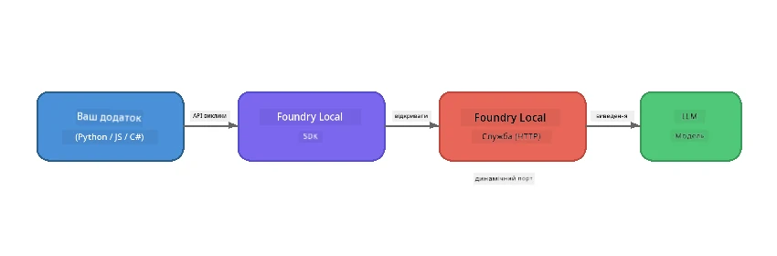

# Part 1: Початок роботи з Foundry Local


## Що таке Foundry Local?

[Foundry Local](https://foundrylocal.ai) дозволяє запускати відкриті AI-моделі мовлення **безпосередньо на вашому комп’ютері** — без інтернету, без витрат на хмару та з повною конфіденційністю даних. Воно:

- **Завантажує та запускає моделі локально** з автоматичною оптимізацією під апаратне забезпечення (GPU, CPU або NPU)
- **Надає OpenAI-сумісний API**, щоб ви могли використовувати знайомі SDK та інструменти
- **Не потребує підписки на Azure** або реєстрації — просто встановіть і починайте працювати

Думайте про це як про власний приватний AI, який повністю працює на вашому пристрої.

## Цілі навчання

До кінця цієї лабораторії ви зможете:

- Встановити Foundry Local CLI на вашу операційну систему
- Зрозуміти, що таке псевдоніми моделей і як вони працюють
- Завантажити та запустити вашу першу локальну AI-модель
- Надіслати чат-повідомлення локальній моделі з командного рядка
- Зрозуміти різницю між локальними та хмарними AI-моделями

---

## Вимоги

### Системні вимоги

| Вимога | Мінімум | Рекомендовано |
|-------------|---------|-------------|
| **ОЗП** | 8 ГБ | 16 ГБ |
| **Місце на диску** | 5 ГБ (для моделей) | 10 ГБ |
| **ЦП** | 4 ядра | 8+ ядер |
| **ГП** | Опційно | NVIDIA з CUDA 11.8+ |
| **ОС** | Windows 10/11 (x64/ARM), Windows Server 2025, macOS 13+ | - |

> **Примітка:** Foundry Local автоматично вибирає найкращий варіант моделі для вашого апаратного забезпечення. Якщо у вас NVIDIA GPU, використовується апаратне прискорення CUDA. Якщо Qualcomm NPU — він використовується. Інакше вибирається оптимізований варіант для CPU.

### Встановлення Foundry Local CLI

**Windows** (PowerShell):
```powershell
winget install Microsoft.FoundryLocal
```

**macOS** (Homebrew):
```bash
brew tap microsoft/foundrylocal
brew install foundrylocal
```

> **Примітка:** Наразі Foundry Local підтримує лише Windows та macOS. Linux поки не підтримується.

Перевірте встановлення:
```bash
foundry --version
```

---

## Лабораторні завдання

### Завдання 1: Огляд доступних моделей

Foundry Local включає каталог попередньо оптимізованих відкритих моделей. Виведіть їх список:

```bash
foundry model list
```

Ви побачите такі моделі:
- `phi-3.5-mini` — модель Microsoft з 3.8 млрд параметрів (швидка, гарна якість)
- `phi-4-mini` — новіша, більш здатна модель Phi
- `phi-4-mini-reasoning` — модель Phi з ланцюговим логічним мисленням (`<think>` теги)
- `phi-4` — найбільша модель Phi від Microsoft (10.4 ГБ)
- `qwen2.5-0.5b` — дуже мала і швидка (добре для малих пристроїв)
- `qwen2.5-7b` — потужна універсальна модель із підтримкою виклику інструментів
- `qwen2.5-coder-7b` — оптимізована для генерації коду
- `deepseek-r1-7b` — потужна модель для логіки
- `gpt-oss-20b` — велика відкрита модель (ліцензія MIT, 12.5 ГБ)
- `whisper-base` — транскрипція мовлення в текст (383 МБ)
- `whisper-large-v3-turbo` — точна транскрипція (9 ГБ)

> **Що таке псевдонім моделі?** Псевдоніми, як `phi-3.5-mini`, — це скорочення. Коли ви використовуєте псевдонім, Foundry Local автоматично завантажує найкращий варіант для вашого апаратного забезпечення (CUDA для NVIDIA GPU, оптимізований для CPU інакше). Вам не потрібно турбуватися про вибір правильного варіанту.

### Завдання 2: Запустіть вашу першу модель

Завантажте та розпочніть інтерактивний чат із моделлю:

```bash
foundry model run phi-3.5-mini
```

При першому запуску Foundry Local:
1. Виявить ваше апаратне забезпечення
2. Завантажить оптимальний варіант моделі (це може зайняти кілька хвилин)
3. Завантажить модель у пам’ять
4. Розпочне інтерактивну чат-сесію

Спробуйте поставити їй кілька питань:
```
You: What is the golden ratio?
You: Can you explain it as if I were 10 years old?
You: Write a haiku about mathematics
```

Введіть `exit` або натисніть `Ctrl+C`, щоб вийти.

### Завдання 3: Попереднє завантаження моделі

Якщо ви хочете завантажити модель без запуску чату:

```bash
foundry model download phi-3.5-mini
```

Перевірте, які моделі вже завантажені на вашому пристрої:

```bash
foundry cache list
```

### Завдання 4: Розуміння архітектури

Foundry Local працює як **локальний HTTP сервіс**, який надає OpenAI-сумісний REST API. Це означає:

1. Сервіс запускається на **динамічному порту** (на різних портах щоразу)
2. Ви використовуєте SDK, щоб дізнатися фактичну URL-адресу
3. Ви можете використовувати **будь-яку** OpenAI-сумісну клієнтську бібліотеку для з’єднання



> **Важливо:** Foundry Local кожного разу призначає **динамічний порт** при запуску. Ніколи не прописуйте порт жорстко, наприклад `localhost:5272`. Завжди використовуйте SDK, щоб отримати актуальну адресу (наприклад, `manager.endpoint` у Python або `manager.urls[0]` у JavaScript).

---

## Основні висновки

| Концепція | Що ви дізналися |
|---------|------------------|
| AI на пристрої | Foundry Local запускає моделі повністю на вашому пристрої без хмари, API-ключів і витрат |
| Псевдоніми моделей | Псевдоніми, як `phi-3.5-mini`, автоматично вибирають найкращий варіант для вашого обладнання |
| Динамічні порти | Сервіс працює на динамічному порту; завжди використовуйте SDK для отримання адреси |
| CLI та SDK | Ви можете взаємодіяти з моделями через CLI (`foundry model run`) або програмно через SDK |

---

## Наступні кроки

Продовжуйте [Part 2: Foundry Local SDK Deep Dive](part2-foundry-local-sdk.md), щоб опанувати API SDK для керування моделями, сервісами та кешуванням програмним способом.

---

<!-- CO-OP TRANSLATOR DISCLAIMER START -->
**Відмова від відповідальності**:  
Цей документ був перекладений за допомогою сервісу AI-перекладу [Co-op Translator](https://github.com/Azure/co-op-translator). Хоча ми прагнемо до точності, будь ласка, майте на увазі, що автоматичні переклади можуть містити помилки або неточності. Оригінальний документ рідною мовою слід вважати авторитетним джерелом. Для критичної інформації рекомендується професійний людський переклад. Ми не несемо відповідальності за будь-які непорозуміння або неправильні тлумачення, що виникли унаслідок використання цього перекладу.
<!-- CO-OP TRANSLATOR DISCLAIMER END -->