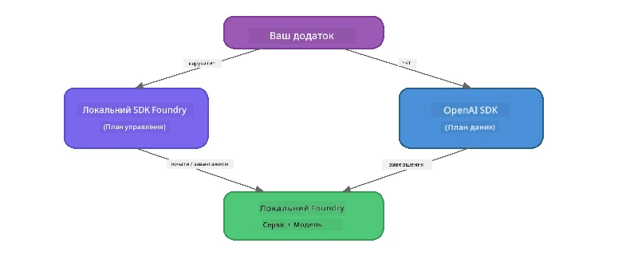

# Частина 3: Використання Foundry Local SDK з OpenAI

## Огляд

У Частині 1 ви використовували Foundry Local CLI для інтерактивного запуску моделей. У Частині 2 ви ознайомилися з повною поверхнею API SDK. Тепер ви навчитеся **інтегрувати Foundry Local у ваші додатки** за допомогою SDK та сумісного з OpenAI API.

Foundry Local надає SDK для трьох мов. Оберіть ту, з якою ви почуваєтеся найкомфортніше — концепції однакові для всіх трьох.

## Мети навчання

Наприкінці цього лабораторного заняття ви зможете:

- Встановити Foundry Local SDK для вашої мови (Python, JavaScript або C#)
- Ініціалізувати `FoundryLocalManager` для запуску сервісу, перевірки кешу, завантаження та завантаження моделі
- Підключитися до локальної моделі за допомогою OpenAI SDK
- Надсилати завершення чату та обробляти потокові відповіді
- Розуміти архітектуру динамічних портів

---

## Необхідні умови

Спочатку завершіть [Частину 1: Початок роботи з Foundry Local](part1-getting-started.md) та [Частину 2: Детальний огляд Foundry Local SDK](part2-foundry-local-sdk.md).

Встановіть **одне** з наступних середовищ виконання мови:
- **Python 3.9+** - [python.org/downloads](https://www.python.org/downloads/)
- **Node.js 18+** - [nodejs.org](https://nodejs.org/)
- **.NET 9.0+** - [dot.net/download](https://dotnet.microsoft.com/download)

---

## Концепція: Як працює SDK

Foundry Local SDK керує **площиною контролю** (запуск сервісу, завантаження моделей), тоді як OpenAI SDK обробляє **площину даних** (надіслання запитів, отримання завершень).



---

## Лабораторні вправи

### Вправа 1: Налаштуйте своє середовище

<details>
<summary><b>🐍 Python</b></summary>

```bash
cd python
python -m venv venv

# Активуйте віртуальне середовище:
# Windows (PowerShell):
venv\Scripts\Activate.ps1
# Windows (Командний рядок):
venv\Scripts\activate.bat
# macOS:
source venv/bin/activate

pip install -r requirements.txt
```

Файл `requirements.txt` інсталює:
- `foundry-local-sdk` - Foundry Local SDK (імпортується як `foundry_local`)
- `openai` - OpenAI Python SDK
- `agent-framework` - Microsoft Agent Framework (використовується у подальших частинах)

</details>

<details>
<summary><b>📘 JavaScript</b></summary>

```bash
cd javascript
npm install
```

Файл `package.json` інсталює:
- `foundry-local-sdk` - Foundry Local SDK
- `openai` - OpenAI Node.js SDK

</details>

<details>
<summary><b>💜 C#</b></summary>

```bash
cd csharp
dotnet restore
dotnet build
```

Файл `csharp.csproj` використовує:
- `Microsoft.AI.Foundry.Local` - Foundry Local SDK (NuGet)
- `OpenAI` - OpenAI C# SDK (NuGet)

> **Структура проєкту:** Проєкт C# використовує роутер командного рядка у `Program.cs`, який виконує різні приклади. Запустіть `dotnet run chat` (або просто `dotnet run`) для цієї частини. Інші частини використовують `dotnet run rag`, `dotnet run agent` та `dotnet run multi`.

</details>

---

### Вправа 2: Базове завершення чату

Відкрийте базовий приклад чату для вашої мови і перегляньте код. Кожен скрипт слідує однаковій триетапній схемі:

1. **Запустіть сервіс** — `FoundryLocalManager` запускає середовище Foundry Local
2. **Завантажте модель у пам’ять** — перевірте кеш, за потреби завантажте, потім завантажте в пам’ять
3. **Створіть клієнт OpenAI** — підключіться до локального ендпоінту і надішліть потокове завершення чату

<details>
<summary><b>🐍 Python - <code>python/foundry-local.py</code></b></summary>

```python
import sys
import openai
from foundry_local import FoundryLocalManager

alias = "phi-3.5-mini"

# Крок 1: Створіть FoundryLocalManager та запустіть сервіс
print("Starting Foundry Local service...")
manager = FoundryLocalManager()
manager.start_service()

# Крок 2: Перевірте, чи модель вже завантажена
cached = manager.list_cached_models()
catalog_info = manager.get_model_info(alias)
is_cached = any(m.id == catalog_info.id for m in cached) if catalog_info else False

if is_cached:
    print(f"Model already downloaded: {alias}")
else:
    print(f"Downloading model: {alias} (this may take several minutes)...")
    manager.download_model(alias)
    print(f"Download complete: {alias}")

# Крок 3: Завантажте модель у пам’ять
print(f"Loading model: {alias}...")
manager.load_model(alias)

# Створіть клієнта OpenAI, що вказує на локальний сервіс Foundry
client = openai.OpenAI(
    base_url=manager.endpoint,   # Динамічний порт — ніколи не жорстко прописуйте!
    api_key=manager.api_key
)

# Згенеруйте потокове завершення чату
stream = client.chat.completions.create(
    model=manager.get_model_info(alias).id,
    messages=[{"role": "user", "content": "What is the golden ratio?"}],
    stream=True,
)

for chunk in stream:
    if chunk.choices[0].delta.content is not None:
        print(chunk.choices[0].delta.content, end="", flush=True)
print()
```

**Запуск:**
```bash
python foundry-local.py
```

</details>

<details>
<summary><b>📘 JavaScript - <code>javascript/foundry-local.mjs</code></b></summary>

```javascript
import { OpenAI } from "openai";
import { FoundryLocalManager } from "foundry-local-sdk";

const alias = "phi-3.5-mini";

// Крок 1: Запустіть локальний сервіс Foundry
console.log("Starting Foundry Local service...");
FoundryLocalManager.create({ appName: "FoundryLocalWorkshop" });
const manager = FoundryLocalManager.instance;
await manager.startWebService();

// Крок 2: Перевірте, чи модель вже завантажена
const catalog = manager.catalog;
const model = await catalog.getModel(alias);

if (model.isCached) {
  console.log(`Model already downloaded: ${alias}`);
} else {
  console.log(`Downloading model: ${alias} (this may take several minutes)...`);
  await model.download();
  console.log(`Download complete: ${alias}`);
}

// Крок 3: Завантажте модель у пам’ять
console.log(`Loading model: ${alias}...`);
await model.load();
console.log(`Model loaded: ${model.id}`);

// Створіть клієнта OpenAI, спрямованого на локальний сервіс Foundry
const client = new OpenAI({
  baseURL: manager.urls[0] + "/v1",   // Динамічний порт – ніколи не жорстко закодовуйте!
  apiKey: "foundry-local",
});

// Згенеруйте стрімінгове завершення чату
const stream = await client.chat.completions.create({
  model: model.id,
  messages: [{ role: "user", content: "What is the golden ratio?" }],
  stream: true,
});

for await (const chunk of stream) {
  if (chunk.choices[0]?.delta?.content) {
    process.stdout.write(chunk.choices[0].delta.content);
  }
}
console.log();
```

**Запуск:**
```bash
node foundry-local.mjs
```

</details>

<details>
<summary><b>💜 C# - <code>csharp/BasicChat.cs</code></b></summary>

```csharp
using Microsoft.AI.Foundry.Local;
using Microsoft.Extensions.Logging.Abstractions;
using OpenAI;
using OpenAI.Chat;
using System.ClientModel;

var alias = "phi-3.5-mini";

// Step 1: Start the Foundry Local service
Console.WriteLine("Starting Foundry Local service...");
await FoundryLocalManager.CreateAsync(
    new Configuration
    {
        AppName = "FoundryLocalSamples",
        Web = new Configuration.WebService { Urls = "http://127.0.0.1:0" }
    }, NullLogger.Instance, default);
var manager = FoundryLocalManager.Instance;
await manager.StartWebServiceAsync(default);

// Step 2: Get the model from the catalog
var catalog = await manager.GetCatalogAsync(default);
var model = await catalog.GetModelAsync(alias, default);

// Step 3: Check if the model is already downloaded
var isCached = await model.IsCachedAsync(default);

if (isCached)
{
    Console.WriteLine($"Model already downloaded: {alias}");
}
else
{
    Console.WriteLine($"Downloading model: {alias} (this may take several minutes)...");
    await model.DownloadAsync(null, default);
    Console.WriteLine($"Download complete: {alias}");
}

// Step 4: Load the model into memory
Console.WriteLine($"Loading model: {alias}...");
await model.LoadAsync(default);
Console.WriteLine($"Loaded model: {model.Id}");
Console.WriteLine($"Endpoint: {manager.Urls[0]}");

// Create OpenAI client pointing to the LOCAL Foundry service
var key = new ApiKeyCredential("foundry-local");
var client = new OpenAIClient(key, new OpenAIClientOptions
{
    Endpoint = new Uri(manager.Urls[0] + "/v1")  // Dynamic port - never hardcode!
});

var chatClient = client.GetChatClient(model.Id);

// Stream a chat completion
var completionUpdates = chatClient.CompleteChatStreaming("What is the golden ratio?");

foreach (var update in completionUpdates)
{
    if (update.ContentUpdate.Count > 0)
    {
        Console.Write(update.ContentUpdate[0].Text);
    }
}
Console.WriteLine();
```

**Запуск:**
```bash
dotnet run chat
```

</details>

---

### Вправа 3: Експериментуйте з запитами

Коли ваш базовий приклад працюватиме, спробуйте змінити код:

1. **Змініть повідомлення користувача** — спробуйте різні питання
2. **Додайте системний запит** — задайте моделі персоналіті
3. **Вимкніть трансляцію** — встановіть `stream=False` і виведіть повну відповідь одразу
4. **Спробуйте іншу модель** — змініть псевдонім з `phi-3.5-mini` на іншу модель із `foundry model list`

<details>
<summary><b>🐍 Python</b></summary>

```python
# Додайте системний запит - надайте моделі персональність:
stream = client.chat.completions.create(
    model=manager.get_model_info(alias).id,
    messages=[
        {"role": "system", "content": "You are a pirate. Answer everything in pirate speak."},
        {"role": "user", "content": "What is the golden ratio?"}
    ],
    stream=True,
)

# Або вимкніть потокову передачу:
response = client.chat.completions.create(
    model=manager.get_model_info(alias).id,
    messages=[{"role": "user", "content": "What is the golden ratio?"}],
    stream=False,
)
print(response.choices[0].message.content)
```

</details>

<details>
<summary><b>📘 JavaScript</b></summary>

```javascript
// Додайте системний запит - надайте моделі персоналітет:
const stream = await client.chat.completions.create({
  model: modelInfo.id,
  messages: [
    { role: "system", content: "You are a pirate. Answer everything in pirate speak." },
    { role: "user", content: "What is the golden ratio?" },
  ],
  stream: true,
});

// Або вимкніть потокову передачу:
const response = await client.chat.completions.create({
  model: modelInfo.id,
  messages: [{ role: "user", content: "What is the golden ratio?" }],
  stream: false,
});
console.log(response.choices[0].message.content);
```

</details>

<details>
<summary><b>💜 C#</b></summary>

```csharp
// Add a system prompt - give the model a persona:
var completionUpdates = chatClient.CompleteChatStreaming(
    new ChatMessage[]
    {
        new SystemChatMessage("You are a pirate. Answer everything in pirate speak."),
        new UserChatMessage("What is the golden ratio?")
    }
);

// Or turn off streaming:
var response = chatClient.CompleteChat("What is the golden ratio?");
Console.WriteLine(response.Value.Content[0].Text);
```

</details>

---

### Посилання на методи SDK

<details>
<summary><b>🐍 Методи Python SDK</b></summary>

| Метод | Призначення |
|--------|-------------|
| `FoundryLocalManager()` | Створити екземпляр менеджера |
| `manager.start_service()` | Запустити сервіс Foundry Local |
| `manager.list_cached_models()` | Показати моделі, завантажені на ваш пристрій |
| `manager.get_model_info(alias)` | Отримати ID моделі та метадані |
| `manager.download_model(alias, progress_callback=fn)` | Завантажити модель з опцією зворотного виклику прогресу |
| `manager.load_model(alias)` | Завантажити модель у пам’ять |
| `manager.endpoint` | Отримати URL динамічного ендпоінту |
| `manager.api_key` | Отримати API ключ (плейсхолдер для локального використання) |

</details>

<details>
<summary><b>📘 Методи JavaScript SDK</b></summary>

| Метод | Призначення |
|--------|-------------|
| `FoundryLocalManager.create({ appName })` | Створити екземпляр менеджера |
| `FoundryLocalManager.instance` | Отримати сінглтон менеджера |
| `await manager.startWebService()` | Запустити сервіс Foundry Local |
| `await manager.catalog.getModel(alias)` | Отримати модель із каталогу |
| `model.isCached` | Перевірити, чи модель вже завантажена |
| `await model.download()` | Завантажити модель |
| `await model.load()` | Завантажити модель у пам’ять |
| `model.id` | Отримати ID моделі для викликів API OpenAI |
| `manager.urls[0] + "/v1"` | Отримати URL динамічного ендпоінту |
| `"foundry-local"` | API ключ (плейсхолдер для локального використання) |

</details>

<details>
<summary><b>💜 Методи C# SDK</b></summary>

| Метод | Призначення |
|--------|-------------|
| `FoundryLocalManager.CreateAsync(config)` | Створити та ініціалізувати менеджера |
| `manager.StartWebServiceAsync()` | Запустити веб-сервіс Foundry Local |
| `manager.GetCatalogAsync()` | Отримати каталог моделей |
| `catalog.ListModelsAsync()` | Показати всі доступні моделі |
| `catalog.GetModelAsync(alias)` | Отримати конкретну модель за псевдонімом |
| `model.IsCachedAsync()` | Перевірити, чи модель завантажена |
| `model.DownloadAsync()` | Завантажити модель |
| `model.LoadAsync()` | Завантажити модель у пам’ять |
| `manager.Urls[0]` | Отримати URL динамічного ендпоінту |
| `new ApiKeyCredential("foundry-local")` | Облікові дані API ключа для локального використання |

</details>

---

### Вправа 4: Використання вбудованого ChatClient (Альтернатива OpenAI SDK)

У вправах 2 і 3 ви використовували OpenAI SDK для завершення чату. SDK для JavaScript і C# також надають **рідний ChatClient**, що повністю усуває потребу в OpenAI SDK.

<details>
<summary><b>📘 JavaScript - <code>model.createChatClient()</code></b></summary>

```javascript
import { FoundryLocalManager } from "foundry-local-sdk";

const alias = "phi-3.5-mini";

FoundryLocalManager.create({ appName: "ChatClientDemo" });
const manager = FoundryLocalManager.instance;
await manager.startWebService();

const model = await manager.catalog.getModel(alias);
if (!model.isCached) await model.download();
await model.load();

// Імпорт OpenAI не потрібен — отримуйте клієнта безпосередньо з моделі
const chatClient = model.createChatClient();

// Завершення без потокової передачі
const response = await chatClient.completeChat([
  { role: "system", content: "You are a pirate. Answer everything in pirate speak." },
  { role: "user", content: "What is the golden ratio?" }
]);
console.log(response.choices[0].message.content);

// Потокове завершення (використовує зворотній виклик)
await chatClient.completeStreamingChat(
  [{ role: "user", content: "What is the golden ratio?" }],
  (chunk) => {
    if (chunk.choices?.[0]?.delta?.content) {
      process.stdout.write(chunk.choices[0].delta.content);
    }
  }
);
console.log();
```

> **Примітка:** Метод ChatClient `completeStreamingChat()` використовує патерн з **зворотним викликом** (callback), а не асинхронним ітератором. Передайте функцію другим аргументом.

</details>

<details>
<summary><b>💜 C# - <code>model.GetChatClientAsync()</code></b></summary>

```csharp
var catalog = await manager.GetCatalogAsync(default);
var model = await catalog.GetModelAsync("phi-3.5-mini", default);
if (!await model.IsCachedAsync(default))
    await model.DownloadAsync(null, default);
await model.LoadAsync(default);

// No OpenAI NuGet needed — get a client directly from the model
var chatClient = await model.GetChatClientAsync(default);

// Use it like a standard OpenAI ChatClient
var response = chatClient.CompleteChat("What is the golden ratio?");
Console.WriteLine(response.Value.Content[0].Text);
```

</details>

> **Коли що використовувати:**
> | Підхід | Найкраще для |
> |--------|--------------|
> | OpenAI SDK | Повний контроль параметрів, продакшн-застосунки, існуючий код OpenAI |
> | Рідний ChatClient | Швидке прототипування, менше залежностей, простіше налаштування |

---

## Основні висновки

| Концепція | Чого ви навчилися |
|-----------|-------------------|
| Площина контролю | Foundry Local SDK керує запуском сервісу та завантаженням моделей |
| Площина даних | OpenAI SDK опрацьовує завершення чатів та потокові відповіді |
| Динамічні порти | Завжди використовуйте SDK для визначення ендпоінту; ніколи не кодуйте URL напряму |
| Крос-мовність | Та сама схема коду працює на Python, JavaScript і C# |
| Сумісність з OpenAI | Повна сумісність з API OpenAI означає мінімальні зміни існуючого коду |
| Рідний ChatClient | `createChatClient()` (JS) / `GetChatClientAsync()` (C#) є альтернативою OpenAI SDK |

---

## Наступні кроки

Продовжуйте з [Частина 4: Побудова RAG додатка](part4-rag-fundamentals.md), щоб навчитися, як створити конвеєр Retrieval-Augmented Generation, що виконується повністю на вашому пристрої.

---

<!-- CO-OP TRANSLATOR DISCLAIMER START -->
**Відмова від відповідальності**:  
Цей документ було перекладено за допомогою сервісу автоматичного перекладу [Co-op Translator](https://github.com/Azure/co-op-translator). Хоч ми й прагнемо до точності, майте на увазі, що автоматичні переклади можуть містити помилки чи неточності. Оригінальний документ рідною мовою слід вважати авторитетним джерелом. Для критичної інформації рекомендується звертатися до професійного людського перекладу. Ми не несемо відповідальності за будь-які непорозуміння чи неправильні тлумачення, що виникли внаслідок використання цього перекладу.
<!-- CO-OP TRANSLATOR DISCLAIMER END -->