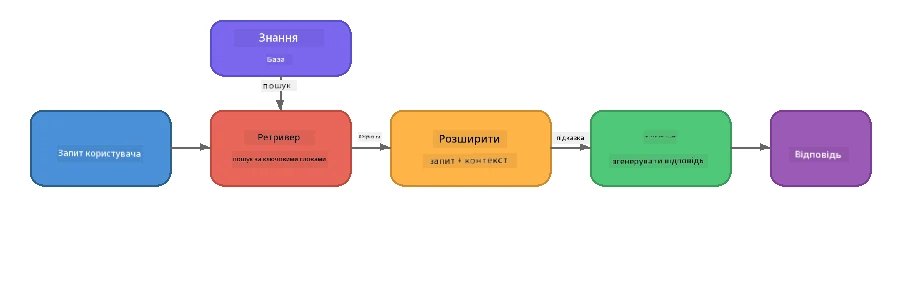

# Частина 4: Створення RAG-додатку з Foundry Local

## Огляд

Великі мовні моделі потужні, але вони знають лише те, що було у їхніх навчальних даних. **Retrieval-Augmented Generation (RAG)** вирішує це, надаючи моделі релевантний контекст під час запиту — отриманий з ваших власних документів, баз даних або баз знань.

У цій лабораторній роботі ви побудуєте повний RAG конвеєр, що працює **повністю на вашому пристрої** з використанням Foundry Local. Жодних хмарних сервісів, жодних векторних баз даних, жодних API для вставок — лише локальне вилучення даних та локальна модель.

## Мети навчання

До кінця цієї лабораторної роботи ви зможете:

- Пояснити, що таке RAG і чому це важливо для AI-додатків
- Створити локальну базу знань з текстових документів
- Реалізувати просту функцію вилучення релевантного контексту
- Скласти системний промпт, який базує модель на вилучених фактах
- Запустити повний конвеєр Retrieve → Augment → Generate на пристрої
- Зрозуміти компроміси між простим пошуком за ключовими словами та векторним пошуком

---

## Вимоги

- Завершити [Частина 3: Використання Foundry Local SDK з OpenAI](part3-sdk-and-apis.md)
- Встановлений Foundry Local CLI та завантажена модель `phi-3.5-mini`

---

## Концепція: Що таке RAG?

Без RAG, LLM може відповідати лише на основі своїх навчальних даних — які можуть бути застарілими, неповними або не містити вашої приватної інформації:

```
User: "What is Zava's return policy?"
LLM:  "I do not have information about Zava's return policy."  ← No context!
```

З RAG ви спочатку **вилучаєте** релевантні документи, а потім **доповнюєте** промпт цим контекстом перед тим, як **генерувати** відповідь:



Ключова ідея: **модель не мусить "знати" відповідь; їй достатньо прочитати правильні документи.**

---

## Лабораторні вправи

### Вправа 1: Ознайомлення з базою знань

Відкрийте приклад RAG для вашої мови та огляньте базу знань:

<details>
<summary><b>🐍 Python: <code>python/foundry-local-rag.py</code></b></summary>

База знань — це простий список словників з полями `title` та `content`:

```python
KNOWLEDGE_BASE = [
    {
        "title": "Foundry Local Overview",
        "content": (
            "Foundry Local brings the power of Azure AI Foundry to your local "
            "device without requiring an Azure subscription..."
        ),
    },
    {
        "title": "Supported Hardware",
        "content": (
            "Foundry Local automatically selects the best model variant for "
            "your hardware. If you have an Nvidia CUDA GPU it downloads the "
            "CUDA-optimized model..."
        ),
    },
    # ... більше записів
]
```

Кожен запис представляє "шматок" знань — сфокусовану інформацію про одну тему.

</details>

<details>
<summary><b>📘 JavaScript: <code>javascript/foundry-local-rag.mjs</code></b></summary>

База знань має ту ж структуру у вигляді масиву об’єктів:

```javascript
const KNOWLEDGE_BASE = [
  {
    title: "Foundry Local Overview",
    content:
      "Foundry Local brings the power of Azure AI Foundry to your local " +
      "device without requiring an Azure subscription...",
  },
  {
    title: "Supported Hardware",
    content:
      "Foundry Local automatically selects the best model variant for " +
      "your hardware...",
  },
  // ... більше записів
];
```

</details>

<details>
<summary><b>💜 C#: <code>csharp/RagPipeline.cs</code></b></summary>

База знань використовується у вигляді списку іменованих кортежів:

```csharp
private static readonly List<(string Title, string Content)> KnowledgeBase =
[
    ("Foundry Local Overview",
     "Foundry Local brings the power of Azure AI Foundry to your local " +
     "device without requiring an Azure subscription..."),

    ("Supported Hardware",
     "Foundry Local automatically selects the best model variant for " +
     "your hardware..."),

    // ... more entries
];
```

</details>

> **У реальному застосунку** база знань береться з файлів на диску, бази даних, індексу пошуку або API. Для цієї лабораторної роботи ми використовуємо список в пам'яті для простоти.

---

### Вправа 2: Ознайомлення з функцією вилучення

Крок вилучення знаходить найбільш релевантні шматки за питанням користувача. Цей приклад використовує **перекриття ключових слів** — рахує, скільки слів із запиту також з’являються в кожному шматку:

<details>
<summary><b>🐍 Python</b></summary>

```python
def retrieve(query: str, top_k: int = 2) -> list[dict]:
    """Return the top-k knowledge chunks most relevant to the query."""
    query_words = set(query.lower().split())
    scored = []
    for chunk in KNOWLEDGE_BASE:
        chunk_words = set(chunk["content"].lower().split())
        overlap = len(query_words & chunk_words)
        scored.append((overlap, chunk))
    scored.sort(key=lambda x: x[0], reverse=True)
    return [item[1] for item in scored[:top_k]]
```

</details>

<details>
<summary><b>📘 JavaScript</b></summary>

```javascript
function retrieve(query, topK = 2) {
  const queryWords = new Set(query.toLowerCase().split(/\s+/));
  const scored = KNOWLEDGE_BASE.map((chunk) => {
    const chunkWords = new Set(chunk.content.toLowerCase().split(/\s+/));
    let overlap = 0;
    for (const w of queryWords) {
      if (chunkWords.has(w)) overlap++;
    }
    return { overlap, chunk };
  });
  scored.sort((a, b) => b.overlap - a.overlap);
  return scored.slice(0, topK).map((s) => s.chunk);
}
```

</details>

<details>
<summary><b>💜 C#</b></summary>

```csharp
private static List<(string Title, string Content)> Retrieve(string query, int topK = 2)
{
    var queryWords = new HashSet<string>(
        query.ToLowerInvariant().Split(' ', StringSplitOptions.RemoveEmptyEntries));

    return KnowledgeBase
        .Select(chunk =>
        {
            var chunkWords = new HashSet<string>(
                chunk.Content.ToLowerInvariant().Split(' ', StringSplitOptions.RemoveEmptyEntries));
            var overlap = queryWords.Intersect(chunkWords).Count();
            return (Overlap: overlap, Chunk: chunk);
        })
        .OrderByDescending(x => x.Overlap)
        .Take(topK)
        .Select(x => x.Chunk)
        .ToList();
}
```

</details>

**Як це працює:**
1. Розбиваємо запит на окремі слова
2. Для кожного шматка бази знань рахуємо, скільки слів із запиту з’являються у цьому шматку
3. Сортуємо за мірою перекриття (від найбільшого до найменшого)
4. Повертаємо топ-k найбільш релевантних шматків

> **Компроміс:** Перекриття ключових слів просте, але обмежене; воно не розуміє синонімів чи значення. Продуктивні RAG-системи зазвичай використовують **вектори вставок** та **векторні бази даних** для семантичного пошуку. Однак перекриття ключових слів — відмінна відправна точка і не потребує додаткових залежностей.

---

### Вправа 3: Ознайомлення з доповненим промптом

Вилучений контекст вставляється у **системний промпт** перед відправкою моделі:

```python
system_prompt = (
    "You are a helpful assistant. Answer the user's question using ONLY "
    "the information provided in the context below. If the context does "
    "not contain enough information, say so.\n\n"
    f"Context:\n{context_text}"
)
```

Ключові рішення дизайну:
- **"ЛИШЕ надану інформацію"** — не дає моделі вигадувати факти, відсутні в контексті
- **"Якщо контекст не містить достатньо інформації, скажи про це"** — заохочує чесні відповіді "не знаю"
- Контекст розміщений у системному повідомленні, щоб формувати всі відповіді

---

### Вправа 4: Запуск конвеєра RAG

Запустіть повний приклад:

**Python:**
```bash
cd python
python foundry-local-rag.py
```

**JavaScript:**
```bash
cd javascript
node foundry-local-rag.mjs
```

**C#:**
```bash
cd csharp
dotnet run rag
```

Ви побачите три виведення:
1. **Питання**, яке ставлять
2. **Вилучений контекст** — обрані шматки з бази знань
3. **Відповідь** — згенерована моделлю лише на основі цього контексту

Приклад виведення:
```
Question: How do I install Foundry Local and what hardware does it support?

--- Retrieved Context ---
### Installation
On Windows install Foundry Local with: winget install Microsoft.FoundryLocal...

### Supported Hardware
Foundry Local automatically selects the best model variant for your hardware...
-------------------------

Answer: To install Foundry Local, you can use the following methods depending
on your operating system: On Windows, run `winget install Microsoft.FoundryLocal`.
On macOS, use `brew install microsoft/foundrylocal/foundrylocal`...
```

Зверніть увагу, як відповідь моделі **базується** на вилученому контексті — вона згадує лише факти з документів бази знань.

---

### Вправа 5: Експерименти та розширення

Спробуйте ці модифікації, щоб поглибити розуміння:

1. **Змініть питання** — спитайте щось, що Є в базі знань, і щось, чого НІ:
   ```python
   question = "What programming languages does Foundry Local support?"  # ← У контексті
   question = "How much does Foundry Local cost?"                       # ← Не в контексті
   ```
   Чи коректно модель відповідає "Не знаю", коли інформації нема у контексті?

2. **Додайте новий шматок знань** — додайте новий запис у `KNOWLEDGE_BASE`:
   ```python
   {
       "title": "Pricing",
       "content": "Foundry Local is completely free and open source under the MIT license.",
   }
   ```
   Потім знову задайте питання про ціну.

3. **Змініть `top_k`** — вилучіть більше або менше шматків:
   ```python
   context_chunks = retrieve(question, top_k=3)  # Більше контексту
   context_chunks = retrieve(question, top_k=1)  # Менше контексту
   ```
   Як кількість контексту впливає на якість відповіді?

4. **Видаліть інструкцію про грунтування** — замініть системний промпт на просто "Ви — корисний асистент." і перевірте, чи почне модель вигадувати факти.

---

## Глибоке занурення: Оптимізація RAG для роботи на пристрої

Запуск RAG безпосередньо на пристрої накладає обмеження, яких немає в хмарі: мало оперативної пам’яті, немає виділеного GPU (виконання на CPU/NPU), і маленьке контекстне вікно моделі. Наведенні нижче рішення дизайну прямо враховують ці обмеження й базуються на патернах з продакшн-подібних локальних RAG-додатків, створених за допомогою Foundry Local.

### Стратегія розбиття: Фіксоване вікно з перекриттям

Розбиття — як ви розділяєте документи на частини — є одним з найважливіших рішень у будь-якій RAG-системі. Для сценаріїв на пристрої рекомендовано почати з **фіксованого за розміром вікна з перекриттям**:

| Параметр | Рекомендоване значення | Чому |
|-----------|------------------------|------|
| **Розмір шматка** | ~200 токенів | Контекст залишається компактним, лишаючи місце у контекстному вікні Phi-3.5 Mini для системного промпта, історії діалогу та згенерованого виходу |
| **Перекриття** | ~25 токенів (12.5%) | Запобігає втраті інформації на межах шматків — важливо для процедур і покрокових інструкцій |
| **Токенізація** | Розбиття за пробілами | Немає додаткових залежностей, бібліотека токенізатора не потрібна. Весь бюджет обчислень залишається для LLM |

Перекриття працює як ковзне вікно: кожен новий шматок починається за 25 токенів до кінця попереднього, тому речення, що переходять через межу, з’являються в обох шматках.

> **Чому не інші стратегії?**
> - **Розбиття за реченнями** дає непередбачуваний розмір шматків; деякі процедури — це одне довге речення, яке важко розбити
> - **Розбиття за розділами** (за заголовками `##`) створює дуже різний розмір шматків — деякі надто маленькі, інші надто великі для контекстного вікна моделі
> - **Семантичне розбиття** (на основі вставок) дає найкращу якість вилучення, але потребує другої моделі в пам’яті поруч з Phi-3.5 Mini — ризиковано на пристроях з 8-16 ГБ спільної пам’яті

### Покращення вилучення: TF-IDF вектори

Підхід із перекриттям ключових слів працює, але якщо хочете кращого вилучення без додавання моделі вставок, **TF-IDF (частотність терміну-зворотня частотність документа)** — відмінний компроміс:

```
Keyword Overlap  →  TF-IDF Vectors  →  Embedding Models
    (this lab)     (lightweight upgrade)   (production)
  Simple & fast    Better ranking,         Best quality,
  No dependencies  still no ML model       requires embedding model
  ~Basic matching  ~1ms retrieval          ~100-500ms per query
```

TF-IDF перетворює кожен шматок у числовий вектор, заснований на важливості кожного слова в цьому шматку *відносно всіх шматків*. Під час запиту питання векторизується тим самим способом і порівнюється за косинусною подібністю. Це можна реалізувати на SQLite і чистому JavaScript/Python — без векторних баз даних і API вставок.

> **Продуктивність:** Косинусна подібність TF-IDF по фіксованих шматках зазвичай дає **~1 мс вилучення**, порівняно з ~100-500 мс при кодуванні запиту через модель вставок. Усі понад 20 документів можна розбити на шматки й проіндексувати менше ніж за секунду.

### Edge/Compact режим для пристроїв зі стисненими ресурсами

На дуже обмеженому залозі (старі ноутбуки, планшети, польові пристрої) можна знизити використання ресурсів, зменшивши три параметри:

| Налаштування | Стандартний режим | Edge/Compact режим |
|--------------|-------------------|--------------------|
| **Системний промпт** | ~300 токенів | ~80 токенів |
| **Максимальна кількість токенів виходу** | 1024 | 512 |
| **Вилучені шматки (top-k)** | 5 | 3 |

Менше вилучених шматків означає менше контексту, який модель має обробити, що зменшує затримку і навантаження на пам'ять. Коротший системний промпт звільняє більше контекстного вікна під саму відповідь. Такий компроміс корисний на пристроях, де кожен токен контекстного вікна має значення.

### Одна модель в пам’яті

Одна з найважливіших принципів для RAG на пристрої: **тримати в пам’яті лише одну модель**. Якщо ви використовуєте модель вставок заради вилучення *та* мовну модель для генерації, ви ділите обмежені ресурси NPU/RAM між двома моделями. Легке вилучення (перекриття ключових слів, TF-IDF) повністю уникає цього:

- Немає моделі вставок, що конкурує за пам’ять з LLM
- Швидкий холодний старт — лише одна модель для завантаження
- Передбачуване використання пам’яті — всі ресурси доступні для LLM
- Працює на машинах з 8 ГБ RAM

### SQLite як локальне сховище векторів

Для невеликих і середніх колекцій документів (сотні або низькі тисячі шматків) **SQLite достатньо швидкий** для перебірного пошуку косинусної подібності і не потребує жодної інфраструктури:

- Один `.db` файл на диску — без сервера, без налаштувань
- Поставляється з кожною основною мовою виконання (Python `sqlite3`, Node.js `better-sqlite3`, .NET `Microsoft.Data.Sqlite`)
- Зберігає шматки документів разом з їхніми TF-IDF векторами в одній таблиці
- Немає потреби у Pinecone, Qdrant, Chroma чи FAISS на такому масштабі

### Підсумок продуктивності

Ці рішення поєднуються для забезпечення відзивчивого RAG на споживчому обладнанні:

| Метрика | Продуктивність на пристрої |
|---------|----------------------------|
| **Затримка вилучення** | ~1 мс (TF-IDF) до ~5 мс (перекриття ключових слів) |
| **Швидкість індексації** | 20 документів, розбитих і проіндексованих менше ніж за секунду |
| **Моделі в пам’яті** | 1 (тільки LLM — без моделі вставок) |
| **Обсяг зберігання** | < 1 МБ для шматків + векторів у SQLite |
| **Холодний старт** | Завантажується одна модель, без запуску середовища вводних вставок |
| **Мінімальні вимоги заліза** | 8 ГБ RAM, лише CPU (GPU не потрібен) |

> **Коли оновлювати:** Якщо масштабуватися до сотень довгих документів, мішаних типів контенту (таблиці, код, проза), або потрібне семантичне розуміння запитів — розгляньте додавання моделі вставок і перехід на пошук за векторною подібністю. Для більшості на-справі-сценаріїв на пристрої з фокусованими наборами документів TF-IDF + SQLite дають відмінні результати при мінімальному використанні ресурсів.

---

## Ключові поняття

| Поняття | Опис |
|---------|------|
| **Вилучення** | Пошук релевантних документів із бази знань за запитом користувача |
| **Доповнення** | Вставка вилучених документів у промпт як контекст |
| **Генерація** | LLM створює відповідь, базуючись на запропонованому контексті |
| **Розбиття на шматки** | Розподіл великих документів на менші, сфокусовані частини |
| **Грунтування** | Обмеження моделі використовувати лише наданий контекст (знижує галюцинації) |
| **Top-k** | Кількість найбільш релевантних шматків для вилучення |

---

## RAG у продукції проти цієї лабораторної роботи

| Аспект | Ця лабораторна робота | Оптимізовано для роботи на пристрої | Хмарне виробництво |
|--------|-----------------------|------------------------------------|--------------------|
| **База знань** | Список в пам’яті | Файли на диску, SQLite | База даних, індекс пошуку |
| **Вилучення** | Перекриття ключових слів | TF-IDF + косинусна подібність | Векторні вставки + пошук за подібністю |
| **Вставки** | Не потрібні | Не потрібні — TF-IDF вектори | Модель вставок (локальна або хмара) |
| **Векторне сховище** | Не потрібне | SQLite (один `.db` файл) | FAISS, Chroma, Azure AI Search тощо |
| **Розбиття на шматки** | Вручну | Фіксоване ковзне вікно (~200 токенів, 25 токенів перекриття) | Семантичне або рекурсивне розбиття |
| **Моделі в пам’яті** | 1 (LLM) | 1 (LLM) | 2+ (вставна модель + LLM) |
| **Затримка отримання** | ~5мс | ~1мс | ~100-500мс |
| **Масштаб** | 5 документів | Сотні документів | Мільйони документів |

Шаблони, які ви тут вивчаєте (отримувати, доповнювати, генерувати), однакові на будь-якому масштабі. Метод отримання покращується, але загальна архітектура залишається ідентичною. Середній стовпець показує, що можливо досягти на пристрої за допомогою легких технік, що часто є оптимальним вибором для локальних застосунків, де ви обмінюєте масштаб хмари на конфіденційність, можливість роботи офлайн та нульову затримку при зверненні до зовнішніх сервісів.

---

## Основні висновки

| Концепція | Що ви дізналися |
|-----------|-----------------|
| Шаблон RAG | Отримання + Доповнення + Генерація: дайте моделі правильний контекст, і вона зможе відповідати на питання про ваші дані |
| На пристрої | Все працює локально без API хмари чи підписок на векторну базу даних |
| Інструкції заземлення | Обмеження системного підказування критично важливі для запобігання галюцинаціям |
| Перекриття ключових слів | Простий, але ефективний початок для отримання |
| TF-IDF + SQLite | Легкий шлях оновлення, що утримує час отримання меншим за 1 мс без моделей вбудовування |
| Одна модель у пам’яті | Уникайте запуску моделі вбудовування разом із LLM на обмеженому апаратному забезпеченні |
| Розмір шматка | Приблизно 200 токенів із перекриттям забезпечує баланс між точністю отримання та ефективністю контекстного вікна |
| Режим Edge/compact | Використовуйте менше шматків і коротші підказки для дуже обмежених пристроїв |
| Універсальний шаблон | Та сама архітектура RAG працює для будь-яких джерел даних: документи, бази даних, API або вікі |

> **Бажаєте побачити повноцінний RAG-застосунок на пристрої?** Перегляньте [Gas Field Local RAG](https://github.com/leestott/local-rag), офлайн агента RAG виробничого стилю, побудованого з Foundry Local та Phi-3.5 Mini, що демонструє ці шаблони оптимізації з реальним набором документів.

---

## Наступні кроки

Продовжуйте до [Частина 5: Побудова AI агентів](part5-single-agents.md), щоб навчитися будувати інтелектуальних агентів з персонажами, інструкціями та багатократними діалогами за допомогою Microsoft Agent Framework.

---

<!-- CO-OP TRANSLATOR DISCLAIMER START -->
**Відмова від відповідальності**:  
Цей документ було перекладено за допомогою сервісу автоматичного перекладу [Co-op Translator](https://github.com/Azure/co-op-translator). Хоч ми й прагнемо до точності, будь ласка, майте на увазі, що автоматичні переклади можуть містити помилки або неточності. Оригінальний документ його рідною мовою слід вважати авторитетним джерелом. Для критичної інформації рекомендується професійний людський переклад. Ми не несемо відповідальності за будь-які непорозуміння чи неправильні тлумачення, що виникли внаслідок використання цього перекладу.
<!-- CO-OP TRANSLATOR DISCLAIMER END -->