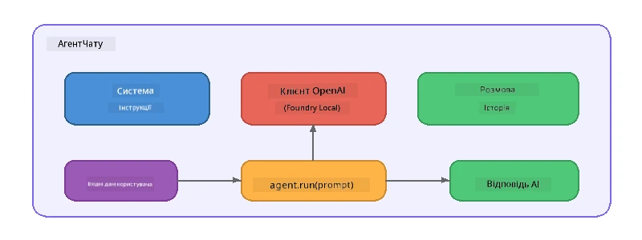

# Частина 5: Створення AI агентів за допомогою Agent Framework

> **Мета:** Створити свого першого AI агента з постійними інструкціями та визначеною персоналією, що працює на локальній моделі через Foundry Local.

## Що таке AI агент?

AI агент обгортає мовну модель із **системними інструкціями**, які визначають його поведінку, особистість і обмеження. На відміну від одноразового виклику завершення чату, агент надає:

- **Персону** – послідовну ідентичність («Ви – корисний рев’ювер коду»)
- **Пам’ять** – історію розмови між кроками
- **Спеціалізацію** – сфокусовану поведінку на основі добре продуманих інструкцій



---

## Microsoft Agent Framework

**Microsoft Agent Framework** (AGF) надає стандартну абстракцію агента, що працює з різними бекендами моделей. У цьому воркшопі ми поєднуємо його з Foundry Local, щоб усе працювало на вашому комп’ютері — без потреби у хмарі.

| Концепція | Опис |
|---------|-------------|
| `FoundryLocalClient` | Python: відповідає за запуск сервісу, завантаження/завантаження моделі та створення агентів |
| `client.as_agent()` | Python: створює агента з клієнта Foundry Local |
| `AsAIAgent()` | C#: метод розширення для `ChatClient` — створює `AIAgent` |
| `instructions` | Системний підказ, що формує поведінку агента |
| `name` | Зрозуміла людиною мітка, корисна у сценаріях з кількома агентами |
| `agent.run(prompt)` / `RunAsync()` | Надсилає користувацьке повідомлення та повертає відповідь агента |

> **Примітка:** Agent Framework має SDK для Python та .NET. Для JavaScript ми реалізували легкий клас `ChatAgent`, який повторює ту ж схему, використовуючи безпосередньо OpenAI SDK.

---

## Вправи

### Вправа 1 - Зрозуміти патерн агента

Перед написанням коду вивчіть ключові компоненти агента:

1. **Клієнт моделі** – підключається до OpenAI-сумісного API Foundry Local
2. **Системні інструкції** – підказка «особистості»
3. **Цикл запуску** – відправка вводу користувача, отримання виводу

> **Подумайте:** Як системні інструкції відрізняються від звичайного повідомлення користувача? Що станеться, якщо їх змінити?

---

### Вправа 2 - Запустити приклад із одним агентом

<details>
<summary><strong>🐍 Python</strong></summary>

**Вимоги:**
```bash
cd python
python -m venv venv

# Windows (PowerShell):
venv\Scripts\Activate.ps1
# macOS:
source venv/bin/activate

pip install -r requirements.txt
```

**Запуск:**
```bash
python foundry-local-with-agf.py
```

**Огляд коду** (`python/foundry-local-with-agf.py`):

```python
import asyncio
from agent_framework_foundry_local import FoundryLocalClient

async def main():
    alias = "phi-4-mini"

    # FoundryLocalClient обробляє запуск сервісу, завантаження моделі та її завантаження
    client = FoundryLocalClient(model_id=alias)
    print(f"Client Model ID: {client.model_id}")

    # Створіть агента з інструкціями системи
    agent = client.as_agent(
        name="Joker",
        instructions="You are good at telling jokes.",
    )

    # Без потокової передачі: отримайте повну відповідь одразу
    result = await agent.run("Tell me a joke about a pirate.")
    print(f"Agent: {result}")

    # Потокова передача: отримуйте результати в міру їх генерації
    async for chunk in agent.run("Tell me another joke.", stream=True):
        if chunk.text:
            print(chunk.text, end="", flush=True)

asyncio.run(main())
```

**Основні моменти:**
- `FoundryLocalClient(model_id=alias)` виконує запуск сервісу, завантаження і підключення моделі в одному кроці
- `client.as_agent()` створює агента з системними інструкціями та іменем
- `agent.run()` підтримує режим як без потоків, так і потоковий
- Встановлення через `pip install agent-framework-foundry-local --pre`

</details>

<details>
<summary><strong>📦 JavaScript</strong></summary>

**Вимоги:**
```bash
cd javascript
npm install
```

**Запуск:**
```bash
node foundry-local-with-agent.mjs
```

**Огляд коду** (`javascript/foundry-local-with-agent.mjs`):

```javascript
import { OpenAI } from "openai";
import { FoundryLocalManager } from "foundry-local-sdk";

class ChatAgent {
  constructor({ client, modelId, instructions, name }) {
    this.client = client;
    this.modelId = modelId;
    this.instructions = instructions;
    this.name = name;
    this.history = [];
  }

  async run(userMessage) {
    const messages = [
      { role: "system", content: this.instructions },
      ...this.history,
      { role: "user", content: userMessage },
    ];
    const response = await this.client.chat.completions.create({
      model: this.modelId,
      messages,
    });
    const assistantMessage = response.choices[0].message.content;

    // Зберігати історію розмови для багатокрокових взаємодій
    this.history.push({ role: "user", content: userMessage });
    this.history.push({ role: "assistant", content: assistantMessage });
    return { text: assistantMessage };
  }
}

async function main() {
  FoundryLocalManager.create({ appName: "FoundryLocalWorkshop" });
  const manager = FoundryLocalManager.instance;
  await manager.startWebService();

  const catalog = manager.catalog;
  const model = await catalog.getModel("phi-3.5-mini");
  if (!model.isCached) {
    console.log("Downloading model: phi-3.5-mini...");
    await model.download();
  }
  await model.load();

  const client = new OpenAI({
    baseURL: manager.urls[0] + "/v1",
    apiKey: "foundry-local",
  });

  const agent = new ChatAgent({
    client,
    modelId: model.id,
    instructions: "You are good at telling jokes.",
    name: "Joker",
  });

  const result = await agent.run("Tell me a joke about a pirate.");
  console.log(result.text);
}

main();
```

**Основні моменти:**
- JavaScript створює власний клас `ChatAgent`, який повторює патерн AGF з Python
- `this.history` зберігає ходи розмови для підтримки багатократних кроків
- Явний виклик `startWebService()` → перевірка кешу → `model.download()` → `model.load()` забезпечує повний контроль

</details>

<details>
<summary><strong>💜 C#</strong></summary>

**Вимоги:**
```bash
cd csharp
dotnet restore
```

**Запуск:**
```bash
dotnet run agent
```

**Огляд коду** (`csharp/SingleAgent.cs`):

```csharp
using Microsoft.AI.Foundry.Local;
using Microsoft.Extensions.Logging.Abstractions;
using Microsoft.Agents.AI;
using OpenAI;
using System.ClientModel;

// 1. Start Foundry Local and load a model
var alias = "phi-3.5-mini";
await FoundryLocalManager.CreateAsync(
    new Configuration
    {
        AppName = "FoundryLocalSamples",
        Web = new Configuration.WebService { Urls = "http://127.0.0.1:0" }
    }, NullLogger.Instance, default);
var manager = FoundryLocalManager.Instance;
await manager.StartWebServiceAsync(default);

var catalog = await manager.GetCatalogAsync(default);
var model = await catalog.GetModelAsync(alias, default);

var isCached = await model.IsCachedAsync(default);
if (!isCached)
{
    Console.WriteLine($"Downloading model: {alias}...");
    await model.DownloadAsync(null, default);
}
await model.LoadAsync(default);

var key = new ApiKeyCredential("foundry-local");
var client = new OpenAIClient(key, new OpenAIClientOptions
{
    Endpoint = new Uri(manager.Urls[0] + "/v1")
});

// 2. Create an AIAgent using the Agent Framework extension method
AIAgent joker = client
    .GetChatClient(model.Id)
    .AsAIAgent(
        instructions: "You are good at telling jokes. Keep your jokes short and family-friendly.",
        name: "Joker"
    );

// 3. Run the agent (non-streaming)
var response = await joker.RunAsync("Tell me a joke about a pirate.");
Console.WriteLine($"Joker: {response}");

// 4. Run with streaming
await foreach (var update in joker.RunStreamingAsync("Tell me another joke."))
{
    Console.Write(update);
}
```

**Основні моменти:**
- `AsAIAgent()` – метод розширення з `Microsoft.Agents.AI.OpenAI`, власний клас `ChatAgent` не потрібен
- `RunAsync()` повертає повну відповідь; `RunStreamingAsync()` стрімить по токену
- Встановлення через `dotnet add package Microsoft.Agents.AI.OpenAI --version 1.0.0-rc3`

</details>

---

### Вправа 3 - Змінити персоналію

Змініть `instructions` агента, щоб створити іншу персону. Спробуйте кожну і подивіться, як змінюється відповідь:

| Персона | Інструкції |
|---------|-------------|
| Рев’ювер коду | `"Ви – експертний рев’ювер коду. Надавайте конструктивний зворотній зв’язок, орієнтований на читабельність, продуктивність і коректність."` |
| Туристичний гід | `"Ви – дружній туристичний гід. Давайте персоналізовані рекомендації щодо напрямків, активностей і місцевої кухні."` |
| Сократичний репетитор | `"Ви – сократичний репетитор. Ніколи не давайте прямі відповіді — натомість ведіть студента за допомогою продуманих питань."` |
| Технічний письменник | `"Ви – технічний письменник. Чітко і лаконічно пояснюйте концепції. Використовуйте приклади. Уникайте жаргону."` |

**Спробуйте:**
1. Оберіть персону з таблиці вище
2. Замініть рядок `instructions` у коді
3. Підкоригуйте користувацький запит відповідно (наприклад, попросіть рев’юера коду перевірити функцію)
4. Запустіть приклад знову і порівняйте результати

> **Порада:** Якість агента сильно залежить від інструкцій. Конкретні, структуровані інструкції дають кращий результат, ніж загальні.

---

### Вправа 4 - Додати багатокрокову розмову

Розширте приклад, щоб підтримувати багатокроковий цикл спілкування, щоб вести діалог із агентом.

<details>
<summary><strong>🐍 Python - багатокроковий цикл</strong></summary>

```python
import asyncio
from agent_framework_foundry_local import FoundryLocalClient

async def main():
    client = FoundryLocalClient(model_id="phi-4-mini")

    agent = client.as_agent(
        name="Assistant",
        instructions="You are a helpful assistant.",
    )

    print("Chat with the agent (type 'quit' to exit):\n")
    while True:
        user_input = input("You: ")
        if user_input.strip().lower() in ("quit", "exit"):
            break
        result = await agent.run(user_input)
        print(f"Agent: {result}\n")

asyncio.run(main())
```

</details>

<details>
<summary><strong>📦 JavaScript - багатокроковий цикл</strong></summary>

```javascript
import { OpenAI } from "openai";
import { FoundryLocalManager } from "foundry-local-sdk";
import * as readline from "node:readline/promises";

// (повторно використати клас ChatAgent з Вправи 2)

async function main() {
  FoundryLocalManager.create({ appName: "FoundryLocalWorkshop" });
  const manager = FoundryLocalManager.instance;
  await manager.startWebService();

  const catalog = manager.catalog;
  const model = await catalog.getModel("phi-3.5-mini");
  if (!model.isCached) {
    console.log("Downloading model: phi-3.5-mini...");
    await model.download();
  }
  await model.load();

  const client = new OpenAI({
    baseURL: manager.urls[0] + "/v1",
    apiKey: "foundry-local",
  });

  const agent = new ChatAgent({
    client,
    modelId: model.id,
    instructions: "You are a helpful assistant.",
    name: "Assistant",
  });

  const rl = readline.createInterface({
    input: process.stdin,
    output: process.stdout,
  });

  console.log("Chat with the agent (type 'quit' to exit):\n");
  while (true) {
    const userInput = await rl.question("You: ");
    if (["quit", "exit"].includes(userInput.trim().toLowerCase())) break;
    const result = await agent.run(userInput);
    console.log(`Agent: ${result.text}\n`);
  }
  rl.close();
}

main();
```

</details>

<details>
<summary><strong>💜 C# - багатокроковий цикл</strong></summary>

```csharp
using Microsoft.AI.Foundry.Local;
using Microsoft.Extensions.Logging.Abstractions;
using Microsoft.Agents.AI;
using OpenAI;
using System.ClientModel;

var alias = "phi-3.5-mini";
var config = new Configuration
{
    AppName = "FoundryLocalSamples",
    Web = new Configuration.WebService { Urls = "http://127.0.0.1:0" }
};
await FoundryLocalManager.CreateAsync(config, NullLogger.Instance, default);
var manager = FoundryLocalManager.Instance;
await manager.StartWebServiceAsync(default);

var catalog = await manager.GetCatalogAsync(default);
var model = await catalog.GetModelAsync(alias, default);

var isCached = await model.IsCachedAsync(default);
if (!isCached)
{
    Console.WriteLine($"Downloading model: {alias}...");
    await model.DownloadAsync(null, default);
}
await model.LoadAsync(default);

var key = new ApiKeyCredential("foundry-local");
var client = new OpenAIClient(key, new OpenAIClientOptions
{
    Endpoint = new Uri(manager.Urls[0] + "/v1")
});

AIAgent agent = client
    .GetChatClient(model.Id)
    .AsAIAgent(
        instructions: "You are a helpful assistant.",
        name: "Assistant"
    );

Console.WriteLine("Chat with the agent (type 'quit' to exit):\n");
while (true)
{
    Console.Write("You: ");
    var userInput = Console.ReadLine();
    if (string.IsNullOrWhiteSpace(userInput) ||
        userInput.Equals("quit", StringComparison.OrdinalIgnoreCase) ||
        userInput.Equals("exit", StringComparison.OrdinalIgnoreCase))
        break;

    var result = await agent.RunAsync(userInput);
    Console.WriteLine($"Agent: {result}\n");
}
```

</details>

Зауважте, як агент пам’ятає попередні кроки — задайте уточнююче питання і спостерігайте, як контекст зберігається.

---

### Вправа 5 - Структурований вивід

Наставте агента завжди відповідати у певному форматі (наприклад, JSON) та розберіть результат:

<details>
<summary><strong>🐍 Python - вивід JSON</strong></summary>

```python
import asyncio
import json
from agent_framework_foundry_local import FoundryLocalClient

async def main():
    client = FoundryLocalClient(model_id="phi-4-mini")

    agent = client.as_agent(
        name="SentimentAnalyzer",
        instructions=(
            "You are a sentiment analysis agent. "
            "For every user message, respond ONLY with valid JSON in this format: "
            '{"sentiment": "positive|negative|neutral", "confidence": 0.0-1.0, "summary": "brief reason"}'
        ),
    )

    result = await agent.run("I absolutely loved the new restaurant downtown!")
    print("Raw:", result)

    try:
        parsed = json.loads(str(result))
        print(f"Sentiment: {parsed['sentiment']} (confidence: {parsed['confidence']})")
    except json.JSONDecodeError:
        print("Agent did not return valid JSON - try refining the instructions.")

asyncio.run(main())
```

</details>

<details>
<summary><strong>💜 C# - вивід JSON</strong></summary>

```csharp
using System.Text.Json;

AIAgent analyzer = chatClient.AsAIAgent(
    name: "SentimentAnalyzer",
    instructions:
        "You are a sentiment analysis agent. " +
        "For every user message, respond ONLY with valid JSON in this format: " +
        "{\"sentiment\": \"positive|negative|neutral\", \"confidence\": 0.0-1.0, \"summary\": \"brief reason\"}"
);

var response = await analyzer.RunAsync("I absolutely loved the new restaurant downtown!");
Console.WriteLine($"Raw: {response}");

try
{
    var parsed = JsonSerializer.Deserialize<JsonElement>(response.ToString());
    Console.WriteLine($"Sentiment: {parsed.GetProperty("sentiment")} " +
                      $"(confidence: {parsed.GetProperty("confidence")})");
}
catch (JsonException)
{
    Console.WriteLine("Agent did not return valid JSON - try refining the instructions.");
}
```

</details>

> **Примітка:** Маленькі локальні моделі не завжди дають ідеально валідний JSON. Надійність можна покращити, додавши приклад у інструкції і дуже чітко описуючи очікуваний формат.

---

## Найважливіше

| Концепція | Що Ви дізналися |
|---------|-----------------|
| Агент vs. виклик LLM напряму | Агент обгортає модель інструкціями й пам’яттю |
| Системні інструкції | Найважливіший важіль для контролю поведінки агента |
| Багатокрокова розмова | Агенти можуть зберігати контекст через кілька взаємодій |
| Структурований вивід | Інструкції можуть змушувати дотримуватися формату (JSON, markdown тощо) |
| Локальне виконання | Все працює на пристрої через Foundry Local — без хмари |

---

## Наступні кроки

У **[Частина 6: Робочі процеси з кількома агентами](part6-multi-agent-workflows.md)** ви поєднаєте кілька агентів у скоординований пайплайн, де кожен агент виконує спеціалізовану роль.

---

<!-- CO-OP TRANSLATOR DISCLAIMER START -->
**Відмова від відповідальності**:  
Цей документ був перекладений за допомогою сервісу автоматичного перекладу [Co-op Translator](https://github.com/Azure/co-op-translator). Хоча ми прагнемо до точності, будь ласка, майте на увазі, що автоматичні переклади можуть містити помилки або неточності. Оригінальний документ у його рідній мові слід вважати авторитетним джерелом. Для критично важливої інформації рекомендується звертатися до професійного людського перекладу. Ми не несемо відповідальності за будь-які непорозуміння чи неправильні тлумачення, що виникають унаслідок використання цього перекладу.
<!-- CO-OP TRANSLATOR DISCLAIMER END -->