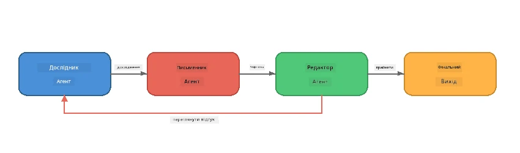
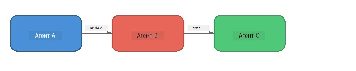
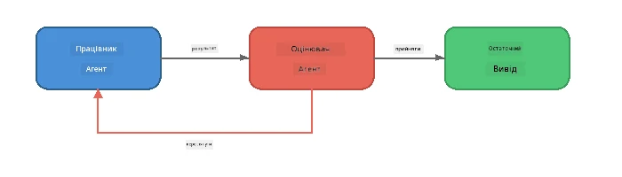
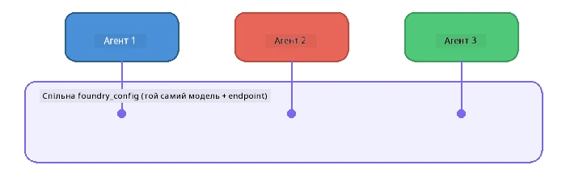

# Частина 6: Багатоагентні робочі процеси

> **Мета:** Об'єднати кілька спеціалізованих агентів у скоординовані конвеєри, які розподіляють складні завдання між співпрацюючими агентами — всі локально з Foundry Local.

## Навіщо багато агентів?

Один агент може виконувати багато завдань, але складні робочі процеси виграють від **спеціалізації**. Замість того, щоб один агент одночасно намагався досліджувати, писати та редагувати, роботу розбивають на сфокусовані ролі:



| Шаблон | Опис |
|---------|-------------|
| **Послідовний** | Вихід агента A подається на вхід агента B → агента C |
| **Цикл зворотного зв’язку** | Оцінювач-агент може відправити роботу на доопрацювання |
| **Спільний контекст** | Всі агенти використовують ту саму модель/endpoint, але різні інструкції |
| **Типізований вихід** | Агенти генерують структуровані результати (JSON) для надійної передачі |

---

## Вправи

### Вправа 1 - Запуск багатоагентного конвеєра

На воркшопі є повний робочий процес Researcher → Writer → Editor.

<details>
<summary><strong>🐍 Python</strong></summary>

**Налаштування:**
```bash
cd python
python -m venv venv

# Windows (PowerShell):
venv\Scripts\Activate.ps1
# macOS:
source venv/bin/activate

pip install -r requirements.txt
```

**Запуск:**
```bash
python foundry-local-multi-agent.py
```

**Що відбувається:**
1. **Researcher** отримує тему і повертає факти у вигляді пунктів
2. **Writer** бере дослідження та створює чорновик блогу (3-4 абзаци)
3. **Editor** переглядає статтю на якість і повертає ACCEPT або REVISE

</details>

<details>
<summary><strong>📦 JavaScript</strong></summary>

**Налаштування:**
```bash
cd javascript
npm install
```

**Запуск:**
```bash
node foundry-local-multi-agent.mjs
```

**Той самий трьохетапний конвеєр** - Researcher → Writer → Editor.

</details>

<details>
<summary><strong>💜 C#</strong></summary>

**Налаштування:**
```bash
cd csharp
dotnet restore
```

**Запуск:**
```bash
dotnet run multi
```

**Той самий трьохетапний конвеєр** - Researcher → Writer → Editor.

</details>

---

### Вправа 2 - Анатомія конвеєра

Вивчіть, як агенти визначені та з’єднані:

**1. Спільний клієнт моделі**

Всі агенти використовують одну й ту саму модель Foundry Local:

```python
# Python - FoundryLocalClient обробляє все
from agent_framework_foundry_local import FoundryLocalClient

client = FoundryLocalClient(model_id="phi-3.5-mini")
```

```javascript
// JavaScript - OpenAI SDK, спрямований на Foundry Local
const client = new OpenAI({
  baseURL: manager.urls[0] + "/v1",
  apiKey: "foundry-local",
});
```

```csharp
// C# - OpenAIClient pointed at Foundry Local
var key = new ApiKeyCredential("foundry-local");
var client = new OpenAIClient(key, new OpenAIClientOptions
{
    Endpoint = new Uri(manager.Urls[0] + "/v1")
});
var chatClient = client.GetChatClient(model.Id);
```

**2. спеціалізовані інструкції**

Кожен агент має унікальну персональність:

| Агент | Інструкції (коротко) |
|-------|----------------------|
| Researcher | "Надайте ключові факти, статистику та інформацію. Організуйте у вигляді пунктів." |
| Writer | "Напишіть захопливий блог (3-4 абзаци) на основі досліджень. Не вигадуйте факти." |
| Editor | "Перевірте на зрозумілість, граматику та фактичну точність. Вирок: ACCEPT чи REVISE." |

**3. Потоки даних між агентами**

```python
# Крок 1 - вивід дослідника стає вхідними даними для письменника
research_result = await researcher.run(f"Research: {topic}")

# Крок 2 - вивід письменника стає вхідними даними для редактора
writer_result = await writer.run(f"Write using:\n{research_result}")

# Крок 3 - редактор переглядає як дослідження, так і статтю
editor_result = await editor.run(
    f"Research:\n{research_result}\n\nArticle:\n{writer_result}"
)
```

```csharp
// C# - same pattern, async calls with AIAgent
var researchNotes = await researcher.RunAsync(
    $"Research the following topic and provide key facts:\n{topic}");

var draft = await writer.RunAsync(
    $"Write a blog post based on these research notes:\n\n{researchNotes}");

var verdict = await editor.RunAsync(
    $"Review this article for quality and accuracy.\n\n" +
    $"Research notes:\n{researchNotes}\n\n" +
    $"Article:\n{draft}");
```

> **Важливий висновок:** Кожен агент отримує накопичений контекст від попередніх агентів. Редактор бачить як первинне дослідження, так і чорновик — це дозволяє перевіряти фактичну відповідність.

---

### Вправа 3 - Додати четвертого агента

Розширте конвеєр, додавши нового агента. Виберіть одного:

| Агент | Призначення | Інструкції |
|-------|-------------|------------|
| **Fact-Checker** | Перевірити твердження в статті | `"Ви перевіряєте фактичні твердження. Для кожного твердження вкажіть, чи підтримується воно нотатками досліджень. Поверніть JSON із підтвердженими/непідтвердженими пунктами."` |
| **Headline Writer** | Створити привабливі заголовки | `"Згенеруйте 5 варіантів заголовків для статті. Варіюйте стиль: інформативний, клікбейт, питання, лістикл, емоційний."` |
| **Social Media** | Створити промо-пости | `"Створіть 3 пости для соцмереж, які просувають цю статтю: один для Twitter (до 280 символів), один для LinkedIn (професійний стиль), один для Instagram (невимушено з ідеями для емодзі)."` |

<details>
<summary><strong>🐍 Python - додавання Headline Writer</strong></summary>

```python
headline_agent = client.as_agent(
    name="HeadlineWriter",
    instructions=(
        "You are a headline specialist. Given an article, generate exactly "
        "5 headline options. Vary the style: informative, question-based, "
        "listicle, emotional, and provocative. Return them as a numbered list."
    ),
)

# Після того, як редактор прийме, створіть заголовки
headline_result = await headline_agent.run(
    f"Generate headlines for this article:\n\n{writer_result}"
)
print(f"\n--- Headlines ---\n{headline_result}")
```

</details>

<details>
<summary><strong>📦 JavaScript - додавання Headline Writer</strong></summary>

```javascript
const headlineAgent = new ChatAgent({
  client,
  modelId: modelInfo.id,
  instructions:
    "You are a headline specialist. Given an article, generate exactly " +
    "5 headline options. Vary the style: informative, question-based, " +
    "listicle, emotional, and provocative. Return them as a numbered list.",
  name: "HeadlineWriter",
});

const headlineResult = await headlineAgent.run(
  `Generate headlines for this article:\n\n${writerResult.text}`
);
console.log(`\n--- Headlines ---\n${headlineResult.text}`);
```

</details>

<details>
<summary><strong>💜 C# - додавання Headline Writer</strong></summary>

```csharp
AIAgent headlineAgent = chatClient.AsAIAgent(
    name: "HeadlineWriter",
    instructions:
        "You are a headline specialist. Given an article, generate exactly " +
        "5 headline options. Vary the style: informative, question-based, " +
        "listicle, emotional, and provocative. Return them as a numbered list."
);

// After the editor accepts, generate headlines
var headlines = await headlineAgent.RunAsync(
    $"Generate headlines for this article:\n\n{draft}");
Console.WriteLine($"\n--- Headlines ---\n{headlines}");
```

</details>

---

### Вправа 4 - Спроєктуйте власний робочий процес

Спроєктуйте багатоагентний конвеєр для іншої сфери. Ось кілька ідей:

| Сфера | Агенти | Потік |
|-------|---------|-------|
| **Code Review** | Analyser → Reviewer → Summariser | Аналіз структури коду → перевірка на помилки → створення підсумкового звіту |
| **Customer Support** | Classifier → Responder → QA | Класифікація запиту → чернетка відповіді → перевірка якості |
| **Education** | Quiz Maker → Student Simulator → Grader | Генерація тесту → симуляція відповідей → оцінювання та пояснення |
| **Data Analysis** | Interpreter → Analyst → Reporter | Інтерпретація запиту на дані → аналіз патернів → написання звіту |

**Кроки:**
1. Визначте 3+ агентів із чіткими `інструкціями`
2. Визначте потік даних — що кожен агент отримує і генерує?
3. Реалізуйте конвеєр, використовуючи шаблони з вправ 1-3
4. Додайте цикл зворотного зв’язку, якщо один агент має оцінювати роботу іншого

---

## Патерни оркестрації

Ось патерни оркестрації, які застосовуються до будь-якої багатоагентної системи (детально розглянуті в [Частині 7](part7-zava-creative-writer.md)):

### Послідовний конвеєр



Кожен агент опрацьовує вихід попереднього. Просто і передбачувано.

### Цикл зворотного зв’язку



Оцінювач-агент може ініціювати повторне виконання попередніх етапів. У Zava Writer редактор може відправляти відгуки досліднику і письменнику.

### Спільний контекст



Всі агенти використовують одну спільну `foundry_config`, тож працюють з тією ж моделлю та endpoint.

---

## Основні висновки

| Концепт | Чого ви навчилися |
|---------|-------------------|
| Спеціалізація агента | Кожен агент виконує одну задачу з чіткими інструкціями |
| Передача даних | Вихід одного агента стає входом для наступного |
| Цикли зворотного зв’язку | Оцінювач може ініціювати повторні спроби для підвищення якості |
| Структурований вихід | Відповіді у форматі JSON дозволяють надійно передавати інформацію між агентами |
| Оркестрація | Координатор керує послідовністю конвеєра і обробкою помилок |
| Промислові шаблони | Застосовані в [Частині 7: Zava Creative Writer](part7-zava-creative-writer.md) |

---

## Наступні кроки

Продовжуйте до [Частини 7: Zava Creative Writer - Капстоун-додаток](part7-zava-creative-writer.md), щоб дослідити промисловий багатоагентний додаток із 4 спеціалізованими агентами, потоковим виводом, пошуком продуктів і циклами зворотного зв’язку — доступний на Python, JavaScript та C#.

---

<!-- CO-OP TRANSLATOR DISCLAIMER START -->
**Відмова від відповідальності**:
Цей документ було перекладено за допомогою сервісу штучного інтелекту [Co-op Translator](https://github.com/Azure/co-op-translator). Незважаючи на наші зусилля забезпечити точність, будь ласка, майте на увазі, що автоматичні переклади можуть містити помилки або неточності. Оригінальний документ його рідною мовою слід вважати авторитетним джерелом. Для критично важливої інформації рекомендується професійний переклад людиною. Ми не несемо відповідальності за будь-які непорозуміння чи неправильні тлумачення, що виникли внаслідок використання цього перекладу.
<!-- CO-OP TRANSLATOR DISCLAIMER END -->