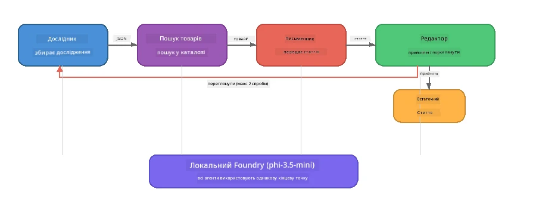

# Частина 7: Zava Creative Writer - Кінцева Застосунок

> **Мета:** Дослідити мультиагентний застосунок виробничого рівня, в якому чотири спеціалізовані агенти співпрацюють для створення статей якісного рівня журналу для Zava Retail DIY - який працює повністю на вашому пристрої з Foundry Local.

Це **кінцевий лабораторний проект** воркшопу. Він об'єднує все, чому ви навчились — інтеграція SDK (Частина 3), вилучення з локальних даних (Частина 4), персонажі агентів (Частина 5) та оркестрація мультиагентів (Частина 6) — в повний застосунок, доступний на **Python**, **JavaScript** та **C#**.

---

## Що Ви Дослідите

| Концепція | Де в Zava Writer |
|---------|----------------------------|
| 4-крокове завантаження моделі | Спільний модуль конфігурації ініціалізує Foundry Local |
| Отримання у стилі RAG | Агент продукту шукає в локальному каталозі |
| Спеціалізація агентів | 4 агенти з різними системними підказками |
| Потоковий вивід | Writer видає токени в реальному часі |
| Структуровані передачі | Researcher → JSON, Editor → JSON рішення |
| Петлі зворотного зв’язку | Editor може ініціювати повторне виконання (макс 2 спроби) |

---

## Архітектура

Zava Creative Writer використовує **послідовний конвеєр з оцінювальною зворотнім зв’язком**. Усі три реалізації мов мають однакову архітектуру:



### Чотири Агенти

| Агент | Вхід | Вихід | Призначення |
|-------|-------|--------|---------|
| **Researcher** | Тема + опціональний відгук | `{"web": [{url, name, description}, ...]}` | Збирає фонові дослідження через LLM |
| **Product Search** | Контекст продукту рядком | Список відповідних продуктів | Запити, згенеровані LLM, + пошук ключових слів у локальному каталозі |
| **Writer** | Дослідження + продукти + завдання + відгук | Потокова текстова стаття (розбита за `---`) | Створює статтю якості журналу в реальному часі |
| **Editor** | Стаття + самооцінка письменника | `{"decision": "accept/revise", "editorFeedback": "...", "researchFeedback": "..."}` | Переглядає якість, ініціює повтор, якщо потрібно |

### Потік Конвеєра

1. **Researcher** отримує тему й створює структуровані дослідницькі нотатки (JSON)
2. **Product Search** виконує пошук у локальному каталозі продуктів за допомогою пошукових термінів, згенерованих LLM
3. **Writer** поєднує дослідження + продукти + завдання у потокову статтю, додаючи самооцінку після роздільника `---`
4. **Editor** переглядає статтю й повертає JSON вердикт:
   - `"accept"` → конвеєр завершується
   - `"revise"` → відгук відправляється назад Researcher і Writer (макс 2 спроби)

---

## Вимоги

- Завершити [Частина 6: Мультиагентні Робочі Процеси](part6-multi-agent-workflows.md)
- Встановлений Foundry Local CLI та завантажена модель `phi-3.5-mini`

---

## Вправи

### Вправа 1 - Запустіть Zava Creative Writer

Обирайте вашу мову і запускайте застосунок:

<details>
<summary><strong>🐍 Python - FastAPI Веб-сервіс</strong></summary>

Версія на Python працює як **веб-сервіс** з REST API, демонструючи, як побудувати бекстенд виробничого рівня.

**Налаштування:**
```bash
cd zava-creative-writer-local/src/api
python -m venv venv

# Windows (PowerShell):
venv\Scripts\Activate.ps1
# macOS:
source venv/bin/activate

pip install -r requirements.txt
```

**Запуск:**
```bash
uvicorn main:app --reload
```

**Тестування:**
```bash
curl -X POST http://localhost:8000/api/article \
  -H "Content-Type: application/json" \
  -d '{
    "research": "DIY home improvement trends",
    "products": "power tools and paints",
    "assignment": "Write an article about weekend renovation projects for DIY enthusiasts"
  }'
```

Відповідь надходить потоками у вигляді JSON повідомлень, розділених новими рядками, показуючи прогрес кожного агента.

</details>

<details>
<summary><strong>📦 JavaScript - Node.js CLI</strong></summary>

Версія на JavaScript працює як **CLI застосунок**, виводячи прогрес агентів і статтю безпосередньо в консоль.

**Налаштування:**
```bash
cd zava-creative-writer-local/src/javascript
npm install
```

**Запуск:**
```bash
node main.mjs
```

Ви побачите:
1. Завантаження моделі Foundry Local (з індикатором прогресу під час завантаження)
2. Поетапне виконання кожного агента з повідомленнями про статус
3. Потокову передачу статті в консоль у реальному часі
4. Рішення редактора про прийняття/редагування

</details>

<details>
<summary><strong>💜 C# - .NET Консольний застосунок</strong></summary>

Версія на C# працює як **консольний застосунок .NET** з тим самим конвеєром і потоковим виводом.

**Налаштування:**
```bash
cd zava-creative-writer-local/src/csharp
dotnet restore
```

**Запуск:**
```bash
dotnet run
```

Такий самий вивід, як у версії на JavaScript — повідомлення про статус агента, потокова стаття та вердикт редактора.

</details>

---

### Вправа 2 - Вивчайте Структуру Коду

Кожна реалізація мови містить однакові логічні компоненти. Порівняйте структури:

**Python** (`src/api/`):
| Файл | Призначення |
|------|---------|
| `foundry_config.py` | Спільний менеджер Foundry Local, модель та клієнт (4-крокова ініціалізація) |
| `orchestrator.py` | Координація конвеєра з петлею зворотного зв’язку |
| `main.py` | FastAPI кінцеві точки (`POST /api/article`) |
| `agents/researcher/researcher.py` | Дослідження на основі LLM з JSON виходом |
| `agents/product/product.py` | Запити, згенеровані LLM + пошук за ключовими словами |
| `agents/writer/writer.py` | Потокова генерація статті |
| `agents/editor/editor.py` | JSON рішення щодо прийняття/редагування |

**JavaScript** (`src/javascript/`):
| Файл | Призначення |
|------|---------|
| `foundryConfig.mjs` | Спільна конфігурація Foundry Local (4-крокова ініціалізація з індикатором прогресу) |
| `main.mjs` | Оркестратор + CLI точка входу |
| `researcher.mjs` | Агент-дослідник на основі LLM |
| `product.mjs` | Генерація запитів LLM + пошук за ключовими словами |
| `writer.mjs` | Потокова генерація статті (асинхронний генератор) |
| `editor.mjs` | JSON рішення прийняття/редагування |
| `products.mjs` | Дані каталогу продуктів |

**C#** (`src/csharp/`):
| Файл | Призначення |
|------|---------|
| `Program.cs` | Повний конвеєр: завантаження моделі, агенти, оркестратор, петля зворотного зв’язку |
| `ZavaCreativeWriter.csproj` | Проєкт .NET 9 з пакунками Foundry Local + OpenAI |

> **Примітка дизайну:** Python розділяє кожного агента у свій файл/папку (зручно для великих команд). JavaScript використовує по одному модулю на агента (підходить для середніх проєктів). C# тримає все у одному файлі з локальними функціями (зручно для самодостатніх прикладів). У продакшені обирайте патерн, який відповідає конвенціям вашої команди.

---

### Вправа 3 - Прослідкуйте Спільну Конфігурацію

Кожен агент у конвеєрі використовує один і той самий клієнт моделі Foundry Local. Вивчіть, як це реалізовано для кожної мови:

<details>
<summary><strong>🐍 Python - foundry_config.py</strong></summary>

```python
from foundry_local import FoundryLocalManager

MODEL_ALIAS = "phi-3.5-mini"

# Крок 1: Створіть менеджер і запустіть службу Foundry Local
manager = FoundryLocalManager()
manager.start_service()

# Крок 2: Перевірте, чи модель вже завантажена
cached = manager.list_cached_models()
catalog_info = manager.get_model_info(MODEL_ALIAS)
is_cached = any(m.id == catalog_info.id for m in cached) if catalog_info else False

if not is_cached:
    manager.download_model(MODEL_ALIAS)

# Крок 3: Завантажте модель у пам’ять
manager.load_model(MODEL_ALIAS)
model_id = manager.get_model_info(MODEL_ALIAS).id

# Спільний клієнт OpenAI
client = openai.OpenAI(base_url=manager.endpoint, api_key=manager.api_key)
```

Усі агенти імпортують `from foundry_config import client, model_id`.

</details>

<details>
<summary><strong>📦 JavaScript - foundryConfig.mjs</strong></summary>

```javascript
import { FoundryLocalManager } from "foundry-local-sdk";
import { OpenAI } from "openai";

FoundryLocalManager.create({ appName: "ZavaCreativeWriter" });
const manager = FoundryLocalManager.instance;
await manager.startWebService();

// Перевірити кеш → завантажити → завантажити (нова модель SDK)
const catalog = manager.catalog;
const model = await catalog.getModel(MODEL_ALIAS);
if (!model.isCached) {
  console.log(`Downloading model: ${MODEL_ALIAS}...`);
  await model.download();
}
await model.load();

const client = new OpenAI({ baseURL: manager.urls[0] + "/v1", apiKey: "foundry-local" });
const modelId = model.id;
export { client, modelId };
```

Усі агенти імпортують `{ client, modelId } from "./foundryConfig.mjs"`.

</details>

<details>
<summary><strong>💜 C# - верхівка Program.cs</strong></summary>

```csharp
await FoundryLocalManager.CreateAsync(
    new Configuration
    {
        AppName = "ZavaCreativeWriter",
        Web = new Configuration.WebService { Urls = "http://127.0.0.1:0" }
    }, NullLogger.Instance, default);
var manager = FoundryLocalManager.Instance;
await manager.StartWebServiceAsync(default);

var catalog = await manager.GetCatalogAsync(default);
var catalogModel = await catalog.GetModelAsync(alias, default);
var isCached = await catalogModel.IsCachedAsync(default);
if (!isCached)
    await catalogModel.DownloadAsync(null, default);

await catalogModel.LoadAsync(default);
var key = new ApiKeyCredential("foundry-local");
var chatClient = new OpenAIClient(key, new OpenAIClientOptions
{
    Endpoint = new Uri(manager.Urls[0] + "/v1")
}).GetChatClient(catalogModel.Id);
```

`chatClient` передається всім агентам у тому ж файлі.

</details>

> **Ключовий патерн:** Патерн завантаження моделі (старт сервісу → перевірка кеша → завантаження → завантаження моделі) гарантує користувачеві чіткий прогрес та завантаження моделі лише один раз. Це найкраща практика для будь-якого застосунку Foundry Local.

---

### Вправа 4 - Зрозуміти Петлю Зворотного Зв’язку

Петля зворотного зв’язку робить цей конвеєр «розумним» — Editor може відправляти роботу назад для редагування. Прослідкуйте логіку:

```
Orchestrator:
  1. researcher.research(topic, "No Feedback")    ← first pass
  2. product.findProducts(productContext)
  3. writer.write(research, products, assignment)  ← streams article
  4. Split article at "---" → article + writerFeedback
  5. editor.edit(article, writerFeedback)

  WHILE editor says "revise" AND retryCount < 2:
    6. researcher.research(topic, editor.researchFeedback)  ← refined
    7. writer.write(research, products, editor.editorFeedback)
    8. editor.edit(newArticle, newWriterFeedback)
    9. retryCount++
```

**Питання для роздумів:**
- Чому ліміт спроб встановлено на 2? Що станеться, якщо збільшити?
- Чому Researcher отримує `researchFeedback`, а Writer — `editorFeedback`?
- Що буде, якщо редактор завжди скаже "переробити"?

---

### Вправа 5 - Змініть Поведінку Агента

Спробуйте змінити поведінку одного агента і спостерігайте, як це впливає на конвеєр:

| Зміна | Що змінити |
|-------------|----------------|
| **Жорсткіший редактор** | Змініть системний підказ редактора, щоб завжди вимагати принаймні одне редагування |
| **Довші статті** | Змініть підказ письменника з "800-1000 слів" на "1500-2000 слів" |
| **Інші продукти** | Додайте або змініть продукти в каталозі продуктів |
| **Нова тема для дослідження** | Змініть значення `researchContext` на інший предмет |
| **Дослідник тільки з JSON** | Змініть, щоб дослідник повертав 10 елементів замість 3-5 |

> **Підказка:** Оскільки всі три мови реалізують однакову архітектуру, ви можете вносити однакові зміни в тій мові, яка вам зручніша.

---

### Вправа 6 - Додайте П’ятого Агента

Розширте конвеєр новим агентом. Ідеї:

| Агент | Де в конвеєрі | Призначення |
|-------|-------------------|---------|
| **Fact-Checker** | Після Writer, перед Editor | Перевірка тверджень щодо даних дослідження |
| **SEO Optimiser** | Після прийняття редактором | Додати мета-опис, ключові слова, slug |
| **Illustrator** | Після прийняття редактором | Генерація запитів для зображень статті |
| **Translator** | Після прийняття редактором | Переклад статті на іншу мову |

**Кроки:**
1. Напишіть системний підказ агента
2. Створіть функцію агента (взаємно узгоджену з існуючим патерном вашої мови)
3. Вставте його в оркестратор у правильному місці
4. Оновіть вихід/логування, щоб показати внесок нового агента

---

## Як Foundry Local і Framework Агентів Працюють Разом

Цей застосунок демонструє рекомендований патерн для побудови мультиагентних систем з Foundry Local:

| Рівень | Компонент | Роль |
|-------|-----------|------|
| **Рuntime** | Foundry Local | Завантажує, керує і обслуговує модель локально |
| **Клієнт** | OpenAI SDK | Відправляє чат-запити на локальний ендпоінт |
| **Агент** | Системний підказ + чат виклик | Спеціалізована поведінка через сфокусовані інструкції |
| **Оркестратор** | Координатор конвеєра | Керує потоками даних, послідовністю і петлями зворотного зв’язку |
| **Фреймворк** | Microsoft Agent Framework | Забезпечує абстракцію `ChatAgent` та патерни |

Ключове розуміння: **Foundry Local замінює бекенд у хмарі, а не архітектуру застосунку.** Ті ж патерни агентів, стратегії оркестрації й структуровані передачі, що працюють з хмарними моделями, однаково працюють і з локальними — ви просто вказуєте клієнту локальний ендпоінт замість Azure.

---

## Основні Висновки

| Концепція | Що Ви Вивчили |
|---------|-----------------|
| Архітектура виробництва | Як структурувати мультиагентний застосунок з спільною конфігурацією та окремими агентами |
| 4-крокове завантаження моделі | Найкраща практика ініціалізації Foundry Local з відображенням прогресу користувачу |
| Спеціалізація агентів | Кожен із 4 агентів має сфокусовані інструкції та специфічний формат виходу |
| Потокова генерація | Writer видає токени в реальному часі для забезпечення швидкої взаємодії користувача |
| Петлі зворотного зв’язку | Повторні спроби, керовані редактором, покращують якість без участі людини |
| Кросмовні патерни | Одна й та сама архітектура працює на Python, JavaScript та C# |
| Локально = готово для продакшену | Foundry Local надає той же OpenAI-сумісний API, що й хмарні деплойменти |

---

## Наступний Крок

Продовжуйте до [Частина 8: Розробка на основі оцінки](part8-evaluation-led-development.md), щоб побудувати систематичну систему оцінювання ваших агентів із золотими наборами даних, перевірками на правилах і оцінюванням LLM як суддею.

---

<!-- CO-OP TRANSLATOR DISCLAIMER START -->
**Відмова від відповідальності**:  
Цей документ було перекладено за допомогою сервісу автоматичного перекладу [Co-op Translator](https://github.com/Azure/co-op-translator). Хоч ми й прагнемо до точності, будь ласка, зверніть увагу, що автоматичні переклади можуть містити помилки або неточності. Оригінальний документ мовою оригіналу слід вважати авторитетним джерелом. Для критичної інформації рекомендується використовувати професійний людський переклад. Ми не несемо відповідальності за будь-які непорозуміння чи неправильні тлумачення, що виникли внаслідок використання цього перекладу.
<!-- CO-OP TRANSLATOR DISCLAIMER END -->