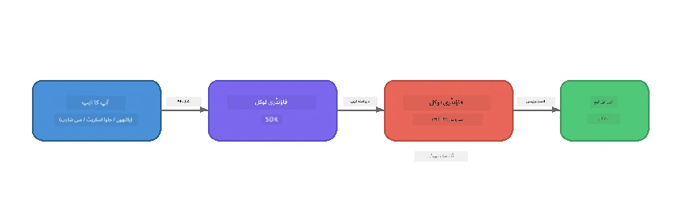

# حصہ 1: Foundry Local کے ساتھ آغاز


## Foundry Local کیا ہے؟

[Foundry Local](https://foundrylocal.ai) آپ کو اوپن سورس AI زبان کے ماڈلز **براہ راست اپنے کمپیوٹر پر چلانے** دیتا ہے - نہ انٹرنیٹ کی ضرورت، نہ کلاؤڈ کی قیمتیں، اور مکمل ڈیٹا کی پرائیویسی۔ یہ:

- **ماڈلز کو مقامی طور پر ڈاؤن لوڈ اور چلانے** کے لیے خودکار ہارڈویئر کی اصلاح (GPU، CPU، یا NPU) فراہم کرتا ہے
- **ایک OpenAI-مطابق API فراہم کرتا ہے** تاکہ آپ معروف SDKs اور ٹولز استعمال کر سکیں
- **کسی Azure سبسکرپشن** یا سائن اپ کی ضرورت نہیں - بس انسٹال کریں اور بنانا شروع کریں

اسے اپنے ذاتی AI کے طور پر سمجھیں جو مکمل طور پر آپ کے مشین پر چلتا ہے۔

## تعلیمی مقاصد

اس لیب کے آخر تک آپ قابل ہوں گے:

- اپنے آپریٹنگ سسٹم پر Foundry Local CLI انسٹال کرنا
- سمجھنا کہ ماڈل عرفیات کیا ہیں اور کیسے کام کرتی ہیں
- اپنا پہلا مقامی AI ماڈل ڈاؤن لوڈ اور چلانا
- کمانڈ لائن سے کسی مقامی ماڈل کو چیٹ میسج بھیجنا
- مقامی اور کلاؤڈ ہوسٹ کیے گئے AI ماڈلز کے درمیان فرق کو سمجھنا

---

## پیشگی شرائط

### نظام کی ضروریات

| ضرورت | کم از کم | تجویز کردہ |
|-------------|---------|-------------|
| **RAM** | 8 GB | 16 GB |
| **ڈسک اسپیس** | 5 GB (ماڈلز کے لیے) | 10 GB |
| **CPU** | 4 کورز | 8+ کورز |
| **GPU** | اختیاری | NVIDIA CUDA 11.8+ کے ساتھ |
| **OS** | Windows 10/11 (x64/ARM), Windows Server 2025, macOS 13+ | - |

> **نوٹ:** Foundry Local خودکار طریقے سے آپ کے ہارڈویئر کے لیے بہترین ماڈل مختصر کا انتخاب کرتا ہے۔ اگر آپ کے پاس NVIDIA GPU ہے تو یہ CUDA تیز رفتاری استعمال کرتا ہے۔ اگر Qualcomm NPU ہے تو وہ استعمال کرتا ہے۔ ورنہ یہ ایک بہتر CPU ورژن پر واپس آ جاتا ہے۔

### Foundry Local CLI انسٹال کریں

**Windows** (PowerShell):
```powershell
winget install Microsoft.FoundryLocal
```

**macOS** (Homebrew):
```bash
brew tap microsoft/foundrylocal
brew install foundrylocal
```

> **نوٹ:** Foundry Local اس وقت صرف Windows اور macOS کو سپورٹ کرتا ہے۔ اس وقت Linux سپورٹڈ نہیں ہے۔

انسٹالیشن کی تصدیق کریں:
```bash
foundry --version
```

---

## لیب کی مشقیں

### مشق 1: دستیاب ماڈلز کو دریافت کریں

Foundry Local ایک پیشگی اصلاح شدہ اوپن سورس ماڈلز کا کیٹلاگ شامل کرتا ہے۔ انہیں فہرست کریں:

```bash
foundry model list
```

آپ کو ایسے ماڈلز نظر آئیں گے:
- `phi-3.5-mini` - Microsoft کا 3.8B پیرامیٹر ماڈل (تیز، اچھی کوالٹی)
- `phi-4-mini` - نیا، زیادہ قابل Phi ماڈل
- `phi-4-mini-reasoning` - Phi ماڈل چین آف تھوٹ ریزننگ (`<think>` ٹیگز کے ساتھ)
- `phi-4` - Microsoft کا سب سے بڑا Phi ماڈل (10.4 GB)
- `qwen2.5-0.5b` - بہت چھوٹا اور تیز (کم وسائل کے آلات کے لیے مناسب)
- `qwen2.5-7b` - مضبوط جنرل پرپز ماڈل جس میں ٹول کالنگ سپورٹ ہے
- `qwen2.5-coder-7b` - کوڈ جنریشن کے لیے بہتر بنایا گیا
- `deepseek-r1-7b` - مضبوط ریزننگ ماڈل
- `gpt-oss-20b` - بڑا اوپن سورس ماڈل (MIT لائسنس، 12.5 GB)
- `whisper-base` - تقریر سے متن میں تبدیلی (383 MB)
- `whisper-large-v3-turbo` - اعلیٰ درستگی کی تبدیلی (9 GB)

> **ماڈل عرفیت کیا ہے؟** `phi-3.5-mini` جیسی عرفیات شارٹ کٹ ہیں۔ جب آپ عرفیت استعمال کرتے ہیں، Foundry Local خودکار طور پر آپ کے مخصوص ہارڈویئر کے لیے بہترین ماڈل ورژن ڈاؤن لوڈ کرتا ہے (NVIDIA GPUs کے لیے CUDA، ورنہ CPU کے لیے بہتر ورژن)۔ آپ کو کبھی صحیح ورژن منتخب کرنے کی فکر نہیں کرنی پڑتی۔

### مشق 2: اپنا پہلا ماڈل چلائیں

ایک ماڈل ڈاؤن لوڈ کریں اور انٹرایکٹو چیٹ کرنا شروع کریں:

```bash
foundry model run phi-3.5-mini
```

جب آپ یہ پہلی بار چلائیں گے، Foundry Local:
1. آپ کے ہارڈویئر کا پتہ لگائے گا
2. بہترین ماڈل ورژن ڈاؤن لوڈ کرے گا (یہ کچھ منٹ لے سکتا ہے)
3. ماڈل کو میموری میں لوڈ کرے گا
4. ایک انٹرایکٹو چیٹ سیشن شروع کرے گا

کچھ سوالات پوچھ کر آزمائیں:
```
You: What is the golden ratio?
You: Can you explain it as if I were 10 years old?
You: Write a haiku about mathematics
```

بند کرنے کے لیے `exit` ٹائپ کریں یا `Ctrl+C` دبائیں۔

### مشق 3: ماڈل کو پہلے سے ڈاؤن لوڈ کریں

اگر آپ ماڈل کو چلائے بغیر ڈاؤن لوڈ کرنا چاہتے ہیں:

```bash
foundry model download phi-3.5-mini
```

چیک کریں آپ کے مشین پر پہلے سے کون سے ماڈلز ڈاؤن لوڈ ہو چکے ہیں:

```bash
foundry cache list
```

### مشق 4: فن تعمیر کو سمجھیں

Foundry Local ایک **مقامی HTTP سروس** کے طور پر چلتا ہے جو OpenAI-مطابق REST API فراہم کرتا ہے۔ اس کا مطلب ہے:

1. سروس ایک **متحرک پورٹ** پر شروع ہوتی ہے (ہر بار مختلف پورٹ)
2. آپ SDK کا استعمال کر کے اصل endpoint URL دریافت کرتے ہیں
3. آپ کسی بھی OpenAI-مطابق کلائنٹ لائبریری کا استعمال کرتے ہوئے اس سے بات کر سکتے ہیں



> **اہم:** Foundry Local ہر بار شروع ہونے پر **متحرک پورٹ** تفویض کرتا ہے۔ کبھی بھی پورٹ نمبر `localhost:5272` کو ہارڈ کوڈ نہ کریں۔ ہمیشہ SDK کا استعمال کریں تاکہ موجودہ URL دریافت کیا جا سکے (جیسے Python میں `manager.endpoint` یا JavaScript میں `manager.urls[0]`)۔

---

## اہم نکات

| تصور | آپ نے کیا سیکھا |
|---------|------------------|
| آن-ڈیوائس AI | Foundry Local پورے ماڈلز کو آپ کے آلے پر بغیر کلاؤڈ، API کلیدوں یا کسی قیمت کے چلاتا ہے |
| ماڈل عرفیات | `phi-3.5-mini` جیسے عرفیات خودکار طور پر آپ کے ہارڈویئر کے لیے بہترین ورژن منتخب کرتی ہیں |
| متحرک پورٹس | سروس ایک متحرک پورٹ پر چلتی ہے؛ ہمیشہ SDK استعمال کریں endpoint دریافت کرنے کے لیے |
| CLI اور SDK | آپ CLI (`foundry model run`) یا SDK کے ذریعے پروگراماتی طور پر ماڈلز سے بات چیت کر سکتے ہیں |

---

## اگلے مراحل

جاری رکھیں [حصہ 2: Foundry Local SDK گہرائی میں](part2-foundry-local-sdk.md) تاکہ ماڈلز، خدمات، اور کیشنگ کو پروگراماتی طور پر سنبھالنے کے لیے SDK API میں مہارت حاصل کریں۔