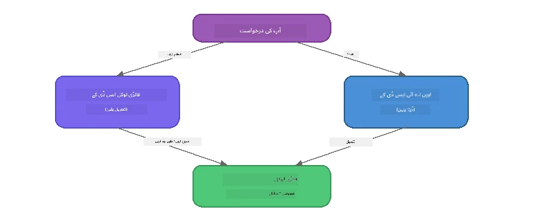

# حصہ 3: Foundry Local SDK کو OpenAI کے ساتھ استعمال کرنا

## جائزہ

حصہ 1 میں آپ نے Foundry Local CLI کو انٹرایکٹو طریقے سے ماڈلز چلانے کے لیے استعمال کیا تھا۔ حصہ 2 میں آپ نے پورے SDK API سطح کو دریافت کیا۔ اب آپ سیکھیں گے کہ **SDK اور OpenAI کے موافق API کو استعمال کرتے ہوئے Foundry Local کو اپنی ایپلی کیشنز میں کیسے شامل کیا جائے۔**

Foundry Local تین زبانوں کے لیے SDKs فراہم کرتا ہے۔ آپ اپنی سہولت کے مطابق کوئی بھی زبان منتخب کریں - تمام تینوں میں تصورات ایک جیسے ہیں۔

## سیکھنے کے مقاصد

اس لیب کے آخر تک آپ قادر ہوں گے:

- اپنی زبان (Python، JavaScript، یا C#) کے لیے Foundry Local SDK انسٹال کرنا
- `FoundryLocalManager` کو ابتدائیہ دینا تاکہ سروس شروع کی جا سکے، کیش چیک کیا جا سکے، ماڈل ڈاؤن لوڈ اور لوڈ کیا جا سکے
- OpenAI SDK کا استعمال کرتے ہوئے لوکل ماڈل سے جڑنا
- چیٹ مکملات بھیجنا اور اسٹریمنگ جوابات کو ہینڈل کرنا
- متحرک پورٹ آرکیٹیکچر کو سمجھنا

---

## شرائط

پہلے [حصہ 1: Foundry Local کے ساتھ شروع کرنا](part1-getting-started.md) اور [حصہ 2: Foundry Local SDK کی گہری جانچ](part2-foundry-local-sdk.md) مکمل کریں۔

مندرجہ ذیل زبان کے رن ٹائم میں سے **ایک** انسٹال کریں:
- **Python 3.9+** - [python.org/downloads](https://www.python.org/downloads/)
- **Node.js 18+** - [nodejs.org](https://nodejs.org/)
- **.NET 9.0+** - [dot.net/download](https://dotnet.microsoft.com/download)

---

## تصور: SDK کس طرح کام کرتا ہے

Foundry Local SDK **کنٹرول پلین** کا انتظام کرتا ہے (سروس شروع کرنا، ماڈلز ڈاؤن لوڈ کرنا)، جبکہ OpenAI SDK **ڈیٹا پلین** کا انتظام کرتا ہے (پرومپٹس بھیجنا، مکملات وصول کرنا)۔



---

## لیب کی مشقیں

### مشق 1: اپنا ماحول سیٹ اپ کریں

<details>
<summary><b>🐍 Python</b></summary>

```bash
cd python
python -m venv venv

# ورچوئل ماحول کو فعال کریں:
# ونڈوز (پاور شیل):
venv\Scripts\Activate.ps1
# ونڈوز (کمانڈ پرامپٹ):
venv\Scripts\activate.bat
# میک او ایس:
source venv/bin/activate

pip install -r requirements.txt
```

`requirements.txt` درج ذیل انسٹال کرتا ہے:
- `foundry-local-sdk` - Foundry Local SDK (امپورٹ کے طور پر `foundry_local`)
- `openai` - OpenAI Python SDK
- `agent-framework` - Microsoft Agent Framework (بعد کے حصوں میں استعمال ہوتا ہے)

</details>

<details>
<summary><b>📘 JavaScript</b></summary>

```bash
cd javascript
npm install
```

`package.json` درج ذیل انسٹال کرتا ہے:
- `foundry-local-sdk` - Foundry Local SDK
- `openai` - OpenAI Node.js SDK

</details>

<details>
<summary><b>💜 C#</b></summary>

```bash
cd csharp
dotnet restore
dotnet build
```

`csharp.csproj` یہ استعمال کرتا ہے:
- `Microsoft.AI.Foundry.Local` - Foundry Local SDK (NuGet)
- `OpenAI` - OpenAI C# SDK (NuGet)

> **پروجیکٹ کا ڈھانچہ:** C# پروجیکٹ میں `Program.cs` میں ایک کمانڈ لائن روٹر ہے جو الگ الگ مثال فائلوں کو ڈسپیچ کرتا ہے۔ اس حصے کے لیے `dotnet run chat` (یا بس `dotnet run`) چلائیں۔ دوسرے حصے `dotnet run rag`, `dotnet run agent`, اور `dotnet run multi` استعمال کرتے ہیں۔

</details>

---

### مشق 2: بنیادی چیٹ مکمل کرنا

اپنی زبان کی بنیادی چیٹ کی مثال کھولیں اور کوڈ کا جائزہ لیں۔ ہر اسکرپٹ تین مرحلہ وار نمونہ پر چلتا ہے:

1. **سروس شروع کریں** - `FoundryLocalManager` Foundry Local رن ٹائم کو شروع کرتا ہے
2. **ماڈل ڈاؤن لوڈ اور لوڈ کریں** - کیش چیک کریں، ضرورت ہو تو ڈاؤن لوڈ کریں، پھر میموری میں لوڈ کریں
3. **OpenAI کلائنٹ بنائیں** - لوکل اینڈپوائنٹ سے جڑیں اور اسٹریمنگ چیٹ مکمل بھیجیں

<details>
<summary><b>🐍 Python - <code>python/foundry-local.py</code></b></summary>

```python
import sys
import openai
from foundry_local import FoundryLocalManager

alias = "phi-3.5-mini"

# مرحلہ 1: ایک FoundryLocalManager بنائیں اور سروس شروع کریں
print("Starting Foundry Local service...")
manager = FoundryLocalManager()
manager.start_service()

# مرحلہ 2: چیک کریں کہ آیا ماڈل پہلے ہی ڈاؤن لوڈ ہو چکا ہے
cached = manager.list_cached_models()
catalog_info = manager.get_model_info(alias)
is_cached = any(m.id == catalog_info.id for m in cached) if catalog_info else False

if is_cached:
    print(f"Model already downloaded: {alias}")
else:
    print(f"Downloading model: {alias} (this may take several minutes)...")
    manager.download_model(alias)
    print(f"Download complete: {alias}")

# مرحلہ 3: ماڈل کو میموری میں لوڈ کریں
print(f"Loading model: {alias}...")
manager.load_model(alias)

# OpenAI کلائنٹ بنائیں جو LOCAL Foundry سروس کی طرف اشارہ کرے
client = openai.OpenAI(
    base_url=manager.endpoint,   # متحرک پورٹ - کبھی ہارڈ کوڈ نہ کریں!
    api_key=manager.api_key
)

# سٹریمنگ چیٹ کمپلیشن تخلیق کریں
stream = client.chat.completions.create(
    model=manager.get_model_info(alias).id,
    messages=[{"role": "user", "content": "What is the golden ratio?"}],
    stream=True,
)

for chunk in stream:
    if chunk.choices[0].delta.content is not None:
        print(chunk.choices[0].delta.content, end="", flush=True)
print()
```

**چلائیں:**
```bash
python foundry-local.py
```

</details>

<details>
<summary><b>📘 JavaScript - <code>javascript/foundry-local.mjs</code></b></summary>

```javascript
import { OpenAI } from "openai";
import { FoundryLocalManager } from "foundry-local-sdk";

const alias = "phi-3.5-mini";

// مرحلہ 1: فاؤنڈری لوکل سروس شروع کریں
console.log("Starting Foundry Local service...");
FoundryLocalManager.create({ appName: "FoundryLocalWorkshop" });
const manager = FoundryLocalManager.instance;
await manager.startWebService();

// مرحلہ 2: چیک کریں کہ ماڈل پہلے سے ڈاؤن لوڈ ہے یا نہیں
const catalog = manager.catalog;
const model = await catalog.getModel(alias);

if (model.isCached) {
  console.log(`Model already downloaded: ${alias}`);
} else {
  console.log(`Downloading model: ${alias} (this may take several minutes)...`);
  await model.download();
  console.log(`Download complete: ${alias}`);
}

// مرحلہ 3: ماڈل کو میموری میں لوڈ کریں
console.log(`Loading model: ${alias}...`);
await model.load();
console.log(`Model loaded: ${model.id}`);

// ایک OpenAI کلائنٹ بنائیں جو لوکل فاؤنڈری سروس کی نشاندہی کرے
const client = new OpenAI({
  baseURL: manager.urls[0] + "/v1",   // متحرک پورٹ - کبھی ہارڈ کوڈ نہ کریں!
  apiKey: "foundry-local",
});

// ایک اسٹریمینگ چیٹ کمپلیشن بنائیں
const stream = await client.chat.completions.create({
  model: model.id,
  messages: [{ role: "user", content: "What is the golden ratio?" }],
  stream: true,
});

for await (const chunk of stream) {
  if (chunk.choices[0]?.delta?.content) {
    process.stdout.write(chunk.choices[0].delta.content);
  }
}
console.log();
```

**چلائیں:**
```bash
node foundry-local.mjs
```

</details>

<details>
<summary><b>💜 C# - <code>csharp/BasicChat.cs</code></b></summary>

```csharp
using Microsoft.AI.Foundry.Local;
using Microsoft.Extensions.Logging.Abstractions;
using OpenAI;
using OpenAI.Chat;
using System.ClientModel;

var alias = "phi-3.5-mini";

// Step 1: Start the Foundry Local service
Console.WriteLine("Starting Foundry Local service...");
await FoundryLocalManager.CreateAsync(
    new Configuration
    {
        AppName = "FoundryLocalSamples",
        Web = new Configuration.WebService { Urls = "http://127.0.0.1:0" }
    }, NullLogger.Instance, default);
var manager = FoundryLocalManager.Instance;
await manager.StartWebServiceAsync(default);

// Step 2: Get the model from the catalog
var catalog = await manager.GetCatalogAsync(default);
var model = await catalog.GetModelAsync(alias, default);

// Step 3: Check if the model is already downloaded
var isCached = await model.IsCachedAsync(default);

if (isCached)
{
    Console.WriteLine($"Model already downloaded: {alias}");
}
else
{
    Console.WriteLine($"Downloading model: {alias} (this may take several minutes)...");
    await model.DownloadAsync(null, default);
    Console.WriteLine($"Download complete: {alias}");
}

// Step 4: Load the model into memory
Console.WriteLine($"Loading model: {alias}...");
await model.LoadAsync(default);
Console.WriteLine($"Loaded model: {model.Id}");
Console.WriteLine($"Endpoint: {manager.Urls[0]}");

// Create OpenAI client pointing to the LOCAL Foundry service
var key = new ApiKeyCredential("foundry-local");
var client = new OpenAIClient(key, new OpenAIClientOptions
{
    Endpoint = new Uri(manager.Urls[0] + "/v1")  // Dynamic port - never hardcode!
});

var chatClient = client.GetChatClient(model.Id);

// Stream a chat completion
var completionUpdates = chatClient.CompleteChatStreaming("What is the golden ratio?");

foreach (var update in completionUpdates)
{
    if (update.ContentUpdate.Count > 0)
    {
        Console.Write(update.ContentUpdate[0].Text);
    }
}
Console.WriteLine();
```

**چلائیں:**
```bash
dotnet run chat
```

</details>

---

### مشق 3: پرومپٹس کے ساتھ تجربہ کریں

جب آپ کی بنیادی مثال چل جائے، تو کوڈ میں ترمیم کرنے کی کوشش کریں:

1. **صارف کا پیغام تبدیل کریں** - مختلف سوالات آزمائیں
2. **سسٹم پرومپٹ شامل کریں** - ماڈل کو ایک شخصیت دیں
3. **اسٹریمنگ بند کریں** - `stream=False` سیٹ کریں اور مکمل جواب ایک ساتھ پرنٹ کریں
4. **کوئی مختلف ماڈل آزمائیں** - `phi-3.5-mini` کے علیاس کو `foundry model list` سے کسی اور ماڈل سے تبدیل کریں

<details>
<summary><b>🐍 Python</b></summary>

```python
# ایک نظام کا پرامپٹ شامل کریں - ماڈل کو ایک شخصیت دیں:
stream = client.chat.completions.create(
    model=manager.get_model_info(alias).id,
    messages=[
        {"role": "system", "content": "You are a pirate. Answer everything in pirate speak."},
        {"role": "user", "content": "What is the golden ratio?"}
    ],
    stream=True,
)

# یا سٹریمینگ بند کریں:
response = client.chat.completions.create(
    model=manager.get_model_info(alias).id,
    messages=[{"role": "user", "content": "What is the golden ratio?"}],
    stream=False,
)
print(response.choices[0].message.content)
```

</details>

<details>
<summary><b>📘 JavaScript</b></summary>

```javascript
// نظام کا پرامپٹ شامل کریں - ماڈل کو ایک شخصیت دیں:
const stream = await client.chat.completions.create({
  model: modelInfo.id,
  messages: [
    { role: "system", content: "You are a pirate. Answer everything in pirate speak." },
    { role: "user", content: "What is the golden ratio?" },
  ],
  stream: true,
});

// یا اسٹریمنگ کو بند کر دیں:
const response = await client.chat.completions.create({
  model: modelInfo.id,
  messages: [{ role: "user", content: "What is the golden ratio?" }],
  stream: false,
});
console.log(response.choices[0].message.content);
```

</details>

<details>
<summary><b>💜 C#</b></summary>

```csharp
// Add a system prompt - give the model a persona:
var completionUpdates = chatClient.CompleteChatStreaming(
    new ChatMessage[]
    {
        new SystemChatMessage("You are a pirate. Answer everything in pirate speak."),
        new UserChatMessage("What is the golden ratio?")
    }
);

// Or turn off streaming:
var response = chatClient.CompleteChat("What is the golden ratio?");
Console.WriteLine(response.Value.Content[0].Text);
```

</details>

---

### SDK طریقہ کار حوالہ

<details>
<summary><b>🐍 Python SDK طریقے</b></summary>

| طریقہ | مقصد |
|--------|---------|
| `FoundryLocalManager()` | مینجر انسٹنس بنائیں |
| `manager.start_service()` | Foundry Local سروس شروع کریں |
| `manager.list_cached_models()` | آپ کے آلے پر ڈاؤن لوڈ کیے ہوئے ماڈلز کی فہرست بنائیں |
| `manager.get_model_info(alias)` | ماڈل کا ID اور میٹا ڈیٹا حاصل کریں |
| `manager.download_model(alias, progress_callback=fn)` | اختیاری پیش رفت کال بیک کے ساتھ ماڈل ڈاؤن لوڈ کریں |
| `manager.load_model(alias)` | ماڈل کو میموری میں لوڈ کریں |
| `manager.endpoint` | متحرک اینڈپوائنٹ URL حاصل کریں |
| `manager.api_key` | API کلید حاصل کریں (لوکل کے لیے پلیس ہولڈر) |

</details>

<details>
<summary><b>📘 JavaScript SDK طریقے</b></summary>

| طریقہ | مقصد |
|--------|---------|
| `FoundryLocalManager.create({ appName })` | مینجر انسٹنس بنائیں |
| `FoundryLocalManager.instance` | سنگلٹن مینجر تک رسائی |
| `await manager.startWebService()` | Foundry Local سروس شروع کریں |
| `await manager.catalog.getModel(alias)` | کیٹلاگ سے ماڈل حاصل کریں |
| `model.isCached` | چیک کریں کہ ماڈل پہلے سے ڈاؤن لوڈ ہے یا نہیں |
| `await model.download()` | ماڈل ڈاؤن لوڈ کریں |
| `await model.load()` | ماڈل میموری میں لوڈ کریں |
| `model.id` | OpenAI API کالز کے لیے ماڈل ID حاصل کریں |
| `manager.urls[0] + "/v1"` | متحرک اینڈپوائنٹ URL حاصل کریں |
| `"foundry-local"` | API کلید (لوکل کے لیے پلیس ہولڈر) |

</details>

<details>
<summary><b>💜 C# SDK طریقے</b></summary>

| طریقہ | مقصد |
|--------|---------|
| `FoundryLocalManager.CreateAsync(config)` | مینجر بنائیں اور ابتدائیہ دیں |
| `manager.StartWebServiceAsync()` | Foundry Local ویب سروس شروع کریں |
| `manager.GetCatalogAsync()` | ماڈل کیٹلاگ حاصل کریں |
| `catalog.ListModelsAsync()` | تمام دستیاب ماڈلز کی فہرست بنائیں |
| `catalog.GetModelAsync(alias)` | علیاس کے ذریعے مخصوص ماڈل حاصل کریں |
| `model.IsCachedAsync()` | چیک کریں کہ ماڈل ڈاؤن لوڈ ہے یا نہیں |
| `model.DownloadAsync()` | ماڈل ڈاؤن لوڈ کریں |
| `model.LoadAsync()` | ماڈل کو میموری میں لوڈ کریں |
| `manager.Urls[0]` | متحرک اینڈپوائنٹ URL حاصل کریں |
| `new ApiKeyCredential("foundry-local")` | لوکل API کلید کے لیے اسناد |

</details>

---

### مشق 4: مقامی ChatClient کا استعمال (OpenAI SDK کا متبادل)

مشق 2 اور 3 میں آپ نے چیٹ مکملات کے لیے OpenAI SDK استعمال کیا۔ JavaScript اور C# SDKs ایک **مقامی ChatClient** بھی فراہم کرتے ہیں جو OpenAI SDK کی ضرورت کو بالکل ختم کر دیتا ہے۔

<details>
<summary><b>📘 JavaScript - <code>model.createChatClient()</code></b></summary>

```javascript
import { FoundryLocalManager } from "foundry-local-sdk";

const alias = "phi-3.5-mini";

FoundryLocalManager.create({ appName: "ChatClientDemo" });
const manager = FoundryLocalManager.instance;
await manager.startWebService();

const model = await manager.catalog.getModel(alias);
if (!model.isCached) await model.download();
await model.load();

// کوئی OpenAI درآمد کی ضرورت نہیں — ماڈل سے براہ راست کلائنٹ حاصل کریں
const chatClient = model.createChatClient();

// غیر سلسلہ وار تکمیل
const response = await chatClient.completeChat([
  { role: "system", content: "You are a pirate. Answer everything in pirate speak." },
  { role: "user", content: "What is the golden ratio?" }
]);
console.log(response.choices[0].message.content);

// سلسلہ وار تکمیل (کال بیک پیٹرن استعمال کرتا ہے)
await chatClient.completeStreamingChat(
  [{ role: "user", content: "What is the golden ratio?" }],
  (chunk) => {
    if (chunk.choices?.[0]?.delta?.content) {
      process.stdout.write(chunk.choices[0].delta.content);
    }
  }
);
console.log();
```

> **نوٹ:** ChatClient کا `completeStreamingChat()` ایک **کال بیک** پیٹرن استعمال کرتا ہے، async iterator نہیں۔ دوسرے آرگومنٹ کے طور پر ایک فنکشن پاس کریں۔

</details>

<details>
<summary><b>💜 C# - <code>model.GetChatClientAsync()</code></b></summary>

```csharp
var catalog = await manager.GetCatalogAsync(default);
var model = await catalog.GetModelAsync("phi-3.5-mini", default);
if (!await model.IsCachedAsync(default))
    await model.DownloadAsync(null, default);
await model.LoadAsync(default);

// No OpenAI NuGet needed — get a client directly from the model
var chatClient = await model.GetChatClientAsync(default);

// Use it like a standard OpenAI ChatClient
var response = chatClient.CompleteChat("What is the golden ratio?");
Console.WriteLine(response.Value.Content[0].Text);
```

</details>

> **کس کا کب استعمال کریں:**
> | طریقہ | بہترین استعمال |
> |----------|----------|
> | OpenAI SDK | مکمل پیرامیٹر کنٹرول، پروڈکشن ایپس، موجودہ OpenAI کوڈ |
> | مقامی ChatClient | تیز پروٹوٹائپنگ، کم ڈپینڈنسیز، آسان سیٹ اپ |

---

## اہم خلاصے

| تصور | آپ نے کیا سیکھا |
|---------|------------------|
| کنٹرول پلین | Foundry Local SDK سروس شروع کرنے اور ماڈلز لوڈ کرنے کا انتظام کرتا ہے |
| ڈیٹا پلین | OpenAI SDK چیٹ مکملات اور اسٹریمنگ ہینڈل کرتا ہے |
| متحرک پورٹس | اینڈپوائنٹ دریافت کرنے کے لیے ہمیشہ SDK استعمال کریں؛ URLs کبھی ہارڈ کوڈ نہ کریں |
| کراس-لینگوئج | ایک ہی کوڈ پیٹرن Python، JavaScript، اور C# میں کام کرتا ہے |
| OpenAI مطابقت | مکمل OpenAI API مطابقت کے باعث موجودہ OpenAI کوڈ معمولی تبدیلیوں کے ساتھ کام کرتا ہے |
| مقامی ChatClient | `createChatClient()` (JS) / `GetChatClientAsync()` (C#) OpenAI SDK کا ایک متبادل فراہم کرتا ہے |

---

## اگلے اقدامات

جاری رکھیں [حصہ 4: RAG ایپلیکیشن بنانا](part4-rag-fundamentals.md) تاکہ سیکھیں کہ اپنی ڈیوائس پر مکمل Retrieval-Augmented Generation پائپ لائن کیسے بنائیں۔