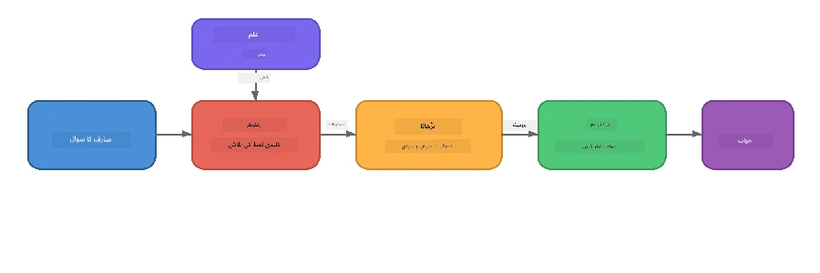

# حصہ 4: Foundry لوکل کے ساتھ RAG ایپلیکیشن بنانا

## جائزہ

بڑے زبان ماڈلز طاقتور ہیں، لیکن وہ صرف اتنا ہی جانتے ہیں جتنا ان کے تربیتی ڈیٹا میں تھا۔ **ریٹریول-اگمینٹڈ جنریشن (RAG)** اس مسئلے کو حل کرتا ہے ماڈل کو متعلقہ سیاق وقتِ تلاش پر فراہم کرکے — جو آپ کے اپنے دستاویزات، ڈیٹا بیسز، یا نالج بیسز سے نکالا جاتا ہے۔

اس لیب میں آپ ایک مکمل RAG پائپ لائن بنائیں گے جو **مکمل طور پر آپ کے آلے پر چلتی ہے** Foundry لوکل استعمال کرتے ہوئے۔ کوئی کلاؤڈ سروسز نہیں، کوئی ویکٹر ڈیٹا بیسز نہیں، کوئی ایمبیڈنگز API نہیں — صرف لوکل ریٹریول اور لوکل ماڈل۔

## سیکھنے کے اہداف

اس لیب کے اختتام تک آپ کر سکیں گے:

- سمجھائیں کہ RAG کیا ہے اور AI ایپلیکیشنز کے لیے کیوں اہم ہے  
- ٹیکسٹ دستاویزات سے ایک لوکل نالج بیس بنائیں  
- ایک سادہ ریٹریول فنکشن نافذ کریں جو متعلقہ سیاق تلاش کرے  
- ایک سسٹم پرامپٹ تیار کریں جو ماڈل کو حاصل کردہ حقائق پر مبنی کرے  
- مکمل Retrieve → Augment → Generate پائپ لائن کو آلے پر چلائیں  
- آسان کی ورڈ ریٹریول اور ویکٹر سرچ کے درمیان سود و زیاں کو سمجھیں  

---

## پیشگی ضروریات

- مکمل کریں [حصہ 3: OpenAI کے ساتھ Foundry لوکل SDK کا استعمال](part3-sdk-and-apis.md)  
- Foundry لوکل CLI انسٹال ہو اور `phi-3.5-mini` ماڈل ڈاؤن لوڈ ہو چکا ہو  

---

## تصور: RAG کیا ہے؟

RAG کے بغیر، ایک LLM صرف اپنے تربیتی ڈیٹا سے جواب دے سکتا ہے — جو شاید پرانا ہو، نامکمل ہو، یا آپ کی نجی معلومات موجود نہ ہو:

```
User: "What is Zava's return policy?"
LLM:  "I do not have information about Zava's return policy."  ← No context!
```
  
RAG کے ساتھ، آپ پہلے متعلقہ دستاویزات **واپس لاتے ہیں**، پھر اس سیاق کے ساتھ پرامپٹ کو **اگمینٹ** کرتے ہیں، اور آخر میں جواب **جنریٹ** کرتے ہیں:



اہم بات: **ماڈل کو جواب "جاننا" ضروری نہیں؛ اسے صرف درست دستاویزات پڑھنی ہوتی ہیں۔**

---

## لیب مشقیں

### مشق 1: نالج بیس کو سمجھیں

اپنی زبان کے لیے RAG مثال کھولیں اور نالج بیس کا مشاہدہ کریں:

<details>
<summary><b>🐍 پائتھن: <code>python/foundry-local-rag.py</code></b></summary>

نالج بیس ایک سادہ فہرست ہے جس میں ڈکشنریز ہیں جن میں `title` اور `content` کے شعبے ہوتے ہیں:

```python
KNOWLEDGE_BASE = [
    {
        "title": "Foundry Local Overview",
        "content": (
            "Foundry Local brings the power of Azure AI Foundry to your local "
            "device without requiring an Azure subscription..."
        ),
    },
    {
        "title": "Supported Hardware",
        "content": (
            "Foundry Local automatically selects the best model variant for "
            "your hardware. If you have an Nvidia CUDA GPU it downloads the "
            "CUDA-optimized model..."
        ),
    },
    # ... مزید اندراجات
]
```
  
ہر اندراج ایک "چنک" نالج کی نمائندگی کرتا ہے — ایک موضوع پر مرکوز معلومات کا ٹکڑا۔

</details>

<details>
<summary><b>📘 جاوا اسکرپٹ: <code>javascript/foundry-local-rag.mjs</code></b></summary>

نالج بیس کا ڈھانچہ ایک آبجیکٹس کی فہرست کی طرح ہے:

```javascript
const KNOWLEDGE_BASE = [
  {
    title: "Foundry Local Overview",
    content:
      "Foundry Local brings the power of Azure AI Foundry to your local " +
      "device without requiring an Azure subscription...",
  },
  {
    title: "Supported Hardware",
    content:
      "Foundry Local automatically selects the best model variant for " +
      "your hardware...",
  },
  // ... مزید اندراجات
];
```

</details>

<details>
<summary><b>💜 سی#: <code>csharp/RagPipeline.cs</code></b></summary>

نالج بیس ایک نامزد ٹیپلز کی لسٹ استعمال کرتا ہے:

```csharp
private static readonly List<(string Title, string Content)> KnowledgeBase =
[
    ("Foundry Local Overview",
     "Foundry Local brings the power of Azure AI Foundry to your local " +
     "device without requiring an Azure subscription..."),

    ("Supported Hardware",
     "Foundry Local automatically selects the best model variant for " +
     "your hardware..."),

    // ... more entries
];
```
  
</details>

> **حقیقی ایپلیکیشن میں،** نالج بیس فائلز، ڈیٹا بیس، سرچ انڈیکس، یا API سے آتا ہے۔ اس لیب کے لیے، ہم سادگی کے لیے ایک حافظے کی فہرست استعمال کرتے ہیں۔

---

### مشق 2: ریٹریول فنکشن کو سمجھیں

ریٹریول مرحلہ صارف کے سوال کے لیے سب سے متعلقہ چنکس تلاش کرتا ہے۔ یہ مثال **کی ورڈ اوورلیپ** استعمال کرتی ہے — یعنی ہر چنک میں کتنے سوال کے الفاظ موجود ہیں گننا:

<details>
<summary><b>🐍 پائتھن</b></summary>

```python
def retrieve(query: str, top_k: int = 2) -> list[dict]:
    """Return the top-k knowledge chunks most relevant to the query."""
    query_words = set(query.lower().split())
    scored = []
    for chunk in KNOWLEDGE_BASE:
        chunk_words = set(chunk["content"].lower().split())
        overlap = len(query_words & chunk_words)
        scored.append((overlap, chunk))
    scored.sort(key=lambda x: x[0], reverse=True)
    return [item[1] for item in scored[:top_k]]
```

</details>

<details>
<summary><b>📘 جاوا اسکرپٹ</b></summary>

```javascript
function retrieve(query, topK = 2) {
  const queryWords = new Set(query.toLowerCase().split(/\s+/));
  const scored = KNOWLEDGE_BASE.map((chunk) => {
    const chunkWords = new Set(chunk.content.toLowerCase().split(/\s+/));
    let overlap = 0;
    for (const w of queryWords) {
      if (chunkWords.has(w)) overlap++;
    }
    return { overlap, chunk };
  });
  scored.sort((a, b) => b.overlap - a.overlap);
  return scored.slice(0, topK).map((s) => s.chunk);
}
```

</details>

<details>
<summary><b>💜 سی#</b></summary>

```csharp
private static List<(string Title, string Content)> Retrieve(string query, int topK = 2)
{
    var queryWords = new HashSet<string>(
        query.ToLowerInvariant().Split(' ', StringSplitOptions.RemoveEmptyEntries));

    return KnowledgeBase
        .Select(chunk =>
        {
            var chunkWords = new HashSet<string>(
                chunk.Content.ToLowerInvariant().Split(' ', StringSplitOptions.RemoveEmptyEntries));
            var overlap = queryWords.Intersect(chunkWords).Count();
            return (Overlap: overlap, Chunk: chunk);
        })
        .OrderByDescending(x => x.Overlap)
        .Take(topK)
        .Select(x => x.Chunk)
        .ToList();
}
```

</details>

**کام کرنے کا طریقہ:**
1. سوال کو الفاظ میں تقسیم کریں  
2. ہر نالج چنک کے لیے گنیں کہ سوال کے کتنے الفاظ اس چنک میں ہیں  
3. اوورلیپ سکور کے مطابق ترتیب دیں (سب سے زیادہ پہلے)  
4. سب سے متعلقہ top-k چنکس واپس کریں  

> **معاہدہ:** کی ورڈ اوورلیپ آسان ہے مگر محدود؛ یہ ہم معنی الفاظ یا مفہوم کو نہیں سمجھتا۔ پروڈکشن RAG سسٹمز عام طور پر **ایمبیڈنگ ویکٹرز** اور **ویکٹر ڈیٹا بیس** استعمال کرتے ہیں۔ پھر بھی، کی ورڈ اوورلیپ شروعات کے لیے بہترین اور بغیر اضافی dependencies کے ہے۔

---

### مشق 3: اگمینٹڈ پرامپٹ کو سمجھیں

حاصل کردہ سیاق ماڈل کو بھیجے جانے سے پہلے **سسٹم پرامپٹ** میں شامل کیا جاتا ہے:

```python
system_prompt = (
    "You are a helpful assistant. Answer the user's question using ONLY "
    "the information provided in the context below. If the context does "
    "not contain enough information, say so.\n\n"
    f"Context:\n{context_text}"
)
```
  
اہم ڈیزائن فیصلے:  
- **"صرف فراہم کردہ معلومات"** — ماڈل کو اس بات سے روکتا ہے کہ وہ سیاق میں نہ ہونے والے حقائق گھڑنے لگے  
- **"اگر سیاق میں کافی معلومات نہیں، تو ایسی بات کہیں"** — ایماندار "مجھے نہیں معلوم" جواب کی حوصلہ افزائی  
- سیاق سسٹم پیغام میں شامل کیا جاتا ہے تاکہ تمام جوابات اس کے مطابق ہوں  

---

### مشق 4: RAG پائپ لائن چلائیں

مکمل مثال چلائیں:

**پائتھن:**  
```bash
cd python
python foundry-local-rag.py
```
  
**جاوا اسکرپٹ:**  
```bash
cd javascript
node foundry-local-rag.mjs
```
  
**سی#:**  
```bash
cd csharp
dotnet run rag
```
  
آپ کو تین چیزیں پرنٹ ہوتی نظر آئیں گی:  
1. **پوچھا گیا سوال**  
2. **حاصل کردہ سیاق** - نالج بیس سے منتخب کیے گئے چنکس  
3. **جواب** - ماڈل کی طرف سے صرف اس سیاق کو استعمال کرتے ہوئے بنایا گیا  

مثال خروجی:  
```
Question: How do I install Foundry Local and what hardware does it support?

--- Retrieved Context ---
### Installation
On Windows install Foundry Local with: winget install Microsoft.FoundryLocal...

### Supported Hardware
Foundry Local automatically selects the best model variant for your hardware...
-------------------------

Answer: To install Foundry Local, you can use the following methods depending
on your operating system: On Windows, run `winget install Microsoft.FoundryLocal`.
On macOS, use `brew install microsoft/foundrylocal/foundrylocal`...
```
  
نوٹ کریں کہ ماڈل کا جواب **حاصل کردہ سیاق پر مبنی** ہے — صرف دستاویزات میں موجود حقائق کا ذکر کرتا ہے۔

---

### مشق 5: تجربہ کریں اور توسیع دیں

سمجھ کو گہرا کرنے کے لیے یہ تبدیلیاں آزمائیں:

1. **سوال بدلیں** — کچھ ایسا پوچھیں جو نالج بیس میں ہو یا نہ ہو:  
   ```python
   question = "What programming languages does Foundry Local support?"  # ← سیاق و سباق میں
   question = "How much does Foundry Local cost?"                       # ← سیاق و سباق میں نہیں
   ```
   کیا ماڈل درست کہتا ہے "مجھے نہیں معلوم" جب جواب سیاق میں نہیں ہوتا؟  

2. **نیا نالج چنک شامل کریں** — `KNOWLEDGE_BASE` میں نیا اندراج شامل کریں:  
   ```python
   {
       "title": "Pricing",
       "content": "Foundry Local is completely free and open source under the MIT license.",
   }
   ```
   اب قیمت پوچھیں دوبارہ۔  

3. **`top_k` بدلیں** — زیادہ یا کم چنکس واپس لیں:  
   ```python
   context_chunks = retrieve(question, top_k=3)  # مزید سیاق و سباق
   context_chunks = retrieve(question, top_k=1)  # کم سیاق و سباق
   ```
   سیاق کی مقدار جواب کی کیفیت کو کیسے متاثر کرتی ہے؟  

4. **گراؤنڈنگ ہدایت ہٹائیں** — سسٹم پرامپٹ صرف "آپ ایک مددگار اسسٹنٹ ہیں" رکھیں اور دیکھیں کیا ماڈل حقائق گھڑنے لگتا ہے۔  

---

## گہرائی میں: آن-ڈیوائس پرفارمنس کے لیے RAG کی اصلاح

آن-ڈیوائس RAG چلانے میں وہ پابندیاں آتی ہیں جو کلاؤڈ میں نہیں ہوتیں: محدود ریم، کوئی مخصوص GPU نہیں (CPU/NPU استعمال)، اور ایک چھوٹا ماڈل سیاق ونڈو۔ نیچے دیے گئے ڈیزائن فیصلے ان پابندیوں کو براہ راست حل کرتے ہیں اور Foundry لوکل سے بنائی گئی پروڈکشن طرز کی لوکل RAG ایپلیکیشنز کے پیٹرنز پر مبنی ہیں۔

### چنکنگ حکمت عملی: فکسڈ سائز سلائیڈنگ ونڈو

چنکنگ — دستاویزات کو ٹکڑوں میں تقسیم کرنا — RAG سسٹم کا ایک اہم فیصلہ ہے۔ آن-ڈیوائس صورت میں، **اوورلیپ کے ساتھ فکسڈ سائز سلائیڈنگ ونڈو** تجویز کی جاتی ہے:

| پیرامیٹر | تجویز کردہ قدر | کیوں؟ |
|-----------|------------------|-------|
| **چنک سائز** | ~200 ٹوکنز | حاصل کردہ سیاق کو کمپیکٹ رکھتا ہے، Phi-3.5 Mini کے سیاق ونڈو میں سسٹم پرامپٹ، گفتگو کی ہسٹری، اور جواب کے لیے جگہ بچاتا ہے |
| **اوورلیپ** | ~25 ٹوکنز (12.5%) | چنک کی حدوں پر معلومات کے نقصان کو روکتا ہے — خاص طور پر طریقہ کار اور مرحلہ وار ہدایات کے لیے اہم |
| **ٹوکنائزیشن** | وائٹ اسپیس اسپلٹ | صفر dependencies، کوئی ٹوکنائزر لائبریری نہیں چاہیے۔ تمام کمپیوٹ بجٹ LLM کے لیے باقی رہتا ہے |

اوورلیپ ایسے کام کرتا ہے جیسے سلائیڈنگ ونڈو: ہر نیا چنک پچھلے کے اختتام سے 25 ٹوکن پہلے شروع ہوتا ہے، اس لیے جملے جو چنک کی حدوں پر پھیلے ہوئے ہیں دونوں چنکس میں شامل ہوتے ہیں۔

> **دیگر حکمت عملی کیوں نہیں؟**  
> - **جملے کی بنیاد پر تقسیم** غیر یقینی چنک سائز دیتی ہے؛ کچھ حفاظتی طریقے لمبے جملے ہوتے ہیں جو اچھی طرح تقسیم نہیں ہوتے  
> - **سیکشن-آگاہ تقسیم** (`##` ہیڈنگز پر) بہت مختلف سائز بناتی ہے — کچھ بہت چھوٹے، کچھ ماڈل کے سیاق ونڈو کے لیے بہت بڑے  
> - **سیمانٹک چنکنگ** (ایمبیڈنگ بنیاد پر موضوع کی شناخت) بہترین ریٹریول معیار دیتی ہے، مگر Phi-3.5 Mini کے ساتھ میموری میں دوسرا ماڈل ہونا پڑتا ہے — 8-16 جی بی شیئرڈ میموری والے ہارڈویئر کے لیے خطرناک  

### ریٹریول میں پیش رفت: TF-IDF ویکٹرز

کی ورڈ اوورلیپ طریقہ کام کرتا ہے، لیکن اگر آپ بہتر ریٹریول چاہتے ہیں بغیر embedding model شامل کیے، **TF-IDF (ٹرم فریکوئنسی-انورس ڈاکیومنٹ فریکوئنسی)** ایک بہترین درمیانی حل ہے:

```
Keyword Overlap  →  TF-IDF Vectors  →  Embedding Models
    (this lab)     (lightweight upgrade)   (production)
  Simple & fast    Better ranking,         Best quality,
  No dependencies  still no ML model       requires embedding model
  ~Basic matching  ~1ms retrieval          ~100-500ms per query
```
  
TF-IDF ہر چنک کو ایک عددی ویکٹر میں تبدیل کرتا ہے جو بتاتا ہے کہ ہر لفظ کتنی اہمیت رکھتا ہے اس چنک میں *تمام چنکس کے مقابلے میں*۔ وقتِ سوال، سوال کو اسی طرح ویکٹرائز کر کے کسائن مماثلت سے موازنہ کیا جاتا ہے۔ آپ اسے SQLite اور خالص جاوا اسکرپٹ/پائتھن سے نافذ کر سکتے ہیں — کوئی ویکٹر ڈیٹا بیس، کوئی ایمبیڈنگ API نہیں۔

> **کارکردگی:** فکسڈ سائز چنکس پر TF-IDF کسائن مماثلت عام طور پر **~1ms ریٹریول** فراہم کرتی ہے، بمقابلہ ~100-500ms جب embedding ماڈل ہر سوال کو انکوڈ کرتا ہے۔ تمام 20+ دستاویزات کو ایک سیکنڈ سے کم میں چنک اور انڈیکس کیا جا سکتا ہے۔

### محدد/کمپیکٹ موڈ محدود آلات کے لیے

بہت محدود ہارڈویئر (پرانے لیپ ٹاپس، ٹیبلٹس، فیلڈ ڈیوائسز) پر چلانے کے لیے آپ تین کنٹرول گھٹاکر وسائل کی کھپت کم کر سکتے ہیں:

| سیٹنگ | معیاری موڈ | ایج/کمپیکٹ موڈ |
|---------|--------------|-------------------|
| **سسٹم پرامپٹ** | ~300 ٹوکنز | ~80 ٹوکنز |
| **زیادہ سے زیادہ آؤٹ پٹ ٹوکنز** | 1024 | 512 |
| **حاصل کردہ چنکس (top-k)** | 5 | 3 |

کم چنکس حاصل کرنے سے ماڈل کے لیے کم سیاق ہوتا ہے، جس سے تاخیر اور میموری دباؤ کم ہوتا ہے۔ کم سسٹم پرامپٹ سیاق ونڈو میں جواب کے لیے زیادہ جگہ بناتا ہے۔ یہ سودا ان آلات پر فائدہ مند ہے جہاں ہر ٹوکن کی گنتی اہم ہوتی ہے۔

### میموری میں ایک ماڈل

آن-ڈیوائس RAG کے لیے سب سے اہم اصول: **صرف ایک ماڈل لوڈ رکھیں**۔ اگر آپ ریٹریول کے لیے embedding ماڈل اور جنریشن کے لیے زبان ماڈل استعمال کرتے ہیں، تو آپ محدود NPU/RAM وسائل کو دو ماڈلز میں تقسیم کر رہے ہیں۔ ہلکا پھلکا ریٹریول (کی ورڈ اوورلیپ، TF-IDF) اس سے بالکل بچتا ہے:

- کوئی embedding ماڈل LLM کے ساتھ میموری کے لیے مقابلہ نہیں کرتا  
- تیز سرد آغاز — صرف ایک ماڈل لوڈ کرنا ہے  
- متوقع میموری استعمال — LLM کو تمام وسائل حاصل ہوتے ہیں  
- 8 جی بی ریم والے مشینوں پر بھی کام کرتا ہے  

### SQLite بطور لوکل ویکٹر اسٹور

چھوٹے سے درمیانے درجے کے دستاویزی مجموعوں (سینکڑوں سے کم ہزاروں چنکس) کے لیے، **SQLite کافی تیز ہے** بروس فورس کسائن مماثلت تلاش کے لیے اور کوئی انفراسٹرکچر نہیں چاہیے:

- ایک `.db` فائل ڈسک پر — کوئی سرور یا کنفیگریشن نہیں  
- ہر بڑے لینگویج رن ٹائم کے ساتھ شامل (پائتھن `sqlite3`, Node.js `better-sqlite3`, .NET `Microsoft.Data.Sqlite`)  
- دستاویز چنکس کو TF-IDF ویکٹرز کے ساتھ ایک ٹیبل میں محفوظ کرتا ہے  
- Pinecone، Qdrant، Chroma، یا FAISS کی ضرورت نہیں  

### کارکردگی کا خلاصہ

یہ ڈیزائن انتخاب صارف کی ہارڈویئر پر جوابی RAG فراہم کرتے ہیں:

| میٹرک | آن-ڈیوائس کارکردگی |
|--------|----------------------|
| **ریٹریول تاخیر** | ~1ms (TF-IDF) سے ~5ms (کی ورڈ اوورلیپ) |
| **انجیشن اسپیڈ** | 20 دستاویزات چنک اور انڈیکس ایک سیکنڈ سےکم میں |
| **میموری میں ماڈلز** | 1 (صرف LLM — کوئی embedding ماڈل نہیں) |
| **اسٹوریج اوور ہیڈ** | SQLite میں چنکس + ویکٹرز کے لیے < 1 MB |
| **سرد آغاز** | ایک ماڈل لوڈ، embedding رن ٹائم شروع نہیں ہوتا |
| **ہارڈویئر فرش** | 8 GB RAM، صرف CPU (کوئی GPU ضروری نہیں) |

> **کب اپ گریڈ کریں:** اگر آپ سینکڑوں لمبے دستاویزات، مخلوط مواد (ٹیبلز، کوڈ، نثر)، یا سوالات کی معنوی سمجھ چاہتے ہیں، تو embedding ماڈل شامل کریں اور ویکٹر سیمیلیریٹی سرچ میں جائیں۔ زیادہ تر آن-ڈیوائس استعمالات کے لیے جو مرکوز دستاویزی مجموعے ہوتے ہیں، TF-IDF + SQLite بہترین نتائج دیتی ہے کم وسائل کے ساتھ۔

---

## کلیدی تصورات

| تصور | وضاحت |
|---------|-------------|
| **ریٹریول** | صارف کے سوال کی بنیاد پر نالج بیس سے متعلقہ دستاویزات تلاش کرنا |
| **اگمینٹیشن** | حاصل شدہ دستاویزات کو پرامپٹ میں سیاق کے طور پر شامل کرنا |
| **جنریشن** | LLM فراہم کردہ سیاق پر مبنی جواب بناتا ہے |
| **چنکنگ** | بڑے دستاویزات کو چھوٹے، مرکوز حصوں میں تقسیم کرنا |
| **گراؤنڈنگ** | ماڈل کو صرف فراہم کردہ سیاق استعمال کرنے پر محدود کرنا (حقائق گھڑنے کو کم کرتا ہے) |
| **Top-k** | سب سے متعلقہ کتنے چنکس حاصل کیے جائیں |

---

## RAG پروڈکشن بمقابلہ اس لیب

| پہلو | اس لیب | آن-ڈیوائس بہتر بنایا ہوا | کلاؤڈ پروڈکشن |
|--------|----------|--------------------|-----------------|
| **نالج بیس** | ان میموری فہرست | فائلیں ڈسک پر، SQLite | ڈیٹا بیس، سرچ انڈیکس |
| **ریٹریول** | کی ورڈ اوورلیپ | TF-IDF + کسائن مماثلت | ویکٹر ایمبیڈنگز + مماثلت سرچ |
| **ایمبیڈنگز** | نہیں چاہیے | نہیں — TF-IDF ویکٹرز | ایمبیڈنگ ماڈل (لوکل یا کلاؤڈ) |
| **ویکٹر اسٹور** | نہیں چاہیے | SQLite (ایک `.db` فائل) | FAISS، Chroma، Azure AI سرچ، وغیرہ |
| **چنکنگ** | دستی | فکسڈ سائز سلائیڈنگ ونڈو (~200 ٹوکنز، 25 ٹوکن اوورلیپ) | سیمانٹک یا ریکرسیو چنکنگ |
| **میموری میں ماڈلز** | 1 (LLM) | 1 (LLM) | 2+ (ایمبیڈنگ + LLM) |
| **حصول کی تاخیر** | تقریباً ۵ ملی سیکنڈ | تقریباً ۱ ملی سیکنڈ | تقریباً ۱۰۰-۵۰۰ ملی سیکنڈ |
| **پیمانہ** | ۵ دستاویزات | سینکڑوں دستاویزات | لاکھوں دستاویزات |

وہ پیٹرن جو آپ یہاں سیکھتے ہیں (حصول، اضافہ، تخلیق) کسی بھی پیمانے پر ایک جیسے ہوتے ہیں۔ حصول کا طریقہ بہتر ہوتا ہے، لیکن مجموعی فن تعمیر ایک جیسا رہتا ہے۔ وسطی کالم ہلکی پھلکی تکنیکوں کے ساتھ ڈیوائس پر حاصل کرنے کے قابل چیزیں دکھاتا ہے، جو عموماً مقامی ایپلیکیشنز کے لیے سب سے مناسب ہوتا ہے جہاں آپ رازداری، آف لائن صلاحیت، اور بیرونی خدمات کے صفر تاخیر کے بدلے کلاؤڈ اسکیل کو ترک کرتے ہیں۔

---

## اہم نکات

| تصور | آپ نے کیا سیکھا |
|---------|------------------|
| RAG پیٹرن | حاصل کریں + اضافہ کریں + تخلیق کریں: ماڈل کو صحیح سیاق و سباق دیں اور یہ آپ کے ڈیٹا کے بارے میں سوالات کے جواب دے سکتا ہے |
| ڈیوائس پر | سب کچھ مقامی طور پر چلتا ہے بغیر کسی کلاؤڈ API یا ویکٹر ڈیٹا بیس سبسکرپشن کے |
| گراؤنڈنگ ہدایات | نظام کی پرامپٹ کی پابندیاں ہیلوسینیشن کو روکنے کے لیے نہایت اہم ہیں |
| کلیدی لفظ کا اشتراک | حصول کے لیے ایک سادہ مگر موثر ابتدائی نقطہ نظر |
| TF-IDF + SQLite | ایک ہلکا پھلکا اپ گریڈ راستہ جو بغیر ایمبیڈنگ ماڈل کے حصول کو ۱ ملی سیکنڈ سے کم رکھتا ہے |
| ایک ماڈل میموری میں | محدود ہارڈویئر پر LLM کے ساتھ ایمبیڈنگ ماڈل لوڈ کرنے سے گریز کریں |
| چنک سائز | تقریبا ۲۰۰ ٹوکنز کے ساتھ اوورلیپ حصول کی درستگی اور سیاق و سباق کی ونڈو کی کارکردگی میں توازن رکھتا ہے |
| ایج/کمپیکٹ موڈ | بہت محدود ڈیوائسز کے لیے کم چنک اور چھوٹے پرامپٹس استعمال کریں |
| یونیورسل پیٹرن | ایک ہی RAG فن تعمیر کسی بھی ڈیٹا سورس کے لیے کام کرتا ہے: دستاویزات، ڈیٹا بیس، APIs، یا وکیز |

> **کیا آپ مکمل ڈیوائس پر RAG ایپلیکیشن دیکھنا چاہتے ہیں؟** دیکھیں [Gas Field Local RAG](https://github.com/leestott/local-rag)، ایک پروڈکشن طرز کا آف لائن RAG ایجنٹ جو Foundry Local اور Phi-3.5 Mini کے ساتھ بنایا گیا ہے اور حقیقی دنیا کے دستاویزات کے سیٹ کے ساتھ ان اصلاحی پیٹرنز کا مظاہرہ کرتا ہے۔

---

## اگلے اقدامات

جاری رکھیں [حصہ ۵: AI ایجنٹس کی تعمیر](part5-single-agents.md) تاکہ سیکھیں کہ مائیکروسافٹ ایجنٹ فریم ورک استعمال کرتے ہوئے کس طرح ذہین ایجنٹس کو شخصیت، ہدایات، اور کثیر الجہتی بات چیت کے ساتھ بنایا جاتا ہے۔