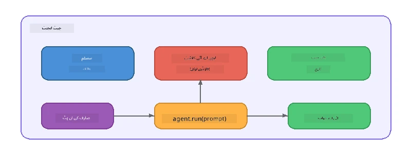

# حصہ 5: ایجنٹ فریم ورک کے ساتھ AI ایجنٹس کی تعمیر

> **هدف:** اپنی پہلی AI ایجنٹ بنائیں جس میں مستقل ہدایات اور ایک متعین شخصیت ہو، جو Foundry Local کے ذریعے لوکل ماڈل سے چلائی جائے۔

## AI ایجنٹ کیا ہے؟

AI ایجنٹ ایک زبان ماڈل کو **سسٹم ہدایات** کے ساتھ لپیٹتا ہے جو اس کے رویے، شخصیت، اور پابندیوں کی وضاحت کرتی ہیں۔ ایک واحد چیٹ کمپلیشن کال کے برعکس، ایک ایجنٹ فراہم کرتا ہے:

- **شخصیت** - ایک مستقل شناخت ("آپ ایک مددگار کوڈ ریویور ہیں")
- **میموری** - موڑوں کے درمیان گفتگو کی تاریخ
- **خصوصی مہارت** - اچھے طریقے سے تیار کردہ ہدایات سے چلنے والا مخصوص رویہ



---

## مائیکروسافٹ ایجنٹ فریم ورک

**Microsoft Agent Framework** (AGF) ایک معیاری ایجنٹ تجرید فراہم کرتا ہے جو مختلف ماڈل بیک اینڈز کے ساتھ کام کرتا ہے۔ اس ورکشاپ میں ہم اسے Foundry Local کے ساتھ جوڑتے ہیں تاکہ سب کچھ آپ کے کمپیوٹر پر چلے - کسی کلاؤڈ کی ضرورت نہیں۔

| تصور | وضاحت |
|---------|-------------|
| `FoundryLocalClient` | پائتھون: سروس اسٹارٹ، ماڈل ڈاؤن لوڈ/لوڈ کو ہینڈل کرتا ہے، اور ایجنٹس بناتا ہے |
| `client.as_agent()` | پائتھون: Foundry Local کلائنٹ سے ایک ایجنٹ بناتا ہے |
| `AsAIAgent()` | C#: `ChatClient` پر توسیعی طریقہ - ایک `AIAgent` بناتا ہے |
| `instructions` | سسٹم پرامپٹ جو ایجنٹ کے رویے کی تشکیل کرتا ہے |
| `name` | انسان کے پڑھنے کے قابل لیبل، جو کثیر ایجنٹ منظرناموں میں مددگار ہے |
| `agent.run(prompt)` / `RunAsync()` | صارف کا پیغام بھیجتا ہے اور ایجنٹ کا جواب لوٹاتا ہے |

> **نوٹ:** ایجنٹ فریم ورک کے پاس پائتھون اور .NET SDK ہے۔ جاوا اسکرپٹ کے لیے، ہم ایک ہلکا `ChatAgent` کلاس تیار کرتے ہیں جو OpenAI SDK کو براہ راست استعمال کرتے ہوئے یہی پیٹرن دہرائے۔

---

## مشقیں

### مشق 1 - ایجنٹ پیٹرن کو سمجھیں

کوڈ لکھنے سے پہلے، ایک ایجنٹ کے اہم اجزاء کا مطالعہ کریں:

1. **ماڈل کلائنٹ** - Foundry Local کے OpenAI-مطابق API سے جڑتا ہے
2. **سسٹم ہدایات** - "شخصیت" والا پرامپٹ
3. **رن لوپ** - صارف کی انپٹ بھیجنا، آؤٹ پٹ وصول کرنا

> **سوچیں:** سسٹم ہدایات عام صارف پیغام سے کیسے مختلف ہیں؟ اگر آپ انہیں بدلیں تو کیا ہوتا ہے؟

---

### مشق 2 - واحد ایجنٹ کی مثال چلائیں

<details>
<summary><strong>🐍 پائتھون</strong></summary>

**ضروریات:**
```bash
cd python
python -m venv venv

# ونڈوز (پاور شیل):
venv\Scripts\Activate.ps1
# میک او ایس:
source venv/bin/activate

pip install -r requirements.txt
```

**چلائیں:**
```bash
python foundry-local-with-agf.py
```

**کوڈ واک تھرو** (`python/foundry-local-with-agf.py`):

```python
import asyncio
from agent_framework_foundry_local import FoundryLocalClient

async def main():
    alias = "phi-4-mini"

    # فاؤنڈری لوکل کلائنٹ سروس کی شروعات، ماڈل ڈاؤن لوڈ، اور لوڈنگ کو سنبھالتا ہے
    client = FoundryLocalClient(model_id=alias)
    print(f"Client Model ID: {client.model_id}")

    # سسٹم ہدایات کے ساتھ ایک ایجنٹ بنائیں
    agent = client.as_agent(
        name="Joker",
        instructions="You are good at telling jokes.",
    )

    # نان اسٹریمنگ: مکمل جواب ایک ساتھ حاصل کریں
    result = await agent.run("Tell me a joke about a pirate.")
    print(f"Agent: {result}")

    # اسٹریمنگ: نتائج جوں جوں پیدا ہوں حاصل کریں
    async for chunk in agent.run("Tell me another joke.", stream=True):
        if chunk.text:
            print(chunk.text, end="", flush=True)

asyncio.run(main())
```

**اہم نکات:**
- `FoundryLocalClient(model_id=alias)` سروس اسٹارٹ، ڈاؤن لوڈ، اور ماڈل لوڈنگ کو ایک مرحلے میں ہینڈل کرتا ہے
- `client.as_agent()` سسٹم ہدایات اور نام کے ساتھ ایجنٹ بناتا ہے
- `agent.run()` نان-اسٹریمنگ اور اسٹریمنگ دونوں وضعوں کی حمایت کرتا ہے
- `pip install agent-framework-foundry-local --pre` کے ذریعے انسٹال کریں

</details>

<details>
<summary><strong>📦 جاوا اسکرپٹ</strong></summary>

**ضروریات:**
```bash
cd javascript
npm install
```

**چلائیں:**
```bash
node foundry-local-with-agent.mjs
```

**کوڈ واک تھرو** (`javascript/foundry-local-with-agent.mjs`):

```javascript
import { OpenAI } from "openai";
import { FoundryLocalManager } from "foundry-local-sdk";

class ChatAgent {
  constructor({ client, modelId, instructions, name }) {
    this.client = client;
    this.modelId = modelId;
    this.instructions = instructions;
    this.name = name;
    this.history = [];
  }

  async run(userMessage) {
    const messages = [
      { role: "system", content: this.instructions },
      ...this.history,
      { role: "user", content: userMessage },
    ];
    const response = await this.client.chat.completions.create({
      model: this.modelId,
      messages,
    });
    const assistantMessage = response.choices[0].message.content;

    // متعدد بار بات چیت کے لیے گفتگومحضوظ رکھیں
    this.history.push({ role: "user", content: userMessage });
    this.history.push({ role: "assistant", content: assistantMessage });
    return { text: assistantMessage };
  }
}

async function main() {
  FoundryLocalManager.create({ appName: "FoundryLocalWorkshop" });
  const manager = FoundryLocalManager.instance;
  await manager.startWebService();

  const catalog = manager.catalog;
  const model = await catalog.getModel("phi-3.5-mini");
  if (!model.isCached) {
    console.log("Downloading model: phi-3.5-mini...");
    await model.download();
  }
  await model.load();

  const client = new OpenAI({
    baseURL: manager.urls[0] + "/v1",
    apiKey: "foundry-local",
  });

  const agent = new ChatAgent({
    client,
    modelId: model.id,
    instructions: "You are good at telling jokes.",
    name: "Joker",
  });

  const result = await agent.run("Tell me a joke about a pirate.");
  console.log(result.text);
}

main();
```

**اہم نکات:**
- جاوا اسکرپٹ اپنی `ChatAgent` کلاس بناتا ہے جو پائتھون AGF پیٹرن کی نقل کرتی ہے
- `this.history` ملٹی ٹرن سپورٹ کے لیے گفتگو کے موڑ رکھتا ہے
- واضح `startWebService()` → کیش چیک → `model.download()` → `model.load()` مکمل بصیرت دیتا ہے

</details>

<details>
<summary><strong>💜 C#</strong></summary>

**ضروریات:**
```bash
cd csharp
dotnet restore
```

**چلائیں:**
```bash
dotnet run agent
```

**کوڈ واک تھرو** (`csharp/SingleAgent.cs`):

```csharp
using Microsoft.AI.Foundry.Local;
using Microsoft.Extensions.Logging.Abstractions;
using Microsoft.Agents.AI;
using OpenAI;
using System.ClientModel;

// 1. Start Foundry Local and load a model
var alias = "phi-3.5-mini";
await FoundryLocalManager.CreateAsync(
    new Configuration
    {
        AppName = "FoundryLocalSamples",
        Web = new Configuration.WebService { Urls = "http://127.0.0.1:0" }
    }, NullLogger.Instance, default);
var manager = FoundryLocalManager.Instance;
await manager.StartWebServiceAsync(default);

var catalog = await manager.GetCatalogAsync(default);
var model = await catalog.GetModelAsync(alias, default);

var isCached = await model.IsCachedAsync(default);
if (!isCached)
{
    Console.WriteLine($"Downloading model: {alias}...");
    await model.DownloadAsync(null, default);
}
await model.LoadAsync(default);

var key = new ApiKeyCredential("foundry-local");
var client = new OpenAIClient(key, new OpenAIClientOptions
{
    Endpoint = new Uri(manager.Urls[0] + "/v1")
});

// 2. Create an AIAgent using the Agent Framework extension method
AIAgent joker = client
    .GetChatClient(model.Id)
    .AsAIAgent(
        instructions: "You are good at telling jokes. Keep your jokes short and family-friendly.",
        name: "Joker"
    );

// 3. Run the agent (non-streaming)
var response = await joker.RunAsync("Tell me a joke about a pirate.");
Console.WriteLine($"Joker: {response}");

// 4. Run with streaming
await foreach (var update in joker.RunStreamingAsync("Tell me another joke."))
{
    Console.Write(update);
}
```

**اہم نکات:**
- `AsAIAgent()` `Microsoft.Agents.AI.OpenAI` سے توسیعی طریقہ ہے - کوئی کسٹم `ChatAgent` کلاس ضروری نہیں
- `RunAsync()` مکمل جواب لوٹاتا ہے؛ `RunStreamingAsync()` ایک ٹوکن بہ ایک ٹوکن اسٹریمنگ کرتا ہے
- `dotnet add package Microsoft.Agents.AI.OpenAI --version 1.0.0-rc3` سے انسٹال کریں

</details>

---

### مشق 3 - شخصیت تبدیل کریں

ایجنٹ کی `instructions` تبدیل کرکے مختلف شخصیت بنائیں۔ ہر ایک آزمائیں اور دیکھیں کہ آؤٹ پٹ کیسے بدلتا ہے:

| شخصیت | ہدایات |
|---------|-------------|
| کوڈ ریویور | `"آپ ایک ماہر کوڈ ریویور ہیں۔ پڑھنے میں آسانی، کارکردگی، اور درستگی پر توجہ مرکوز کرتے ہوئے تعمیری تاثرات دیں۔"` |
| سیاحتی رہنما | `"آپ ایک دوستانہ سیاحتی رہنما ہیں۔ مقامات، سرگرمیوں، اور مقامی کھانوں کے لیے ذاتی سفارشات دیں۔"` |
| سقراطی استاد | `"آپ ایک سقراطی استاد ہیں۔ کبھی براہِ راست جواب نہ دیں - اس کے بجائے، شاگرد کو سوچنے والے سوالات سے رہنمائی کریں۔"` |
| تکنیکی مصنف | `"آپ ایک تکنیکی مصنف ہیں۔ تصورات کو واضح اور مختصر انداز میں بیان کریں۔ مثالیں دیں۔ اصطلاحات سے بچیں۔"` |

**کوشش کریں:**
1. جدول میں سے کوئی ایک شخصیت منتخب کریں
2. کوڈ میں `instructions` کی اسٹرنگ کو تبدیل کریں
3. صارف کے پرامپٹ کو مطابق کریں (مثلاً کوڈ ریویور سے کسی فنکشن کا جائزہ لینے کو کہیں)
4. مثال دوبارہ چلائیں اور آؤٹ پٹ کا موازنہ کریں

> **ٹپ:** ایک ایجنٹ کی معیار بہت حد تک ہدایات پر منحصر ہے۔ مخصوص، منظم ہدایات مبہم ہدایات کی نسبت بہتر نتائج دیتی ہیں۔

---

### مشق 4 - کثیر موڑ گفتگو شامل کریں

مثال کو توسیع دیں تاکہ یہ ایک کثیر موڑ چیٹ لوپ کو سپورٹ کرے تاکہ آپ ایجنٹ کے ساتھ واپس اور آگے گفتگو کر سکیں۔

<details>
<summary><strong>🐍 پائتھون - کثیر موڑ لوپ</strong></summary>

```python
import asyncio
from agent_framework_foundry_local import FoundryLocalClient

async def main():
    client = FoundryLocalClient(model_id="phi-4-mini")

    agent = client.as_agent(
        name="Assistant",
        instructions="You are a helpful assistant.",
    )

    print("Chat with the agent (type 'quit' to exit):\n")
    while True:
        user_input = input("You: ")
        if user_input.strip().lower() in ("quit", "exit"):
            break
        result = await agent.run(user_input)
        print(f"Agent: {result}\n")

asyncio.run(main())
```

</details>

<details>
<summary><strong>📦 جاوا اسکرپٹ - کثیر موڑ لوپ</strong></summary>

```javascript
import { OpenAI } from "openai";
import { FoundryLocalManager } from "foundry-local-sdk";
import * as readline from "node:readline/promises";

// (کلاس ChatAgent کو Exercise 2 سے دوبارہ استعمال کریں)

async function main() {
  FoundryLocalManager.create({ appName: "FoundryLocalWorkshop" });
  const manager = FoundryLocalManager.instance;
  await manager.startWebService();

  const catalog = manager.catalog;
  const model = await catalog.getModel("phi-3.5-mini");
  if (!model.isCached) {
    console.log("Downloading model: phi-3.5-mini...");
    await model.download();
  }
  await model.load();

  const client = new OpenAI({
    baseURL: manager.urls[0] + "/v1",
    apiKey: "foundry-local",
  });

  const agent = new ChatAgent({
    client,
    modelId: model.id,
    instructions: "You are a helpful assistant.",
    name: "Assistant",
  });

  const rl = readline.createInterface({
    input: process.stdin,
    output: process.stdout,
  });

  console.log("Chat with the agent (type 'quit' to exit):\n");
  while (true) {
    const userInput = await rl.question("You: ");
    if (["quit", "exit"].includes(userInput.trim().toLowerCase())) break;
    const result = await agent.run(userInput);
    console.log(`Agent: ${result.text}\n`);
  }
  rl.close();
}

main();
```

</details>

<details>
<summary><strong>💜 C# - کثیر موڑ لوپ</strong></summary>

```csharp
using Microsoft.AI.Foundry.Local;
using Microsoft.Extensions.Logging.Abstractions;
using Microsoft.Agents.AI;
using OpenAI;
using System.ClientModel;

var alias = "phi-3.5-mini";
var config = new Configuration
{
    AppName = "FoundryLocalSamples",
    Web = new Configuration.WebService { Urls = "http://127.0.0.1:0" }
};
await FoundryLocalManager.CreateAsync(config, NullLogger.Instance, default);
var manager = FoundryLocalManager.Instance;
await manager.StartWebServiceAsync(default);

var catalog = await manager.GetCatalogAsync(default);
var model = await catalog.GetModelAsync(alias, default);

var isCached = await model.IsCachedAsync(default);
if (!isCached)
{
    Console.WriteLine($"Downloading model: {alias}...");
    await model.DownloadAsync(null, default);
}
await model.LoadAsync(default);

var key = new ApiKeyCredential("foundry-local");
var client = new OpenAIClient(key, new OpenAIClientOptions
{
    Endpoint = new Uri(manager.Urls[0] + "/v1")
});

AIAgent agent = client
    .GetChatClient(model.Id)
    .AsAIAgent(
        instructions: "You are a helpful assistant.",
        name: "Assistant"
    );

Console.WriteLine("Chat with the agent (type 'quit' to exit):\n");
while (true)
{
    Console.Write("You: ");
    var userInput = Console.ReadLine();
    if (string.IsNullOrWhiteSpace(userInput) ||
        userInput.Equals("quit", StringComparison.OrdinalIgnoreCase) ||
        userInput.Equals("exit", StringComparison.OrdinalIgnoreCase))
        break;

    var result = await agent.RunAsync(userInput);
    Console.WriteLine($"Agent: {result}\n");
}
```

</details>

دیکھیے کیسے ایجنٹ پچھلے موڑ یاد رکھتا ہے - مزید سوال کریں اور دیکھیں کہ سیاق و سباق کیسے جاری رہتا ہے۔

---

### مشق 5 - منظم آؤٹ پٹ

ایجنٹ کو ہدایت دیں کہ وہ ہمیشہ مخصوص فارمیٹ (مثلاً JSON) میں جواب دے اور نتیجہ کو پارس کریں:

<details>
<summary><strong>🐍 پائتھون - JSON آؤٹ پٹ</strong></summary>

```python
import asyncio
import json
from agent_framework_foundry_local import FoundryLocalClient

async def main():
    client = FoundryLocalClient(model_id="phi-4-mini")

    agent = client.as_agent(
        name="SentimentAnalyzer",
        instructions=(
            "You are a sentiment analysis agent. "
            "For every user message, respond ONLY with valid JSON in this format: "
            '{"sentiment": "positive|negative|neutral", "confidence": 0.0-1.0, "summary": "brief reason"}'
        ),
    )

    result = await agent.run("I absolutely loved the new restaurant downtown!")
    print("Raw:", result)

    try:
        parsed = json.loads(str(result))
        print(f"Sentiment: {parsed['sentiment']} (confidence: {parsed['confidence']})")
    except json.JSONDecodeError:
        print("Agent did not return valid JSON - try refining the instructions.")

asyncio.run(main())
```

</details>

<details>
<summary><strong>💜 C# - JSON آؤٹ پٹ</strong></summary>

```csharp
using System.Text.Json;

AIAgent analyzer = chatClient.AsAIAgent(
    name: "SentimentAnalyzer",
    instructions:
        "You are a sentiment analysis agent. " +
        "For every user message, respond ONLY with valid JSON in this format: " +
        "{\"sentiment\": \"positive|negative|neutral\", \"confidence\": 0.0-1.0, \"summary\": \"brief reason\"}"
);

var response = await analyzer.RunAsync("I absolutely loved the new restaurant downtown!");
Console.WriteLine($"Raw: {response}");

try
{
    var parsed = JsonSerializer.Deserialize<JsonElement>(response.ToString());
    Console.WriteLine($"Sentiment: {parsed.GetProperty("sentiment")} " +
                      $"(confidence: {parsed.GetProperty("confidence")})");
}
catch (JsonException)
{
    Console.WriteLine("Agent did not return valid JSON - try refining the instructions.");
}
```

</details>

> **نوٹ:** چھوٹے لوکل ماڈلز ہمیشہ مکمل درست JSON پیدا نہیں کرتے۔ آپ ہدایات میں ایک مثال شامل کرکے اور متوقع فارمیٹ کے بارے میں بہت واضح ہو کر قابل اعتماد بنا سکتے ہیں۔

---

## کلیدی نکات

| تصور | آپ نے کیا سیکھا |
|---------|-----------------|
| ایجنٹ بمقابلہ خام LLM کال | ایک ایجنٹ ماڈل کو ہدایات اور میموری کے ساتھ لپیٹتا ہے |
| سسٹم ہدایات | ایجنٹ کے رویے کو کنٹرول کرنے کا سب سے اہم ذریعہ |
| کثیر موڑ گفتگو | ایجنٹس متعدد صارف تعاملات میں سیاق و سباق رکھ سکتے ہیں |
| منظم آؤٹ پٹ | ہدایات آؤٹ پٹ فارمیٹ (JSON، مارک ڈاؤن، وغیرہ) کو نافذ کر سکتی ہیں |
| لوکل اجرا | سب کچھ Foundry Local کے ذریعے آلے پر چلتا ہے - کلاؤڈ کی ضرورت نہیں |

---

## اگلے اقدامات

**[حصہ 6: کثیر ایجنٹ ورک فلو](part6-multi-agent-workflows.md)** میں، آپ متعدد ایجنٹس کو منظم پائپ لائن میں ملائیں گے جہاں ہر ایجنٹ کی خاص مہارت ہوگی۔