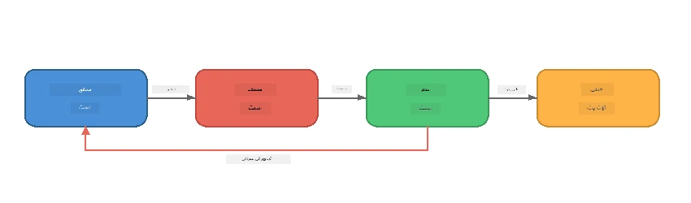
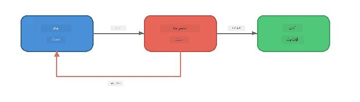
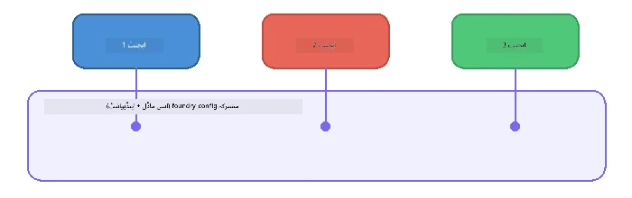

# حصہ 6: ملٹی ایجنٹ ورک فلو

> **مقصد:** متعدد ماہر ایجنٹس کو مربوط پائیپ لائنز میں ایک ساتھ جوڑنا جو پیچیدہ کاموں کو مل کر کام کرنے والے ایجنٹس کے درمیان تقسیم کریں - تمام کام Foundry Local پر لوکل سطح پر چل رہے ہوں۔

## ملٹی ایجنٹ کیوں؟

ایک واحد ایجنٹ بہت سے کام سنبھال سکتا ہے، لیکن پیچیدہ ورک فلو **تخصص** سے فائدہ اٹھاتے ہیں۔ ایک ایجنٹ کے ایک ساتھ تحقیق، تحریر، اور تدوین کرنے کی بجائے، کام کو مخصوص کرداروں میں تقسیم کیا جاتا ہے:



| نمونہ | وضاحت |
|---------|-------------|
| **ترتیبی** | ایجنٹ A کا آؤٹ پٹ ایجنٹ B میں جاتا ہے → پھر ایجنٹ C میں |
| **فیڈبیک لوپ** | ایک جائزہ لینے والا ایجنٹ کام کو نظرثانی کے لیے واپس بھیج سکتا ہے |
| **مشترکہ سیاق و سباق** | تمام ایجنٹس ایک ہی ماڈل/اینڈ پوائنٹ استعمال کرتے ہیں، لیکن مختلف ہدایات کے ساتھ |
| **ٹائپڈ آؤٹ پٹ** | ایجنٹس منظم نتائج (JSON) پیدا کرتے ہیں تاکہ قابل اعتماد حوالگی ہو |

---

## مشقیں

### مشق 1 - ملٹی ایجنٹ پائپ لائن چلائیں

ورکشاپ میں مکمل Researcher → Writer → Editor ورک فلو شامل ہے۔

<details>
<summary><strong>🐍 پائتھون</strong></summary>

**سیٹ اپ:**
```bash
cd python
python -m venv venv

# ونڈوز (پاور شیل):
venv\Scripts\Activate.ps1
# میک او ایس:
source venv/bin/activate

pip install -r requirements.txt
```

**چلائیں:**
```bash
python foundry-local-multi-agent.py
```

**کیا ہوتا ہے:**
1. **ریسرچر** ایک موضوع وصول کرتا ہے اور بلٹ پوائنٹ حقائق واپس دیتا ہے
2. **رائٹر** تحقیق کا استعمال کر کے بلاگ پوسٹ کا مسودہ تیار کرتا ہے (3-4 پیراگراف)
3. **ایڈیٹر** معیار کے لیے آرٹیکل کا جائزہ لیتا ہے اور قبول (ACCEPT) یا نظر ثانی (REVISE) واپس کرتا ہے

</details>

<details>
<summary><strong>📦 جاوا اسکرپٹ</strong></summary>

**سیٹ اپ:**
```bash
cd javascript
npm install
```

**چلائیں:**
```bash
node foundry-local-multi-agent.mjs
```

**وہی تین مرحلوں والی پائپ لائن** - Researcher → Writer → Editor۔

</details>

<details>
<summary><strong>💜 سی شارپ</strong></summary>

**سیٹ اپ:**
```bash
cd csharp
dotnet restore
```

**چلائیں:**
```bash
dotnet run multi
```

**وہی تین مرحلوں والی پائپ لائن** - Researcher → Writer → Editor۔

</details>

---

### مشق 2 - پائپ لائن کا تجزیہ

مطالعہ کریں کہ ایجنٹس کو کیسے پرکھا اور منسلک کیا جاتا ہے:

**1. مشترکہ ماڈل کلائنٹ**

تمام ایجنٹس ایک ہی Foundry Local ماڈل استعمال کرتے ہیں:

```python
# پائتھن - FoundryLocalClient سب کچھ سنبھالتا ہے
from agent_framework_foundry_local import FoundryLocalClient

client = FoundryLocalClient(model_id="phi-3.5-mini")
```

```javascript
// جاوا اسکرپٹ - OpenAI SDK جو Foundry Local کی طرف اشارہ کر رہا ہے
const client = new OpenAI({
  baseURL: manager.urls[0] + "/v1",
  apiKey: "foundry-local",
});
```

```csharp
// C# - OpenAIClient pointed at Foundry Local
var key = new ApiKeyCredential("foundry-local");
var client = new OpenAIClient(key, new OpenAIClientOptions
{
    Endpoint = new Uri(manager.Urls[0] + "/v1")
});
var chatClient = client.GetChatClient(model.Id);
```

**2. تخصص شدہ ہدایات**

ہر ایجنٹ کا ایک منفرد کردار ہوتا ہے:

| ایجنٹ | ہدایات (خلاصہ) |
|-------|----------------------|
| Researcher | "اہم حقائق، اعداد و شمار، اور پس منظر فراہم کریں۔ بلٹ پوائنٹس کی شکل میں ترتیب دیں۔" |
| Writer | "تحقیقی نوٹس سے ایک پرکشش بلاگ پوسٹ لکھیں (3-4 پیراگراف)۔ حقائق ایجاد نہ کریں۔" |
| Editor | "وضاحت، گرامر، اور حقائق کی مطابقت کے لیے نظر ثانی کریں۔ فیصلہ: قبول کریں یا نظرثانی کریں۔" |

**3. ایجنٹس کے درمیان ڈیٹا کا بہاؤ**

```python
# مرحلہ 1 - محقق کی پیداوار مصنف کے لیے ان پٹ بن جاتی ہے
research_result = await researcher.run(f"Research: {topic}")

# مرحلہ 2 - مصنف کی پیداوار مدیر کے لیے ان پٹ بن جاتی ہے
writer_result = await writer.run(f"Write using:\n{research_result}")

# مرحلہ 3 - مدیر تحقیق اور مضمون دونوں کا جائزہ لیتا ہے
editor_result = await editor.run(
    f"Research:\n{research_result}\n\nArticle:\n{writer_result}"
)
```

```csharp
// C# - same pattern, async calls with AIAgent
var researchNotes = await researcher.RunAsync(
    $"Research the following topic and provide key facts:\n{topic}");

var draft = await writer.RunAsync(
    $"Write a blog post based on these research notes:\n\n{researchNotes}");

var verdict = await editor.RunAsync(
    $"Review this article for quality and accuracy.\n\n" +
    $"Research notes:\n{researchNotes}\n\n" +
    $"Article:\n{draft}");
```

> **اہم بصیرت:** ہر ایجنٹ پچھلے ایجنٹس کا مجموعی سیاق و سباق وصول کرتا ہے۔ ایڈیٹر اور تو تحقیق اور مسودے دونوں دیکھتا ہے—یہ حقائق کی مطابقت چیک کرنے دیتا ہے۔

---

### مشق 3 - چوتھا ایجنٹ شامل کریں

پائپ لائن میں ایک نیا ایجنٹ شامل کریں۔ انتخاب کریں:

| ایجنٹ | مقصد | ہدایات |
|-------|---------|-------------|
| **Fact-Checker** | مضمون میں دعوؤں کی تصدیق کریں | `"آپ حقائق کی تصدیق کرتے ہیں۔ ہر دعوے کے لئے بتائیں کہ آیا وہ تحقیقی نوٹس سے ثابت ہوتا ہے یا نہیں۔ JSON میں تصدیق شدہ/غیر تصدیق شدہ اشیاء واپس کریں۔"` |
| **Headline Writer** | دلکش عنوانات تخلیق کریں | `"مضمون کے لیے 5 مختلف عنوانات تیار کریں۔ انداز مختلف کریں: معلوماتی، کلک بیٹ، سوالیہ، لسٹیکل، جذباتی۔"` |
| **Social Media** | تشہیری پوسٹس بنائیں | `"مضمون کی تشہیر کے لیے 3 سوشل میڈیا پوسٹیں بنائیں: ایک ٹویٹر کے لیے (280 حروف)، ایک لنکڈ اِن (پروفیشنل انداز)، ایک انسٹاگرام (آرام دہ انداز ایموجی تجاویز کے ساتھ)۔"` |

<details>
<summary><strong>🐍 پائتھون - Headline Writer شامل کرنا</strong></summary>

```python
headline_agent = client.as_agent(
    name="HeadlineWriter",
    instructions=(
        "You are a headline specialist. Given an article, generate exactly "
        "5 headline options. Vary the style: informative, question-based, "
        "listicle, emotional, and provocative. Return them as a numbered list."
    ),
)

# ایڈیٹر کی منظوری کے بعد، سرخیاں تیار کریں
headline_result = await headline_agent.run(
    f"Generate headlines for this article:\n\n{writer_result}"
)
print(f"\n--- Headlines ---\n{headline_result}")
```

</details>

<details>
<summary><strong>📦 جاوا اسکرپٹ - Headline Writer شامل کرنا</strong></summary>

```javascript
const headlineAgent = new ChatAgent({
  client,
  modelId: modelInfo.id,
  instructions:
    "You are a headline specialist. Given an article, generate exactly " +
    "5 headline options. Vary the style: informative, question-based, " +
    "listicle, emotional, and provocative. Return them as a numbered list.",
  name: "HeadlineWriter",
});

const headlineResult = await headlineAgent.run(
  `Generate headlines for this article:\n\n${writerResult.text}`
);
console.log(`\n--- Headlines ---\n${headlineResult.text}`);
```

</details>

<details>
<summary><strong>💜 سی شارپ - Headline Writer شامل کرنا</strong></summary>

```csharp
AIAgent headlineAgent = chatClient.AsAIAgent(
    name: "HeadlineWriter",
    instructions:
        "You are a headline specialist. Given an article, generate exactly " +
        "5 headline options. Vary the style: informative, question-based, " +
        "listicle, emotional, and provocative. Return them as a numbered list."
);

// After the editor accepts, generate headlines
var headlines = await headlineAgent.RunAsync(
    $"Generate headlines for this article:\n\n{draft}");
Console.WriteLine($"\n--- Headlines ---\n{headlines}");
```

</details>

---

### مشق 4 - اپنا ورک فلو ڈیزائن کریں

کسی مختلف شعبے کے لیے ملٹی ایجنٹ پائپ لائن ڈیزائن کریں۔ یہاں کچھ مثالیں ہیں:

| شعبہ | ایجنٹس | بہاؤ |
|--------|--------|------|
| **کوڈ کا جائزہ** | Analyser → Reviewer → Summariser | کوڈ کی ساخت کا تجزیہ → مسائل کی جانچ → خلاصے کی رپورٹ بنائیں |
| **کسٹمر سپورٹ** | Classifier → Responder → QA | ٹکٹ کی درجہ بندی کریں → جواب کا مسودہ تیار کریں → معیار چیک کریں |
| **تعلیم** | Quiz Maker → Student Simulator → Grader | کوئز تیار کریں → جوابات کی نقل کریں → گریڈ کریں اور وضاحت کریں |
| **ڈیٹا تجزیہ** | Interpreter → Analyst → Reporter | ڈیٹا کی درخواست کی تشریح کریں → نمونوں کا تجزیہ کریں → رپورٹ لکھیں |

**مراحل:**
1. 3+ ایجنٹس کو واضح `instructions` کے ساتھ تعریف کریں
2. ڈیٹا کے بہاؤ کا تعین کریں - ہر ایجنٹ کیا وصول کرے گا اور کیا پیدا کرے گا؟
3. مشق 1-3 کے نمونوں کو استعمال کر کے پائپ لائن نافذ کریں
4. اگر کوئی ایجنٹ دوسرے کے کام کا جائزہ لے تو فیڈبیک لوپ شامل کریں

---

## آرکیسٹریشن کے نمونے

یہاں آرکیسٹریشن کے ایسے نمونے پیش کیے گئے ہیں جو کسی بھی ملٹی ایجنٹ سسٹم پر لاگو ہوتے ہیں (گہرائی میں [حصہ 7](part7-zava-creative-writer.md) میں دیکھے گئے):

### ترتیبی پائپ لائن


ہر ایجنٹ پچھلے ایجنٹ کے آؤٹ پٹ کو پروسیس کرتا ہے۔ سادہ اور پیش گوئی کے قابل۔

### فیڈبیک لوپ



ایک جائزہ لینے والا ایجنٹ شروع کے مراحل کو دوبارہ چلانے کا سبب بن سکتا ہے۔ زوا رائٹر اس کا استعمال کرتا ہے: ایڈیٹر تحقیق کار اور رائٹر کو فیڈبیک بھیج سکتا ہے۔

### مشترکہ سیاق و سباق



تمام ایجنٹس ایک ہی `foundry_config` شیئر کرتے ہیں تاکہ وہ ایک ہی ماڈل اور اینڈ پوائنٹ استعمال کریں۔

---

## کلیدی نکات

| تصور | آپ نے کیا سیکھا |
|---------|-----------------|
| ایجنٹ کی تخصص | ہر ایجنٹ مخصوص ہدایات کے ساتھ ایک کام اچھی طرح کرتا ہے |
| ڈیٹا حوالہ جات | ایک ایجنٹ کا آؤٹ پٹ اگلے کا ان پٹ بن جاتا ہے |
| فیڈبیک لوپس | جائزہ لینے والا اعلی معیار کے لیے دوبارہ کوشش کروا سکتا ہے |
| منظم آؤٹ پٹ | JSON فارمٹڈ جوابات ایجنٹس کے درمیان قابل اعتماد رابطہ فراہم کرتے ہیں |
| آرکیسٹریشن | ایک کوآرڈینیٹر پائپ لائن کی ترتیب اور ایرر ہینڈلنگ کا انتظام کرتا ہے |
| پروڈکشن کے نمونے | [حصہ 7: زوا کریئیٹو رائٹر](part7-zava-creative-writer.md) میں استعمال شدہ |

---

## اگلے مراحل

[حصہ 7: زوا کریئیٹو رائٹر - کیپ اسٹون ایپلیکیشن](part7-zava-creative-writer.md) پر جائیں تاکہ ایک پروڈکشن طرز کا ملٹی ایجنٹ اپلیکیشن دریافت کریں جس میں 4 تخصص شدہ ایجنٹس، سٹریمنگ آؤٹ پٹ، پروڈکٹ سرچ، اور فیڈبیک لوپ شامل ہیں - دستیاب پائتھون، جاوا اسکرپٹ، اور سی شارپ میں۔