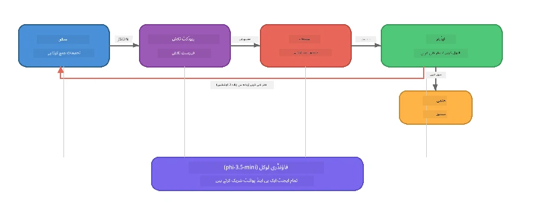

# حصہ 7: زاوا کریئیٹو رائٹر - کیپ اسٹون اپلیکیشن

> **مقصد:** ایک پروڈکشن اسٹائل ملٹی ایجنٹ اپلیکیشن کا جائزہ لینا جہاں چار خصوصی ایجنٹس مل کر زاوا ریٹیل DIY کے لیے میگزین معیار کے مضامین تیار کرتے ہیں - جو مکمل طور پر آپ کے آلے پر Foundry Local کے ساتھ چلتی ہے۔

یہ ورکشاپ کی **کیپ اسٹون لیب** ہے۔ یہ آپ نے جو کچھ سیکھا ہے اسے یکجا کرتی ہے - SDK انٹیگریشن (حصہ 3)، مقامی ڈیٹا سے بازیافت (حصہ 4)، ایجنٹ پرسنہ (حصہ 5)، اور ملٹی ایجنٹ آرکسٹریشن (حصہ 6) - ایک مکمل اپلیکیشن میں دستیاب ہے **Python**، **JavaScript** اور **C#** میں۔

---

## آپ کیا دریافت کریں گے

| تصور | زاوا رائٹر میں کہاں |
|---------|----------------------------|
| 4-مرحلہ ماڈل لوڈنگ | شیئرڈ کنفیگ ماڈیول Foundry Local کو بوٹ کرتا ہے |
| RAG طرز کی بازیافت | پروڈکٹ ایجنٹ مقامی کیٹلاگ میں تلاش کرتا ہے |
| ایجنٹ کی تخصص | 4 ایجنٹس مختلف سسٹم پرامپٹس کے ساتھ |
| اسٹریمنگ آؤٹ پٹ | رائٹر حقیقی وقت میں ٹوکنز فراہم کرتا ہے |
| ساختہ ہینڈ آفز | ریسرچر → JSON، ایڈیٹر → JSON فیصلہ |
| فیڈبیک لوپس | ایڈیٹر دوبارہ عمل کاری شروع کر سکتا ہے (زیادہ سے زیادہ 2 ری ٹرائز) |

---

## فن تعمیر

زاوا کریئیٹو رائٹر ایک **تسلسلی پائپ لائن استعمال کرتا ہے جس میں ایویلیوایٹر-ڈرائیون فیڈبیک ہوتا ہے**۔ تینوں زبانوں کی امپلیمینٹیشنز ایک ہی فن تعمیر پر عمل کرتی ہیں:



### چار ایجنٹس

| ایجنٹ | ان پٹ | آؤٹ پٹ | مقصد |
|-------|-------|--------|---------|
| **ریسرچر** | موضوع + اختیاری فیڈبیک | `{"web": [{url, name, description}, ...]}` | LLM کے ذریعے پس منظر تحقیق جمع کرتا ہے |
| **پروڈکٹ سرچ** | پروڈکٹ کا سیاق و سباق کی سٹرنگ | میل کھانے والی مصنوعات کی فہرست | LLM-جنریٹڈ سوالات + کیورڈ سرچ مقامی کیٹلاگ کے خلاف |
| **رائٹر** | تحقیق + مصنوعات + اسائینمنٹ + فیڈبیک | اسٹریمنگ مقالے کا متن (تقسیم `---` پر) | حقیقی وقت میں میگزین معیار کا مضمون تیار کرتا ہے |
| **ایڈیٹر** | مضمون + رائٹر کی خود فیڈبیک | `{"decision": "accept/revise", "editorFeedback": "...", "researchFeedback": "..."}` | معیار کا جائزہ لیتا ہے، ضرورت پڑنے پر ری ٹرائی کو چلاتا ہے |

### پائپ لائن کا بہاؤ

1. **ریسرچر** موضوع وصول کرتا ہے اور منظم تحقیقاتی نوٹس (JSON) بناتا ہے  
2. **پروڈکٹ سرچ** LLM-جنریٹڈ سرچ الفاظ کا استعمال کرتے ہوئے مقامی پروڈکٹ کیٹلاگ میں سوال کرتا ہے  
3. **رائٹر** تحقیق + مصنوعات + اسائینمنٹ کو جوڑ کر ایک اسٹریمنگ مضمون بناتا ہے، `---` سے بعد خود کی فیڈبیک اپینڈ کرتا ہے  
4. **ایڈیٹر** مضمون کا جائزہ لیتا ہے اور JSON فیصلہ واپس کرتا ہے:  
   - `"accept"` → پائپ لائن مکمل ہو جاتی ہے  
   - `"revise"` → فیڈبیک ریسرچر اور رائٹر کو بھیجا جاتا ہے (زیادہ سے زیادہ 2 ری ٹرائز)  

---

## پیشگی شرائط

- [حصہ 6: ملٹی-ایجنٹ ورک فلو](part6-multi-agent-workflows.md) مکمل کریں  
- Foundry Local CLI انسٹال کریں اور `phi-3.5-mini` ماڈل ڈاؤن لوڈ کریں  

---

## مشقیں

### مشق 1 - زاوا کریئیٹو رائٹر چلائیں

اپنی زبان منتخب کریں اور اپلیکیشن چلائیں:

<details>
<summary><strong>🐍 Python - FastAPI ویب سروس</strong></summary>

Python ورژن ایک **ویب سروس** کے طور پر چلتا ہے جس میں REST API ہے، یہ ظاہر کرتا ہے کہ پروڈکشن بیک اینڈ کیسے بنایا جاتا ہے۔

**سیٹ اپ:**
```bash
cd zava-creative-writer-local/src/api
python -m venv venv

# ونڈوز (پاور شیل):
venv\Scripts\Activate.ps1
# میک او ایس:
source venv/bin/activate

pip install -r requirements.txt
```

**چلائیں:**
```bash
uvicorn main:app --reload
```

**ٹیسٹ کریں:**
```bash
curl -X POST http://localhost:8000/api/article \
  -H "Content-Type: application/json" \
  -d '{
    "research": "DIY home improvement trends",
    "products": "power tools and paints",
    "assignment": "Write an article about weekend renovation projects for DIY enthusiasts"
  }'
```

ردعمل نیو لائن سے الگ کیے گئے JSON پیغامات کے طور پر آتا ہے جو ہر ایجنٹ کی پیش رفت دکھاتے ہیں۔

</details>

<details>
<summary><strong>📦 JavaScript - Node.js CLI</strong></summary>

JavaScript ورژن ایک **CLI اپلیکیشن** کے طور پر چلتا ہے، ایجنٹ کی پیش رفت اور مضمون براہ راست کنسول پر پرنٹ کرتا ہے۔

**سیٹ اپ:**
```bash
cd zava-creative-writer-local/src/javascript
npm install
```

**چلائیں:**
```bash
node main.mjs
```

آپ دیکھیں گے:  
1. Foundry Local ماڈل لوڈ ہو رہا ہے (اگر ڈاؤن لوڈ کر رہا ہو تو پراگریس بار کے ساتھ)  
2. ہر ایجنٹ ترتیب سے عمل کر رہا ہے اور اسٹیٹس میسجز دکھا رہا ہے  
3. مضمون حقیقی وقت میں کنسول پر اسٹریمنگ ہو رہا ہے  
4. ایڈیٹر کا قبول/نظر ثانی کا فیصلہ  

</details>

<details>
<summary><strong>💜 C# - .NET کنسول ایپ</strong></summary>

C# ورژن ایک **.NET کنسول ایپلیکیشن** کے طور پر چلتا ہے، ایک ہی پائپ لائن اور اسٹریمنگ آؤٹ پٹ کے ساتھ۔

**سیٹ اپ:**
```bash
cd zava-creative-writer-local/src/csharp
dotnet restore
```

**چلائیں:**
```bash
dotnet run
```

JavaScript ورژن کی طرح نتیجہ آتا ہے - ایجنٹ کا اسٹیٹس، اسٹریمنگ مضمون، اور ایڈیٹر کا فیصلہ۔

</details>

---

### مشق 2 - کوڈ کی ساخت کا مطالعہ کریں

ہر زبان کی امپلیمینٹیشن میں ایک جیسی منطقی اجزاء ہیں۔ ساختوں کا موازنہ کریں:

**Python** (`src/api/`):  
| فائل | مقصد |
|------|---------|
| `foundry_config.py` | شیئرڈ Foundry Local منیجر، ماڈل، اور کلائنٹ (4-مرحلہ انِٹ) |
| `orchestrator.py` | پائپ لائن کوآرڈینیشن فیڈبیک لوپ کے ساتھ |
| `main.py` | FastAPI اینڈپوائنٹس (`POST /api/article`) |
| `agents/researcher/researcher.py` | LLM پر مبنی تحقیق JSON آؤٹ پٹ کے ساتھ |
| `agents/product/product.py` | LLM-جنریٹڈ سوالات + کیورڈ سرچ |
| `agents/writer/writer.py` | اسٹریمنگ مضمون کی تخلیق |
| `agents/editor/editor.py` | JSON پر مبنی قبول/نظر ثانی فیصلہ |

**JavaScript** (`src/javascript/`):  
| فائل | مقصد |
|------|---------|
| `foundryConfig.mjs` | شیئرڈ Foundry Local کنفیگ (4-مرحلہ انِٹ پراگریس بار کے ساتھ) |
| `main.mjs` | آرکسٹریٹر + CLI انٹری پوائنٹ |
| `researcher.mjs` | LLM پر مبنی تحقیق ایجنٹ |
| `product.mjs` | LLM سوالات جنریشن + کیورڈ سرچ |
| `writer.mjs` | اسٹریمنگ مضمون جنریشن (async جنریٹر) |
| `editor.mjs` | JSON قبول/نظر ثانی فیصلہ |
| `products.mjs` | پروڈکٹ کیٹلاگ ڈیٹا |

**C#** (`src/csharp/`):  
| فائل | مقصد |
|------|---------|
| `Program.cs` | مکمل پائپ لائن: ماڈل لوڈنگ، ایجنٹس، آرکسٹریٹر، فیڈبیک لوپ |
| `ZavaCreativeWriter.csproj` | .NET 9 پروجیکٹ جو Foundry Local + OpenAI پیکجز کے ساتھ ہے |

> **ڈیزائن نوٹ:** Python ہر ایجنٹ کو اپنی فائل/ڈائریکٹری میں الگ کرتا ہے (بڑی ٹیموں کے لیے اچھا)۔ JavaScript ہر ایجنٹ کے لیے ایک ماڈیول استعمال کرتا ہے (درمیانے پروجیکٹس کے لیے اچھا)۔ C# سب کچھ ایک فائل میں مقامی فنکشنز کے ساتھ رکھتا ہے (خود مختار مثالوں کے لیے اچھا)۔ پروڈکشن میں، وہ پیٹرن منتخب کریں جو آپ کی ٹیم کے قوانین سے میل کھاتا ہو۔

---

### مشق 3 - مشترکہ کنفیگریشن کا سراغ لگائیں

پائپ لائن کا ہر ایجنٹ ایک ہی Foundry Local ماڈل کلائنٹ شیئر کرتا ہے۔ دیکھیں کہ یہ ہر زبان میں کیسے سیٹ کیا گیا ہے:

<details>
<summary><strong>🐍 Python - foundry_config.py</strong></summary>

```python
from foundry_local import FoundryLocalManager

MODEL_ALIAS = "phi-3.5-mini"

# مرحلہ 1: مینیجر بنائیں اور فاؤنڈری لوکل سروس شروع کریں
manager = FoundryLocalManager()
manager.start_service()

# مرحلہ 2: چیک کریں کہ ماڈل پہلے سے ڈاؤن لوڈ کیا گیا ہے یا نہیں
cached = manager.list_cached_models()
catalog_info = manager.get_model_info(MODEL_ALIAS)
is_cached = any(m.id == catalog_info.id for m in cached) if catalog_info else False

if not is_cached:
    manager.download_model(MODEL_ALIAS)

# مرحلہ 3: ماڈل کو میموری میں لوڈ کریں
manager.load_model(MODEL_ALIAS)
model_id = manager.get_model_info(MODEL_ALIAS).id

# مشترکہ OpenAI کلائنٹ
client = openai.OpenAI(base_url=manager.endpoint, api_key=manager.api_key)
```
  
تمام ایجنٹس `from foundry_config import client, model_id` امپورٹ کرتے ہیں۔

</details>

<details>
<summary><strong>📦 JavaScript - foundryConfig.mjs</strong></summary>

```javascript
import { FoundryLocalManager } from "foundry-local-sdk";
import { OpenAI } from "openai";

FoundryLocalManager.create({ appName: "ZavaCreativeWriter" });
const manager = FoundryLocalManager.instance;
await manager.startWebService();

// کیش چیک کریں → ڈاؤن لوڈ کریں → لوڈ کریں (نیا SDK پیٹرن)
const catalog = manager.catalog;
const model = await catalog.getModel(MODEL_ALIAS);
if (!model.isCached) {
  console.log(`Downloading model: ${MODEL_ALIAS}...`);
  await model.download();
}
await model.load();

const client = new OpenAI({ baseURL: manager.urls[0] + "/v1", apiKey: "foundry-local" });
const modelId = model.id;
export { client, modelId };
```
  
تمام ایجنٹس `{ client, modelId } from "./foundryConfig.mjs"` امپورٹ کرتے ہیں۔

</details>

<details>
<summary><strong>💜 C# - Program.cs کے شروع میں</strong></summary>

```csharp
await FoundryLocalManager.CreateAsync(
    new Configuration
    {
        AppName = "ZavaCreativeWriter",
        Web = new Configuration.WebService { Urls = "http://127.0.0.1:0" }
    }, NullLogger.Instance, default);
var manager = FoundryLocalManager.Instance;
await manager.StartWebServiceAsync(default);

var catalog = await manager.GetCatalogAsync(default);
var catalogModel = await catalog.GetModelAsync(alias, default);
var isCached = await catalogModel.IsCachedAsync(default);
if (!isCached)
    await catalogModel.DownloadAsync(null, default);

await catalogModel.LoadAsync(default);
var key = new ApiKeyCredential("foundry-local");
var chatClient = new OpenAIClient(key, new OpenAIClientOptions
{
    Endpoint = new Uri(manager.Urls[0] + "/v1")
}).GetChatClient(catalogModel.Id);
```
  
`chatClient` اسی فائل میں تمام ایجنٹ فنکشنز کو دیا جاتا ہے۔

</details>

> **اہم پیٹرن:** ماڈل لوڈنگ پیٹرن (سروس شروع کریں → کیش چیک کریں → ڈاؤن لوڈ کریں → لوڈ کریں) یقینی بناتا ہے کہ صارف کو واضح پیش رفت نظر آئے اور ماڈل صرف ایک بار ڈاؤن لوڈ ہو۔ یہ کسی بھی Foundry Local اپلیکیشن کے لیے بہترین عمل ہے۔

---

### مشق 4 - فیڈبیک لوپ کو سمجھیں

فیڈبیک لوپ وہ چیز ہے جو اس پائپ لائن کو "اسمارٹ" بناتی ہے - ایڈیٹر کام کو نظر ثانی کے لیے واپس بھیج سکتا ہے۔ لاجک کا سراغ لگائیں:

```
Orchestrator:
  1. researcher.research(topic, "No Feedback")    ← first pass
  2. product.findProducts(productContext)
  3. writer.write(research, products, assignment)  ← streams article
  4. Split article at "---" → article + writerFeedback
  5. editor.edit(article, writerFeedback)

  WHILE editor says "revise" AND retryCount < 2:
    6. researcher.research(topic, editor.researchFeedback)  ← refined
    7. writer.write(research, products, editor.editorFeedback)
    8. editor.edit(newArticle, newWriterFeedback)
    9. retryCount++
```
  
**سوچنے کے لیے سوالات:**  
- ری ٹرائی کی حد 2 کیوں مقرر کی گئی ہے؟ اگر اسے بڑھایا جائے تو کیا ہوگا؟  
- ریسرچر کو `researchFeedback` کیوں ملتی ہے جبکہ رائٹر کو `editorFeedback`؟  
- اگر ایڈیٹر ہمیشہ "نظر ثانی کریں" کہے تو کیا ہوگا؟

---

### مشق 5 - ایک ایجنٹ میں ترمیم کریں

کسی ایجنٹ کے رویے کو تبدیل کریں اور دیکھیں کہ پائپ لائن پر کیا اثر پڑتا ہے:

| ترمیم | کیا تبدیل کرنا ہے |
|-------------|----------------|
| **سخت ایڈیٹر** | ایڈیٹر کے سسٹم پرامپٹ کو ہمیشہ کم از کم ایک نظر ثانی درخواست کرنے کے لیے تبدیل کریں |
| **طویل مضامین** | رائٹر کے پرامپٹ کو "800-1000 الفاظ" سے "1500-2000 الفاظ" میں بدلیں |
| **مختلف مصنوعات** | پروڈکٹ کیٹلاگ میں مصنوعات شامل یا تبدیل کریں |
| **نیا تحقیقی موضوع** | ڈیفالٹ `researchContext` کو کسی مختلف موضوع پر سیٹ کریں |
| **صرف JSON ریسرچر** | ریسرچر کو 3-5 کی جگہ 10 آیٹمز واپس کرنے والا بنائیں |

> **مشورہ:** چونکہ تینوں زبانوں میں ایک جیسا فن تعمیر ہے، آپ اپنے پسندیدہ زبان میں اسی ترمیم کو انجام دے سکتے ہیں۔

---

### مشق 6 - پانچواں ایجنٹ شامل کریں

پائپ لائن میں ایک نیا ایجنٹ شامل کریں۔ کچھ آئیڈیاز:

| ایجنٹ | پائپ لائن میں کہاں | مقصد |
|-------|-------------------|---------|
| **فیکٹ چیکر** | رائٹر کے بعد، ایڈیٹر سے پہلے | تحقیقاتی ڈیٹا کے خلاف دعوے کی تصدیق کریں |
| **SEO آپٹیمائزر** | ایڈیٹر کی منظوری کے بعد | میٹا ڈسکرپشن، کلیدی الفاظ، سلاج شامل کریں |
| **الیسٹریٹر** | ایڈیٹر کی منظوری کے بعد | مضمون کے لیے امیج پرامپٹس تیار کریں |
| **مترجم** | ایڈیٹر کی منظوری کے بعد | مضمون کا ترجمہ دوسری زبان میں کریں |

**اقدامات:**  
1. ایجنٹ کا سسٹم پرامپٹ لکھیں  
2. ایجنٹ فنکشن بنائیں (اپنی زبان میں موجودہ پیٹرن سے میل کھاتا ہوا)  
3. اسے آرکسٹریٹر میں درست مقام پر شامل کریں  
4. آؤٹ پٹ/لاگ اپ ڈیٹ کریں تاکہ نئے ایجنٹ کا حصہ نظر آئے  

---

## Foundry Local اور ایجنٹ فریم ورک کس طرح مل کر کام کرتے ہیں

یہ اپلیکیشن متعدد ایجنٹس کے نظام بنانے کے لیے Foundry Local کے لیے تجویز کردہ پیٹرن کو ظاہر کرتی ہے:

| پرت | جزو | کردار |
|-------|-----------|------|
| **رن ٹائم** | Foundry Local | ماڈل کو مقامی طور پر ڈاؤن لوڈ، منظم اور سروس کرتا ہے |
| **کلائنٹ** | OpenAI SDK | مقامی اینڈپوائنٹ کو چیٹ کمپلیشنز بھیجتا ہے |
| **ایجنٹ** | سسٹم پرامپٹ + چیٹ کال | توجہ مرکوز ہدایات کے ذریعے تخصیص شدہ رویہ |
| **آرکسٹریٹر** | پائپ لائن کوآرڈینیٹر | ڈیٹا کے بہاؤ، ترتیب، اور فیڈبیک لوپس کا انتظام کرتا ہے |
| **فریم ورک** | Microsoft Agent Framework | `ChatAgent` کا ابسٹرکشن اور پیٹرنز فراہم کرتا ہے |

کلیدی بصیرت: **Foundry Local کلاؤڈ بیک اینڈ کی جگہ لیتا ہے، اپلیکیشن آرکیٹیکچر نہیں۔** وہی ایجنٹ پیٹرنز، آرکسٹریشن حکمت عملیاں، اور ساختہ ہینڈ آفز جو کلاؤڈ پر مبنی ماڈلز کے ساتھ کام کرتے ہیں وہ مقامی ماڈلز کے ساتھ بالکل ایک جیسے کام کرتے ہیں — آپ صرف کلائنٹ کو کلاؤڈ کے Azure اینڈپوائنٹ کی جگہ مقامی اینڈپوائنٹ پوائنٹ کرتے ہیں۔

---

## اہم نکات

| تصور | آپ نے کیا سیکھا |
|---------|-----------------|
| پروڈکشن آرکیٹیکچر | شیئرڈ کنفیگ اور جداگانہ ایجنٹس کے ساتھ ملٹی-ایجنٹ اپلیکیشن کیسے بنائیں |
| 4-مرحلہ ماڈل لوڈنگ | صارف کو نظر آنے والی پیش رفت کے ساتھ Foundry Local کو شروع کرنے کا بہترین عمل |
| ایجنٹ کی تخصص | 4 ایجنٹس کے پاس مخصوص ہدایات اور مخصوص آؤٹ پٹ فارمیٹ ہوتا ہے |
| اسٹریمنگ جنریشن | رائٹر حقیقی وقت میں ٹوکنز فراہم کرتا ہے، مؤثر یوزر انٹرفیس کے لیے |
| فیڈبیک لوپس | ایڈیٹر ڈرائیون ری ٹرائی آؤٹ پٹ معیار کو انسان کی مداخلت کے بغیر بہتر بناتا ہے |
| کراس-لینگویج پیٹرنز | ایک ہی فن تعمیر Python، JavaScript، اور C# میں کام کرتا ہے |
| مقامی = پروڈکشن ریڈی | Foundry Local وہی OpenAI-مطابق API فراہم کرتا ہے جو کلاؤڈ تعینات میں استعمال ہوتی ہے |

---

## اگلا قدم

[حصہ 8: ایویلیوئیشن لیڈ ڈیولپمنٹ](part8-evaluation-led-development.md) پر جاری رکھیں تاکہ اپنے ایجنٹس کے لیے ایک منظم جائزہ فریم ورک بنائیں، گولڈن ڈیٹاسیٹس، رول بیسڈ چیکس، اور LLM-بطور-جج اسکورنگ استعمال کرتے ہوئے۔