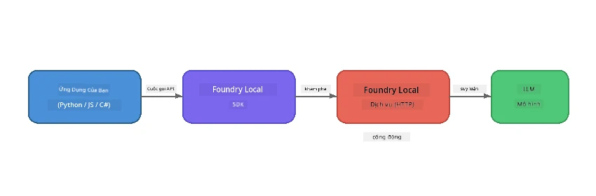

# Phần 1: Bắt đầu với Foundry Local


## Foundry Local là gì?

[Foundry Local](https://foundrylocal.ai) cho phép bạn chạy các mô hình ngôn ngữ AI mã nguồn mở **trực tiếp trên máy tính của bạn** - không cần internet, không tốn chi phí đám mây, và hoàn toàn bảo mật dữ liệu. Nó:

- **Tải về và chạy mô hình ngay trên máy** với tối ưu tự động cho phần cứng (GPU, CPU, hoặc NPU)
- **Cung cấp API tương thích OpenAI** để bạn có thể sử dụng các SDK và công cụ quen thuộc
- **Không yêu cầu đăng ký Azure** hoặc đăng nhập - chỉ cần cài đặt và bắt đầu xây dựng

Hãy tưởng tượng nó như một AI riêng tư của bạn chạy hoàn toàn trên máy của bạn.

## Mục tiêu học tập

Kết thúc lab này bạn sẽ có thể:

- Cài đặt Foundry Local CLI trên hệ điều hành của bạn
- Hiểu alias của các mô hình là gì và cách chúng hoạt động
- Tải xuống và chạy mô hình AI đầu tiên trên máy bạn
- Gửi tin nhắn chat tới mô hình cục bộ từ dòng lệnh
- Hiểu sự khác biệt giữa mô hình AI cục bộ và mô hình được lưu trữ trên đám mây

---

## Yêu cầu trước

### Yêu cầu hệ thống

| Yêu cầu | Tối thiểu | Khuyến nghị |
|-------------|---------|-------------|
| **RAM** | 8 GB | 16 GB |
| **Dung lượng ổ đĩa** | 5 GB (cho mô hình) | 10 GB |
| **CPU** | 4 lõi | 8+ lõi |
| **GPU** | Tùy chọn | NVIDIA với CUDA 11.8+ |
| **Hệ điều hành** | Windows 10/11 (x64/ARM), Windows Server 2025, macOS 13+ | - |

> **Lưu ý:** Foundry Local tự động chọn biến thể mô hình phù hợp nhất với phần cứng của bạn. Nếu bạn có GPU NVIDIA, nó sử dụng tăng tốc CUDA. Nếu bạn có Qualcomm NPU, nó sử dụng đó. Nếu không, nó sẽ dùng biến thể tối ưu cho CPU.

### Cài đặt Foundry Local CLI

**Windows** (PowerShell):
```powershell
winget install Microsoft.FoundryLocal
```

**macOS** (Homebrew):
```bash
brew tap microsoft/foundrylocal
brew install foundrylocal
```

> **Lưu ý:** Foundry Local hiện tại chỉ hỗ trợ Windows và macOS. Linux chưa được hỗ trợ vào thời điểm này.

Kiểm tra cài đặt:
```bash
foundry --version
```

---

## Bài tập lab

### Bài tập 1: Khám phá các mô hình có sẵn

Foundry Local bao gồm một danh mục các mô hình mã nguồn mở được tối ưu sẵn. Liệt kê chúng:

```bash
foundry model list
```

Bạn sẽ thấy các mô hình như:
- `phi-3.5-mini` - Mô hình 3.8 tỷ tham số của Microsoft (nhanh, chất lượng tốt)
- `phi-4-mini` - Mô hình Phi mới hơn, có khả năng mạnh hơn
- `phi-4-mini-reasoning` - Mô hình Phi với khả năng suy luận chuỗi suy nghĩ (`<think>` tags)
- `phi-4` - Mô hình Phi lớn nhất của Microsoft (10.4 GB)
- `qwen2.5-0.5b` - Rất nhỏ và nhanh (tốt cho thiết bị có tài nguyên thấp)
- `qwen2.5-7b` - Mô hình đa năng mạnh với hỗ trợ gọi công cụ
- `qwen2.5-coder-7b` - Tối ưu cho sinh mã
- `deepseek-r1-7b` - Mô hình suy luận mạnh
- `gpt-oss-20b` - Mô hình mã nguồn mở lớn (giấy phép MIT, 12.5 GB)
- `whisper-base` - Chuyển đổi giọng nói thành văn bản (383 MB)
- `whisper-large-v3-turbo` - Phiên âm chính xác cao (9 GB)

> **Alias mô hình là gì?** Alias như `phi-3.5-mini` là các phím tắt. Khi bạn dùng alias, Foundry Local sẽ tự động tải xuống biến thể thích hợp nhất với phần cứng của bạn (CUDA cho GPU NVIDIA, tối ưu CPU nếu không). Bạn không cần lo lắng chọn đúng biến thể.

### Bài tập 2: Chạy mô hình đầu tiên của bạn

Tải xuống và bắt đầu trò chuyện với mô hình một cách tương tác:

```bash
foundry model run phi-3.5-mini
```

Lần đầu chạy, Foundry Local sẽ:
1. Phát hiện phần cứng của bạn
2. Tải xuống biến thể mô hình tối ưu (có thể mất vài phút)
3. Nạp mô hình vào bộ nhớ
4. Bắt đầu phiên trò chuyện tương tác

Hãy thử hỏi vài câu:
```
You: What is the golden ratio?
You: Can you explain it as if I were 10 years old?
You: Write a haiku about mathematics
```

Gõ `exit` hoặc nhấn `Ctrl+C` để thoát.

### Bài tập 3: Tải trước một mô hình

Nếu bạn muốn tải mô hình mà không bắt đầu chat:

```bash
foundry model download phi-3.5-mini
```

Kiểm tra mô hình nào đã được tải về trên máy bạn:

```bash
foundry cache list
```

### Bài tập 4: Hiểu kiến trúc

Foundry Local chạy như một **dịch vụ HTTP cục bộ** cung cấp API REST tương thích OpenAI. Điều đó có nghĩa:

1. Dịch vụ khởi chạy trên một **cổng động** (cổng khác nhau mỗi lần)
2. Bạn dùng SDK để tìm URL điểm cuối thực tế
3. Bạn có thể dùng **bất kỳ** thư viện client tương thích OpenAI nào để giao tiếp



> **Quan trọng:** Foundry Local cấp phát **cổng động** mỗi lần nó khởi động. Đừng bao giờ cứng mã số cổng như `localhost:5272`. Luôn dùng SDK để tìm URL hiện tại (ví dụ: `manager.endpoint` trong Python hoặc `manager.urls[0]` trong JavaScript).

---

## Những điểm chính cần nhớ

| Khái niệm | Bạn đã học được |
|---------|------------------|
| AI trên thiết bị | Foundry Local chạy mô hình hoàn toàn trên thiết bị của bạn, không cần đám mây, không khóa API, không tốn chi phí |
| Alias mô hình | Alias như `phi-3.5-mini` tự động chọn biến thể tốt nhất cho phần cứng của bạn |
| Cổng động | Dịch vụ chạy trên cổng động; luôn dùng SDK để phát hiện điểm cuối |
| CLI và SDK | Bạn có thể tương tác với mô hình qua CLI (`foundry model run`) hoặc lập trình qua SDK |

---

## Các bước tiếp theo

Tiếp tục với [Phần 2: Khám phá sâu Foundry Local SDK](part2-foundry-local-sdk.md) để làm chủ API SDK quản lý mô hình, dịch vụ và bộ nhớ đệm một cách lập trình.