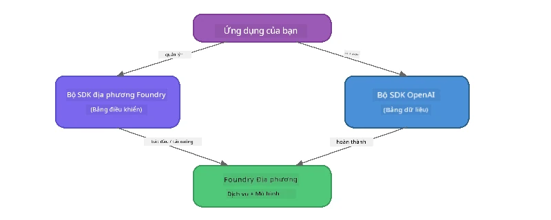

# Phần 3: Sử dụng Foundry Local SDK với OpenAI

## Tổng quan

Trong Phần 1 bạn đã sử dụng Foundry Local CLI để chạy các mô hình tương tác. Trong Phần 2 bạn đã khám phá toàn bộ bề mặt API của SDK. Bây giờ bạn sẽ học cách **tích hợp Foundry Local vào ứng dụng của bạn** bằng cách sử dụng SDK và API tương thích OpenAI.

Foundry Local cung cấp SDK cho ba ngôn ngữ. Hãy chọn ngôn ngữ bạn cảm thấy thoải mái nhất - các khái niệm là giống nhau ở cả ba.

## Mục tiêu học tập

Sau phần thực hành này bạn sẽ có thể:

- Cài đặt Foundry Local SDK cho ngôn ngữ của bạn (Python, JavaScript, hoặc C#)
- Khởi tạo `FoundryLocalManager` để khởi động dịch vụ, kiểm tra bộ nhớ đệm, tải xuống và nạp mô hình
- Kết nối với mô hình cục bộ bằng SDK OpenAI
- Gửi yêu cầu hoàn thành trò chuyện và xử lý phản hồi dạng streaming
- Hiểu kiến trúc cổng động

---

## Yêu cầu trước

Hoàn thành trước [Phần 1: Bắt đầu với Foundry Local](part1-getting-started.md) và [Phần 2: Tìm hiểu sâu về Foundry Local SDK](part2-foundry-local-sdk.md).

Cài đặt **một** trong các môi trường ngôn ngữ sau:
- **Python 3.9+** - [python.org/downloads](https://www.python.org/downloads/)
- **Node.js 18+** - [nodejs.org](https://nodejs.org/)
- **.NET 9.0+** - [dot.net/download](https://dotnet.microsoft.com/download)

---

## Khái niệm: Cách SDK hoạt động

Foundry Local SDK quản lý **control plane** (khởi động dịch vụ, tải mô hình), trong khi SDK OpenAI xử lý **data plane** (gửi prompt, nhận hoàn thành).



---

## Bài tập thực hành

### Bài tập 1: Thiết lập môi trường

<details>
<summary><b>🐍 Python</b></summary>

```bash
cd python
python -m venv venv

# Kích hoạt môi trường ảo:
# Windows (PowerShell):
venv\Scripts\Activate.ps1
# Windows (Command Prompt):
venv\Scripts\activate.bat
# macOS:
source venv/bin/activate

pip install -r requirements.txt
```

`requirements.txt` cài đặt:
- `foundry-local-sdk` - Foundry Local SDK (import dưới tên `foundry_local`)
- `openai` - OpenAI Python SDK
- `agent-framework` - Microsoft Agent Framework (sử dụng trong các phần sau)

</details>

<details>
<summary><b>📘 JavaScript</b></summary>

```bash
cd javascript
npm install
```

`package.json` cài đặt:
- `foundry-local-sdk` - Foundry Local SDK
- `openai` - OpenAI Node.js SDK

</details>

<details>
<summary><b>💜 C#</b></summary>

```bash
cd csharp
dotnet restore
dotnet build
```

`tệp csharp.csproj` sử dụng:
- `Microsoft.AI.Foundry.Local` - Foundry Local SDK (NuGet)
- `OpenAI` - OpenAI C# SDK (NuGet)

> **Cấu trúc dự án:** Dự án C# dùng bộ định tuyến dòng lệnh trong `Program.cs` để gọi các file ví dụ riêng biệt. Chạy `dotnet run chat` (hoặc chỉ `dotnet run`) cho phần này. Các phần khác dùng `dotnet run rag`, `dotnet run agent`, và `dotnet run multi`.

</details>

---

### Bài tập 2: Hoàn thành trò chuyện cơ bản

Mở ví dụ trò chuyện cơ bản cho ngôn ngữ của bạn và xem mã. Mỗi script theo cùng một mẫu ba bước:

1. **Khởi động dịch vụ** - `FoundryLocalManager` khởi động runtime Foundry Local
2. **Tải xuống và nạp mô hình** - kiểm tra bộ nhớ đệm, tải nếu cần, rồi nạp vào bộ nhớ
3. **Tạo client OpenAI** - kết nối tới endpoint cục bộ và gửi yêu cầu trò chuyện dạng streaming

<details>
<summary><b>🐍 Python - <code>python/foundry-local.py</code></b></summary>

```python
import sys
import openai
from foundry_local import FoundryLocalManager

alias = "phi-3.5-mini"

# Bước 1: Tạo một FoundryLocalManager và khởi động dịch vụ
print("Starting Foundry Local service...")
manager = FoundryLocalManager()
manager.start_service()

# Bước 2: Kiểm tra xem mô hình đã được tải xuống chưa
cached = manager.list_cached_models()
catalog_info = manager.get_model_info(alias)
is_cached = any(m.id == catalog_info.id for m in cached) if catalog_info else False

if is_cached:
    print(f"Model already downloaded: {alias}")
else:
    print(f"Downloading model: {alias} (this may take several minutes)...")
    manager.download_model(alias)
    print(f"Download complete: {alias}")

# Bước 3: Tải mô hình vào bộ nhớ
print(f"Loading model: {alias}...")
manager.load_model(alias)

# Tạo một client OpenAI trỏ đến dịch vụ Foundry LOCAL
client = openai.OpenAI(
    base_url=manager.endpoint,   # Cổng động - không bao giờ cứng mã!
    api_key=manager.api_key
)

# Tạo một hoàn thành trò chuyện theo luồng
stream = client.chat.completions.create(
    model=manager.get_model_info(alias).id,
    messages=[{"role": "user", "content": "What is the golden ratio?"}],
    stream=True,
)

for chunk in stream:
    if chunk.choices[0].delta.content is not None:
        print(chunk.choices[0].delta.content, end="", flush=True)
print()
```

**Chạy thử:**
```bash
python foundry-local.py
```

</details>

<details>
<summary><b>📘 JavaScript - <code>javascript/foundry-local.mjs</code></b></summary>

```javascript
import { OpenAI } from "openai";
import { FoundryLocalManager } from "foundry-local-sdk";

const alias = "phi-3.5-mini";

// Bước 1: Khởi động dịch vụ Foundry Local
console.log("Starting Foundry Local service...");
FoundryLocalManager.create({ appName: "FoundryLocalWorkshop" });
const manager = FoundryLocalManager.instance;
await manager.startWebService();

// Bước 2: Kiểm tra xem mô hình đã được tải xuống chưa
const catalog = manager.catalog;
const model = await catalog.getModel(alias);

if (model.isCached) {
  console.log(`Model already downloaded: ${alias}`);
} else {
  console.log(`Downloading model: ${alias} (this may take several minutes)...`);
  await model.download();
  console.log(`Download complete: ${alias}`);
}

// Bước 3: Tải mô hình vào bộ nhớ
console.log(`Loading model: ${alias}...`);
await model.load();
console.log(`Model loaded: ${model.id}`);

// Tạo client OpenAI trỏ đến dịch vụ Foundry LOCAL
const client = new OpenAI({
  baseURL: manager.urls[0] + "/v1",   // Cổng động - không bao giờ mã cứng!
  apiKey: "foundry-local",
});

// Tạo một hoàn thành chat phát trực tiếp
const stream = await client.chat.completions.create({
  model: model.id,
  messages: [{ role: "user", content: "What is the golden ratio?" }],
  stream: true,
});

for await (const chunk of stream) {
  if (chunk.choices[0]?.delta?.content) {
    process.stdout.write(chunk.choices[0].delta.content);
  }
}
console.log();
```

**Chạy thử:**
```bash
node foundry-local.mjs
```

</details>

<details>
<summary><b>💜 C# - <code>csharp/BasicChat.cs</code></b></summary>

```csharp
using Microsoft.AI.Foundry.Local;
using Microsoft.Extensions.Logging.Abstractions;
using OpenAI;
using OpenAI.Chat;
using System.ClientModel;

var alias = "phi-3.5-mini";

// Step 1: Start the Foundry Local service
Console.WriteLine("Starting Foundry Local service...");
await FoundryLocalManager.CreateAsync(
    new Configuration
    {
        AppName = "FoundryLocalSamples",
        Web = new Configuration.WebService { Urls = "http://127.0.0.1:0" }
    }, NullLogger.Instance, default);
var manager = FoundryLocalManager.Instance;
await manager.StartWebServiceAsync(default);

// Step 2: Get the model from the catalog
var catalog = await manager.GetCatalogAsync(default);
var model = await catalog.GetModelAsync(alias, default);

// Step 3: Check if the model is already downloaded
var isCached = await model.IsCachedAsync(default);

if (isCached)
{
    Console.WriteLine($"Model already downloaded: {alias}");
}
else
{
    Console.WriteLine($"Downloading model: {alias} (this may take several minutes)...");
    await model.DownloadAsync(null, default);
    Console.WriteLine($"Download complete: {alias}");
}

// Step 4: Load the model into memory
Console.WriteLine($"Loading model: {alias}...");
await model.LoadAsync(default);
Console.WriteLine($"Loaded model: {model.Id}");
Console.WriteLine($"Endpoint: {manager.Urls[0]}");

// Create OpenAI client pointing to the LOCAL Foundry service
var key = new ApiKeyCredential("foundry-local");
var client = new OpenAIClient(key, new OpenAIClientOptions
{
    Endpoint = new Uri(manager.Urls[0] + "/v1")  // Dynamic port - never hardcode!
});

var chatClient = client.GetChatClient(model.Id);

// Stream a chat completion
var completionUpdates = chatClient.CompleteChatStreaming("What is the golden ratio?");

foreach (var update in completionUpdates)
{
    if (update.ContentUpdate.Count > 0)
    {
        Console.Write(update.ContentUpdate[0].Text);
    }
}
Console.WriteLine();
```

**Chạy thử:**
```bash
dotnet run chat
```

</details>

---

### Bài tập 3: Thử nghiệm với Prompt

Khi ví dụ cơ bản chạy được, hãy thử sửa mã:

1. **Thay đổi thông điệp người dùng** - thử các câu hỏi khác nhau
2. **Thêm prompt hệ thống** - đặt mô hình mang một persona
3. **Tắt streaming** - đặt `stream=False` và in toàn bộ phản hồi cùng lúc
4. **Thử mô hình khác** - thay alias từ `phi-3.5-mini` sang một mô hình khác trong `foundry model list`

<details>
<summary><b>🐍 Python</b></summary>

```python
# Thêm một lời nhắc hệ thống - cung cấp cho mô hình một nhân vật:
stream = client.chat.completions.create(
    model=manager.get_model_info(alias).id,
    messages=[
        {"role": "system", "content": "You are a pirate. Answer everything in pirate speak."},
        {"role": "user", "content": "What is the golden ratio?"}
    ],
    stream=True,
)

# Hoặc tắt phát trực tiếp:
response = client.chat.completions.create(
    model=manager.get_model_info(alias).id,
    messages=[{"role": "user", "content": "What is the golden ratio?"}],
    stream=False,
)
print(response.choices[0].message.content)
```

</details>

<details>
<summary><b>📘 JavaScript</b></summary>

```javascript
// Thêm một lời nhắc hệ thống - cung cấp cho mô hình một cá tính:
const stream = await client.chat.completions.create({
  model: modelInfo.id,
  messages: [
    { role: "system", content: "You are a pirate. Answer everything in pirate speak." },
    { role: "user", content: "What is the golden ratio?" },
  ],
  stream: true,
});

// Hoặc tắt phát trực tiếp:
const response = await client.chat.completions.create({
  model: modelInfo.id,
  messages: [{ role: "user", content: "What is the golden ratio?" }],
  stream: false,
});
console.log(response.choices[0].message.content);
```

</details>

<details>
<summary><b>💜 C#</b></summary>

```csharp
// Add a system prompt - give the model a persona:
var completionUpdates = chatClient.CompleteChatStreaming(
    new ChatMessage[]
    {
        new SystemChatMessage("You are a pirate. Answer everything in pirate speak."),
        new UserChatMessage("What is the golden ratio?")
    }
);

// Or turn off streaming:
var response = chatClient.CompleteChat("What is the golden ratio?");
Console.WriteLine(response.Value.Content[0].Text);
```

</details>

---

### Tham khảo các phương thức SDK

<details>
<summary><b>🐍 Phương thức Python SDK</b></summary>

| Phương thức | Mục đích |
|--------|---------|
| `FoundryLocalManager()` | Tạo thể hiện manager |
| `manager.start_service()` | Khởi động dịch vụ Foundry Local |
| `manager.list_cached_models()` | Liệt kê các mô hình đã tải về trên thiết bị |
| `manager.get_model_info(alias)` | Lấy thông tin mô hình và metadata |
| `manager.download_model(alias, progress_callback=fn)` | Tải mô hình với callback tiến trình tùy chọn |
| `manager.load_model(alias)` | Nạp mô hình vào bộ nhớ |
| `manager.endpoint` | Lấy URL endpoint động |
| `manager.api_key` | Lấy API key (dùng giá trị giữ chỗ cho local) |

</details>

<details>
<summary><b>📘 Phương thức JavaScript SDK</b></summary>

| Phương thức | Mục đích |
|--------|---------|
| `FoundryLocalManager.create({ appName })` | Tạo thể hiện manager |
| `FoundryLocalManager.instance` | Truy cập manager singleton |
| `await manager.startWebService()` | Khởi động dịch vụ Foundry Local |
| `await manager.catalog.getModel(alias)` | Lấy mô hình từ catalog |
| `model.isCached` | Kiểm tra nếu mô hình đã tải về |
| `await model.download()` | Tải mô hình |
| `await model.load()` | Nạp mô hình vào bộ nhớ |
| `model.id` | Lấy ID mô hình cho gọi API OpenAI |
| `manager.urls[0] + "/v1"` | Lấy URL endpoint động |
| `"foundry-local"` | Khóa API (giữ chỗ cho local) |

</details>

<details>
<summary><b>💜 Phương thức C# SDK</b></summary>

| Phương thức | Mục đích |
|--------|---------|
| `FoundryLocalManager.CreateAsync(config)` | Tạo và khởi tạo manager |
| `manager.StartWebServiceAsync()` | Khởi động dịch vụ web Foundry Local |
| `manager.GetCatalogAsync()` | Lấy catalog mô hình |
| `catalog.ListModelsAsync()` | Liệt kê mọi mô hình có sẵn |
| `catalog.GetModelAsync(alias)` | Lấy mô hình theo alias |
| `model.IsCachedAsync()` | Kiểm tra mô hình đã tải chưa |
| `model.DownloadAsync()` | Tải mô hình |
| `model.LoadAsync()` | Nạp mô hình vào bộ nhớ |
| `manager.Urls[0]` | Lấy URL endpoint động |
| `new ApiKeyCredential("foundry-local")` | Chứng thực API key cho local |

</details>

---

### Bài tập 4: Sử dụng Native ChatClient (Thay thế OpenAI SDK)

Trong Bài tập 2 và 3, bạn dùng OpenAI SDK để hoàn thành trò chuyện. SDK JavaScript và C# cũng cung cấp **ChatClient nguyên bản** giúp bỏ qua hoàn toàn việc sử dụng OpenAI SDK.

<details>
<summary><b>📘 JavaScript - <code>model.createChatClient()</code></b></summary>

```javascript
import { FoundryLocalManager } from "foundry-local-sdk";

const alias = "phi-3.5-mini";

FoundryLocalManager.create({ appName: "ChatClientDemo" });
const manager = FoundryLocalManager.instance;
await manager.startWebService();

const model = await manager.catalog.getModel(alias);
if (!model.isCached) await model.download();
await model.load();

// Không cần nhập OpenAI — lấy một client trực tiếp từ mô hình
const chatClient = model.createChatClient();

// Hoàn thành không streaming
const response = await chatClient.completeChat([
  { role: "system", content: "You are a pirate. Answer everything in pirate speak." },
  { role: "user", content: "What is the golden ratio?" }
]);
console.log(response.choices[0].message.content);

// Hoàn thành streaming (sử dụng mẫu callback)
await chatClient.completeStreamingChat(
  [{ role: "user", content: "What is the golden ratio?" }],
  (chunk) => {
    if (chunk.choices?.[0]?.delta?.content) {
      process.stdout.write(chunk.choices[0].delta.content);
    }
  }
);
console.log();
```

> **Lưu ý:** `completeStreamingChat()` của ChatClient sử dụng mô hình **callback**, không phải async iterator. Truyền một hàm làm đối số thứ hai.

</details>

<details>
<summary><b>💜 C# - <code>model.GetChatClientAsync()</code></b></summary>

```csharp
var catalog = await manager.GetCatalogAsync(default);
var model = await catalog.GetModelAsync("phi-3.5-mini", default);
if (!await model.IsCachedAsync(default))
    await model.DownloadAsync(null, default);
await model.LoadAsync(default);

// No OpenAI NuGet needed — get a client directly from the model
var chatClient = await model.GetChatClientAsync(default);

// Use it like a standard OpenAI ChatClient
var response = chatClient.CompleteChat("What is the golden ratio?");
Console.WriteLine(response.Value.Content[0].Text);
```

</details>

> **Khi nào nên dùng cái nào:**
> | Phương án | Phù hợp cho |
> |----------|-------------|
> | OpenAI SDK | Kiểm soát tham số đầy đủ, ứng dụng sản xuất, mã OpenAI hiện có |
> | Native ChatClient | Phát thảo nhanh, ít phụ thuộc, thiết lập đơn giản |

---

## Những điểm chính cần ghi nhớ

| Khái niệm | Bạn đã học được gì |
|---------|------------------|
| Control plane | Foundry Local SDK xử lý khởi động dịch vụ và tải mô hình |
| Data plane | OpenAI SDK xử lý hoàn thành trò chuyện và streaming |
| Cổng động | Luôn dùng SDK để phát hiện endpoint; không hardcode URL |
| Cross-language | Mẫu mã giống nhau dùng được cho Python, JavaScript và C# |
| Tương thích OpenAI | Tương thích toàn diện API OpenAI giúp mã OpenAI hiện có chạy với thay đổi tối thiểu |
| Native ChatClient | `createChatClient()` (JS) / `GetChatClientAsync()` (C#) là sự lựa chọn thay thế cho OpenAI SDK |

---

## Bước tiếp theo

Tiếp tục tới [Phần 4: Xây dựng Ứng dụng RAG](part4-rag-fundamentals.md) để học cách xây dựng pipeline Retrieval-Augmented Generation chạy hoàn toàn trên thiết bị của bạn.