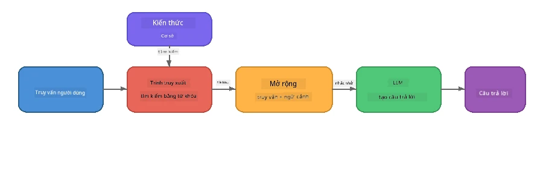

# Phần 4: Xây dựng Ứng dụng RAG với Foundry Local

## Tổng quan

Các Mô hình Ngôn ngữ Lớn rất mạnh mẽ, nhưng chúng chỉ biết những gì có trong dữ liệu huấn luyện. **Retrieval-Augmented Generation (RAG)** giải quyết điều này bằng cách cung cấp cho mô hình ngữ cảnh liên quan tại thời điểm truy vấn - lấy từ các tài liệu, cơ sở dữ liệu hoặc cơ sở kiến thức của bạn.

Trong bài lab này, bạn sẽ xây dựng một pipeline RAG hoàn chỉnh hoạt động **hoàn toàn trên thiết bị của bạn** sử dụng Foundry Local. Không có dịch vụ đám mây, không có cơ sở dữ liệu vector, không có API embeddings - chỉ là truy xuất cục bộ và mô hình cục bộ.

## Mục tiêu học tập

Kết thúc bài lab này, bạn sẽ có thể:

- Giải thích RAG là gì và tại sao nó quan trọng đối với các ứng dụng AI
- Xây dựng cơ sở kiến thức cục bộ từ các tài liệu văn bản
- Triển khai hàm truy xuất đơn giản để tìm ngữ cảnh liên quan
- Soạn thảo lời nhắc hệ thống giúp mô hình dựa trên các thông tin được truy xuất
- Chạy toàn bộ pipeline Retrieve → Augment → Generate trên thiết bị
- Hiểu các đánh đổi giữa truy xuất từ khóa đơn giản và tìm kiếm vector

---

## Điều kiện tiên quyết

- Hoàn thành [Phần 3: Sử dụng Foundry Local SDK với OpenAI](part3-sdk-and-apis.md)
- Cài đặt Foundry Local CLI và tải xuống mô hình `phi-3.5-mini`

---

## Khái niệm: RAG là gì?

Không có RAG, LLM chỉ có thể trả lời dựa trên dữ liệu huấn luyện - có thể lỗi thời, không đầy đủ hoặc thiếu thông tin riêng tư của bạn:

```
User: "What is Zava's return policy?"
LLM:  "I do not have information about Zava's return policy."  ← No context!
```

Với RAG, bạn **truy xuất** các tài liệu liên quan trước, sau đó **tăng cường** lời nhắc với ngữ cảnh đó trước khi **tạo** phản hồi:



Điểm mấu chốt: **mô hình không cần "biết" câu trả lời; nó chỉ cần đọc đúng tài liệu.**

---

## Bài tập Lab

### Bài tập 1: Hiểu về Cơ sở Kiến thức

Mở ví dụ RAG cho ngôn ngữ của bạn và kiểm tra cơ sở kiến thức:

<details>
<summary><b>🐍 Python: <code>python/foundry-local-rag.py</code></b></summary>

Cơ sở kiến thức là một danh sách đơn giản các từ điển với các trường `title` và `content`:

```python
KNOWLEDGE_BASE = [
    {
        "title": "Foundry Local Overview",
        "content": (
            "Foundry Local brings the power of Azure AI Foundry to your local "
            "device without requiring an Azure subscription..."
        ),
    },
    {
        "title": "Supported Hardware",
        "content": (
            "Foundry Local automatically selects the best model variant for "
            "your hardware. If you have an Nvidia CUDA GPU it downloads the "
            "CUDA-optimized model..."
        ),
    },
    # ... nhiều mục hơn
]
```

Mỗi mục đại diện cho một "khối" kiến thức - một phần thông tin tập trung về một chủ đề.

</details>

<details>
<summary><b>📘 JavaScript: <code>javascript/foundry-local-rag.mjs</code></b></summary>

Cơ sở kiến thức sử dụng cùng cấu trúc như một mảng các đối tượng:

```javascript
const KNOWLEDGE_BASE = [
  {
    title: "Foundry Local Overview",
    content:
      "Foundry Local brings the power of Azure AI Foundry to your local " +
      "device without requiring an Azure subscription...",
  },
  {
    title: "Supported Hardware",
    content:
      "Foundry Local automatically selects the best model variant for " +
      "your hardware...",
  },
  // ... nhiều mục hơn
];
```

</details>

<details>
<summary><b>💜 C#: <code>csharp/RagPipeline.cs</code></b></summary>

Cơ sở kiến thức sử dụng một danh sách kiểu tuple có tên:

```csharp
private static readonly List<(string Title, string Content)> KnowledgeBase =
[
    ("Foundry Local Overview",
     "Foundry Local brings the power of Azure AI Foundry to your local " +
     "device without requiring an Azure subscription..."),

    ("Supported Hardware",
     "Foundry Local automatically selects the best model variant for " +
     "your hardware..."),

    // ... more entries
];
```

</details>

> **Trong ứng dụng thực tế**, cơ sở kiến thức sẽ đến từ các tệp trên đĩa, cơ sở dữ liệu, bảng chỉ mục tìm kiếm hoặc API. Trong bài lab này, chúng ta sử dụng danh sách trong bộ nhớ để đơn giản hóa.

---

### Bài tập 2: Hiểu Hàm Truy xuất

Bước truy xuất tìm các khối kiến thức phù hợp nhất với câu hỏi của người dùng. Ví dụ này sử dụng **độ chồng từ khóa** - đếm số từ trong truy vấn cũng xuất hiện trong mỗi khối:

<details>
<summary><b>🐍 Python</b></summary>

```python
def retrieve(query: str, top_k: int = 2) -> list[dict]:
    """Return the top-k knowledge chunks most relevant to the query."""
    query_words = set(query.lower().split())
    scored = []
    for chunk in KNOWLEDGE_BASE:
        chunk_words = set(chunk["content"].lower().split())
        overlap = len(query_words & chunk_words)
        scored.append((overlap, chunk))
    scored.sort(key=lambda x: x[0], reverse=True)
    return [item[1] for item in scored[:top_k]]
```

</details>

<details>
<summary><b>📘 JavaScript</b></summary>

```javascript
function retrieve(query, topK = 2) {
  const queryWords = new Set(query.toLowerCase().split(/\s+/));
  const scored = KNOWLEDGE_BASE.map((chunk) => {
    const chunkWords = new Set(chunk.content.toLowerCase().split(/\s+/));
    let overlap = 0;
    for (const w of queryWords) {
      if (chunkWords.has(w)) overlap++;
    }
    return { overlap, chunk };
  });
  scored.sort((a, b) => b.overlap - a.overlap);
  return scored.slice(0, topK).map((s) => s.chunk);
}
```

</details>

<details>
<summary><b>💜 C#</b></summary>

```csharp
private static List<(string Title, string Content)> Retrieve(string query, int topK = 2)
{
    var queryWords = new HashSet<string>(
        query.ToLowerInvariant().Split(' ', StringSplitOptions.RemoveEmptyEntries));

    return KnowledgeBase
        .Select(chunk =>
        {
            var chunkWords = new HashSet<string>(
                chunk.Content.ToLowerInvariant().Split(' ', StringSplitOptions.RemoveEmptyEntries));
            var overlap = queryWords.Intersect(chunkWords).Count();
            return (Overlap: overlap, Chunk: chunk);
        })
        .OrderByDescending(x => x.Overlap)
        .Take(topK)
        .Select(x => x.Chunk)
        .ToList();
}
```

</details>

**Cách nó hoạt động:**
1. Tách truy vấn thành các từ riêng biệt
2. Với mỗi khối kiến thức, đếm số từ truy vấn xuất hiện trong khối đó
3. Sắp xếp theo điểm chồng từ (cao nhất trước)
4. Trả về top-k khối liên quan nhất

> **Đánh đổi:** Độ chồng từ khóa đơn giản nhưng hạn chế; nó không hiểu đồng nghĩa hay ý nghĩa. Hệ thống RAG sản xuất thường dùng **vector embeddings** và **cơ sở dữ liệu vector** cho tìm kiếm ngữ nghĩa. Tuy nhiên, độ chồng từ khóa là điểm khởi đầu tuyệt vời và không yêu cầu phụ thuộc thêm.

---

### Bài tập 3: Hiểu Lời Nhắc Bổ Sung

Ngữ cảnh được truy xuất được chèn vào **lời nhắc hệ thống** trước khi gửi tới mô hình:

```python
system_prompt = (
    "You are a helpful assistant. Answer the user's question using ONLY "
    "the information provided in the context below. If the context does "
    "not contain enough information, say so.\n\n"
    f"Context:\n{context_text}"
)
```

Các quyết định thiết kế chính:
- **"CHỈ thông tin được cung cấp"** - ngăn mô hình tưởng tượng các sự thật không có trong ngữ cảnh
- **"Nếu ngữ cảnh không đủ thông tin, hãy nói như vậy"** - khuyến khích câu trả lời trung thực "Tôi không biết"
- Ngữ cảnh được đặt trong tin nhắn hệ thống để hình thành tất cả phản hồi

---

### Bài tập 4: Chạy Pipeline RAG

Chạy ví dụ hoàn chỉnh:

**Python:**
```bash
cd python
python foundry-local-rag.py
```

**JavaScript:**
```bash
cd javascript
node foundry-local-rag.mjs
```

**C#:**
```bash
cd csharp
dotnet run rag
```

Bạn sẽ thấy ba điều được in ra:
1. **Câu hỏi** được đặt ra
2. **Ngữ cảnh được truy xuất** - các khối được chọn từ cơ sở kiến thức
3. **Câu trả lời** - do mô hình tạo ra chỉ dựa trên ngữ cảnh đó

Ví dụ đầu ra:
```
Question: How do I install Foundry Local and what hardware does it support?

--- Retrieved Context ---
### Installation
On Windows install Foundry Local with: winget install Microsoft.FoundryLocal...

### Supported Hardware
Foundry Local automatically selects the best model variant for your hardware...
-------------------------

Answer: To install Foundry Local, you can use the following methods depending
on your operating system: On Windows, run `winget install Microsoft.FoundryLocal`.
On macOS, use `brew install microsoft/foundrylocal/foundrylocal`...
```

Chú ý câu trả lời của mô hình được **căn cứ** trên ngữ cảnh truy xuất - nó chỉ nhắc đến các sự thật có trong tài liệu cơ sở kiến thức.

---

### Bài tập 5: Thử nghiệm và Mở rộng

Thử các thay đổi sau để hiểu sâu hơn:

1. **Thay đổi câu hỏi** - hỏi điều có trong cơ sở kiến thức và điều không có:
   ```python
   question = "What programming languages does Foundry Local support?"  # ← Trong ngữ cảnh
   question = "How much does Foundry Local cost?"                       # ← Không trong ngữ cảnh
   ```
   Mô hình có nói đúng "Tôi không biết" khi câu trả lời không có trong ngữ cảnh không?

2. **Thêm khối kiến thức mới** - thêm một mục mới vào `KNOWLEDGE_BASE`:
   ```python
   {
       "title": "Pricing",
       "content": "Foundry Local is completely free and open source under the MIT license.",
   }
   ```
   Bây giờ hỏi lại câu hỏi về giá cả.

3. **Thay đổi `top_k`** - lấy nhiều hoặc ít khối hơn:
   ```python
   context_chunks = retrieve(question, top_k=3)  # Thêm ngữ cảnh
   context_chunks = retrieve(question, top_k=1)  # Ít ngữ cảnh hơn
   ```
   Ngữ cảnh nhiều hay ít ảnh hưởng thế nào đến chất lượng câu trả lời?

4. **Loại bỏ chỉ dẫn căn cứ** - đổi lời nhắc hệ thống thành "Bạn là trợ lý hữu ích." và xem mô hình có bắt đầu tưởng tượng sự thật không.

---

## Phân tích chuyên sâu: Tối ưu RAG cho Hiệu năng Trên Thiết bị

Chạy RAG trên thiết bị giới hạn những điều bạn không gặp trên đám mây: RAM hạn chế, không GPU chuyên dụng (thực thi CPU/NPU), và cửa sổ ngữ cảnh mô hình nhỏ. Các quyết định thiết kế dưới đây trực tiếp giải quyết các giới hạn đó và dựa trên các mẫu từ ứng dụng RAG tại chỗ kiểu sản xuất xây dựng với Foundry Local.

### Chiến lược Chunking: Cửa sổ trượt cố định kích thước

Chunking - cách bạn tách tài liệu thành các phần - là quyết định ảnh hưởng lớn nhất trong hệ thống RAG nào. Với kịch bản trên thiết bị, **cửa sổ trượt kích thước cố định với độ chồng** là khởi điểm được khuyến nghị:

| Tham số | Giá trị đề xuất | Lý do |
|---------|-----------------|--------|
| **Kích thước chunk** | ~200 token | Giữ ngữ cảnh truy xuất gọn, chừa chỗ cho lời nhắc hệ thống, lịch sử hội thoại, và đầu ra trong cửa sổ ngữ cảnh Phi-3.5 Mini |
| **Độ chồng** | ~25 token (12.5%) | Ngăn mất mát thông tin tại ranh giới chunk - quan trọng với quy trình và hướng dẫn từng bước |
| **Phân tách token** | Tách bằng khoảng trắng | Không phụ thuộc vào thư viện token hóa, toàn bộ ngân sách tính toán dành cho LLM |

Độ chồng làm cửa sổ trượt: mỗi chunk mới bắt đầu cách chunk trước 25 token, nên câu văn trải qua ranh giới chunk xuất hiện trong cả hai chunk.

> **Tại sao không chọn chiến lược khác?**
> - **Tách dựa trên câu** tạo kích thước chunk không đồng đều; một số quy trình an toàn là câu dài một câu không dễ tách
> - **Tách theo mục** (theo tiêu đề `##`) tạo kích thước chunk không cân đối - một số quá nhỏ, một số quá lớn so với cửa sổ ngữ cảnh mô hình
> - **Chunking ngữ nghĩa** (dựa trên embedding phát hiện chủ đề) cho chất lượng truy xuất tốt nhất, nhưng cần một mô hình thứ hai cùng chạy trong bộ nhớ với Phi-3.5 Mini - rủi ro với phần cứng 8-16 GB RAM chung

### Nâng cao Truy xuất: Vector TF-IDF

Cách tiếp cận độ chồng từ khóa trong bài lab này hiệu quả, nhưng nếu muốn truy xuất tốt hơn mà không thêm mô hình embedding, **TF-IDF (Tần suất Thuật ngữ - Tần suất Ngược Tài liệu)** là lựa chọn trung gian tuyệt vời:

```
Keyword Overlap  →  TF-IDF Vectors  →  Embedding Models
    (this lab)     (lightweight upgrade)   (production)
  Simple & fast    Better ranking,         Best quality,
  No dependencies  still no ML model       requires embedding model
  ~Basic matching  ~1ms retrieval          ~100-500ms per query
```

TF-IDF chuyển mỗi chunk thành vector số dựa trên độ quan trọng của mỗi từ trong chunk *so với tất cả các chunk*. Khi truy vấn, câu hỏi cũng được vector hóa tương tự và so sánh bằng cosine similarity. Bạn có thể triển khai bằng SQLite và JavaScript/Python thuần - không cần cơ sở dữ liệu vector, không cần API embedding.

> **Hiệu năng:** Cosine similarity TF-IDF trên các chunk kích thước cố định thường đạt **~1ms truy xuất**, so với ~100-500ms khi dùng mô hình embedding mã hóa từng truy vấn. Hơn 20 tài liệu có thể chunk và index dưới 1 giây.

### Chế độ Edge/Compact cho Thiết bị Giới hạn

Khi chạy trên phần cứng rất giới hạn (laptop cũ, tablet, thiết bị hiện trường), bạn có thể giảm tài nguyên sử dụng bằng cách điều chỉnh ba thiết lập:

| Thiết lập | Chế độ Chuẩn | Chế độ Edge/Compact |
|-----------|--------------|---------------------|
| **Lời nhắc hệ thống** | ~300 token | ~80 token |
| **Max token đầu ra** | 1024 | 512 |
| **Số chunk truy xuất (top-k)** | 5 | 3 |

Giảm số chunk truy xuất nghĩa là ít ngữ cảnh để mô hình xử lý, giảm độ trễ và áp lực bộ nhớ. Lời nhắc hệ thống ngắn hơn giải phóng nhiều chỗ trong cửa sổ ngữ cảnh cho câu trả lời. Đánh đổi này đáng giá trên các thiết bị mà từng token trong cửa sổ ngữ cảnh đều quý giá.

### Một Mô hình trong Bộ nhớ

Một nguyên tắc quan trọng với RAG trên thiết bị: **giữ chỉ một mô hình được tải**. Nếu bạn dùng mô hình embedding cho truy xuất *và* mô hình ngôn ngữ cho tạo sinh, bạn sẽ chia nhỏ tài nguyên NPU/RAM hạn chế cho hai mô hình. Truy xuất nhẹ (độ chồng từ khóa, TF-IDF) tránh điều này hoàn toàn:

- Không có mô hình embedding cạnh tranh bộ nhớ với LLM
- Khởi động nhanh hơn - chỉ một mô hình tải
- Sử dụng bộ nhớ dự đoán - LLM có toàn bộ tài nguyên sẵn
- Hoạt động trên các máy 8 GB RAM

### SQLite làm Kho Vector Cục bộ

Với bộ sưu tập tài liệu nhỏ đến trung bình (vài trăm đến thấp vài nghìn chunk), **SQLite đủ nhanh** để tìm kiếm cosine similarity brute-force và không cần hạ tầng phức tạp:

- Tệp `.db` đơn trên đĩa - không cần tiến trình server, không cần cấu hình
- Có sẵn trong mọi runtime ngôn ngữ lớn (Python `sqlite3`, Node.js `better-sqlite3`, .NET `Microsoft.Data.Sqlite`)
- Lưu các chunk tài liệu kèm vector TF-IDF trong một bảng
- Không cần Pinecone, Qdrant, Chroma, hay FAISS ở quy mô này

### Tóm tắt Hiệu năng

Các lựa chọn thiết kế này kết hợp mang lại RAG phản hồi nhanh trên phần cứng tiêu dùng:

| Chỉ số | Hiệu năng trên thiết bị |
|--------|-------------------------|
| **Độ trễ truy xuất** | ~1ms (TF-IDF) đến ~5ms (độ chồng từ khóa) |
| **Tốc độ ingest** | 20 tài liệu chunk và index dưới 1 giây |
| **Số mô hình trong bộ nhớ** | 1 (chỉ LLM - không embedding) |
| **Dung lượng lưu trữ** | < 1 MB cho chunk + vector trong SQLite |
| **Khởi động lạnh** | Tải một mô hình, không khởi động runtime embedding |
| **Phần cứng tối thiểu** | 8 GB RAM, chỉ CPU (không cần GPU) |

> **Khi nào nên nâng cấp:** Nếu bạn mở rộng tới hàng trăm tài liệu dài, nhiều loại nội dung (bảng, mã, văn bản), hoặc cần hiểu ngữ nghĩa truy vấn, hãy cân nhắc thêm mô hình embedding và chuyển sang tìm kiếm tương đồng vector. Với hầu hết trường hợp trên thiết bị và bộ tài liệu tập trung, TF-IDF + SQLite cho kết quả xuất sắc với tài nguyên tối thiểu.

---

## Các Khái niệm Chính

| Khái niệm | Mô tả |
|-----------|--------|
| **Truy xuất (Retrieval)** | Tìm tài liệu liên quan trong cơ sở kiến thức dựa trên truy vấn người dùng |
| **Tăng cường (Augmentation)** | Chèn tài liệu truy xuất được vào lời nhắc làm ngữ cảnh |
| **Tạo sinh (Generation)** | LLM tạo câu trả lời dựa trên ngữ cảnh được cung cấp |
| **Chunking** | Chia tài liệu lớn thành phần nhỏ hơn, tập trung hơn |
| **Căn cứ (Grounding)** | Hạn chế mô hình chỉ dùng ngữ cảnh được cung cấp (giảm tưởng tượng) |
| **Top-k** | Số lượng chunk liên quan nhất được truy xuất |

---

## RAG trong Ứng dụng Thực tế so với Bài Lab này

| Khía cạnh | Bài Lab này | Tối ưu trên thiết bị | Sản xuất đám mây |
|----------|-------------|---------------------|------------------|
| **Cơ sở kiến thức** | Danh sách trong bộ nhớ | Tệp trên đĩa, SQLite | Cơ sở dữ liệu, bảng chỉ mục tìm kiếm |
| **Truy xuất** | Độ chồng từ khóa | TF-IDF + cosine similarity | Vector embeddings + tìm kiếm tương đồng |
| **Embeddings** | Không cần | Không cần - vector TF-IDF | Mô hình embedding (cục bộ hoặc đám mây) |
| **Kho vector** | Không cần | SQLite (tệp `.db` duy nhất) | FAISS, Chroma, Azure AI Search, v.v. |
| **Chunking** | Thủ công | Cửa sổ trượt kích thước cố định (~200 token, chồng 25 token) | Chunk ngữ nghĩa hoặc đệ quy |
| **Mô hình trong bộ nhớ** | 1 (LLM) | 1 (LLM) | 2+ (embedding + LLM) |
| **Độ trễ truy xuất** | ~5ms | ~1ms | ~100-500ms |
| **Quy mô** | 5 tài liệu | Hàng trăm tài liệu | Hàng triệu tài liệu |

Các mẫu bạn học ở đây (truy xuất, bổ sung, tạo) là giống nhau ở bất kỳ quy mô nào. Phương pháp truy xuất được cải thiện, nhưng kiến trúc tổng thể vẫn giữ nguyên. Cột giữa cho thấy những gì có thể đạt được trên thiết bị với các kỹ thuật nhẹ, thường là điểm ngọt cho các ứng dụng cục bộ nơi bạn đánh đổi quy mô đám mây để lấy sự riêng tư, khả năng ngoại tuyến và độ trễ bằng không đối với các dịch vụ bên ngoài.

---

## Những điểm chính cần nhớ

| Khái niệm | Bạn đã học được gì |
|---------|------------------|
| Mẫu RAG | Truy xuất + Bổ sung + Tạo: cung cấp cho mô hình bối cảnh đúng và nó có thể trả lời các câu hỏi về dữ liệu của bạn |
| Trên thiết bị | Mọi thứ chạy cục bộ mà không có API đám mây hoặc đăng ký cơ sở dữ liệu vectơ |
| Hướng dẫn nền tảng | Giới hạn prompt hệ thống rất quan trọng để ngăn chặn tạo thông tin sai lệch |
| Giao thoa từ khóa | Một điểm khởi đầu đơn giản nhưng hiệu quả cho truy xuất |
| TF-IDF + SQLite | Một con đường nâng cấp nhẹ nhàng giữ truy xuất dưới 1ms mà không cần mô hình nhúng |
| Một mô hình trong bộ nhớ | Tránh tải mô hình nhúng cùng với LLM trên phần cứng giới hạn |
| Kích thước đoạn | Khoảng 200 token với giao thoa cân bằng độ chính xác truy xuất và hiệu quả cửa sổ ngữ cảnh |
| Chế độ cạnh/nén | Sử dụng ít đoạn hơn và prompt ngắn hơn cho các thiết bị rất giới hạn |
| Mẫu phổ quát | Kiến trúc RAG cùng một kiểu hoạt động với bất kỳ nguồn dữ liệu nào: tài liệu, cơ sở dữ liệu, API hoặc wiki |

> **Muốn xem một ứng dụng RAG hoàn chỉnh trên thiết bị?** Hãy xem [Gas Field Local RAG](https://github.com/leestott/local-rag), một tác nhân RAG ngoại tuyến kiểu sản xuất được xây dựng với Foundry Local và Phi-3.5 Mini, thể hiện những mẫu tối ưu hóa này với bộ tài liệu thực tế.

---

## Bước tiếp theo

Tiếp tục đến [Phần 5: Xây dựng tác nhân AI](part5-single-agents.md) để học cách xây dựng các tác nhân thông minh với tính cách, hướng dẫn và hội thoại đa lượt sử dụng Microsoft Agent Framework.