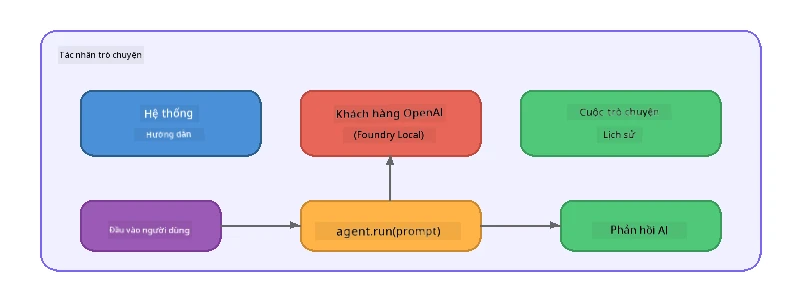

# Phần 5: Xây dựng các đại lý AI với Khung đại lý

> **Mục tiêu:** Xây dựng đại lý AI đầu tiên của bạn với hướng dẫn liên tục và chân dung cá nhân được xác định, được hỗ trợ bởi mô hình tại chỗ qua Foundry Local.

## Đại lý AI là gì?

Một đại lý AI bọc lấy một mô hình ngôn ngữ với **hướng dẫn hệ thống** xác định hành vi, tính cách và giới hạn của nó. Không giống như một cuộc gọi hoàn thành trò chuyện đơn lẻ, một đại lý cung cấp:

- **Chân dung cá nhân** - một danh tính nhất quán ("Bạn là một người đánh giá mã hữu ích")
- **Bộ nhớ** - lịch sử cuộc hội thoại qua các lượt
- **Chuyên môn hóa** - hành vi tập trung được điều khiển bởi các hướng dẫn được xây dựng kỹ lưỡng



---

## Khung đại lý Microsoft

**Khung đại lý Microsoft** (AGF) cung cấp một trừu tượng chuẩn cho đại lý hoạt động trên các backend mô hình khác nhau. Trong hội thảo này, chúng ta kết hợp nó với Foundry Local để mọi thứ chạy trên máy của bạn - không cần đám mây.

| Khái niệm | Mô tả |
|---------|-------------|
| `FoundryLocalClient` | Python: xử lý khởi động dịch vụ, tải xuống/tải mô hình và tạo đại lý |
| `client.as_agent()` | Python: tạo đại lý từ client Foundry Local |
| `AsAIAgent()` | C#: phương thức mở rộng trên `ChatClient` - tạo `AIAgent` |
| `instructions` | Lời nhắc hệ thống định hình hành vi của đại lý |
| `name` | Nhãn dễ đọc cho người dùng, hữu ích trong kịch bản đa đại lý |
| `agent.run(prompt)` / `RunAsync()` | Gửi tin nhắn người dùng và nhận phản hồi của đại lý |

> **Chú ý:** Khung đại lý có SDK Python và .NET. Với JavaScript, chúng tôi triển khai lớp `ChatAgent` nhẹ mô phỏng cùng mẫu sử dụng trực tiếp SDK OpenAI.

---

## Bài tập

### Bài tập 1 - Hiểu mẫu đại lý

Trước khi viết mã, hãy nghiên cứu các thành phần chính của một đại lý:

1. **Client mô hình** - kết nối với API tương thích OpenAI của Foundry Local
2. **Hướng dẫn hệ thống** - lời nhắc "chân dung cá nhân"
3. **Vòng chạy** - gửi đầu vào người dùng, nhận đầu ra

> **Suy nghĩ:** Hướng dẫn hệ thống khác với tin nhắn người dùng thông thường như thế nào? Chuyện gì xảy ra nếu bạn thay đổi chúng?

---

### Bài tập 2 - Chạy ví dụ đại lý đơn lẻ

<details>
<summary><strong>🐍 Python</strong></summary>

**Yêu cầu trước:**
```bash
cd python
python -m venv venv

# Windows (PowerShell):
venv\Scripts\Activate.ps1
# macOS:
source venv/bin/activate

pip install -r requirements.txt
```

**Chạy:**
```bash
python foundry-local-with-agf.py
```

**Giới thiệu mã** (`python/foundry-local-with-agf.py`):

```python
import asyncio
from agent_framework_foundry_local import FoundryLocalClient

async def main():
    alias = "phi-4-mini"

    # FoundryLocalClient xử lý việc khởi động dịch vụ, tải mô hình và nạp mô hình
    client = FoundryLocalClient(model_id=alias)
    print(f"Client Model ID: {client.model_id}")

    # Tạo một đại lý với các hướng dẫn hệ thống
    agent = client.as_agent(
        name="Joker",
        instructions="You are good at telling jokes.",
    )

    # Không truyền dữ liệu trực tiếp: nhận phản hồi hoàn chỉnh ngay lập tức
    result = await agent.run("Tell me a joke about a pirate.")
    print(f"Agent: {result}")

    # Truyền dữ liệu trực tiếp: nhận kết quả ngay khi chúng được tạo ra
    async for chunk in agent.run("Tell me another joke.", stream=True):
        if chunk.text:
            print(chunk.text, end="", flush=True)

asyncio.run(main())
```

**Điểm chính:**
- `FoundryLocalClient(model_id=alias)` xử lý khởi động dịch vụ, tải và nạp mô hình trong một bước
- `client.as_agent()` tạo đại lý với hướng dẫn hệ thống và tên
- `agent.run()` hỗ trợ cả chế độ không streaming và streaming
- Cài đặt qua `pip install agent-framework-foundry-local --pre`

</details>

<details>
<summary><strong>📦 JavaScript</strong></summary>

**Yêu cầu trước:**
```bash
cd javascript
npm install
```

**Chạy:**
```bash
node foundry-local-with-agent.mjs
```

**Giới thiệu mã** (`javascript/foundry-local-with-agent.mjs`):

```javascript
import { OpenAI } from "openai";
import { FoundryLocalManager } from "foundry-local-sdk";

class ChatAgent {
  constructor({ client, modelId, instructions, name }) {
    this.client = client;
    this.modelId = modelId;
    this.instructions = instructions;
    this.name = name;
    this.history = [];
  }

  async run(userMessage) {
    const messages = [
      { role: "system", content: this.instructions },
      ...this.history,
      { role: "user", content: userMessage },
    ];
    const response = await this.client.chat.completions.create({
      model: this.modelId,
      messages,
    });
    const assistantMessage = response.choices[0].message.content;

    // Giữ lịch sử cuộc trò chuyện cho các tương tác đa lượt
    this.history.push({ role: "user", content: userMessage });
    this.history.push({ role: "assistant", content: assistantMessage });
    return { text: assistantMessage };
  }
}

async function main() {
  FoundryLocalManager.create({ appName: "FoundryLocalWorkshop" });
  const manager = FoundryLocalManager.instance;
  await manager.startWebService();

  const catalog = manager.catalog;
  const model = await catalog.getModel("phi-3.5-mini");
  if (!model.isCached) {
    console.log("Downloading model: phi-3.5-mini...");
    await model.download();
  }
  await model.load();

  const client = new OpenAI({
    baseURL: manager.urls[0] + "/v1",
    apiKey: "foundry-local",
  });

  const agent = new ChatAgent({
    client,
    modelId: model.id,
    instructions: "You are good at telling jokes.",
    name: "Joker",
  });

  const result = await agent.run("Tell me a joke about a pirate.");
  console.log(result.text);
}

main();
```

**Điểm chính:**
- JavaScript tự xây dựng lớp `ChatAgent` mô phỏng mẫu AGF của Python
- `this.history` lưu trữ lượt hội thoại để hỗ trợ đa lượt
- Thao tác rõ ràng `startWebService()` → kiểm tra cache → `model.download()` → `model.load()` để có tầm nhìn đầy đủ

</details>

<details>
<summary><strong>💜 C#</strong></summary>

**Yêu cầu trước:**
```bash
cd csharp
dotnet restore
```

**Chạy:**
```bash
dotnet run agent
```

**Giới thiệu mã** (`csharp/SingleAgent.cs`):

```csharp
using Microsoft.AI.Foundry.Local;
using Microsoft.Extensions.Logging.Abstractions;
using Microsoft.Agents.AI;
using OpenAI;
using System.ClientModel;

// 1. Start Foundry Local and load a model
var alias = "phi-3.5-mini";
await FoundryLocalManager.CreateAsync(
    new Configuration
    {
        AppName = "FoundryLocalSamples",
        Web = new Configuration.WebService { Urls = "http://127.0.0.1:0" }
    }, NullLogger.Instance, default);
var manager = FoundryLocalManager.Instance;
await manager.StartWebServiceAsync(default);

var catalog = await manager.GetCatalogAsync(default);
var model = await catalog.GetModelAsync(alias, default);

var isCached = await model.IsCachedAsync(default);
if (!isCached)
{
    Console.WriteLine($"Downloading model: {alias}...");
    await model.DownloadAsync(null, default);
}
await model.LoadAsync(default);

var key = new ApiKeyCredential("foundry-local");
var client = new OpenAIClient(key, new OpenAIClientOptions
{
    Endpoint = new Uri(manager.Urls[0] + "/v1")
});

// 2. Create an AIAgent using the Agent Framework extension method
AIAgent joker = client
    .GetChatClient(model.Id)
    .AsAIAgent(
        instructions: "You are good at telling jokes. Keep your jokes short and family-friendly.",
        name: "Joker"
    );

// 3. Run the agent (non-streaming)
var response = await joker.RunAsync("Tell me a joke about a pirate.");
Console.WriteLine($"Joker: {response}");

// 4. Run with streaming
await foreach (var update in joker.RunStreamingAsync("Tell me another joke."))
{
    Console.Write(update);
}
```

**Điểm chính:**
- `AsAIAgent()` là phương thức mở rộng từ `Microsoft.Agents.AI.OpenAI` - không cần lớp `ChatAgent` tùy chỉnh
- `RunAsync()` trả về đáp ứng đầy đủ; `RunStreamingAsync()` streaming token từng token
- Cài đặt qua `dotnet add package Microsoft.Agents.AI.OpenAI --version 1.0.0-rc3`

</details>

---

### Bài tập 3 - Thay đổi chân dung cá nhân

Sửa đổi `instructions` của đại lý để tạo chân dung khác. Thử từng chân dung và quan sát sự thay đổi đầu ra:

| Chân dung | Hướng dẫn |
|---------|-------------|
| Người đánh giá mã | `"Bạn là một chuyên gia đánh giá mã. Cung cấp phản hồi xây dựng tập trung vào khả năng đọc, hiệu suất và độ chính xác."` |
| Hướng dẫn viên du lịch | `"Bạn là một hướng dẫn viên du lịch thân thiện. Đưa ra khuyên nhủ cá nhân hóa về điểm đến, hoạt động và ẩm thực địa phương."` |
| Gia sư Socratic | `"Bạn là một gia sư Socratic. Không bao giờ đưa câu trả lời trực tiếp - thay vào đó, hướng dẫn học sinh bằng các câu hỏi suy nghĩ."` |
| Nhà viết kỹ thuật | `"Bạn là một nhà viết kỹ thuật. Giải thích các khái niệm rõ ràng và cô đọng. Dùng ví dụ. Tránh biệt ngữ."` |

**Thử:**
1. Chọn một chân dung từ bảng trên
2. Thay chuỗi `instructions` trong mã
3. Điều chỉnh lời nhắc người dùng cho phù hợp (ví dụ yêu cầu người đánh giá mã xem xét một hàm)
4. Chạy lại ví dụ và so sánh kết quả

> **Mẹo:** Chất lượng đại lý phụ thuộc lớn vào hướng dẫn. Hướng dẫn cụ thể, cấu trúc tốt mang lại kết quả tốt hơn hướng dẫn mơ hồ.

---

### Bài tập 4 - Thêm hội thoại đa lượt

Mở rộng ví dụ để hỗ trợ vòng trò chuyện nhiều lượt giúp bạn có thể trao đổi qua lại với đại lý.

<details>
<summary><strong>🐍 Python - vòng đa lượt</strong></summary>

```python
import asyncio
from agent_framework_foundry_local import FoundryLocalClient

async def main():
    client = FoundryLocalClient(model_id="phi-4-mini")

    agent = client.as_agent(
        name="Assistant",
        instructions="You are a helpful assistant.",
    )

    print("Chat with the agent (type 'quit' to exit):\n")
    while True:
        user_input = input("You: ")
        if user_input.strip().lower() in ("quit", "exit"):
            break
        result = await agent.run(user_input)
        print(f"Agent: {result}\n")

asyncio.run(main())
```

</details>

<details>
<summary><strong>📦 JavaScript - vòng đa lượt</strong></summary>

```javascript
import { OpenAI } from "openai";
import { FoundryLocalManager } from "foundry-local-sdk";
import * as readline from "node:readline/promises";

// (tái sử dụng lớp ChatAgent từ Bài tập 2)

async function main() {
  FoundryLocalManager.create({ appName: "FoundryLocalWorkshop" });
  const manager = FoundryLocalManager.instance;
  await manager.startWebService();

  const catalog = manager.catalog;
  const model = await catalog.getModel("phi-3.5-mini");
  if (!model.isCached) {
    console.log("Downloading model: phi-3.5-mini...");
    await model.download();
  }
  await model.load();

  const client = new OpenAI({
    baseURL: manager.urls[0] + "/v1",
    apiKey: "foundry-local",
  });

  const agent = new ChatAgent({
    client,
    modelId: model.id,
    instructions: "You are a helpful assistant.",
    name: "Assistant",
  });

  const rl = readline.createInterface({
    input: process.stdin,
    output: process.stdout,
  });

  console.log("Chat with the agent (type 'quit' to exit):\n");
  while (true) {
    const userInput = await rl.question("You: ");
    if (["quit", "exit"].includes(userInput.trim().toLowerCase())) break;
    const result = await agent.run(userInput);
    console.log(`Agent: ${result.text}\n`);
  }
  rl.close();
}

main();
```

</details>

<details>
<summary><strong>💜 C# - vòng đa lượt</strong></summary>

```csharp
using Microsoft.AI.Foundry.Local;
using Microsoft.Extensions.Logging.Abstractions;
using Microsoft.Agents.AI;
using OpenAI;
using System.ClientModel;

var alias = "phi-3.5-mini";
var config = new Configuration
{
    AppName = "FoundryLocalSamples",
    Web = new Configuration.WebService { Urls = "http://127.0.0.1:0" }
};
await FoundryLocalManager.CreateAsync(config, NullLogger.Instance, default);
var manager = FoundryLocalManager.Instance;
await manager.StartWebServiceAsync(default);

var catalog = await manager.GetCatalogAsync(default);
var model = await catalog.GetModelAsync(alias, default);

var isCached = await model.IsCachedAsync(default);
if (!isCached)
{
    Console.WriteLine($"Downloading model: {alias}...");
    await model.DownloadAsync(null, default);
}
await model.LoadAsync(default);

var key = new ApiKeyCredential("foundry-local");
var client = new OpenAIClient(key, new OpenAIClientOptions
{
    Endpoint = new Uri(manager.Urls[0] + "/v1")
});

AIAgent agent = client
    .GetChatClient(model.Id)
    .AsAIAgent(
        instructions: "You are a helpful assistant.",
        name: "Assistant"
    );

Console.WriteLine("Chat with the agent (type 'quit' to exit):\n");
while (true)
{
    Console.Write("You: ");
    var userInput = Console.ReadLine();
    if (string.IsNullOrWhiteSpace(userInput) ||
        userInput.Equals("quit", StringComparison.OrdinalIgnoreCase) ||
        userInput.Equals("exit", StringComparison.OrdinalIgnoreCase))
        break;

    var result = await agent.RunAsync(userInput);
    Console.WriteLine($"Agent: {result}\n");
}
```

</details>

Chú ý cách đại lý nhớ các lượt trước - hỏi câu tiếp theo và quan sát ngữ cảnh được bảo lưu.

---

### Bài tập 5 - Đầu ra cấu trúc

Yêu cầu đại lý luôn phản hồi theo định dạng cụ thể (ví dụ JSON) và phân tích kết quả:

<details>
<summary><strong>🐍 Python - đầu ra JSON</strong></summary>

```python
import asyncio
import json
from agent_framework_foundry_local import FoundryLocalClient

async def main():
    client = FoundryLocalClient(model_id="phi-4-mini")

    agent = client.as_agent(
        name="SentimentAnalyzer",
        instructions=(
            "You are a sentiment analysis agent. "
            "For every user message, respond ONLY with valid JSON in this format: "
            '{"sentiment": "positive|negative|neutral", "confidence": 0.0-1.0, "summary": "brief reason"}'
        ),
    )

    result = await agent.run("I absolutely loved the new restaurant downtown!")
    print("Raw:", result)

    try:
        parsed = json.loads(str(result))
        print(f"Sentiment: {parsed['sentiment']} (confidence: {parsed['confidence']})")
    except json.JSONDecodeError:
        print("Agent did not return valid JSON - try refining the instructions.")

asyncio.run(main())
```

</details>

<details>
<summary><strong>💜 C# - đầu ra JSON</strong></summary>

```csharp
using System.Text.Json;

AIAgent analyzer = chatClient.AsAIAgent(
    name: "SentimentAnalyzer",
    instructions:
        "You are a sentiment analysis agent. " +
        "For every user message, respond ONLY with valid JSON in this format: " +
        "{\"sentiment\": \"positive|negative|neutral\", \"confidence\": 0.0-1.0, \"summary\": \"brief reason\"}"
);

var response = await analyzer.RunAsync("I absolutely loved the new restaurant downtown!");
Console.WriteLine($"Raw: {response}");

try
{
    var parsed = JsonSerializer.Deserialize<JsonElement>(response.ToString());
    Console.WriteLine($"Sentiment: {parsed.GetProperty("sentiment")} " +
                      $"(confidence: {parsed.GetProperty("confidence")})");
}
catch (JsonException)
{
    Console.WriteLine("Agent did not return valid JSON - try refining the instructions.");
}
```

</details>

> **Chú ý:** Các mô hình nhỏ tại chỗ có thể không luôn tạo ra JSON hợp lệ hoàn hảo. Bạn có thể cải thiện độ tin cậy bằng cách bao gồm ví dụ trong hướng dẫn và mô tả rất rõ ràng về định dạng mong muốn.

---

## Những điểm chính cần ghi nhớ

| Khái niệm | Bạn đã học gì |
|---------|-----------------|
| Đại lý so với cuộc gọi LLM thô | Đại lý gói mô hình với hướng dẫn và bộ nhớ |
| Hướng dẫn hệ thống | Đòn bẩy quan trọng nhất để kiểm soát hành vi đại lý |
| Hội thoại đa lượt | Đại lý có thể giữ ngữ cảnh qua nhiều tương tác người dùng |
| Đầu ra cấu trúc | Hướng dẫn có thể bắt buộc định dạng đầu ra (JSON, markdown, v.v.) |
| Thực thi tại chỗ | Mọi thứ chạy trên thiết bị qua Foundry Local - không cần đám mây |

---

## Bước tiếp theo

Trong **[Phần 6: Quy trình làm việc đa đại lý](part6-multi-agent-workflows.md)**, bạn sẽ kết hợp nhiều đại lý vào một quy trình phối hợp, trong đó mỗi đại lý có vai trò chuyên môn hóa riêng.