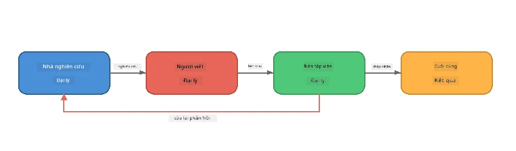
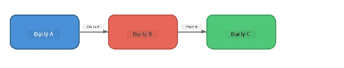
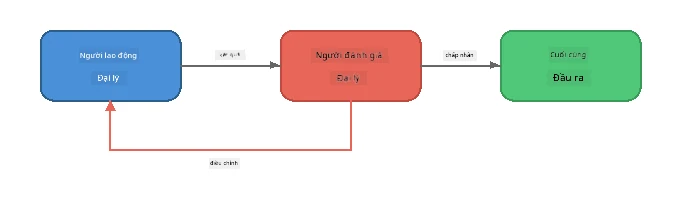
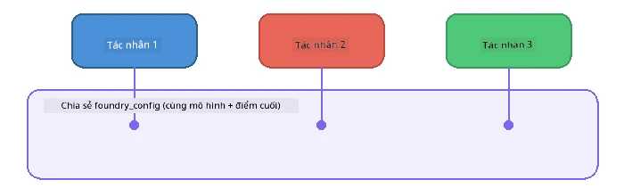

# Phần 6: Quy trình làm việc đa tác nhân

> **Mục tiêu:** Kết hợp nhiều tác nhân chuyên biệt thành các chuỗi phối hợp phân chia các nhiệm vụ phức tạp giữa các tác nhân cộng tác - tất cả đều chạy cục bộ với Foundry Local.

## Tại sao cần đa tác nhân?

Một tác nhân đơn có thể xử lý nhiều nhiệm vụ, nhưng các quy trình phức tạp sẽ được lợi từ **chuyên môn hóa**. Thay vì một tác nhân vừa nghiên cứu, viết và chỉnh sửa cùng lúc, bạn chia công việc thành các vai trò tập trung:



| Mẫu | Mô tả |
|---------|-------------|
| **Tuần tự** | Đầu ra của Tác nhân A được chuyển đến Tác nhân B → Tác nhân C |
| **Vòng phản hồi** | Một tác nhân đánh giá có thể gửi lại công việc để chỉnh sửa |
| **Ngữ cảnh chia sẻ** | Tất cả các tác nhân dùng cùng một mô hình/điểm cuối, nhưng hướng dẫn khác nhau |
| **Đầu ra kiểu cố định** | Các tác nhân tạo kết quả có cấu trúc (JSON) để trao đổi tin cậy |

---

## Bài tập

### Bài tập 1 - Chạy Quy trình Đa tác nhân

Hội thảo bao gồm quy trình hoàn chỉnh Nghiên cứu → Viết → Biên tập.

<details>
<summary><strong>🐍 Python</strong></summary>

**Cài đặt:**
```bash
cd python
python -m venv venv

# Windows (PowerShell):
venv\Scripts\Activate.ps1
# macOS:
source venv/bin/activate

pip install -r requirements.txt
```

**Chạy:**
```bash
python foundry-local-multi-agent.py
```

**Điều xảy ra:**
1. **Nghiên cứu** nhận chủ đề và trả về các điểm chính dạng gạch đầu dòng
2. **Viết** tiếp nhận thông tin nghiên cứu và soạn thảo bài blog (3-4 đoạn văn)
3. **Biên tập** xem lại bài viết về chất lượng và trả về CHẤP NHẬN hoặc CHỈNH SỬA

</details>

<details>
<summary><strong>📦 JavaScript</strong></summary>

**Cài đặt:**
```bash
cd javascript
npm install
```

**Chạy:**
```bash
node foundry-local-multi-agent.mjs
```

**Quy trình ba giai đoạn tương tự** - Nghiên cứu → Viết → Biên tập.

</details>

<details>
<summary><strong>💜 C#</strong></summary>

**Cài đặt:**
```bash
cd csharp
dotnet restore
```

**Chạy:**
```bash
dotnet run multi
```

**Quy trình ba giai đoạn tương tự** - Nghiên cứu → Viết → Biên tập.

</details>

---

### Bài tập 2 - Cấu trúc Quy trình

Nghiên cứu cách tác nhân được định nghĩa và kết nối:

**1. Khách hàng mô hình chia sẻ**

Tất cả tác nhân dùng chung một mô hình Foundry Local:

```python
# Python - FoundryLocalClient xử lý mọi thứ
from agent_framework_foundry_local import FoundryLocalClient

client = FoundryLocalClient(model_id="phi-3.5-mini")
```

```javascript
// JavaScript - SDK OpenAI hướng đến Foundry Local
const client = new OpenAI({
  baseURL: manager.urls[0] + "/v1",
  apiKey: "foundry-local",
});
```

```csharp
// C# - OpenAIClient pointed at Foundry Local
var key = new ApiKeyCredential("foundry-local");
var client = new OpenAIClient(key, new OpenAIClientOptions
{
    Endpoint = new Uri(manager.Urls[0] + "/v1")
});
var chatClient = client.GetChatClient(model.Id);
```

**2. Hướng dẫn chuyên biệt**

Mỗi tác nhân có persona riêng biệt:

| Tác nhân | Hướng dẫn (tóm tắt) |
|-------|----------------------|
| Nghiên cứu | "Cung cấp các sự kiện then chốt, số liệu và bối cảnh. Tổ chức thành các điểm gạch đầu dòng." |
| Viết | "Viết bài blog hấp dẫn (3-4 đoạn) dựa trên ghi chú nghiên cứu. Không tự tạo sự kiện." |
| Biên tập | "Xem lại tính rõ ràng, ngữ pháp và độ nhất quán sự kiện. Kết luận: CHẤP NHẬN hoặc CHỈNH SỬA." |

**3. Dòng dữ liệu giữa các tác nhân**

```python
# Bước 1 - đầu ra từ nhà nghiên cứu trở thành đầu vào cho người viết
research_result = await researcher.run(f"Research: {topic}")

# Bước 2 - đầu ra từ người viết trở thành đầu vào cho biên tập viên
writer_result = await writer.run(f"Write using:\n{research_result}")

# Bước 3 - biên tập viên xem xét cả nghiên cứu và bài báo
editor_result = await editor.run(
    f"Research:\n{research_result}\n\nArticle:\n{writer_result}"
)
```

```csharp
// C# - same pattern, async calls with AIAgent
var researchNotes = await researcher.RunAsync(
    $"Research the following topic and provide key facts:\n{topic}");

var draft = await writer.RunAsync(
    $"Write a blog post based on these research notes:\n\n{researchNotes}");

var verdict = await editor.RunAsync(
    $"Review this article for quality and accuracy.\n\n" +
    $"Research notes:\n{researchNotes}\n\n" +
    $"Article:\n{draft}");
```

> **Ý chính:** Mỗi tác nhân nhận ngữ cảnh tích lũy từ các tác nhân trước. Biên tập viên nhìn thấy cả nghiên cứu gốc và bản thảo - giúp kiểm tra độ chính xác.

---

### Bài tập 3 - Thêm Tác nhân Thứ tư

Mở rộng quy trình bằng cách thêm một tác nhân mới. Lựa chọn:

| Tác nhân | Mục đích | Hướng dẫn |
|-------|---------|-------------|
| **Kiểm tra sự kiện** | Xác minh các tuyên bố trong bài | `"Bạn xác minh các tuyên bố sự kiện. Với mỗi tuyên bố, nói rõ liệu nó có được ghi chú nghiên cứu hỗ trợ không. Trả về JSON với các mục đã xác minh/chưa xác minh."` |
| **Người viết tiêu đề** | Tạo tiêu đề hấp dẫn | `"Tạo 5 lựa chọn tiêu đề cho bài viết. Đa dạng phong cách: thông tin, câu kéo chuột, câu hỏi, danh sách, cảm xúc."` |
| **Truyền thông xã hội** | Tạo bài quảng bá | `"Tạo 3 bài đăng mạng xã hội quảng bá bài viết này: một cho Twitter (280 ký tự), một cho LinkedIn (giọng chuyên nghiệp), một cho Instagram (thân thiện với gợi ý emoji)."` |

<details>
<summary><strong>🐍 Python - thêm Người viết tiêu đề</strong></summary>

```python
headline_agent = client.as_agent(
    name="HeadlineWriter",
    instructions=(
        "You are a headline specialist. Given an article, generate exactly "
        "5 headline options. Vary the style: informative, question-based, "
        "listicle, emotional, and provocative. Return them as a numbered list."
    ),
)

# Sau khi biên tập viên chấp nhận, tạo tiêu đề
headline_result = await headline_agent.run(
    f"Generate headlines for this article:\n\n{writer_result}"
)
print(f"\n--- Headlines ---\n{headline_result}")
```

</details>

<details>
<summary><strong>📦 JavaScript - thêm Người viết tiêu đề</strong></summary>

```javascript
const headlineAgent = new ChatAgent({
  client,
  modelId: modelInfo.id,
  instructions:
    "You are a headline specialist. Given an article, generate exactly " +
    "5 headline options. Vary the style: informative, question-based, " +
    "listicle, emotional, and provocative. Return them as a numbered list.",
  name: "HeadlineWriter",
});

const headlineResult = await headlineAgent.run(
  `Generate headlines for this article:\n\n${writerResult.text}`
);
console.log(`\n--- Headlines ---\n${headlineResult.text}`);
```

</details>

<details>
<summary><strong>💜 C# - thêm Người viết tiêu đề</strong></summary>

```csharp
AIAgent headlineAgent = chatClient.AsAIAgent(
    name: "HeadlineWriter",
    instructions:
        "You are a headline specialist. Given an article, generate exactly " +
        "5 headline options. Vary the style: informative, question-based, " +
        "listicle, emotional, and provocative. Return them as a numbered list."
);

// After the editor accepts, generate headlines
var headlines = await headlineAgent.RunAsync(
    $"Generate headlines for this article:\n\n{draft}");
Console.WriteLine($"\n--- Headlines ---\n{headlines}");
```

</details>

---

### Bài tập 4 - Thiết kế Quy trình Riêng của bạn

Thiết kế quy trình đa tác nhân cho lĩnh vực khác. Một số ý tưởng:

| Lĩnh vực | Tác nhân | Quy trình |
|--------|--------|------|
| **Đánh giá mã** | Phân tích → Đánh giá → Tóm tắt | Phân tích cấu trúc mã → đánh giá vấn đề → tạo báo cáo tóm tắt |
| **Hỗ trợ khách hàng** | Phân loại → Trả lời → Kiểm tra chất lượng | Phân loại vé → soạn câu trả lời → kiểm tra chất lượng |
| **Giáo dục** | Tạo câu hỏi → Mô phỏng học sinh → Chấm điểm | Tạo đề kiểm tra → mô phỏng trả lời → chấm và giải thích |
| **Phân tích dữ liệu** | Giải thích → Phân tích → Báo cáo | Giải thích yêu cầu dữ liệu → phân tích mẫu → viết báo cáo |

**Các bước:**
1. Định nghĩa 3+ tác nhân với các `hướng dẫn` riêng biệt
2. Quyết định luồng dữ liệu - mỗi tác nhân nhận và tạo gì?
3. Triển khai quy trình dùng các mẫu từ Bài tập 1-3
4. Thêm vòng phản hồi nếu một tác nhân cần đánh giá công việc tác nhân khác

---

## Mẫu phối hợp

Dưới đây là các mẫu phối hợp áp dụng cho mọi hệ thống đa tác nhân (khám phá sâu trong [Phần 7](part7-zava-creative-writer.md)):

### Quy trình Tuần tự



Mỗi tác nhân xử lý đầu ra của tác nhân trước. Đơn giản và dễ đoán.

### Vòng phản hồi



Tác nhân đánh giá có thể kích hoạt chạy lại các giai đoạn trước. Zava Writer dùng kiểu này: biên tập viên gửi phản hồi lại cho nghiên cứu viên và viết bài.

### Ngữ cảnh chung



Tất cả tác nhân chia sẻ `foundry_config` để dùng cùng mô hình và điểm cuối.

---

## Những điểm chính cần nhớ

| Khái niệm | Điều bạn học được |
|---------|-----------------|
| Chuyên môn hóa tác nhân | Mỗi tác nhân làm tốt một việc với hướng dẫn rõ ràng |
| Trao đổi dữ liệu | Đầu ra của tác nhân này làm đầu vào cho tác nhân kế tiếp |
| Vòng phản hồi | Tác nhân đánh giá có thể kích hoạt thử lại để tăng chất lượng |
| Đầu ra có cấu trúc | Phản hồi định dạng JSON giúp giao tiếp tác nhân tin cậy |
| Phối hợp | Bộ điều phối quản lý chuỗi quy trình và xử lý lỗi |
| Mẫu sản xuất | Áp dụng trong [Phần 7: Zava Creative Writer](part7-zava-creative-writer.md) |

---

## Bước tiếp theo

Tiếp tục đến [Phần 7: Zava Creative Writer - Ứng dụng Capstone](part7-zava-creative-writer.md) để khám phá ứng dụng đa tác nhân kiểu sản xuất với 4 tác nhân chuyên biệt, đầu ra streaming, tìm kiếm sản phẩm và vòng phản hồi - có sẵn với Python, JavaScript, và C#.