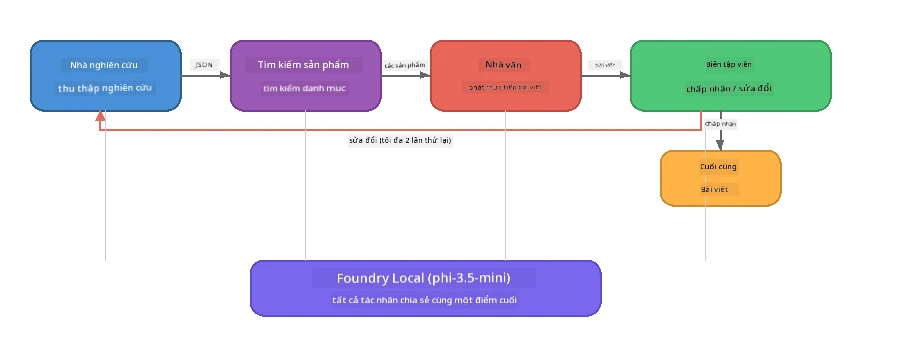

# Phần 7: Zava Creative Writer - Ứng Dụng Capstone

> **Mục tiêu:** Khám phá một ứng dụng đa tác nhân kiểu sản xuất, nơi bốn tác nhân chuyên biệt phối hợp để tạo ra các bài báo chất lượng tạp chí cho Zava Retail DIY – hoàn toàn chạy trên thiết bị của bạn với Foundry Local.

Đây là **phòng thí nghiệm capstone** của hội thảo. Nó tổng hợp tất cả những gì bạn đã học - tích hợp SDK (Phần 3), truy xuất dữ liệu cục bộ (Phần 4), cá tính tác nhân (Phần 5) và phối hợp đa tác nhân (Phần 6) - thành một ứng dụng hoàn chỉnh có sẵn bằng **Python**, **JavaScript**, và **C#**.

---

## Bạn Sẽ Khám Phá Gì

| Khái niệm | Nơi trong Zava Writer |
|---------|-----------------------|
| Tải mô hình 4 bước | Mô-đun cấu hình chia sẻ khởi động Foundry Local |
| Truy xuất theo kiểu RAG | Tác nhân sản phẩm tìm kiếm trong danh mục cục bộ |
| Chuyên biệt tác nhân | 4 tác nhân với hướng dẫn hệ thống riêng biệt |
| Xuất luồng dữ liệu | Người viết tạo ra token theo thời gian thực |
| Chuyển giao có cấu trúc | Nhà nghiên cứu → JSON, Biên tập viên → quyết định JSON |
| Vòng lặp phản hồi | Biên tập viên có thể kích hoạt thực thi lại (tối đa 2 lần thử) |

---

## Kiến Trúc

Zava Creative Writer sử dụng **pipeline tuần tự với phản hồi điều khiển bởi người đánh giá**. Ba phiên bản ngôn ngữ đều theo cùng kiến trúc:



### Bốn Tác Nhân

| Tác nhân | Đầu vào | Đầu ra | Mục đích |
|-------|-------|--------|---------|
| **Nhà nghiên cứu** | Chủ đề + phản hồi tùy chọn | `{"web": [{url, name, description}, ...]}` | Thu thập nghiên cứu nền tảng qua LLM |
| **Tìm kiếm sản phẩm** | Chuỗi ngữ cảnh sản phẩm | Danh sách sản phẩm phù hợp | Truy vấn tạo bởi LLM + tìm kiếm từ khóa trong danh mục cục bộ |
| **Người viết** | Nghiên cứu + sản phẩm + bài tập + phản hồi | Bài viết luồng dữ liệu (phân tách bởi `---`) | Soạn thảo bài báo chất lượng tạp chí theo thời gian thực |
| **Biên tập viên** | Bài viết + phản hồi của người viết | `{"decision": "accept/revise", "editorFeedback": "...", "researchFeedback": "..."}` | Đánh giá chất lượng, kích hoạt thử lại nếu cần |

### Luồng Pipeline

1. **Nhà nghiên cứu** nhận chủ đề và tạo ghi chú nghiên cứu cấu trúc (JSON)  
2. **Tìm kiếm sản phẩm** truy vấn danh mục sản phẩm cục bộ bằng thuật ngữ tìm kiếm do LLM tạo  
3. **Người viết** kết hợp nghiên cứu + sản phẩm + bài tập thành bài viết luồng, thêm phản hồi của mình sau dấu phân cách `---`  
4. **Biên tập viên** đánh giá bài viết và trả về quyết định dạng JSON:  
   - `"accept"` → pipeline hoàn tất  
   - `"revise"` → phản hồi được gửi lại Nhà nghiên cứu và Người viết (tối đa 2 lần thử)

---

## Yêu Cầu Chuẩn Bị

- Hoàn thành [Phần 6: Quy trình làm việc đa tác nhân](part6-multi-agent-workflows.md)  
- Cài đặt Foundry Local CLI và tải mô hình `phi-3.5-mini`

---

## Bài Tập

### Bài tập 1 - Chạy Zava Creative Writer

Chọn ngôn ngữ của bạn và chạy ứng dụng:

<details>
<summary><strong>🐍 Python - Dịch vụ Web FastAPI</strong></summary>

Phiên bản Python chạy như một **dịch vụ web** với API REST, minh họa cách xây dựng backend sản xuất.

**Cài đặt:**
```bash
cd zava-creative-writer-local/src/api
python -m venv venv

# Windows (PowerShell):
venv\Scripts\Activate.ps1
# macOS:
source venv/bin/activate

pip install -r requirements.txt
```

**Chạy:**
```bash
uvicorn main:app --reload
```

**Kiểm tra:**
```bash
curl -X POST http://localhost:8000/api/article \
  -H "Content-Type: application/json" \
  -d '{
    "research": "DIY home improvement trends",
    "products": "power tools and paints",
    "assignment": "Write an article about weekend renovation projects for DIY enthusiasts"
  }'
```

Phản hồi được phát luồng dưới dạng các tin nhắn JSON phân tách bằng dòng mới, cho thấy tiến trình từng tác nhân.

</details>

<details>
<summary><strong>📦 JavaScript - CLI Node.js</strong></summary>

Phiên bản JavaScript chạy như một **ứng dụng CLI**, in tiến trình tác nhân và bài báo trực tiếp ra console.

**Cài đặt:**
```bash
cd zava-creative-writer-local/src/javascript
npm install
```

**Chạy:**
```bash
node main.mjs
```

Bạn sẽ thấy:  
1. Tải mô hình Foundry Local (có thanh tiến trình nếu đang tải xuống)  
2. Mỗi tác nhân thực thi tuần tự với thông điệp trạng thái  
3. Bài viết được phát luồng ra console theo thời gian thực  
4. Quyết định chấp nhận/sửa đổi của biên tập viên

</details>

<details>
<summary><strong>💜 C# - Ứng dụng Console .NET</strong></summary>

Phiên bản C# chạy như một **ứng dụng console .NET** với pipeline và xuất luồng tương tự.

**Cài đặt:**
```bash
cd zava-creative-writer-local/src/csharp
dotnet restore
```

**Chạy:**
```bash
dotnet run
```

Mẫu đầu ra giống với phiên bản JavaScript - thông điệp trạng thái tác nhân, bài viết phát luồng và quyết định biên tập viên.

</details>

---

### Bài tập 2 - Nghiên cứu Cấu Trúc Mã Nguồn

Mỗi ngôn ngữ đều có các thành phần logic giống nhau. So sánh các cấu trúc:

**Python** (`src/api/`):  
| Tệp | Mục đích |
|------|---------|
| `foundry_config.py` | Quản lý Foundry Local dùng chung, mô hình và client (khởi tạo 4 bước) |
| `orchestrator.py` | Điều phối pipeline với vòng phản hồi |
| `main.py` | Điểm cuối FastAPI (`POST /api/article`) |
| `agents/researcher/researcher.py` | Nghiên cứu dựa trên LLM với đầu ra JSON |
| `agents/product/product.py` | Tạo truy vấn LLM + tìm kiếm từ khóa |
| `agents/writer/writer.py` | Tạo bài viết luồng |
| `agents/editor/editor.py` | Quyết định chấp nhận/sửa đổi dựa trên JSON |

**JavaScript** (`src/javascript/`):  
| Tệp | Mục đích |
|------|---------|
| `foundryConfig.mjs` | Cấu hình Foundry Local dùng chung (khởi tạo 4 bước với thanh tiến trình) |
| `main.mjs` | Điều phối + điểm khởi đầu CLI |
| `researcher.mjs` | Tác nhân nghiên cứu dựa trên LLM |
| `product.mjs` | Tạo truy vấn LLM + tìm kiếm từ khóa |
| `writer.mjs` | Tạo bài viết luồng (generator async) |
| `editor.mjs` | Quyết định chấp nhận/sửa đổi JSON |
| `products.mjs` | Dữ liệu danh mục sản phẩm |

**C#** (`src/csharp/`):  
| Tệp | Mục đích |
|------|---------|
| `Program.cs` | Pipeline hoàn chỉnh: tải mô hình, tác nhân, điều phối, vòng phản hồi |
| `ZavaCreativeWriter.csproj` | Dự án .NET 9 với các gói Foundry Local + OpenAI |

> **Ghi chú thiết kế:** Python tách mỗi tác nhân thành tệp/thư mục riêng (phù hợp nhóm lớn). JavaScript dùng một mô-đun cho mỗi tác nhân (phù hợp dự án trung bình). C# giữ mọi thứ trong một tệp duy nhất với các hàm cục bộ (phù hợp ví dụ tự chứa). Trong sản xuất, chọn mô hình phù hợp với quy ước nhóm bạn.

---

### Bài tập 3 - Theo Dõi Cấu Hình Dùng Chung

Mỗi tác nhân trong pipeline dùng chung một client mô hình Foundry Local. Nghiên cứu cách thiết lập ở từng ngôn ngữ:

<details>
<summary><strong>🐍 Python - foundry_config.py</strong></summary>

```python
from foundry_local import FoundryLocalManager

MODEL_ALIAS = "phi-3.5-mini"

# Bước 1: Tạo quản lý và khởi động dịch vụ Foundry Local
manager = FoundryLocalManager()
manager.start_service()

# Bước 2: Kiểm tra xem mô hình đã được tải xuống chưa
cached = manager.list_cached_models()
catalog_info = manager.get_model_info(MODEL_ALIAS)
is_cached = any(m.id == catalog_info.id for m in cached) if catalog_info else False

if not is_cached:
    manager.download_model(MODEL_ALIAS)

# Bước 3: Tải mô hình vào bộ nhớ
manager.load_model(MODEL_ALIAS)
model_id = manager.get_model_info(MODEL_ALIAS).id

# Client OpenAI dùng chung
client = openai.OpenAI(base_url=manager.endpoint, api_key=manager.api_key)
```
  
Tất cả tác nhân import `from foundry_config import client, model_id`.

</details>

<details>
<summary><strong>📦 JavaScript - foundryConfig.mjs</strong></summary>

```javascript
import { FoundryLocalManager } from "foundry-local-sdk";
import { OpenAI } from "openai";

FoundryLocalManager.create({ appName: "ZavaCreativeWriter" });
const manager = FoundryLocalManager.instance;
await manager.startWebService();

// Kiểm tra bộ nhớ đệm → tải xuống → tải (mẫu SDK mới)
const catalog = manager.catalog;
const model = await catalog.getModel(MODEL_ALIAS);
if (!model.isCached) {
  console.log(`Downloading model: ${MODEL_ALIAS}...`);
  await model.download();
}
await model.load();

const client = new OpenAI({ baseURL: manager.urls[0] + "/v1", apiKey: "foundry-local" });
const modelId = model.id;
export { client, modelId };
```
  
Tất cả tác nhân import `{ client, modelId } from "./foundryConfig.mjs"`.

</details>

<details>
<summary><strong>💜 C# - đầu file Program.cs</strong></summary>

```csharp
await FoundryLocalManager.CreateAsync(
    new Configuration
    {
        AppName = "ZavaCreativeWriter",
        Web = new Configuration.WebService { Urls = "http://127.0.0.1:0" }
    }, NullLogger.Instance, default);
var manager = FoundryLocalManager.Instance;
await manager.StartWebServiceAsync(default);

var catalog = await manager.GetCatalogAsync(default);
var catalogModel = await catalog.GetModelAsync(alias, default);
var isCached = await catalogModel.IsCachedAsync(default);
if (!isCached)
    await catalogModel.DownloadAsync(null, default);

await catalogModel.LoadAsync(default);
var key = new ApiKeyCredential("foundry-local");
var chatClient = new OpenAIClient(key, new OpenAIClientOptions
{
    Endpoint = new Uri(manager.Urls[0] + "/v1")
}).GetChatClient(catalogModel.Id);
```
  
`chatClient` sau đó được truyền cho tất cả hàm tác nhân trong cùng file.

</details>

> **Mẫu thiết kế chính:** Mẫu tải mô hình (khởi động dịch vụ → kiểm tra cache → tải xuống → tải mô hình) đảm bảo người dùng thấy tiến trình rõ ràng và mô hình chỉ tải xuống một lần. Đây là thực tiễn tốt nhất cho mọi ứng dụng Foundry Local.

---

### Bài tập 4 - Hiểu Vòng Lặp Phản Hồi

Vòng lặp phản hồi chính là điểm làm cho pipeline này "thông minh" - Biên tập viên có thể gửi lại công việc để sửa đổi. Theo dõi logic:

```
Orchestrator:
  1. researcher.research(topic, "No Feedback")    ← first pass
  2. product.findProducts(productContext)
  3. writer.write(research, products, assignment)  ← streams article
  4. Split article at "---" → article + writerFeedback
  5. editor.edit(article, writerFeedback)

  WHILE editor says "revise" AND retryCount < 2:
    6. researcher.research(topic, editor.researchFeedback)  ← refined
    7. writer.write(research, products, editor.editorFeedback)
    8. editor.edit(newArticle, newWriterFeedback)
    9. retryCount++
```
  
**Câu hỏi để xem xét:**  
- Tại sao giới hạn thử lại được đặt là 2? Chuyện gì xảy ra nếu tăng lên?  
- Tại sao nhà nghiên cứu nhận `researchFeedback` còn người viết nhận `editorFeedback`?  
- Nếu biên tập viên luôn nói "sửa đổi" thì sao?

---

### Bài tập 5 - Sửa Đổi Một Tác Nhân

Thử thay đổi hành vi một tác nhân và quan sát ảnh hưởng đến pipeline:

| Thay đổi | Cần thay đổi gì |
|-------------|----------------|
| **Biên tập viên nghiêm ngặt hơn** | Thay hướng dẫn hệ thống của biên tập viên để luôn yêu cầu ít nhất một lần sửa đổi |
| **Bài viết dài hơn** | Thay đổi hướng dẫn người viết từ "800-1000 từ" thành "1500-2000 từ" |
| **Sản phẩm khác** | Thêm hoặc sửa sản phẩm trong danh mục sản phẩm |
| **Chủ đề nghiên cứu mới** | Thay `researchContext` mặc định sang chủ đề khác |
| **Nhà nghiên cứu chỉ trả JSON** | Làm cho nhà nghiên cứu trả về 10 mục thay vì 3-5 |

> **Mẹo:** Vì ba ngôn ngữ đều triển khai cùng kiến trúc, bạn có thể chỉnh sửa giống nhau trong ngôn ngữ mà bạn quen thuộc nhất.

---

### Bài tập 6 - Thêm Tác Nhân Thứ Năm

Mở rộng pipeline với một tác nhân mới. Một số ý tưởng:

| Tác nhân | Vị trí trong pipeline | Mục đích |
|-------|-------------------|---------|
| **Kiểm chứng sự thật** | Sau Người viết, trước Biên tập viên | Xác minh các tuyên bố dựa trên dữ liệu nghiên cứu |
| **Tối ưu SEO** | Sau khi Biên tập viên chấp nhận | Thêm mô tả meta, từ khóa, đường dẫn slug |
| **Minh họa** | Sau khi Biên tập viên chấp nhận | Tạo các prompt hình ảnh cho bài viết |
| **Dịch thuật** | Sau khi Biên tập viên chấp nhận | Dịch bài viết sang ngôn ngữ khác |

**Các bước:**  
1. Viết prompt hệ thống cho tác nhân  
2. Tạo hàm tác nhân (theo mẫu hiện có trong ngôn ngữ của bạn)  
3. Chèn vào orchestrator tại vị trí phù hợp  
4. Cập nhật đầu ra/ghi nhận để hiển thị đóng góp mới của tác nhân

---

## Cách Foundry Local và Framework Tác Nhân Hoạt Động Cùng Nhau

Ứng dụng này minh họa mẫu đề xuất để xây dựng hệ thống đa tác nhân với Foundry Local:

| Lớp | Thành phần | Vai trò |
|-------|-----------|---------|
| **Runtime** | Foundry Local | Tải xuống, quản lý và phục vụ mô hình cục bộ |
| **Client** | OpenAI SDK | Gửi các yêu cầu chat completion tới endpoint cục bộ |
| **Agent** | Prompt hệ thống + cuộc gọi chat | Hành vi chuyên biệt qua hướng dẫn tập trung |
| **Orchestrator** | Điều phối pipeline | Quản lý luồng dữ liệu, thứ tự và vòng phản hồi |
| **Framework** | Microsoft Agent Framework | Cung cấp trừu tượng `ChatAgent` và các mẫu thiết kế |

Điểm nhấn: **Foundry Local thay thế backend đám mây, không phải kiến trúc ứng dụng.** Các mẫu tác nhân, chiến lược điều phối và chuyển giao có cấu trúc hoạt động với mô hình đám mây cũng y hệt với mô hình cục bộ — bạn chỉ cần trỏ client đến endpoint cục bộ thay vì endpoint Azure.

---

## Những Điều Rút Ra Quan Trọng

| Khái niệm | Điều bạn học được |
|---------|-------------------|
| Kiến trúc sản xuất | Cách cấu trúc ứng dụng đa tác nhân với cấu hình dùng chung và tác nhân riêng biệt |
| Tải mô hình 4 bước | Thực tiễn tốt nhất để khởi tạo Foundry Local với tiến trình hiển thị cho người dùng |
| Chuyên biệt tác nhân | Mỗi trong 4 tác nhân có hướng dẫn tập trung và định dạng đầu ra cụ thể |
| Tạo dữ liệu luồng | Người viết tạo token theo thời gian thực, hỗ trợ giao diện phản hồi nhanh |
| Vòng lặp phản hồi | Thử lại do biên tập viên điều phối giúp cải thiện chất lượng đầu ra không cần can thiệp thủ công |
| Mẫu đa ngôn ngữ | Cùng kiến trúc hoạt động trong Python, JavaScript và C# |
| Cục bộ = sẵn sàng sản xuất | Foundry Local phục vụ API tương thích OpenAI giống như triển khai trên đám mây |

---

## Bước Tiếp Theo

Tiếp tục tới [Phần 8: Phát Triển Dựa Trên Đánh Giá](part8-evaluation-led-development.md) để xây dựng khung đánh giá hệ thống cho các tác nhân của bạn, sử dụng bộ dữ liệu vàng, kiểm tra dựa trên quy tắc và đánh giá với LLM như giám khảo.