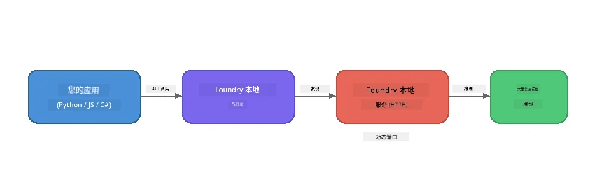

# 第1部分：开始使用 Foundry Local


## 什么是 Foundry Local？

[Foundry Local](https://foundrylocal.ai) 让你可以 <strong>直接在你的电脑上</strong> 运行开源 AI 语言模型——无需互联网，无需云端费用，并且完全保护数据隐私。它：

- <strong>本地下载并运行模型</strong>，自动进行硬件优化（GPU、CPU 或 NPU）
- **提供一个兼容 OpenAI 的 API**，让你可以使用熟悉的 SDK 和工具
- **无需 Azure 订阅** 或注册——只需安装即可开始构建

可以把它看作是完全在你机器上运行的私人 AI。

## 学习目标

完成本实验后，你将能够：

- 在你的操作系统上安装 Foundry Local CLI
- 理解模型别名及其工作原理
- 下载并运行你的第一个本地 AI 模型
- 从命令行向本地模型发送聊天消息
- 理解本地与云端托管 AI 模型的区别

---

## 先决条件

### 系统需求

| 需求 | 最低配置 | 推荐配置 |
|-------------|---------|-------------|
| <strong>内存</strong> | 8 GB | 16 GB |
| <strong>磁盘空间</strong> | 5 GB（用于模型） | 10 GB |
| **CPU** | 4核 | 8核以上 |
| **GPU** | 可选 | NVIDIA，支持 CUDA 11.8+ |
| <strong>操作系统</strong> | Windows 10/11 (x64/ARM)、Windows Server 2025、macOS 13+ | - |

> **注意：** Foundry Local 会自动选择最适合你硬件的模型变体。如果你有 NVIDIA GPU，它将使用 CUDA 加速。如果你有 Qualcomm NPU，则使用它。否则会回退到经过优化的 CPU 变体。

### 安装 Foundry Local CLI

**Windows**（PowerShell）：
```powershell
winget install Microsoft.FoundryLocal
```

**macOS**（Homebrew）：
```bash
brew tap microsoft/foundrylocal
brew install foundrylocal
```

> **注意：** Foundry Local 当前仅支持 Windows 和 macOS。暂时不支持 Linux。

验证安装：
```bash
foundry --version
```

---

## 实验练习

### 练习1：探索可用模型

Foundry Local 包含一个预优化的开源模型目录。列出它们：

```bash
foundry model list
```

你会看到如下模型：
- `phi-3.5-mini` - 微软的38亿参数模型（速度快，质量好）
- `phi-4-mini` - 更新、更强大的 Phi 模型
- `phi-4-mini-reasoning` - 具备链式思维推理能力的 Phi 模型（带 `<think>` 标签）
- `phi-4` - 微软最大的 Phi 模型（10.4 GB）
- `qwen2.5-0.5b` - 非常小且快速（适合资源受限设备）
- `qwen2.5-7b` - 支持调用工具的强大通用模型
- `qwen2.5-coder-7b` - 针对代码生成优化
- `deepseek-r1-7b` - 强大的推理模型
- `gpt-oss-20b` - 大型开源模型（MIT 许可证，12.5 GB）
- `whisper-base` - 语音转文字转录（383 MB）
- `whisper-large-v3-turbo` - 高精度转录（9 GB）

> **什么是模型别名？** 类似 `phi-3.5-mini` 的别名是快捷方式。当你使用别名时，Foundry Local 会自动下载最适合你硬件的变体（NVIDIA GPU 使用 CUDA，其他情况下使用 CPU 优化版本）。你无需担心选择哪个变体。

### 练习2：运行你的第一个模型

下载并开始与模型进行交互聊天：

```bash
foundry model run phi-3.5-mini
```

你首次运行时，Foundry Local 会：
1. 检测你的硬件
2. 下载最佳模型变体（可能需要几分钟）
3. 将模型加载到内存
4. 启动交互式聊天会话

尝试问它一些问题：
```
You: What is the golden ratio?
You: Can you explain it as if I were 10 years old?
You: Write a haiku about mathematics
```

输入 `exit` 或按 `Ctrl+C` 退出。

### 练习3：预先下载模型

如果你想下载模型而不启动聊天：

```bash
foundry model download phi-3.5-mini
```

查看你机器上已下载的模型：

```bash
foundry cache list
```

### 练习4：理解架构

Foundry Local 作为一个 **本地 HTTP 服务** 运行，暴露兼容 OpenAI 的 REST API。意思是：

1. 服务启动时会使用 <strong>动态端口</strong>（每次都不同）
2. 你通过 SDK 来发现实际的端点 URL
3. 你可以使用 <strong>任何</strong> 兼容 OpenAI 的客户端库进行交互



> **重要提示：** Foundry Local 每次启动都会分配一个 <strong>动态端口</strong>。切勿硬编码端口号如 `localhost:5272`。必须使用 SDK 来发现当前 URL（例如 Python 中的 `manager.endpoint` 或 JavaScript 中的 `manager.urls[0]`）。

---

## 关键要点

| 概念 | 你学到了什么 |
|---------|------------------|
| 本地 AI | Foundry Local 完全在你的设备上运行模型，无需云端、API 密钥或花费 |
| 模型别名 | 像 `phi-3.5-mini` 这样的别名会自动选择适合你的硬件的最佳变体 |
| 动态端口 | 服务在动态端口上运行；始终使用 SDK 来发现端点 |
| CLI 和 SDK | 你可以通过 CLI（`foundry model run`）或 SDK 编程方式与模型交互 |

---

## 后续步骤

继续阅读[第2部分：Foundry Local SDK 深入探讨](part2-foundry-local-sdk.md)，掌握用于编程管理模型、服务和缓存的 SDK API。