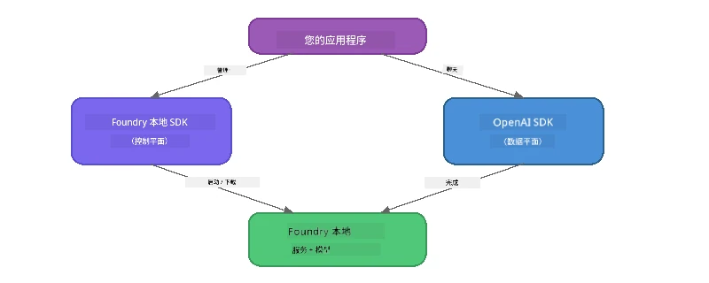

# 第3部分：使用 Foundry Local SDK 与 OpenAI

## 概述

在第1部分中，您使用 Foundry Local CLI 交互式运行模型。第2部分中，您探索了完整的 SDK API 表面。现在您将学习如何使用 SDK 和兼容 OpenAI 的 API **将 Foundry Local 集成到您的应用程序中**。

Foundry Local 提供了三种语言的 SDK。请选择您最熟悉的一种——三者之间的概念是完全相同的。

## 学习目标

完成本实验后，您将能够：

- 安装适合您语言的 Foundry Local SDK（Python、JavaScript 或 C#）
- 初始化 `FoundryLocalManager` 以启动服务、检查缓存、下载并加载模型
- 使用 OpenAI SDK 连接到本地模型
- 发送聊天完成请求并处理流式响应
- 了解动态端口架构

---

## 前提条件

请先完成[第1部分：Foundry Local 快速入门](part1-getting-started.md)和[第2部分：Foundry Local SDK 深入解析](part2-foundry-local-sdk.md)。

安装以下三种语言运行时中的一种：
- **Python 3.9+** - [python.org/downloads](https://www.python.org/downloads/)
- **Node.js 18+** - [nodejs.org](https://nodejs.org/)
- **.NET 9.0+** - [dot.net/download](https://dotnet.microsoft.com/download)

---

## 概念：SDK 工作原理

Foundry Local SDK 管理<strong>控制平面</strong>（启动服务、下载模型），而 OpenAI SDK 处理<strong>数据平面</strong>（发送提示，接收完成结果）。



---

## 实验练习

### 练习1：设置环境

<details>
<summary><b>🐍 Python</b></summary>

```bash
cd python
python -m venv venv

# 激活虚拟环境：
# Windows（PowerShell）：
venv\Scripts\Activate.ps1
# Windows（命令提示符）：
venv\Scripts\activate.bat
# macOS：
source venv/bin/activate

pip install -r requirements.txt
```

`requirements.txt` 安装：
- `foundry-local-sdk` - Foundry Local SDK（导入时使用 `foundry_local`）
- `openai` - OpenAI Python SDK
- `agent-framework` - Microsoft Agent Framework（后续部分使用）

</details>

<details>
<summary><b>📘 JavaScript</b></summary>

```bash
cd javascript
npm install
```

`package.json` 安装：
- `foundry-local-sdk` - Foundry Local SDK
- `openai` - OpenAI Node.js SDK

</details>

<details>
<summary><b>💜 C#</b></summary>

```bash
cd csharp
dotnet restore
dotnet build
```

`csharp.csproj` 使用：
- `Microsoft.AI.Foundry.Local` - Foundry Local SDK（NuGet）
- `OpenAI` - OpenAI C# SDK（NuGet）

> **项目结构：** C# 项目在 `Program.cs` 中使用命令行路由，分发到不同示例文件。运行 `dotnet run chat`（或直接 `dotnet run`）执行本部分内容。其他部分使用 `dotnet run rag`、`dotnet run agent` 和 `dotnet run multi`。

</details>

---

### 练习2：基础聊天完成

打开适合您语言的基础聊天示例并查看代码。每个脚本遵循相同的三步模式：

1. <strong>启动服务</strong> - `FoundryLocalManager` 启动 Foundry Local 运行时
2. <strong>下载并加载模型</strong> - 检查缓存，必要时下载，然后加载到内存
3. **创建 OpenAI 客户端** - 连接本地端点并发送流式聊天完成请求

<details>
<summary><b>🐍 Python - <code>python/foundry-local.py</code></b></summary>

```python
import sys
import openai
from foundry_local import FoundryLocalManager

alias = "phi-3.5-mini"

# 第一步：创建一个 FoundryLocalManager 并启动服务
print("Starting Foundry Local service...")
manager = FoundryLocalManager()
manager.start_service()

# 第二步：检查模型是否已经下载
cached = manager.list_cached_models()
catalog_info = manager.get_model_info(alias)
is_cached = any(m.id == catalog_info.id for m in cached) if catalog_info else False

if is_cached:
    print(f"Model already downloaded: {alias}")
else:
    print(f"Downloading model: {alias} (this may take several minutes)...")
    manager.download_model(alias)
    print(f"Download complete: {alias}")

# 第三步：将模型加载到内存中
print(f"Loading model: {alias}...")
manager.load_model(alias)

# 创建一个指向本地 Foundry 服务的 OpenAI 客户端
client = openai.OpenAI(
    base_url=manager.endpoint,   # 动态端口 - 切勿硬编码！
    api_key=manager.api_key
)

# 生成流式聊天完成
stream = client.chat.completions.create(
    model=manager.get_model_info(alias).id,
    messages=[{"role": "user", "content": "What is the golden ratio?"}],
    stream=True,
)

for chunk in stream:
    if chunk.choices[0].delta.content is not None:
        print(chunk.choices[0].delta.content, end="", flush=True)
print()
```

**运行：**
```bash
python foundry-local.py
```

</details>

<details>
<summary><b>📘 JavaScript - <code>javascript/foundry-local.mjs</code></b></summary>

```javascript
import { OpenAI } from "openai";
import { FoundryLocalManager } from "foundry-local-sdk";

const alias = "phi-3.5-mini";

// 第一步：启动 Foundry 本地服务
console.log("Starting Foundry Local service...");
FoundryLocalManager.create({ appName: "FoundryLocalWorkshop" });
const manager = FoundryLocalManager.instance;
await manager.startWebService();

// 第二步：检查模型是否已下载
const catalog = manager.catalog;
const model = await catalog.getModel(alias);

if (model.isCached) {
  console.log(`Model already downloaded: ${alias}`);
} else {
  console.log(`Downloading model: ${alias} (this may take several minutes)...`);
  await model.download();
  console.log(`Download complete: ${alias}`);
}

// 第三步：将模型加载到内存中
console.log(`Loading model: ${alias}...`);
await model.load();
console.log(`Model loaded: ${model.id}`);

// 创建一个指向本地 Foundry 服务的 OpenAI 客户端
const client = new OpenAI({
  baseURL: manager.urls[0] + "/v1",   // 动态端口 - 切勿硬编码！
  apiKey: "foundry-local",
});

// 生成流式聊天完成
const stream = await client.chat.completions.create({
  model: model.id,
  messages: [{ role: "user", content: "What is the golden ratio?" }],
  stream: true,
});

for await (const chunk of stream) {
  if (chunk.choices[0]?.delta?.content) {
    process.stdout.write(chunk.choices[0].delta.content);
  }
}
console.log();
```

**运行：**
```bash
node foundry-local.mjs
```

</details>

<details>
<summary><b>💜 C# - <code>csharp/BasicChat.cs</code></b></summary>

```csharp
using Microsoft.AI.Foundry.Local;
using Microsoft.Extensions.Logging.Abstractions;
using OpenAI;
using OpenAI.Chat;
using System.ClientModel;

var alias = "phi-3.5-mini";

// Step 1: Start the Foundry Local service
Console.WriteLine("Starting Foundry Local service...");
await FoundryLocalManager.CreateAsync(
    new Configuration
    {
        AppName = "FoundryLocalSamples",
        Web = new Configuration.WebService { Urls = "http://127.0.0.1:0" }
    }, NullLogger.Instance, default);
var manager = FoundryLocalManager.Instance;
await manager.StartWebServiceAsync(default);

// Step 2: Get the model from the catalog
var catalog = await manager.GetCatalogAsync(default);
var model = await catalog.GetModelAsync(alias, default);

// Step 3: Check if the model is already downloaded
var isCached = await model.IsCachedAsync(default);

if (isCached)
{
    Console.WriteLine($"Model already downloaded: {alias}");
}
else
{
    Console.WriteLine($"Downloading model: {alias} (this may take several minutes)...");
    await model.DownloadAsync(null, default);
    Console.WriteLine($"Download complete: {alias}");
}

// Step 4: Load the model into memory
Console.WriteLine($"Loading model: {alias}...");
await model.LoadAsync(default);
Console.WriteLine($"Loaded model: {model.Id}");
Console.WriteLine($"Endpoint: {manager.Urls[0]}");

// Create OpenAI client pointing to the LOCAL Foundry service
var key = new ApiKeyCredential("foundry-local");
var client = new OpenAIClient(key, new OpenAIClientOptions
{
    Endpoint = new Uri(manager.Urls[0] + "/v1")  // Dynamic port - never hardcode!
});

var chatClient = client.GetChatClient(model.Id);

// Stream a chat completion
var completionUpdates = chatClient.CompleteChatStreaming("What is the golden ratio?");

foreach (var update in completionUpdates)
{
    if (update.ContentUpdate.Count > 0)
    {
        Console.Write(update.ContentUpdate[0].Text);
    }
}
Console.WriteLine();
```

**运行：**
```bash
dotnet run chat
```

</details>

---

### 练习3：尝试修改提示

运行基础示例后，尝试修改代码：

1. <strong>更改用户消息</strong> - 尝试不同的问题
2. <strong>添加系统提示</strong> - 给模型定义一个角色
3. <strong>关闭流式</strong> - 设置 `stream=False`，一次性打印完整回复
4. <strong>尝试不同模型</strong> - 将别名从 `phi-3.5-mini` 改为 `foundry model list` 中的其他模型

<details>
<summary><b>🐍 Python</b></summary>

```python
# 添加系统提示 - 给模型一个角色设定：
stream = client.chat.completions.create(
    model=manager.get_model_info(alias).id,
    messages=[
        {"role": "system", "content": "You are a pirate. Answer everything in pirate speak."},
        {"role": "user", "content": "What is the golden ratio?"}
    ],
    stream=True,
)

# 或者关闭流式传输：
response = client.chat.completions.create(
    model=manager.get_model_info(alias).id,
    messages=[{"role": "user", "content": "What is the golden ratio?"}],
    stream=False,
)
print(response.choices[0].message.content)
```

</details>

<details>
<summary><b>📘 JavaScript</b></summary>

```javascript
// 添加一个系统提示 - 给模型一个角色设定：
const stream = await client.chat.completions.create({
  model: modelInfo.id,
  messages: [
    { role: "system", content: "You are a pirate. Answer everything in pirate speak." },
    { role: "user", content: "What is the golden ratio?" },
  ],
  stream: true,
});

// 或者关闭流式传输：
const response = await client.chat.completions.create({
  model: modelInfo.id,
  messages: [{ role: "user", content: "What is the golden ratio?" }],
  stream: false,
});
console.log(response.choices[0].message.content);
```

</details>

<details>
<summary><b>💜 C#</b></summary>

```csharp
// Add a system prompt - give the model a persona:
var completionUpdates = chatClient.CompleteChatStreaming(
    new ChatMessage[]
    {
        new SystemChatMessage("You are a pirate. Answer everything in pirate speak."),
        new UserChatMessage("What is the golden ratio?")
    }
);

// Or turn off streaming:
var response = chatClient.CompleteChat("What is the golden ratio?");
Console.WriteLine(response.Value.Content[0].Text);
```

</details>

---

### SDK 方法参考

<details>
<summary><b>🐍 Python SDK 方法</b></summary>

| 方法 | 作用 |
|--------|---------|
| `FoundryLocalManager()` | 创建管理实例 |
| `manager.start_service()` | 启动 Foundry Local 服务 |
| `manager.list_cached_models()` | 列出设备上已下载的模型 |
| `manager.get_model_info(alias)` | 获取模型 ID 和元数据 |
| `manager.download_model(alias, progress_callback=fn)` | 下载模型，可选进度回调 |
| `manager.load_model(alias)` | 将模型加载到内存 |
| `manager.endpoint` | 获取动态端点 URL |
| `manager.api_key` | 获取 API 密钥（本地占位符） |

</details>

<details>
<summary><b>📘 JavaScript SDK 方法</b></summary>

| 方法 | 作用 |
|--------|---------|
| `FoundryLocalManager.create({ appName })` | 创建管理实例 |
| `FoundryLocalManager.instance` | 访问单例管理实例 |
| `await manager.startWebService()` | 启动 Foundry Local 服务 |
| `await manager.catalog.getModel(alias)` | 从目录获取模型 |
| `model.isCached` | 检查模型是否已下载 |
| `await model.download()` | 下载模型 |
| `await model.load()` | 加载模型到内存 |
| `model.id` | 获取用于 OpenAI API 的模型 ID |
| `manager.urls[0] + "/v1"` | 获取动态端点 URL |
| `"foundry-local"` | API 密钥（本地占位符） |

</details>

<details>
<summary><b>💜 C# SDK 方法</b></summary>

| 方法 | 作用 |
|--------|---------|
| `FoundryLocalManager.CreateAsync(config)` | 创建并初始化管理实例 |
| `manager.StartWebServiceAsync()` | 启动 Foundry Local 网络服务 |
| `manager.GetCatalogAsync()` | 获取模型目录 |
| `catalog.ListModelsAsync()` | 列出所有可用模型 |
| `catalog.GetModelAsync(alias)` | 根据别名获取特定模型 |
| `model.IsCachedAsync()` | 检查模型是否已下载 |
| `model.DownloadAsync()` | 下载模型 |
| `model.LoadAsync()` | 加载模型到内存 |
| `manager.Urls[0]` | 获取动态端点 URL |
| `new ApiKeyCredential("foundry-local")` | 本地 API 密钥凭据 |

</details>

---

### 练习4：使用本地 ChatClient（替代 OpenAI SDK）

在练习2和3中，您使用了 OpenAI SDK 发送聊天完成请求。JavaScript 和 C# SDK 也提供了<strong>本地 ChatClient</strong>，完全省去使用 OpenAI SDK 的需求。

<details>
<summary><b>📘 JavaScript - <code>model.createChatClient()</code></b></summary>

```javascript
import { FoundryLocalManager } from "foundry-local-sdk";

const alias = "phi-3.5-mini";

FoundryLocalManager.create({ appName: "ChatClientDemo" });
const manager = FoundryLocalManager.instance;
await manager.startWebService();

const model = await manager.catalog.getModel(alias);
if (!model.isCached) await model.download();
await model.load();

// 不需要导入 OpenAI — 直接从模型获取客户端
const chatClient = model.createChatClient();

// 非流式完成
const response = await chatClient.completeChat([
  { role: "system", content: "You are a pirate. Answer everything in pirate speak." },
  { role: "user", content: "What is the golden ratio?" }
]);
console.log(response.choices[0].message.content);

// 流式完成（使用回调模式）
await chatClient.completeStreamingChat(
  [{ role: "user", content: "What is the golden ratio?" }],
  (chunk) => {
    if (chunk.choices?.[0]?.delta?.content) {
      process.stdout.write(chunk.choices[0].delta.content);
    }
  }
);
console.log();
```

> **注意：** ChatClient 的 `completeStreamingChat()` 使用<strong>回调</strong>模式，而非异步迭代器。将函数作为第二个参数传入。

</details>

<details>
<summary><b>💜 C# - <code>model.GetChatClientAsync()</code></b></summary>

```csharp
var catalog = await manager.GetCatalogAsync(default);
var model = await catalog.GetModelAsync("phi-3.5-mini", default);
if (!await model.IsCachedAsync(default))
    await model.DownloadAsync(null, default);
await model.LoadAsync(default);

// No OpenAI NuGet needed — get a client directly from the model
var chatClient = await model.GetChatClientAsync(default);

// Use it like a standard OpenAI ChatClient
var response = chatClient.CompleteChat("What is the golden ratio?");
Console.WriteLine(response.Value.Content[0].Text);
```

</details>

> **何时使用哪种方案：**
> | 方式 | 适用场景 |
> |----------|----------|
> | OpenAI SDK | 完整参数控制、生产应用、已有 OpenAI 代码 |
> | 本地 ChatClient | 快速原型、依赖少、轻量设置 |

---

## 关键总结

| 概念 | 您学到了什么 |
|---------|------------------|
| 控制平面 | Foundry Local SDK 负责启动服务和加载模型 |
| 数据平面 | OpenAI SDK 负责聊天完成和流式传输 |
| 动态端口 | 始终使用 SDK 发现端点，切勿硬编码 URL |
| 跨语言 | 相同代码模式适用于 Python、JavaScript 和 C# |
| OpenAI 兼容性 | 完全兼容 OpenAI API，现有 OpenAI 代码几乎无需修改 |
| 本地 ChatClient | `createChatClient()`（JS）/`GetChatClientAsync()`（C#）提供 OpenAI SDK 替代方案 |

---

## 后续步骤

继续进行[第4部分：构建 RAG 应用](part4-rag-fundamentals.md)，学习如何构建完全在您设备上运行的检索增强生成管道。