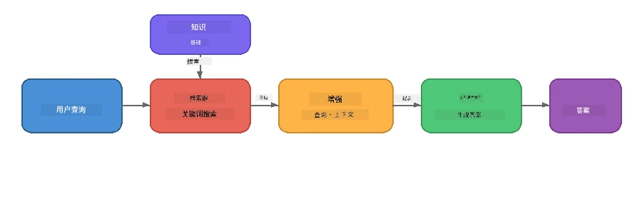

# 第4部分：使用 Foundry Local 构建 RAG 应用

## 概述

大型语言模型功能强大，但它们只知道训练数据中的内容。**检索增强生成（RAG）** 通过在查询时为模型提供相关上下文来解决这个问题——这些上下文来自您自己的文档、数据库或知识库。

在本实验中，您将使用 Foundry Local 构建一个<strong>完全在您的设备上运行</strong>的完整 RAG 流水线。无需云服务，无需向量数据库，无需嵌入 API——只需本地检索和本地模型。

## 学习目标

完成本实验后，您将能够：

- 解释什么是 RAG 以及它为何对 AI 应用重要
- 从文本文档构建本地知识库
- 实现简单的检索函数以查找相关上下文
- 组合一个以检索事实为基础的系统提示
- 在设备上运行完整的检索 → 增强 → 生成流水线
- 理解简单关键词检索与向量搜索之间的权衡

---

## 先决条件

- 完成[第3部分：使用 Foundry Local SDK 与 OpenAI](part3-sdk-and-apis.md)
- 安装 Foundry Local CLI 并下载 `phi-3.5-mini` 模型

---

## 概念：什么是 RAG？

没有 RAG，LLM 只能根据其训练数据回答——这些数据可能已经过时、不完整或缺少您的私密信息：

```
User: "What is Zava's return policy?"
LLM:  "I do not have information about Zava's return policy."  ← No context!
```

有了 RAG，您先<strong>检索</strong>相关文档，然后在<strong>生成</strong>响应之前用这些上下文<strong>增强</strong>提示：



关键见解：**模型不需要“知道”答案；它只需要阅读正确的文档。**

---

## 实验练习

### 练习1：了解知识库

打开您语言的 RAG 示例并检查知识库：

<details>
<summary><b>🐍 Python: <code>python/foundry-local-rag.py</code></b></summary>

知识库是一个包含 `title` 和 `content` 字段的简单字典列表：

```python
KNOWLEDGE_BASE = [
    {
        "title": "Foundry Local Overview",
        "content": (
            "Foundry Local brings the power of Azure AI Foundry to your local "
            "device without requiring an Azure subscription..."
        ),
    },
    {
        "title": "Supported Hardware",
        "content": (
            "Foundry Local automatically selects the best model variant for "
            "your hardware. If you have an Nvidia CUDA GPU it downloads the "
            "CUDA-optimized model..."
        ),
    },
    # ... 更多条目
]
```

每个条目代表一个“知识块”——关于一个主题的集中信息片段。

</details>

<details>
<summary><b>📘 JavaScript: <code>javascript/foundry-local-rag.mjs</code></b></summary>

知识库使用相同结构的对象数组：

```javascript
const KNOWLEDGE_BASE = [
  {
    title: "Foundry Local Overview",
    content:
      "Foundry Local brings the power of Azure AI Foundry to your local " +
      "device without requiring an Azure subscription...",
  },
  {
    title: "Supported Hardware",
    content:
      "Foundry Local automatically selects the best model variant for " +
      "your hardware...",
  },
  // ... 更多条目
];
```

</details>

<details>
<summary><b>💜 C#: <code>csharp/RagPipeline.cs</code></b></summary>

知识库使用命名元组列表：

```csharp
private static readonly List<(string Title, string Content)> KnowledgeBase =
[
    ("Foundry Local Overview",
     "Foundry Local brings the power of Azure AI Foundry to your local " +
     "device without requiring an Azure subscription..."),

    ("Supported Hardware",
     "Foundry Local automatically selects the best model variant for " +
     "your hardware..."),

    // ... more entries
];
```

</details>

> <strong>在实际应用中</strong>，知识库通常来自磁盘文件、数据库、搜索索引或 API。为了本实验的简便，我们使用内存列表。

---

### 练习2：了解检索函数

检索步骤用于找到与用户问题最相关的知识块。此示例使用<strong>关键词重叠</strong>——统计查询中单词在每个知识块中出现的次数：

<details>
<summary><b>🐍 Python</b></summary>

```python
def retrieve(query: str, top_k: int = 2) -> list[dict]:
    """Return the top-k knowledge chunks most relevant to the query."""
    query_words = set(query.lower().split())
    scored = []
    for chunk in KNOWLEDGE_BASE:
        chunk_words = set(chunk["content"].lower().split())
        overlap = len(query_words & chunk_words)
        scored.append((overlap, chunk))
    scored.sort(key=lambda x: x[0], reverse=True)
    return [item[1] for item in scored[:top_k]]
```

</details>

<details>
<summary><b>📘 JavaScript</b></summary>

```javascript
function retrieve(query, topK = 2) {
  const queryWords = new Set(query.toLowerCase().split(/\s+/));
  const scored = KNOWLEDGE_BASE.map((chunk) => {
    const chunkWords = new Set(chunk.content.toLowerCase().split(/\s+/));
    let overlap = 0;
    for (const w of queryWords) {
      if (chunkWords.has(w)) overlap++;
    }
    return { overlap, chunk };
  });
  scored.sort((a, b) => b.overlap - a.overlap);
  return scored.slice(0, topK).map((s) => s.chunk);
}
```

</details>

<details>
<summary><b>💜 C#</b></summary>

```csharp
private static List<(string Title, string Content)> Retrieve(string query, int topK = 2)
{
    var queryWords = new HashSet<string>(
        query.ToLowerInvariant().Split(' ', StringSplitOptions.RemoveEmptyEntries));

    return KnowledgeBase
        .Select(chunk =>
        {
            var chunkWords = new HashSet<string>(
                chunk.Content.ToLowerInvariant().Split(' ', StringSplitOptions.RemoveEmptyEntries));
            var overlap = queryWords.Intersect(chunkWords).Count();
            return (Overlap: overlap, Chunk: chunk);
        })
        .OrderByDescending(x => x.Overlap)
        .Take(topK)
        .Select(x => x.Chunk)
        .ToList();
}
```

</details>

**工作原理：**
1. 将查询拆分为单个单词
2. 对每个知识块，统计查询词出现在该块中的数量
3. 根据重叠分数排序（最高优先）
4. 返回前k个最相关知识块

> **权衡:** 关键词重叠简单但有限，不能理解同义词或语义。生产环境的 RAG 系统通常使用<strong>嵌入向量</strong>和<strong>向量数据库</strong>做语义搜索。但关键词重叠是良好的起点，无需额外依赖。

---

### 练习3：了解增强提示

检索到的上下文会被注入到<strong>系统提示</strong>中，然后发送给模型：

```python
system_prompt = (
    "You are a helpful assistant. Answer the user's question using ONLY "
    "the information provided in the context below. If the context does "
    "not contain enough information, say so.\n\n"
    f"Context:\n{context_text}"
)
```

重要设计决策：
- **“仅使用提供的信息”**——防止模型“幻想”提示中未包含的事实
- **“如果上下文信息不足，则说明”**——鼓励诚实回答“我不知道”
- 上下文放在系统消息中，影响所有回答

---

### 练习4：运行 RAG 流水线

运行完整示例：

**Python:**
```bash
cd python
python foundry-local-rag.py
```

**JavaScript:**
```bash
cd javascript
node foundry-local-rag.mjs
```

**C#:**
```bash
cd csharp
dotnet run rag
```

您应该看到打印出三件事：
1. <strong>提问内容</strong>
2. <strong>检索到的上下文</strong>——从知识库中选出的知识块
3. <strong>答案</strong>——模型基于该上下文生成的回答

示例输出：
```
Question: How do I install Foundry Local and what hardware does it support?

--- Retrieved Context ---
### Installation
On Windows install Foundry Local with: winget install Microsoft.FoundryLocal...

### Supported Hardware
Foundry Local automatically selects the best model variant for your hardware...
-------------------------

Answer: To install Foundry Local, you can use the following methods depending
on your operating system: On Windows, run `winget install Microsoft.FoundryLocal`.
On macOS, use `brew install microsoft/foundrylocal/foundrylocal`...
```

注意模型的答案是<strong>基于</strong>检索上下文的——它只提及知识库文档中的事实。

---

### 练习5：尝试与扩展

尝试以下修改以深化理解：

1. <strong>更换问题</strong>——问知识库中有的内容和没有的内容：
   ```python
   question = "What programming languages does Foundry Local support?"  # ← 在上下文中
   question = "How much does Foundry Local cost?"                       # ← 不在上下文中
   ```
   当答案不在上下文中时，模型能否正确说“我不知道”？

2. <strong>添加新知识块</strong>——向 `KNOWLEDGE_BASE` 中追加新条目：
   ```python
   {
       "title": "Pricing",
       "content": "Foundry Local is completely free and open source under the MIT license.",
   }
   ```
   然后再问价格问题。

3. **更改 `top_k`**——检索更多或更少知识块：
   ```python
   context_chunks = retrieve(question, top_k=3)  # 更多上下文
   context_chunks = retrieve(question, top_k=1)  # 较少上下文
   ```
   上下文量如何影响回答质量？

4. <strong>移除约束指令</strong>——将系统提示改为“你是一个乐于助人的助手。”，看看模型是否开始“虚构”事实。

---

## 深入：优化在设备上运行的 RAG 性能

设备端运行 RAG 面临云端无的约束：有限的内存，无专用 GPU（CPU/NPU 执行），小的模型上下文窗口。以下设计决策针对这些限制，并基于用 Foundry Local 构建的生产级本地 RAG 应用样式。

### 分块策略：固定大小滑动窗口

分块（如何拆分文档）是任何 RAG 系统中最关键的决策之一。设备端场景推荐使用<strong>固定大小带重叠的滑动窗口</strong>作为起点：

| 参数 | 推荐值 | 原因 |
|-----------|------------------|-----|
| <strong>块大小</strong> | ~200 令牌 | 保持检索上下文紧凑，留有 Phi-3.5 Mini 模型上下文窗口空间放系统提示、对话历史和生成输出 |
| <strong>重叠量</strong> | ~25 令牌（12.5%） | 避免块边界的信息丢失——对流程和步骤说明尤为重要 |
| <strong>分词方式</strong> | 空格拆分 | 无依赖，无需分词库，所有计算预算用于 LLM |

重叠作用如滑动窗口：每个新块从前块结束前25令牌开始，因此跨块句子会出现于两个块中。

> **为何不用其他策略？**
> - <strong>基于句子拆分</strong>导致块大小不定；某些安全流程是单长句，难拆分
> - <strong>基于章节拆分</strong>（`##` 标题）导致块大小差异大，有些太小，有些太大不适合模型上下文窗口
> - <strong>语义分块</strong>（基于嵌入的主题检测）检索质量最好，但需要在 Phi-3.5 Mini 旁加载第二模型，8-16 GB 共享内存硬件上风险较大

### 改进检索：TF-IDF 向量

本实验使用关键词重叠可用，但若希望提升检索效果又不引入嵌入模型，**TF-IDF（词频-逆文档频率）** 是极佳的折衷方案：

```
Keyword Overlap  →  TF-IDF Vectors  →  Embedding Models
    (this lab)     (lightweight upgrade)   (production)
  Simple & fast    Better ranking,         Best quality,
  No dependencies  still no ML model       requires embedding model
  ~Basic matching  ~1ms retrieval          ~100-500ms per query
```

TF-IDF 将每个知识块基于词的重要性转换为数值向量，词重要性比较的是词在当前块内的频率与所有块中的逆频率。查询同样被向量化，在检索时用余弦相似度比较。您可以用 SQLite 和纯 JavaScript/Python 实现，无需向量数据库，无需嵌入 API。

> **性能:** 固定大小块上使用 TF-IDF 余弦相似度通常达到<strong>约1ms 检索时延</strong>，相比嵌入模型编码每次查询的100~500ms大幅提升。20+ 文档的分块和索引时间不足1秒。

### 受限设备的边缘/紧凑模式

在资源十分有限的硬件（老旧笔记本、平板、现场设备）上，可以通过调整三个参数减少资源消耗：

| 设置 | 标准模式 | 边缘/紧凑模式 |
|---------|--------------|-------------------|
| <strong>系统提示</strong> | ~300 令牌 | ~80 令牌 |
| <strong>最大输出令牌数</strong> | 1024 | 512 |
| **检索块数（top-k）** | 5 | 3 |

检索块数减少意味着模型处理的上下文更少，降低延迟和内存压力。短系统提示则为实际回答留出更多上下文窗口空间。对上下文窗口每个令牌都宝贵的设备而言，这种权衡值得采取。

### 单模型内存策略

设备端 RAG 最重要原则之一：<strong>只加载一个模型</strong>。如果同时使用嵌入模型做检索<em>和</em>语言模型做生成，有限的 NPU/RAM 就被两个模型分割。轻量检索（关键词重叠、TF-IDF）避免了这个问题：

- 不用嵌入模型与 LLM 争内存
- 冷启动更快——只加载一个模型
- 内存使用可预测——LLM 独享资源
- 可在内存低至8 GB的机器上运行

### 使用 SQLite 作为本地向量存储

对于小到中等文档集合（数百至数千块），<strong>SQLite 完全足够快</strong>做穷举余弦相似度搜索，且零基础设施负担：

- 单一 `.db` 文件，无需服务器进程，无需配置
- 附带每个主流语言运行时（Python `sqlite3`，Node.js `better-sqlite3`，.NET `Microsoft.Data.Sqlite`）
- 将文档块及其 TF-IDF 向量保存在同一表中
- 小规模情况下无需 Pinecone、Qdrant、Chroma、FAISS 等复杂向量库

### 性能总结

这些设计决策结合实现了消费级硬件上的响应式 RAG：

| 指标 | 设备端性能 |
|--------|----------------------|
| <strong>检索延迟</strong> | ~1ms (TF-IDF) 到 ~5ms (关键词重叠) |
| <strong>索引速度</strong> | 20篇文档分块并索引<1秒 |
| <strong>内存模型数</strong> | 1（仅 LLM，无嵌入） |
| <strong>存储开销</strong> | SQLite 中块与向量<1MB |
| <strong>冷启动</strong> | 仅加载单一模型，无嵌入模型启动时间 |
| <strong>硬件门槛</strong> | 8 GB 内存，纯 CPU（无 GPU 需求） |

> **何时升级：** 若需处理数百篇长文档、混合内容类型（表格、代码、散文），或需要语义理解查询，考虑添加嵌入模型并切换到向量相似度搜索。大多数设备端使用场景下，TF-IDF + SQLite 即可以极低资源消耗达到极好效果。

---

## 关键概念

| 概念 | 描述 |
|---------|-------------|
| <strong>检索</strong> | 根据用户查询从知识库中查找相关文档 |
| <strong>增强</strong> | 将检索到的文档插入到提示上下文中 |
| <strong>生成</strong> | LLM 根据提供的上下文生成答案 |
| <strong>分块</strong> | 将大文档拆分为更小、更集中的片段 |
| <strong>约束</strong> | 限制模型只使用提供的上下文（减少幻觉） |
| **Top-k** | 检索的最相关知识块数量 |

---

## 生产环境 RAG 与本实验对比

| 方面 | 本实验 | 设备端优化版 | 云端生产环境 |
|--------|----------|--------------------|-----------------|
| <strong>知识库</strong> | 内存列表 | 磁盘文件，SQLite | 数据库，搜索索引 |
| <strong>检索</strong> | 关键词重叠 | TF-IDF + 余弦相似度 | 向量嵌入 + 相似度搜索 |
| <strong>嵌入</strong> | 无需 | 无需 - 用 TF-IDF 向量 | 嵌入模型（本地或云端） |
| <strong>向量存储</strong> | 无需 | SQLite（单一 `.db` 文件） | FAISS、Chroma、Azure AI Search 等 |
| <strong>分块</strong> | 手动 | 固定大小滑动窗口（约200令牌，重叠25令牌） | 语义或递归分块 |
| <strong>内存模型数</strong> | 1（LLM） | 1（LLM） | 2+（嵌入 + LLM） |
| <strong>检索延迟</strong> | ~5毫秒 | ~1毫秒 | ~100-500毫秒 |
| <strong>规模</strong> | 5个文档 | 数百个文档 | 数百万个文档 |

您在此处学习的模式（检索、增强、生成）在任何规模下都是相同的。检索方法会改进，但整体架构保持不变。中间一栏展示了可在设备上通过轻量技术实现的效果，通常是本地应用的理想选择，在这里您以隐私、离线能力和对外部服务零延迟为代价，放弃了云端规模。

---

## 关键要点

| 概念 | 您学到了什么 |
|---------|------------------|
| RAG 模式 | 检索 + 增强 + 生成：为模型提供正确的上下文，它就能回答关于您的数据的问题 |
| 设备端 | 所有操作均在本地运行，无需云API或向量数据库订阅 |
| 归巩指令 | 系统提示约束对于防止幻觉非常关键 |
| 关键词重叠 | 一个简单但有效的检索起点 |
| TF-IDF + SQLite | 一种轻量级升级路径，无需嵌入模型即可保持检索时间低于1毫秒 |
| 内存中单模型 | 避免在受限硬件上加载嵌入模型和大型语言模型 |
| 分块大小 | 大约200个token并带有重叠，平衡了检索精度与上下文窗口效率 |
| 边缘/紧凑模式 | 对于资源极度受限的设备，使用更少的分块和更短的提示 |
| 通用模式 | 同一RAG架构适用于任何数据源：文档、数据库、API或维基 |

> **想看一个完整的设备端RAG应用吗？** 请查看 [Gas Field Local RAG](https://github.com/leestott/local-rag)，这是使用Foundry Local和Phi-3.5 Mini构建的生产级离线RAG代理，展示了这些优化模式和真实文档集的应用。

---

## 下一步

继续阅读[第5部分：构建AI代理](part5-single-agents.md)，学习如何使用Microsoft Agent Framework构建具有角色、指令和多轮对话的智能代理。